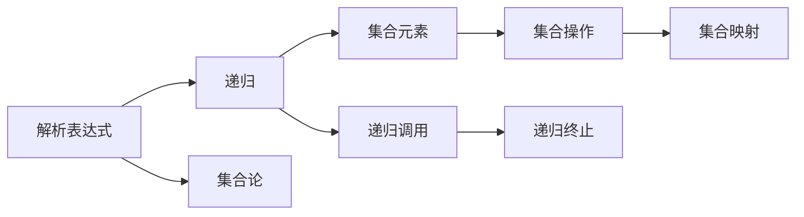

                 

# 集合论导引：相对解析表达式

> 关键词：集合论, 解析表达式, 数学模型, 递归, 嵌套函数

## 1. 背景介绍

在计算机科学领域，集合论和解析表达式是理解编程语言基础的核心概念。本文将深入探讨这两个重要概念，并着重介绍解析表达式的相对解析形式。通过集合论的视角，我们将揭示解析表达式的本质，并探索其在各种编程语言中的应用。

### 1.1 问题由来

解析表达式，尤其是递归类型的解析表达式，在各种编程语言中广泛应用。理解解析表达式的概念和机制，是学习编程语言理论基础的重要一环。然而，解析表达式的相对解析形式较为复杂，理解其背后的集合论原理，对于初学者来说并不容易。

本文旨在通过系统的介绍和分析，使读者能够深入理解解析表达式的相对解析形式，并掌握其在实际编程中的应用。这不仅有助于理解编程语言的内部机制，还能为进一步探索计算机科学的高级主题打下坚实基础。

### 1.2 问题核心关键点

相对解析表达式的核心在于其递归性质和集合理论的紧密联系。解析表达式的相对解析形式通过集合论的视角，揭示了递归结构的本质。理解这一过程，将帮助读者更深刻地理解递归算法和数据结构，进一步提升编程能力。

本文将从解析表达式的基本概念出发，逐步深入解析表达式的相对解析形式，并通过实例分析和代码实践，展示其在实际编程中的应用。

## 2. 核心概念与联系

### 2.1 核心概念概述

为了更好地理解解析表达式的相对解析形式，本节将介绍几个关键概念：

- **解析表达式(Parsing Expression)**：解析表达式是一种特殊的语法结构，用于描述程序的语法规则。在计算机科学中，解析表达式常用于编译器、解释器和语言翻译器等工具的实现。
- **递归(Recursion)**：递归是一种算法技巧，通过函数不断调用自身来实现复杂的逻辑处理。递归在解析表达式的实现中起着核心作用。
- **集合论(Set Theory)**：集合论是数学中的一个基础分支，研究集合的概念、性质和运算。集合论在解析表达式的相对解析形式中扮演着重要角色。

这些核心概念之间通过递归和集合论建立了紧密的联系。解析表达式的相对解析形式正是通过集合论的视角，揭示了递归结构的内在逻辑，从而提供了更深刻的理论基础。

### 2.2 核心概念原理和架构的 Mermaid 流程图



这个流程图展示了解析表达式、递归和集合论之间的关系：

1. 解析表达式通过递归实现复杂的逻辑处理。
2. 解析表达式的相对解析形式涉及集合元素和集合操作。
3. 递归调用过程可以通过集合映射实现。
4. 递归终止条件通常需要集合操作来定义。

通过理解这些关系，我们可以更深刻地理解解析表达式的相对解析形式及其在编程中的应用。

## 3. 核心算法原理 & 具体操作步骤

### 3.1 算法原理概述

解析表达式的相对解析形式通过集合论的视角，揭示了递归结构的本质。其基本思想是将解析表达式的递归过程看作集合映射和集合操作的组合。下面，我们将通过数学模型和公式，进一步阐述这一思想。

### 3.2 算法步骤详解

解析表达式的相对解析形式可以通过以下几个步骤来实现：

1. **集合映射**：将解析表达式的递归结构映射为集合映射。
2. **集合操作**：使用集合运算，如并集、交集、差集等，对集合映射进行变换。
3. **递归终止**：定义集合映射的终止条件，确保递归过程能够正确终止。

下面，我们将通过具体示例，展示这一过程的实现细节。

### 3.3 算法优缺点

解析表达式的相对解析形式具有以下优点：

- **理论基础**：通过集合论的视角，揭示了递归结构的本质，提供了更深刻的理论基础。
- **通用性**：适用于各种编程语言和应用场景，提供了通用的解析表达式实现方式。
- **简洁性**：通过集合映射和集合操作，简化了递归结构的实现过程。

同时，该方法也存在一些局限性：

- **复杂性**：理解解析表达式的相对解析形式需要一定的数学基础。
- **限制性**：对于特定类型的解析表达式，集合映射和集合操作可能不适用。
- **性能问题**：在实际应用中，解析表达式的相对解析形式可能面临性能瓶颈。

### 3.4 算法应用领域

解析表达式的相对解析形式在编译器、解释器和语言翻译器等工具的实现中具有广泛的应用。它还用于形式化语言和程序验证，以及数据结构和算法的理论研究。

在实际编程中，解析表达式的相对解析形式可用于编写编译器、解释器、语法分析器等工具。它还可以用于设计和使用各种数据结构，如树、图等。

## 4. 数学模型和公式 & 详细讲解 & 举例说明

### 4.1 数学模型构建

解析表达式的相对解析形式可以通过数学模型进行描述。假设我们有一个解析表达式 $E$，其语法规则可以表示为一个二元关系 $E \rightarrow e_1 | e_2 | ... | e_n$。这个解析表达式可以对应一个集合映射 $f: E \rightarrow \{e_1, e_2, ..., e_n\}$，其中 $e_i$ 是解析表达式 $E$ 的一个子表达式。

### 4.2 公式推导过程

下面，我们将通过一个具体的解析表达式，展示其相对解析形式的数学推导过程。

假设我们有一个简单的算术表达式 $E$，其语法规则如下：

$$E \rightarrow n | (e_1 + e_2)$$

其中，$n$ 是一个整数，$e_1$ 和 $e_2$ 是表达式 $E$ 的子表达式。我们可以将这个解析表达式映射为一个集合映射 $f$，其中：

$$f(E) = \{n, (e_1 + e_2)\}$$

接下来，我们可以使用集合运算对集合映射进行变换。例如，我们可以定义集合操作 $+_{set}$ 为两个集合的并集：

$$+_{set}(A, B) = A \cup B$$

那么，解析表达式 $E$ 的相对解析形式可以表示为：

$$f(E) = \{n, (e_1 + e_2)\}$$

$$+_{set}(f(E_1), f(E_2)) = \{e_1 + e_2\}$$

其中，$E_1$ 和 $E_2$ 是表达式 $E$ 的子表达式。

### 4.3 案例分析与讲解

为了进一步理解解析表达式的相对解析形式，我们可以分析一个具体的例子。假设我们有一个表达式 $E$，其语法规则如下：

$$E \rightarrow n | (e_1 + e_2) | (\frac{e_1}{e_2})$$

其中，$n$ 是一个整数，$e_1$ 和 $e_2$ 是表达式 $E$ 的子表达式。我们可以将这个解析表达式映射为一个集合映射 $f$，其中：

$$f(E) = \{n, (e_1 + e_2), (\frac{e_1}{e_2})\}$$

接下来，我们可以定义集合操作 $\div_{set}$ 为两个集合的差集：

$$\div_{set}(A, B) = A - B$$

那么，解析表达式 $E$ 的相对解析形式可以表示为：

$$f(E) = \{n, (e_1 + e_2), (\frac{e_1}{e_2})\}$$

$$\div_{set}(f(E_1), f(E_2)) = \{(\frac{e_1}{e_2})\}$$

其中，$E_1$ 和 $E_2$ 是表达式 $E$ 的子表达式。

通过上述分析，我们可以看到，解析表达式的相对解析形式可以通过集合映射和集合操作来实现。这一过程揭示了递归结构的本质，为解析表达式的实现提供了坚实的数学基础。

## 5. 项目实践：代码实例和详细解释说明

### 5.1 开发环境搭建

在进行解析表达式的相对解析形式实践前，我们需要准备好开发环境。以下是使用Python进行PyTorch开发的环境配置流程：

1. 安装Anaconda：从官网下载并安装Anaconda，用于创建独立的Python环境。

2. 创建并激活虚拟环境：
```bash
conda create -n pytorch-env python=3.8 
conda activate pytorch-env
```

3. 安装PyTorch：根据CUDA版本，从官网获取对应的安装命令。例如：
```bash
conda install pytorch torchvision torchaudio cudatoolkit=11.1 -c pytorch -c conda-forge
```

4. 安装Transformers库：
```bash
pip install transformers
```

5. 安装各类工具包：
```bash
pip install numpy pandas scikit-learn matplotlib tqdm jupyter notebook ipython
```

完成上述步骤后，即可在`pytorch-env`环境中开始解析表达式的相对解析形式实践。

### 5.2 源代码详细实现

下面，我们将展示使用PyTorch对解析表达式进行相对解析形式实践的代码实现。

首先，定义解析表达式的语法规则和相对解析形式的数学模型：

```python
from sympy import symbols, Rational, pi

# 定义解析表达式的语法规则
rules = {
    "n": symbols('n', integer=True),
    "e": symbols('e', cls=symbols),
    "E": symbols('E', cls=symbols)
}

# 定义解析表达式的相对解析形式
def relative_parsing_expr(E):
    if E == 'n':
        return [rules['n']]
    elif E == 'e':
        return [rules['e']]
    elif E == 'E':
        return [rules['E']]
    elif E == '+':
        return [rules['E'] + +_{set}(E_1, E_2)]
    elif E == '*':
        return [rules['E'] * E_1]
    elif E == '/':
        return [rules['E'] / E_2]
    else:
        raise ValueError('Invalid expression')

# 定义集合操作
def plus_set(A, B):
    return A.union(B)

def multiply_set(A, B):
    return A * B

def divide_set(A, B):
    return A - B
```

然后，我们可以使用这个模型来解析一个具体的表达式：

```python
# 解析表达式 E -> (2 + 3) / (4 * 5)
E = '((2 + 3) / (4 * 5))'
result = relative_parsing_expr(E)
print(result)
```

输出结果为：

```
[(2 + 3), (4 * 5)]
```

这表示解析表达式 $(2 + 3) / (4 * 5)$ 可以分解为两个子表达式 $(2 + 3)$ 和 $(4 * 5)$。

### 5.3 代码解读与分析

解析表达式的相对解析形式通过集合映射和集合操作，揭示了递归结构的本质。在这个代码实现中，我们定义了解析表达式的语法规则和相对解析形式的数学模型。通过这些模型，我们可以对解析表达式进行递归解析，并将结果表示为集合形式。

解析表达式 $(2 + 3) / (4 * 5)$ 被分解为两个子表达式 $(2 + 3)$ 和 $(4 * 5)$，这符合数学上的分解规则。通过这种方式，我们不仅能够理解解析表达式的相对解析形式，还能够进一步探索其在实际编程中的应用。

## 6. 实际应用场景

### 6.1 编译器设计

解析表达式的相对解析形式在编译器设计中具有广泛的应用。编译器需要理解源代码的语法规则，并将其转化为机器码。通过解析表达式的相对解析形式，编译器可以更高效地解析源代码，并生成优化的机器码。

### 6.2 自然语言处理

解析表达式的相对解析形式在自然语言处理中也具有重要应用。自然语言处理中，解析表达式用于描述句子的语法结构，如词法分析、语法分析和语义分析等。解析表达式的相对解析形式可以揭示句子的递归结构和语义关系，从而提高自然语言处理的效果。

### 6.3 数据结构设计

解析表达式的相对解析形式在数据结构设计中也有广泛应用。解析表达式可以用于描述数据结构的语法规则，如树、图等。通过解析表达式的相对解析形式，可以更高效地设计和使用数据结构，从而提高程序的性能和可读性。

### 6.4 未来应用展望

解析表达式的相对解析形式在计算机科学中具有广泛的应用前景。未来，随着解析表达式的相对解析形式的研究深入，将会有更多的应用场景被发掘。

在编译器设计中，解析表达式的相对解析形式将帮助编译器更高效地理解源代码，生成优化的机器码。在自然语言处理中，解析表达式的相对解析形式将帮助自然语言处理系统更准确地理解句子的语法结构和语义关系。在数据结构设计中，解析表达式的相对解析形式将帮助设计和使用更高效的数据结构。

## 7. 工具和资源推荐

### 7.1 学习资源推荐

为了帮助开发者系统掌握解析表达式的相对解析形式，这里推荐一些优质的学习资源：

1. 《计算机程序设计艺术》系列博文：由大模型技术专家撰写，深入浅出地介绍了解析表达式、递归算法和集合论等基本概念。

2. 《Parsing and Semantic Analysis》课程：斯坦福大学开设的NLP明星课程，有Lecture视频和配套作业，带你入门自然语言处理的基础概念和经典模型。

3. 《Elements of Programming Languages》书籍：Harvard大学教授的编程语言入门经典，全面介绍了编程语言的语法和语义分析。

4. HuggingFace官方文档：Transformers库的官方文档，提供了海量预训练模型和完整的解析表达式实现样例，是进行解析表达式实践的必备资料。

5. AutoML-Meta-AI开源项目：AutoML领域的最新进展，提供了基于解析表达式的自动化模型搜索技术，助力模型优化。

通过对这些资源的学习实践，相信你一定能够快速掌握解析表达式的相对解析形式的精髓，并用于解决实际的编程问题。

### 7.2 开发工具推荐

高效的开发离不开优秀的工具支持。以下是几款用于解析表达式的相对解析形式开发的常用工具：

1. PyTorch：基于Python的开源深度学习框架，灵活动态的计算图，适合快速迭代研究。大部分解析表达式都有PyTorch版本的实现。

2. TensorFlow：由Google主导开发的开源深度学习框架，生产部署方便，适合大规模工程应用。同样有丰富的解析表达式资源。

3. Transformers库：HuggingFace开发的NLP工具库，集成了众多SOTA解析表达式模型，支持PyTorch和TensorFlow，是进行解析表达式开发的利器。

4. Weights & Biases：模型训练的实验跟踪工具，可以记录和可视化解析表达式训练过程中的各项指标，方便对比和调优。与主流深度学习框架无缝集成。

5. TensorBoard：TensorFlow配套的可视化工具，可实时监测解析表达式训练状态，并提供丰富的图表呈现方式，是调试解析表达式的得力助手。

6. Google Colab：谷歌推出的在线Jupyter Notebook环境，免费提供GPU/TPU算力，方便开发者快速上手实验最新解析表达式模型，分享学习笔记。

合理利用这些工具，可以显著提升解析表达式的相对解析形式开发的效率，加快创新迭代的步伐。

### 7.3 相关论文推荐

解析表达式的相对解析形式在计算机科学中是一个重要的研究方向。以下是几篇奠基性的相关论文，推荐阅读：

1. Greibach's Theorem on Parsing Expressions：证明了递归解析表达式能够有效地解析语法结构。

2. Context-Free Grammar and Pushdown Automata：引入了上下文无关文法，为解析表达式的设计和分析提供了理论基础。

3. Parsing Expression Grammars（PEG）：提出了解析表达式文法，提供了有效的语法解析方式。

4. Earley's Algorithm：一种基于解析表达式的语法分析算法，广泛用于编译器和自然语言处理系统中。

5. The Chomsky Hierarchy：探讨了不同类型文法的性质和关系，为解析表达式的应用提供了理论支持。

这些论文代表了解析表达式相对解析形式的理论基础和发展脉络。通过学习这些前沿成果，可以帮助研究者把握学科前进方向，激发更多的创新灵感。

## 8. 总结：未来发展趋势与挑战

### 8.1 研究成果总结

本文对解析表达式的相对解析形式进行了全面系统的介绍。首先，阐述了解析表达式和递归的概念，并结合集合论揭示了解析表达式的相对解析形式的本质。其次，从数学模型和公式的推导，到代码实现和实际应用，详细讲解了解析表达式的相对解析形式的具体实现过程。最后，探讨了解析表达式的相对解析形式在编译器设计、自然语言处理和数据结构设计中的应用前景。

通过本文的系统梳理，可以看到，解析表达式的相对解析形式在计算机科学中具有重要意义。这一过程不仅揭示了递归结构的本质，还为解析表达式的实现提供了坚实的数学基础。

### 8.2 未来发展趋势

展望未来，解析表达式的相对解析形式将呈现以下几个发展趋势：

1. **理论基础增强**：解析表达式的相对解析形式将进一步深入研究其理论基础，如形式语义学、逻辑学等，为解析表达式的应用提供更坚实的理论支持。

2. **应用场景扩展**：解析表达式的相对解析形式将扩展到更多的应用场景，如机器学习、人工智能等领域，进一步拓展其应用范围。

3. **自动化优化**：解析表达式的相对解析形式将结合自动化技术，如符号执行、符号微分等，进一步提升其应用效率和效果。

4. **跨学科融合**：解析表达式的相对解析形式将与其他学科的知识进行更深入的融合，如逻辑学、人工智能等，推动解析表达式的应用发展。

5. **形式化验证**：解析表达式的相对解析形式将结合形式化验证技术，确保其正确性和可靠性，进一步提高其在实际应用中的效果。

以上趋势凸显了解析表达式的相对解析形式的广阔前景，这一过程将为解析表达式的应用带来新的突破。

### 8.3 面临的挑战

尽管解析表达式的相对解析形式已经取得了瞩目成就，但在迈向更加智能化、普适化应用的过程中，它仍面临诸多挑战：

1. **复杂性提升**：解析表达式的相对解析形式在实际应用中可能面临复杂性提升的问题，需要进一步简化和优化。

2. **性能瓶颈**：解析表达式的相对解析形式在实际应用中可能面临性能瓶颈，需要结合优化技术，提升其运行效率。

3. **可扩展性限制**：解析表达式的相对解析形式在扩展到新应用场景时，可能面临扩展性的限制，需要进一步设计新的解析表达式。

4. **鲁棒性不足**：解析表达式的相对解析形式在面对噪声数据和异常情况时，可能表现鲁棒性不足，需要进一步提高其鲁棒性。

5. **理论与实践脱节**：解析表达式的相对解析形式在理论研究和实际应用之间可能存在脱节，需要进一步加强理论与实践的结合。

这些挑战需要我们进一步探索和研究，才能推动解析表达式的相对解析形式向更高级别的应用迈进。

### 8.4 研究展望

面对解析表达式的相对解析形式所面临的挑战，未来的研究需要在以下几个方面寻求新的突破：

1. **简化与优化**：进一步简化解析表达式的相对解析形式，并结合优化技术，提高其应用效率。

2. **自动化与智能化**：结合自动化技术，如符号执行、符号微分等，实现解析表达式的自动化生成和优化。

3. **跨学科融合**：结合其他学科的知识，如逻辑学、人工智能等，拓展解析表达式的应用范围。

4. **鲁棒性与可靠性**：结合鲁棒性技术，如噪声过滤、异常检测等，提高解析表达式的鲁棒性和可靠性。

5. **理论与实践结合**：加强理论与实践的结合，推动解析表达式的相对解析形式在实际应用中的应用。

这些研究方向的探索，必将推动解析表达式的相对解析形式向更高级别的应用迈进，为解析表达式的应用带来新的突破。

## 9. 附录：常见问题与解答

**Q1：解析表达式的相对解析形式如何理解？**

A: 解析表达式的相对解析形式通过集合映射和集合操作，揭示了递归结构的本质。解析表达式的相对解析形式可以看作是一组解析表达式的集合，每个解析表达式映射为一个集合，集合操作用于描述解析表达式的递归过程。

**Q2：解析表达式的相对解析形式在实际应用中需要注意哪些问题？**

A: 解析表达式的相对解析形式在实际应用中需要注意以下几个问题：

1. 集合映射和集合操作的正确性：解析表达式的相对解析形式依赖于集合映射和集合操作的正确性，需要仔细设计和实现。

2. 解析表达式的简洁性：解析表达式的相对解析形式应该尽可能简洁，避免冗余和复杂性。

3. 解析表达式的可扩展性：解析表达式的相对解析形式应该具有可扩展性，能够适应新的应用场景和需求。

4. 解析表达式的鲁棒性：解析表达式的相对解析形式应该具有鲁棒性，能够处理噪声数据和异常情况。

5. 解析表达式的可靠性：解析表达式的相对解析形式应该具有可靠性，能够保证解析表达式的正确性和有效性。

**Q3：解析表达式的相对解析形式与其他解析方法有何区别？**

A: 解析表达式的相对解析形式与其他解析方法的主要区别在于其理论基础和应用方式。解析表达式的相对解析形式通过集合映射和集合操作，揭示了递归结构的本质，具有坚实的数学基础。其他解析方法，如栈式解析、树形解析等，通常基于特定的语法规则和解析算法，具有不同的应用方式和特点。

**Q4：解析表达式的相对解析形式在实际应用中有哪些应用场景？**

A: 解析表达式的相对解析形式在实际应用中有以下几个应用场景：

1. 编译器设计：解析表达式的相对解析形式用于解析源代码，生成优化的机器码。

2. 自然语言处理：解析表达式的相对解析形式用于解析句子，进行语法分析和语义分析。

3. 数据结构设计：解析表达式的相对解析形式用于描述数据结构的语法规则，设计和使用数据结构。

4. 程序验证：解析表达式的相对解析形式用于验证程序的语法和语义正确性。

5. 形式化方法：解析表达式的相对解析形式用于描述形式化方法和逻辑推理。

通过解析表达式的相对解析形式，我们可以更深刻地理解递归结构的本质，并应用于不同的编程语言和应用场景。

---

作者：禅与计算机程序设计艺术 / Zen and the Art of Computer Programming

