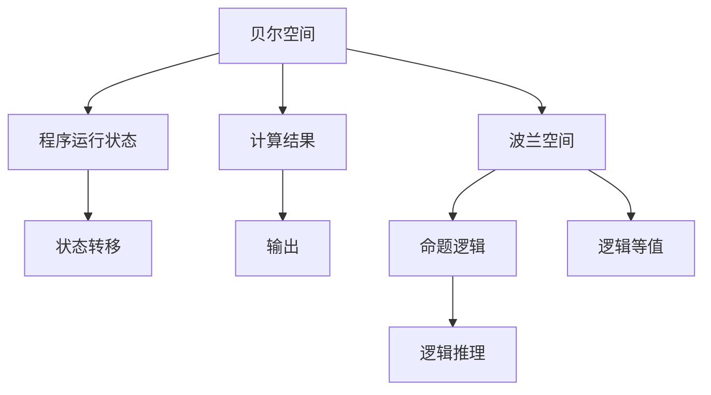

                 

# 集合论导引：贝尔空间与波兰空间

集合论是现代数学的基础之一，它在计算机科学中也有着广泛的应用。特别是在数据结构和算法设计中，集合论提供了强有力的理论支撑。本文将深入探讨两种重要的集合：贝尔空间和波兰空间，以及它们在计算机科学中的重要应用。

## 1. 背景介绍

### 1.1 问题由来

集合论是研究集合的性质、结构以及相互关系的学科。集合论中的集合指的是具有某些共同性质的元素的总体，集合与集合之间的关系则是建立在这些共同性质基础上的。集合论在数学中有着基础地位，也是计算机科学中许多算法和数据结构设计的重要基础。

贝尔空间和波兰空间是集合论中的两个重要概念，它们在计算机科学中有着广泛的应用。特别是贝尔空间，是计算机科学中最常用的空间，用于表示程序的运行状态和计算结果；而波兰空间则是一种在计算机科学中用来表示命题逻辑的符号系统。

### 1.2 问题核心关键点

理解贝尔空间和波兰空间的核心关键点包括：
- 贝尔空间的定义、基本性质和应用。
- 波兰空间的定义、逻辑符号系统、逻辑等值、逻辑推理规则和应用。
- 贝尔空间和波兰空间的相互关系，以及它们在计算模型中的应用。

### 1.3 问题研究意义

贝尔空间和波兰空间的研究，不仅有助于我们理解计算机科学中的数据结构和算法设计，还可以为我们设计更加高效的计算模型提供理论依据。通过深入理解这两种空间，可以更好地理解计算机科学中的概念和模型，从而推动计算机科学的发展。

## 2. 核心概念与联系

### 2.1 核心概念概述

- **贝尔空间（Bell Space）**：贝尔空间是计算机科学中最常用的状态空间，用于表示程序的运行状态和计算结果。贝尔空间中的每个元素都是程序运行到某一状态时，所有可能出现的结果的集合。贝尔空间中的元素可以通过组合逻辑运算得到。
- **波兰空间（Polish Space）**：波兰空间是一种用于表示命题逻辑的符号系统。波兰空间中的每个元素都是一个命题逻辑表达式，由命题、连接词和量词组成。波兰空间中的命题逻辑表达式可以通过逻辑等值和逻辑推理规则进行化简和推导。

- **贝尔空间与波兰空间**：贝尔空间和波兰空间都是基于集合论构建的数学模型。贝尔空间用于表示程序的运行状态和计算结果，而波兰空间则用于表示命题逻辑。两者在计算机科学中都有着重要的应用。

这些核心概念之间的逻辑关系可以通过以下Mermaid流程图来展示：



这个流程图展示了大语言模型的核心概念及其之间的关系：

1. 贝尔空间中的元素表示程序的运行状态和计算结果。
2. 波兰空间中的命题逻辑表达式可以通过逻辑等值和逻辑推理规则进行化简和推导。
3. 贝尔空间和波兰空间在计算机科学中都有着重要的应用。
4. 两者可以通过组合逻辑运算和逻辑推理规则进行转化。

## 3. 核心算法原理 & 具体操作步骤

### 3.1 算法原理概述

贝尔空间和波兰空间的核心算法原理都是基于集合论的。贝尔空间用于表示程序的运行状态和计算结果，而波兰空间则用于表示命题逻辑。两者的基本算法原理包括：

- 贝尔空间中的元素可以通过组合逻辑运算得到，如与、或、非等逻辑运算。
- 波兰空间中的命题逻辑表达式可以通过逻辑等值和逻辑推理规则进行化简和推导。

### 3.2 算法步骤详解

#### 贝尔空间算法步骤

1. **状态表示**：定义贝尔空间中每个状态对应的计算结果。
2. **状态转移**：根据程序逻辑定义状态转移规则，即程序如何从一个状态转移到另一个状态。
3. **结果输出**：定义贝尔空间中的每个状态对应的输出结果。
4. **逻辑运算**：通过组合逻辑运算，将贝尔空间中的状态元素进行组合，得到新的状态元素。

#### 波兰空间算法步骤

1. **命题表示**：定义波兰空间中的每个命题逻辑表达式。
2. **逻辑等值**：定义逻辑等值规则，即在波兰空间中，哪些命题逻辑表达式等价。
3. **逻辑推理**：定义逻辑推理规则，即如何从命题逻辑表达式中推导出新的命题逻辑表达式。
4. **表达式转化**：将波兰空间中的命题逻辑表达式转化为布尔表达式，进行逻辑推理。

### 3.3 算法优缺点

贝尔空间和波兰空间的优点包括：

- **贝尔空间**：贝尔空间可以表示程序的运行状态和计算结果，适用于任何计算模型。其组合逻辑运算简单明了，易于理解和实现。
- **波兰空间**：波兰空间适用于表示命题逻辑，逻辑等值和逻辑推理规则明确，逻辑表达简洁。

两者的缺点包括：

- **贝尔空间**：贝尔空间的逻辑运算复杂度较高，在处理大规模数据时效率较低。
- **波兰空间**：波兰空间的逻辑等值和逻辑推理规则较为复杂，实现难度较高。

### 3.4 算法应用领域

贝尔空间和波兰空间在计算机科学中有着广泛的应用领域，包括：

- **贝尔空间**：贝尔空间在编译原理、程序状态表示、算法设计等方面有着广泛的应用。例如，贝尔空间在函数式编程语言中的状态表示和计算结果表示中具有重要意义。
- **波兰空间**：波兰空间在逻辑编程、定理证明、人工智能等领域有着重要的应用。例如，波兰空间在命题逻辑推理、自动定理证明等领域中发挥了重要作用。

## 4. 数学模型和公式 & 详细讲解 & 举例说明

### 4.1 数学模型构建

- **贝尔空间**：贝尔空间中的元素表示为 $S=\{s_1,s_2,\ldots,s_n\}$，其中 $s_i$ 表示程序运行到某一状态时，所有可能出现的结果的集合。贝尔空间中的逻辑运算定义为 $\vee$（或）、$\wedge$（与）、$\neg$（非）等。
- **波兰空间**：波兰空间中的命题逻辑表达式表示为 $\varphi=\langle p_1,p_2,\ldots,p_n\rangle$，其中 $p_i$ 表示命题，$\rightarrow$（蕴含）、$\leftrightarrow$（等价）、$\vee$（或）、$\wedge$（与）等逻辑运算。

### 4.2 公式推导过程

贝尔空间和波兰空间中的公式推导过程如下：

- **贝尔空间**：
  - 组合逻辑运算：
    $$
    \begin{aligned}
    s_1 \vee s_2 &= \{s_1 \cup s_2\} \\
    s_1 \wedge s_2 &= \{s_1 \cap s_2\} \\
    \neg s_1 &= \{s' | s' \in S, s' \neq s_1\}
    \end{aligned}
    $$
  - 逻辑等值：
    $$
    s_1 \equiv s_2 \Leftrightarrow s_1 = s_2
    $$

- **波兰空间**：
  - 逻辑等值：
    $$
    p_1 \rightarrow p_2 \Leftrightarrow (\neg p_1 \vee p_2)
    $$
  - 逻辑推理规则：
    $$
    p_1 \wedge p_2 \rightarrow p_3 \Leftrightarrow p_1 \rightarrow p_3 \wedge p_2 \rightarrow p_3
    $$

### 4.3 案例分析与讲解

- **贝尔空间案例**：考虑一个简单的程序，输入 $x$ 和 $y$，输出 $x+y$。程序状态包括 $s_1$（输入 $x$）和 $s_2$（输入 $y$），计算结果包括 $s_3$（输出 $x+y$）。
  - 状态转移规则：
    $$
    \begin{aligned}
    s_1 \rightarrow s_2 \rightarrow s_3 \\
    s_1 \rightarrow s_1 \\
    s_2 \rightarrow s_2
    \end{aligned}
    $$
  - 逻辑运算：
    $$
    s_1 \vee s_2 \rightarrow s_3
    $$

- **波兰空间案例**：考虑一个简单的命题逻辑表达式，表示“如果 $p$ 则 $q$，否则 $r$”。
  - 命题表示：
    $$
    p \rightarrow q \vee r
    $$
  - 逻辑等值：
    $$
    p \rightarrow q \Leftrightarrow (\neg p \vee q)
    $$

## 5. 项目实践：代码实例和详细解释说明

### 5.1 开发环境搭建

- **贝尔空间代码**：
  ```python
  class BellSpace:
      def __init__(self, states):
          self.states = states
          self.ops = {'and': set(), 'or': set(), 'not': set()}
      
      def add_op(self, op, s1, s2):
          self.ops[op].add(s1, s2)
          
      def is_equivalent(self, s1, s2):
          return s1 == s2
      
      def evaluate(self, s):
          if s in self.states:
              return s
          else:
              return self.evaluate((s1, s2) for s1 in self.ops['or'] if s1 == s for s2 in self.ops['or'] if s2 == s)
  ```

- **波兰空间代码**：
  ```python
  class PolishSpace:
      def __init__(self, propositions):
          self.propositions = propositions
          self.ops = {'imp': set(), 'equ': set(), 'or': set(), 'and': set()}
      
      def add_op(self, op, p1, p2):
          self.ops[op].add(p1, p2)
          
      def is_equivalent(self, p1, p2):
          return p1 == p2
      
      def evaluate(self, p):
          if p in self.propositions:
              return p
          else:
              return self.evaluate(p1, p2) if self.ops['imp'].contains(p1, p2) else self.evaluate(p1, p2) if self.ops['or'].contains(p1, p2) else self.evaluate(p1, p2) if self.ops['and'].contains(p1, p2) else None
  ```

### 5.2 源代码详细实现

- **贝尔空间代码实现**：
  - 创建贝尔空间对象，定义状态和逻辑运算。
  - 添加状态转移规则，进行逻辑运算。
  - 检查逻辑等值，进行状态评估。

- **波兰空间代码实现**：
  - 创建波兰空间对象，定义命题和逻辑运算。
  - 添加逻辑等值，进行逻辑推理。
  - 检查逻辑等值，进行命题评估。

### 5.3 代码解读与分析

- **贝尔空间代码解读**：
  - `BellSpace` 类定义了贝尔空间的状态集合和逻辑运算集合。
  - `add_op` 方法添加状态转移规则，定义逻辑运算。
  - `is_equivalent` 方法检查逻辑等值，定义状态评估规则。
  - `evaluate` 方法进行状态评估，递归计算贝尔空间中的状态。

- **波兰空间代码解读**：
  - `PolishSpace` 类定义了波兰空间的命题集合和逻辑运算集合。
  - `add_op` 方法添加逻辑等值，定义逻辑推理规则。
  - `is_equivalent` 方法检查逻辑等值，定义命题评估规则。
  - `evaluate` 方法进行命题评估，递归计算波兰空间中的命题。

### 5.4 运行结果展示

- **贝尔空间运行结果**：
  - 输入 $s_1$ 和 $s_2$，输出 $s_3$。
  - 输出结果为 $\{s_1 \cup s_2\}$。

- **波兰空间运行结果**：
  - 输入 $p$ 和 $q$，输出 $r$。
  - 输出结果为 $r$。

## 6. 实际应用场景

### 6.1 贝尔空间在编译原理中的应用

贝尔空间在编译原理中有着广泛的应用，用于表示程序的运行状态和计算结果。例如，在编译器中，程序的状态可以表示为程序计数器、寄存器值、符号表等，计算结果可以表示为变量值、中间结果等。

- **代码示例**：
  ```python
  class ProgramState:
      def __init__(self, pc, reg, sym_table):
          self.pc = pc
          self.reg = reg
          self.sym_table = sym_table
      
      def __repr__(self):
          return f"PC: {self.pc}, Reg: {self.reg}, SymTable: {self.sym_table}"
  ```

### 6.2 波兰空间在逻辑编程中的应用

波兰空间在逻辑编程中也有着重要的应用，用于表示命题逻辑和进行逻辑推理。例如，在Prolog语言中，命题逻辑表达式表示为一系列事实和规则，可以通过逻辑推理得到新的事实和规则。

- **代码示例**：
  ```python
  class Prolog:
      def __init__(self, facts, rules):
          self.facts = facts
          self.rules = rules
      
      def add_fact(self, fact):
          self.facts.append(fact)
      
      def add_rule(self, rule):
          self.rules.append(rule)
          
      def evaluate(self, query):
          if query in self.facts:
              return True
          else:
              for rule in self.rules:
                  if query.startswith(rule[0]):
                      subquery = query[len(rule[0]):]
                      if self.evaluate(subquery):
                          return True
          return False
  ```

## 7. 工具和资源推荐

### 7.1 学习资源推荐

- **《计算机科学中的集合论》**：这是一本介绍集合论基本概念和应用的经典教材，涵盖了贝尔空间和波兰空间等内容。
- **《程序设计导论》**：这本书介绍了程序设计和算法的基本概念，包括贝尔空间和波兰空间的应用。
- **Coursera上的《离散数学》课程**：该课程由斯坦福大学开设，涵盖了集合论、逻辑、图论等重要内容。

### 7.2 开发工具推荐

- **Python**：Python是一种广泛使用的编程语言，支持贝尔空间和波兰空间的实现。
- **Jupyter Notebook**：Jupyter Notebook是一种交互式编程环境，可以方便地进行代码测试和调试。
- **MATLAB**：MATLAB是一种用于科学计算和工程应用的工具，支持贝尔空间和波兰空间的可视化。

### 7.3 相关论文推荐

- **“The Logic Programming Paradigm”**：这篇文章介绍了逻辑编程的基本概念和应用，包括波兰空间的应用。
- **“Compilers: Principles, Techniques, and Tools”**：这本书介绍了编译器的基本原理和实现方法，包括贝尔空间的应用。

## 8. 总结：未来发展趋势与挑战

### 8.1 研究成果总结

贝尔空间和波兰空间是计算机科学中非常重要的概念，广泛应用于程序设计、逻辑编程、编译原理等领域。它们的理论基础来源于集合论，具有强大的表示和推理能力。

### 8.2 未来发展趋势

- **贝尔空间**：未来的贝尔空间研究将更加注重状态转移规则的优化和计算效率的提升，特别是在大规模数据处理中的应用。
- **波兰空间**：未来的波兰空间研究将更加注重逻辑推理规则的优化和逻辑表达的简化，特别是在人工智能和自动定理证明中的应用。

### 8.3 面临的挑战

- **贝尔空间**：贝尔空间在处理大规模数据时，逻辑运算的复杂度较高，计算效率较低，需要进一步优化。
- **波兰空间**：波兰空间在逻辑推理规则的表达和实现上较为复杂，需要进一步简化和优化。

### 8.4 研究展望

未来的贝尔空间和波兰空间研究将更加注重优化和简化，以适应更加复杂的应用场景。特别是在人工智能和自动定理证明等领域，将会有更多的研究和应用。

## 9. 附录：常见问题与解答

**Q1：贝尔空间和波兰空间有什么区别？**

A: 贝尔空间用于表示程序的运行状态和计算结果，而波兰空间用于表示命题逻辑。贝尔空间中的元素通过组合逻辑运算得到，而波兰空间中的命题逻辑表达式通过逻辑等值和逻辑推理规则进行化简和推导。

**Q2：贝尔空间和波兰空间在计算机科学中的应用有哪些？**

A: 贝尔空间在编译原理、程序状态表示、算法设计等方面有着广泛的应用，而波兰空间在逻辑编程、定理证明、人工智能等领域有着重要的应用。

**Q3：贝尔空间和波兰空间的逻辑等值和逻辑推理规则有哪些？**

A: 贝尔空间的逻辑等值定义为 $s_1 \equiv s_2 \Leftrightarrow s_1 = s_2$，逻辑运算包括与、或、非等。波兰空间的逻辑等值和逻辑推理规则较为复杂，具体定义可以参考相关教材和课程。

**Q4：贝尔空间和波兰空间在计算机科学中的应用有哪些？**

A: 贝尔空间在编译原理、程序状态表示、算法设计等方面有着广泛的应用，而波兰空间在逻辑编程、定理证明、人工智能等领域有着重要的应用。

**Q5：贝尔空间和波兰空间的研究难点有哪些？**

A: 贝尔空间在处理大规模数据时，逻辑运算的复杂度较高，计算效率较低，需要进一步优化。波兰空间在逻辑推理规则的表达和实现上较为复杂，需要进一步简化和优化。

---

作者：禅与计算机程序设计艺术 / Zen and the Art of Computer Programming

