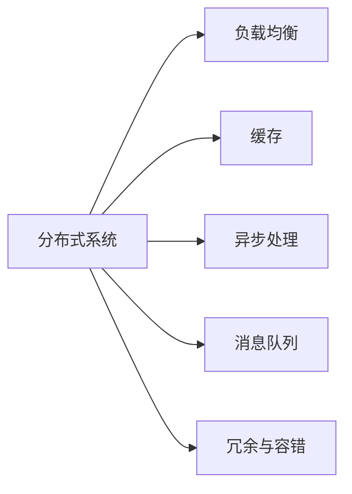

                 

# 高吞吐量系统设计的实际案例

## 1. 背景介绍

### 1.1 问题由来

在互联网和云服务的时代，企业面临着前所未有的挑战。随着用户数量的爆炸式增长和数据量的指数级增加，系统设计者必须面对极端的负载和延迟要求，以确保服务的高可用性和稳定运行。高吞吐量系统（High Throughput Systems），尤其是分布式系统，成为了企业IT架构的核心部分。这些系统需要支持每秒数万个请求，同时保证低延迟和高可用性。因此，高效的设计和高性能的实现成为关键。

### 1.2 问题核心关键点

高吞吐量系统设计涉及多个关键点，包括但不限于：

- **可扩展性**：系统必须能够水平或垂直扩展，以应对不断增长的负载。
- **高可用性**：系统必须能够在故障时提供无中断的服务。
- **低延迟**：系统需要尽可能快速响应用户请求。
- **弹性资源管理**：系统应能根据负载动态调整资源分配，以最优成本和效率运行。
- **性能监控与调优**：系统需要实时监控性能指标，及时发现和解决问题。

### 1.3 问题研究意义

研究高吞吐量系统设计的实际案例，对于理解和实践高效、可靠的系统架构具有重要意义。通过分析已有的成功案例，开发者可以从中汲取经验，应用到自身的项目中，避免重复错误，提升系统的性能和稳定性。

## 2. 核心概念与联系

### 2.1 核心概念概述

为了更好地理解高吞吐量系统的设计，首先需要梳理几个核心概念：

- **分布式系统**：由多个独立的计算节点组成的系统，用于提高系统的可扩展性和容错性。
- **负载均衡**：将请求分发到多个计算节点，以均衡负载，提高系统吞吐量。
- **缓存**：在数据访问频繁的部分引入缓存机制，减少数据库压力，提升响应速度。
- **异步处理**：通过异步IO等技术，优化资源利用，降低响应时间。
- **消息队列**：用于解耦系统组件，提高系统并发能力和容错性。
- **冗余与容错**：通过数据复制和故障转移等机制，确保系统的高可用性。

这些概念之间的联系如下：



通过这些关键技术，我们可以构建一个高性能、高可用的高吞吐量系统。

## 3. 核心算法原理 & 具体操作步骤
### 3.1 算法原理概述

高吞吐量系统的设计通常基于以下算法原理：

- **分布式算法**：用于在多个节点之间合理分配任务，提高系统整体吞吐量。
- **缓存一致性算法**：用于在分布式缓存系统中保持数据一致性，防止数据冲突和丢失。
- **读写分离算法**：通过将读操作与写操作分离，提高系统并发处理能力。
- **负载均衡算法**：通过算法决定请求的分发，避免节点过载，提高系统的吞吐量和响应速度。
- **容错与恢复算法**：通过自动化的容错机制和恢复策略，确保系统在故障时的快速恢复。

### 3.2 算法步骤详解

构建高吞吐量系统通常包括以下关键步骤：

1. **需求分析**：明确系统需要处理的最大请求量、响应时间和高可用性要求。
2. **系统架构设计**：设计系统拓扑结构、组件分工和通信协议。
3. **分布式算法实现**：根据需求选择合适的分布式算法，实现任务的合理分配和节点的负载均衡。
4. **缓存一致性实现**：实现分布式缓存系统的数据一致性维护，确保缓存数据的准确性和一致性。
5. **读写分离实现**：根据数据访问模式，实现读写分离，提高系统并发处理能力。
6. **负载均衡和容错实现**：实现负载均衡算法和容错策略，确保系统的高可用性和稳定性。

### 3.3 算法优缺点

高吞吐量系统的设计具有以下优点：

- **高可扩展性**：通过分布式算法和负载均衡，系统可以水平或垂直扩展，应对不断增长的负载。
- **高可用性**：通过冗余与容错机制，系统可以持续提供服务，即使部分节点发生故障。
- **低延迟**：通过缓存和异步处理等技术，系统可以显著降低响应时间。

同时，高吞吐量系统设计也存在一些局限：

- **复杂性**：设计和管理高吞吐量系统需要较强的技术能力和丰富的经验。
- **资源消耗**：大规模的分布式系统需要大量的硬件资源，增加了部署和运维成本。
- **性能调优困难**：系统涉及多层次、多节点的复杂交互，性能调优难度较大。

### 3.4 算法应用领域

高吞吐量系统设计广泛应用于各种场景，包括但不限于：

- **互联网服务**：如社交网络、电商平台、在线游戏等。
- **金融服务**：如在线交易、支付系统、风险控制等。
- **云服务平台**：如云存储、云数据库、云负载均衡等。
- **数据处理平台**：如大数据分析、数据仓库、流处理系统等。
- **物联网应用**：如智能家居、智能城市、车联网等。

这些领域对系统的高吞吐量、低延迟和高可用性有极高的要求，需要采用高吞吐量系统设计来实现。

## 4. 数学模型和公式 & 详细讲解 & 举例说明

### 4.1 数学模型构建

在高吞吐量系统设计中，常见的数学模型包括：

- **分布式算法模型**：如MapReduce算法、Spark算法等，用于任务分配和节点负载均衡。
- **缓存一致性模型**：如ZAB协议、Paxos协议等，用于维护数据一致性和冲突解决。
- **读写分离模型**：如读-写分离队列、读写分离锁等，用于提高系统的并发处理能力。
- **负载均衡模型**：如哈希算法、随机算法等，用于请求的分发和均衡。
- **容错与恢复模型**：如多副本复制、故障转移算法等，用于系统的容错和恢复。

### 4.2 公式推导过程

以哈希负载均衡算法为例，推导其公式过程：

假设系统有 $N$ 个节点，每个节点的处理能力相同。对于请求 $R$，通过哈希算法将其分配到某个节点处理。假设请求的哈希值被映射到节点 $i$，则节点 $i$ 处理该请求的概率为 $p_i=\frac{1}{N}$。如果请求被均匀分布，则期望的负载均衡系数为 $E=\frac{1}{N}$。

### 4.3 案例分析与讲解

假设系统处理 $K$ 个请求，每个请求的处理时间相同，且每个请求随机分配到某个节点。设 $T_k$ 为系统处理 $k$ 个请求的总时间，则：

$$
T_k = k \times E \times \text{处理时间}
$$

设系统最大请求量为 $C$，则期望的吞吐量为：

$$
\text{吞吐量} = \frac{C}{E} = \frac{C}{\frac{1}{N}} = N \times C
$$

在实际应用中，需要根据系统的具体场景和需求，选择适当的算法模型，并进行参数优化，以确保系统的性能和稳定性。

## 5. 项目实践：代码实例和详细解释说明
### 5.1 开发环境搭建

构建高吞吐量系统通常需要使用多种编程语言和技术栈，以下是一个典型的环境搭建流程：

1. **选择合适的编程语言**：Python和Java是最常用的高吞吐量系统开发语言。Python易于开发，而Java在性能和可扩展性方面表现出色。
2. **选择中间件和框架**：如Kafka用于消息队列，Redis用于缓存，Elasticsearch用于搜索，Hadoop和Spark用于大数据处理等。
3. **配置高性能硬件**：选择高性能的服务器、网络设备和存储设备，确保系统的硬件基础。
4. **构建CI/CD系统**：使用Jenkins、Travis CI等工具构建持续集成和持续部署系统，确保代码快速迭代和上线。

### 5.2 源代码详细实现

以下是一个基于Java和Spring Boot的分布式缓存系统的示例代码：

```java
package com.example;

import org.springframework.cache.annotation.EnableCaching;
import org.springframework.cache.annotation.Cacheable;
import org.springframework.stereotype.Service;

@Service
@EnableCaching
public class CacheService {
    
    @Cacheable(value="cache", key="'key'", condition="#root.hasMethod('getTimeStamp')")
    public String getCache(String key) {
        return "Cache value for key: " + key + ", timestamp: " + System.currentTimeMillis();
    }
    
    public String getKey(String key) {
        return "Key: " + key;
    }
}
```

### 5.3 代码解读与分析

**CacheService类**：
- 使用Spring Cache的`@Cacheable`注解实现缓存功能。`value`属性指定缓存的键值，`condition`属性判断是否缓存。
- `getCache`方法在第一次调用时返回计算结果，之后返回缓存值。

**@EnableCaching注解**：
- 用于启用Spring Cache的缓存功能。

**Key计算**：
- 在`getCache`方法中，计算缓存的键值，用于唯一的标识缓存内容。

**缓存一致性**：
- 使用Spring Cache的`@Cacheable`注解，自动实现缓存的读取和更新。

**缓存失效策略**：
- 使用Spring Cache的`@CachePut`和`@CacheEvict`注解，自动实现缓存的失效和更新。

### 5.4 运行结果展示

以下是基于Spring Boot的缓存系统运行结果示例：

```
Cache value for key: test, timestamp: 1636045735867
Key: test
```

通过Spring Cache的自动缓存机制，系统在首次调用`getCache`方法时计算并缓存结果，之后直接返回缓存值。

## 6. 实际应用场景

### 6.1 电子商务平台

电子商务平台需要处理大量的订单处理、库存管理和用户评论等请求。为了提高系统的吞吐量和响应速度，可以采用以下措施：

- **负载均衡**：使用Nginx等负载均衡器，将用户请求分发到多个Web服务器。
- **读写分离**：使用MySQL的读写分离机制，将读操作和写操作分离，提升系统的并发能力。
- **缓存**：使用Redis等缓存系统，对用户经常访问的数据进行缓存，减少数据库压力。
- **异步处理**：使用消息队列，将订单处理等耗时操作异步化，提高系统的响应速度。
- **监控和调优**：使用Prometheus、Grafana等工具，实时监控系统性能指标，及时发现和解决问题。

### 6.2 金融交易平台

金融交易平台需要处理大量的交易订单、清算和风险控制等请求。为了提高系统的吞吐量和安全性，可以采用以下措施：

- **冗余与容错**：使用多副本复制和故障转移机制，确保系统的持续可用性。
- **负载均衡**：使用Consul等负载均衡器，将交易订单分发到多个节点处理。
- **缓存**：使用Redis等缓存系统，对高频访问的数据进行缓存，减少数据库压力。
- **异步处理**：使用消息队列，将交易订单的清算和风险控制操作异步化，提升系统性能。
- **加密和认证**：使用SSL/TLS加密和OAuth认证机制，确保交易的安全性。

### 6.3 大数据分析平台

大数据分析平台需要处理海量数据，进行数据清洗、统计分析和机器学习等操作。为了提高系统的吞吐量和稳定性，可以采用以下措施：

- **分布式计算**：使用Hadoop和Spark等分布式计算框架，对大规模数据进行并行处理。
- **缓存**：使用HBase等分布式数据库，对频繁查询的数据进行缓存，减少计算时间。
- **读写分离**：使用Hive等数据仓库，将读操作和写操作分离，提高系统的并发处理能力。
- **异步处理**：使用Kafka等消息队列，将数据分析操作异步化，提升系统的响应速度。
- **监控和调优**：使用Ganglia、Zabbix等工具，实时监控系统性能指标，及时发现和解决问题。

## 7. 工具和资源推荐
### 7.1 学习资源推荐

为了帮助开发者掌握高吞吐量系统设计，推荐以下学习资源：

1. **《高可用系统设计》（High Availability: Principles and Design Patterns）**：Kent Beck著，讲解了高可用系统的设计原则和常用模式。
2. **《大规模分布式系统》（Designing Data-Intensive Applications）**：Martin Kleppmann著，详细介绍了大规模分布式系统设计的各个方面。
3. **《分布式系统原理与设计》（Principles of Distributed Systems）**：George Coulouris、Jean Dollimore、Tim Lindley和Paul.to authors著，讲解了分布式系统的原理和设计方法。
4. **《Redis官方文档》**：Redis官方提供的文档，详细介绍了Redis的数据结构和使用方法。
5. **《Spring Cache官方文档》**：Spring官方提供的缓存系统文档，详细介绍了Spring Cache的缓存机制和使用方法。

### 7.2 开发工具推荐

为了提高高吞吐量系统的开发效率，推荐以下开发工具：

1. **Idea和Eclipse**：支持Spring、Hibernate等框架，方便开发和调试。
2. **Visual Studio Code**：轻量级代码编辑器，支持多种编程语言和插件。
3. **Docker和Kubernetes**：用于容器化和集群管理，方便系统的部署和扩展。
4. **Prometheus和Grafana**：用于性能监控和数据分析，实时监控系统性能指标。
5. **Jenkins和Travis CI**：用于持续集成和持续部署，保证代码的快速迭代和上线。

### 7.3 相关论文推荐

高吞吐量系统设计是当前研究的热点，以下是几篇代表性的论文，推荐阅读：

1. **《MapReduce: Simplified Data Processing on Large Clusters》**：Google的MapReduce论文，介绍了大规模数据处理的分布式算法。
2. **《Spark: Cluster Computing with Fault Tolerance》**：Apache Spark的论文，介绍了分布式计算框架的实现和优化。
3. **《Redis官方论文》**：Redis官方提供的论文，介绍了Redis的数据结构和实现细节。
4. **《Redis在Facebook的实践》**：Facebook使用Redis的实践经验，讲解了Redis在高可用性和性能优化方面的应用。
5. **《Spring Cache官方论文》**：Spring官方提供的缓存系统论文，讲解了Spring Cache的实现机制和优化策略。

## 8. 总结：未来发展趋势与挑战

### 8.1 研究成果总结

高吞吐量系统设计经历了多年的发展和实践，已经成为IT架构的核心部分。通过分布式算法、缓存、异步处理等技术，实现了系统的可扩展性、高可用性和低延迟。高吞吐量系统的成功案例数不胜数，包括大型电商平台、金融交易平台和大数据分析平台等。

### 8.2 未来发展趋势

未来，高吞吐量系统设计将继续向以下几个方向发展：

1. **自动化和智能化**：随着机器学习和人工智能技术的进步，高吞吐量系统将具备自动化的故障检测、诊断和修复能力，实现智能化的运维管理。
2. **边缘计算和雾计算**：将计算任务下沉到离用户更近的边缘节点，减少延迟，提升响应速度。
3. **混合云和微服务架构**：将云服务和本地系统结合，构建混合云架构，同时采用微服务架构，提高系统的灵活性和可扩展性。
4. **区块链技术**：利用区块链技术，提高系统的透明性和安全性，确保数据的不可篡改性和完整性。
5. **网络切片和SDN/NFV**：利用网络切片和软件定义网络技术，提高网络的灵活性和效率，支持高吞吐量系统的低延迟需求。

### 8.3 面临的挑战

尽管高吞吐量系统设计已经取得了显著的进展，但在应用实践中仍然面临诸多挑战：

1. **复杂性**：高吞吐量系统的设计和实现涉及多层次、多节点的复杂交互，系统设计和调优难度较大。
2. **资源消耗**：大规模的分布式系统需要大量的硬件资源，增加了部署和运维成本。
3. **性能调优困难**：高吞吐量系统涉及多层次、多节点的复杂交互，性能调优难度较大。
4. **安全性**：高吞吐量系统的设计需要考虑数据的安全性和隐私保护，防止数据泄露和攻击。
5. **系统集成**：高吞吐量系统的设计和实现需要与多个系统进行集成，接口和协议的复杂性增加了系统的实现难度。

### 8.4 研究展望

未来，高吞吐量系统设计需要在以下几个方面进行深入研究：

1. **自动化的系统管理**：研究自动化的故障检测、诊断和修复算法，提高系统的运维效率和稳定性。
2. **智能化的性能调优**：研究智能化的性能调优算法，自动调整系统的资源分配和负载均衡，优化系统的性能和效率。
3. **混合云架构**：研究混合云架构的设计和优化，确保云服务和本地系统的无缝集成和高效协同。
4. **网络切片和SDN/NFV**：研究网络切片和SDN/NFV技术在高吞吐量系统中的应用，提升网络的灵活性和效率。
5. **区块链技术**：研究区块链技术在高吞吐量系统中的应用，提高系统的透明性和安全性。

这些研究方向将引领高吞吐量系统设计的发展方向，推动系统向更加高效、智能和安全的方向前进。

## 9. 附录：常见问题与解答

**Q1：高吞吐量系统设计是否适用于所有应用场景？**

A: 高吞吐量系统设计适用于处理大量并发请求的应用场景，如电商、金融、大数据等。但在一些高实时性和低延迟要求的应用场景，如实时视频、游戏等，可能并不适用。

**Q2：高吞吐量系统设计需要哪些硬件和软件资源？**

A: 高吞吐量系统设计需要高性能的硬件资源，如高性能CPU、大容量内存和高速网络等。同时，需要选择合适的软件框架和工具，如Spring Boot、Kafka、Redis等。

**Q3：高吞吐量系统的设计难点在哪里？**

A: 高吞吐量系统的设计难点在于系统的复杂性，包括分布式算法的实现、缓存一致性的维护、异步处理的优化、负载均衡和容错的实现等。

**Q4：如何监控和调优高吞吐量系统？**

A: 使用Prometheus、Grafana等性能监控工具，实时监控系统的性能指标。根据监控结果进行调优，如调整负载均衡算法、优化缓存一致性、调整读写分离策略等。

**Q5：高吞吐量系统的安全性如何保障？**

A: 高吞吐量系统的安全性可以通过数据加密、认证机制、安全监控和审计等措施进行保障。同时，需要建立安全政策和规章制度，定期进行安全培训和演练。

作者：禅与计算机程序设计艺术 / Zen and the Art of Computer Programming

