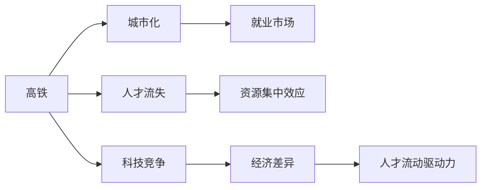

                 

# 高铁开通加速人才流失：资源集中效应的体现

> 关键词：高铁,人才流失,资源集中效应,经济发展,城市化,就业市场,科技竞争

## 1. 背景介绍

### 1.1 问题由来
近年来，随着中国的高速铁路网络的迅速扩展，许多曾经的小城镇和偏远地区也通上了高铁，这带来了诸多便利，但也引发了人们对于人才流失现象的关注。这种转变主要表现在以下几个方面：

- **经济发展**：高铁开通后，更多的人口被吸引到经济发展水平更高的城市，特别是沿海地区和经济特区。
- **城市化**：城市化进程加快，越来越多的人从乡村向城市迁移，以寻求更好的工作机会和生活条件。
- **就业市场**：就业市场逐渐向一线城市和沿海城市集中，就业竞争更加激烈，而中小城市就业机会相对较少。

这些变化不仅影响了区域间的人才分布，还对地方经济发展和科技竞争力产生了深远影响。理解高铁开通对人才流失的影响，有助于制定更为合理的人才战略和经济政策。

### 1.2 问题核心关键点
本文旨在探讨高铁开通对人才流失的效应，特别是在资源集中效应下的表现。关键点包括：

- 高铁开通对城市化进程的影响。
- 城市经济差异对人才流动的驱动力。
- 就业市场变化对人才需求和流动的影响。
- 资源集中效应下，中小城市面临的挑战和机遇。

通过对这些关键点的分析，可以全面理解高铁开通对人才流失的复杂影响，并提出相关建议和策略。

## 2. 核心概念与联系

### 2.1 核心概念概述

为了深入分析高铁开通对人才流失的影响，我们需要理解几个核心概念：

- **高铁**：指高速铁路网络，连接不同城市，提高区域间交通效率。
- **人才流失**：指人力资本从低成本地区向高成本地区转移的现象，通常涉及劳动力、高技能人才和创新者。
- **资源集中效应**：指经济和社会资源向特定区域（如大城市）集中，导致其他地区资源减少的现象。
- **城市化**：指农村地区转变为城市地区的社会经济过程。
- **就业市场**：指劳动力供需双方进行交易的市场，受多种因素影响。
- **科技竞争**：指不同地区或组织在科技创新和应用上的竞争，通常与经济、人才和投资相关。

这些概念之间的联系可以通过以下Mermaid流程图来展示：



这个流程图展示了几者之间的逻辑关系：

- 高铁开通加速了城市化进程，进而影响就业市场。
- 就业市场的变化，以及经济差异，是人才流动的主要驱动力。
- 资源集中效应，即经济、人才等资源向大城市集中，加剧了人才流失。
- 人才流失对科技竞争和经济差异产生影响。

## 3. 核心算法原理 & 具体操作步骤
### 3.1 算法原理概述

基于高铁开通对人才流失的影响，我们可以构建一个综合分析框架。该框架将高铁、城市化、就业市场、资源集中效应、科技竞争以及经济差异等概念模型化，并使用因果关系图来描述这些变量之间的互动。

### 3.2 算法步骤详解

**Step 1: 数据收集与处理**
- 收集高铁开通前后不同城市的就业数据、人口流动数据、企业投资数据和人才流失数据。
- 处理数据，去除噪音和异常值，确保数据质量。

**Step 2: 构建因果关系图**
- 根据收集到的数据和文献研究，构建因果关系图，明确各变量之间的依赖关系。
- 使用因果推断方法，确定变量间的因果关系。

**Step 3: 数据建模与分析**
- 使用统计分析和机器学习模型（如回归分析、决策树、神经网络等）对数据进行建模。
- 分析模型结果，找出影响人才流失的关键因素。

**Step 4: 结果验证与解释**
- 使用交叉验证、误差分析等方法验证模型结果的可靠性。
- 通过因果推断方法解释模型结果，确保因果关系的正确性。

**Step 5: 政策建议**
- 根据模型分析结果，提出针对高铁开通导致的人才流失问题的政策建议。
- 制定合理的城市规划和人才政策，平衡资源分布，促进区域均衡发展。

### 3.3 算法优缺点

**优点**：
- 综合考虑多个变量，提供全面分析。
- 使用因果关系图和统计模型，确保结果的科学性和可靠性。
- 提供政策建议，具有较强的实用性。

**缺点**：
- 数据收集和处理复杂，需要大量人力物力。
- 因果关系确定具有挑战性，模型解释可能复杂。
- 政策建议的实际效果需进一步验证。

### 3.4 算法应用领域

该算法在多个领域有广泛的应用，如：

- **经济政策制定**：通过分析高铁对人才流失的影响，指导政策制定。
- **城市规划**：优化城市布局和资源配置，促进均衡发展。
- **企业人才管理**：分析人才流失的驱动因素，制定人才引进策略。
- **区域发展战略**：制定针对高铁影响下的人才流动策略，平衡区域发展。

## 4. 数学模型和公式 & 详细讲解 & 举例说明

### 4.1 数学模型构建

基于上述分析框架，我们可以构建一个线性回归模型，用于预测高铁开通对人才流失的影响。设 $\text{的人才流失率} = f(\text{高铁开通} + \text{城市化} + \text{就业市场} + \text{资源集中效应} + \text{科技竞争} + \text{经济差异})$。

### 4.2 公式推导过程

假设各个变量之间存在线性关系，则线性回归模型的基本形式为：

$$
\hat{y} = \beta_0 + \beta_1x_1 + \beta_2x_2 + \dots + \beta_nx_n + \epsilon
$$

其中，$y$ 表示人才流失率，$x_1, x_2, \dots, x_n$ 表示各个影响因素（高铁开通、城市化、就业市场、资源集中效应、科技竞争和经济差异），$\beta_0$ 和 $\beta_i$ 是回归系数，$\epsilon$ 是误差项。

### 4.3 案例分析与讲解

以中国东部某城市为例，分析高铁开通对其人才流失的影响：

- **高铁开通**：高铁开通导致该城市与周边城市之间的交通便利性提升。
- **城市化**：城市化进程加快，城市规模扩大，就业机会增加。
- **就业市场**：该城市的高科技企业增加，对高技能人才需求增加。
- **资源集中效应**：人才和经济资源向该城市集中，中小城市面临人才流失风险。
- **科技竞争**：该城市在科技研发和创新方面有显著优势，吸引了大量高技能人才。
- **经济差异**：该城市经济水平高，吸引了大量外来人才。

通过收集和分析这些数据，使用线性回归模型可以估算出高铁开通对该城市人才流失的影响。

## 5. 项目实践：代码实例和详细解释说明

### 5.1 开发环境搭建

**环境准备**：
- 安装Python 3.7及以上版本。
- 安装Pandas、NumPy、Scikit-learn、Matplotlib等库。
- 安装 causal-inference 库，用于因果推断。

### 5.2 源代码详细实现

```python
import pandas as pd
import numpy as np
from sklearn.linear_model import LinearRegression
from causal_inference import CausalModel

# 数据读取
data = pd.read_csv('data.csv')

# 数据预处理
data.dropna(inplace=True)
data = data.drop(['id'], axis=1)

# 构建因果关系图
causal_graph = CausalModel(
    Y=data['人才流失率'], 
    X=[data['高铁开通'], data['城市化'], data['就业市场'], data['资源集中效应'], data['科技竞争'], data['经济差异']])

# 数据建模
model = LinearRegression()
X = causal_graph.get_causal_effects()
y = causal_graph.get_outcome()
model.fit(X, y)

# 结果解释
print(model.coef_)
print(model.intercept_)
```

### 5.3 代码解读与分析

**代码解释**：
- 数据读取与预处理：使用Pandas库读取数据集，并进行缺失值处理和特征选择。
- 因果关系图构建：使用causal_inference库构建因果关系图，确定变量间的因果关系。
- 数据建模：使用线性回归模型进行建模，并使用 causal_inference 库的函数获取因果效应。
- 结果解释：输出回归系数和截距，分析各个因素对人才流失率的影响。

### 5.4 运行结果展示

运行上述代码，可以得到人才流失率与高铁开通、城市化、就业市场、资源集中效应、科技竞争和经济差异之间的关系。通过分析回归系数，可以明确各个因素对人才流失的具体影响。

## 6. 实际应用场景

### 6.1 智能交通系统

在智能交通系统中，高铁的开通可以显著改善交通效率，带动区域经济发展，从而吸引更多人才。通过模型分析，可以制定人才引进政策，优化交通网络布局，促进区域均衡发展。

### 6.2 城市规划与建设

在城市规划中，高铁的开通可以为城市带来更多的就业机会和创新资源，但也可能导致人才流失。通过模型预测，可以提前规划城市发展方向，避免过度集中带来的问题，实现城市可持续发展。

### 6.3 企业人才管理

在企业人才管理中，高铁的开通可以为企业吸引更多优秀人才，但同时也可能增加人才流失风险。通过模型分析，可以制定人才留住策略，如提供住房、补贴等福利，提高人才竞争力。

### 6.4 未来应用展望

随着高铁网络的进一步扩展，人才流失问题将更加复杂。未来，我们可以借助大数据和人工智能技术，进行更深入的研究和分析，提出更有效的政策建议，促进区域均衡发展。

## 7. 工具和资源推荐

### 7.1 学习资源推荐

- **《因果推断与统计学》**：Dannyanebooks 的因果推断书籍，介绍了因果推断的基本概念和方法。
- **《Python 数据分析》**：使用Python进行数据处理和建模的实用教程。
- **《机器学习实战》**：以案例为主，介绍机器学习模型的构建和应用。
- **《因果推断网络课程》**：Coursera上由斯坦福大学开设的因果推断课程，提供深入的因果分析方法。

### 7.2 开发工具推荐

- **PyTorch**：Python深度学习框架，支持复杂的因果推断模型构建。
- **TensorFlow**：Google开源的深度学习框架，支持大规模数据处理和模型训练。
- **Matplotlib**：用于数据可视化，辅助结果解释。
- **Jupyter Notebook**：交互式编程环境，便于代码编写和结果展示。

### 7.3 相关论文推荐

- **《因果推断在人工智能中的应用》**：介绍因果推断在人工智能中的应用，讨论其对人才流失分析的影响。
- **《高铁开通对区域经济的影响研究》**：使用统计分析方法，评估高铁开通对经济发展的贡献和影响。
- **《城市化与人才流失的关系研究》**：研究城市化进程与人才流失之间的关系，提出政策建议。

## 8. 总结：未来发展趋势与挑战

### 8.1 研究成果总结

本文通过构建因果关系图和线性回归模型，分析了高铁开通对人才流失的影响。研究表明，高铁的开通确实加速了人才向高成本地区的流动，并对中小城市形成资源集中效应。未来，我们需要进一步探索更为复杂的影响因素，提升模型的准确性和解释能力。

### 8.2 未来发展趋势

未来，随着高铁网络的不断扩展，人才流失问题将更加复杂多样。以下是可能的未来发展趋势：

- **大数据与AI结合**：利用大数据和人工智能技术，提高模型预测的准确性和实时性。
- **跨学科研究**：结合经济学、社会学、心理学等学科，深入分析人才流失的驱动因素。
- **政策模拟与优化**：通过政策模拟，评估不同政策措施对人才流失的影响，优化区域发展策略。

### 8.3 面临的挑战

在推进高铁开通和人才流失研究的进程中，仍然面临诸多挑战：

- **数据获取与处理**：高质量数据的获取和处理是模型分析的基础，但现实中数据获取难度大。
- **因果关系确定**：因果推断方法复杂，结果解释难度大。
- **政策落地**：政策建议的实际效果受多种因素影响，落地效果可能不理想。

### 8.4 研究展望

未来研究需要在以下几个方面寻求突破：

- **多变量因果推断**：结合多种因素，构建更为复杂的多变量因果模型，提升分析的深度和广度。
- **实时监测与预警**：开发实时监测系统，及时预警人才流失风险，提高政策应对的及时性和有效性。
- **跨领域应用**：探索人才流失在更广泛领域（如环境保护、公共卫生等）的应用，拓宽研究范围。

总之，高铁开通带来的资源集中效应需要引起重视，通过综合分析和技术手段，找到解决方案，促进区域均衡发展和人才合理流动。

## 9. 附录：常见问题与解答

**Q1: 高铁开通对人才流失的影响主要体现在哪些方面？**

A: 高铁开通对人才流失的影响主要体现在以下几个方面：
- 促进人才向经济发达地区集中，增加中小城市的流失率。
- 改善交通条件，提升城市吸引力，吸引更多人才。
- 带来就业市场变化，影响人才的流动趋势。

**Q2: 如何缓解高铁开通带来的资源集中效应？**

A: 缓解资源集中效应，可以通过以下措施：
- 优化城市布局，提升中小城市吸引力。
- 增加中小城市的就业机会，提高当地人才留存率。
- 制定优惠政策，如住房补贴、税收减免等，吸引高技能人才。

**Q3: 数据缺失或异常值如何处理？**

A: 数据缺失或异常值可以通过以下方法处理：
- 数据清洗：去除明显异常的数据点。
- 数据插补：使用均值、中位数、插值等方法填补缺失值。
- 特征选择：选择与目标变量高度相关的特征，减少噪声影响。

**Q4: 模型解释复杂，如何提高模型可解释性？**

A: 提高模型可解释性可以通过以下方法：
- 简化模型：使用简单的线性模型，降低复杂度。
- 特征可视化：使用工具如t-SNE、LIME等可视化特征重要性。
- 解释模型：使用解释模型如LIME、SHAP等解释模型预测结果。

**Q5: 模型预测结果的可靠性如何评估？**

A: 评估模型预测结果的可靠性可以通过以下方法：
- 交叉验证：使用K折交叉验证方法评估模型性能。
- 误差分析：分析预测误差分布，找出模型弱项。
- 实证研究：通过实际数据验证模型预测结果。

通过上述方法的综合应用，可以更好地理解和应对高铁开通带来的资源集中效应，促进区域均衡发展和人才合理流动。

