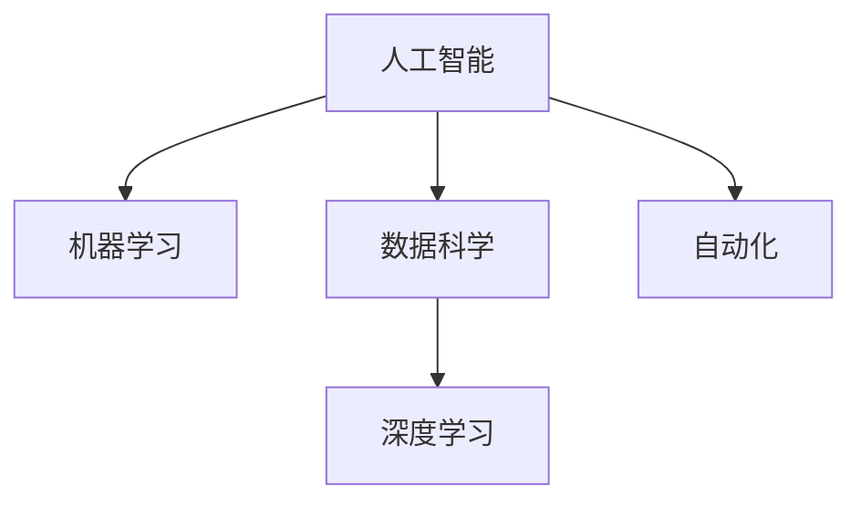

                 

# 99%的人只能赚辛苦钱：科技发展必然趋势

> 关键词：
- 人工智能
- 机器学习
- 数据科学
- 深度学习
- 自动化
- 未来就业
- 技术变迁

## 1. 背景介绍

### 1.1 问题由来
随着科技的飞速发展，人工智能(AI)、机器学习(ML)、大数据、深度学习(Deep Learning)等新兴技术迅速渗透到各行各业，带来了革命性的变化。越来越多的公司将自动化和数据驱动的决策制定融入核心业务中，以提高效率和竞争力。然而，这一进步同时也引发了关于就业和未来工作的广泛讨论。

一个突出的例子是《未来简史》作者尤瓦尔·赫拉利(Yuval Noah Harari)提出的观点：在机器学习和自动化发展迅速的未来，99%的人类将变成“无用阶层”，仅能从事少数创意工作。这一预言引发了广泛的社会关注和争议。尽管如此，科技进步的趋势不可避免，理解和应对这种变化，已成为个人、企业和社会的紧迫任务。

### 1.2 问题核心关键点
科技的快速发展不仅改变了工作方式，也改变了劳动力的构成和需求。未来，人工智能和自动化技术将承担越来越多的“人工”任务，而人类更多地从事创造性和战略性工作。这一转变将带来以下核心关键点：

- **技术推动**：AI和机器学习技术日新月异，正在改变传统的劳动方式和生产模式。
- **劳动力结构**：大量的工作岗位将被自动化取代，需要重新定义劳动力的需求和技能。
- **教育转型**：教育系统需要适应新的技能需求，培养能够适应未来工作环境的人才。
- **社会稳定**：需要制定新的政策和社会保障机制，以应对失业和技能短缺问题。

理解这些关键点，有助于我们更好地应对科技发展带来的变化，充分利用技术进步带来的机遇。

## 2. 核心概念与联系

### 2.1 核心概念概述

在讨论科技发展对就业的影响时，我们需要关注以下几个核心概念：

- **人工智能(AI)**：指由计算机系统执行的任务，这些系统能够执行通常需要人类智能的任务，如视觉感知、语音识别、决策制定等。
- **机器学习(ML)**：指通过数据训练算法，让计算机系统具备自我学习和改进的能力。
- **数据科学**：涉及数据的收集、清洗、分析和解释，是机器学习和AI应用的基础。
- **深度学习**：一种特殊类型的机器学习，使用多层神经网络模拟人脑处理信息的方式。
- **自动化**：使用机器和软件自动执行任务，减少人工干预，提高效率。

这些概念之间的逻辑关系可以通过以下Mermaid流程图来展示：



这个流程图展示了核心概念之间的关系：

1. 人工智能依赖于机器学习和数据科学，通过深度学习等技术实现。
2. 自动化使用人工智能和机器学习技术，实现任务自动化。
3. 数据科学为机器学习和人工智能提供数据基础。

## 3. 核心算法原理 & 具体操作步骤
### 3.1 算法原理概述

人工智能和机器学习技术的基础是算法原理，这些算法可以自动分析大量数据，学习模式并做出预测或决策。其中，深度学习算法通过构建多层次的神经网络模型，学习输入数据的复杂表示，从而实现高精度的预测和决策。

深度学习算法通常由以下几个步骤构成：

1. **数据准备**：收集和清洗数据，将其转化为模型训练所需的格式。
2. **模型训练**：使用数据训练深度学习模型，调整模型参数以最小化损失函数。
3. **模型评估**：使用测试数据集评估模型的性能，确保其在新数据上的泛化能力。
4. **模型部署**：将训练好的模型部署到生产环境中，实现自动化决策。

### 3.2 算法步骤详解

以深度学习模型为例，其训练步骤可以分为以下几个阶段：

**Step 1: 数据准备**
- 收集和清洗数据，确保数据质量和一致性。
- 将数据划分为训练集、验证集和测试集。

**Step 2: 模型选择**
- 根据任务类型选择合适的深度学习模型，如卷积神经网络(CNN)、循环神经网络(RNN)、长短期记忆网络(LSTM)、变压器(Transformer)等。
- 确定模型的超参数，如层数、神经元数量、学习率等。

**Step 3: 模型训练**
- 将数据输入模型，计算损失函数。
- 使用梯度下降等优化算法更新模型参数。
- 在验证集上监控模型性能，调整超参数。
- 重复上述步骤，直到模型收敛或达到预设停止条件。

**Step 4: 模型评估**
- 在测试集上评估模型的性能，如准确率、召回率、F1分数等。
- 使用混淆矩阵等可视化工具，分析模型的优点和缺点。

**Step 5: 模型部署**
- 将训练好的模型部署到实际应用中。
- 集成到应用程序、API或服务中。
- 监控模型的性能和稳定性。

### 3.3 算法优缺点

深度学习和机器学习技术具有以下优点：
1. 高效自动化：可以处理大量数据，自动化地执行复杂任务。
2. 高精度：在许多应用场景中，深度学习模型的精度已经超越了传统方法。
3. 泛化能力：通过大量数据训练，可以处理未见过的数据。

然而，这些技术也存在一些缺点：
1. 数据依赖：深度学习模型需要大量的标注数据，获取和标注数据成本高昂。
2. 可解释性不足：深度学习模型通常是“黑盒”模型，难以解释其决策过程。
3. 计算资源需求高：深度学习模型需要强大的计算资源进行训练和推理。
4. 对异常敏感：深度学习模型容易受到噪声和异常值的影响，泛化能力可能受损。

尽管存在这些局限，但深度学习和机器学习技术在处理大规模数据和复杂任务方面表现出色，已经广泛应用于图像识别、语音识别、自然语言处理等领域。未来，随着技术的不断进步，这些问题将有望得到进一步解决。

### 3.4 算法应用领域

深度学习和机器学习技术已经广泛应用于各个行业，以下是几个典型应用领域：

- **医疗**：用于疾病诊断、基因组分析、药物发现等。
- **金融**：用于信用评分、欺诈检测、投资策略等。
- **零售**：用于客户推荐、库存管理、定价策略等。
- **制造**：用于质量控制、供应链优化、设备维护等。
- **交通**：用于自动驾驶、交通流量预测、路径规划等。
- **物流**：用于路线优化、货物追踪、配送调度等。

## 4. 数学模型和公式 & 详细讲解 & 举例说明
### 4.1 数学模型构建

以分类任务为例，深度学习模型的输入为特征向量$x$，输出为类别概率向量$y$，模型的目标是最小化预测错误。定义损失函数$L$，表示模型预测输出与真实标签之间的差异。模型的目标是最小化损失函数$L$，即：

$$
\min_{\theta} L(y, \hat{y})
$$

其中，$\theta$为模型参数，$y$为真实标签，$\hat{y}$为模型预测概率向量。

### 4.2 公式推导过程

以二分类任务为例，假设模型输出为$\hat{y} = \sigma(z)$，其中$z = W^Tx + b$，$\sigma$为激活函数，$W$为权重矩阵，$b$为偏置向量。损失函数可以表示为交叉熵损失：

$$
L(y, \hat{y}) = -\frac{1}{N}\sum_{i=1}^N [y_i\log \hat{y}_i + (1-y_i)\log (1-\hat{y}_i)]
$$

其中，$y_i$为真实标签，$\hat{y}_i$为模型预测概率。

通过反向传播算法，计算梯度并更新模型参数：

$$
\frac{\partial L}{\partial \theta} = -\frac{1}{N}\sum_{i=1}^N (\frac{y_i}{\hat{y}_i} - \frac{1-y_i}{1-\hat{y}_i}) \frac{\partial z}{\partial \theta}
$$

其中，$\frac{\partial z}{\partial \theta}$可以通过链式法则计算得到。

### 4.3 案例分析与讲解

以图像分类为例，假设模型输入为图像$x$，输出为类别概率向量$y$。使用卷积神经网络(CNN)模型，通过多个卷积层和池化层提取特征，最后通过全连接层输出预测概率。假设模型结构如下：


其中，$x$为输入图像，$h$为中间特征图，$y$为预测类别概率向量。假设模型输出为$\hat{y} = \sigma(z)$，其中$z = W^Th + b$，$\sigma$为激活函数，$W$为权重矩阵，$b$为偏置向量。

假设真实标签为$y = (y_1, y_2, ..., y_n)$，其中$y_i$表示图像属于第$i$类的概率。损失函数可以表示为交叉熵损失：

$$
L(y, \hat{y}) = -\frac{1}{N}\sum_{i=1}^N [y_i\log \hat{y}_i + (1-y_i)\log (1-\hat{y}_i)]
$$

通过反向传播算法，计算梯度并更新模型参数：

$$
\frac{\partial L}{\partial \theta} = -\frac{1}{N}\sum_{i=1}^N (\frac{y_i}{\hat{y}_i} - \frac{1-y_i}{1-\hat{y}_i}) \frac{\partial z}{\partial \theta}
$$

其中，$\frac{\partial z}{\partial \theta}$可以通过链式法则计算得到。

## 5. 项目实践：代码实例和详细解释说明
### 5.1 开发环境搭建

在进行深度学习项目实践前，我们需要准备好开发环境。以下是使用Python进行PyTorch开发的环境配置流程：

1. 安装Anaconda：从官网下载并安装Anaconda，用于创建独立的Python环境。

2. 创建并激活虚拟环境：
```bash
conda create -n pytorch-env python=3.8 
conda activate pytorch-env
```

3. 安装PyTorch：根据CUDA版本，从官网获取对应的安装命令。例如：
```bash
conda install pytorch torchvision torchaudio cudatoolkit=11.1 -c pytorch -c conda-forge
```

4. 安装TensorFlow：
```bash
pip install tensorflow
```

5. 安装TensorFlow的GPU版本：
```bash
pip install tensorflow-gpu
```

6. 安装各类工具包：
```bash
pip install numpy pandas scikit-learn matplotlib tqdm jupyter notebook ipython
```

完成上述步骤后，即可在`pytorch-env`环境中开始深度学习项目实践。

### 5.2 源代码详细实现

这里我们以图像分类任务为例，给出使用PyTorch进行深度学习项目开发的完整代码实现。

首先，定义数据处理函数：

```python
import torch
from torchvision import datasets, transforms

class ImageDataset(torch.utils.data.Dataset):
    def __init__(self, root_dir, transform=None):
        self.root_dir = root_dir
        self.transform = transform
        self.data = []
        self.labels = []
        # 加载数据集
        for root, dirs, files in os.walk(root_dir):
            for file in files:
                if not file.endswith('.jpg'):
                    continue
                img_path = os.path.join(root, file)
                self.data.append(img_path)
                label = int(os.path.basename(root))
                self.labels.append(label)

    def __len__(self):
        return len(self.data)

    def __getitem__(self, idx):
        img_path = self.data[idx]
        label = self.labels[idx]
        img = Image.open(img_path)
        if self.transform:
            img = self.transform(img)
        return img, label
```

然后，定义模型和优化器：

```python
import torch.nn as nn
import torch.optim as optim

class ConvNet(nn.Module):
    def __init__(self):
        super(ConvNet, self).__init__()
        self.conv1 = nn.Conv2d(3, 16, kernel_size=3, stride=1, padding=1)
        self.pool1 = nn.MaxPool2d(kernel_size=2, stride=2)
        self.conv2 = nn.Conv2d(16, 32, kernel_size=3, stride=1, padding=1)
        self.pool2 = nn.MaxPool2d(kernel_size=2, stride=2)
        self.fc1 = nn.Linear(7*7*32, 128)
        self.fc2 = nn.Linear(128, 10)

    def forward(self, x):
        x = self.pool1(nn.functional.relu(self.conv1(x)))
        x = self.pool2(nn.functional.relu(self.conv2(x)))
        x = x.view(x.size(0), -1)
        x = nn.functional.relu(self.fc1(x))
        x = self.fc2(x)
        return x

model = ConvNet()
optimizer = optim.SGD(model.parameters(), lr=0.001, momentum=0.9)
```

接着，定义训练和评估函数：

```python
def train_model(model, data_loader, optimizer, num_epochs):
    for epoch in range(num_epochs):
        for batch_idx, (data, target) in enumerate(data_loader):
            optimizer.zero_grad()
            output = model(data)
            loss = nn.functional.cross_entropy(output, target)
            loss.backward()
            optimizer.step()
            if batch_idx % 100 == 0:
                print('Train Epoch: {} [{}/{} ({:.0f}%)]\tLoss: {:.6f}'.format(
                    epoch, batch_idx * len(data), len(data_loader.dataset),
                    100. * batch_idx / len(data_loader), loss.item()))

def evaluate_model(model, data_loader):
    model.eval()
    test_loss = 0
    correct = 0
    with torch.no_grad():
        for data, target in data_loader:
            output = model(data)
            test_loss += nn.functional.cross_entropy(output, target, reduction='sum').item()
            pred = output.argmax(dim=1, keepdim=True)
            correct += pred.eq(target.view_as(pred)).sum().item()
    test_loss /= len(data_loader.dataset)
    print('Test set: Average loss: {:.4f}, Accuracy: {}/{} ({:.0f}%)'.format(
        test_loss, correct, len(data_loader.dataset),
        100. * correct / len(data_loader.dataset)))
```

最后，启动训练流程并在测试集上评估：

```python
train_data = datasets.CIFAR10(root='./data', train=True, download=True, transform=transforms.ToTensor())
test_data = datasets.CIFAR10(root='./data', train=False, download=True, transform=transforms.ToTensor())

train_loader = torch.utils.data.DataLoader(train_data, batch_size=64, shuffle=True)
test_loader = torch.utils.data.DataLoader(test_data, batch_size=64, shuffle=False)

num_epochs = 5
train_model(model, train_loader, optimizer, num_epochs)
evaluate_model(model, test_loader)
```

以上就是使用PyTorch进行图像分类任务深度学习项目开发的完整代码实现。可以看到，通过简单的代码，我们能够高效地构建、训练和评估一个深度学习模型。

### 5.3 代码解读与分析

让我们再详细解读一下关键代码的实现细节：

**ImageDataset类**：
- `__init__`方法：初始化数据集路径、transform、数据和标签。
- `__len__`方法：返回数据集的大小。
- `__getitem__`方法：对单个样本进行处理，打开图像，应用transform，返回图像和标签。

**ConvNet类**：
- `__init__`方法：定义卷积层、池化层和全连接层。
- `forward`方法：定义前向传播过程。

**train_model和evaluate_model函数**：
- 定义训练和评估函数，分别在训练集和测试集上进行模型训练和评估。

**训练流程**：
- 定义总的epoch数和批量大小，开始循环迭代
- 在每个epoch内，对数据集进行批处理迭代训练
- 在每个batch结束后，打印当前批次的损失
- 在训练完成后，评估模型在测试集上的表现

可以看到，深度学习项目开发的代码实现相对简洁高效，但具体的模型选择、超参数调整、优化器选择等步骤需要开发者根据具体任务进行细致调整。

## 6. 实际应用场景
### 6.1 智能推荐系统

智能推荐系统已经在电商、视频、音乐等多个领域得到广泛应用，能够为用户提供个性化推荐。随着深度学习技术的发展，推荐系统也越来越智能化和精准化。

在实际应用中，深度学习模型可以分析用户的历史行为数据、点击记录、评分记录等，提取用户兴趣和偏好特征，预测用户可能感兴趣的商品、内容等。通过不断优化模型参数和推荐策略，推荐系统能够实现高效的个性化推荐，提升用户体验和满意度。

### 6.2 自动驾驶

自动驾驶技术是未来交通的重要方向，深度学习在其中扮演了关键角色。自动驾驶系统通过传感器获取环境信息，使用深度学习模型进行图像识别、物体检测、路径规划等任务，实现车辆的自主驾驶。

在实际应用中，深度学习模型可以用于车道检测、交通标志识别、行人检测等任务，提升车辆的安全性和驾驶体验。未来，随着技术的不断进步，自动驾驶系统将变得更加智能和可靠，有望实现广泛的商用化。

### 6.3 医疗影像分析

医疗影像分析是医疗领域的重要应用，深度学习模型可以通过图像识别技术，自动分析医疗影像，辅助医生进行疾病诊断和治疗。

在实际应用中，深度学习模型可以用于肺部CT影像中的肿瘤检测、乳腺X光影像中的病变检测等任务。通过不断优化模型参数和分析算法，医疗影像分析系统能够提升医生的诊断准确性和效率，降低误诊和漏诊率，为患者提供更好的医疗服务。

## 7. 工具和资源推荐
### 7.1 学习资源推荐

为了帮助开发者系统掌握深度学习和机器学习理论基础，这里推荐一些优质的学习资源：

1. 《深度学习》（Ian Goodfellow、Yoshua Bengio、Aaron Courville著）：深度学习的经典教材，全面介绍了深度学习的基本概念和算法。
2. 《机器学习实战》（Peter Harrington著）：介绍机器学习的入门知识和实战案例，适合初学者学习。
3. Coursera《机器学习》课程：由斯坦福大学开设的机器学习课程，有Lecture视频和配套作业，系统介绍了机器学习的基本原理和算法。
4. edX《Deep Learning》课程：由MIT开设的深度学习课程，涵盖深度学习的基础知识和应用案例，适合进阶学习。
5. Kaggle：提供丰富的数据集和机器学习竞赛，适合实践和竞赛，积累实战经验。

通过对这些资源的学习实践，相信你一定能够快速掌握深度学习和机器学习的基础知识和技能，并用于解决实际的工程问题。

### 7.2 开发工具推荐

高效的开发离不开优秀的工具支持。以下是几款用于深度学习开发的工具：

1. PyTorch：基于Python的开源深度学习框架，灵活动态的计算图，适合快速迭代研究。
2. TensorFlow：由Google主导开发的开源深度学习框架，生产部署方便，适合大规模工程应用。
3. Keras：基于Python的高层深度学习库，提供了丰富的API和预训练模型，适合快速上手。
4. Jupyter Notebook：交互式的编程环境，方便记录代码、注释和可视化结果，适合研究和开发。
5. Colab：谷歌推出的在线Jupyter Notebook环境，免费提供GPU/TPU算力，方便快速实验。

合理利用这些工具，可以显著提升深度学习和机器学习项目的开发效率，加快创新迭代的步伐。

### 7.3 相关论文推荐

深度学习和机器学习技术的发展源于学界的持续研究。以下是几篇奠基性的相关论文，推荐阅读：

1. AlexNet：ImageNet大规模视觉识别挑战赛的冠军算法，标志着深度学习在计算机视觉领域的应用。
2. Google Brain团队的《深度学习在语音识别中的应用》：介绍深度学习在语音识别领域的应用，推动了语音识别技术的快速发展。
3. 《神经网络与深度学习》（Michael Nielsen著）：介绍了神经网络和深度学习的基本概念和算法。
4. 《深度学习在自然语言处理中的应用》（Tom Mitchell、Peter Niyogi著）：介绍了深度学习在自然语言处理领域的应用，推动了NLP技术的进步。
5. 《深度强化学习：原理与实践》（Emre Inan、Mehdi Milad、Alexandre M. U. de Siqueira著）：介绍了深度强化学习的基本概念和应用案例，推动了强化学习在实际应用中的发展。

这些论文代表了大规模深度学习技术的发展脉络。通过学习这些前沿成果，可以帮助研究者把握学科前进方向，激发更多的创新灵感。

## 8. 总结：未来发展趋势与挑战

### 8.1 总结

本文对深度学习和机器学习技术的原理、操作步骤和具体应用进行了全面系统的介绍。首先阐述了深度学习技术的发展背景和意义，明确了技术推动带来的就业变革趋势。其次，从原理到实践，详细讲解了深度学习模型的构建和训练方法，给出了深度学习项目开发的完整代码实例。同时，本文还探讨了深度学习技术在实际应用中的多个场景，展示了技术进步带来的广阔前景。

通过本文的系统梳理，可以看到，深度学习和机器学习技术正在深刻改变各行各业，成为技术创新和产业升级的重要引擎。未来，伴随技术的不断进步，我们能够更好地应对就业变革带来的挑战，充分利用技术进步带来的机遇。

### 8.2 未来发展趋势

展望未来，深度学习和机器学习技术将呈现以下几个发展趋势：

1. **模型规模增大**：随着算力成本的下降和数据规模的扩张，深度学习模型参数量将继续增长，更大规模的模型将具备更强的泛化能力。
2. **模型结构优化**：未来的深度学习模型将更加注重结构优化，如卷积神经网络、循环神经网络、注意力机制等，提升模型效率和精度。
3. **跨模态融合**：深度学习将更多地应用于跨模态数据融合，如视觉、语音、文本的融合，提升对复杂场景的理解能力。
4. **边缘计算**：深度学习模型将更多地应用于边缘计算，提升计算效率和实时性，支持物联网等场景的部署。
5. **联邦学习**：分布式训练技术将在更多场景中得到应用，提升数据隐私保护和计算效率。
6. **自动化调参**：自动调参技术将进一步发展，帮助开发者高效地找到最优的超参数组合，提升模型效果。

这些趋势凸显了深度学习和机器学习技术的广阔前景。未来，技术的不断进步将带来更多创新应用，提升各行各业的智能化水平。

### 8.3 面临的挑战

尽管深度学习和机器学习技术取得了巨大的进展，但在迈向更广泛应用的过程中，仍面临诸多挑战：

1. **数据依赖**：深度学习模型需要大量的标注数据，获取和标注数据成本高昂。如何在保证数据质量的同时，降低数据获取成本，是一个重要问题。
2. **模型复杂性**：深度学习模型结构复杂，容易受到噪声和异常值的影响，泛化能力可能受损。如何提升模型的鲁棒性，确保其在新场景下的泛化能力，需要更多的研究。
3. **可解释性不足**：深度学习模型通常是“黑盒”模型，难以解释其决策过程。如何提升模型的可解释性，增强用户信任，是一个重要问题。
4. **计算资源消耗高**：深度学习模型需要强大的计算资源进行训练和推理。如何在保证模型性能的同时，降低计算资源消耗，需要更多的优化方法。
5. **模型公平性**：深度学习模型容易学习到有偏见的数据，产生歧视性输出。如何提升模型的公平性，避免偏见和歧视，是一个重要问题。

这些挑战凸显了深度学习和机器学习技术在实际应用中需要面对的问题。未来，需要在数据获取、模型结构、可解释性、计算资源等方面进行更深入的研究和优化，推动技术进步。

### 8.4 研究展望

面对深度学习和机器学习技术面临的挑战，未来的研究需要在以下几个方面寻求新的突破：

1. **无监督学习**：探索无监督和半监督学习范式，减少对标注数据的依赖，提升模型的泛化能力。
2. **模型压缩**：研究模型压缩技术，如知识蒸馏、剪枝、量化等，降低模型复杂度和计算资源消耗，提升模型效率。
3. **跨模态融合**：研究跨模态数据融合技术，提升对复杂场景的理解能力，拓展深度学习的应用场景。
4. **联邦学习**：研究联邦学习技术，提升数据隐私保护和计算效率，推动深度学习在分布式场景中的应用。
5. **可解释性增强**：研究可解释性增强技术，提升模型的可解释性，增强用户信任。
6. **公平性优化**：研究公平性优化技术，提升模型的公平性，避免偏见和歧视。

这些研究方向的探索，将推动深度学习和机器学习技术迈向更高的台阶，为构建更智能、更公平、更可解释的模型提供技术支持。

## 9. 附录：常见问题与解答

**Q1：深度学习是否会对传统产业带来负面影响？**

A: 深度学习技术的应用会对传统产业带来一定的冲击，但也会带来更多机遇。例如，医疗影像分析可以提升医疗诊断的准确性，智能推荐系统可以提升零售业的用户体验，自动驾驶技术可以提升交通安全性等。未来，深度学习技术将更多地应用于各个行业，推动产业升级和智能化转型。

**Q2：深度学习是否会取代人类工作？**

A: 深度学习技术可以自动化执行许多任务，但人类仍然在创造性、战略性、情感性等高层次工作中具有不可替代的优势。未来，人类和机器将更加协同工作，深度学习技术将成为提升工作效率和质量的利器。

**Q3：如何应对深度学习带来的就业冲击？**

A: 应对深度学习带来的就业冲击，需要从多个方面进行努力：
1. 加强教育培训：培养更多具备跨学科知识、具备深度学习应用能力的复合型人才。
2. 推动产业升级：将深度学习技术应用于各行业，推动产业升级和智能化转型。
3. 创新就业模式：探索新的就业模式，如自由职业、兼职、灵活用工等，适应技术变革。

通过不断学习和适应，我们可以更好地应对深度学习带来的就业变化，抓住技术变革带来的机遇。

**Q4：如何推动深度学习技术的发展？**

A: 推动深度学习技术的发展，需要从多个方面进行努力：
1. 加强基础研究：在深度学习的基础理论、算法、应用等方面进行深入研究，推动技术进步。
2. 促进产业应用：将深度学习技术应用于各个行业，推动产业升级和智能化转型。
3. 加强国际合作：与其他国家和地区进行技术交流和合作，推动全球技术进步。
4. 推动政策支持：制定相关政策，鼓励企业和技术机构进行深度学习技术的研究和应用。

通过以上努力，相信深度学习技术将能够更好地推动社会的进步和产业的发展。

---

作者：禅与计算机程序设计艺术 / Zen and the Art of Computer Programming

