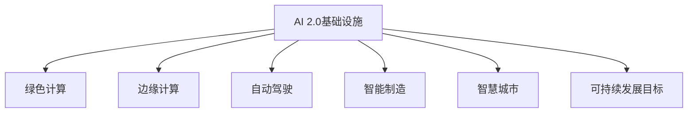

                 

# AI 2.0 基础设施建设：可持续发展目标

> 关键词：AI 2.0, 可持续发展目标, 绿色计算, 边缘计算, 自动驾驶, 智能制造, 智慧城市

## 1. 背景介绍

### 1.1 问题由来

在过去的十年里，人工智能(AI)技术经历了飞速发展，推动了全球经济和社会进步。然而，这一过程中也伴随着资源消耗剧增、环境破坏加剧、数据隐私泄露等挑战。随着AI技术的进一步普及，如何构建可持续发展的AI基础设施，成为了一个迫切需要解决的问题。

### 1.2 问题核心关键点

可持续发展目标（Sustainable Development Goals, SDGs）是由联合国提出的一套全球性目标，旨在解决全球性的环境、社会和经济问题，推动实现包容性、平等、繁荣和可持续发展。在AI领域，构建可持续发展的AI基础设施，不仅要考虑技术本身的安全性、公平性和可靠性，还要关注其对环境和社会的长期影响。

## 2. 核心概念与联系

### 2.1 核心概念概述

为更好地理解AI 2.0基础设施建设中的可持续发展目标，本节将介绍几个关键概念：

- AI 2.0：即人工智能技术的第二代，强调技术的深度和广度，涵盖从数据获取、模型训练、推理部署到应用反馈的全生命周期过程。
- 绿色计算：指通过高效能、低能耗的计算设施和技术，实现可持续发展的AI基础设施。
- 边缘计算：指将计算任务离散化，靠近数据源进行处理，以减少网络延迟和带宽需求，支持实时性AI应用。
- 自动驾驶：基于AI技术的智能交通系统，旨在实现无人驾驶车辆的安全、高效运行，解决交通拥堵、事故等问题。
- 智能制造：结合AI技术和工业物联网(IIoT)，实现从设计、生产到物流的自动化和智能化，提升制造业的效率和质量。
- 智慧城市：利用AI技术，提升城市管理的智能化水平，包括交通管理、公共安全、环境监测等方面。

这些概念之间具有紧密联系，共同构成了AI 2.0基础设施建设的目标和方向。

### 2.2 核心概念原理和架构的 Mermaid 流程图



这个流程图展示了AI 2.0基础设施建设中各关键概念的关联关系。绿色计算和边缘计算是支持实时性AI应用的基础设施，自动驾驶、智能制造和智慧城市则是应用场景的具体实例，所有这些都旨在实现联合国提出的可持续发展目标。

## 3. 核心算法原理 & 具体操作步骤
### 3.1 算法原理概述

AI 2.0基础设施的建设，涉及多个领域的技术和算法，包括但不限于：

- 数据采集与预处理：采集环境、能源、交通等领域的传感器数据，并进行清洗、归一化等预处理操作。
- 模型训练与优化：通过高效能算法（如分布式训练、自动调参等），训练高效的AI模型。
- 推理部署与监控：将训练好的模型部署到边缘设备或云平台，并进行性能监控和优化。
- 数据保护与隐私：设计数据保护和隐私保护策略，确保数据安全和用户隐私。

这些技术的综合应用，构建了可持续发展的AI基础设施。其中，绿色计算和边缘计算技术是关键，能够支持高效、低能耗的AI应用，减少对环境的影响。

### 3.2 算法步骤详解

AI 2.0基础设施的建设，大致可以分为以下几个步骤：

**Step 1: 需求分析与设计**
- 根据具体的应用场景，确定需要采集的数据类型和采集频率。
- 设计数据预处理和模型训练的流程，选择合适的计算资源和技术架构。
- 制定数据隐私和安全策略，确保数据处理过程中不泄露敏感信息。

**Step 2: 基础设施搭建**
- 选择合适的绿色计算和边缘计算设施，如节能服务器、低功耗设备等。
- 设计数据流、计算流和控制流的架构，确保系统的高效稳定运行。
- 部署AI模型，并进行初步测试和优化。

**Step 3: 模型训练与优化**
- 根据应用需求，选择合适的数据集进行训练。
- 采用分布式训练、自动调参等技术，提升模型训练效率。
- 设计模型性能评估指标，进行多次训练和优化，确保模型效果最优。

**Step 4: 推理部署与监控**
- 将训练好的模型部署到目标设备或云平台。
- 设计系统监控和报警机制，实时监测系统性能和资源使用情况。
- 对系统进行性能优化，确保实时性AI应用的需求得到满足。

**Step 5: 数据保护与隐私**
- 设计数据保护策略，确保数据在采集、传输、存储和使用过程中的安全。
- 采用数据匿名化、差分隐私等技术，保护用户隐私。
- 制定数据访问和使用规则，确保数据仅在必要情况下被使用。

### 3.3 算法优缺点

AI 2.0基础设施建设中的绿色计算和边缘计算技术，具有以下优点：

1. **能效高**：通过将计算任务离散化，靠近数据源进行处理，大幅减少网络带宽和延迟，提高系统的能效比。
2. **响应快**：靠近数据源进行计算，能够快速响应实时性AI应用的需求，提升用户体验。
3. **灵活性强**：边缘计算设施能够灵活部署，适应不同的应用场景和需求。

同时，这些技术也存在一些局限：

1. **计算资源有限**：边缘计算设施的计算资源有限，难以支持大规模、高复杂度的AI任务。
2. **数据存储和传输成本高**：数据需要在本地进行处理，存储和传输成本较高。
3. **安全性问题**：靠近数据源的处理可能增加数据泄露和被篡改的风险。

### 3.4 算法应用领域

绿色计算和边缘计算技术，广泛应用于以下领域：

- **智能交通**：通过部署边缘计算设施，实现自动驾驶、智能信号控制等功能，提升交通系统的效率和安全性。
- **智能制造**：结合边缘计算和物联网技术，实现生产设备的实时监控和维护，提升生产效率和质量。
- **智慧城市**：通过部署边缘计算设施，实现环境监测、公共安全等应用，提升城市管理的智能化水平。
- **智能家居**：通过部署边缘计算设施，实现家庭设备的智能控制和数据分析，提升用户的生活品质。

## 4. 数学模型和公式 & 详细讲解 & 举例说明

### 4.1 数学模型构建

在AI 2.0基础设施建设中，绿色计算和边缘计算技术的核心在于设计高效的计算模型。以下是一个简单的绿色计算模型：

假设一个智慧城市中的环境监测系统，需要采集大量传感器数据并进行实时处理。系统由多个边缘计算节点和中央数据中心组成。每个边缘计算节点负责处理一定范围内的传感器数据，并将结果上传至中央数据中心进行汇总和分析。

**系统模型：**

- **输入**：环境监测传感器数据 $x_1, x_2, ..., x_n$。
- **处理**：在边缘计算节点上，对数据进行预处理和计算，得到中间结果 $y_1, y_2, ..., y_m$。
- **传输**：将中间结果上传至中央数据中心进行汇总和分析。
- **输出**：根据分析结果，进行环境监测和预警。

### 4.2 公式推导过程

绿色计算和边缘计算技术的数学模型构建，主要关注以下几个方面：

- **数据采集与传输**：采用分布式计算模型，将数据采集和传输任务分布在多个边缘计算节点上，减少单点故障和传输延迟。
- **模型训练与优化**：设计高效的训练算法，如分布式训练、模型蒸馏等，提升模型训练效率和效果。
- **推理部署与监控**：设计实时推理算法，确保模型能够高效、准确地进行推理计算，同时监控系统性能，进行动态调整。

### 4.3 案例分析与讲解

以下以智慧城市中的环境监测系统为例，介绍绿色计算和边缘计算技术的实际应用：

**环境监测系统数据采集与预处理：**

- **数据采集**：智慧城市中的环境监测系统，需要采集大量的传感器数据，如PM2.5、温度、湿度、噪声等。
- **数据预处理**：对采集到的数据进行清洗、归一化等预处理操作，确保数据质量。

**边缘计算节点处理：**

- **模型训练**：在边缘计算节点上，采用分布式训练算法，训练环境监测模型。
- **实时推理**：根据实时采集到的传感器数据，进行实时推理计算，得到环境监测结果。

**中央数据中心分析：**

- **数据汇总**：将各个边缘计算节点的实时推理结果进行汇总，得到整体环境监测结果。
- **数据分析**：对汇总数据进行统计分析和预测，进行环境监测和预警。

## 5. 项目实践：代码实例和详细解释说明

### 5.1 开发环境搭建

在进行AI 2.0基础设施建设的项目实践中，需要搭建多个开发环境，包括：

1. **绿色计算环境**：搭建节能服务器集群，进行分布式训练和推理计算。
2. **边缘计算环境**：搭建低功耗边缘计算设备，进行实时数据处理和推理计算。
3. **云平台环境**：搭建云平台，进行模型部署和监控。

### 5.2 源代码详细实现

以下是一个简单的环境监测系统绿色计算和边缘计算代码实现示例：

```python
# 环境监测系统数据采集与预处理
class SensorDataProcessor:
    def __init__(self):
        self.sensors = {}
    
    def add_sensor(self, sensor_name):
        self.sensors[sensor_name] = []
    
    def add_data(self, sensor_name, data):
        self.sensors[sensor_name].append(data)
    
    def preprocess(self):
        # 对数据进行清洗、归一化等预处理操作
        ...

# 边缘计算节点处理
class EdgeProcessor:
    def __init__(self, model, sensor_processor):
        self.model = model
        self.sensor_processor = sensor_processor
    
    def process_data(self):
        # 从传感器处理器获取数据
        sensor_data = self.sensor_processor.get_data()
        # 进行模型推理计算
        result = self.model.predict(sensor_data)
        # 将结果上传至中央数据中心
        ...

# 中央数据中心分析
class CentralAnalyst:
    def __init__(self):
        self.results = []
    
    def process_edge_results(self, results):
        # 对各个边缘计算节点的结果进行汇总和分析
        self.results.append(results)
        ...

# 环境监测系统主程序
if __name__ == "__main__":
    # 创建数据处理器和边缘计算节点
    sensor_processor = SensorDataProcessor()
    edge_processor = EdgeProcessor(model, sensor_processor)
    # 启动边缘计算节点处理
    edge_processor.process_data()
    # 启动中央数据中心分析
    central_analyst = CentralAnalyst()
    central_analyst.process_edge_results(edge_processor.result)
```

### 5.3 代码解读与分析

**SensorDataProcessor类**：
- `__init__`方法：初始化传感器数据字典。
- `add_sensor`方法：添加传感器。
- `add_data`方法：添加传感器数据。
- `preprocess`方法：对数据进行预处理操作。

**EdgeProcessor类**：
- `__init__`方法：初始化边缘计算节点，包括模型和数据处理器。
- `process_data`方法：从数据处理器获取数据，进行模型推理计算，并将结果上传至中央数据中心。

**CentralAnalyst类**：
- `__init__`方法：初始化中央数据中心，创建结果列表。
- `process_edge_results`方法：对各个边缘计算节点的结果进行汇总和分析，存储最终结果。

**主程序**：
- 创建数据处理器和边缘计算节点。
- 启动边缘计算节点处理。
- 启动中央数据中心分析，处理边缘计算节点的结果。

## 6. 实际应用场景

### 6.1 智能交通

智能交通系统是AI 2.0基础设施建设的重要应用场景之一。通过部署边缘计算设施，实现自动驾驶、智能信号控制等功能，可以大幅提升交通系统的效率和安全性。

**自动驾驶**：
- **数据采集**：从车辆传感器中采集实时数据，如速度、位置、姿态等。
- **边缘计算**：在车端边缘计算设施上进行模型推理，进行路径规划和决策。
- **中央数据中心分析**：对车端计算结果进行汇总和优化，确保安全。

**智能信号控制**：
- **数据采集**：从交通信号灯采集实时数据，如交通流量、车辆速度等。
- **边缘计算**：在交通信号控制器上进行模型推理，优化信号控制策略。
- **中央数据中心分析**：对信号控制结果进行汇总和优化，确保交通流畅。

### 6.2 智能制造

智能制造是AI 2.0基础设施建设的另一个重要应用场景。通过部署边缘计算设施，结合物联网技术，实现生产设备的实时监控和维护，可以大幅提升生产效率和质量。

**生产设备监控**：
- **数据采集**：从生产设备传感器中采集实时数据，如温度、湿度、压力等。
- **边缘计算**：在设备边缘计算设施上进行模型推理，实时监控设备状态。
- **中央数据中心分析**：对设备监控结果进行汇总和优化，进行故障预测和维护。

**质量控制**：
- **数据采集**：从质量检测设备中采集实时数据，如产品质量、尺寸等。
- **边缘计算**：在边缘计算设施上进行模型推理，进行质量检测和分类。
- **中央数据中心分析**：对质量检测结果进行汇总和优化，进行质量控制和改进。

### 6.3 智慧城市

智慧城市是AI 2.0基础设施建设的另一大应用场景。通过部署边缘计算设施，实现环境监测、公共安全等应用，可以大幅提升城市管理的智能化水平。

**环境监测**：
- **数据采集**：从环境监测设备中采集实时数据，如PM2.5、温度、湿度等。
- **边缘计算**：在边缘计算设施上进行模型推理，进行环境监测和预警。
- **中央数据中心分析**：对环境监测结果进行汇总和优化，进行环境治理和预警。

**公共安全**：
- **数据采集**：从公共安全设备中采集实时数据，如视频监控、报警等。
- **边缘计算**：在边缘计算设施上进行模型推理，进行异常检测和安全预警。
- **中央数据中心分析**：对公共安全结果进行汇总和优化，进行应急处理和安全管理。

## 7. 工具和资源推荐

### 7.1 学习资源推荐

为了帮助开发者系统掌握AI 2.0基础设施建设中的绿色计算和边缘计算技术，这里推荐一些优质的学习资源：

1. **《绿色计算与边缘计算》系列博文**：由领域专家撰写，深入浅出地介绍了绿色计算和边缘计算的原理和实践，涵盖了从数据采集、模型训练到推理部署的各个环节。

2. **《边缘计算技术与应用》在线课程**：由知名高校和公司联合推出，详细介绍了边缘计算的基础知识和应用场景，结合实际案例进行讲解。

3. **《智能交通系统设计》书籍**：全面介绍了智能交通系统的设计思路和实现方法，涵盖了传感器数据处理、模型训练和推理部署等方面。

4. **《智慧城市技术与应用》课程**：详细讲解了智慧城市中环境监测、公共安全等应用场景的实现技术，提供了丰富的代码示例和实战项目。

5. **绿色计算与边缘计算相关论文**：通过阅读学术论文，了解最新的研究进展和技术突破，获取前沿知识和思路。

通过对这些资源的学习实践，相信你一定能够快速掌握AI 2.0基础设施建设中的绿色计算和边缘计算技术，并用于解决实际的NLP问题。

### 7.2 开发工具推荐

高效的开发离不开优秀的工具支持。以下是几款用于AI 2.0基础设施建设中的绿色计算和边缘计算开发的常用工具：

1. **TensorFlow**：基于Python的开源深度学习框架，支持分布式训练和推理计算，是AI 2.0基础设施建设中的核心工具之一。

2. **PyTorch**：另一个基于Python的开源深度学习框架，灵活性高，支持动态计算图，适用于复杂模型的训练和推理。

3. **Kubernetes**：开源的容器编排系统，支持大规模、高可用的AI基础设施部署和管理。

4. **Hadoop**：开源的大数据处理框架，支持海量数据的高效处理和存储。

5. **TVM（Tensor Virtual Machine）**：高性能深度学习推理引擎，支持多种硬件平台的优化，能够大幅提升AI推理计算的效率。

6. **OpenAI Gym**：开源的机器学习实验平台，支持分布式训练和优化，方便进行AI模型的实验和调参。

合理利用这些工具，可以显著提升AI 2.0基础设施建设的开发效率，加快创新迭代的步伐。

### 7.3 相关论文推荐

AI 2.0基础设施建设中的绿色计算和边缘计算技术，涉及众多领域的交叉研究。以下是几篇奠基性的相关论文，推荐阅读：

1. **《基于边缘计算的智能交通系统研究》**：介绍边缘计算在智能交通系统中的应用，探讨如何通过分布式计算提高系统的实时性和可靠性。

2. **《智能制造中的绿色计算与优化》**：讨论如何通过绿色计算技术，提升智能制造系统的能效和环境友好性。

3. **《智慧城市中的边缘计算与物联网技术》**：研究边缘计算在智慧城市中的应用，探讨如何通过分布式计算和物联网技术，提升城市管理的智能化水平。

4. **《分布式计算在绿色数据中心中的应用》**：介绍绿色数据中心的构建方法，探讨如何通过分布式计算技术，提升数据中心的能效和环境友好性。

5. **《深度学习在智慧城市环境监测中的应用》**：介绍深度学习在智慧城市环境监测中的应用，探讨如何通过分布式计算和边缘计算技术，实现高效、准确的环境监测。

这些论文代表了大语言模型微调技术的发展脉络。通过学习这些前沿成果，可以帮助研究者把握学科前进方向，激发更多的创新灵感。

## 8. 总结：未来发展趋势与挑战

### 8.1 总结

本文对AI 2.0基础设施建设中的绿色计算和边缘计算技术进行了全面系统的介绍。首先阐述了AI 2.0基础设施建设中的可持续发展目标，明确了绿色计算和边缘计算技术在实现可持续发展中的重要价值。其次，从原理到实践，详细讲解了绿色计算和边缘计算技术的数学模型和具体实现步骤。同时，本文还广泛探讨了绿色计算和边缘计算技术在智能交通、智能制造、智慧城市等多个领域的应用前景，展示了绿色计算和边缘计算技术的广阔前景。最后，本文精选了绿色计算和边缘计算技术的各类学习资源，力求为读者提供全方位的技术指引。

通过本文的系统梳理，可以看到，绿色计算和边缘计算技术在AI 2.0基础设施建设中具有重要地位，能够支持高效、低能耗的AI应用，减少对环境的影响。未来，伴随绿色计算和边缘计算技术的不断演进，相信AI技术必将更加智能化、普适化，为人类社会的发展带来更多可能。

### 8.2 未来发展趋势

展望未来，绿色计算和边缘计算技术将呈现以下几个发展趋势：

1. **能效比提升**：随着硬件技术的发展，绿色计算和边缘计算设施的能效比将进一步提升，支持更高效、更智能的AI应用。

2. **边缘计算设施的普及**：随着物联网设备的普及，边缘计算设施的部署将更加广泛，支持更多实时性AI应用。

3. **数据隐私保护**：随着数据隐私保护意识的提升，绿色计算和边缘计算技术将更加注重数据安全，采用更先进的数据加密和隐私保护技术。

4. **跨领域融合**：绿色计算和边缘计算技术将与其他领域的技术进行更深入的融合，如区块链、物联网、AI等，实现更全面的智能化应用。

5. **环境监测和治理**：绿色计算和边缘计算技术将在环境监测和治理中发挥更大作用，支持智慧地球和可持续发展的目标。

6. **新材料和新工艺**：绿色计算和边缘计算设施的物理实现将依赖于新材料和新工艺，未来将出现更多高效、环保的计算设施。

以上趋势凸显了绿色计算和边缘计算技术的广阔前景。这些方向的探索发展，必将进一步提升AI技术的智能化水平，为人类社会的发展带来更多可能。

### 8.3 面临的挑战

尽管绿色计算和边缘计算技术已经取得了瞩目成就，但在迈向更加智能化、普适化应用的过程中，它仍面临着诸多挑战：

1. **能耗和存储成本高**：边缘计算设施虽然节能，但需要大规模存储设备，成本较高。如何降低能耗和存储成本，将是未来的一大挑战。

2. **安全性问题**：靠近数据源的处理可能增加数据泄露和被篡改的风险。如何确保数据安全，将是重要的研究方向。

3. **计算资源有限**：边缘计算设施的计算资源有限，难以支持大规模、高复杂度的AI任务。如何提高计算资源利用率，将是重要的优化方向。

4. **数据通信延迟**：边缘计算设施靠近数据源进行计算，可能面临网络通信延迟问题。如何优化数据通信，减少延迟，将是重要的研究方向。

5. **系统复杂性高**：绿色计算和边缘计算系统的设计和部署需要考虑多方面的因素，系统复杂性高。如何简化系统设计和优化系统性能，将是重要的研究方向。

6. **标准化和互操作性**：绿色计算和边缘计算设施的异构性较高，标准化和互操作性不足。如何实现标准化和互操作性，将是未来的重要挑战。

这些挑战需要各界共同努力，推动绿色计算和边缘计算技术的不断进步和应用。

### 8.4 研究展望

面对绿色计算和边缘计算技术面临的挑战，未来的研究需要在以下几个方面寻求新的突破：

1. **能效优化**：采用新材料和新工艺，提升绿色计算和边缘计算设施的能效比，降低能耗和存储成本。

2. **数据隐私保护**：采用先进的数据加密和隐私保护技术，确保数据在采集、传输、存储和使用过程中的安全。

3. **计算资源优化**：采用分布式计算和自动调参技术，提高计算资源利用率，支持大规模、高复杂度的AI任务。

4. **系统复杂性简化**：采用模块化设计、自动化工具等，简化绿色计算和边缘计算系统的设计和部署。

5. **标准化和互操作性**：推动标准化和互操作性研究，实现不同绿色计算和边缘计算设施之间的互联互通。

6. **环境监测和治理**：加强绿色计算和边缘计算技术在环境监测和治理中的应用，支持智慧地球和可持续发展的目标。

这些研究方向的探索，必将推动绿色计算和边缘计算技术的不断进步和应用，为人类社会的发展带来更多可能。

## 9. 附录：常见问题与解答

**Q1: 绿色计算和边缘计算技术相比集中式计算有何优势？**

A: 绿色计算和边缘计算技术相比集中式计算具有以下优势：

1. **能效高**：通过将计算任务离散化，靠近数据源进行处理，大幅减少网络延迟和带宽需求，提高系统的能效比。

2. **响应快**：靠近数据源进行计算，能够快速响应实时性AI应用的需求，提升用户体验。

3. **数据隐私保护好**：数据在本地进行处理，减少了数据传输过程中的泄露和篡改风险，确保数据安全。

4. **系统可靠性高**：分布式计算可以避免单点故障，提高系统的可靠性和稳定性。

**Q2: 如何设计高效的绿色计算和边缘计算模型？**

A: 设计高效的绿色计算和边缘计算模型需要考虑以下几个方面：

1. **数据采集与预处理**：选择合适的传感器和数据采集设备，进行清洗、归一化等预处理操作，确保数据质量。

2. **模型训练与优化**：采用分布式训练、自动调参等技术，提升模型训练效率和效果。

3. **推理部署与监控**：设计高效的推理算法，确保模型能够高效、准确地进行推理计算，同时监控系统性能，进行动态调整。

4. **数据隐私和安全**：设计数据保护和隐私保护策略，确保数据在采集、传输、存储和使用过程中的安全。

5. **系统复杂性简化**：采用模块化设计、自动化工具等，简化绿色计算和边缘计算系统的设计和部署。

通过以上几个方面的考虑，可以设计出高效的绿色计算和边缘计算模型，实现可持续发展的AI基础设施。

**Q3: 如何实现绿色计算和边缘计算技术的高效部署？**

A: 实现绿色计算和边缘计算技术的高效部署需要考虑以下几个方面：

1. **选择合适的计算设施**：根据应用场景和需求，选择合适的节能服务器、低功耗设备等计算设施。

2. **设计数据流和计算流**：设计合理的数据流和计算流架构，确保系统的高效稳定运行。

3. **采用分布式计算技术**：采用分布式计算和自动调参技术，提升计算资源利用率，支持大规模、高复杂度的AI任务。

4. **优化数据传输和存储**：优化数据传输和存储方案，减少延迟和带宽消耗，提升系统性能。

5. **采用数据加密和隐私保护技术**：采用先进的数据加密和隐私保护技术，确保数据在采集、传输、存储和使用过程中的安全。

通过以上几个方面的考虑，可以实现绿色计算和边缘计算技术的高效部署，支持可持续发展的AI基础设施。

**Q4: 绿色计算和边缘计算技术在未来有哪些新的应用方向？**

A: 绿色计算和边缘计算技术在未来有以下新的应用方向：

1. **新材料和新工艺**：未来将出现更多高效、环保的计算设施，支持更广泛的AI应用场景。

2. **跨领域融合**：绿色计算和边缘计算技术将与其他领域的技术进行更深入的融合，如区块链、物联网、AI等，实现更全面的智能化应用。

3. **环境监测和治理**：绿色计算和边缘计算技术将在环境监测和治理中发挥更大作用，支持智慧地球和可持续发展的目标。

4. **新业务和新模式**：绿色计算和边缘计算技术将催生更多新业务和新模式，如智能合约、分布式金融等。

5. **新场景和新应用**：绿色计算和边缘计算技术将在更多新场景和新应用中发挥作用，如自动驾驶、智能制造等。

6. **新标准和新规范**：绿色计算和边缘计算技术将推动新标准和新规范的制定，规范行业发展。

通过以上几个方面的探索，绿色计算和边缘计算技术将在未来迎来更多新的应用方向，为人类社会的发展带来更多可能。

---
作者：禅与计算机程序设计艺术 / Zen and the Art of Computer Programming

