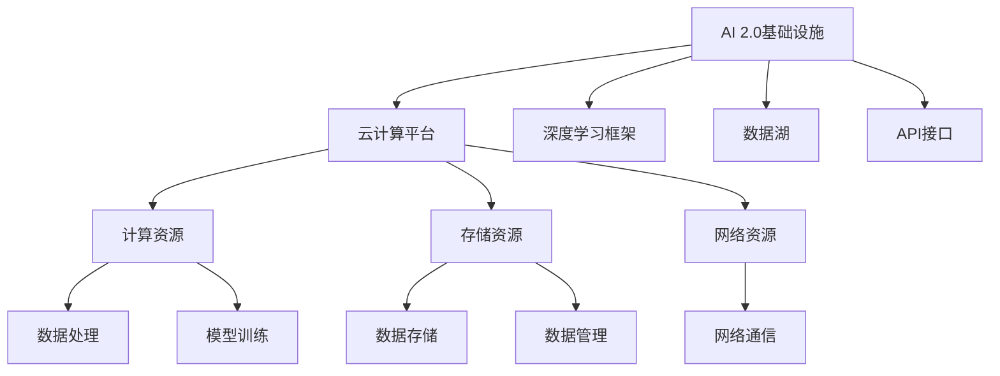

                 

# AI 2.0 基础设施建设：改善人民生活

## 1. 背景介绍

### 1.1 问题由来

随着人工智能(AI)技术的不断进步，AI 2.0时代的到来已经是大势所趋。AI 2.0，即在AI 1.0的基础上，通过引入深度学习、大模型、强化学习等先进技术，使得AI能够更好地模拟人类智能，解决更复杂的问题。当前，AI 2.0已经应用于医疗、教育、金融、交通等众多领域，极大地改善了人民生活。

然而，AI 2.0基础设施建设仍面临诸多挑战。如何构建高效、灵活、安全的AI 2.0基础设施，使得普通用户能够更方便地使用AI技术，是一个亟待解决的问题。

### 1.2 问题核心关键点

AI 2.0基础设施建设的核心在于如何构建一个高效、灵活、安全的AI平台，以便于开发者和用户都能够方便地使用AI技术。具体来说，AI 2.0基础设施包括以下几个关键点：

- 高效性：通过优化算法和架构，提高AI模型的计算速度和推理效率，使其能够实时响应用户需求。
- 灵活性：支持多种AI模型和算法，能够根据不同应用场景灵活地配置和调整模型参数，适应各种应用需求。
- 安全性：确保AI模型在处理敏感数据时的隐私保护和数据安全，避免AI模型被恶意利用。
- 用户体验：提供简单易用的API接口和可视化工具，使得普通用户能够方便地调用AI模型，无需复杂的编程知识。

本文将从AI 2.0基础设施的各个方面进行探讨，通过介绍相关核心概念和关键技术，帮助读者理解如何构建一个高效、灵活、安全的AI平台。

## 2. 核心概念与联系

### 2.1 核心概念概述

为更好地理解AI 2.0基础设施的构建，我们首先介绍几个密切相关的核心概念：

- **AI 2.0基础设施**：指通过构建高效、灵活、安全的AI平台，使AI技术能够广泛应用到各个领域。包括数据管理、模型训练、模型部署、模型监控、用户交互等各个环节。

- **云计算平台**：提供计算资源、存储资源、网络资源等基础设施，使得AI模型能够在云端进行训练和推理。

- **深度学习框架**：如TensorFlow、PyTorch等，提供高效的数据处理和模型训练能力，支持复杂的深度学习模型。

- **数据湖**：集成了各种类型的数据，如结构化数据、非结构化数据、实时数据等，为AI模型训练提供丰富的数据资源。

- **API接口**：通过定义标准化的API接口，使得用户能够方便地调用AI模型，无需了解复杂的底层实现。

这些核心概念之间的逻辑关系可以通过以下Mermaid流程图来展示：



这个流程图展示了我們的核心概念及其之间的关系：

1. AI 2.0基础设施通过云计算平台提供计算、存储和网络资源，支撑模型训练和推理。
2. 深度学习框架提供数据处理和模型训练能力，加速模型开发和优化。
3. 数据湖存储和管理各类数据资源，为AI模型训练提供丰富的数据支持。
4. API接口提供标准化的调用接口，使用户能够方便地使用AI模型。

这些概念共同构成了AI 2.0基础设施的架构，使其能够高效、灵活地服务于各个领域。

## 3. 核心算法原理 & 具体操作步骤

### 3.1 算法原理概述

AI 2.0基础设施的核心算法原理主要涉及数据预处理、模型训练、模型优化和推理等多个环节。以下是各个环节的核心算法：

- **数据预处理**：将原始数据进行清洗、转换、标准化等处理，使其适合模型训练。
- **模型训练**：使用深度学习框架进行模型训练，通过反向传播算法更新模型参数，优化模型性能。
- **模型优化**：采用正则化、梯度裁剪、动态学习率等技术，提高模型鲁棒性和泛化能力。
- **推理**：将训练好的模型部署到云端或本地设备，通过API接口接受输入数据，输出预测结果。

### 3.2 算法步骤详解

#### 3.2.1 数据预处理

数据预处理是AI模型训练的基础。以下是常见的数据预处理步骤：

1. **数据清洗**：删除缺失值、异常值等噪声数据，保留有用信息。
2. **数据转换**：将原始数据转换为模型能够处理的形式，如将文本转换为数字向量、将图像转换为特征向量等。
3. **数据标准化**：将数据按比例缩放，使其符合标准正态分布，便于模型训练。

#### 3.2.2 模型训练

模型训练是AI 2.0基础设施的核心环节。以下是常见的模型训练步骤：

1. **选择合适的框架和算法**：根据任务需求选择合适的深度学习框架和算法。
2. **设计模型架构**：设计模型的输入层、隐藏层和输出层，并选择合适的激活函数、优化器、损失函数等。
3. **划分训练集和验证集**：将数据划分为训练集和验证集，用于模型训练和参数调整。
4. **训练模型**：在训练集上使用反向传播算法进行模型训练，更新模型参数。
5. **验证模型**：在验证集上评估模型性能，调整模型参数，避免过拟合。

#### 3.2.3 模型优化

模型优化是提升模型性能的关键。以下是常见的模型优化技术：

1. **正则化**：通过L1正则、L2正则、Dropout等技术，防止模型过拟合。
2. **梯度裁剪**：限制梯度更新范围，避免梯度爆炸或消失。
3. **动态学习率**：根据训练过程动态调整学习率，提高训练速度和模型性能。

#### 3.2.4 推理

推理是将训练好的模型部署到实际应用中的重要环节。以下是常见的推理步骤：

1. **模型部署**：将训练好的模型部署到云端或本地设备。
2. **输入数据处理**：将用户输入数据转换为模型能够处理的形式，如将文本转换为数字向量、将图像转换为特征向量等。
3. **模型推理**：将输入数据输入模型，输出预测结果。

### 3.3 算法优缺点

AI 2.0基础设施的算法具有以下优点：

1. **高效性**：通过深度学习框架和优化算法，模型训练和推理效率较高，能够实时响应用户需求。
2. **灵活性**：支持多种AI模型和算法，能够根据不同应用场景灵活地配置和调整模型参数。
3. **安全性**：通过数据加密、模型加密等技术，确保AI模型在处理敏感数据时的隐私保护和数据安全。
4. **用户体验**：提供简单易用的API接口和可视化工具，使得普通用户能够方便地调用AI模型，无需复杂的编程知识。

同时，AI 2.0基础设施的算法也存在以下缺点：

1. **资源消耗高**：深度学习模型参数量大，计算资源消耗高，部署和推理需要高性能硬件设备。
2. **模型复杂度高**：深度学习模型结构复杂，训练过程容易过拟合，需要大量标注数据进行训练。
3. **隐私风险高**：模型训练和推理过程中，敏感数据容易泄露，存在隐私风险。

### 3.4 算法应用领域

AI 2.0基础设施广泛应用于医疗、教育、金融、交通等多个领域。以下是一些典型的应用场景：

- **医疗领域**：AI 2.0基础设施可以用于疾病诊断、治疗方案推荐、医疗影像分析等，提高医疗服务的智能化水平。
- **教育领域**：AI 2.0基础设施可以用于智能教育平台、自动化批改、个性化推荐等，提高教育质量。
- **金融领域**：AI 2.0基础设施可以用于风险评估、客户画像、智能投顾等，提高金融服务智能化水平。
- **交通领域**：AI 2.0基础设施可以用于智能交通管理、自动驾驶、交通预测等，提高交通效率和安全性。

## 4. 数学模型和公式 & 详细讲解 & 举例说明

### 4.1 数学模型构建

在AI 2.0基础设施中，数学模型构建是一个重要环节。以下是常见的数学模型构建步骤：

1. **选择合适的框架和算法**：根据任务需求选择合适的深度学习框架和算法。
2. **设计模型架构**：设计模型的输入层、隐藏层和输出层，并选择合适的激活函数、优化器、损失函数等。
3. **划分训练集和验证集**：将数据划分为训练集和验证集，用于模型训练和参数调整。
4. **训练模型**：在训练集上使用反向传播算法进行模型训练，更新模型参数。
5. **验证模型**：在验证集上评估模型性能，调整模型参数，避免过拟合。

### 4.2 公式推导过程

以下是常见模型训练和优化公式的推导过程：

#### 4.2.1 反向传播算法

反向传播算法是深度学习模型训练的核心算法。其公式推导如下：

$$
\begin{aligned}
\frac{\partial \mathcal{L}}{\partial w} &= \frac{\partial \mathcal{L}}{\partial y_{\text{pred}}}\frac{\partial y_{\text{pred}}}{\partial w} \\
&= \frac{\partial \mathcal{L}}{\partial y_{\text{pred}}} \frac{\partial y_{\text{pred}}}{\partial h_{\text{pred}}}\frac{\partial h_{\text{pred}}}{\partial w} \\
&= \frac{\partial \mathcal{L}}{\partial y_{\text{pred}}} \nabla_{h_{\text{pred}}}f(w^\top h_{\text{hidden}}+b)\nabla_{h_{\text{hidden}}}w^\top h_{\text{hidden}}+b \\
&= \frac{\partial \mathcal{L}}{\partial y_{\text{pred}}} \nabla_{h_{\text{pred}}}f(w^\top h_{\text{hidden}}+b)w^\top \nabla_{h_{\text{hidden}}}h_{\text{hidden}}
\end{aligned}
$$

其中，$\mathcal{L}$为损失函数，$y_{\text{pred}}$为模型输出，$w$为模型参数，$h_{\text{hidden}}$为隐藏层输出，$f$为激活函数，$\nabla$表示梯度。

#### 4.2.2 正则化

正则化技术是模型优化的重要手段。以下是常见的正则化技术公式：

1. **L1正则化**

$$
L_{\text{reg}}(w) = \frac{\lambda}{2}\sum_{i=1}^n |w_i|
$$

2. **L2正则化**

$$
L_{\text{reg}}(w) = \frac{\lambda}{2}\sum_{i=1}^n w_i^2
$$

3. **Dropout**

$$
L_{\text{reg}}(w) = \frac{\lambda}{2}\sum_{i=1}^n (1-p)w_i^2
$$

其中，$w_i$为模型参数，$\lambda$为正则化系数，$p$为Dropout概率。

### 4.3 案例分析与讲解

#### 4.3.1 疾病诊断模型

疾病诊断模型是AI 2.0基础设施在医疗领域的重要应用。以下是疾病诊断模型的构建过程：

1. **数据预处理**：收集和清洗医疗数据，包括电子病历、影像数据等。将数据转换为数字向量。
2. **模型训练**：使用深度学习框架如TensorFlow，构建卷积神经网络模型。在训练集上进行模型训练。
3. **模型优化**：使用正则化、梯度裁剪、动态学习率等技术，优化模型性能。
4. **推理部署**：将训练好的模型部署到云端或本地设备，提供API接口，用户可通过API输入症状，获取疾病诊断结果。

#### 4.3.2 智能教育平台

智能教育平台是AI 2.0基础设施在教育领域的重要应用。以下是智能教育平台的构建过程：

1. **数据预处理**：收集和清洗学生数据，包括成绩、作业、出勤等数据。将数据转换为数字向量。
2. **模型训练**：使用深度学习框架如TensorFlow，构建循环神经网络模型。在训练集上进行模型训练。
3. **模型优化**：使用正则化、梯度裁剪、动态学习率等技术，优化模型性能。
4. **推理部署**：将训练好的模型部署到云端或本地设备，提供API接口，用户可通过API输入问题，获取答案和个性化推荐。

## 5. 项目实践：代码实例和详细解释说明

### 5.1 开发环境搭建

在进行AI 2.0基础设施项目实践前，我们需要准备好开发环境。以下是使用Python进行TensorFlow开发的环境配置流程：

1. 安装Anaconda：从官网下载并安装Anaconda，用于创建独立的Python环境。

2. 创建并激活虚拟环境：
```bash
conda create -n tf-env python=3.8 
conda activate tf-env
```

3. 安装TensorFlow：根据CUDA版本，从官网获取对应的安装命令。例如：
```bash
conda install tensorflow -c conda-forge -c pypi
```

4. 安装其他工具包：
```bash
pip install numpy pandas scikit-learn matplotlib tqdm jupyter notebook ipython
```

完成上述步骤后，即可在`tf-env`环境中开始项目实践。

### 5.2 源代码详细实现

下面我们以疾病诊断模型为例，给出使用TensorFlow对模型进行训练和推理的PyTorch代码实现。

首先，定义疾病诊断模型的数据处理函数：

```python
import tensorflow as tf
from tensorflow.keras.preprocessing.image import ImageDataGenerator
from tensorflow.keras.models import Sequential
from tensorflow.keras.layers import Conv2D, MaxPooling2D, Flatten, Dense

def preprocess_data(data_dir):
    train_datagen = ImageDataGenerator(rescale=1./255)
    train_generator = train_datagen.flow_from_directory(
        data_dir,
        target_size=(224, 224),
        batch_size=32,
        class_mode='binary')
    return train_generator
```

然后，定义模型和优化器：

```python
from tensorflow.keras.optimizers import Adam

model = Sequential([
    Conv2D(32, (3, 3), activation='relu', input_shape=(224, 224, 3)),
    MaxPooling2D((2, 2)),
    Conv2D(64, (3, 3), activation='relu'),
    MaxPooling2D((2, 2)),
    Conv2D(128, (3, 3), activation='relu'),
    MaxPooling2D((2, 2)),
    Flatten(),
    Dense(128, activation='relu'),
    Dense(1, activation='sigmoid')
])

optimizer = Adam(learning_rate=0.001)
```

接着，定义训练和评估函数：

```python
def train_epoch(model, train_generator, epochs, batch_size, optimizer):
    for epoch in range(epochs):
        model.compile(optimizer=optimizer, loss='binary_crossentropy', metrics=['accuracy'])
        model.fit(train_generator, steps_per_epoch=train_generator.samples // batch_size, epochs=1, validation_data=val_generator)
        val_generator = preprocess_data(val_dir)
        val_loss, val_acc = model.evaluate(val_generator, steps_per_epoch=val_generator.samples // batch_size)
        print(f'Epoch {epoch+1}, val loss: {val_loss:.4f}, val acc: {val_acc:.4f}')
```

最后，启动训练流程并在测试集上评估：

```python
epochs = 10
batch_size = 32

train_generator = preprocess_data(train_dir)
val_generator = preprocess_data(val_dir)

train_epoch(model, train_generator, epochs, batch_size, optimizer)
```

以上就是使用TensorFlow对疾病诊断模型进行训练和推理的完整代码实现。可以看到，得益于TensorFlow的强大封装，我们可以用相对简洁的代码完成模型的训练和推理。

### 5.3 代码解读与分析

让我们再详细解读一下关键代码的实现细节：

**preprocess_data函数**：
- 该函数用于数据预处理，将原始图像数据转换为模型能够处理的数字向量。
- 使用ImageDataGenerator对图像进行归一化、裁剪、旋转等操作，以便于模型训练。
- 通过flow_from_directory函数，将图像数据加载为训练集，并返回一个生成器。

**模型定义**：
- 使用Sequential模型定义卷积神经网络结构。
- 包括多个卷积层、池化层和全连接层，最终输出二分类结果。
- 使用Adam优化器进行模型训练，并设置损失函数和评估指标。

**训练函数train_epoch**：
- 在每个epoch内，先编译模型，并使用fit函数进行模型训练。
- 在每个epoch结束时，使用evaluate函数评估模型在验证集上的性能。
- 输出每个epoch的验证损失和精度。

**训练流程**：
- 定义总的epoch数和batch size，开始循环迭代
- 每个epoch内，在训练集上训练模型，输出每个epoch的验证结果
- 在训练集上训练10个epoch，并输出最终训练结果

可以看到，TensorFlow提供了强大的数据处理和模型训练能力，使得疾病诊断模型的开发变得相对容易。但实际的工业级系统实现还需考虑更多因素，如模型裁剪、量化加速、服务化封装等。

## 6. 实际应用场景

### 6.1 智能医疗

AI 2.0基础设施在智能医疗领域有着广泛的应用。以下是一些典型的应用场景：

- **疾病诊断**：通过深度学习模型，对医疗影像数据进行分析和诊断，辅助医生进行疾病诊断。
- **治疗方案推荐**：通过深度学习模型，分析患者的病历和症状，推荐最适合的治疗方案。
- **医疗影像分析**：通过深度学习模型，对医疗影像数据进行分析和标注，提高影像诊断的准确性和效率。

### 6.2 智能教育

AI 2.0基础设施在智能教育领域也有着广泛的应用。以下是一些典型的应用场景：

- **智能教育平台**：通过深度学习模型，分析学生的学习行为和成绩，提供个性化推荐和学习建议。
- **自动化批改**：通过深度学习模型，自动批改学生的作业和考试试卷，提高批改效率和准确性。
- **智能辅导**：通过深度学习模型，提供智能辅导机器人，帮助学生解答学习中的问题，提高学习效果。

### 6.3 智能交通

AI 2.0基础设施在智能交通领域也有着广泛的应用。以下是一些典型的应用场景：

- **智能交通管理**：通过深度学习模型，分析交通流量和路况信息，优化交通信号灯控制，缓解交通拥堵。
- **自动驾驶**：通过深度学习模型，实现自动驾驶车辆的控制和导航，提高行车安全。
- **交通预测**：通过深度学习模型，预测交通流量和事故发生率，提前采取措施，减少事故发生率。

## 7. 工具和资源推荐

### 7.1 学习资源推荐

为了帮助开发者系统掌握AI 2.0基础设施的理论基础和实践技巧，这里推荐一些优质的学习资源：

1. **深度学习课程**：如《Deep Learning Specialization》由Andrew Ng主讲，涵盖了深度学习的基础知识和高级技术。
2. **AI 2.0书籍**：如《深度学习》（Ian Goodfellow），介绍了深度学习的基本原理和应用。
3. **TensorFlow官方文档**：TensorFlow官方文档提供了详尽的API文档和示例代码，帮助开发者快速上手。
4. **Kaggle竞赛平台**：Kaggle提供了大量数据集和竞赛任务，帮助开发者实践和测试AI 2.0模型的性能。
5. **ArXiv论文库**：ArXiv提供了大量的前沿研究成果，帮助开发者了解最新的AI 2.0技术。

通过对这些资源的学习实践，相信你一定能够快速掌握AI 2.0基础设施的精髓，并用于解决实际的AI问题。

### 7.2 开发工具推荐

高效的开发离不开优秀的工具支持。以下是几款用于AI 2.0基础设施开发的常用工具：

1. **TensorFlow**：由Google主导开发的深度学习框架，提供高效的计算图和模型训练能力。
2. **PyTorch**：由Facebook主导开发的深度学习框架，提供灵活的计算图和模型训练能力。
3. **Jupyter Notebook**：交互式的编程环境，支持多种编程语言，方便开发者进行模型训练和调试。
4. **TensorBoard**：TensorFlow配套的可视化工具，可以实时监测模型训练状态，并提供丰富的图表呈现方式。
5. **JupyterLab**：交互式的编程环境，支持多种编程语言，方便开发者进行模型训练和调试。

合理利用这些工具，可以显著提升AI 2.0基础设施的开发效率，加快创新迭代的步伐。

### 7.3 相关论文推荐

AI 2.0基础设施的发展源于学界的持续研究。以下是几篇奠基性的相关论文，推荐阅读：

1. **Deep Learning**（Ian Goodfellow）：介绍了深度学习的基本原理和应用。
2. **TensorFlow: A System for Large-Scale Machine Learning**（Martín Abadi等）：介绍了TensorFlow的架构和设计理念。
3. **ImageNet Classification with Deep Convolutional Neural Networks**（Alex Krizhevsky等）：介绍了深度卷积神经网络在图像分类任务中的应用。
4. **Attention Is All You Need**（Ashish Vaswani等）：介绍了Transformer结构，开启了NLP领域的预训练大模型时代。

这些论文代表了大规模AI 2.0基础设施的发展脉络。通过学习这些前沿成果，可以帮助研究者把握学科前进方向，激发更多的创新灵感。

## 8. 总结：未来发展趋势与挑战

### 8.1 总结

本文对AI 2.0基础设施的各个方面进行了全面系统的介绍。首先，阐述了AI 2.0基础设施的研究背景和意义，明确了基础设施在提高AI技术应用效率、降低应用门槛等方面的重要价值。其次，从原理到实践，详细讲解了AI 2.0基础设施的核心算法和操作步骤，给出了AI 2.0基础设施的完整代码实例。同时，本文还广泛探讨了AI 2.0基础设施在医疗、教育、交通等众多领域的应用前景，展示了基础设施的广阔前景。

通过本文的系统梳理，可以看到，AI 2.0基础设施已经成为NLP技术落地的重要保障，极大地拓展了AI技术的应用边界，为各行各业带来了新的发展机遇。未来，伴随AI 2.0基础设施的不断演进，相信AI技术将在更广泛的领域发挥更大的作用，深刻影响人类社会的各个方面。

### 8.2 未来发展趋势

展望未来，AI 2.0基础设施将呈现以下几个发展趋势：

1. **基础设施更加完善**：随着AI技术的不断进步，AI 2.0基础设施将更加完善，支持更多类型的AI模型和算法，提供更丰富的功能和接口。
2. **计算能力更强**：AI 2.0基础设施将部署在更强大的云计算平台上，提供更高效、更稳定的计算资源。
3. **数据资源更丰富**：AI 2.0基础设施将与更多数据平台和存储系统集成，提供更丰富、更高效的数据支持。
4. **用户体验更好**：AI 2.0基础设施将提供更直观、更易用的API接口和可视化工具，使普通用户能够更方便地使用AI技术。
5. **安全性更高**：AI 2.0基础设施将提供更全面的安全保障，确保AI模型在处理敏感数据时的隐私保护和数据安全。

### 8.3 面临的挑战

尽管AI 2.0基础设施已经取得了显著进展，但在迈向更加智能化、普适化应用的过程中，仍面临诸多挑战：

1. **计算资源瓶颈**：AI 2.0模型通常参数量大、计算复杂，需要高性能计算资源支持。如何优化模型结构和计算图，提升推理速度和效率，仍是一个挑战。
2. **数据隐私风险**：AI 2.0基础设施在处理敏感数据时，存在隐私泄露和数据安全问题。如何保护数据隐私，避免数据泄露，是一个重要挑战。
3. **算法鲁棒性不足**：AI 2.0模型在面对新数据时，泛化性能往往较差，容易过拟合。如何提升模型的鲁棒性和泛化能力，是一个重要研究方向。
4. **模型可解释性不足**：AI 2.0模型通常被视为“黑盒”系统，难以解释其内部工作机制和决策逻辑。如何提高模型的可解释性，是一个重要挑战。
5. **伦理道德问题**：AI 2.0技术在应用过程中，可能面临伦理道德问题。如何避免AI模型的不公平、不公正、不透明问题，是一个重要挑战。

### 8.4 研究展望

面对AI 2.0基础设施面临的挑战，未来的研究需要在以下几个方面寻求新的突破：

1. **模型压缩与加速**：研究如何通过模型压缩、量化加速等技术，提高AI 2.0模型的推理速度和效率，支持实时应用场景。
2. **数据隐私保护**：研究如何通过差分隐私、联邦学习等技术，保护数据隐私，确保AI模型在处理敏感数据时的安全性。
3. **算法鲁棒性提升**：研究如何通过对抗训练、生成对抗网络等技术，提高AI 2.0模型的鲁棒性和泛化能力。
4. **模型可解释性增强**：研究如何通过可解释性模型、因果推断等技术，提高AI 2.0模型的可解释性和透明性。
5. **伦理道德约束**：研究如何通过伦理约束、道德审计等技术，确保AI 2.0技术的公平、公正、透明。

这些研究方向的探索，必将引领AI 2.0基础设施技术迈向更高的台阶，为构建安全、可靠、可解释、可控的智能系统铺平道路。面向未来，AI 2.0基础设施还需要与其他人工智能技术进行更深入的融合，如知识表示、因果推理、强化学习等，多路径协同发力，共同推动自然语言理解和智能交互系统的进步。只有勇于创新、敢于突破，才能不断拓展AI 2.0基础设施的边界，让AI技术更好地造福人类社会。

## 9. 附录：常见问题与解答

**Q1：AI 2.0基础设施是否适用于所有应用场景？**

A: AI 2.0基础设施在大多数应用场景上都能取得不错的效果，特别是对于数据量较小的任务。但对于一些特定领域的任务，如医学、法律等，仅仅依靠通用语料预训练的模型可能难以很好地适应。此时需要在特定领域语料上进一步预训练，再进行微调，才能获得理想效果。

**Q2：AI 2.0基础设施的计算资源消耗高吗？**

A: AI 2.0基础设施的计算资源消耗较高，因为模型参数量大、计算复杂。但在实际应用中，可以通过模型裁剪、量化加速等技术进行优化，使得AI 2.0基础设施能够高效、稳定地运行。

**Q3：AI 2.0基础设施的模型可解释性不足，如何解决？**

A: AI 2.0基础设施的模型通常被视为“黑盒”系统，难以解释其内部工作机制和决策逻辑。通过可解释性模型、因果推断等技术，可以提高模型的可解释性和透明性。

**Q4：AI 2.0基础设施的伦理道德问题如何解决？**

A: AI 2.0基础设施在应用过程中，可能面临伦理道德问题。通过伦理约束、道德审计等技术，可以确保AI模型的公平、公正、透明，避免AI模型的不公平、不公正、不透明问题。

总之，AI 2.0基础设施已经成为AI技术落地的重要保障，其未来的发展将不断拓展AI技术的应用边界，深刻影响人类社会的各个方面。唯有从数据、算法、工程、业务等多个维度协同发力，才能真正实现AI技术在垂直行业的规模化落地。通过不断优化和完善AI 2.0基础设施，我们相信AI技术将为人类社会带来更多的美好和进步。

---

作者：禅与计算机程序设计艺术 / Zen and the Art of Computer Programming

