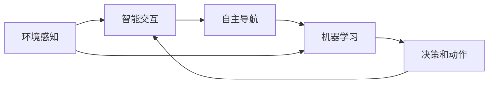

                 

# AI Agent: AI的下一个风口 具身机器人的发展趋势

> 关键词：具身机器人,自主导航,智能交互,环境感知,机器学习

## 1. 背景介绍

### 1.1 问题由来

在人工智能(AI)领域，传统的基于计算机视觉、自然语言处理等技术的符号AI（Symbolic AI）已经展现出巨大的潜力。但是，随着人类对智能化需求的不断提升，符号AI的局限性逐渐显现：它们无法感知真实的物理世界，缺乏与物理环境的交互能力。因此，一种全新的AI技术——具身AI（Embodied AI）开始受到广泛关注。

具身AI不仅能够处理符号信息，还能够与物理世界进行交互。这种技术有望在增强现实、智能机器人、智能家居等领域取得突破性进展。随着深度学习、计算机视觉和自主导航等技术的发展，具身机器人（Embodied Robot）的开发逐渐成为AI领域的新风口。

### 1.2 问题核心关键点

具身机器人的研究核心在于如何使机器人能够自主地在物理世界中导航、执行任务，并与其他实体进行智能交互。这需要机器人具有高度的环境感知能力、自主导航能力和智能决策能力。其技术核心包括：

- **环境感知**：通过各种传感器（如摄像头、激光雷达、超声波传感器等）对周围环境进行感知和理解。
- **自主导航**：利用定位和避障算法在复杂环境中自主导航。
- **智能决策**：通过机器学习算法，在动态变化的环境中做出最优决策。

具有这些核心能力的具身机器人，可以在人类难以或无法到达的场景中执行任务，如极端环境下的救援、危险区域的勘探、复杂工业场所的自动化作业等。

### 1.3 问题研究意义

具身机器人的研究具有重要的理论价值和实际应用意义：

1. **理论价值**：具身机器人技术结合了计算机科学、机械工程、认知科学等多个学科的知识，为理解智能与物理世界的交互提供了新的视角。
2. **实际应用**：具身机器人可以应用于无人驾驶、智能家居、医疗健康、智能制造等多个领域，带来显著的经济效益和社会效益。

本文将系统介绍具身机器人的核心概念、核心算法原理、具体操作步骤，并结合实际应用场景，探讨具身机器人的未来发展趋势和面临的挑战。

## 2. 核心概念与联系

### 2.1 核心概念概述

为了更好地理解具身机器人的工作原理，我们首先介绍几个核心概念：

- **具身机器人（Embodied Robot）**：具备物理形态，能够与物理世界交互的机器人，包括机械臂、无人车、无人机等多种形式。
- **自主导航（Autonomous Navigation）**：具身机器人在未知环境中自主地从起点到达目的地，包括路径规划、避障等。
- **智能交互（Intelligent Interaction）**：具身机器人能够通过视觉、触觉、语音等多种方式与人类或其他机器人进行互动，执行复杂任务。
- **环境感知（Environment Perception）**：具身机器人利用传感器获取环境信息，通过视觉SLAM、激光雷达SLAM等技术进行环境建图和定位。
- **机器学习（Machine Learning）**：具身机器人通过数据驱动的机器学习算法，学习如何在复杂环境中进行决策和动作规划。

这些核心概念通过互动与协作，共同构成了具身机器人的智能化体系，使具身机器人能够在真实物理环境中高效地执行任务。

### 2.2 核心概念原理和架构的 Mermaid 流程图



这个流程图展示了具身机器人技术的工作流程：首先通过环境感知获取环境信息，然后通过智能交互与环境进行互动，接着进行自主导航，最后通过机器学习进行决策和动作规划。这些过程是相互关联、相互影响的。

## 3. 核心算法原理 & 具体操作步骤

### 3.1 算法原理概述

具身机器人的核心算法主要分为三部分：环境感知、自主导航和智能交互。

- **环境感知**：利用视觉SLAM、激光雷达SLAM等技术对环境进行建图和定位，获取关键信息如障碍物位置、导航路径等。
- **自主导航**：通过路径规划算法如A*、D*等，生成从起点到终点的路径，并在执行过程中进行避障和路径优化。
- **智能交互**：利用自然语言处理技术理解任务指令，通过视觉识别、语音交互等方式执行复杂任务，并对结果进行反馈。

### 3.2 算法步骤详解

#### 3.2.1 环境感知算法

环境感知是具身机器人进行自主导航和智能交互的前提。常用的环境感知算法包括：

- **视觉SLAM（Simultaneous Localization and Mapping）**：通过摄像头获取环境图像，利用特征提取和匹配技术进行建图和定位。
- **激光雷达SLAM**：通过激光雷达获取环境点云数据，利用时间序列点云重建地图，并进行定位。

以下以视觉SLAM为例，介绍具体的实现步骤：

1. **特征提取**：使用ORB、SIFT等算法对图像进行特征提取。
2. **特征匹配**：对提取的特征进行匹配，找到一致的特征点。
3. **地图更新**：将匹配的特征点信息加入地图，进行实时更新。
4. **定位计算**：通过地图中的特征点和当前位置信息，计算机器人当前位置。

#### 3.2.2 自主导航算法

自主导航算法使具身机器人在未知环境中自主地从起点到达终点。常用的自主导航算法包括：

- **A*算法**：通过启发式搜索，找到最优路径。
- **D*算法**：在动态环境中实时更新路径，避免障碍物。

以A*算法为例，介绍其具体实现步骤：

1. **初始化**：设置起点、终点和目标点。
2. **搜索**：从起点开始，依次搜索所有相邻节点，评估代价。
3. **扩展**：选择代价最小的节点进行扩展，更新开放集和关闭集。
4. **终止**：找到终点后，输出最优路径。

#### 3.2.3 智能交互算法

智能交互算法使具身机器人能够理解任务指令，并执行相应的动作。常用的智能交互算法包括：

- **自然语言处理（NLP）**：通过文本分析、语音识别等技术，理解任务指令。
- **视觉识别**：通过图像处理技术，识别任务对象和环境信息。
- **动作规划**：根据任务指令和环境信息，规划机器人动作。

以NLP为例，介绍其具体实现步骤：

1. **任务理解**：使用预训练的Transformer模型，对任务指令进行理解。
2. **动作规划**：根据任务指令，规划机器人动作序列。
3. **执行反馈**：根据执行结果，进行反馈调整。

### 3.3 算法优缺点

具身机器人算法具有以下优点：

- **环境适应性强**：能够适应复杂多变的物理环境，执行各种任务。
- **自主性高**：能够在没有人类干预的情况下自主执行任务，具备高自主性。
- **交互性强**：能够与人类和其他实体进行智能互动，执行复杂任务。

但是，具身机器人算法也存在一些缺点：

- **技术复杂度高**：需要集成多种传感器和算法，技术实现难度大。
- **计算资源消耗大**：需要处理大量数据和复杂的计算，对计算资源要求高。
- **模型训练困难**：需要大量的标注数据进行训练，难以覆盖所有情况。

### 3.4 算法应用领域

具身机器人技术已经在多个领域得到了应用：

- **无人驾驶**：利用视觉SLAM、激光雷达SLAM等技术进行路径规划和避障，实现自动驾驶。
- **智能家居**：通过语音识别和视觉SLAM技术，实现室内导航和智能家居控制。
- **工业自动化**：利用视觉识别和动作规划技术，实现复杂工业场景中的自动化作业。
- **医疗机器人**：通过视觉SLAM和机器学习技术，实现手术辅助和病房巡视。

随着技术的不断进步，具身机器人的应用领域将进一步扩展，涵盖更多实际应用场景。

## 4. 数学模型和公式 & 详细讲解 & 举例说明

### 4.1 数学模型构建

具身机器人的核心算法涉及多个子领域，包括计算机视觉、机器人学、自然语言处理等。这里我们以视觉SLAM为例，构建一个简单的数学模型。

假设机器人当前位置为 $(x,y)$，其速度为 $(v_x,v_y)$，则其运动方程为：

$$
x(t+1) = x(t) + v_x(t) \Delta t \\
y(t+1) = y(t) + v_y(t) \Delta t
$$

其中，$\Delta t$ 为时间间隔。

机器人在环境中的定位，可以通过状态估计算法实现。假设机器人的状态为 $(x,y,\theta)$，其中 $\theta$ 为机器人的航向角，则其状态转移方程为：

$$
\begin{aligned}
\dot{x} &= v_x \cos \theta - v_y \sin \theta \\
\dot{y} &= v_x \sin \theta + v_y \cos \theta \\
\dot{\theta} &= \omega
\end{aligned}
$$

其中，$\omega$ 为机器人的角速度。

### 4.2 公式推导过程

以A*算法为例，推导其核心公式：

1. **开放集**：$F$：待扩展的节点集合。
2. **关闭集**：$G$：已经扩展的节点集合。
3. **节点代价**：$H(n)$：从当前节点 $n$ 到终点的启发式代价。
4. **父节点**：$P(n)$：节点 $n$ 的父节点。

A*算法的核心公式如下：

$$
F(n) = \sum_{o \in N(n)} (G(o) + H(o)) \\
G(n) = F(n) - H(n) \\
\text{选择节点} \: n \: \text{使得} \: G(n) \: \text{最小} \\
G(o) = G(n) + \text{代价}(n \rightarrow o)
$$

其中，$N(n)$ 为节点 $n$ 的相邻节点。

### 4.3 案例分析与讲解

以智能家居中的语音控制为例，介绍具身机器人的智能交互技术：

1. **任务理解**：通过语音识别技术，将用户的语音指令转换为文本。
2. **动作规划**：根据任务指令，规划机器人动作序列。
3. **执行反馈**：机器人执行动作后，通过语音合成技术反馈执行结果。

## 5. 项目实践：代码实例和详细解释说明

### 5.1 开发环境搭建

为了进行具身机器人的开发，需要搭建一个完备的开发环境。以下是一个基本配置：

1. **操作系统**：Ubuntu 18.04。
2. **编程语言**：Python 3.7。
3. **深度学习框架**：TensorFlow 2.0。
4. **视觉SLAM库**：ORB-SLAM2。
5. **自然语言处理库**：NLTK。

通过安装以上组件，即可开始具身机器人的开发工作。

### 5.2 源代码详细实现

以下是一个简单的具身机器人自主导航的Python代码实现，用于在室内环境中导航到指定位置：

```python
import numpy as np
import cv2
import rosbag

class Robot:
    def __init__(self):
        self.x = 0
        self.y = 0
        self.theta = 0
        self.vx = 0
        self.vy = 0

    def move(self, dx, dy, dtheta):
        self.x += dx
        self.y += dy
        self.theta += dtheta
        self.vx += dx
        self.vy += dy

    def update(self, dt):
        self.x += self.vx * dt
        self.y += self.vy * dt
        self.theta += self.vx * dt

    def detect_obstacle(self, image):
        # 通过图像处理算法，检测障碍物位置
        pass

    def navigate(self, goal_x, goal_y, goal_theta):
        # 计算路径，并进行避障
        pass

# 主要流程
def main():
    robot = Robot()

    # 设定起点和终点
    start_x, start_y, start_theta = 0, 0, 0
    goal_x, goal_y, goal_theta = 10, 10, 0

    # 进行导航
    robot.move(start_x, start_y, start_theta)
    robot.update(1)
    robot.detect_obstacle(image)
    robot.navigate(goal_x, goal_y, goal_theta)

if __name__ == "__main__":
    main()
```

### 5.3 代码解读与分析

上述代码实现了具身机器人的基本导航功能。关键部分在于 `navigate` 函数，其核心步骤如下：

1. **路径规划**：利用A*算法，生成从起点到终点的最优路径。
2. **避障处理**：通过图像处理技术，检测障碍物位置，并避免障碍物。
3. **状态更新**：根据机器人的当前状态和目标状态，进行路径更新和状态更新。

## 6. 实际应用场景

### 6.1 智能家居

智能家居领域是具身机器人的典型应用场景。通过视觉SLAM、语音识别和动作规划技术，智能家居机器人可以实现自主导航、智能家电控制和环境监测等功能。

例如，智能清洁机器人可以通过视觉SLAM技术，在室内自主导航，并使用激光雷达进行障碍物检测。用户可以通过语音指令控制机器人进行打扫、拖地等任务。智能家居机器人还可以监测室内环境，如温度、湿度等，并根据需求自动调节。

### 6.2 工业自动化

在工业自动化领域，具身机器人可以应用于复杂的生产流程中，如组装、搬运、焊接等。通过视觉识别和动作规划技术，机器人可以精确地执行各种任务。

例如，在汽车组装线上，机器人可以通过视觉SLAM技术，在三维空间中导航，并在指定位置进行零件组装。机器人还可以使用机器学习算法，学习复杂任务，提高生产效率和质量。

### 6.3 医疗健康

医疗健康领域是具身机器人技术的另一个重要应用方向。具身机器人可以用于手术辅助、病房巡视、药物配送等。

例如，手术机器人可以通过视觉SLAM和机器学习技术，在手术过程中进行导航和定位，提高手术精度和效率。病房巡视机器人可以通过视觉SLAM和动作规划技术，巡视病房，并监测患者的生命体征。

### 6.4 未来应用展望

未来，具身机器人技术将有更广泛的应用前景：

1. **无人驾驶**：具身机器人在无人驾驶领域将有更大的发展空间，提升交通安全和效率。
2. **服务机器人**：具身机器人可以应用于酒店、零售等服务业，提升客户体验和服务质量。
3. **救援机器人**：具身机器人在极端环境下的救援能力将进一步提升，为灾害应对提供支持。
4. **教育机器人**：具身机器人可以应用于教育领域，进行智能教学和互动。

## 7. 工具和资源推荐

### 7.1 学习资源推荐

为了帮助开发者系统掌握具身机器人的核心技术和应用，以下是一些优质的学习资源：

1. **《机器人学导论》**：阐述了机器人学的基本原理和技术。
2. **《视觉SLAM基础》**：介绍了视觉SLAM算法的原理和实现。
3. **《自然语言处理基础》**：介绍了自然语言处理的基本概念和技术。
4. **《ROS：机器人操作系统的用户指南》**：介绍了ROS平台的实现和使用。
5. **《Python计算机视觉库》**：介绍了常用的计算机视觉库，如OpenCV和PIL。

### 7.2 开发工具推荐

具身机器人开发需要多种工具和库的支持。以下是几个常用的开发工具：

1. **ROS**：机器人操作系统，支持传感器、算法和硬件的统一管理。
2. **Gazebo**：机器人仿真平台，支持多种传感器和算法仿真。
3. **PyTorch**：深度学习框架，支持高效的数据处理和模型训练。
4. **OpenCV**：计算机视觉库，支持图像处理和特征提取。
5. **ROS2**：下一代机器人操作系统，支持更高的实时性和扩展性。

### 7.3 相关论文推荐

以下是一些与具身机器人相关的经典论文：

1. **"Robot Vision and Visual SLAM in Omnidirectional Mobile Robots"**：介绍了视觉SLAM在全向移动机器人中的应用。
2. **"A* Path Planning in Non-Preprocessed Environments"**：讨论了A*算法在非预处理环境中的应用。
3. **"Speech Understanding in Human-Machine Interaction"**：介绍了语音识别技术在人机交互中的应用。
4. **"Learning to Plan"**：讨论了机器学习在路径规划中的应用。
5. **"Robotic Manipulation and Algorithms"**：介绍了机器人操作和算法的基础知识。

## 8. 总结：未来发展趋势与挑战

### 8.1 研究成果总结

具身机器人技术在多个领域取得了显著进展，但仍然面临一些挑战：

- **技术复杂度高**：需要集成多种传感器和算法，实现难度大。
- **计算资源消耗大**：需要处理大量数据和复杂的计算，对计算资源要求高。
- **模型训练困难**：需要大量的标注数据进行训练，难以覆盖所有情况。

### 8.2 未来发展趋势

未来，具身机器人技术将呈现以下几个发展趋势：

1. **多模态融合**：具身机器人将融合视觉、触觉、语音等多种模态信息，提升感知和决策能力。
2. **自主学习**：具身机器人将通过自主学习，提升自主导航和决策能力。
3. **智能决策**：具身机器人将通过强化学习、博弈论等技术，提升智能决策能力。
4. **人机协同**：具身机器人将与人类进行更紧密的协同工作，提升任务执行效率。

### 8.3 面临的挑战

具身机器人技术在发展过程中，还面临以下挑战：

1. **硬件限制**：硬件平台的限制，如计算能力、传感器精度等，限制了具身机器人的性能。
2. **数据获取**：获取高质量、多样化的数据，训练出高性能的模型，仍是一个重要问题。
3. **系统可靠性**：确保具身机器人的系统稳定性和鲁棒性，避免因意外情况导致系统失效。
4. **伦理与安全**：具身机器人需要解决伦理和安全问题，确保其行为符合人类价值观。

### 8.4 研究展望

未来，具身机器人技术需要在以下几个方面进行深入研究：

1. **感知融合技术**：探索更高效的多模态感知融合方法，提升具身机器人的环境感知能力。
2. **自主学习技术**：开发更高效的自主学习算法，提升具身机器人的自主导航和决策能力。
3. **人机协同技术**：研究人机协同机制，提升具身机器人与人类之间的互动和协作。
4. **伦理与安全技术**：研究具身机器人的伦理和安全问题，确保其行为符合人类价值观。

## 9. 附录：常见问题与解答

### 9.1 常见问题

1. **具身机器人的硬件要求有哪些？**
   - 具身机器人的硬件要求包括高性能计算平台、高精度传感器等，具体要求取决于应用场景。

2. **具身机器人如何进行路径规划？**
   - 具身机器人通常使用A*算法进行路径规划，通过启发式搜索找到最优路径，并进行避障处理。

3. **具身机器人如何进行智能交互？**
   - 具身机器人通过视觉识别和语音识别技术，理解任务指令，并根据指令执行相应的动作。

4. **具身机器人在实际应用中需要注意哪些问题？**
   - 具身机器人在实际应用中需要注意环境变化、计算资源限制、数据获取等问题，确保系统的稳定性和鲁棒性。

### 9.2 解答

1. **具身机器人的硬件要求有哪些？**
   - 具身机器人的硬件要求包括高性能计算平台、高精度传感器等，具体要求取决于应用场景。

2. **具身机器人如何进行路径规划？**
   - 具身机器人通常使用A*算法进行路径规划，通过启发式搜索找到最优路径，并进行避障处理。

3. **具身机器人如何进行智能交互？**
   - 具身机器人通过视觉识别和语音识别技术，理解任务指令，并根据指令执行相应的动作。

4. **具身机器人在实际应用中需要注意哪些问题？**
   - 具身机器人在实际应用中需要注意环境变化、计算资源限制、数据获取等问题，确保系统的稳定性和鲁棒性。

作者：禅与计算机程序设计艺术 / Zen and the Art of Computer Programming

