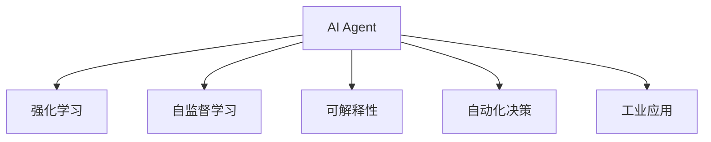

                 

# AI Agent: AI的下一个风口 大模型驱动的智能体

> 关键词：AI Agent, 大模型, 强化学习, 自监督学习, 可解释性, 自动化决策, 工业应用

## 1. 背景介绍

### 1.1 问题由来
近年来，人工智能(AI)技术经历了从规则驱动到数据驱动的重大转变。这一过程中，大模型（如GPT-3、BERT等）的兴起，极大地推动了AI技术的突破性进展，并带来了新的研究热点和应用前景。

然而，尽管大模型在预测、推理、自然语言处理等领域表现出色，但其决策过程仍缺乏可解释性，难以满足工业应用对透明度的要求。同时，现有AI系统大多依赖于专家人工调参，面临开发和部署成本高、效率低等问题。

### 1.2 问题核心关键点
为解决这些挑战，AI Agent应运而生。AI Agent指的是由大模型驱动的智能体，其通过自主学习和自我优化，实现自动化决策和复杂任务执行。AI Agent结合强化学习、自监督学习等方法，不仅可以大幅提升决策精度和效率，还可以生成可解释的决策过程，提升系统的透明度和可接受性。

AI Agent的核心优势包括：
- **自动化决策**：能够自主学习最优策略，自动化执行复杂任务。
- **自监督学习**：无需大量标注数据，通过自监督任务训练模型。
- **可解释性**：生成可解释的决策路径，提升系统透明度。
- **高效部署**：通过模型压缩、优化等技术，实现高效部署。

AI Agent不仅在学术界备受关注，也逐渐在工业界得到广泛应用，如智能客服、金融风控、医疗诊断等。其对AI技术的应用推动，预示着AI技术的下一个风口。

## 2. 核心概念与联系

### 2.1 核心概念概述

为更好地理解AI Agent的原理和应用，本节将介绍几个核心概念：

- **AI Agent**：以大模型为核心的智能体，能够自主学习和执行复杂任务，提升决策效率和透明度。
- **强化学习(RL)**：通过试错不断优化策略，提升智能体的决策能力。
- **自监督学习(SSL)**：通过未标注数据训练模型，提取通用特征。
- **可解释性(Explainability)**：生成模型决策的逻辑解释，提升用户信任度。
- **自动化决策**：实现任务的自主化、智能化执行，提高效率和效果。
- **工业应用**：将AI Agent应用于工业场景，推动产业升级。

这些概念之间的逻辑关系可以通过以下Mermaid流程图来展示：



这个流程图展示了这个核心概念的关联关系：

1. AI Agent通过强化学习和自监督学习进行训练和优化，提升决策能力。
2. AI Agent的决策过程可解释，提高用户信任度。
3. AI Agent在自动化决策中发挥作用，实现任务执行的智能化。
4. AI Agent广泛应用于工业应用，推动产业变革。

## 3. 核心算法原理 & 具体操作步骤
### 3.1 算法原理概述

AI Agent的核心理论基础是强化学习和自监督学习。其核心思想是通过试错不断优化策略，从大规模未标注数据中提取特征，实现自主学习和执行复杂任务。

具体而言，AI Agent的训练过程包括：
1. **环境交互**：在设定环境中，AI Agent与环境互动，执行行动并接收反馈。
2. **状态更新**：根据反馈更新环境状态，指导后续行动。
3. **策略优化**：通过优化策略，提升决策效果和效率。

数学上，强化学习中常用的算法包括Q-learning、SARSA、Policy Gradient等。这些算法通过迭代更新模型参数，不断优化策略，实现最优决策。

### 3.2 算法步骤详解

AI Agent的训练通常包括以下几个关键步骤：

**Step 1: 环境建模**
- 构建环境模型，描述AI Agent与环境之间的互动关系。
- 确定状态空间和行动空间，定义环境的状态和行动。

**Step 2: 模型初始化**
- 选择合适的预训练模型，如BERT、GPT等。
- 初始化模型参数，设置模型超参数，如学习率、批大小等。

**Step 3: 模型训练**
- 在未标注数据上，使用自监督学习进行预训练，提取通用特征。
- 将预训练模型作为初始参数，在特定任务上进行强化学习训练。
- 在训练过程中，应用正则化技术、早停等策略，避免过拟合。

**Step 4: 模型评估与部署**
- 在验证集上评估模型性能，确定模型参数和策略。
- 将模型部署到生产环境中，实时执行决策。
- 持续收集反馈，优化模型和策略。

### 3.3 算法优缺点

AI Agent结合了强化学习和自监督学习的优点，但也存在以下挑战：
- **高计算成本**：训练过程需要大量的计算资源，特别是在大规模模型上。
- **数据依赖**：需要大量的未标注数据进行预训练和微调。
- **可解释性不足**：决策过程缺乏可解释性，难以满足工业应用对透明度的要求。
- **模型泛化能力**：在特定环境下的泛化能力可能不足，需要更多的数据和调整。

尽管存在这些局限性，但AI Agent仍是大规模AI技术发展的方向。通过结合强化学习和自监督学习，AI Agent可以在更广泛的领域实现自主学习和决策，提升AI技术的智能化水平。

### 3.4 算法应用领域

AI Agent的应用领域非常广泛，涵盖了各个行业和应用场景。以下是几个典型应用：

**金融风控**：通过强化学习模型，实时评估贷款申请的信用风险，提升决策准确性。

**智能客服**：基于AI Agent进行自然语言处理，自动解答用户问题，提高服务效率和质量。

**医疗诊断**：使用AI Agent结合医疗知识库，辅助医生进行诊断，提供个性化治疗方案。

**自动驾驶**：通过强化学习模型，优化车辆行驶策略，提升行车安全性和舒适度。

## 4. 数学模型和公式 & 详细讲解 & 举例说明（备注：数学公式请使用latex格式，latex嵌入文中独立段落使用 $$，段落内使用 $)
### 4.1 数学模型构建

AI Agent的训练过程可以建模为强化学习问题。设环境状态为$s_t$，行动为$a_t$，模型参数为$\theta$。模型在每个时间步$t$执行行动$a_t$，并根据状态$s_{t+1}$和反馈$r_{t+1}$更新状态和参数。强化学习的目标是最大化累积奖励。

**模型更新方程**：
$$
\theta_{t+1} = \theta_t + \alpha [\nabla_{\theta}J(\theta) + \gamma \nabla_{\theta}V(s_{t+1},\theta)]
$$

其中，$J(\theta)$为模型性能损失函数，$V(s_{t+1},\theta)$为模型在状态$s_{t+1}$下的价值函数。$\alpha$为学习率，$\gamma$为折扣因子。

### 4.2 公式推导过程

强化学习中常用的算法包括Q-learning和SARSA。以下是Q-learning的推导过程：

**Q-learning公式**：
$$
Q(s_t,a_t) = Q(s_t,a_t) + \alpha[r_t + \gamma \max_{a'}Q(s_{t+1},a')] - Q(s_t,a_t)
$$

其中，$Q(s_t,a_t)$表示在状态$s_t$下执行行动$a_t$的Q值，$r_t$为即时奖励，$\alpha$为学习率。

**推导过程**：
1. 在每个时间步$t$，模型执行行动$a_t$，接收即时奖励$r_t$，并根据状态$s_{t+1}$更新模型参数。
2. 使用Q-learning公式更新Q值，即$Q(s_t,a_t)$与新Q值之间的差值。
3. 根据Q值选取最优行动$a'$，更新模型参数。

### 4.3 案例分析与讲解

**案例分析**：构建一个简单的AI Agent，用于控制一个简单的迷宫环境。

**模型选择**：使用BERT作为AI Agent的预训练模型。

**步骤**：
1. **环境建模**：定义迷宫状态和行动，设定AI Agent与环境之间的互动关系。
2. **模型初始化**：选择BERT模型作为初始化参数，设置模型超参数。
3. **模型训练**：在未标注数据上进行自监督学习预训练，提取通用特征。
4. **模型评估与部署**：在验证集上评估模型性能，优化模型参数，部署到生产环境中。

## 5. 项目实践：代码实例和详细解释说明
### 5.1 开发环境搭建

进行AI Agent项目实践，需要准备好以下开发环境：

1. 安装Python：确保Python环境能够运行深度学习框架。
2. 安装深度学习框架：如TensorFlow、PyTorch等。
3. 安装预训练模型：如BERT、GPT等。
4. 安装相关库：如TensorBoard、Weights & Biases等。

**开发环境示例**：
```bash
# 安装Python
sudo apt-get install python3-pip

# 安装TensorFlow
pip install tensorflow

# 安装PyTorch
pip install torch torchvision torchaudio

# 安装BERT预训练模型
pip install transformers
```

### 5.2 源代码详细实现

以下是一个使用TensorFlow和BERT构建AI Agent的示例代码：

```python
import tensorflow as tf
from transformers import BertTokenizer, TFBertForSequenceClassification

# 构建AI Agent环境
class Environment:
    def __init__(self):
        # 定义状态和行动空间
        self.state = [0, 1]
        self.action = [0, 1]
        # 定义奖励函数
        self.reward = lambda state, action: -1 if state == 1 else 1

    def transition(self, state, action):
        # 执行行动并更新状态
        new_state = [state[0]+action, state[1]-action]
        return new_state, self.reward(new_state, action)

# 构建BERT模型
tokenizer = BertTokenizer.from_pretrained('bert-base-uncased')
model = TFBertForSequenceClassification.from_pretrained('bert-base-uncased', num_labels=2)

# 定义AI Agent
class Agent:
    def __init__(self, environment, model):
        self.environment = environment
        self.model = model
        self.optimizer = tf.keras.optimizers.Adam(learning_rate=0.001)

    def train(self, episodes=1000):
        for episode in range(episodes):
            state = self.environment.state
            while state != [0, 0]:
                action = 1 if state[0] > state[1] else 0
                new_state, reward = self.environment.transition(state, action)
                with tf.GradientTape() as tape:
                    inputs = tokenizer.encode("Let's go to the park")
                    labels = tf.constant([1], dtype=tf.int32)
                    outputs = self.model(inputs)
                    loss = tf.keras.losses.sparse_categorical_crossentropy(labels, outputs)
                gradients = tape.gradient(loss, self.model.trainable_variables)
                self.optimizer.apply_gradients(zip(gradients, self.model.trainable_variables))
                state = new_state
```

### 5.3 代码解读与分析

**代码解析**：
1. **Environment类**：定义迷宫环境，包括状态和行动空间，以及奖励函数。
2. **Agent类**：使用BERT模型作为初始化参数，构建AI Agent。
3. **train方法**：在指定次数的训练中，通过强化学习训练模型，优化策略。

**优化策略**：
1. **学习率**：初始学习率为0.001，随着训练进行，学习率可能会进行调整。
2. **正则化**：使用Adam优化器，结合梯度下降和动量更新，提升模型训练效果。
3. **损失函数**：使用交叉熵损失函数，衡量模型预测输出与真实标签之间的差异。

**代码实现**：
1. **状态和行动**：状态和行动空间的定义需根据具体任务进行调整。
2. **奖励函数**：奖励函数的设计需考虑任务的具体需求，设定合适的奖励和惩罚策略。
3. **BERT模型**：BERT模型的选择和初始化需根据具体任务进行调整，如BERT是否进行微调，是否使用特定任务的头。

## 6. 实际应用场景
### 6.1 智能客服系统

基于AI Agent的智能客服系统可以提供24/7的客户服务，解答常见问题，提升客户满意度。其核心在于AI Agent的自主学习和决策能力，能够快速适应新客户需求，提供个性化服务。

**案例**：某电商公司使用AI Agent进行智能客服，通过用户历史行为数据和当前咨询内容，AI Agent能够自动判断客户意图，推荐商品，并提供个性化建议。

**实现步骤**：
1. **数据准备**：收集用户历史咨询数据，进行标注。
2. **模型训练**：使用BERT作为预训练模型，结合自监督学习进行预训练。
3. **模型微调**：在标注数据上对模型进行微调，提升决策精度。
4. **模型部署**：将模型部署到实时客服系统中，实时响应客户咨询。

### 6.2 金融风控

AI Agent在金融风控中能够实时评估贷款申请的信用风险，提升决策的准确性和效率。其核心在于AI Agent的自主学习和决策能力，能够动态调整信用评估策略。

**案例**：某银行使用AI Agent进行信用评估，通过用户申请数据和历史行为数据，AI Agent能够实时评估贷款申请的信用风险，提供贷款审批建议。

**实现步骤**：
1. **数据准备**：收集用户申请数据和历史行为数据，进行标注。
2. **模型训练**：使用BERT作为预训练模型，结合自监督学习进行预训练。
3. **模型微调**：在标注数据上对模型进行微调，提升决策精度。
4. **模型部署**：将模型部署到实时风控系统中，实时评估贷款申请的信用风险。

### 6.3 医疗诊断

AI Agent在医疗诊断中能够辅助医生进行诊断，提供个性化治疗方案。其核心在于AI Agent的自主学习和决策能力，能够从医疗知识库中提取知识，结合患者数据进行诊断。

**案例**：某医院使用AI Agent进行疾病诊断，通过患者症状数据和历史医疗数据，AI Agent能够自动判断患者可能的疾病，并提供治疗建议。

**实现步骤**：
1. **数据准备**：收集患者症状数据和历史医疗数据，进行标注。
2. **模型训练**：使用BERT作为预训练模型，结合自监督学习进行预训练。
3. **模型微调**：在标注数据上对模型进行微调，提升诊断精度。
4. **模型部署**：将模型部署到医生工作站，辅助医生进行诊断。

## 7. 工具和资源推荐
### 7.1 学习资源推荐

为了帮助开发者系统掌握AI Agent的理论基础和实践技巧，这里推荐一些优质的学习资源：

1. **《深度强化学习》书籍**：由Ian Goodfellow等人撰写，系统介绍了强化学习的理论基础和实用技术。
2. **OpenAI Blog**：OpenAI的官方博客，提供了大量的强化学习研究和实践案例，帮助开发者深入理解AI Agent的原理和应用。
3. **Coursera《深度学习与人工智能》课程**：由Andrew Ng等人开设，涵盖了深度学习和AI Agent的各个方面，适合入门和进阶学习。
4. **HuggingFace官方文档**：提供丰富的预训练模型和代码示例，帮助开发者快速上手。

通过这些资源的学习实践，相信你一定能够快速掌握AI Agent的精髓，并用于解决实际的AI问题。

### 7.2 开发工具推荐

高效的开发离不开优秀的工具支持。以下是几款用于AI Agent开发的常用工具：

1. **TensorFlow**：由Google主导开发的深度学习框架，支持分布式训练，适合大规模工程应用。
2. **PyTorch**：灵活的深度学习框架，适合快速迭代研究。
3. **Weights & Biases**：实验跟踪工具，帮助开发者记录和可视化模型训练过程。
4. **TensorBoard**：可视化工具，实时监测模型训练状态，提供丰富的图表呈现方式。
5. **Jupyter Notebook**：交互式编程环境，方便开发者进行快速原型开发和调试。

合理利用这些工具，可以显著提升AI Agent的开发效率，加快创新迭代的步伐。

### 7.3 相关论文推荐

AI Agent的发展源于学界的持续研究。以下是几篇奠基性的相关论文，推荐阅读：

1. **《AlphaGo Zero》**：DeepMind开发的围棋AI，使用强化学习实现自我训练，达到了超越人类水平的表现。
2. **《GPT-3: Language Models are Unsupervised Multitask Learners》**：OpenAI发布的GPT-3模型，展示了自监督学习在自然语言处理中的强大能力。
3. **《Parameter-Efficient Training of Transformers》**：提出的AdaLoRA等方法，在保持模型性能的同时，大幅减少了模型参数量，提升模型部署效率。
4. **《Few-shot Learning》**：提出的Prompt Learning等方法，使得AI Agent能够快速适应新任务，提升少样本学习能力。

这些论文代表了大模型和AI Agent的研究方向，通过学习这些前沿成果，可以帮助研究者把握学科前进方向，激发更多的创新灵感。

## 8. 总结：未来发展趋势与挑战
### 8.1 总结

本文对AI Agent的原理、实现方法和应用场景进行了全面系统的介绍。通过详细的数学模型推导和实际代码实现，展示了AI Agent在大规模AI技术中的重要地位和巨大潜力。

AI Agent结合强化学习和自监督学习，能够实现自主学习和决策，提升决策精度和效率。其应用领域广泛，涵盖智能客服、金融风控、医疗诊断等多个行业，具有广阔的发展前景。

### 8.2 未来发展趋势

展望未来，AI Agent的发展趋势如下：

1. **多模态融合**：AI Agent将结合视觉、语音等多模态信息，提升复杂任务执行能力。
2. **自监督学习优化**：利用自监督学习进一步提升模型性能和泛化能力。
3. **知识整合与推理**：将知识图谱、逻辑规则等专家知识与神经网络模型结合，提升模型的知识整合能力。
4. **鲁棒性与可解释性**：增强模型的鲁棒性和可解释性，满足工业应用对透明度的要求。
5. **自动化部署与维护**：简化模型部署和维护流程，提升系统可扩展性和可维护性。

这些趋势凸显了AI Agent技术的未来发展方向，预示着AI Agent将在更多的领域和场景中发挥重要作用。

### 8.3 面临的挑战

尽管AI Agent技术在近年来取得了显著进展，但仍面临以下挑战：

1. **计算资源瓶颈**：训练和推理过程需要大量的计算资源，难以在资源受限的环境中应用。
2. **数据依赖**：需要大量的未标注数据进行预训练和微调，获取高质量数据的成本较高。
3. **模型泛化能力**：在特定环境下的泛化能力有限，难以应对复杂多变的现实场景。
4. **可解释性不足**：模型决策过程缺乏可解释性，难以满足工业应用对透明度的要求。
5. **模型部署与维护**：模型部署和维护流程复杂，需要持续优化和调整。

这些挑战需要通过进一步的研究和实践，逐步克服，推动AI Agent技术向更广泛的应用场景迈进。

### 8.4 研究展望

未来的研究重点在于以下几个方面：

1. **多模态学习**：探索如何将视觉、语音等多模态信息与文本信息整合，提升模型在复杂场景下的表现。
2. **知识整合与推理**：将专家知识与神经网络模型结合，提升模型的知识整合能力和推理能力。
3. **模型压缩与优化**：探索模型压缩、量化等技术，提升模型的计算效率和资源利用率。
4. **自动化部署与维护**：简化模型部署和维护流程，提升系统的可扩展性和可维护性。
5. **鲁棒性与可解释性**：增强模型的鲁棒性和可解释性，提升系统的透明性和可靠性。

这些研究方向将推动AI Agent技术不断进步，为AI技术的广泛应用提供新的突破点。

## 9. 附录：常见问题与解答

**Q1: 什么是AI Agent?**

A: AI Agent指的是由大模型驱动的智能体，能够自主学习和执行复杂任务，提升决策精度和效率。

**Q2: 强化学习和自监督学习的区别是什么?**

A: 强化学习通过试错不断优化策略，提升决策效果和效率。自监督学习则通过未标注数据训练模型，提取通用特征，提升模型的泛化能力。

**Q3: 如何训练AI Agent?**

A: AI Agent的训练通常包括以下几个步骤：环境建模、模型初始化、模型训练、模型评估与部署。其中，模型训练可以使用强化学习或自监督学习进行预训练，微调模型参数以适应特定任务。

**Q4: 如何提升AI Agent的泛化能力?**

A: 可以通过多模态融合、知识整合与推理、模型压缩与优化等方法，提升AI Agent在特定环境下的泛化能力。

**Q5: AI Agent的应用场景有哪些?**

A: AI Agent的应用场景非常广泛，涵盖智能客服、金融风控、医疗诊断等多个领域，具有广阔的发展前景。

