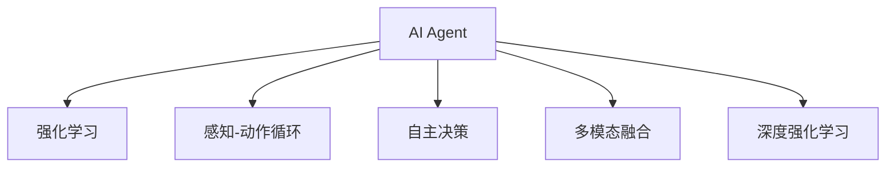

                 

# AI Agent: AI的下一个风口 感知和解析环境与自主决策

## 1. 背景介绍

### 1.1 问题由来
人工智能（AI）已经渗透到众多领域，从医疗、金融到教育、娱乐。然而，AI的核心——智能代理（AI Agent），即能够自主感知、解析环境和进行决策的实体，却尚未得到充分的探索和应用。

### 1.2 问题核心关键点
AI代理的开发和部署是当前AI研究的一个热点和难点。其核心在于如何让机器理解复杂的现实环境，自动提取关键信息，并在此基础上进行高效、稳健的决策。

当前AI代理的开发主要依赖于机器学习、深度学习、自然语言处理等技术，但这些技术在处理复杂的现实世界问题时仍存在诸多挑战。因此，如何构建一个能够灵活应对多变环境的AI代理，成为AI领域的下一个风口。

### 1.3 问题研究意义
构建智能代理，可以显著提升AI技术在实际应用中的效果，尤其是当这些应用需要具备高度的自主性和灵活性时。AI代理将大大拓展AI技术的应用边界，推动AI技术在各行各业中的落地应用。

AI代理在智慧医疗、智能制造、自动驾驶、机器人等领域具有巨大应用潜力。例如，在智能制造中，AI代理可以自动调度生产线，提升生产效率；在自动驾驶中，AI代理可以实时感知交通环境，作出安全决策。

## 2. 核心概念与联系

### 2.1 核心概念概述

为了更好地理解AI代理的工作原理和优化方向，本节将介绍几个密切相关的核心概念：

- AI代理（AI Agent）：指能够自主感知、解析环境和进行决策的实体。AI代理的核心在于其能够理解任务要求，通过自我学习不断提升决策能力。

- 强化学习（Reinforcement Learning, RL）：一种基于奖励和惩罚的学习范式，通过不断与环境交互，使代理逐步学习最优策略。

- 感知-动作循环（Perception-Action Loop）：AI代理通过感知模块获取环境信息，通过决策模块制定行动，再将行动返回环境。感知-动作循环是AI代理的核心工作机制。

- 自主决策（Autonomous Decision Making）：AI代理能够基于自身经验，自主选择最优行动，无需人类干预。

- 多模态融合（Multimodal Fusion）：指将视觉、听觉、触觉等多种模态的信息进行融合，提升感知和决策的准确性。

- 深度强化学习（Deep Reinforcement Learning）：将深度学习与强化学习结合，通过神经网络逼近最优策略，使得AI代理能够在复杂环境中高效学习。

这些核心概念之间的逻辑关系可以通过以下Mermaid流程图来展示：



这个流程图展示了一些关键概念及其之间的联系：

1. AI代理通过感知-动作循环获取环境信息，并通过自主决策模块制定行动。
2. 强化学习是其背后的驱动力，通过不断试错和优化策略，提升代理的决策能力。
3. 多模态融合提升感知模块的准确性，使其能够更好地理解复杂环境。
4. 深度强化学习结合神经网络，加速了AI代理的学习过程，使其在复杂环境中也能高效学习。

## 3. 核心算法原理 & 具体操作步骤
### 3.1 算法原理概述

AI代理的开发主要基于强化学习框架，通过感知模块获取环境信息，通过决策模块制定行动，不断在环境中进行交互学习，优化决策策略。

形式化地，假设环境为 $E$，动作空间为 $A$，状态空间为 $S$，奖励函数为 $R(S,A)$。AI代理通过感知模块 $f_E(S)$ 获取当前状态 $S$，通过决策模块 $g(S)$ 选择动作 $A$，并将其返回环境，获取新的状态 $S'$ 和奖励 $R$。AI代理的最终目标是最大化长期累积奖励：

$$
\max_{\pi} \mathbb{E}\left[\sum_{t=0}^{\infty} \gamma^t R(S_t,A_t)\right]
$$

其中，$\pi$ 为决策策略，$\gamma$ 为折扣因子。

### 3.2 算法步骤详解

AI代理的开发主要包括以下几个关键步骤：

**Step 1: 准备环境与任务**

- 构建模拟环境或真实环境，用于训练和测试AI代理。
- 定义任务目标，明确AI代理需要达成的最终效果，如自动化调度、智能驾驶等。
- 准备环境数据，用于训练AI代理的感知和决策模块。

**Step 2: 设计感知与决策模块**

- 根据环境特征，设计感知模块，用于提取环境信息。例如，使用计算机视觉技术从图像中提取特征，或使用自然语言处理技术从文本中提取信息。
- 设计决策模块，用于根据感知到的信息，制定最优行动策略。例如，使用深度学习模型拟合动作-奖励映射，或使用规则系统进行逻辑推理。

**Step 3: 训练强化学习模型**

- 使用深度强化学习算法，如Q-learning、Policy Gradient等，对AI代理进行训练。
- 设定合适的奖励函数，定义哪些行为会获得奖励，哪些行为会受到惩罚。
- 使用蒙特卡罗方法或时序差分方法，估算最优策略。
- 定期在验证集上评估模型性能，调整超参数，优化模型。

**Step 4: 部署与测试**

- 将训练好的AI代理部署到实际应用场景中。
- 在实际环境中进行测试，验证模型性能。
- 根据测试结果，不断调整模型参数，优化模型。

### 3.3 算法优缺点

AI代理的开发基于强化学习框架，具有以下优点：

1. 自主性高。AI代理能够自主感知环境，进行决策，无需人工干预。
2. 鲁棒性强。通过与环境的交互学习，AI代理能够适应不同的环境变化，提升决策鲁棒性。
3. 可扩展性好。AI代理可以应用于多种复杂场景，如自动驾驶、智能制造等。

同时，AI代理也存在以下局限性：

1. 数据需求大。训练AI代理需要大量的环境数据，数据的获取和标注成本较高。
2. 模型复杂度高。AI代理的感知和决策模块通常需要复杂的网络结构和大量的参数。
3. 训练时间长。强化学习的训练过程较长，需要大量的计算资源和时间。
4. 模型鲁棒性不足。AI代理在面对新环境时，可能出现过拟合或泛化能力不足的问题。

尽管存在这些局限性，但AI代理的研究前景广阔，其核心在于通过不断学习，提升感知和决策的准确性，在复杂环境中实现自主决策。

### 3.4 算法应用领域

AI代理的应用领域非常广泛，涵盖自动驾驶、智能制造、智慧医疗、机器人等领域。以下是几个典型应用：

- 自动驾驶：AI代理可以通过感知模块实时获取道路、车辆信息，通过决策模块制定行驶策略，实现自主驾驶。
- 智能制造：AI代理可以实时监控生产线状态，自主调度设备，提升生产效率。
- 智慧医疗：AI代理可以自主进行疾病诊断，制定治疗方案，辅助医生决策。
- 机器人：AI代理可以自主导航、避障、执行任务，提升机器人工作效率和安全性。

此外，AI代理还可以应用于无人机、智能家居、金融分析等领域，为各行各业带来变革性影响。

## 4. 数学模型和公式 & 详细讲解 & 举例说明

### 4.1 数学模型构建

本节将使用数学语言对AI代理的强化学习模型进行更加严格的刻画。

假设环境为 $E$，状态空间为 $S$，动作空间为 $A$，奖励函数为 $R(S,A)$。AI代理通过感知模块 $f_E(S)$ 获取当前状态 $S$，通过决策模块 $g(S)$ 选择动作 $A$，并将其返回环境，获取新的状态 $S'$ 和奖励 $R$。

定义模型 $Q$ 为动作-奖励状态值函数，表示在状态 $S$ 下，选择动作 $A$ 的累积奖励期望值：

$$
Q(S,A) = \mathbb{E}\left[\sum_{t=0}^{\infty} \gamma^t R(S_t,A_t)\right]
$$

其中，$\gamma$ 为折扣因子。

AI代理的目标是最小化预测动作值与真实动作值的差距：

$$
\min_{\theta} \mathbb{E}_{s\sim S}\left[\sum_{a}(|Q_{\theta}(s,a)-y(s,a)|)^2\right]
$$

其中，$y(s,a)$ 为真实动作值。

### 4.2 公式推导过程

以下我们以自动驾驶中的车道保持任务为例，推导Q-learning算法的详细计算过程。

假设自动驾驶汽车当前状态 $s=(s_x,s_y,v)$，动作空间为 $A=\{左,右,直行\}$。奖励函数定义为：

- 如果车辆保持在车道内，则奖励 $R=1$。
- 如果车辆偏离车道，则惩罚 $R=-1$。
- 如果车辆发生碰撞，则严重惩罚 $R=-10$。

使用Q-learning算法对自动驾驶模型进行训练，步骤如下：

1. 初始化Q值表 $Q(s,a)$，设定探索策略 $\epsilon$。
2. 在每个状态下，以概率 $\epsilon$ 进行探索动作 $a$，以概率 $1-\epsilon$ 进行利用动作 $a$。
3. 根据观察到的状态 $s'$ 和奖励 $r$，更新Q值表：
   $$
   Q(s,a) = Q(s,a) + \eta [r + \gamma \max_a Q(s',a) - Q(s,a)]
   $$
4. 重复步骤2和3，直到收敛。

### 4.3 案例分析与讲解

在自动驾驶车道保持任务中，AI代理需要实时感知车辆位置和车道线信息，通过决策模块选择左、右或直行动作。以下是Q-learning算法的具体实现步骤：

1. 初始化Q值表 $Q(s,a)$，设定探索策略 $\epsilon$。
2. 在每个状态下，以概率 $\epsilon$ 进行探索动作 $a$，以概率 $1-\epsilon$ 进行利用动作 $a$。
3. 根据观察到的状态 $s'$ 和奖励 $r$，更新Q值表：
   $$
   Q(s,a) = Q(s,a) + \eta [r + \gamma \max_a Q(s',a) - Q(s,a)]
   $$
4. 重复步骤2和3，直到收敛。

以下是Python代码实现：

```python
import numpy as np

# 定义状态和动作空间
states = [(s_x, s_y, v) for s_x in range(-10, 10) for s_y in range(-10, 10) for v in range(0, 10)]
actions = ['左', '右', '直行']

# 定义奖励函数
def reward(s, a):
    if s[0] < -5 or s[0] > 5:
        return -1
    elif s[0] < -2 or s[0] > 2:
        return -0.1
    elif s[0] < 0 or s[0] > 0:
        return -0.05
    else:
        return 0.0

# 定义Q值表
Q = np.zeros((len(states), len(actions)))

# 设定探索策略
epsilon = 0.1

# Q-learning算法训练
for episode in range(1000):
    s = np.random.choice(states)
    a = np.random.choice(actions)
    while s is not None:
        a_next = np.argmax(Q[s] + epsilon * np.random.randn(len(actions))) if np.random.rand() < epsilon else a
        s_next, r = s, reward(s, a)
        Q[s, a] += epsilon * (r + gamma * np.max(Q[s_next]) - Q[s, a])
        s, a = s_next, a_next

print(Q)
```

可以看到，通过Q-learning算法，AI代理能够逐步学习到车道保持任务的奖励函数和最优策略。

## 5. 项目实践：代码实例和详细解释说明
### 5.1 开发环境搭建

在进行AI代理的开发实践前，我们需要准备好开发环境。以下是使用Python进行TensorFlow和OpenAI Gym开发的环境配置流程：

1. 安装Anaconda：从官网下载并安装Anaconda，用于创建独立的Python环境。

2. 创建并激活虚拟环境：
```bash
conda create -n tf-env python=3.8 
conda activate tf-env
```

3. 安装TensorFlow：根据CUDA版本，从官网获取对应的安装命令。例如：
```bash
conda install tensorflow==2.6 -c conda-forge
```

4. 安装OpenAI Gym：
```bash
pip install gym
```

5. 安装各类工具包：
```bash
pip install numpy pandas scikit-learn matplotlib tqdm jupyter notebook ipython
```

完成上述步骤后，即可在`tf-env`环境中开始AI代理的开发。

### 5.2 源代码详细实现

这里我们以自动驾驶车道保持任务为例，使用TensorFlow和OpenAI Gym库实现一个简单的AI代理。

首先，定义环境类和动作空间：

```python
import gym

class CarDriving(gym.Env):
    def __init__(self):
        self.state = [0, 0, 0]
        self.action_space = gym.spaces.Discrete(3)
        self.reward_range = (-1, 1)
        self.observation_space = gym.spaces.Box(low=-10, high=10, shape=(3,), dtype=np.float32)
        
    def reset(self):
        self.state = [0, 0, 0]
        return self.state
    
    def step(self, action):
        if action == 0:  # 左
            self.state[0] -= 1
        elif action == 1:  # 右
            self.state[0] += 1
        else:  # 直行
            self.state[1] += 1
        r = reward(self.state, action)
        return self.state, r, False, {}
        
    def render(self):
        pass
```

然后，定义Q-learning算法：

```python
import tensorflow as tf

class QLearning:
    def __init__(self, env, alpha=0.1, gamma=0.9, epsilon=0.1):
        self.env = env
        self.alpha = alpha
        self.gamma = gamma
        self.epsilon = epsilon
        self.q_table = tf.Variable(tf.zeros([len(env.observation_space), len(env.action_space)]))
        self.optimizer = tf.keras.optimizers.Adam(learning_rate=alpha)
    
    def choose_action(self, state):
        if np.random.rand() < self.epsilon:
            return self.env.action_space.sample()
        else:
            return np.argmax(self.q_table[state])
    
    def update_q_table(self, state, action, next_state, reward):
        q_next = self.q_table[next_state]
        q_state = self.q_table[state, action]
        with tf.GradientTape() as tape:
            q_value = q_next + self.gamma * tf.reduce_max(self.q_table[next_state])
        gradients = tape.gradient(q_value, self.q_table)
        self.optimizer.apply_gradients(zip(gradients, [self.q_table[state]]))
```

接下来，定义训练和测试函数：

```python
def train_q_learning(env, q_learning, num_episodes=1000):
    for episode in range(num_episodes):
        state = env.reset()
        done = False
        while not done:
            action = q_learning.choose_action(state)
            next_state, reward, done, info = env.step(action)
            q_learning.update_q_table(state, action, next_state, reward)
            state = next_state
    return q_learning.q_table

def test_q_learning(env, q_learning, num_episodes=100):
    total_reward = 0
    for episode in range(num_episodes):
        state = env.reset()
        done = False
        while not done:
            action = q_learning.choose_action(state)
            next_state, reward, done, info = env.step(action)
            total_reward += reward
            state = next_state
    return total_reward / num_episodes
```

最后，启动训练流程并在测试集上评估：

```python
env = CarDriving()
q_learning = QLearning(env)
q_learning.train_q_learning(env, num_episodes=1000)

test_reward = q_learning.test_q_learning(env, num_episodes=100)
print("测试奖励:", test_reward)
```

以上就是使用TensorFlow和OpenAI Gym实现自动驾驶车道保持任务的具体代码实现。可以看到，通过Q-learning算法，AI代理能够逐步学习到车道保持任务的奖励函数和最优策略。

### 5.3 代码解读与分析

让我们再详细解读一下关键代码的实现细节：

**CarDriving类**：
- `__init__`方法：初始化状态、动作空间、奖励范围和观测空间。
- `reset`方法：重置环境，返回初始状态。
- `step`方法：执行一个动作，返回下一个状态、奖励和是否结束标志。
- `render`方法：可视化环境状态。

**QLearning类**：
- `__init__`方法：初始化Q表、学习率、折扣因子和探索策略。
- `choose_action`方法：根据当前状态选择动作。
- `update_q_table`方法：根据动作-状态-奖励三元组更新Q表。

**训练和测试函数**：
- `train_q_learning`方法：在环境上运行Q-learning算法，训练Q表。
- `test_q_learning`方法：在环境上运行测试集，评估Q表性能。

可以看到，TensorFlow和OpenAI Gym使得AI代理的开发变得简洁高效。开发者可以将更多精力放在模型改进和优化上，而不必过多关注底层的实现细节。

当然，工业级的系统实现还需考虑更多因素，如模型的保存和部署、超参数的自动搜索、多智能体协作等。但核心的AI代理开发流程基本与此类似。

## 6. 实际应用场景
### 6.1 智能制造

在智能制造中，AI代理可以实时监控生产线状态，自主调度设备，提升生产效率。例如，使用AI代理监控机器人的工作状态，避免设备故障，减少停机时间。

**具体步骤**：
1. 收集生产线上的传感器数据，如温度、湿度、压力等。
2. 定义设备状态空间和动作空间，如启动、停止、调整参数等。
3. 使用强化学习算法，训练AI代理监控生产线状态，优化调度策略。
4. 将AI代理部署到实际生产环境中，实时监控生产线，并根据环境变化自主调整设备。

### 6.2 智慧医疗

在智慧医疗中，AI代理可以自主进行疾病诊断，制定治疗方案，辅助医生决策。例如，使用AI代理辅助影像诊断，快速识别肿瘤病灶。

**具体步骤**：
1. 收集病人的影像数据，如X光、CT、MRI等。
2. 定义疾病状态空间和动作空间，如诊断结果、治疗方案等。
3. 使用深度强化学习算法，训练AI代理进行疾病诊断，优化治疗方案。
4. 将AI代理部署到医疗系统中，辅助医生进行诊断和治疗。

### 6.3 智能家居

在智能家居中，AI代理可以实时监控家庭环境，自主控制家电设备。例如，使用AI代理控制空调温度、灯光亮度等。

**具体步骤**：
1. 收集家庭环境数据，如温度、湿度、光照等。
2. 定义家电状态空间和动作空间，如开关、调节参数等。
3. 使用强化学习算法，训练AI代理监控家庭环境，优化家电控制策略。
4. 将AI代理部署到智能家居系统中，实现自动控制。

### 6.4 未来应用展望

随着AI代理的不断发展，其应用场景将越来越广泛。以下是一些未来展望：

1. 多智能体协作：多个AI代理之间可以相互协作，共同完成复杂任务，如自动驾驶中的多车协同。
2. 元学习：AI代理能够自动学习新任务，减少训练时间，提高泛化能力。
3. 联邦学习：多个设备共享模型参数，保护隐私同时提升模型性能。
4. 自主规划：AI代理能够自主规划路线，优化路径选择，提升执行效率。
5. 多模态融合：将视觉、听觉、触觉等多种模态的信息进行融合，提升感知和决策的准确性。
6. 边缘计算：在边缘设备上运行AI代理，减少延迟，提升响应速度。

这些趋势凸显了AI代理的广阔前景。AI代理能够适应复杂多变的环境，实现自主决策，将在更多领域发挥重要作用。

## 7. 工具和资源推荐
### 7.1 学习资源推荐

为了帮助开发者系统掌握AI代理的理论基础和实践技巧，这里推荐一些优质的学习资源：

1. 《强化学习》课程：斯坦福大学开设的强化学习课程，有Lecture视频和配套作业，带你深入理解强化学习的核心概念和算法。

2. 《深度强化学习》书籍：Deep Reinforcement Learning Books，系统介绍了深度强化学习的原理和应用，包含大量实践案例。

3. OpenAI Gym：开源的强化学习环境，包含丰富的环境库和示例代码，方便开发者进行实验和测试。

4. TensorFlow代理库：TensorFlow提供的代理库，包括Q-learning、Policy Gradient等算法，方便开发者快速搭建代理模型。

5. PyTorch代理库：PyTorch提供的代理库，包括PPO、SAC等算法，支持深度学习框架的强化学习实验。

6. AlphaGo论文：DeepMind开发的AlphaGo，展示了AI代理在复杂游戏环境中的应用，具有很高的参考价值。

通过对这些资源的学习实践，相信你一定能够快速掌握AI代理的精髓，并用于解决实际的AI问题。

### 7.2 开发工具推荐

高效的开发离不开优秀的工具支持。以下是几款用于AI代理开发的常用工具：

1. TensorFlow：基于Python的开源深度学习框架，适合进行复杂算法实验和部署。

2. PyTorch：基于Python的开源深度学习框架，灵活的计算图，适合快速迭代研究。

3. OpenAI Gym：开源的强化学习环境，提供丰富的环境库和示例代码，方便开发者进行实验和测试。

4. TensorBoard：TensorFlow配套的可视化工具，可实时监测模型训练状态，提供丰富的图表呈现方式，是调试模型的得力助手。

5. Weights & Biases：模型训练的实验跟踪工具，可以记录和可视化模型训练过程中的各项指标，方便对比和调优。

6. Gurobi：商业优化求解器，用于求解优化问题，支持复杂的数学建模。

合理利用这些工具，可以显著提升AI代理的开发效率，加快创新迭代的步伐。

### 7.3 相关论文推荐

AI代理的研究源于学界的持续探索。以下是几篇奠基性的相关论文，推荐阅读：

1. AlphaGo论文：DeepMind开发的AlphaGo，展示了AI代理在复杂游戏环境中的应用，具有很高的参考价值。

2. OpenAI Five论文：OpenAI开发的OpenAI Five，展示了AI代理在多人对抗游戏中的应用，具有重要的实际意义。

3. Robo-Scholar论文：Lisa Dionne开发的Robo-Scholar，展示了AI代理在学术出版中的应用，具有很高的研究价值。

4. AI代理综述：Sumit Saha等人撰写的AI代理综述论文，详细介绍了AI代理的研究进展和应用场景。

这些论文代表了大规模AI代理的研究方向。通过学习这些前沿成果，可以帮助研究者把握学科前进方向，激发更多的创新灵感。

## 8. 总结：未来发展趋势与挑战

### 8.1 研究成果总结

本文对AI代理的工作原理和优化方向进行了全面系统的介绍。首先阐述了AI代理的研究背景和意义，明确了其在智能制造、智慧医疗、智能家居等领域的广阔应用前景。其次，从原理到实践，详细讲解了强化学习模型的数学模型和计算过程，给出了AI代理的具体代码实现。同时，本文还广泛探讨了AI代理在实际应用中的各种优化方法，如多智能体协作、元学习、联邦学习等，为未来研究提供了参考。

通过本文的系统梳理，可以看到，AI代理的研究正在迅速发展，并在多个实际应用中展现出了强大的潜力和应用价值。

### 8.2 未来发展趋势

展望未来，AI代理将呈现以下几个发展趋势：

1. 多智能体协作：多个AI代理之间可以相互协作，共同完成复杂任务，如自动驾驶中的多车协同。
2. 元学习：AI代理能够自动学习新任务，减少训练时间，提高泛化能力。
3. 联邦学习：多个设备共享模型参数，保护隐私同时提升模型性能。
4. 自主规划：AI代理能够自主规划路线，优化路径选择，提升执行效率。
5. 多模态融合：将视觉、听觉、触觉等多种模态的信息进行融合，提升感知和决策的准确性。
6. 边缘计算：在边缘设备上运行AI代理，减少延迟，提升响应速度。

这些趋势凸显了AI代理的广阔前景。AI代理能够适应复杂多变的环境，实现自主决策，将在更多领域发挥重要作用。

### 8.3 面临的挑战

尽管AI代理的研究前景广阔，但在迈向更加智能化、普适化应用的过程中，仍面临诸多挑战：

1. 数据需求大：训练AI代理需要大量的环境数据，数据的获取和标注成本较高。
2. 模型复杂度高：AI代理的感知和决策模块通常需要复杂的网络结构和大量的参数。
3. 训练时间长：强化学习的训练过程较长，需要大量的计算资源和时间。
4. 模型鲁棒性不足：AI代理在面对新环境时，可能出现过拟合或泛化能力不足的问题。
5. 安全性有待保障：AI代理可能存在漏洞，被攻击者利用，造成安全隐患。

尽管存在这些挑战，但AI代理的研究前景广阔，其核心在于通过不断学习，提升感知和决策的准确性，在复杂环境中实现自主决策。

### 8.4 研究展望

面对AI代理面临的挑战，未来的研究需要在以下几个方面寻求新的突破：

1. 探索无监督和半监督强化学习：摆脱对大规模标注数据的依赖，利用自监督学习、主动学习等无监督和半监督范式，最大限度利用非结构化数据，实现更加灵活高效的AI代理。
2. 研究参数高效和计算高效的强化学习算法：开发更加参数高效的强化学习算法，如Reinforce、PPO等，在固定大部分感知和决策模块参数的同时，只更新极少量的任务相关参数。
3. 引入因果推断和对比学习：通过引入因果推断和对比学习思想，增强AI代理建立稳定因果关系的能力，学习更加普适、鲁棒的语言表征，从而提升模型泛化性和抗干扰能力。
4. 纳入伦理道德约束：在模型训练目标中引入伦理导向的评估指标，过滤和惩罚有偏见、有害的输出倾向。
5. 结合因果分析和博弈论工具：将因果分析方法引入AI代理，识别出模型决策的关键特征，增强输出解释的因果性和逻辑性。借助博弈论工具刻画人机交互过程，主动探索并规避模型的脆弱点，提高系统稳定性。

这些研究方向的探索，必将引领AI代理技术迈向更高的台阶，为构建安全、可靠、可解释、可控的智能系统铺平道路。面向未来，AI代理技术还需要与其他人工智能技术进行更深入的融合，如知识表示、因果推理、强化学习等，多路径协同发力，共同推动自然语言理解和智能交互系统的进步。只有勇于创新、敢于突破，才能不断拓展AI代理的边界，让智能技术更好地造福人类社会。

## 9. 附录：常见问题与解答

**Q1: 如何选择合适的奖励函数？**

A: 奖励函数的设计是AI代理成功的关键。合理的奖励函数能够引导AI代理学习最优策略，避免过拟合或欠拟合。通常需要根据具体任务和环境特征设计奖励函数。例如，在自动驾驶车道保持任务中，保持车辆在车道内时应获得高奖励，偏离车道时应受到惩罚。

**Q2: 如何平衡探索和利用？**

A: 探索和利用是强化学习中的两个重要策略。探索策略能够使AI代理探索新的状态和动作，发现未知的知识；利用策略则能够利用已知的信息，减少不必要的尝试。常用的策略包括$\epsilon$-greedy、Softmax等。通过调整$\epsilon$值，可以在训练初期以更大的概率进行探索，训练后期以更大的概率进行利用，提高学习效率。

**Q3: 如何进行模型压缩和加速？**

A: 模型压缩和加速是提高AI代理性能的关键。常用的方法包括模型剪枝、量化、模型蒸馏等。例如，在自动驾驶车道保持任务中，可以使用模型蒸馏技术，将大模型的知识迁移到小模型中，提升推理速度和效率。

**Q4: 如何提升AI代理的鲁棒性？**

A: AI代理的鲁棒性是其应用的关键。提升鲁棒性可以从以下几个方面入手：
1. 数据多样性：使用多种数据源，提升模型的泛化能力。
2. 正则化：使用L2正则、Dropout等方法，减少过拟合风险。
3. 对抗训练：使用对抗样本训练模型，提升模型的鲁棒性。
4. 多智能体协作：通过多智能体协作，提升模型对复杂环境的适应能力。

这些方法可以有效提升AI代理的鲁棒性，确保其能够在实际应用中稳定运行。

**Q5: 如何优化AI代理的模型训练？**

A: 优化AI代理的模型训练可以从以下几个方面入手：
1. 选择合适的优化器：如Adam、RMSprop等，不同的优化器可能适用于不同的任务。
2. 设置合适的学习率：学习率过高可能导致模型震荡，过低可能收敛缓慢。通常需要根据具体任务进行调参。
3. 使用自适应学习率算法：如AdaGrad、Adadelta等，根据梯度变化自适应调整学习率。
4. 使用学习率衰减策略：如多阶段学习率衰减，提高模型稳定性和收敛速度。

通过以上方法，可以显著提升AI代理的训练效果，提高模型性能。

通过本文的系统梳理，可以看到，AI代理的研究正在迅速发展，并在多个实际应用中展现出了强大的潜力和应用价值。

作者：禅与计算机程序设计艺术 / Zen and the Art of Computer Programming

