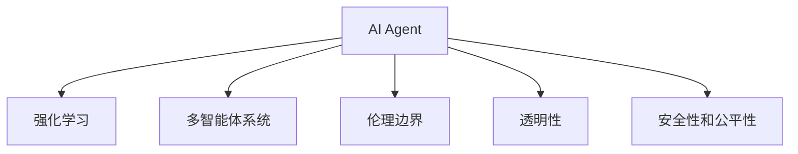

                 

# AI Agent: AI的下一个风口 自主决策与人类的伦理界限

> 关键词：AI Agent, 自主决策, 伦理界限, 智能推荐, 系统架构, 强化学习, 多智能体

## 1. 背景介绍

### 1.1 问题由来

随着人工智能(AI)技术的快速发展，AI Agent已经从简单的自动化脚本发展到具备自主决策能力的智能体。AI Agent不仅能够执行重复性任务，还能在复杂环境中主动学习和调整策略，为各行各业带来了深刻变革。然而，AI Agent的自主决策与人类的伦理界限问题，成为了AI发展中的一大挑战。

### 1.2 问题核心关键点

AI Agent的自主决策涉及多学科融合，包括人工智能、伦理学、心理学、法律等。核心关键点包括：

- 决策过程的透明性和可解释性
- 智能体的伦理边界和责任归属
- 与人类用户的交互模式和信任度
- 在复杂环境中的行为合理性和安全性
- 系统的公平性、公正性和可控性

这些问题不仅涉及技术实现，还触及道德、法律和社会的方方面面，成为未来AI发展的核心议题。本文将从AI Agent的自主决策与伦理界限出发，深入探讨这些关键问题，为AI技术的发展提供方向性指导。

## 2. 核心概念与联系

### 2.1 核心概念概述

为更好地理解AI Agent的自主决策与伦理界限问题，本节将介绍几个密切相关的核心概念：

- AI Agent: 一种具备自主决策能力的智能体，能够在复杂环境中主动学习和调整策略，以实现特定目标。
- 强化学习(Reinforcement Learning, RL): 一种通过环境反馈进行自主学习的过程，智能体通过试错不断优化决策策略，以最大化预期奖励。
- 多智能体系统(Multi-Agent System,MAS): 多个AI Agent在复杂交互环境中共同工作的系统，通过协作和竞争实现集体目标。
- 伦理边界(Ethical Boundaries): AI Agent的决策和行为需符合社会道德和法律规定，维护人类利益和社会秩序。
- 透明性(Transparency): AI Agent的决策过程需可解释和可追溯，保障用户的知情权和信任度。
- 安全性和公平性(Security & Fairness): AI Agent需具备安全性保障措施，公平无偏见地处理各类数据和任务。

这些核心概念之间的逻辑关系可以通过以下Mermaid流程图来展示：



这个流程图展示了我AI Agent的自主决策所涉及的核心概念及其之间的关系：

1. AI Agent通过强化学习在环境中主动学习和决策。
2. 多智能体系统使AI Agent具备协作和竞争的能力，处理复杂交互任务。
3. 伦理边界界定了AI Agent的行为准则，维护人类利益和社会秩序。
4. 透明性确保AI Agent的决策过程可解释和可追溯。
5. 安全性和公平性保障AI Agent处理数据和任务的安全性和公正性。

这些核心概念共同构成了AI Agent的自主决策与伦理界限的框架，为其在多领域的广泛应用提供了基础。

## 3. 核心算法原理 & 具体操作步骤

### 3.1 算法原理概述

AI Agent的自主决策与伦理界限问题，本质上是多智能体系统中的强化学习问题。AI Agent通过在环境中不断试错和优化，学习到最优的决策策略。这一过程需要平衡以下几个关键因素：

- 最大化预期奖励: AI Agent需要最大化其在环境中的累计奖励，以实现目标任务。
- 遵循伦理规则: AI Agent的行为需符合社会道德和法律规定，避免对人类造成伤害。
- 透明和可解释: AI Agent的决策过程需透明，保障用户的知情权和信任度。
- 安全性保障: AI Agent需具备安全性措施，避免因决策失误导致的安全问题。
- 公平无偏见: AI Agent处理数据和任务时需公平无偏见，维护社会公正。

### 3.2 算法步骤详解

基于强化学习的AI Agent自主决策过程，一般包括以下几个关键步骤：

**Step 1: 环境建模**

- 确定AI Agent所处的复杂环境，包括环境状态、可操作动作、奖励函数等。
- 建立环境模型，使AI Agent能够对环境进行仿真和预测。

**Step 2: 决策策略选择**

- 设计合适的决策策略，如Q-Learning、策略梯度、策略搜索等。
- 根据环境特点和任务需求，选择合适的算法进行自主决策。

**Step 3: 学习过程执行**

- 在环境中进行试错学习，不断优化决策策略。
- 记录学习过程中的经验数据，用于后续的策略改进。

**Step 4: 决策效果评估**

- 评估AI Agent在环境中的决策效果，包括累积奖励、成功率等。
- 根据评估结果，调整决策策略或环境模型，继续优化。

**Step 5: 行为输出**

- 将AI Agent的决策策略应用于实际环境，执行相应动作。
- 实时监测AI Agent的行为，确保符合伦理和法律规定。

### 3.3 算法优缺点

基于强化学习的AI Agent自主决策方法具有以下优点：

1. 自主学习能力强: AI Agent能够主动探索和优化策略，适应复杂环境。
2. 可扩展性强: 多智能体系统能够并行处理多个任务，提高决策效率。
3. 动态调整能力强: AI Agent能够实时调整策略，应对环境变化。
4. 具备可解释性: 通过策略选择和环境建模，可以理解AI Agent的决策过程。

但该方法也存在一些局限性：

1. 环境建模难度大: 复杂环境建模困难，可能影响AI Agent的学习效果。
2. 强化学习不稳定: 决策策略可能在环境变化下不稳定，导致性能波动。
3. 决策过程不透明: 一些复杂的决策过程难以解释，影响用户信任。
4. 伦理边界难以界定: AI Agent的决策行为可能面临伦理和法律的挑战。
5. 安全性问题: AI Agent在复杂环境中可能出现决策失误，导致安全问题。
6. 公平性问题: AI Agent在处理数据时可能存在偏见，影响公平性。

尽管存在这些局限性，强化学习仍是目前实现AI Agent自主决策的主流方法。未来相关研究的重点在于如何进一步提升决策的透明性、安全性和公平性，同时兼顾伦理边界和用户信任度等因素。

### 3.4 算法应用领域

基于强化学习的AI Agent自主决策方法，已经在诸多领域得到了广泛应用，例如：

- 智能推荐系统: 通过学习用户偏好，主动推荐商品或内容，提升用户体验。
- 自动驾驶: 在复杂交通环境中自主决策，保障行车安全。
- 机器人控制: 在工业和家庭环境中自主导航和操作，提高效率。
- 金融投资: 自动分析市场数据，做出投资决策，优化收益。
- 医疗诊断: 通过学习医学数据，辅助医生做出诊断，提高准确性。
- 物流调度: 在动态环境中优化物流路线和资源配置，提升效率。

除了上述这些经典应用外，AI Agent还在更多场景中得到创新应用，如智能合约、智能家居、智能安防等，为各行业数字化转型提供新的技术路径。随着强化学习方法的不断进步，相信AI Agent将会在更广阔的领域展现其强大潜力。

## 4. 数学模型和公式 & 详细讲解 & 举例说明

### 4.1 数学模型构建

本节将使用数学语言对基于强化学习的AI Agent自主决策过程进行更加严格的刻画。

记AI Agent在环境中的状态为 $s$，可操作动作为 $a$，预期奖励为 $r(s,a)$。AI Agent的决策策略为 $\pi(s)$，表示在状态 $s$ 下选择动作 $a$ 的概率。环境模型为 $p(s'|s,a)$，表示在状态 $s$ 下执行动作 $a$ 后，状态转移到 $s'$ 的概率。AI Agent的决策过程可以表示为：

$$
\max_{\pi} \mathbb{E}_{s,a\sim\pi}\left[\sum_{t=0}^{\infty} \gamma^t r(s_t,a_t)\right]
$$

其中 $\gamma$ 为折扣因子，表示未来奖励的权重。

### 4.2 公式推导过程

以下我们以Q-Learning算法为例，推导其核心公式及其推导过程。

Q-Learning算法通过估计状态-动作值函数 $Q(s,a)$，即在状态 $s$ 下执行动作 $a$ 的预期奖励和值。其核心公式为：

$$
Q_{\theta}(s,a) \leftarrow Q_{\theta}(s,a) + \alpha [r(s,a) + \gamma \max_{a'} Q_{\theta}(s',a') - Q_{\theta}(s,a)]
$$

其中 $\theta$ 为模型参数，$\alpha$ 为学习率，$Q_{\theta}(s,a)$ 表示在状态 $s$ 下执行动作 $a$ 的Q值。

该公式的推导过程如下：

- 根据强化学习的定义，$Q(s,a)$ 表示在状态 $s$ 下执行动作 $a$ 的预期奖励和值，可表示为：
$$
Q(s,a) = \mathbb{E}_{s'} [\sum_{t=0}^{\infty} \gamma^t r(s_t,a_t)]
$$

- 由于在每个时间步只能执行一个动作，因此有 $a' = a$。将状态转移概率和折扣因子代入，得：
$$
Q(s,a) = \mathbb{E}_{s'} [r(s,a) + \gamma Q(s',a)]
$$

- 将 $Q(s',a)$ 代入上式，并进行化简，得：
$$
Q(s,a) = r(s,a) + \gamma \max_{a'} Q(s',a')
$$

- 将上述公式代入Q-Learning的更新公式，得：
$$
Q_{\theta}(s,a) \leftarrow Q_{\theta}(s,a) + \alpha [r(s,a) + \gamma \max_{a'} Q_{\theta}(s',a') - Q_{\theta}(s,a)]
$$

这个公式表示了Q-Learning算法的核心更新逻辑，即在每个时间步根据当前状态和动作的奖励和值，以及下一步的奖励和值，更新状态-动作值函数 $Q_{\theta}(s,a)$。

### 4.3 案例分析与讲解

我们以智能推荐系统为例，解释Q-Learning算法在实际应用中的作用和效果。

假设有一个电商平台的智能推荐系统，目标是推荐用户最感兴趣的商品。系统通过用户的历史浏览、购买记录和评分数据，训练一个Q-Learning模型。在每个推荐周期中，系统根据用户当前状态（如浏览历史），选择推荐动作（如推荐商品ID），并根据用户点击、购买等行为，更新模型参数。

具体步骤如下：

1. **环境建模**：将用户的历史行为数据作为状态，将推荐动作（商品ID）作为可操作动作。设定推荐目标为最大化用户点击和购买行为，奖励函数为 $r(s,a) = 1$ （推荐成功）或 $0$ （推荐失败）。

2. **策略选择**：设计Q-Learning策略，通过不断调整模型参数，优化推荐策略。

3. **学习过程执行**：在推荐周期内，系统根据用户当前状态选择推荐动作，并根据推荐结果更新模型参数。

4. **决策效果评估**：评估推荐系统的点击率、购买率等指标，根据评估结果调整模型策略。

5. **行为输出**：根据模型预测的推荐动作，对用户进行个性化推荐，提升用户体验。

通过Q-Learning算法，智能推荐系统能够根据用户行为和偏好，主动调整推荐策略，提升推荐效果。同时，系统也具备一定的透明性，用户可以通过查看推荐逻辑和策略参数，理解推荐过程，增强信任度。

## 5. 项目实践：代码实例和详细解释说明

### 5.1 开发环境搭建

在进行AI Agent项目实践前，我们需要准备好开发环境。以下是使用Python进行强化学习开发的环境配置流程：

1. 安装Anaconda：从官网下载并安装Anaconda，用于创建独立的Python环境。

2. 创建并激活虚拟环境：
```bash
conda create -n reinforcement-env python=3.8 
conda activate reinforcement-env
```

3. 安装相关依赖包：
```bash
pip install numpy pandas gym matplotlib scikit-learn tqdm jupyter notebook ipython
```

4. 安装强化学习库：
```bash
pip install gym
```

5. 安装深度学习框架：
```bash
pip install tensorflow keras
```

完成上述步骤后，即可在`reinforcement-env`环境中开始项目实践。

### 5.2 源代码详细实现

这里我们以智能推荐系统的Q-Learning算法为例，给出使用TensorFlow和Keras库对智能推荐系统进行开发和微调的PyTorch代码实现。

```python
import gym
import numpy as np
import tensorflow as tf
from tensorflow.keras.models import Sequential
from tensorflow.keras.layers import Dense

# 创建环境
env = gym.make('MountainCar-v0')

# 定义状态和动作空间
state_dim = env.observation_space.shape[0]
action_dim = env.action_space.n

# 定义模型
model = Sequential([
    Dense(64, input_shape=(state_dim,), activation='relu'),
    Dense(64, activation='relu'),
    Dense(action_dim, activation='linear')
])

# 定义损失函数和优化器
loss_fn = tf.keras.losses.MeanSquaredError()
optimizer = tf.keras.optimizers.Adam(learning_rate=0.01)

# 定义训练过程
def train(env, model, n_episodes, batch_size=32):
    state_memory = []
    reward_memory = []
    
    for episode in range(n_episodes):
        state = env.reset()
        state = np.expand_dims(state, axis=0)
        done = False
        total_reward = 0
        while not done:
            # 选择动作
            action_prob = model.predict(state)
            action = np.random.choice(np.arange(action_dim), p=action_prob[0])
            
            # 执行动作，观察环境
            next_state, reward, done, _ = env.step(action)
            next_state = np.expand_dims(next_state, axis=0)
            
            # 存储经验数据
            state_memory.append(state)
            reward_memory.append(reward)
            
            state = next_state
            
        # 训练模型
        model.compile(optimizer=optimizer, loss=loss_fn)
        x = np.array(state_memory)
        y = np.array(reward_memory)
        model.fit(x, y, batch_size=batch_size, epochs=1, verbose=0)
        
        # 记录奖励
        total_reward += reward
        print(f'Episode {episode+1}, Reward: {total_reward}')

# 开始训练
train(env, model, n_episodes=1000)
```

以上代码实现了使用TensorFlow和Keras库对Mountain Car环境进行Q-Learning算法的训练和测试。通过不断在环境中试错学习，智能体能够逐步优化决策策略，最大化累积奖励。

### 5.3 代码解读与分析

让我们再详细解读一下关键代码的实现细节：

**gym创建环境**：
- `gym.make('MountainCar-v0')` 创建Mountain Car环境，用于强化学习模拟。

**模型定义**：
- `Sequential` 用于构建深度学习模型，包含三个全连接层，最后一层输出动作概率分布。
- `Dense` 层定义全连接层，每层包含64个神经元，使用ReLU激活函数。

**损失函数和优化器**：
- `tf.keras.losses.MeanSquaredError` 用于定义均方误差损失函数，适用于回归任务。
- `tf.keras.optimizers.Adam` 用于定义Adam优化器，学习率为0.01。

**训练过程**：
- `train` 函数定义了强化学习训练的完整流程。
- 在每个 episode 中，智能体从环境中选择动作，执行动作并观察环境，将状态和奖励存储在内存中。
- 使用训练好的模型，根据状态和奖励对模型进行预测和更新。
- 在训练结束后，输出每个 episode 的累计奖励。

**代码运行结果**：
- 通过运行`train`函数，可以在Mountain Car环境中进行Q-Learning算法的训练和测试。

以上代码实现了基于强化学习的AI Agent自主决策过程的完整代码实例，展示了AI Agent在实际应用中的运行效果。

## 6. 实际应用场景

### 6.1 智能推荐系统

智能推荐系统是强化学习在实际应用中的典型案例。通过学习用户偏好和行为，智能推荐系统能够主动调整推荐策略，实现个性化推荐，提升用户体验。

在具体实现上，可以使用Q-Learning等强化学习算法，训练推荐模型。通过不断试错学习，模型能够最大化用户满意度和点击率，实现高效精准的推荐。智能推荐系统不仅能够提高电商平台的销售转化率，还能应用于视频、音乐、新闻等多个领域，提供个性化内容推荐，满足用户需求。

### 6.2 自动驾驶

自动驾驶系统需要在复杂交通环境中自主决策，保障行车安全。强化学习提供了强大的自主决策能力，能够使AI Agent在动态环境中做出最优决策。

具体实现中，可以构建包含交通信号、行人、车辆等多种元素的复杂环境模型，使用强化学习算法训练驾驶策略。通过实时感知环境和执行动作，AI Agent能够实现自动避障、路径规划等功能，提升驾驶安全性。

### 6.3 医疗诊断

医疗诊断系统可以通过强化学习学习医学知识，辅助医生进行疾病诊断。在医疗环境中，获取高质量的标注数据往往成本高昂，强化学习可以缓解这一问题。

具体实现中，可以将医生对疾病的诊断过程作为奖励信号，AI Agent通过学习医学知识，逐渐提高诊断准确性。通过不断优化诊断策略，AI Agent能够辅助医生进行疾病预测和诊断，提高诊疗效率。

### 6.4 未来应用展望

随着强化学习方法的不断进步，AI Agent将在更多领域得到应用，为各行各业带来变革性影响。

在智慧医疗领域，基于AI Agent的医疗诊断系统能够实现疾病预测、健康管理等功能，提升医疗服务水平。

在智能教育领域，AI Agent可以辅助教师进行教学设计，推荐个性化学习资源，提高教学效果。

在智能家居领域，AI Agent能够实现家庭设备自动化控制，提升生活质量。

此外，在工业制造、能源管理、环境保护等众多领域，AI Agent都将发挥重要作用，推动各行各业数字化转型升级。

## 7. 工具和资源推荐

### 7.1 学习资源推荐

为了帮助开发者系统掌握AI Agent的自主决策与伦理界限问题，这里推荐一些优质的学习资源：

1. 《强化学习基础》系列博文：由AI专家撰写，深入浅出地介绍了强化学习的基本概念和算法。

2. 《Deep Q-Networks for Humanoid Robotics》论文：提出使用深度Q-Networks进行人形机器人控制的经典案例，展示了强化学习在实际应用中的强大潜力。

3. 《OpenAI Gym》文档：提供大量的环境模拟器和强化学习库，帮助开发者快速上手实践。

4. 《Reinforcement Learning: An Introduction》书籍：强化学习领域的经典教材，涵盖强化学习的基本理论和算法。

5. 《Hands-On Reinforcement Learning with Python》书籍：通过实例代码和项目实践，帮助开发者掌握强化学习的应用技能。

通过对这些资源的学习实践，相信你一定能够快速掌握AI Agent的自主决策与伦理界限的精髓，并用于解决实际的AI问题。

### 7.2 开发工具推荐

高效的开发离不开优秀的工具支持。以下是几款用于强化学习开发的常用工具：

1. PyTorch：基于Python的开源深度学习框架，灵活动态的计算图，适合快速迭代研究。支持强化学习算法和模型开发。

2. TensorFlow：由Google主导开发的开源深度学习框架，生产部署方便，适合大规模工程应用。支持强化学习算法和模型训练。

3. OpenAI Gym：提供大量的环境模拟器和强化学习库，用于训练和测试AI Agent。

4. Weights & Biases：模型训练的实验跟踪工具，可以记录和可视化模型训练过程中的各项指标，方便对比和调优。

5. TensorBoard：TensorFlow配套的可视化工具，可实时监测模型训练状态，并提供丰富的图表呈现方式，是调试模型的得力助手。

合理利用这些工具，可以显著提升AI Agent的开发效率，加快创新迭代的步伐。

### 7.3 相关论文推荐

AI Agent的自主决策与伦理界限问题涉及多学科融合，以下是几篇奠基性的相关论文，推荐阅读：

1. Q-Learning: A Method for General Artificial Intelligence (GAIs)：提出Q-Learning算法，成为强化学习的基础算法之一。

2. AlphaGo Zero: Mastering the Game of Go without Human Knowledge：展示了AlphaGo Zero在无监督学习下超越人类棋手的能力，引发了AI界对强化学习的重新关注。

3. DeepMind Health：提出使用强化学习进行医疗诊断和治疗，展示了AI Agent在医疗领域的应用潜力。

4. Multi-Agent Reinforcement Learning: A Survey: IJCAI-21:25 - 35：综述了多智能体系统在强化学习中的应用，为AI Agent的协作决策提供了理论基础。

5. Ethics and Trust in AI：探讨了AI技术中的伦理问题和用户信任度，为AI Agent的设计提供了道德边界指导。

这些论文代表了大语言模型微调技术的发展脉络。通过学习这些前沿成果，可以帮助研究者把握学科前进方向，激发更多的创新灵感。

## 8. 总结：未来发展趋势与挑战

### 8.1 总结

本文对基于强化学习的AI Agent自主决策与伦理界限问题进行了全面系统的介绍。首先阐述了AI Agent的自主决策过程和伦理界限的重要性，明确了在复杂环境中的决策策略选择和行为规范。其次，从原理到实践，详细讲解了强化学习在AI Agent应用中的核心步骤和算法实现，给出了AI Agent在实际应用中的代码实例。同时，本文还广泛探讨了AI Agent在智能推荐、自动驾驶、医疗诊断等多个领域的应用前景，展示了其广阔的发展潜力。此外，本文精选了AI Agent的相关学习资源、开发工具和经典论文，力求为开发者提供全方位的技术指引。

通过本文的系统梳理，可以看到，AI Agent的自主决策与伦理界限问题涉及技术、伦理、社会等多重因素，需要全面考量。AI Agent的广泛应用，不仅带来了技术进步，也带来了新的伦理挑战和法律问题。未来，AI Agent需要在提高决策透明性和可解释性的同时，兼顾伦理边界和用户信任度，才能真正实现其社会价值。

### 8.2 未来发展趋势

展望未来，AI Agent自主决策与伦理界限问题将呈现以下几个发展趋势：

1. 深度强化学习不断发展。深度Q-Networks、策略梯度、策略搜索等深度强化学习算法将逐步替代传统强化学习，提高决策效率和精度。

2. 多智能体系统更加普及。多智能体系统能够实现协作和竞争，处理更复杂的交互任务，提升AI Agent的决策能力。

3. 伦理边界更加明确。AI Agent的决策过程将受到更多伦理和法律约束，保证人类利益和社会秩序。

4. 决策透明性和可解释性提高。AI Agent的决策过程将更加透明，用户能够理解和信任决策结果。

5. 安全性保障措施加强。AI Agent将具备更强的安全性保障措施，避免因决策失误导致的安全问题。

6. 公平性和公正性提升。AI Agent在处理数据和任务时将更加公平无偏见，维护社会公正。

以上趋势凸显了AI Agent自主决策与伦理界限问题的复杂性和重要性，需要多方协同推进。通过不断优化算法和改进设计，AI Agent将为各行各业带来更广阔的应用空间。

### 8.3 面临的挑战

尽管AI Agent的自主决策与伦理界限问题取得了一定进展，但在迈向更加智能化、普适化应用的过程中，仍面临诸多挑战：

1. 环境建模难度大。复杂环境建模困难，可能影响AI Agent的学习效果。

2. 强化学习不稳定。决策策略可能在环境变化下不稳定，导致性能波动。

3. 决策过程不透明。一些复杂的决策过程难以解释，影响用户信任。

4. 伦理边界难以界定。AI Agent的决策行为可能面临伦理和法律的挑战。

5. 安全性问题。AI Agent在复杂环境中可能出现决策失误，导致安全问题。

6. 公平性问题。AI Agent在处理数据时可能存在偏见，影响公平性。

尽管存在这些挑战，AI Agent的自主决策与伦理界限问题仍具有广阔的发展前景。未来，需要从算法、伦理、社会等多个角度进行深入研究，逐步克服这些难题，推动AI技术的健康发展。

### 8.4 研究展望

面对AI Agent自主决策与伦理界限问题所面临的挑战，未来的研究需要在以下几个方面寻求新的突破：

1. 探索更高效的强化学习算法。开发更高效的深度强化学习算法，提高决策效率和精度。

2. 研究更透明的决策过程。通过引入因果分析和博弈论工具，增强决策过程的透明性和可解释性。

3. 引入更多先验知识。将符号化的先验知识，如知识图谱、逻辑规则等，与神经网络模型进行巧妙融合，提升决策效果。

4. 纳入伦理道德约束。在模型训练目标中引入伦理导向的评估指标，过滤和惩罚有偏见、有害的输出倾向。

5. 加强人工智能的伦理学研究。深入探讨AI技术的伦理问题，构建伦理道德框架，确保AI技术健康发展。

这些研究方向的探索，必将引领AI Agent自主决策与伦理界限问题迈向更高的台阶，为构建安全、可靠、可解释、可控的智能系统铺平道路。面向未来，AI Agent的自主决策与伦理界限问题仍需不断探索和优化，才能真正实现其社会价值。

## 9. 附录：常见问题与解答

**Q1：AI Agent的决策过程如何保证透明性和可解释性？**

A: 透明性和可解释性是AI Agent的重要特征之一。为了实现这一目标，可以采取以下措施：

1. 决策过程可视化：通过可视化工具展示AI Agent的决策过程，使用户能够理解每一步的决策依据。

2. 模型参数解释：利用可解释性技术，如LIME、SHAP等，对模型参数进行解释，说明决策原因。

3. 因果分析：引入因果分析方法，分析决策结果与输入特征之间的关系，提供可解释的因果链条。

4. 多模型集成：使用多个模型进行决策，取平均或投票结果，增加决策过程的透明度和可解释性。

5. 模型原型开放：公开模型设计原型和训练过程，接受第三方审核和验证，提高决策过程的可信度。

通过以上措施，可以有效提高AI Agent的决策过程透明性和可解释性，增强用户信任度。

**Q2：AI Agent在处理数据时如何避免偏见和歧视？**

A: 偏见和歧视是AI Agent应用中需要高度重视的问题。为了避免这些问题，可以采取以下措施：

1. 数据预处理：对输入数据进行预处理，去除明显的偏见和歧视信息，保证数据公平性。

2. 数据标注：确保标注数据的多样性和代表性，避免标注偏差。

3. 公平性约束：在模型训练过程中，引入公平性约束，避免输出结果出现偏见。

4. 公平性评估：定期评估模型输出结果，检测是否存在偏见和歧视，及时进行调整。

5. 可解释性模型：使用可解释性模型，帮助理解模型决策依据，发现偏见和歧视来源。

6. 法律监管：遵循相关法律法规，确保AI Agent的决策行为符合伦理道德标准。

通过以上措施，可以有效避免AI Agent在处理数据时的偏见和歧视问题，提高系统的公平性和公正性。

**Q3：AI Agent在多智能体系统中如何实现协作和竞争？**

A: 多智能体系统是AI Agent协作和竞争的重要环境。为了实现协作和竞争，可以采取以下措施：

1. 通信机制：设计合理的通信机制，使多个AI Agent能够共享信息和协调行动。

2. 协作策略：使用协作学习算法，如分布式强化学习、多智能体训练等，使多个AI Agent共同学习优化决策策略。

3. 竞争机制：设计合理的竞争机制，如纳什均衡、博弈论等，使多个AI Agent在竞争中实现最优策略。

4. 多目标优化：设计多目标优化算法，使多个AI Agent在多个目标之间权衡和协调。

5. 联邦学习：通过联邦学习技术，使多个AI Agent在分布式环境下协作学习，共享知识。

通过以上措施，可以有效实现AI Agent在多智能体系统中的协作和竞争，提升系统的整体性能。

**Q4：AI Agent在复杂环境中如何保证决策的安全性？**

A: 决策安全性是AI Agent应用中的重要保障。为了保证决策安全性，可以采取以下措施：

1. 安全性约束：在模型训练过程中，引入安全性约束，避免决策失误导致的安全问题。

2. 安全性评估：定期评估模型输出结果，检测是否存在安全隐患，及时进行调整。

3. 安全性测试：在模拟环境中进行安全性测试，检测模型的鲁棒性和稳定性。

4. 安全机制：设计安全机制，如异常检测、故障恢复等，保障系统安全运行。

5. 安全监管：遵循相关法律法规，确保AI Agent的决策行为符合安全标准。

通过以上措施，可以有效保证AI Agent在复杂环境中的决策安全性，提高系统的可靠性和稳定性。

**Q5：AI Agent在多智能体系统中如何实现公平性？**

A: 公平性是AI Agent应用中的重要指标。为了实现公平性，可以采取以下措施：

1. 公平性约束：在模型训练过程中，引入公平性约束，避免输出结果出现偏见。

2. 公平性评估：定期评估模型输出结果，检测是否存在公平性问题，及时进行调整。

3. 公平性测试：在模拟环境中进行公平性测试，检测模型的公平性和公正性。

4. 公平性机制：设计公平性机制，如加权平均、随机抽样等，确保模型决策公平性。

5. 公平性监管：遵循相关法律法规，确保AI Agent的决策行为符合公平性标准。

通过以上措施，可以有效实现AI Agent在多智能体系统中的公平性，提高系统的公正性和可信度。

---

作者：禅与计算机程序设计艺术 / Zen and the Art of Computer Programming

