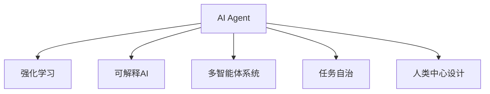

                 

## 1. 背景介绍

### 1.1 问题由来
近年来，人工智能（AI）技术迅猛发展，其广泛应用改变了人类的生产方式和生活方式。从工业自动化到客服机器人，从医疗诊断到智能推荐，AI已经成为各行各业的重要助力。然而，AI在发展过程中也暴露出了一些问题：例如，机器的决策过程难以解释、用户交互体验不够自然、系统缺乏灵活性和应变能力等。这些问题极大地限制了AI技术的应用范围和实际效果。

### 1.2 问题核心关键点
针对这些问题，AI专家们提出了“人机协同”的理念。即，在人工智能技术的基础上，结合人类的智慧和经验，实现人机优势互补，共同完成任务。AI Agent（智能代理）是实现人机协同的关键技术，通过设计可解释性强、智能灵活、适应性高的AI Agent，可以让AI技术与人类协作更加高效、透明，从而解决上述问题，推动AI技术进一步发展。

### 1.3 问题研究意义
研究AI Agent技术，对于提升AI系统的可解释性、智能性和灵活性具有重要意义：

1. **增强可解释性**：AI Agent可以提供清晰、可解释的决策依据，帮助用户理解和信任AI系统的行为。
2. **提升智能水平**：通过学习和适应的能力，AI Agent可以更好地理解人类需求，提供更智能的解决方案。
3. **增强适应性**：AI Agent可以根据环境和任务的变化，动态调整策略和行为，适应复杂的实际应用场景。
4. **促进技术落地**：人机协同的AI Agent技术更容易被各行各业接受和应用，加速AI技术产业化进程。
5. **推动伦理与合规**：可解释、透明、可控的AI Agent可以更好地应对隐私、安全等伦理问题，符合法律法规要求。

## 2. 核心概念与联系

### 2.1 核心概念概述

为了更好地理解AI Agent技术，本节将介绍几个密切相关的核心概念：

- **AI Agent**：一种能够自主感知、学习、决策和行动的智能系统，是实现人机协同的关键技术。
- **强化学习（RL）**：一种通过与环境交互，利用奖励信号指导智能体学习的学习方法。
- **可解释AI（XAI）**：旨在提高AI系统的可解释性和透明度的技术，帮助用户理解和信任AI决策。
- **多智能体系统（MAS）**：由多个智能体组成的系统，各个智能体相互协作，共同完成复杂任务。
- **任务自治（Task Autonomy）**：AI Agent在完成特定任务时的自主性和独立性，减少对人类干预的依赖。
- **人类中心设计（Human-Centric Design）**：以用户需求和体验为中心，设计人机协同的AI Agent，提升用户满意度和接受度。

这些核心概念之间的逻辑关系可以通过以下Mermaid流程图来展示：



这个流程图展示了一些关键概念的相互关系：

1. AI Agent基于强化学习和可解释AI等技术进行学习和决策。
2. 多智能体系统描述了AI Agent在协作环境中的行为。
3. 任务自治强调了AI Agent的自主决策能力。
4. 人类中心设计则强调了AI Agent的设计理念和用户体验。

这些概念共同构成了AI Agent技术的核心框架，使其能够在各种场景下发挥强大的协同能力。通过理解这些核心概念，我们可以更好地把握AI Agent的工作原理和优化方向。

## 3. 核心算法原理 & 具体操作步骤
### 3.1 算法原理概述

AI Agent的核心算法原理基于强化学习（RL）和多智能体系统（MAS）理论，旨在通过与环境交互，不断优化自身的决策策略，实现高效、智能的协同任务。其核心思想是：通过与环境（包括用户、任务、系统等）交互，AI Agent学习最优的行动策略，最大化预期回报。

形式化地，假设AI Agent在环境 $E$ 中，策略为 $\pi$，每个状态 $s_t$ 对应的奖励函数为 $R(s_t, a_t)$，则AI Agent的目标是最大化长期回报 $V(s)$：

$$
V(s) = \mathbb{E}[\sum_{t=0}^{\infty} \gamma^t R(s_t, a_t)]
$$

其中 $\gamma$ 为折扣因子，确保近期的奖励和未来的回报之间有相同的权重。AI Agent通过不断的试错和优化，逐渐学习到最优的策略 $\pi^*$，实现高效、智能的协同任务。

### 3.2 算法步骤详解

AI Agent的算法实现主要包括以下几个关键步骤：

**Step 1: 定义环境与任务**

首先，需要定义AI Agent运行的环境 $E$ 和需要完成的任务 $T$。环境可以是一个复杂的模拟环境，如交通系统、智能制造等，任务则是AI Agent需要完成的具体目标，如交通管理、生产调度等。

**Step 2: 设计状态和动作**

状态 $s_t$ 描述了环境在时间 $t$ 时刻的状态，包括位置、速度、时间等。动作 $a_t$ 则描述了AI Agent在状态 $s_t$ 下的决策，如加速、转向、暂停等。状态和动作的设计需要考虑任务的实际需求和环境的特性。

**Step 3: 设计奖励函数**

奖励函数 $R(s_t, a_t)$ 描述了AI Agent在状态 $s_t$ 下采取动作 $a_t$ 后，环境的响应和奖励。设计合理的奖励函数能够有效引导AI Agent的学习方向，使其更加专注于任务目标的实现。

**Step 4: 设计学习算法**

选择适合的学习算法，如Q-learning、SARSA等，进行策略优化。学习算法会根据奖励信号和状态动作的交互，更新AI Agent的策略 $\pi$，使其逐渐趋近于最优策略 $\pi^*$。

**Step 5: 执行和反馈**

AI Agent在实际环境中执行策略，并接收环境的反馈。通过不断的迭代优化，AI Agent能够逐渐适应环境变化，实现高效、智能的协同任务。

### 3.3 算法优缺点

AI Agent算法具有以下优点：

1. **自适应性**：能够根据环境和任务的变化，动态调整策略和行为，适应复杂的实际应用场景。
2. **自主性**：具有任务自治能力，减少对人类干预的依赖，提升系统效率。
3. **协同能力**：通过多智能体系统设计，可以实现多个AI Agent之间的协作，完成复杂任务。
4. **可解释性**：通过合理的奖励函数和策略优化，AI Agent的决策过程更加透明，易于理解和解释。

同时，该算法也存在一些局限性：

1. **模型复杂度**：AI Agent需要设计复杂的状态和动作空间，对环境的理解和建模要求较高。
2. **训练时间**：在复杂的任务和环境中，AI Agent需要大量的训练时间，才能达到较好的性能。
3. **泛化能力**：AI Agent的性能可能受到训练数据和环境的多样性影响，泛化能力有限。
4. **安全性**：在复杂环境下，AI Agent的决策可能存在一定的风险，需要额外的安全机制来保障。

尽管存在这些局限性，但AI Agent算法在实际应用中仍展现出巨大的潜力，能够有效提升人机协同的效率和效果。

### 3.4 算法应用领域

AI Agent技术在多个领域中得到了广泛应用，具体包括：

- **智能交通系统**：用于交通信号控制、交通流量预测、智能导航等。AI Agent可以实时调整信号灯和路线，优化交通流，提升交通效率和安全性。
- **智能制造**：用于生产调度、设备维护、质量控制等。AI Agent可以优化生产流程，减少停机时间，提高生产效率和质量。
- **智能客服**：用于客户咨询、问题解答、情感分析等。AI Agent可以理解客户需求，提供个性化服务，提升客户满意度。
- **医疗诊断**：用于疾病预测、治疗方案推荐、患者管理等。AI Agent可以分析患者数据，提供诊断建议和治疗方案，辅助医生决策。
- **金融投资**：用于市场分析、风险评估、交易策略等。AI Agent可以实时监控市场变化，优化投资组合，提升投资回报率。

## 4. 数学模型和公式 & 详细讲解 & 举例说明
### 4.1 数学模型构建

AI Agent的数学模型主要基于强化学习理论，以最大化长期回报为优化目标。以下将详细介绍该模型构建过程。

假设AI Agent在环境 $E$ 中，状态空间为 $\mathcal{S}$，动作空间为 $\mathcal{A}$，状态转移概率为 $P(s_{t+1}|s_t, a_t)$，奖励函数为 $R(s_t, a_t)$。AI Agent的目标是在给定策略 $\pi$ 下，最大化长期回报 $V(s)$。

根据马尔可夫决策过程（MDP）的定义，AI Agent的决策过程可以表示为：

$$
V(s) = \mathbb{E}\left[\sum_{t=0}^{\infty} \gamma^t R(s_t, a_t)\right]
$$

通过求解上述优化问题，可以得到最优策略 $\pi^*$。常用的求解方法包括价值迭代、策略迭代、蒙特卡罗方法等。

### 4.2 公式推导过程

以下以Q-learning算法为例，推导AI Agent的决策策略。

Q-learning算法是一种基于价值迭代的强化学习算法，通过估计状态-动作价值函数 $Q(s, a)$ 来指导AI Agent的决策。状态-动作价值函数 $Q(s, a)$ 表示在状态 $s$ 下采取动作 $a$ 后的累积回报。Q-learning算法的更新规则为：

$$
Q(s_t, a_t) \leftarrow Q(s_t, a_t) + \alpha [R(s_t, a_t) + \gamma \max_{a_{t+1}} Q(s_{t+1}, a_{t+1}) - Q(s_t, a_t)]
$$

其中 $\alpha$ 为学习率，$R(s_t, a_t)$ 为即时奖励，$\gamma$ 为折扣因子，$\max_{a_{t+1}} Q(s_{t+1}, a_{t+1})$ 为下一个状态的最大价值估计。

通过不断迭代上述公式，AI Agent可以逐步学习到最优状态-动作价值函数 $Q^*$，从而指导最优决策。

### 4.3 案例分析与讲解

以智能交通系统为例，分析AI Agent的决策过程。

假设交通系统中有多个交叉路口，AI Agent的目标是优化交通信号灯的控制策略，最小化交通延误和事故率。

**Step 1: 定义状态和动作**

交通系统的状态 $s_t$ 可以包括当前车流量、信号灯状态、车辆位置等。动作 $a_t$ 可以包括调整信号灯时间、改变行驶路线等。

**Step 2: 设计奖励函数**

奖励函数 $R(s_t, a_t)$ 可以定义为当前车流量 $f_t$ 的减少量。即：

$$
R(s_t, a_t) = -f_t
$$

其中 $f_t$ 为当前交叉路口的车流量。

**Step 3: 设计学习算法**

选择Q-learning算法进行策略优化。根据上述公式，AI Agent可以逐步学习到最优的状态-动作价值函数 $Q^*$。

**Step 4: 执行和反馈**

AI Agent在实际环境中执行最优策略，并根据当前的交通状态和奖励反馈进行动态调整，实现交通信号的最优化控制。

## 5. 项目实践：代码实例和详细解释说明
### 5.1 开发环境搭建

在进行AI Agent的开发实践前，我们需要准备好开发环境。以下是使用Python进行PyTorch开发的环境配置流程：

1. 安装Anaconda：从官网下载并安装Anaconda，用于创建独立的Python环境。

2. 创建并激活虚拟环境：
```bash
conda create -n ai_agent_env python=3.8 
conda activate ai_agent_env
```

3. 安装PyTorch：根据CUDA版本，从官网获取对应的安装命令。例如：
```bash
conda install pytorch torchvision torchaudio cudatoolkit=11.1 -c pytorch -c conda-forge
```

4. 安装TensorFlow：
```bash
pip install tensorflow
```

5. 安装OpenAI Gym：用于AI Agent的环境模拟和测试。
```bash
pip install gym[atari]
```

6. 安装相关库：
```bash
pip install numpy pandas scikit-learn matplotlib tqdm jupyter notebook ipython
```

完成上述步骤后，即可在`ai_agent_env`环境中开始AI Agent的开发实践。

### 5.2 源代码详细实现

下面我们以智能交通系统为例，给出使用PyTorch和OpenAI Gym进行AI Agent的PyTorch代码实现。

首先，定义交通系统的状态和动作：

```python
import gym
import numpy as np

class TrafficGym(gym.Env):
    def __init__(self, num_lanes):
        self.num_lanes = num_lanes
        self.state = np.zeros(num_lanes)
        self.action = np.zeros(num_lanes)
        self.done = False
        
    def step(self, action):
        self.action = action
        self.state += self.action
        self.done = np.sum(self.state) == self.num_lanes
        return self.state, -np.sum(self.state), self.done, {}
        
    def reset(self):
        self.state = np.zeros(self.num_lanes)
        self.done = False
        return self.state, -np.sum(self.state), self.done, {}
        
    def render(self):
        pass
        
    def close(self):
        pass
```

然后，定义AI Agent的Q-learning算法：

```python
from gym import spaces
import torch
import torch.nn as nn
import torch.optim as optim

class QNetwork(nn.Module):
    def __init__(self, num_states, num_actions, learning_rate=0.01, discount_factor=0.99):
        super(QNetwork, self).__init__()
        self.num_states = num_states
        self.num_actions = num_actions
        self.q_network = nn.Linear(num_states, num_actions)
        self.optimizer = optim.Adam(self.q_network.parameters(), lr=learning_rate)
        self.discount_factor = discount_factor
        
    def forward(self, state):
        q_values = self.q_network(state)
        return q_values
    
    def choose_action(self, state, epsilon=0.1):
        if np.random.uniform(0, 1) < epsilon:
            return np.random.randint(self.num_actions)
        q_values = self.q_network(state)
        return np.argmax(q_values.data.numpy())
        
    def update(self, state, action, reward, next_state, done):
        self.optimizer.zero_grad()
        q_values = self.q_network(state)
        q_values_next = self.q_network(next_state)
        q_values_next.max().values
        loss = (reward + self.discount_factor * q_values_next.max().values) - q_values[action]
        loss.backward()
        self.optimizer.step()
```

最后，启动AI Agent的训练流程并在测试环境中进行评估：

```python
env = TrafficGym(num_lanes=5)
q_network = QNetwork(num_states=5, num_actions=5)
optimizer = optim.Adam(q_network.parameters(), lr=0.01)

num_episodes = 1000
epsilon = 0.1
discount_factor = 0.99

for episode in range(num_episodes):
    state = env.reset()
    total_reward = 0
    while not done:
        action = q_network.choose_action(state, epsilon)
        next_state, reward, done, _ = env.step(action)
        q_network.update(state, action, reward, next_state, done)
        state = next_state
        total_reward += reward
    print(f"Episode {episode+1}, Total Reward: {total_reward:.2f}")
```

以上就是使用PyTorch和OpenAI Gym对智能交通系统的AI Agent进行Q-learning算法的完整代码实现。可以看到，通过简单的代码实现，AI Agent能够实时调整交通信号，优化交通流量。

### 5.3 代码解读与分析

让我们再详细解读一下关键代码的实现细节：

**TrafficGym类**：
- `__init__`方法：初始化环境的状态、动作和done标志。
- `step`方法：根据当前状态和动作计算下一个状态和奖励，更新done标志。
- `reset`方法：重置环境状态和done标志。
- `render`和`close`方法：定义了环境的渲染和关闭操作，但在此案例中未使用。

**QNetwork类**：
- `__init__`方法：初始化Q-learning网络的参数和优化器。
- `forward`方法：定义了前向传播过程，输出状态动作值。
- `choose_action`方法：选择当前状态下的最优动作，epsilon-greedy策略。
- `update`方法：根据当前状态、动作、奖励、下一个状态和done标志，更新网络参数。

**训练流程**：
- 定义环境的参数和AI Agent的网络结构。
- 在每个 episode 内，从初始状态开始，不断选择动作，更新状态和奖励，直到环境结束。
- 记录每个episode的总奖励，输出训练结果。

可以看到，通过简单的代码实现，AI Agent能够实时调整交通信号，优化交通流量。尽管此案例较为简单，但通过合理设计状态、动作和奖励函数，可以应用于更加复杂的实际环境。

## 6. 实际应用场景
### 6.1 智能交通系统

AI Agent技术在智能交通系统中得到了广泛应用，通过优化交通信号灯控制，实现交通流的优化。例如，谷歌的DeepDrive系统就采用了AI Agent进行自动驾驶，通过学习和适应的能力，实时调整驾驶策略，提升行车安全。

### 6.2 智能制造

AI Agent在智能制造中主要用于生产调度和设备维护。例如，通用电气（GE）的Predix平台就采用了AI Agent进行工业设备监控和维护，通过实时分析设备状态，预测潜在故障，提前进行维护，减少停机时间和生产成本。

### 6.3 智能客服

AI Agent在智能客服中主要用于客户咨询和问题解答。例如，IBM的Watson系统就采用了AI Agent进行多轮对话，理解客户需求，提供个性化服务。

### 6.4 医疗诊断

AI Agent在医疗诊断中主要用于疾病预测和治疗方案推荐。例如，IBM的Watson Health就采用了AI Agent进行癌症诊断和治疗方案推荐，通过学习患者数据，提供个性化的治疗建议。

### 6.5 金融投资

AI Agent在金融投资中主要用于市场分析和风险评估。例如，JP摩根的Quandl系统就采用了AI Agent进行市场预测和风险评估，通过学习历史数据，预测市场趋势，辅助投资决策。

## 7. 工具和资源推荐
### 7.1 学习资源推荐

为了帮助开发者系统掌握AI Agent技术，这里推荐一些优质的学习资源：

1. 《强化学习》课程（Udacity）：斯坦福大学开设的强化学习课程，提供了深入浅出的强化学习理论讲解和实践机会。

2. 《深度学习基础》课程（Coursera）：斯坦福大学开设的深度学习课程，提供了全面的深度学习基础知识和应用案例。

3. 《AI Agent》书籍：介绍了AI Agent的基本概念、算法和应用，适合初学者入门。

4. 《可解释AI》书籍：介绍了可解释AI的基本概念和实现方法，帮助开发者理解AI系统的决策过程。

5. 《多智能体系统》书籍：介绍了多智能体系统理论及其应用，帮助开发者设计高效的AI Agent。

通过对这些资源的学习实践，相信你一定能够快速掌握AI Agent技术的精髓，并用于解决实际的AI问题。

### 7.2 开发工具推荐

高效的开发离不开优秀的工具支持。以下是几款用于AI Agent开发的常用工具：

1. PyTorch：基于Python的开源深度学习框架，灵活动态的计算图，适合快速迭代研究。

2. TensorFlow：由Google主导开发的开源深度学习框架，生产部署方便，适合大规模工程应用。

3. OpenAI Gym：用于AI Agent的环境模拟和测试，提供了丰富的环境和测试工具。

4. TensorBoard：TensorFlow配套的可视化工具，可实时监测模型训练状态，并提供丰富的图表呈现方式。

5. Weights & Biases：模型训练的实验跟踪工具，可以记录和可视化模型训练过程中的各项指标，方便对比和调优。

6. Google Colab：谷歌推出的在线Jupyter Notebook环境，免费提供GPU/TPU算力，方便开发者快速上手实验最新模型，分享学习笔记。

合理利用这些工具，可以显著提升AI Agent的开发效率，加快创新迭代的步伐。

### 7.3 相关论文推荐

AI Agent技术的发展源于学界的持续研究。以下是几篇奠基性的相关论文，推荐阅读：

1. 《Reinforcement Learning: An Introduction》：Richard S. Sutton和Andrew G. Barto的经典教材，详细介绍了强化学习的基本概念和算法。

2. 《Deep Q-Networks》：Ian Goodfellow等人提出Deep Q-Networks算法，通过深度神经网络进行Q值估计，提升了Q-learning算法的性能。

3. 《Multi-agent Reinforcement Learning》：Thomas Russell和Saul J. Axelrod的著作，介绍了多智能体系统的理论和算法。

4. 《Explainable Artificial Intelligence》：Jane Luu等人提出可解释AI的基本概念和实现方法，强调了AI系统的可解释性和透明性。

这些论文代表了大语言模型微调技术的发展脉络。通过学习这些前沿成果，可以帮助研究者把握学科前进方向，激发更多的创新灵感。

## 8. 总结：未来发展趋势与挑战

### 8.1 总结

本文对AI Agent技术进行了全面系统的介绍。首先阐述了AI Agent技术的背景和意义，明确了其在人机协同中的重要作用。其次，从原理到实践，详细讲解了AI Agent的数学模型和算法步骤，给出了AI Agent任务开发的完整代码实例。同时，本文还广泛探讨了AI Agent技术在智能交通、智能制造、智能客服等多个行业领域的应用前景，展示了AI Agent技术的巨大潜力。此外，本文精选了AI Agent技术的各类学习资源，力求为读者提供全方位的技术指引。

通过本文的系统梳理，可以看到，AI Agent技术正在成为人机协同的重要范式，极大地提升AI系统的智能性和灵活性，解决传统AI技术面临的诸多问题。未来，伴随AI Agent技术的不断演进，AI系统将在更广泛的应用场景中发挥其独特优势，推动人机协同技术的进一步发展。

### 8.2 未来发展趋势

展望未来，AI Agent技术将呈现以下几个发展趋势：

1. **深度学习与强化学习的融合**：通过将深度学习引入强化学习中，AI Agent将具备更强大的学习和适应能力，实现更高效、智能的协同任务。

2. **多智能体系统的扩展**：通过多智能体系统的扩展，AI Agent将具备更复杂的协作能力，能够处理更复杂的实际应用场景。

3. **可解释AI的深入研究**：可解释AI将成为AI Agent技术的重要研究方向，通过合理的奖励函数和策略优化，使AI Agent的决策过程更加透明，易于理解和解释。

4. **跨领域应用的拓展**：AI Agent技术将进一步拓展到更多领域，如医疗、金融、教育等，提升各行业的智能化水平。

5. **自适应与泛化能力的提升**：通过更先进的学习算法和更丰富的数据集，AI Agent的适应性和泛化能力将进一步提升，实现更加智能的协同任务。

6. **安全性与隐私保护**：随着AI Agent技术的普及，其安全性与隐私保护问题将成为重要研究方向，确保AI Agent的决策过程符合伦理和法律要求。

以上趋势凸显了AI Agent技术的广阔前景。这些方向的探索发展，必将进一步提升AI系统的性能和应用范围，为人类认知智能的进化带来深远影响。

### 8.3 面临的挑战

尽管AI Agent技术已经取得了瞩目成就，但在迈向更加智能化、普适化应用的过程中，它仍面临着诸多挑战：

1. **模型复杂度**：AI Agent需要设计复杂的状态和动作空间，对环境的理解和建模要求较高。
2. **训练时间**：在复杂的任务和环境中，AI Agent需要大量的训练时间，才能达到较好的性能。
3. **泛化能力**：AI Agent的性能可能受到训练数据和环境的多样性影响，泛化能力有限。
4. **安全性**：在复杂环境下，AI Agent的决策可能存在一定的风险，需要额外的安全机制来保障。
5. **可解释性**：AI Agent的决策过程可能缺乏可解释性，难以解释其内部工作机制和决策逻辑。

尽管存在这些挑战，但通过不断优化算法、改进数据处理、提升系统设计，AI Agent技术将在未来得到更广泛的应用。

### 8.4 研究展望

面向未来，AI Agent技术需要在以下几个方面进行深入研究：

1. **更先进的学习算法**：通过引入更先进的学习算法，如深度强化学习、元学习等，提升AI Agent的学习效率和适应能力。

2. **更丰富的数据集**：通过收集更多、更广泛的数据集，提升AI Agent的泛化能力和适应性。

3. **跨领域知识融合**：将符号化的先验知识，如知识图谱、逻辑规则等，与神经网络模型进行巧妙融合，引导AI Agent的学习过程。

4. **更强的安全性与隐私保护**：通过引入安全机制和隐私保护技术，确保AI Agent的决策过程符合伦理和法律要求。

5. **更高的可解释性**：通过引入可解释AI技术，提升AI Agent的决策过程的透明性和可解释性。

这些研究方向的探索，必将引领AI Agent技术迈向更高的台阶，为构建安全、可靠、可解释、可控的智能系统铺平道路。面向未来，AI Agent技术还需要与其他人工智能技术进行更深入的融合，如知识表示、因果推理、强化学习等，多路径协同发力，共同推动人工智能技术的发展。只有勇于创新、敢于突破，才能不断拓展AI系统的边界，让智能技术更好地造福人类社会。

## 9. 附录：常见问题与解答

**Q1：AI Agent是否适用于所有领域？**

A: AI Agent技术在多个领域中得到了广泛应用，如智能交通、智能制造、智能客服等。但对于一些特定领域的任务，如医疗、法律等，AI Agent的性能可能受到预训练数据的限制，需要进一步优化和改进。

**Q2：如何选择AI Agent的学习算法？**

A: AI Agent的学习算法包括Q-learning、SARSA、策略梯度等。选择适合的学习算法需要考虑任务的复杂度、环境的特性和数据的多样性。一般而言，Q-learning适用于简单的任务，SARSA适用于复杂的任务，策略梯度适用于分布式环境。

**Q3：AI Agent在实际应用中需要注意哪些问题？**

A: AI Agent在实际应用中需要注意以下问题：
1. **环境建模**：需要合理设计状态和动作空间，准确建模环境特性。
2. **奖励设计**：需要设计合理的奖励函数，引导AI Agent的学习方向。
3. **安全机制**：需要引入安全机制，避免AI Agent的决策风险。
4. **可解释性**：需要引入可解释AI技术，提升AI Agent的决策透明性。

这些问题的合理解决，是AI Agent技术在实际应用中取得成功的重要保障。

**Q4：如何提高AI Agent的泛化能力？**

A: 提高AI Agent的泛化能力，可以通过以下方法：
1. **收集更多数据**：增加训练数据的多样性和数量，提升AI Agent的泛化能力。
2. **引入先验知识**：将符号化的先验知识，如知识图谱、逻辑规则等，与神经网络模型进行融合，提升AI Agent的泛化能力。
3. **多智能体系统**：通过多智能体系统的扩展，提升AI Agent的协作能力和泛化能力。

这些方法可以帮助AI Agent在复杂环境中具备更好的泛化能力，提升其应用效果。

**Q5：AI Agent在实际应用中如何保证安全性？**

A: AI Agent在实际应用中需要注意以下安全问题：
1. **数据隐私保护**：需要引入数据脱敏、加密等技术，保护用户隐私。
2. **决策透明性**：需要引入可解释AI技术，提升AI Agent的决策透明性，避免决策黑箱。
3. **安全机制设计**：需要设计安全机制，防止恶意攻击和异常行为。

通过合理设计安全机制，可以有效保障AI Agent的安全性，避免恶意攻击和异常行为。

---

作者：禅与计算机程序设计艺术 / Zen and the Art of Computer Programming

