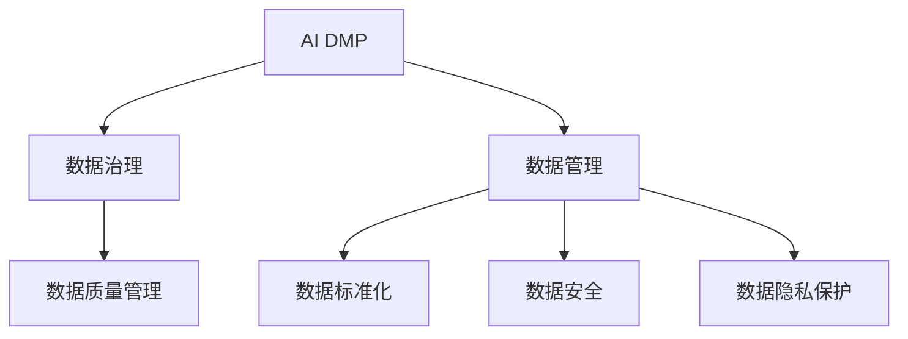

                 

# AI DMP 数据基建：数据治理与管理

> 关键词：AI DMP, 数据治理, 数据管理, 数据质量, 数据标准化, 数据安全, 数据隐私

## 1. 背景介绍

### 1.1 问题由来
随着数字经济的发展，数据成为企业竞争力的关键要素。企业运营、市场洞察、产品优化等各项业务均依赖于数据驱动决策。然而，在数据使用过程中，往往面临数据质量参差不齐、数据孤岛林立、数据安全和隐私问题重重等挑战，严重制约了数据的价值挖掘和业务落地。

为了解决这些问题，数据管理平台（Data Management Platform, DMP）应运而生。DMP作为一种数据基础设施，旨在通过集中管理、治理、清洗、整合、分析和传输数据，为业务提供高效、安全、合规的可靠数据支撑。然而，由于数据管理的复杂性，DMP在实际应用中也面临诸多挑战。本文将聚焦于AI DMP（基于人工智能的数据管理平台）的数据治理与管理工作，探索其构建原理、优化策略和未来趋势，以期为相关领域的研究和实践提供参考。

### 1.2 问题核心关键点
AI DMP作为DMP的一种高级形态，依托于人工智能技术，进一步优化了数据治理与管理的效能。核心关键点包括：
- **数据质量提升**：通过AI技术，自动化处理数据清洗、数据标准化、数据对齐等任务，提升数据质量。
- **数据资产管理**：利用AI进行数据分类、标签、元数据标注，构建系统化、结构化的数据资产图谱。
- **数据智能化分析**：应用AI模型进行数据预测、分类、聚类等高级分析，挖掘数据中蕴含的隐性知识。
- **数据安全性保障**：引入AI进行异常检测、风险评估，确保数据在采集、存储、传输和使用的全生命周期中安全可控。
- **数据隐私保护**：基于AI实现数据去标识化、差分隐私等隐私保护技术，保护个人隐私权益。

## 2. 核心概念与联系

### 2.1 核心概念概述

为更好地理解AI DMP的数据治理与管理工作，本节将介绍几个密切相关的核心概念：

- **AI DMP**：基于人工智能技术，集成了数据集成、数据治理、数据管理和数据服务于一体的数据基础设施。能够自动化处理数据清洗、分类、分析、安全、隐私等任务。

- **数据治理**：通过规范化和标准化手段，确保数据的质量、安全、隐私等方面符合业务需求和法规要求。涵盖数据质量管理、元数据管理、数据共享管理、数据安全管理、数据隐私管理等多个维度。

- **数据管理**：指数据从采集、存储、处理到使用的全生命周期管理。包括数据存储管理、数据访问管理、数据服务管理、数据质量管理等。

- **数据标准化**：通过统一的命名、分类、格式等标准，确保数据的规范性和一致性，便于数据的管理和应用。

- **数据安全**：保障数据在采集、存储、传输、使用等环节的安全性和保密性。涵盖物理安全、网络安全、数据安全等。

- **数据隐私**：在数据处理过程中，确保个人隐私不被滥用或泄露。主要通过数据去标识化、差分隐私等技术实现。

这些核心概念之间的逻辑关系可以通过以下Mermaid流程图来展示：



这个流程图展示了一些关键概念之间的联系：

1. AI DMP通过数据治理和数据管理实现数据的规范化和标准化。
2. 数据治理包括数据质量管理、元数据管理、数据共享管理、数据安全管理、数据隐私管理等。
3. 数据管理涵盖数据存储管理、数据访问管理、数据服务管理、数据质量管理等。
4. 数据标准化、数据安全、数据隐私保护是数据治理和数据管理的重要组成部分。

## 3. 核心算法原理 & 具体操作步骤
### 3.1 算法原理概述

AI DMP的数据治理与管理工作，本质上是一个数据处理和治理的自动化过程。其核心思想是：利用AI技术，对数据进行智能化处理和管理，确保数据质量、安全和隐私，同时提升数据利用效率。

具体来说，AI DMP的数据治理与管理工作包括以下几个关键步骤：

1. **数据收集与清洗**：自动从多源异构数据中收集数据，并通过AI技术进行清洗，去除噪声和错误，确保数据质量。
2. **数据标准化与对齐**：利用AI对数据进行标准化处理，如数据格式转换、命名规范统一等，确保数据的规范性和一致性。
3. **数据分类与标签化**：应用AI模型进行数据分类、标签化，构建系统化的数据资产图谱。
4. **数据存储与管理**：通过AI技术进行数据存储优化，如数据压缩、索引、分片等，确保数据高效存储和访问。
5. **数据智能化分析**：利用AI模型进行数据预测、分类、聚类等高级分析，挖掘数据中蕴含的隐性知识。
6. **数据安全与隐私保护**：应用AI进行异常检测、风险评估，确保数据在全生命周期中安全可控，同时通过差分隐私等技术保护个人隐私。

### 3.2 算法步骤详解

以下是AI DMP数据治理与管理工作的主要步骤：

**Step 1: 数据收集与清洗**

1. **数据来源整合**：从多个数据源中整合数据，包括线上数据（如网页点击、社交媒体互动等）和线下数据（如交易记录、调查问卷等）。
2. **数据清洗**：应用AI技术，自动识别和处理缺失值、异常值、噪声等问题，确保数据质量。

**Step 2: 数据标准化与对齐**

1. **数据格式转换**：将不同格式的数据转换为标准格式，如将时间戳统一为ISO格式。
2. **命名规范统一**：利用自然语言处理（NLP）技术，进行命名规范的统一和标准化，如人名、地名、机构名等。
3. **数据对齐**：通过AI算法，将来自不同数据源的数据对齐，确保数据的完整性和一致性。

**Step 3: 数据分类与标签化**

1. **数据分类**：利用AI模型，自动对数据进行分类，如将用户行为分为浏览、点击、购买等。
2. **标签化**：对分类后的数据进行标签化，构建数据资产图谱，如用户画像、产品类别等。

**Step 4: 数据存储与管理**

1. **数据存储优化**：利用AI技术进行数据压缩、索引、分片等，确保数据高效存储和访问。
2. **数据访问控制**：通过AI进行访问权限管理，确保数据访问的安全性和合规性。

**Step 5: 数据智能化分析**

1. **数据预测**：应用AI模型，如回归模型、神经网络等，进行数据预测，如用户购买预测、广告点击率预测等。
2. **数据分类与聚类**：利用AI模型进行数据分类和聚类，如用户分群、产品分类等。

**Step 6: 数据安全与隐私保护**

1. **异常检测与风险评估**：应用AI进行异常检测和风险评估，确保数据在全生命周期中安全可控。
2. **数据去标识化与差分隐私**：利用AI技术进行数据去标识化和差分隐私处理，保护个人隐私。

### 3.3 算法优缺点

AI DMP的数据治理与管理工作具有以下优点：

1. **自动化效率高**：通过AI技术，自动处理数据清洗、标准化、对齐等任务，大大提升数据处理的效率。
2. **数据质量高**：AI技术能准确识别和处理数据中的噪声和错误，确保数据质量。
3. **分析精度高**：利用AI模型进行高级分析，挖掘数据中蕴含的隐性知识，提升数据分析的精度。
4. **安全性和隐私保护强**：应用AI进行异常检测和风险评估，确保数据安全，同时利用差分隐私等技术保护个人隐私。

然而，AI DMP的数据治理与管理工作也存在一定的局限性：

1. **对数据质量要求高**：AI技术依赖于高质量的数据输入，低质量的数据可能导致AI模型性能下降。
2. **技术门槛高**：AI技术的应用需要较强的技术背景，企业需要投入大量资源进行技术研发和人才培养。
3. **数据隐私风险**：在处理大数据时，可能面临数据泄露的风险，需要严格的数据隐私保护措施。
4. **算法复杂性高**：AI模型需要复杂的训练和调参过程，模型的稳定性和可解释性有待提高。

尽管存在这些局限性，AI DMP仍是大数据管理的重要手段，其自动化和智能化特性使其在数据治理与管理工作中的应用前景广阔。

### 3.4 算法应用领域

AI DMP的数据治理与管理工作在多个领域得到了广泛应用，如：

1. **营销与广告**：通过AI DMP，企业能够实现精准营销、个性化推荐、广告投放优化等，提升营销效果。
2. **客户关系管理**：利用AI DMP构建系统化的客户画像，进行客户细分、行为预测、忠诚度分析等，提升客户管理效率。
3. **金融风险控制**：应用AI DMP进行数据清洗、风险评估、欺诈检测等，提升金融风险控制能力。
4. **健康医疗**：利用AI DMP进行数据清洗、隐私保护、智能分析等，辅助医疗决策和个性化治疗。
5. **智慧城市**：通过AI DMP整合城市各类数据，进行智慧交通、环境监测、公共安全管理等，提升城市治理效率。

## 4. 数学模型和公式 & 详细讲解  
### 4.1 数学模型构建

AI DMP的数据治理与管理工作，涉及多个数学模型的构建。以下以数据去标识化为例，展示其数学模型构建过程。

数据去标识化（Data De-identification）是一种保护数据隐私的技术，通过替换或删除数据中的敏感信息，确保数据在不暴露个人身份的情况下仍然具有可用性。数据去标识化模型可以表示为：

$$
\min_{\theta} \mathcal{L}(D', f_\theta)
$$

其中 $D'$ 为去标识化后的数据集，$f_\theta$ 为去标识化函数，$\mathcal{L}$ 为损失函数。

在实践中，我们通常使用差分隐私（Differential Privacy, DP）模型进行数据去标识化。差分隐私模型的目标是在保护个体隐私的同时，最大化数据集的实用性。差分隐私模型可以表示为：

$$
\min_{\theta} \epsilon^2 + \mathcal{L}(D', f_\theta)
$$

其中 $\epsilon$ 为隐私保护参数，控制隐私泄露程度。$\mathcal{L}(D', f_\theta)$ 为去标识化后的数据集与原始数据集的差异损失函数。

差分隐私模型的核心思想是在统计推理中引入噪声，使得攻击者无法识别单个数据样本，从而保护隐私。差分隐私模型通常使用拉普拉斯噪声（Laplace Noise）和高斯噪声（Gaussian Noise）等方法引入噪声。

### 4.2 公式推导过程

以下是差分隐私模型中拉普拉斯噪声的具体推导过程：

设原始数据集 $D$ 包含 $n$ 个样本，每个样本包含 $d$ 个特征。假设要保护的数据敏感度为 $\Delta$，即攻击者通过差分攻击最多可以推断出 $\Delta$ 个属性值。

差分隐私模型的目标是在保证隐私的同时，最大化数据集的实用性。具体来说，拉普拉斯噪声的引入可以表示为：

$$
f_\theta(x_i) = x_i + \eta
$$

其中 $\eta \sim \mathcal{L}(1/\epsilon)$，$\mathcal{L}(1/\epsilon)$ 表示拉普拉斯分布，$1/\epsilon$ 为分布的参数。

对于任意攻击者，通过差分攻击最多可以推断出 $\Delta$ 个属性值。因此，拉普拉斯噪声的方差为：

$$
\sigma^2 = \frac{\Delta^2}{2\epsilon^2}
$$

差分隐私模型的目标是在保护隐私的同时，最大化数据集的实用性。具体来说，拉普拉斯噪声的引入可以表示为：

$$
f_\theta(x_i) = x_i + \eta
$$

其中 $\eta \sim \mathcal{L}(1/\epsilon)$，$\mathcal{L}(1/\epsilon)$ 表示拉普拉斯分布，$1/\epsilon$ 为分布的参数。

对于任意攻击者，通过差分攻击最多可以推断出 $\Delta$ 个属性值。因此，拉普拉斯噪声的方差为：

$$
\sigma^2 = \frac{\Delta^2}{2\epsilon^2}
$$

### 4.3 案例分析与讲解

以某电商公司为例，分析AI DMP在客户行为分析中的应用。

**数据收集与清洗**：电商公司从多个渠道收集客户行为数据，包括浏览历史、购买记录、评价反馈等。通过AI技术，自动进行数据清洗，去除缺失值、异常值和噪声。

**数据标准化与对齐**：利用NLP技术，对客户姓名、地址等信息进行命名规范统一，确保数据的一致性。同时，通过AI算法，将来自不同渠道的数据对齐，确保数据的完整性。

**数据分类与标签化**：应用AI模型，自动对客户行为进行分类，如浏览、购买、评价等。并对分类后的数据进行标签化，构建客户行为图谱。

**数据存储与管理**：利用AI技术进行数据存储优化，如数据压缩、索引、分片等，确保数据高效存储和访问。同时，通过AI进行访问权限管理，确保数据访问的安全性和合规性。

**数据智能化分析**：利用AI模型，进行客户行为预测、分类、聚类等分析，挖掘数据中蕴含的隐性知识。

**数据安全与隐私保护**：应用AI进行异常检测和风险评估，确保数据在全生命周期中安全可控。同时，利用差分隐私等技术保护客户隐私。

## 5. 项目实践：代码实例和详细解释说明
### 5.1 开发环境搭建

在进行AI DMP数据治理与管理工作实践前，我们需要准备好开发环境。以下是使用Python进行PyTorch开发的环境配置流程：

1. 安装Anaconda：从官网下载并安装Anaconda，用于创建独立的Python环境。

2. 创建并激活虚拟环境：
```bash
conda create -n pytorch-env python=3.8 
conda activate pytorch-env
```

3. 安装PyTorch：根据CUDA版本，从官网获取对应的安装命令。例如：
```bash
conda install pytorch torchvision torchaudio cudatoolkit=11.1 -c pytorch -c conda-forge
```

4. 安装相关库：
```bash
pip install pandas numpy scikit-learn matplotlib tqdm jupyter notebook ipython transformers
```

完成上述步骤后，即可在`pytorch-env`环境中开始AI DMP的数据治理与管理工作实践。

### 5.2 源代码详细实现

以下是一个基于PyTorch的差分隐私模型实现示例：

```python
import torch
from torch.nn import functional as F
from torch.optim import Adam
from torch.distributions import Laplace

class LaplaceNoise(nn.Module):
    def __init__(self, epsilon):
        super(LaplaceNoise, self).__init__()
        self.epsilon = epsilon
        self.noise = nn.Parameter(torch.tensor([1/epsilon]))
        
    def forward(self, x):
        return x + self.noise.data

class DPModel(nn.Module):
    def __init__(self, input_dim, output_dim, epsilon):
        super(DPModel, self).__init__()
        self.linear = nn.Linear(input_dim, output_dim)
        self.noise = LaplaceNoise(epsilon)
        
    def forward(self, x):
        x = self.linear(x)
        x = self.noise(x)
        return x

# 数据集
train_data = torch.randn(100, 10)
labels = torch.randint(0, 10, (100,))

# 模型
model = DPModel(10, 10, epsilon=1e-5)

# 优化器
optimizer = Adam(model.parameters(), lr=0.001)

# 训练
for epoch in range(100):
    optimizer.zero_grad()
    pred = model(train_data)
    loss = F.binary_cross_entropy(pred, labels)
    loss.backward()
    optimizer.step()

    if epoch % 10 == 0:
        print(f"Epoch {epoch}, loss: {loss.item()}")
```

以上代码实现了一个简单的差分隐私模型，其中拉普拉斯噪声层用于引入噪声，保护隐私。

### 5.3 代码解读与分析

让我们再详细解读一下关键代码的实现细节：

**LaplaceNoise类**：
- 定义拉普拉斯噪声层，接收噪声参数 $\epsilon$，并生成拉普拉斯分布的噪声。

**DPModel类**：
- 定义差分隐私模型，接收输入维度、输出维度和噪声参数 $\epsilon$。其中包含一个线性层和一个拉普拉斯噪声层。

**训练流程**：
- 定义训练数据集和标签。
- 定义差分隐私模型和优化器。
- 在每个epoch内，前向传播计算损失函数，反向传播更新模型参数，输出损失。

## 6. 实际应用场景
### 6.1 智能推荐系统

AI DMP在智能推荐系统中的应用，可以通过数据治理与管理工作，提升推荐系统的精度和效率。智能推荐系统需要处理海量用户行为数据，数据质量、安全性和隐私保护至关重要。

通过AI DMP，智能推荐系统可以：
1. **数据清洗与标准化**：对用户行为数据进行清洗和标准化，去除噪声和错误，确保数据质量。
2. **数据分类与标签化**：自动对用户行为进行分类和标签化，构建用户画像。
3. **数据安全与隐私保护**：通过差分隐私等技术，保护用户隐私。
4. **数据智能化分析**：利用AI模型进行推荐算法优化，提升推荐精度。

### 6.2 金融风控系统

金融风控系统需要处理海量交易数据，数据治理与管理工作至关重要。通过AI DMP，金融风控系统可以：
1. **数据清洗与标准化**：对交易数据进行清洗和标准化，去除噪声和错误，确保数据质量。
2. **数据分类与标签化**：自动对交易数据进行分类和标签化，构建交易行为图谱。
3. **数据安全与隐私保护**：通过差分隐私等技术，保护用户隐私。
4. **数据智能化分析**：利用AI模型进行风险评估和欺诈检测，提升风控能力。

### 6.3 医疗数据分析系统

医疗数据分析系统需要处理海量患者数据，数据治理与管理工作至关重要。通过AI DMP，医疗数据分析系统可以：
1. **数据清洗与标准化**：对患者数据进行清洗和标准化，去除噪声和错误，确保数据质量。
2. **数据分类与标签化**：自动对患者数据进行分类和标签化，构建患者画像。
3. **数据安全与隐私保护**：通过差分隐私等技术，保护患者隐私。
4. **数据智能化分析**：利用AI模型进行疾病预测和个性化治疗，提升医疗决策效率。

## 7. 工具和资源推荐
### 7.1 学习资源推荐

为了帮助开发者系统掌握AI DMP的数据治理与管理工作，这里推荐一些优质的学习资源：

1. 《Python数据科学手册》：详细介绍了Python在数据处理、分析、可视化等方面的应用。
2. 《深度学习入门》：由斯坦福大学Andrew Ng教授主讲的深度学习课程，涵盖深度学习基础和高级应用。
3. 《数据治理》：全面介绍了数据治理的理论和实践，包括数据质量管理、元数据管理、数据安全管理等。
4. 《TensorFlow官方文档》：提供了TensorFlow的详细使用指南和API文档，支持深度学习模型的构建和训练。
5. 《数据隐私保护》：介绍了数据隐私保护的基本概念和实践，包括数据去标识化、差分隐私等技术。

通过对这些资源的学习实践，相信你一定能够快速掌握AI DMP的数据治理与管理工作，并用于解决实际的业务问题。
### 7.2 开发工具推荐

高效的开发离不开优秀的工具支持。以下是几款用于AI DMP数据治理与管理工作开发的常用工具：

1. PyTorch：基于Python的开源深度学习框架，灵活动态的计算图，适合快速迭代研究。大部分深度学习模型都有PyTorch版本的实现。
2. TensorFlow：由Google主导开发的开源深度学习框架，生产部署方便，适合大规模工程应用。同样有丰富的深度学习模型资源。
3. Hadoop/Spark：分布式数据处理框架，能够高效处理海量数据。适合大数据分析和处理任务。
4. ELK Stack：包括Elasticsearch、Logstash和Kibana，用于数据存储、处理和可视化。适合实时数据分析和展示。
5. Apache Kafka：分布式消息队列，适合数据流处理和实时数据传输。适合需要高吞吐量的数据处理场景。

合理利用这些工具，可以显著提升AI DMP数据治理与管理工作开发的效率，加快创新迭代的步伐。

### 7.3 相关论文推荐

AI DMP的数据治理与管理工作是一个活跃的研究领域，以下是几篇奠基性的相关论文，推荐阅读：

1. "Data Privacy" by Cynthia Dwork, Frank McSherry, Adam Smith and Kobbi Nissim: 提出了差分隐私的定义和基本原理，成为数据隐私保护的奠基之作。
2. "Large-Scale Distributed Data-Parallel Training with Parameter-Server" by Bill D. Koren, Jiasheng Wang, Hong Qin, Hancheng Wang, Tao Liu, Minghui Song and Cixuan Zhu: 介绍了分布式深度学习训练的参数服务器模型，适用于大数据集和深度学习模型的训练。
3. "Data-Driven Market Basket Analysis Using Multiple Parallel SVM Models" by He Rui, Michael R. Lyu and Samy Bengio: 提出了基于SVM的多模型并行数据驱动市场篮子分析方法，适用于复杂数据集的分析和建模。
4. "Adversarial Machine Learning at Scale" by Ian J. Goodfellow, Jonathon Shlens and Christian Szegedy: 介绍了对抗性学习的概念和应用，适用于深度学习模型的鲁棒性和安全性研究。
5. "Data Governance: The Role of Information, IT, and Legal Departments in Managing Data Governance" by Robert S. J. Corrigan, John L. Shannigford and Markus L. Witkop: 全面介绍了数据治理的理论和实践，包括数据质量管理、元数据管理、数据安全管理等。

这些论文代表了大数据治理与管理的最新进展，通过学习这些前沿成果，可以帮助研究者把握学科前进方向，激发更多的创新灵感。

## 8. 总结：未来发展趋势与挑战

### 8.1 总结

本文对AI DMP的数据治理与管理工作进行了全面系统的介绍。首先阐述了AI DMP的研究背景和意义，明确了数据治理与管理的核心关键点。其次，从原理到实践，详细讲解了AI DMP数据治理与管理的数学模型和关键步骤，给出了数据治理与管理的完整代码实例。同时，本文还广泛探讨了AI DMP在智能推荐系统、金融风控系统、医疗数据分析系统等多个行业领域的应用前景，展示了其巨大的潜力。此外，本文精选了数据治理与管理的各类学习资源，力求为读者提供全方位的技术指引。

通过本文的系统梳理，可以看到，AI DMP的数据治理与管理工作正在成为大数据管理的重要手段，其自动化和智能化特性使其在数据治理与管理工作中的应用前景广阔。未来，伴随AI技术和大数据管理方法的持续演进，数据治理与管理工作必将迎来新的突破，进一步提升数据的价值挖掘和业务落地能力。

### 8.2 未来发展趋势

展望未来，AI DMP的数据治理与管理工作将呈现以下几个发展趋势：

1. **数据治理标准化**：随着数据治理标准的不断完善，AI DMP将能够自动化处理更多数据治理任务，如数据质量评估、元数据管理、数据生命周期管理等。
2. **数据治理智能化**：应用AI技术进行智能化的数据治理，如自动发现数据质量问题、自动生成数据治理规则等，提升数据治理效率和质量。
3. **数据治理自动化**：通过AI自动化进行数据治理任务，减少人工干预，提升数据治理的可靠性和一致性。
4. **数据治理多模态化**：将文本、图像、视频等多种数据类型整合到数据治理流程中，实现多模态数据的协同治理。
5. **数据治理联邦化**：利用联邦学习等技术，实现跨组织、跨地域的数据治理，提升数据治理的覆盖范围和效果。
6. **数据治理透明化**：通过AI技术进行数据治理过程的透明化，确保数据治理的可解释性和可追溯性。

这些趋势凸显了AI DMP在数据治理与管理工作中的广阔前景。AI DMP将在数据治理的标准化、智能化、自动化、多模态化、联邦化和透明化等方面不断进步，为数据的全面治理和深度利用提供新的路径。

### 8.3 面临的挑战

尽管AI DMP的数据治理与管理工作已经取得了瞩目成就，但在迈向更加智能化、普适化应用的过程中，它仍面临着诸多挑战：

1. **数据质量瓶颈**：数据治理依赖于高质量的数据输入，低质量的数据可能导致AI模型性能下降，治理成本增加。
2. **技术复杂性高**：AI DMP的数据治理与管理工作需要较强的技术背景，企业需要投入大量资源进行技术研发和人才培养。
3. **数据隐私风险**：在处理大数据时，可能面临数据泄露的风险，需要严格的数据隐私保护措施。
4. **算法复杂性高**：AI模型需要复杂的训练和调参过程，模型的稳定性和可解释性有待提高。
5. **数据治理工具缺乏**：现有的数据治理工具无法满足AI DMP的需求，需要更多定制化的解决方案。
6. **数据治理规范缺失**：数据治理标准和规范尚未完全统一，不同组织之间的数据治理流程存在差异。

尽管存在这些挑战，AI DMP仍是大数据管理的重要手段，其自动化和智能化特性使其在数据治理与管理工作中的应用前景广阔。未来，伴随数据治理标准的不断完善和AI技术的持续进步，这些挑战终将逐一被克服，AI DMP必将在数据治理与管理工作上发挥更大的作用。

### 8.4 研究展望

面向未来，AI DMP的数据治理与管理工作需要在以下几个方面寻求新的突破：

1. **数据治理标准和规范**：制定统一的数据治理标准和规范，促进不同组织之间的数据治理流程协同。
2. **数据治理自动化工具**：开发更多定制化的数据治理自动化工具，提升数据治理的效率和效果。
3. **数据治理多模态融合**：将文本、图像、视频等多种数据类型整合到数据治理流程中，实现多模态数据的协同治理。
4. **数据治理联邦化**：利用联邦学习等技术，实现跨组织、跨地域的数据治理，提升数据治理的覆盖范围和效果。
5. **数据治理透明化**：通过AI技术进行数据治理过程的透明化，确保数据治理的可解释性和可追溯性。

这些研究方向将推动AI DMP在数据治理与管理工作上不断进步，为数据的全面治理和深度利用提供新的路径。面向未来，AI DMP需要从数据治理的标准化、智能化、自动化、多模态化、联邦化和透明化等多个维度进行全面优化，实现数据治理的高效、可靠和透明。只有勇于创新、敢于突破，才能不断拓展AI DMP的边界，让数据治理与管理工作真正落地，赋能各行各业。

## 9. 附录：常见问题与解答

**Q1：数据清洗与标准化有哪些具体步骤？**

A: 数据清洗与标准化的具体步骤包括：
1. **缺失值处理**：对缺失值进行填充或删除，确保数据的完整性。
2. **异常值检测**：通过统计方法或机器学习模型检测并处理异常值。
3. **数据去重**：去除重复数据，确保数据的唯一性。
4. **数据格式转换**：将不同格式的数据转换为标准格式，如时间戳转换为ISO格式。
5. **命名规范统一**：通过NLP技术，进行命名规范的统一和标准化，如人名、地名、机构名等。
6. **数据对齐**：通过AI算法，将来自不同数据源的数据对齐，确保数据的完整性和一致性。

**Q2：数据分类与标签化的具体过程是怎样的？**

A: 数据分类与标签化的具体过程包括：
1. **特征提取**：从原始数据中提取有用的特征，如文本的关键词、时间戳等。
2. **模型训练**：利用机器学习模型进行分类任务训练，如使用SVM、神经网络等。
3. **标签化**：根据分类结果，对数据进行标签化，如将用户行为分为浏览、点击、购买等。
4. **图谱构建**：将分类后的数据构建系统化的数据资产图谱，如用户画像、产品类别等。

**Q3：差分隐私的具体实现方法有哪些？**

A: 差分隐私的具体实现方法包括：
1. **拉普拉斯噪声**：引入拉普拉斯噪声，保护隐私。
2. **高斯噪声**：引入高斯噪声，保护隐私。
3. **多项式噪声**：引入多项式噪声，保护隐私。
4. **指数机制**：通过指数机制进行隐私保护。
5. **半差分隐私**：通过半差分隐私保护隐私。

**Q4：AI DMP在实际应用中需要注意哪些问题？**

A: AI DMP在实际应用中需要注意以下问题：
1. **数据质量瓶颈**：低质量的数据可能导致AI模型性能下降，治理成本增加。
2. **技术复杂性高**：AI DMP的数据治理与管理工作需要较强的技术背景，企业需要投入大量资源进行技术研发和人才培养。
3. **数据隐私风险**：在处理大数据时，可能面临数据泄露的风险，需要严格的数据隐私保护措施。
4. **算法复杂性高**：AI模型需要复杂的训练和调参过程，模型的稳定性和可解释性有待提高。
5. **数据治理工具缺乏**：现有的数据治理工具无法满足AI DMP的需求，需要更多定制化的解决方案。
6. **数据治理规范缺失**：数据治理标准和规范尚未完全统一，不同组织之间的数据治理流程存在差异。

**Q5：如何评估AI DMP的数据治理与管理工作效果？**

A: AI DMP的数据治理与管理工作效果可以通过以下指标进行评估：
1. **数据质量指标**：如缺失值比例、异常值比例、噪声比例等，评估数据治理的质量。
2. **数据标准化指标**：如数据格式转换正确率、命名规范统一率等，评估数据标准化的效果。
3. **数据安全指标**：如数据泄露事件比例、异常检测准确率等，评估数据安全的保障效果。
4. **数据隐私指标**：如差分隐私泄露风险、隐私保护措施覆盖率等，评估数据隐私的保护效果。
5. **数据治理效率指标**：如数据治理任务自动化率、数据治理周期时间等，评估数据治理的效率。

通过这些指标的评估，可以全面了解AI DMP的数据治理与管理工作效果，并不断优化改进。

---

作者：禅与计算机程序设计艺术 / Zen and the Art of Computer Programming

