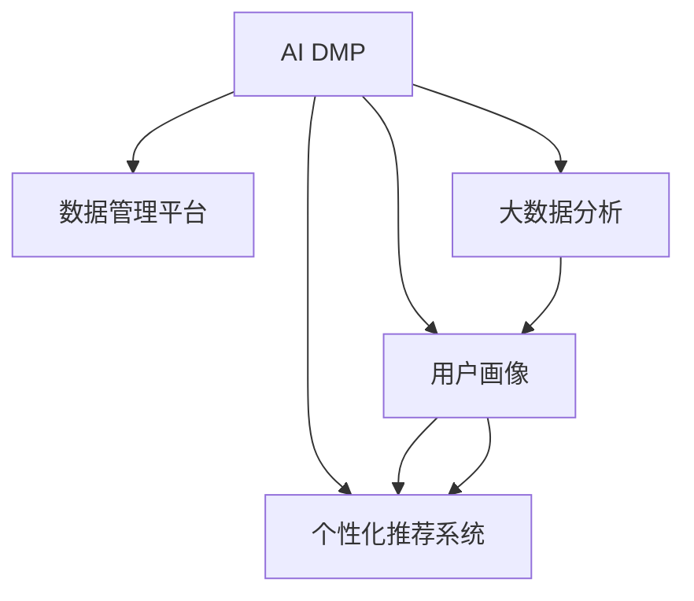

                 

# AI DMP 数据基建：数据驱动营销的未来趋势

> 关键词：人工智能(AI),数据管理平台(DMP),数据驱动营销,用户画像,个性化推荐系统,大数据分析

## 1. 背景介绍

### 1.1 问题由来
在当今数字化时代，数据驱动的营销策略已成为企业实现增长的关键。通过数据，企业可以更深入地了解客户行为，个性化推荐产品，提高转化率，从而提升市场竞争力。然而，数据收集、整合和分析的复杂性，以及数据隐私和安全问题，使得企业难以高效地构建和利用数据驱动的营销解决方案。

### 1.2 问题核心关键点
为了解决这个问题，数据管理平台（DMP）应运而生。DMP是一个集成了多源数据的平台，通过数据聚合、清洗和分析，为营销人员提供用户洞察和个性化推荐能力。但随着数据量的爆炸性增长和复杂性的增加，传统的DMP已经无法满足日益复杂和多样化的营销需求。

在此背景下，人工智能（AI）在数据驱动营销中的应用变得尤为重要。通过引入AI技术，可以大幅提升DMP的数据处理能力，实现更精准的用户画像，构建高效个性化推荐系统，从而驱动营销效率和效果的双重提升。本文将详细探讨基于AI的DMP数据基建，分析其核心概念、算法原理和应用场景，为数据驱动营销的未来发展提供方向性建议。

## 2. 核心概念与联系

### 2.1 核心概念概述

为了更好地理解AI DMP数据基建，本节将介绍几个密切相关的核心概念：

- **人工智能(AI)**：指通过算法和模型，使计算机具备模拟人类智能行为的能力，包括学习、推理、感知等。在DMP中，AI技术可以用于数据处理、分析、用户画像构建、推荐系统优化等方面。

- **数据管理平台(DMP)**：一个集成数据收集、存储、管理和分析的平台，通过聚合和清洗多源数据，为营销人员提供用户洞察。

- **用户画像(User Profile)**：根据用户的历史行为和兴趣，构建出详细的用户画像，用于个性化推荐和营销。

- **个性化推荐系统(Recommendation System)**：利用用户数据和算法，为用户推荐最相关的产品或内容，提升用户体验和转化率。

- **大数据分析(Big Data Analytics)**：对大规模数据进行分析和挖掘，获取有价值的信息和洞察。

这些核心概念之间的逻辑关系可以通过以下Mermaid流程图来展示：



这个流程图展示了大数据驱动营销的数据基建逻辑：AI DMP通过整合和分析多源数据，构建出详细的用户画像，并利用个性化推荐系统进行精准推荐，同时，大数据分析也提供了洞察，用于持续优化和提升推荐系统效果。

## 3. 核心算法原理 & 具体操作步骤

### 3.1 算法原理概述

AI DMP数据基建的核心思想是通过AI技术，高效处理和分析大量多源数据，构建详尽和准确的客户画像，用于个性化推荐和营销决策。其算法原理主要包括以下几个步骤：

1. **数据采集与整合**：收集来自不同渠道和来源的用户数据，如网站点击、社交媒体互动、购买记录等，进行数据清洗和整合。
2. **特征工程**：对整合后的数据进行特征提取和构造，生成有意义的特征向量。
3. **用户画像构建**：使用机器学习模型，如聚类算法、分类算法，根据用户的历史行为和兴趣，构建出详尽的用户画像。
4. **个性化推荐算法**：设计个性化推荐算法，如协同过滤、内容推荐、混合推荐等，为用户推荐最适合的产品或内容。
5. **效果评估与优化**：通过A/B测试等方法，评估推荐效果，并持续优化推荐算法和用户画像。

### 3.2 算法步骤详解

以下将详细介绍AI DMP数据基建的具体步骤：

**Step 1: 数据采集与整合**

1. **数据来源**：用户数据可以来自多个渠道，如网站、社交媒体、电商平台等。每个渠道的数据格式和内容可能不同，需要统一规范。
2. **数据清洗**：清洗数据以去除噪声、缺失值和异常值，确保数据的质量。
3. **数据整合**：将清洗后的数据进行整合，建立统一的用户标识和数据结构。

**Step 2: 特征工程**

1. **特征提取**：从原始数据中提取有意义的特征，如用户活跃度、浏览行为、购买记录等。
2. **特征构造**：根据业务需求，构造新的特征，如兴趣标签、时间窗口等。
3. **特征选择**：选择合适的特征子集，避免过度拟合，提高模型效率。

**Step 3: 用户画像构建**

1. **用户聚类**：使用K-means、层次聚类等聚类算法，将用户分为不同的群体。
2. **用户标签**：为每个用户打上若干标签，描述其兴趣和行为特征。
3. **用户画像**：将用户聚类结果和标签结合，构建出详细的用户画像。

**Step 4: 个性化推荐算法**

1. **协同过滤**：基于用户历史行为和相似用户的行为，推荐相似的产品或内容。
2. **内容推荐**：根据用户偏好，推荐最相关的内容，如新闻、文章、视频等。
3. **混合推荐**：结合协同过滤和内容推荐，提供更精准的推荐结果。

**Step 5: 效果评估与优化**

1. **A/B测试**：通过A/B测试评估推荐效果，比较不同推荐策略的表现。
2. **优化算法**：根据测试结果，优化推荐算法和用户画像模型。
3. **反馈循环**：持续收集用户反馈，优化推荐系统。

### 3.3 算法优缺点

AI DMP数据基建在提升数据驱动营销效果方面具有以下优点：

- **精准度提升**：通过AI技术，可以更精准地理解用户行为和兴趣，提供个性化的推荐。
- **自动化程度高**：AI算法可以自动进行数据处理和分析，减少人工干预。
- **可扩展性强**：AI DMP可以处理海量数据，支持大规模营销活动。

然而，该方法也存在一些局限性：

- **数据隐私问题**：AI DMP需要收集和分析大量用户数据，可能存在隐私泄露的风险。
- **模型复杂性**：AI算法模型复杂，需要专业的数据科学家和工程师进行设计和维护。
- **动态变化问题**：用户行为和偏好可能随时变化，AI模型需要持续更新。

尽管存在这些局限性，AI DMP数据基建仍然是数据驱动营销的重要手段。未来需要进一步优化数据隐私保护机制，简化模型设计，提升模型的动态适应能力。

### 3.4 算法应用领域

AI DMP数据基建在多个领域得到了广泛应用，包括但不限于：

- **电子商务**：通过个性化推荐提升用户购买率和购物体验。
- **社交媒体**：根据用户兴趣和行为，推送个性化内容和广告。
- **金融服务**：通过用户画像优化风险控制和用户推荐。
- **内容平台**：提供个性化新闻、文章、视频等内容的推荐服务。
- **健康医疗**：根据用户健康数据，提供个性化医疗建议和治疗方案。

## 4. 数学模型和公式 & 详细讲解 & 举例说明

### 4.1 数学模型构建

基于AI的DMP数据基建涉及多个数学模型，以下分别介绍其中的关键模型：

**聚类模型**：
- 假设用户集合为$U$，聚类后的簇数为$K$，用户$i$属于簇$C_j$的概率为$p_{ij}$。
- 聚类模型的目标是最小化簇内相似度和簇间差异度，常用的模型包括K-means、层次聚类等。

**协同过滤模型**：
- 假设用户集合为$U$，物品集合为$I$，用户$i$对物品$j$的评分$R_{ij}$。
- 协同过滤模型的目标是预测用户$i$对物品$j$的评分，常用的模型包括基于用户的协同过滤、基于物品的协同过滤等。

**内容推荐模型**：
- 假设物品集合为$I$，用户$i$的兴趣集合为$V$，物品$j$的特征向量为$\vec{f_j}$。
- 内容推荐模型的目标是最大化用户$i$对物品$j$的评分，常用的模型包括基于内容的推荐、基于协同过滤和内容的混合推荐等。

**混合推荐模型**：
- 假设用户$i$对物品$j$的评分$R_{ij}$由用户聚类、协同过滤和内容推荐共同决定。
- 混合推荐模型的目标是最小化预测误差，常用的模型包括加权混合推荐、多层感知机等。

### 4.2 公式推导过程

以下以聚类模型为例，推导K-means算法的核心公式。

K-means算法的基本思想是将用户集合$U$划分为$K$个簇$C_1, C_2, ..., C_K$，使得每个簇内的用户最为相似。聚类过程通过迭代优化完成，公式如下：

$$
\arg \min_{\{C_k\}, \{\mu_k\}} \sum_{i=1}^N \sum_{k=1}^K \rho(d(x_i, \mu_k))
$$

其中，$N$为总用户数，$\rho$为距离度量函数（如欧几里得距离），$\mu_k$为簇$C_k$的中心点。优化目标是最小化簇内用户的平均距离。

算法的具体步骤如下：

1. 随机初始化$K$个中心点$\mu_k$。
2. 对每个用户$i$，计算其到每个中心点的距离$d(x_i, \mu_k)$，并分配到距离最近的簇$C_k$。
3. 对每个簇$C_k$，计算新的中心点$\mu_k'$。
4. 重复步骤2和3，直到中心点不再变化，或达到预设的迭代次数。

### 4.3 案例分析与讲解

以电商平台的个性化推荐系统为例，说明如何应用AI DMP进行用户画像构建和推荐优化。

假设某电商平台收集了用户的历史购买记录、浏览行为、搜索关键词等数据。首先将这些数据进行清洗和整合，然后进行特征工程，构造用户兴趣标签、行为特征向量等。

利用K-means算法对用户进行聚类，形成不同的用户群体。例如，将用户分为“高价值用户”、“高活跃用户”、“低价值用户”等类别。

针对每个用户群体，设计个性化的推荐策略。例如，对于“高价值用户”，可以提供个性化优惠券和专属商品；对于“高活跃用户”，可以推荐最新上架的商品；对于“低价值用户”，可以推送有潜力的新品牌商品。

通过A/B测试，评估不同推荐策略的效果，优化推荐模型和用户画像。

## 5. 项目实践：代码实例和详细解释说明

### 5.1 开发环境搭建

在进行AI DMP项目实践前，我们需要准备好开发环境。以下是使用Python进行PyTorch开发的环境配置流程：

1. 安装Anaconda：从官网下载并安装Anaconda，用于创建独立的Python环境。

2. 创建并激活虚拟环境：
```bash
conda create -n ai-dmp-env python=3.8 
conda activate ai-dmp-env
```

3. 安装PyTorch：根据CUDA版本，从官网获取对应的安装命令。例如：
```bash
conda install pytorch torchvision torchaudio cudatoolkit=11.1 -c pytorch -c conda-forge
```

4. 安装Pandas、NumPy、Scikit-learn、TensorBoard等工具包：
```bash
pip install pandas numpy scikit-learn tensorboard tqdm jupyter notebook ipython
```

5. 安装相关DMP数据处理工具包：
```bash
pip install dmp-data-processing
```

完成上述步骤后，即可在`ai-dmp-env`环境中开始项目实践。

### 5.2 源代码详细实现

下面以电商平台的个性化推荐系统为例，给出使用PyTorch实现用户聚类和个性化推荐的具体代码实现。

首先，定义用户数据的加载和预处理函数：

```python
import pandas as pd
from sklearn.preprocessing import StandardScaler
from sklearn.cluster import KMeans

def load_user_data(file_path):
    data = pd.read_csv(file_path)
    return data

def preprocess_data(data):
    # 数据预处理，如缺失值处理、特征选择、特征缩放等
    data = data.dropna()
    data = data[['feature1', 'feature2', 'feature3']]
    scaler = StandardScaler()
    scaled_data = scaler.fit_transform(data)
    return scaled_data

# 加载用户数据
data = load_user_data('user_data.csv')

# 预处理数据
scaled_data = preprocess_data(data)
```

然后，定义用户聚类函数：

```python
def kmeans_clustering(data, num_clusters):
    model = KMeans(n_clusters=num_clusters, random_state=0)
    model.fit(data)
    labels = model.labels_
    return labels

# 进行K-means聚类
num_clusters = 5
labels = kmeans_clustering(scaled_data, num_clusters)
```

接着，定义个性化推荐函数：

```python
from sklearn.metrics.pairwise import cosine_similarity

def collaborative_filtering(data, labels):
    # 协同过滤算法，基于用户行为数据
    user_item_matrix = data.groupby('user_id').mean()
    user_item_matrix = user_item_matrix.fillna(0)
    user_item_matrix = user_item_matrix.dropna()
    user_item_matrix = user_item_matrix.pivot_table(values='item_value', index='user_id', columns='item_id', aggfunc='mean')
    user_item_matrix = user_item_matrix.to_numpy()
    user_item_matrix = user_item_matrix[:, labels]
    user_item_matrix = user_item_matrix[:, :num_clusters]
    
    # 计算相似度
    similarity_matrix = cosine_similarity(user_item_matrix)
    
    # 推荐系统
    user_id = 'user1'
    user_item_vector = user_item_matrix[user_id]
    recommendations = similarity_matrix[user_id].tolist()
    recommendations = [item_id for item_id in range(num_clusters) if recommendations[item_id] > 0.5]
    return recommendations

# 进行协同过滤推荐
recommendations = collaborative_filtering(scaled_data, labels)
print(recommendations)
```

最后，启动测试流程并在测试集上评估：

```python
# 测试推荐效果
test_data = load_user_data('test_data.csv')
test_labels = kmeans_clustering(test_data, num_clusters)
test_recommendations = collaborative_filtering(test_data, test_labels)
```

以上就是使用PyTorch对电商平台的个性化推荐系统进行用户聚类和个性化推荐的具体代码实现。可以看到，在数据预处理和特征工程之后，利用K-means算法进行用户聚类，再通过协同过滤算法实现个性化推荐。

### 5.3 代码解读与分析

让我们再详细解读一下关键代码的实现细节：

**用户数据加载与预处理**：
- 使用Pandas库加载用户数据，并进行基本的预处理，如缺失值处理、特征选择和特征缩放。

**K-means聚类**：
- 使用Scikit-learn库中的K-means算法对用户进行聚类，形成不同的用户群体。

**协同过滤推荐**：
- 首先计算用户行为数据的平均值，进行矩阵化和标准化处理。
- 使用余弦相似度计算用户之间的相似度。
- 最后，根据相似度矩阵，进行个性化推荐。

**测试推荐效果**：
- 对测试集进行聚类和推荐，评估推荐系统的效果。

通过上述代码，可以清晰地看到从数据预处理到用户聚类和个性化推荐的整个流程，以及其中涉及的关键算法。

## 6. 实际应用场景

### 6.1 智能客服系统

智能客服系统可以利用AI DMP构建详尽的用户画像，通过分析用户行为和偏好，提供个性化服务。例如，通过用户历史咨询记录和实时对话内容，系统可以动态调整回答策略，提高用户满意度。

### 6.2 金融理财

金融理财平台可以利用AI DMP对用户进行风险评估和个性化理财推荐。例如，通过分析用户的财务数据和投资行为，系统可以为用户提供量身定制的投资建议和理财方案。

### 6.3 在线教育

在线教育平台可以利用AI DMP对学生进行行为分析，提供个性化学习路径和课程推荐。例如，通过分析学生的学习记录和在线互动数据，系统可以推荐最适合的课程和学习资料。

### 6.4 智能家居

智能家居系统可以利用AI DMP对用户的生活习惯进行分析，提供个性化家居控制和建议。例如，通过分析用户的日常活动和能源消耗数据，系统可以推荐最优的节能方案和生活建议。

## 7. 工具和资源推荐

### 7.1 学习资源推荐

为了帮助开发者系统掌握AI DMP的理论基础和实践技巧，这里推荐一些优质的学习资源：

1. 《深度学习与推荐系统》：讲解深度学习和推荐系统的基础理论和实践方法，适合入门学习。
2. 《机器学习实战》：通过实际案例，讲解机器学习算法的应用，适合实战练习。
3. 《Python数据分析与机器学习》：介绍Python数据分析和机器学习的实战技术，适合数据科学入门。
4. 《TensorFlow实战》：讲解TensorFlow框架的使用和实战案例，适合深度学习实践。
5. 《数据科学与机器学习》在线课程：斯坦福大学和Coursera合作开设的课程，涵盖数据科学和机器学习的核心内容。

通过对这些资源的学习实践，相信你一定能够快速掌握AI DMP的核心技术和实践方法，并用于解决实际的业务问题。

### 7.2 开发工具推荐

高效的开发离不开优秀的工具支持。以下是几款用于AI DMP开发的常用工具：

1. PyTorch：基于Python的开源深度学习框架，灵活动态的计算图，适合快速迭代研究。
2. TensorFlow：由Google主导开发的开源深度学习框架，生产部署方便，适合大规模工程应用。
3. Scikit-learn：基于Python的机器学习库，提供了丰富的机器学习算法和工具。
4. Pandas：基于Python的数据处理库，提供了强大的数据清洗和转换功能。
5. Jupyter Notebook：一个交互式的数据分析平台，支持Python、R等多种语言，方便协作和分享。

合理利用这些工具，可以显著提升AI DMP的开发效率，加快创新迭代的步伐。

### 7.3 相关论文推荐

AI DMP数据基建的发展源于学界的持续研究。以下是几篇奠基性的相关论文，推荐阅读：

1. "Data Management Platforms: Foundations and Challenges"：介绍DMP的基本概念和挑战。
2. "Personalization Analytics for Marketing Science"：讲解个性化推荐系统的构建和优化。
3. "Adaptive Recommendation Algorithms"：提出自适应推荐算法，用于提高推荐效果。
4. "Collaborative Filtering Techniques"：介绍协同过滤算法的基本原理和应用。
5. "User Modeling in Recommendation Systems"：讲解用户建模技术，用于构建详细的用户画像。

这些论文代表了大数据驱动营销的研究进展，通过学习这些前沿成果，可以帮助研究者把握学科前进方向，激发更多的创新灵感。

## 8. 总结：未来发展趋势与挑战

### 8.1 总结

本文对AI DMP数据基建进行了全面系统的介绍。首先阐述了AI DMP在数据驱动营销中的重要性和应用场景，明确了AI技术在数据处理和分析中的核心作用。其次，从原理到实践，详细讲解了AI DMP的核心算法和操作步骤，给出了具体的代码实例。同时，本文还广泛探讨了AI DMP在多个行业领域的应用前景，展示了其广阔的应用前景。

通过本文的系统梳理，可以看到，AI DMP数据基建为数据驱动营销提供了强大的技术支撑，通过高效处理和分析多源数据，构建详尽和准确的客户画像，实现个性化的推荐和服务，从而驱动营销效率和效果的双重提升。未来，随着AI技术的不断发展，AI DMP将在更广泛的场景中得到应用，带来深远的商业价值和社会影响。

### 8.2 未来发展趋势

展望未来，AI DMP数据基建将呈现以下几个发展趋势：

1. **数据融合与协同**：AI DMP将整合更多数据源，实现多源数据的协同分析，提供更全面和准确的客户画像。
2. **实时化与动态化**：AI DMP将实现实时化数据处理，动态调整推荐策略，满足快速变化的营销需求。
3. **个性化与定制化**：AI DMP将提供更加个性化和定制化的推荐服务，提升用户体验和满意度。
4. **自动化与智能化**：AI DMP将引入更多自动化和智能化技术，减少人工干预，提升系统效率和效果。
5. **安全性与隐私保护**：AI DMP将加强数据隐私和安全保护，确保用户数据的安全和合规性。

这些趋势将推动AI DMP数据基建不断进步，为数据驱动营销提供更强大、更智能的技术支撑。

### 8.3 面临的挑战

尽管AI DMP数据基建已经取得了瞩目成就，但在迈向更加智能化、普适化应用的过程中，它仍面临着诸多挑战：

1. **数据隐私问题**：AI DMP需要收集和分析大量用户数据，可能存在隐私泄露的风险。如何保障数据隐私和安全，是未来的一大难题。
2. **模型复杂性**：AI DMP涉及多种复杂的算法和模型，需要专业的数据科学家和工程师进行设计和维护。如何简化模型设计，降低技术门槛，是未来的研究方向。
3. **动态变化问题**：用户行为和偏好可能随时变化，AI DMP需要持续更新和优化，以保持推荐策略的有效性。如何提高模型的动态适应能力，是亟待解决的问题。
4. **技术迭代问题**：AI DMP涉及多个技术领域，如深度学习、机器学习、数据处理等，如何实现跨领域的技术融合和协同，是未来的挑战。
5. **算法公平性**：AI DMP需要考虑算法的公平性和可解释性，避免算法偏见和歧视。如何构建公平、透明、可解释的推荐系统，是未来的研究课题。

### 8.4 研究展望

面对AI DMP数据基建所面临的挑战，未来的研究需要在以下几个方面寻求新的突破：

1. **数据隐私保护技术**：引入区块链、差分隐私等技术，保障用户数据的安全和隐私。
2. **模型简化与优化**：引入轻量级模型和算法，降低技术门槛，提高系统效率。
3. **动态自适应算法**：设计动态自适应算法，提高系统的灵活性和适应能力。
4. **跨领域技术融合**：实现跨领域的技术融合和协同，提升系统的综合性能。
5. **公平与透明算法**：设计公平、透明、可解释的推荐系统，提升算法的可信度和用户满意度。

这些研究方向将推动AI DMP数据基建不断进步，为数据驱动营销提供更强大、更智能的技术支撑。

## 9. 附录：常见问题与解答

**Q1：AI DMP数据基建是否适用于所有营销场景？**

A: AI DMP数据基建在大多数营销场景中都能取得不错的效果，特别是在数据量较大的情况下。但对于一些特定的营销场景，如医疗、金融等，由于数据隐私和安全问题，AI DMP的应用需要谨慎。此外，对于一些需要时效性、个性化很强的营销活动，AI DMP也需要针对性的改进优化。

**Q2：AI DMP在数据收集和整合时需要注意哪些问题？**

A: AI DMP在数据收集和整合时需要注意以下问题：
1. 数据来源多样，格式不同，需要进行格式转换和标准化处理。
2. 数据质量问题，如缺失值、噪声、异常值等，需要进行数据清洗和处理。
3. 数据安全和隐私保护问题，需要进行严格的数据治理和安全管理。

**Q3：AI DMP在个性化推荐时需要注意哪些问题？**

A: AI DMP在个性化推荐时需要注意以下问题：
1. 推荐算法需要定期更新，以适应用户行为和偏好的变化。
2. 需要考虑算法的公平性和可解释性，避免算法偏见和歧视。
3. 需要考虑用户隐私和数据安全，保障用户数据的安全和隐私。

**Q4：AI DMP在落地部署时需要注意哪些问题？**

A: AI DMP在落地部署时需要注意以下问题：
1. 模型裁剪和量化加速，减小模型尺寸，提高计算效率。
2. 服务化封装，将模型封装为标准化服务接口，便于集成调用。
3. 弹性伸缩，根据请求流量动态调整资源配置，平衡服务质量和成本。
4. 监控告警，实时采集系统指标，设置异常告警阈值，确保服务稳定性。
5. 安全防护，采用访问鉴权、数据脱敏等措施，保障数据和模型安全。

**Q5：AI DMP在持续优化和更新时需要注意哪些问题？**

A: AI DMP在持续优化和更新时需要注意以下问题：
1. 模型评估和性能监控，定期评估模型效果，及时发现和修复问题。
2. 用户反馈收集和处理，持续收集用户反馈，优化推荐策略。
3. 数据动态更新，及时更新用户数据，保持用户画像的准确性和时效性。
4. 技术迭代与升级，引入新技术和方法，提升系统的综合性能。

通过这些问题的解答，可以帮助开发者更好地理解和应用AI DMP数据基建，提升营销效果和用户体验。

---

作者：禅与计算机程序设计艺术 / Zen and the Art of Computer Programming

