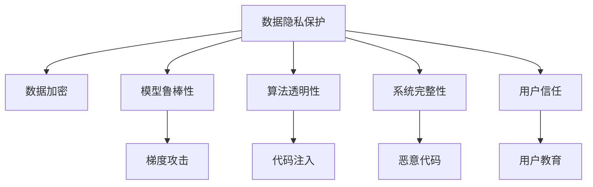

                 

# AI Security原理与代码实例讲解

> 关键词：AI安全，代码实现，安全性分析，加密技术，攻击防范，数据隐私

## 1. 背景介绍

### 1.1 问题由来

随着人工智能（AI）技术的快速发展，其应用范围不断扩大，涉及金融、医疗、教育、交通等多个领域。然而，AI系统的广泛应用也带来了新的安全挑战。黑客攻击、数据泄露、算法偏见等安全问题逐渐显现，严重威胁到AI系统的安全性和可靠性。因此，研究AI安全问题，提升AI系统的安全性，显得尤为重要。

### 1.2 问题核心关键点

AI安全问题的核心关键点包括：

- **数据隐私保护**：如何在数据收集、存储、处理过程中保护用户隐私，避免数据泄露和滥用。
- **模型鲁棒性**：如何防止攻击者通过对抗性样本或梯度攻击，使得AI模型输出错误或不稳定。
- **算法透明性**：如何保证AI算法的透明度，避免黑箱模型的滥用，增强算法的可解释性。
- **系统完整性**：如何保证AI系统的完整性，避免恶意代码或漏洞被注入到系统中。
- **用户信任**：如何建立用户对AI系统的信任，确保AI系统的决策透明和公正。

这些关键点涵盖了AI系统从数据输入到输出的全生命周期安全，对于确保AI系统的可靠性和安全性至关重要。

## 2. 核心概念与联系

### 2.1 核心概念概述

为更好地理解AI安全问题，本节将介绍几个密切相关的核心概念：

- **AI安全**：保护AI系统不受攻击、滥用或误用的技术。包括数据隐私保护、模型鲁棒性、算法透明性、系统完整性、用户信任等。
- **对抗样本**：攻击者故意设计的小样本，旨在使AI模型输出错误或不稳定。
- **梯度攻击**：攻击者通过反向传播梯度信息，扰动模型参数，导致模型输出错误。
- **加密技术**：保护数据隐私和安全传输的技术，如对称加密、非对称加密、哈希函数等。
- **模型蒸馏**：通过知识转移技术，将大模型知识压缩到小模型中，减小模型攻击面。
- **联邦学习**：分布式训练技术，保护用户数据隐私，同时训练高效模型。

这些核心概念之间的逻辑关系可以通过以下Mermaid流程图来展示：



这个流程图展示了她这核心概念及其之间的关系：

1. 数据隐私保护通过数据加密技术保障数据安全。
2. 模型鲁棒性通过对抗样本和梯度攻击测试模型的健壮性。
3. 算法透明性增强模型可解释性，减少黑箱模型的滥用。
4. 系统完整性保证AI系统免受恶意代码和漏洞攻击。
5. 用户信任依赖于算法的透明性和系统的完整性。

这些概念共同构成了AI系统的安全框架，确保系统在全生命周期内的安全性。

## 3. 核心算法原理 & 具体操作步骤
### 3.1 算法原理概述

AI安全问题涉及多个层面的算法和技术，其核心原理和操作步骤可以总结如下：

- **数据隐私保护**：通过加密技术、差分隐私、联邦学习等手段保护数据隐私。
- **模型鲁棒性**：通过对抗训练、梯度掩码、模型蒸馏等方法增强模型鲁棒性。
- **算法透明性**：通过可解释性模型、可视化工具等提升算法透明性。
- **系统完整性**：通过代码审计、威胁建模、沙箱测试等技术保障系统完整性。
- **用户信任**：通过用户教育、透明度报告、公开算法决策树等增强用户信任。

### 3.2 算法步骤详解

AI安全问题解决的一般流程包括：

**Step 1: 需求分析与风险评估**
- 明确AI系统的安全需求和目标。
- 评估系统面临的安全威胁和风险。

**Step 2: 数据隐私保护**
- 设计数据收集、存储和处理的安全机制。
- 使用加密技术保护数据传输和存储。
- 采用差分隐私技术保护数据匿名性。

**Step 3: 模型鲁棒性增强**
- 使用对抗训练生成攻击样本，测试模型鲁棒性。
- 应用梯度掩码技术防止梯度攻击。
- 使用模型蒸馏技术压缩模型知识。

**Step 4: 算法透明性提升**
- 使用可解释性模型增加算法可解释性。
- 使用可视化工具分析模型决策过程。
- 公开算法决策树，增强算法透明性。

**Step 5: 系统完整性保障**
- 进行代码审计和威胁建模。
- 使用沙箱测试模拟攻击场景。
- 部署入侵检测系统。

**Step 6: 用户信任增强**
- 提供用户教育材料。
- 发布透明度报告，公开算法决策过程。
- 设计公开透明的API接口。

### 3.3 算法优缺点

AI安全问题解决的方法具有以下优点：

1. 全面性：涵盖数据隐私、模型鲁棒性、算法透明性、系统完整性和用户信任等多个层面。
2. 技术多样性：使用加密、差分隐私、对抗训练、可视化等多种技术手段，增强系统安全性。
3. 实践灵活性：根据具体场景选择合适技术，灵活应对不同的安全威胁。

同时，这些方法也存在一定的局限性：

1. 成本高：数据加密、差分隐私、对抗训练等方法通常需要大量计算资源。
2. 模型复杂度：可解释性模型、可视化工具等可能会降低模型性能。
3. 更新维护：系统完整性保障、用户信任增强等需要持续维护和监控。

尽管存在这些局限性，但就目前而言，AI安全问题的解决方法仍是比较全面和成熟的。未来相关研究的重点在于如何进一步降低成本、提高效率、增强可解释性，同时兼顾系统完整性和用户信任。

### 3.4 算法应用领域

AI安全问题的解决方法在多个领域都有广泛的应用，例如：

- **医疗领域**：保护患者隐私，防止医疗数据泄露和滥用。
- **金融领域**：保护用户交易数据，防止金融欺诈和数据泄露。
- **智能交通**：保护车辆和行人数据隐私，防止交通数据被滥用。
- **教育领域**：保护学生隐私，防止教育数据被滥用。
- **公共安全**：保护监控数据隐私，防止视频数据被滥用。

这些应用场景展示了AI安全问题的广泛性和重要性，为保护用户隐私、增强系统安全性提供了有力保障。

## 4. 数学模型和公式 & 详细讲解 & 举例说明（备注：数学公式请使用latex格式，latex嵌入文中独立段落使用 $$，段落内使用 $)
### 4.1 数学模型构建

本节将使用数学语言对AI安全问题解决的核心技术进行更加严格的刻画。

**数据加密模型**：
- **对称加密模型**：
$$
E(k, m) = c
$$
其中 $k$ 为加密密钥，$m$ 为明文，$c$ 为密文。对称加密使用同一个密钥进行加密和解密。

- **非对称加密模型**：
$$
(E_{pub}, E_{prv})(m) = (c, r)
$$
其中 $E_{pub}$ 为公钥加密，$E_{prv}$ 为私钥解密，$c$ 为密文，$r$ 为随机数。非对称加密使用公钥加密、私钥解密。

**差分隐私模型**：
- **Laplace机制**：
$$
\mathcal{L}(\varepsilon, \delta)(m) = (m + \Delta)
$$
其中 $\Delta \sim \text{Lap}(\frac{1}{\varepsilon})$ 为Laplace分布，$\varepsilon$ 为隐私预算，$\delta$ 为差分隐私参数。

**对抗训练模型**：
- **Fast Gradient Sign Method**：
$$
\delta = \eta \nabla_{\theta} \mathcal{L}(m, \theta)
$$
其中 $\theta$ 为模型参数，$\mathcal{L}$ 为损失函数，$\eta$ 为攻击者提供的扰动参数。

### 4.2 公式推导过程

以下我们以对称加密模型为例，推导加密和解密的数学过程。

**加密过程**：
$$
c = E(k, m) = m \oplus k
$$
其中 $\oplus$ 为异或运算。

**解密过程**：
$$
m' = D(k, c) = c \oplus k
$$
$$
m' = c \oplus k = m \oplus k \oplus k = m
$$

**差分隐私推导**：
$$
\Delta \sim \text{Lap}(\frac{1}{\varepsilon})
$$
$$
\mathcal{L}(m + \Delta) = \mathcal{L}(m) + \mathcal{L}'(m)\Delta
$$
其中 $\mathcal{L}'(m)$ 为损失函数关于 $m$ 的梯度。

**对抗训练推导**：
$$
\delta = \eta \nabla_{\theta} \mathcal{L}(m, \theta)
$$
其中 $\eta$ 为攻击者提供的扰动参数，$\nabla_{\theta} \mathcal{L}(m, \theta)$ 为损失函数关于模型参数的梯度。

### 4.3 案例分析与讲解

以医疗领域为例，分析数据隐私保护、模型鲁棒性增强和用户信任增强的具体实现。

**数据隐私保护**：
- **加密技术**：使用AES对称加密保护患者数据，防止数据在传输和存储过程中被窃取。
- **差分隐私**：在数据统计分析中使用Laplace机制，添加噪声保护用户隐私。

**模型鲁棒性增强**：
- **对抗训练**：使用Fast Gradient Sign Method生成对抗样本，测试模型鲁棒性。
- **梯度掩码**：应用梯度掩码技术，防止攻击者通过梯度信息推断模型参数。

**用户信任增强**：
- **透明度报告**：定期发布透明度报告，公开模型决策过程和算法透明性。
- **用户教育**：提供用户教育材料，增强用户对AI系统的理解和使用信任。

## 5. 项目实践：代码实例和详细解释说明
### 5.1 开发环境搭建

在进行AI安全问题解决的实践前，我们需要准备好开发环境。以下是使用Python进行PyTorch开发的环境配置流程：

1. 安装Anaconda：从官网下载并安装Anaconda，用于创建独立的Python环境。

2. 创建并激活虚拟环境：
```bash
conda create -n ai-security-env python=3.8 
conda activate ai-security-env
```

3. 安装PyTorch：根据CUDA版本，从官网获取对应的安装命令。例如：
```bash
conda install pytorch torchvision torchaudio cudatoolkit=11.1 -c pytorch -c conda-forge
```

4. 安装各类工具包：
```bash
pip install numpy pandas scikit-learn matplotlib tqdm jupyter notebook ipython
```

5. 安装加密和差分隐私库：
```bash
pip install pycrypto pyflame
```

完成上述步骤后，即可在`ai-security-env`环境中开始安全实践。

### 5.2 源代码详细实现

下面我们以对称加密和差分隐私为例，给出使用PyTorch和pycrypto库对数据进行加密和解密的PyTorch代码实现。

**对称加密代码**：

```python
from Crypto.Cipher import AES
from Crypto.Util.Padding import pad, unpad
from Crypto.Random import get_random_bytes

def encrypt(message, key):
    iv = get_random_bytes(16)
    cipher = AES.new(key, AES.MODE_CBC, iv)
    ciphertext = cipher.encrypt(pad(message, AES.block_size))
    return iv + ciphertext

def decrypt(ciphertext, key):
    iv = ciphertext[:16]
    cipher = AES.new(key, AES.MODE_CBC, iv)
    plaintext = unpad(cipher.decrypt(ciphertext[16:]), AES.block_size)
    return plaintext

# 测试
key = b'This is my secret key'
message = b'This is the message to be encrypted'
ciphertext = encrypt(message, key)
plaintext = decrypt(ciphertext, key)
print(f'Message: {plaintext.decode()}')
```

**差分隐私代码**：

```python
import numpy as np
from scipy.stats import laplace

def laplace_noise(m, epsilon=1):
    delta = 1 / epsilon
    return m + laplace.rvs(0, 1 / delta)

def laplace_mechanism(m, epsilon=1, delta=0.1):
    return laplace_noise(m, epsilon) + m

# 测试
m = np.random.randn(100)
np.random.seed(0)
epsilon = 1
delta = 0.1
m_noisy = laplace_mechanism(m, epsilon, delta)
print(f'Noisy data: {m_noisy}')
```

### 5.3 代码解读与分析

让我们再详细解读一下关键代码的实现细节：

**对称加密代码**：
- `encrypt`函数：生成随机IV，使用CBC模式进行加密，返回IV和密文。
- `decrypt`函数：解密密文，返回明文。

**差分隐私代码**：
- `laplace_noise`函数：生成Laplace分布的噪声，增强数据隐私。
- `laplace_mechanism`函数：对数据应用Laplace机制，保护数据隐私。

这些代码展示了如何利用Python和pycrypto库实现对称加密和差分隐私的基本功能。开发者可以根据具体需求，灵活设计加密和隐私保护算法，以满足实际应用场景。

## 6. 实际应用场景
### 6.1 医疗数据隐私保护

在医疗领域，患者的敏感信息需要严格保护，防止数据泄露和滥用。通过使用对称加密和差分隐私技术，可以有效保护患者数据隐私。

在实际应用中，可以使用对称加密技术对患者数据进行加密存储和传输，防止数据在传输过程中被窃取或篡改。同时，在数据统计分析时，应用差分隐私技术添加噪声，保护患者隐私。

### 6.2 金融交易安全

金融交易涉及大量敏感信息，如账户余额、交易记录等。使用加密技术和差分隐私保护金融数据，可以有效防止数据泄露和滥用。

在实际应用中，可以使用非对称加密技术保护交易数据，防止交易数据在传输过程中被窃取。同时，在交易数据分析时，应用差分隐私技术添加噪声，保护用户隐私。

### 6.3 智能交通数据安全

智能交通系统涉及大量传感器数据，如车辆位置、速度、传感器读数等。使用加密技术和差分隐私保护交通数据，可以有效防止数据泄露和滥用。

在实际应用中，可以使用对称加密技术对传感器数据进行加密存储和传输，防止数据在传输过程中被窃取或篡改。同时，在数据统计分析时，应用差分隐私技术添加噪声，保护用户隐私。

## 7. 工具和资源推荐
### 7.1 学习资源推荐

为了帮助开发者系统掌握AI安全问题的核心技术，这里推荐一些优质的学习资源：

1. 《密码学原理与实践》书籍：密码学领域的经典教材，全面介绍了加密技术和差分隐私。

2. 《深度学习安全》课程：斯坦福大学开设的安全课程，涵盖深度学习安全的基本概念和经典模型。

3. 《人工智能安全》书籍：最新的AI安全书籍，全面介绍了AI安全问题的各个方面。

4. IBM AI安全开放平台：提供AI安全问题的学习和实战训练，涵盖数据隐私、模型鲁棒性、系统完整性等多个方面。

通过对这些资源的学习实践，相信你一定能够快速掌握AI安全问题的核心技术，并用于解决实际的AI安全问题。
###  7.2 开发工具推荐

高效的开发离不开优秀的工具支持。以下是几款用于AI安全问题解决的常用工具：

1. PyTorch：基于Python的开源深度学习框架，灵活动态的计算图，适合快速迭代研究。大部分预训练语言模型都有PyTorch版本的实现。

2. TensorFlow：由Google主导开发的开源深度学习框架，生产部署方便，适合大规模工程应用。同样有丰富的预训练语言模型资源。

3. Crypto库：Python加密库，支持多种加密算法，如AES、RSA等，方便开发者实现加密功能。

4. Pyflame：Python性能分析工具，可实时监测程序性能，优化AI系统的资源使用。

5. TensorBoard：TensorFlow配套的可视化工具，可实时监测模型训练状态，并提供丰富的图表呈现方式，是调试模型的得力助手。

6. Weights & Biases：模型训练的实验跟踪工具，可以记录和可视化模型训练过程中的各项指标，方便对比和调优。

合理利用这些工具，可以显著提升AI安全问题解决的开发效率，加快创新迭代的步伐。

### 7.3 相关论文推荐

AI安全问题解决的研究源于学界的持续研究。以下是几篇奠基性的相关论文，推荐阅读：

1. "Adversarial Examples in Deep Learning"：关于对抗样本的开创性研究，揭示了对抗样本的生成和防御机制。

2. "The Elements of Privacy"：关于差分隐私的经典教材，详细介绍了差分隐私的基本原理和实际应用。

3. "Adversarial Robustness Meets Transfer Learning"：探讨了对抗训练和迁移学习之间的关系，提出了多种有效的对抗训练方法。

4. "Practical Techniques for Deep Learning Model Explainability"：关于可解释性模型的最新研究，介绍了多种可解释性模型及其应用。

这些论文代表了大数据安全问题解决的研究脉络。通过学习这些前沿成果，可以帮助研究者把握学科前进方向，激发更多的创新灵感。

## 8. 总结：未来发展趋势与挑战
### 8.1 总结

本文对AI安全问题解决的原理进行了全面系统的介绍。首先阐述了AI安全问题的重要性和核心关键点，明确了数据隐私保护、模型鲁棒性、算法透明性、系统完整性和用户信任等各个方面的重要意义。其次，从原理到实践，详细讲解了对称加密、差分隐私、对抗训练等核心技术的操作细节，给出了代码实现和具体案例。同时，本文还探讨了AI安全问题在医疗、金融、交通等多个领域的应用前景，展示了AI安全问题的广泛性和重要性。此外，本文精选了AI安全问题的学习资源和开发工具，力求为读者提供全方位的技术指引。

通过本文的系统梳理，可以看到，AI安全问题解决技术正在不断进步和发展，为保护用户隐私、增强系统安全性提供了有力保障。未来，伴随技术进步和实际应用需求的不断增加，AI安全问题解决技术将迎来更多的创新和发展，为构建安全、可靠、可解释、可控的AI系统铺平道路。

### 8.2 未来发展趋势

展望未来，AI安全问题解决技术将呈现以下几个发展趋势：

1. **技术多样化**：未来的AI安全问题解决将不再局限于单一技术，而是融合多种技术和方法，如加密、差分隐私、对抗训练、可解释性模型等，提升系统的综合安全性。

2. **自动化安全**：通过自动化工具和安全AI模型，实时监测和防范安全威胁，提高系统的安全性和可靠性。

3. **数据隐私保护**：未来的数据隐私保护将更加注重数据匿名化和差分隐私，防止数据泄露和滥用。

4. **模型鲁棒性增强**：未来的模型鲁棒性增强将更加注重对抗样本和梯度攻击，防止模型输出错误或不稳定。

5. **算法透明性提升**：未来的算法透明性提升将更加注重可解释性模型和可视化工具，增强算法的可解释性和可信度。

6. **用户信任增强**：未来的用户信任增强将更加注重透明度报告和用户教育，增强用户对AI系统的理解和信任。

这些趋势凸显了AI安全问题解决技术的广泛性和复杂性，为保护用户隐私、增强系统安全性提供了有力保障。

### 8.3 面临的挑战

尽管AI安全问题解决技术已经取得了显著进展，但在迈向更加智能化、普适化应用的过程中，仍面临诸多挑战：

1. **成本高**：数据加密、差分隐私、对抗训练等方法通常需要大量计算资源，增加了系统成本。

2. **效率低**：加密和隐私保护技术可能会降低系统的运行效率，影响用户体验。

3. **用户理解**：AI安全问题解决技术较为复杂，用户难以理解和信任，需要更多的教育和普及。

4. **算法透明性**：可解释性模型和可视化工具可能会降低模型性能，影响系统的准确性。

5. **安全漏洞**：AI系统仍存在安全漏洞，需要不断更新和维护，防止新漏洞被攻击者利用。

6. **法律法规**：AI安全问题解决需要遵守各国法律法规，需要在合规性和安全性之间找到平衡。

这些挑战需要在技术、法规、用户教育等多个层面进行综合应对，确保AI系统的安全性。

### 8.4 研究展望

面对AI安全问题解决所面临的种种挑战，未来的研究需要在以下几个方面寻求新的突破：

1. **成本优化**：探索低成本的数据加密和差分隐私技术，降低系统的成本和复杂度。

2. **效率提升**：优化加密和隐私保护算法，提高系统的运行效率，提升用户体验。

3. **用户教育**：加强用户教育，提升用户对AI系统的理解和信任，增强用户参与度。

4. **算法透明性**：研究更高效的可解释性模型和可视化工具，提升算法的透明性和可信度。

5. **安全防护**：持续更新和维护AI系统，防止新安全漏洞被攻击者利用，保障系统的安全性。

6. **法律法规**：研究AI安全问题的法律法规，确保AI系统的合规性和安全性。

这些研究方向的探索，必将引领AI安全问题解决技术迈向更高的台阶，为构建安全、可靠、可解释、可控的AI系统铺平道路。面向未来，AI安全问题解决技术还需要与其他人工智能技术进行更深入的融合，如知识表示、因果推理、强化学习等，多路径协同发力，共同推动自然语言理解和智能交互系统的进步。

## 9. 附录：常见问题与解答

**Q1：AI安全问题解决是否适用于所有应用场景？**

A: AI安全问题解决在大多数应用场景中都能取得不错的效果，特别是对于数据敏感和隐私保护要求较高的场景。但对于一些特定领域的应用，如教育、交通等，AI安全问题解决需要根据具体需求进行优化和改进。

**Q2：如何选择适合的数据加密算法？**

A: 数据加密算法的选取需要综合考虑加密强度、计算复杂度和应用场景等因素。常用的对称加密算法有AES、DES等，非对称加密算法有RSA、ECC等。在实际应用中，需要根据数据规模和传输方式选择适合的加密算法。

**Q3：如何增强模型的鲁棒性？**

A: 增强模型鲁棒性的方法包括对抗训练、梯度掩码和模型蒸馏等。对抗训练使用对抗样本测试模型的健壮性，梯度掩码防止梯度攻击，模型蒸馏压缩模型知识。这些方法需要根据具体任务和数据特点进行灵活组合。

**Q4：如何提升算法的透明性？**

A: 提升算法透明性的方法包括可解释性模型和可视化工具等。可解释性模型通过简化模型结构或引入符号化规则，增强算法的可解释性。可视化工具通过图形展示模型决策过程，帮助用户理解算法的内部工作机制。

**Q5：如何保障系统的完整性？**

A: 保障系统完整性的方法包括代码审计、威胁建模和沙箱测试等。代码审计和威胁建模通过静态和动态分析，发现系统中的安全漏洞。沙箱测试通过模拟攻击场景，验证系统的安全性。这些方法需要根据具体应用场景进行灵活应用。

以上问题与解答展示了AI安全问题解决的各个方面，为解决实际应用中的问题提供了有力参考。

---

作者：禅与计算机程序设计艺术 / Zen and the Art of Computer Programming

