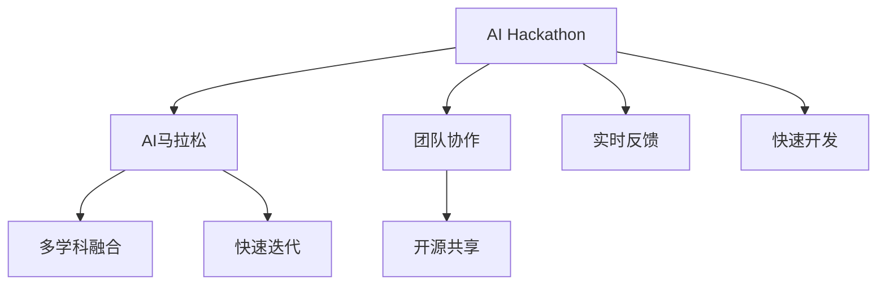

                 

# AI hackathon的影响与未来

## 1. 背景介绍

### 1.1 问题由来

AI Hackathon，又称为AI马拉松，是指在限定时间内（通常为48小时），围绕一个特定的AI挑战主题，进行团队协作，快速开发出一个完整的AI解决方案的竞赛活动。自2012年Codemania首次引入AI Hackathon以来，这一形式迅速在全球范围内推广开来，并成为了AI技术交流和展示的重要平台。

AI Hackathon不仅为技术爱好者提供了展示才能的机会，也推动了AI技术的快速发展和广泛应用。通过这种形式，技术人才可以将理论知识转化为实际应用，并直接反馈到产业界，推动技术创新和产品迭代。

### 1.2 问题核心关键点

AI Hackathon的核心在于快速、高效地将新技术、新算法应用到实际问题中，并通过实时验证和反馈，不断优化解决方案。其核心关键点包括：

- **实时反馈**：通过不断的反馈和迭代，及时发现问题并改进解决方案。
- **多学科融合**：将AI技术与业务场景、用户体验等多学科知识相结合，提升解决方案的全面性和实用性。
- **团队协作**：强调跨领域团队合作，利用不同背景的人才，互补优势，提高开发效率。
- **开源共享**：鼓励开源共享，通过代码托管平台如GitHub等，实现知识传播和技术积累。

## 2. 核心概念与联系

### 2.1 核心概念概述

为了更好地理解AI Hackathon的影响与未来发展，本节将介绍几个关键概念：

- **AI Hackathon**：在限定时间内，围绕特定AI挑战，团队快速开发解决方案的竞赛活动。
- **AI马拉松**：指以团队合作的形式，在短时间内（通常48小时）开发AI应用的场景。
- **团队协作**：跨学科、多领域人才的协同工作，共同解决复杂问题。
- **开源共享**：通过代码托管平台，实现知识共享和技术积累。
- **实时反馈**：通过迭代改进，实时获取用户反馈并优化解决方案。

这些概念之间的关系可以通过以下Mermaid流程图来展示：



该流程图展示了AI Hackathon的几个核心概念及其相互关系：

1. **AI马拉松**：AI Hackathon的一种形式，强调快速开发和迭代。
2. **团队协作**：跨学科团队合作，利用不同背景的人才，共同解决问题。
3. **开源共享**：通过代码托管平台实现知识共享和技术积累。
4. **实时反馈**：通过不断的反馈和迭代，提升解决方案的实时性和实用性。
5. **多学科融合**：将AI技术与业务场景、用户体验等多学科知识相结合，提升全面性。
6. **快速开发**：在限定时间内开发出解决方案，强调效率和速度。
7. **快速迭代**：通过实时反馈不断优化解决方案，确保最优性能。

这些概念共同构成了AI Hackathon的工作框架，使其能够在短时间内高效地将AI技术转化为实际应用。

## 3. 核心算法原理 & 具体操作步骤

### 3.1 算法原理概述

AI Hackathon的算法原理主要基于敏捷开发和快速迭代的方法论。其核心思想是通过小步快跑、快速迭代，不断调整和优化解决方案，最终实现高质量的AI应用。

### 3.2 算法步骤详解

AI Hackathon的算法步骤如下：

1. **问题定义**：明确挑战主题，确定任务目标。
2. **团队组建**：组建跨学科团队，分工明确，充分利用不同背景人才的优点。
3. **需求分析**：通过访谈、调研等手段，深入理解业务需求和用户体验。
4. **数据准备**：收集和处理所需数据，确保数据质量。
5. **模型选择**：根据任务需求选择合适的算法和模型。
6. **模型训练**：利用机器学习框架进行模型训练，迭代优化模型性能。
7. **应用开发**：将模型集成到实际应用中，开发API、Web应用等。
8. **测试验证**：在实际环境中进行测试验证，获取用户反馈。
9. **优化改进**：根据测试结果和用户反馈，不断优化模型和应用。
10. **展示演示**：通过PPT、Demo等方式，展示最终成果。

### 3.3 算法优缺点

AI Hackathon的优点包括：

- **快速响应**：能够在短时间内快速解决问题，响应业务需求。
- **跨学科协作**：不同领域人才的协作，促进技术创新和业务洞察。
- **实时反馈**：通过不断的迭代和优化，提高解决方案的实用性和可靠性。
- **开源共享**：代码托管平台促进知识共享和技术积累。

其缺点则在于：

- **压力大**：在限定时间内完成项目，可能导致团队压力大、疲劳度高。
- **质量不稳定**：快速开发可能导致代码质量不高、bug较多。
- **资源有限**：时间、人力、数据等资源有限，可能影响解决方案的深度和广度。

### 3.4 算法应用领域

AI Hackathon的应用领域非常广泛，涵盖了从医疗、金融、教育到农业、能源等各个行业。以下是几个典型的应用场景：

- **医疗健康**：利用AI技术进行疾病诊断、医疗影像分析、健康监测等。例如，通过AI Hackathon开发出针对特定疾病的早期筛查系统。
- **金融科技**：运用AI技术进行信用评估、风险控制、智能投顾等。例如，基于AI Hackathon开发的金融欺诈检测系统。
- **教育科技**：利用AI技术进行个性化学习、智能辅导、教育资源推荐等。例如，基于AI Hackathon开发的智能教学系统。
- **智慧城市**：运用AI技术进行交通管理、环境监测、公共安全等。例如，基于AI Hackathon开发的智慧交通系统。
- **农业科技**：通过AI技术进行农作物监测、精准农业等。例如，基于AI Hackathon开发的农业无人机监测系统。

## 4. 数学模型和公式 & 详细讲解 & 举例说明

### 4.1 数学模型构建

在AI Hackathon中，常用的数学模型包括回归模型、分类模型、聚类模型等。以分类模型为例，构建数学模型的一般步骤如下：

1. **特征选择**：从原始数据中选择对分类有用的特征。
2. **模型训练**：使用训练数据集训练模型，调整模型参数。
3. **模型评估**：使用测试数据集评估模型性能，选择合适的模型。
4. **模型应用**：将模型应用到实际数据中，进行分类预测。

### 4.2 公式推导过程

以线性回归模型为例，其公式推导如下：

$$
y = \beta_0 + \beta_1x_1 + \beta_2x_2 + \ldots + \beta_nx_n + \epsilon
$$

其中 $y$ 为因变量，$x_i$ 为自变量，$\beta_i$ 为回归系数，$\epsilon$ 为误差项。线性回归模型的最小二乘法估计公式为：

$$
\hat{\beta} = (X^TX)^{-1}X^Ty
$$

其中 $X$ 为自变量矩阵，$y$ 为因变量向量，$\hat{\beta}$ 为回归系数向量。

### 4.3 案例分析与讲解

假设有一项AI Hackathon挑战任务，要求开发一个基于机器学习的股票价格预测模型。首先，需要对历史股票价格数据进行特征选择，包括开盘价、收盘价、成交量等。然后，使用线性回归模型对数据进行训练，调整回归系数，确保模型预测准确性。最后，将模型应用到实时数据中，进行股票价格预测。

## 5. AI Hackathon的项目实践：代码实例和详细解释说明

### 5.1 开发环境搭建

要进行AI Hackathon项目实践，首先需要搭建开发环境。以下是Python开发环境的具体配置步骤：

1. **安装Python和Anaconda**：安装Python 3.x版本，下载并安装Anaconda，创建独立的Python环境。
2. **安装相关库**：安装常用的Python科学计算库，如NumPy、Pandas、Matplotlib等。
3. **安装机器学习库**：安装常用的机器学习库，如Scikit-learn、TensorFlow等。
4. **配置代码编辑器**：配置Python代码编辑器，如PyCharm、Jupyter Notebook等。

### 5.2 源代码详细实现

以下是一个简单的Python代码实现，用于构建线性回归模型并应用于股票价格预测：

```python
import numpy as np
from sklearn.linear_model import LinearRegression
from sklearn.metrics import mean_squared_error

# 构建训练数据集
X = np.array([[1, 2, 3], [4, 5, 6], [7, 8, 9]])
y = np.array([10, 20, 30])

# 训练模型
model = LinearRegression()
model.fit(X, y)

# 预测新数据
X_test = np.array([[10, 11, 12], [13, 14, 15]])
y_pred = model.predict(X_test)

# 计算误差
mse = mean_squared_error(y, y_pred)
print("均方误差：", mse)
```

### 5.3 代码解读与分析

以上代码实现了一个简单的线性回归模型，用于预测股票价格。首先，构建了一个包含3个特征和3个样本的训练数据集。然后，使用Scikit-learn库中的LinearRegression模型进行训练。最后，使用训练好的模型对新数据进行预测，并计算预测误差。

## 6. 实际应用场景

### 6.1 智能客服系统

AI Hackathon可以应用于智能客服系统的构建，通过AI技术实现自然语言理解和智能对话，提升客服效率和用户满意度。例如，基于AI Hackathon开发的智能客服机器人，能够自动回答用户常见问题，减轻客服人员的工作负担，提高服务响应速度。

### 6.2 金融风险管理

AI Hackathon可以用于金融风险管理，通过AI技术进行信用评估、欺诈检测等。例如，基于AI Hackathon开发的欺诈检测系统，能够实时监测交易数据，识别异常行为，及时发现和防范金融欺诈行为。

### 6.3 智慧医疗

AI Hackathon可以用于智慧医疗，通过AI技术进行疾病诊断、医疗影像分析等。例如，基于AI Hackathon开发的疾病预测系统，能够根据患者的历史医疗数据，预测患病风险，提供个性化的健康建议。

## 7. 工具和资源推荐

### 7.1 学习资源推荐

为了帮助开发者系统掌握AI Hackathon的技术基础和实践技巧，推荐以下学习资源：

1. **Coursera《机器学习》课程**：斯坦福大学Andrew Ng教授开设的经典课程，涵盖机器学习基础、算法、应用等内容。
2. **Udacity《深度学习》课程**：Udacity深度学习纳米学位课程，涵盖深度学习基础、模型架构、优化算法等内容。
3. **Kaggle竞赛平台**：全球最大的数据科学竞赛平台，提供大量真实世界的数据集和挑战任务，是实践AI Hackathon的绝佳场所。
4. **GitHub代码托管平台**：提供代码托管、协作、版本控制等功能，是AI Hackathon中开源共享的重要工具。
5. **Jupyter Notebook**：提供交互式代码编写和展示环境，是AI Hackathon中常用的开发工具。

### 7.2 开发工具推荐

AI Hackathon的开发工具主要包括以下几种：

1. **Python**：Python是目前最流行的科学计算和数据处理语言，广泛应用于机器学习和AI开发中。
2. **Jupyter Notebook**：提供交互式代码编写和展示环境，是AI Hackathon中常用的开发工具。
3. **PyTorch**：基于Python的深度学习框架，支持动态图和静态图计算，适用于复杂模型的开发。
4. **TensorFlow**：由Google开发的深度学习框架，支持分布式计算，适用于大规模模型的开发。
5. **scikit-learn**：Python科学计算库，提供丰富的机器学习算法和工具，是AI Hackathon中常用的工具之一。

### 7.3 相关论文推荐

AI Hackathon的发展离不开学界的持续研究。以下是几篇奠基性的相关论文，推荐阅读：

1. **《Deep Learning》（Ian Goodfellow等人）**：深度学习领域的经典教材，涵盖深度学习基础、算法、应用等内容。
2. **《Neural Networks and Deep Learning》（Michael Nielsen）**：深度学习基础教程，涵盖神经网络、深度学习等基本概念。
3. **《Programming PyTorch for Deep Learning》（Lisa Urrutia）**：PyTorch深度学习开发教程，涵盖PyTorch基础、算法、应用等内容。

## 8. 总结：未来发展趋势与挑战

### 8.1 研究成果总结

AI Hackathon作为一种高效、实效的AI技术开发方式，已经在各个领域得到了广泛应用，推动了AI技术的快速发展和广泛应用。通过AI Hackathon，技术人才可以将理论知识转化为实际应用，并直接反馈到产业界，推动技术创新和产品迭代。

### 8.2 未来发展趋势

展望未来，AI Hackathon的发展趋势包括：

1. **技术创新加速**：AI Hackathon将加速AI技术的创新和应用，推动更多前沿技术落地。
2. **跨学科融合深化**：AI Hackathon将促进多学科融合，提升解决方案的全面性和实用性。
3. **开源共享普及**：AI Hackathon将进一步推动开源共享，促进技术积累和知识传播。
4. **实时反馈优化**：AI Hackathon将更加注重实时反馈和迭代优化，提高解决方案的实用性和可靠性。
5. **人工智能普及**：AI Hackathon将推动人工智能技术在各个领域的普及和应用。

### 8.3 面临的挑战

尽管AI Hackathon已经取得了显著成果，但在未来的发展过程中，仍然面临以下挑战：

1. **时间压力**：在限定时间内完成项目，可能导致团队压力大、疲劳度高。
2. **质量不稳定**：快速开发可能导致代码质量不高、bug较多。
3. **资源有限**：时间、人力、数据等资源有限，可能影响解决方案的深度和广度。
4. **技术门槛高**：参与者需要具备较高的技术水平和经验，可能限制人才的参与。
5. **数据隐私问题**：在处理敏感数据时，需要确保数据隐私和安全。

### 8.4 研究展望

未来的研究需要在以下几个方面寻求新的突破：

1. **技术优化**：提高开发效率和代码质量，减少bug和错误。
2. **资源配置**：优化资源配置，提高解决方案的深度和广度。
3. **人才培养**：降低技术门槛，促进更多人才的参与。
4. **数据隐私保护**：确保数据隐私和安全，增强用户信任。
5. **跨领域应用**：推动AI Hackathon在更多领域的应用，促进技术创新和产业升级。

通过不断优化和创新，AI Hackathon必将在未来的发展中发挥更大的作用，推动AI技术的全面普及和应用。

## 9. 附录：常见问题与解答

**Q1: 如何高效利用时间，在限定时间内完成AI Hackathon项目？**

A: 高效的团队协作和敏捷开发是关键。可以采用以下方法：

1. **任务分解**：将项目分解为多个子任务，分工明确，提高效率。
2. **优先级排序**：根据任务的重要性和紧急程度，优先完成关键任务。
3. **迭代开发**：采用快速迭代和反馈机制，及时发现和解决问题。
4. **并行处理**：合理分工，充分利用每个成员的专长，提高开发速度。

**Q2: AI Hackathon中的代码质量如何保证？**

A: 代码质量保证需要从多个方面进行：

1. **代码审查**：通过代码审查，发现和修正代码中的错误和问题。
2. **自动化测试**：编写自动化测试用例，确保代码的正确性。
3. **版本控制**：使用版本控制工具，如Git，进行代码管理，确保代码的完整性和可追溯性。
4. **代码重构**：定期进行代码重构，优化代码结构和逻辑，提高代码质量。

**Q3: 如何确保AI Hackathon中的数据隐私和安全？**

A: 数据隐私和安全是AI Hackathon中需要重点关注的问题，可以采用以下措施：

1. **数据脱敏**：对敏感数据进行脱敏处理，确保数据隐私。
2. **访问控制**：对数据进行访问控制，防止未经授权的访问。
3. **加密传输**：在数据传输过程中进行加密，防止数据泄露。
4. **安全审计**：定期进行安全审计，发现和修复潜在的安全问题。

---

作者：禅与计算机程序设计艺术 / Zen and the Art of Computer Programming

