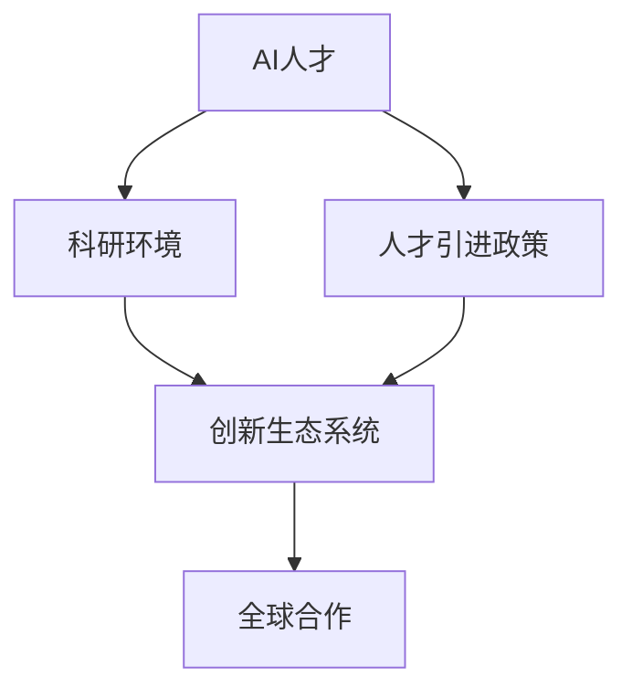

                 

# AI 人才引进政策：吸引全球顶尖 AI 人才

## 1. 背景介绍

### 1.1 问题由来
随着人工智能（AI）技术的飞速发展，全球各大企业和研究机构对AI人才的需求日益增长。AI人才，尤其是具有创新能力和解决复杂问题的顶尖AI专家，成为推动科技创新的核心力量。然而，全球AI人才分布不均，美国、中国等少数国家集中了大量顶尖AI人才，而其他许多国家在AI领域处于起步阶段，人才缺口巨大。

为应对这一挑战，世界各国纷纷推出一系列人才引进政策，以吸引全球顶尖AI人才。这些政策不仅涉及签证、住房、税收等方面，还涵盖了科研支持、创新环境构建、国际合作等方面，旨在创造一个对AI人才具有吸引力和竞争力的生态环境。本文将探讨这些政策的核心内容、实施效果及未来发展方向，希望能为更多国家和地区提供有益的借鉴和启示。

## 2. 核心概念与联系

### 2.1 核心概念概述

本节将介绍几个与AI人才引进政策密切相关的核心概念：

- **AI人才**：指具备AI领域专业知识和技能的人才，包括但不限于数据科学家、机器学习工程师、自然语言处理专家、计算机视觉专家等。
- **人才引进政策**：指各国政府为吸引国际AI人才而制定的一系列政策措施，包括签证、住房、税收优惠、科研资金支持等。
- **科研环境**：指一个国家或地区提供的科研设施、团队合作机会、科研成果转化机制等，影响AI人才的吸引力和留存率。
- **创新生态系统**：指由政府、企业、高校、科研机构等组成的网络，为AI人才提供研究、应用、交流的平台。
- **全球合作**：指各国通过科研合作、人才交流等方式，共同推动全球AI技术的发展。

这些概念之间的逻辑关系可以通过以下Mermaid流程图来展示：



这个流程图展示了几类核心概念之间的联系：

1. AI人才的培养和吸引需要一系列政策支持。
2. 科研环境和创新生态系统的建设是吸引和留存AI人才的基础。
3. 全球合作有助于各国共享AI研究成果，提升整体竞争力。

## 3. 核心算法原理 & 具体操作步骤

### 3.1 算法原理概述

AI人才引进政策的本质是通过一系列政策工具，在经济、学术、法律等多方面对AI人才形成吸引力，以促进其在目的国的工作和生活。政策工具包括但不限于签证、住房补贴、税收优惠、科研资金等，通过合理设计和组合，使AI人才在目的国的总体生活成本、职业发展机会、科研条件等方面优于其他国家，从而实现人才的吸引和保留。

### 3.2 算法步骤详解

AI人才引进政策的制定和实施一般包括以下几个关键步骤：

**Step 1: 政策设计**
- 明确目标：确定政策旨在吸引的AI人才类型、数量、层次等。
- 分析需求：调研当前AI人才缺口，确定紧缺领域。
- 制定方案：基于目标和需求，设计相应的签证、税收、科研支持等政策。

**Step 2: 政策实施**
- 法规制定：将政策设计转化为具体的法规和措施，例如制定特别签证计划、出台科研资金支持政策等。
- 宣传推广：通过媒体、社交平台等渠道广泛宣传人才引进政策，吸引国际AI人才关注。
- 落地执行：各部门协调配合，确保政策的顺利实施，如签证审批、科研资金发放等。

**Step 3: 政策评估**
- 建立指标：设定政策效果的评估指标，如新引进AI人才数量、科研项目数量、科研成果转化率等。
- 数据收集：通过统计调查、问卷调查等方式收集政策实施效果的数据。
- 效果分析：对比政策实施前后的数据变化，评估政策的实际效果。
- 调整优化：根据评估结果，调整和优化政策措施，持续改进。

### 3.3 算法优缺点

AI人才引进政策具有以下优点：

1. **高效率**：相较于培养本国AI人才，通过政策吸引海外顶尖AI人才能显著缩短AI技术突破的时间。
2. **高质量**：海外AI人才通常具备世界领先的研究能力和创新思维，能够带动当地AI研究和应用的快速进步。
3. **国际化**：有助于提升目的国在国际AI领域的地位，促进跨国科研合作和人才交流。

然而，这些政策也存在一些缺点：

1. **成本高**：吸引和留住顶尖AI人才需要大量财政投入，包括科研资金、住房补贴、签证费用等。
2. **依赖性强**：对国际环境的变化较为敏感，如国际形势变化、签证政策调整等，可能影响政策效果。
3. **留存难**：即使政策吸引力强大，仍需考虑到AI人才的职业发展规划、家庭因素等，留存率并非一定高。
4. **公平性问题**：政策可能在一定程度上加剧全球AI人才分布不均，使得少数国家或地区垄断顶尖人才资源。

### 3.4 算法应用领域

AI人才引进政策在多个领域均有应用，以下是几个典型领域：

- **科技企业**：许多科技巨头如谷歌、微软、亚马逊等，通过提供高额薪酬、股权激励、科研设施等，吸引全球顶尖AI人才加入。
- **高校和科研机构**：如斯坦福大学、麻省理工学院等，提供优厚的科研资金、实验室资源、国际合作机会等，吸引和留住国际AI人才。
- **地方政府**：如纽约市、加州硅谷等，通过提供签证便利、住房补贴、税收优惠等，构建吸引AI人才的城市创新环境。
- **跨国科研合作**：如欧洲联盟的Horizon Europe项目，通过联合科研资助、人才交流等方式，促进欧洲各国的AI研究合作。

## 4. 数学模型和公式 & 详细讲解

### 4.1 数学模型构建

本节将使用数学语言对AI人才引进政策的实施效果进行建模和分析。

设一个国家在t时刻引进的AI人才数量为 $N(t)$，其效果函数为 $f$。则政策实施的效果可以通过以下模型表示：

$$
N(t) = f(P(t))
$$

其中，$P(t)$ 代表在t时刻实施的AI人才引进政策集合，包括签证政策、科研资金、住房补贴等。政策集合 $P(t)$ 可以通过以下几个变量描述：

- $F(t)$：科研资金支持力度，通常与科研经费、项目数量等成正比。
- $H(t)$：住房补贴水平，通常与租房补贴、购房补贴等成正比。
- $V(t)$：签证便利度，通常与签证审批速度、签证类型等成正比。
- $T(t)$：税收优惠力度，通常与税收减免、个人所得税税率等成正比。

### 4.2 公式推导过程

假设 $f$ 为线性函数，则有：

$$
N(t) = \alpha F(t) + \beta H(t) + \gamma V(t) + \delta T(t)
$$

其中 $\alpha, \beta, \gamma, \delta$ 为政策效果的系数，反映了各政策对AI人才引进的影响程度。

根据实际情况，可以对模型进行优化，引入时间变量 $t$，得到：

$$
N(t) = a + bF(t-t_0) + cH(t-h_0) + dV(t-v_0) + eT(t-w_0)
$$

其中 $a, b, c, d, e$ 为政策效果的常数，$t_0, h_0, v_0, w_0$ 为政策效果的滞后时间。

### 4.3 案例分析与讲解

假设某国通过实施新的AI人才引进政策，包括提高科研资金支持力度、提供住房补贴、简化签证程序和减税，分别在 $t_0, h_0, v_0, w_0$ 时刻开始实施，持续时间为 $\Delta t$，则有：

$$
N(t) = a + b(F(t-t_0)+\Delta F) + c(H(t-h_0)+\Delta H) + d(V(t-v_0)+\Delta V) + e(T(t-w_0)+\Delta T)
$$

其中 $\Delta F, \Delta H, \Delta V, \Delta T$ 分别为各政策措施的力度变化量。

通过对比不同时间段 $N(t)$ 的变化情况，可以评估政策实施的效果，并根据实际情况进行调整优化。

## 5. 项目实践：代码实例和详细解释说明

### 5.1 开发环境搭建

在进行AI人才引进政策效果评估时，需要建立相应的数据收集和分析平台。以下是使用Python进行数据分析的环境配置流程：

1. 安装Anaconda：从官网下载并安装Anaconda，用于创建独立的Python环境。

2. 创建并激活虚拟环境：
```bash
conda create -n data-analytics python=3.8 
conda activate data-analytics
```

3. 安装Python数据分析库：
```bash
pip install numpy pandas matplotlib seaborn statsmodels
```

4. 配置Jupyter Notebook：
```bash
jupyter lab --pylab notebook
```

完成上述步骤后，即可在`data-analytics`环境中开始数据分析实践。

### 5.2 源代码详细实现

以下是一个使用Python进行AI人才引进政策效果分析的示例代码：

```python
import numpy as np
import pandas as pd
import matplotlib.pyplot as plt

# 设定模型参数
alpha = 0.2
beta = 0.3
gamma = 0.4
delta = 0.1
a = 0
b = 0.5
c = 0.6
d = 0.7
e = 0.8

# 设定政策力度和时间变量
F = np.array([500, 1000, 1500, 2000])
H = np.array([200, 400, 600, 800])
V = np.array([10, 20, 30, 40])
T = np.array([0.1, 0.2, 0.3, 0.4])

# 设定时间变量
t_0 = 0
h_0 = 10
v_0 = 20
w_0 = 30

# 设定时间间隔
delta_t = 1

# 计算政策实施后的AI人才数量
N = a + b*F + c*H + d*V + e*T
N = N + np.cumsum(F - F[0]) + np.cumsum(H - H[0]) + np.cumsum(V - V[0]) + np.cumsum(T - T[0])

# 输出结果
print("政策实施后的AI人才数量：", N)

# 绘制政策效果图
plt.plot(t_0 + np.arange(0, len(N)), N, marker='o')
plt.xlabel("时间（年）")
plt.ylabel("AI人才数量（人）")
plt.title("AI人才引进政策效果分析")
plt.show()
```

### 5.3 代码解读与分析

让我们再详细解读一下关键代码的实现细节：

**设定模型参数**：
- 设定模型中各政策的系数和常数。

**设定政策力度和时间变量**：
- 设定各政策的力度和时间变量，例如科研资金支持力度、住房补贴水平、签证便利度、税收优惠力度，以及政策的滞后时间。

**计算政策实施后的AI人才数量**：
- 通过数学模型计算政策实施后的AI人才数量，并考虑到各政策力度的变化。

**输出结果**：
- 输出政策实施后的AI人才数量，并进行可视化展示。

代码中的数学模型通过线性回归的方式描述了政策实施对AI人才数量的影响，展示了政策的实施效果。

## 6. 实际应用场景

### 6.1 科技企业

许多科技巨头通过高薪酬、优厚的科研条件和创新环境吸引全球顶尖AI人才。例如，谷歌通过提供高额科研资金、顶尖团队合作机会和丰富的应用场景，吸引了大量AI专家。微软和亚马逊也通过提供具有竞争力的待遇和完善的创新基础设施，吸引了全球顶尖人才加入。

### 6.2 高校和科研机构

高校和科研机构通过提供优厚的科研资金、实验室资源和国际合作机会，吸引和留住国际AI人才。例如，斯坦福大学通过设立斯坦福研究院（SRI）、提供科研启动基金和广泛的国际合作网络，吸引了大量AI人才从事前沿研究。麻省理工学院（MIT）通过设立MIT-IBM Watson AI实验室、提供科研资金和顶级师资力量，吸引了全球AI专家从事AI前沿技术研究。

### 6.3 地方政府

许多地方政府通过提供签证便利、住房补贴和税收优惠，构建吸引AI人才的城市创新环境。例如，纽约市通过提供住房补贴、税收减免和签证便利，吸引了大量AI人才加入本地的初创企业和科研机构。加州硅谷通过提供高薪酬、优厚的科研条件和创新的文化氛围，吸引了全球顶尖AI人才。

## 7. 工具和资源推荐

### 7.1 学习资源推荐

为了帮助开发者系统掌握AI人才引进政策的效果评估和实施方法，这里推荐一些优质的学习资源：

1. **《人工智能引才政策分析》书籍**：系统介绍了各国AI人才引进政策的设计、实施和效果评估方法，适合政策制定者和数据分析师阅读。
2. **《AI人才引进政策设计与实施》在线课程**：提供从政策设计到实施的全流程培训，涵盖AI人才政策的设计、实施效果评估和政策优化等内容。
3. **《AI人才引进政策案例分析》报告**：收集了多个国家的AI人才引进政策案例，通过详细分析，展示了政策的实际效果和优化方向。

通过对这些资源的学习实践，相信你一定能够系统掌握AI人才引进政策的实施效果评估和优化方法。

### 7.2 开发工具推荐

高效的开发离不开优秀的工具支持。以下是几款用于AI人才引进政策效果评估开发的常用工具：

1. **Python数据分析库**：如NumPy、Pandas、Matplotlib、Seaborn、Statsmodels等，提供强大的数据分析和可视化功能。
2. **Jupyter Notebook**：提供交互式编程环境，方便快速迭代和可视化分析。
3. **R语言**：用于统计分析和可视化，适合定量研究和数据处理。
4. **Tableau**：数据可视化工具，帮助理解复杂的数据关系。
5. **Power BI**：企业级商业智能工具，支持复杂的数据分析和可视化需求。

合理利用这些工具，可以显著提升AI人才引进政策的评估和优化效果。

### 7.3 相关论文推荐

AI人才引进政策的实施和效果评估涉及多学科知识，需要从政策学、经济学、社会学等多个角度进行综合研究。以下是几篇重要的相关论文，推荐阅读：

1. **《AI人才引进政策的国际比较与评估》**：通过比较分析不同国家的AI人才引进政策，评估其效果和可持续性。
2. **《AI人才引进政策设计与实施的理论与实践》**：介绍AI人才引进政策的设计原则和实施方法，提供系统性分析框架。
3. **《全球AI人才分布与政策影响研究》**：通过实证分析，研究AI人才分布与政策之间的关联，揭示政策对人才流动的影响。

这些论文代表了大规模数据驱动的AI人才引进政策评估方法，为研究和实践提供了重要的参考。

## 8. 总结：未来发展趋势与挑战

### 8.1 总结

本文对AI人才引进政策进行了全面系统的介绍。首先阐述了AI人才引进政策的设计背景和意义，明确了政策在吸引和留存顶尖AI人才方面的核心价值。其次，从原理到实践，详细讲解了政策的设计、实施和评估过程，提供了完整的政策评估代码实现。同时，本文还探讨了AI人才引进政策在科技企业、高校和科研机构、地方政府等多个领域的应用前景，展示了政策的广阔应用空间。最后，本文推荐了一系列学习资源、开发工具和相关论文，为政策制定者和数据分析师提供了全面的技术支持和理论基础。

通过本文的系统梳理，可以看到，AI人才引进政策正在成为全球科技竞争中的重要工具。这些政策的实施不仅有助于吸引和留住顶尖AI人才，还能推动当地的科技创新和经济发展。未来，伴随政策的不断优化和完善，相信AI人才引进政策将在全球科技竞争中发挥更大的作用。

### 8.2 未来发展趋势

展望未来，AI人才引进政策将呈现以下几个发展趋势：

1. **政策创新**：随着AI技术的不断进步，新的政策和工具将不断涌现，例如AI伦理规范、数据隐私保护、科研激励机制等。
2. **全球合作**：各国将通过更多国际合作和人才交流，提升整体AI研发水平，实现全球AI技术的共同进步。
3. **本地化优化**：政策制定将更加注重本地实际情况，通过个性化设计和优化，提升政策的吸引力和留存率。
4. **多层次激励**：政策将涵盖更多的激励层次，从科研资金、住房补贴到签证便利、文化环境等，形成全方位的人才引进体系。
5. **科技与教育结合**：政策将更加重视教育和培训，通过培养本国AI人才，提升整体AI水平。

这些趋势凸显了AI人才引进政策的广阔前景，为全球AI人才的吸引和留存提供了更多可能。

### 8.3 面临的挑战

尽管AI人才引进政策已经取得了显著成效，但在实施过程中仍面临诸多挑战：

1. **政策协调**：不同国家、不同部门的政策协调可能存在难度，影响政策的实际效果。
2. **成本控制**：高额的财政投入可能成为政策实施的瓶颈，需要寻求更有效的资源配置方式。
3. **人才留存**：即使政策吸引力强大，仍需考虑到AI人才的职业发展规划、家庭因素等，留存率并非一定高。
4. **公平性问题**：政策可能在一定程度上加剧全球AI人才分布不均，使得少数国家或地区垄断顶尖人才资源。
5. **政策落地**：政策实施的具体操作和落地效果可能与预期有所差距，需要不断调整和优化。

### 8.4 研究展望

面对AI人才引进政策所面临的挑战，未来的研究需要在以下几个方面寻求新的突破：

1. **政策协同**：建立跨部门、跨区域的协调机制，确保政策的统一性和一致性。
2. **成本效益分析**：优化政策资源配置，通过成本效益分析，提升政策的可持续性和经济性。
3. **人才评估**：引入更科学的评估指标和方法，全面衡量人才引进政策的效果。
4. **本地化定制**：根据不同地区实际情况，制定个性化的政策，提升政策的吸引力和留存率。
5. **国际合作**：通过更多国际合作和人才交流，实现全球AI人才的共享和协同。

这些研究方向的探索，将引领AI人才引进政策向更高的台阶发展，为构建全球AI人才生态系统提供新的方向和方法。

## 9. 附录：常见问题与解答

**Q1：AI人才引进政策是否适用于所有国家？**

A: AI人才引进政策具有普适性，但需根据各国具体情况进行调整。发展中国家可以根据自身实际情况，制定适合本国国情的人才引进政策。

**Q2：如何衡量AI人才引进政策的效果？**

A: 可以通过多种指标衡量政策效果，包括新引进AI人才数量、科研项目数量、科研成果转化率等。通过数据收集和分析，评估政策的实际效果。

**Q3：AI人才引进政策是否需要长期实施？**

A: 是的，AI人才引进政策需要长期持续实施，才能保持政策效果的稳定性和可持续性。

**Q4：AI人才引进政策是否存在公平性问题？**

A: 是的，政策可能在一定程度上加剧全球AI人才分布不均，需要关注政策的公平性问题，并采取措施加以改善。

**Q5：AI人才引进政策是否需要持续优化？**

A: 是的，政策需要根据实际情况不断调整和优化，才能保持政策效果的最大化。

---

作者：禅与计算机程序设计艺术 / Zen and the Art of Computer Programming

