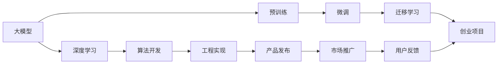

                 

# AI 大模型创业：如何利用人才优势？

## 1. 背景介绍

### 1.1 问题由来
随着人工智能(AI)技术的迅速发展，大模型在自然语言处理(NLP)、计算机视觉(CV)、生成对抗网络(GAN)等诸多领域取得了突破性进展。大模型能够处理海量数据，提取高级特征，表现出强大的泛化能力，受到广泛的关注。然而，大模型的开发和应用仍然面临许多挑战，尤其是创业阶段的人才需求和利用问题。如何高效地利用人才优势，推动大模型创业项目的成功，成为AI领域一个重要话题。

### 1.2 问题核心关键点
本文将从核心概念、算法原理、操作步骤、数学模型、实际应用、工具资源等方面，探讨如何通过高效利用人才优势，推动大模型创业项目的成功。

## 2. 核心概念与联系

### 2.1 核心概念概述

- **大模型(Large Model)**：指在特定领域（如NLP、CV）经过预训练的深度学习模型，如BERT、GPT-3、ResNet等。这些模型通常在大量数据上进行训练，具备处理大规模数据的能力，并能够提取复杂的特征。
- **预训练(Pre-training)**：指在大规模无标签数据上，使用自监督学习方法训练模型，使其学习到通用的特征表示。
- **微调(Fine-tuning)**：指在预训练模型的基础上，使用下游任务的标注数据，通过有监督学习优化模型，使其适应特定任务。
- **迁移学习(Transfer Learning)**：指将在大规模数据上学习到的知识，迁移到小规模数据集上进行任务适配，以提高模型性能。
- **深度学习(Deep Learning)**：一种通过神经网络进行复杂数据建模的机器学习方法，具备学习层次化抽象的能力。
- **创业项目(Creational Projects)**：指由AI专家、工程师和创业者合作，旨在开发和商业化AI技术的企业活动。

### 2.2 核心概念原理和架构的 Mermaid 流程图



这个流程图展示了从大模型开发到创业项目实施的全过程，包括预训练、微调、迁移学习、算法开发、工程实现、产品发布、市场推广和用户反馈等关键环节。

## 3. 核心算法原理 & 具体操作步骤

### 3.1 算法原理概述

大模型创业的核心算法包括预训练、微调、迁移学习等。其基本原理是通过大规模数据预训练模型，然后利用下游任务的标注数据进行微调，以适应特定任务的需求。迁移学习则是在特定领域应用中，将在大规模数据上学习到的知识迁移到新任务上，以提高模型性能。

### 3.2 算法步骤详解

#### 步骤1：数据收集和预处理
- 收集大量未标注数据，用于模型预训练。
- 对数据进行预处理，如去除噪声、标准化、分词、标签等。

#### 步骤2：模型构建和训练
- 选择合适的模型架构，如CNN、RNN、Transformer等。
- 在预训练数据上训练模型，通常使用自监督任务如语言建模、目标检测等。

#### 步骤3：任务适配和微调
- 针对具体任务，构建任务适配层，如分类层、回归层、生成层等。
- 使用下游任务的标注数据进行微调，优化模型参数。

#### 步骤4：模型部署和优化
- 将微调后的模型部署到服务器或云端，支持实时推理。
- 不断优化模型性能，如参数裁剪、量化加速、服务化封装等。

### 3.3 算法优缺点

#### 优点：
- 高效利用大模型的通用特征，快速适应新任务。
- 预训练和微调过程可以显著提高模型性能。
- 算法灵活，适用于多种任务和数据类型。

#### 缺点：
- 对数据依赖性强，数据质量直接影响模型效果。
- 模型复杂，训练和推理成本高。
- 算法过程复杂，需要跨学科知识。

### 3.4 算法应用领域

大模型创业技术广泛应用于医疗、金融、教育、智能制造等多个领域，推动各行业数字化转型和智能化升级。例如：
- 医疗领域：利用大模型进行病历分析、医学影像诊断、药物研发等。
- 金融领域：使用大模型进行风险评估、交易策略优化、智能客服等。
- 教育领域：开发智能辅导系统、学习内容推荐、作业批改等。
- 智能制造：应用大模型进行质量检测、工艺优化、设备维护等。

## 4. 数学模型和公式 & 详细讲解 & 举例说明

### 4.1 数学模型构建

假设有一个NLP任务，使用BERT模型进行预训练和微调。设BERT模型包含$H$层，每层有$N$个神经元，输入为$x_i$，输出为$y_i$，训练数据集为$\{(x_i,y_i)\}_{i=1}^N$。

目标为最小化损失函数：

$$
\mathcal{L} = \frac{1}{N} \sum_{i=1}^N \ell(y_i,f(x_i))
$$

其中$\ell$为损失函数，$f$为模型预测函数。

### 4.2 公式推导过程

BERT模型的预训练和微调过程如下：

1. **预训练**：
   - 在无标签文本数据上训练BERT模型，使用自监督任务如掩码语言模型（Masked Language Model, MLM）、下一句预测（Next Sentence Prediction, NSP）等。
   - 预训练公式为：
     $$
     \min_{\theta} \sum_{i=1}^{N_{train}} \ell_{MLM}(y_{mask},x_{mask};\theta)
     \quad \text{and} \quad \min_{\theta} \sum_{i=1}^{N_{train}} \ell_{NSP}(y_{i},y_{i+1};\theta)
     $$
     其中$y_{mask}$为掩码预测结果，$\ell_{MLM}$为掩码语言模型损失，$\ell_{NSP}$为下一句预测损失。

2. **微调**：
   - 使用标注数据集进行微调，优化模型参数。
   - 微调公式为：
     $$
     \min_{\theta} \sum_{i=1}^{N_{train}} \ell(y_i,f(x_i);\theta)
     \quad \text{and} \quad \min_{\theta} \sum_{i=1}^{N_{dev}} \ell(y_i,f(x_i);\theta)
     \quad \text{and} \quad \min_{\theta} \sum_{i=1}^{N_{test}} \ell(y_i,f(x_i);\theta)
     $$
     其中$\ell$为下游任务损失，$N_{train}$、$N_{dev}$、$N_{test}$分别为训练集、验证集、测试集大小。

### 4.3 案例分析与讲解

以情感分析任务为例，使用BERT模型进行微调。具体步骤如下：

1. **数据准备**：收集标注数据集，如IMDB电影评论数据集，分为训练集、验证集和测试集。
2. **模型构建**：使用BERT模型，加入任务适配层（如全连接层），输出情感分类结果。
3. **微调训练**：在训练集上训练模型，验证集上调优超参数，测试集上评估模型性能。
4. **模型优化**：在测试集上进行调整，如裁剪参数、优化推理速度。

## 5. 项目实践：代码实例和详细解释说明

### 5.1 开发环境搭建

1. 安装Python、PyTorch、TensorFlow等深度学习框架。
2. 安装相关的NLP库，如NLTK、spaCy等。
3. 设置虚拟环境，安装BERT模型库。

### 5.2 源代码详细实现

以下是一个使用BERT进行情感分析的示例代码：

```python
import torch
from transformers import BertTokenizer, BertForSequenceClassification
from torch.utils.data import DataLoader

# 加载BERT预训练模型和分词器
tokenizer = BertTokenizer.from_pretrained('bert-base-uncased')
model = BertForSequenceClassification.from_pretrained('bert-base-uncased', num_labels=2)

# 数据预处理
def preprocess(text):
    tokens = tokenizer.tokenize(text)
    input_ids = tokenizer.convert_tokens_to_ids(tokens)
    return input_ids

# 训练和评估
def train_epoch(model, data_loader):
    model.train()
    losses = []
    for batch in data_loader:
        input_ids = torch.tensor(batch['input_ids'])
        labels = torch.tensor(batch['labels'])
        outputs = model(input_ids, labels=labels)
        loss = outputs.loss
        losses.append(loss.item())
        loss.backward()
        optimizer.step()
    return sum(losses) / len(data_loader)

def evaluate(model, data_loader):
    model.eval()
    correct = 0
    total = 0
    with torch.no_grad():
        for batch in data_loader:
            input_ids = torch.tensor(batch['input_ids'])
            labels = torch.tensor(batch['labels'])
            outputs = model(input_ids)
            _, predicted = torch.max(outputs, dim=1)
            total += labels.size(0)
            correct += (predicted == labels).sum().item()
    accuracy = correct / total * 100
    return accuracy

# 训练和评估
optimizer = torch.optim.Adam(model.parameters(), lr=1e-5)
data_loader = DataLoader(train_dataset, batch_size=16)
for epoch in range(10):
    loss = train_epoch(model, data_loader)
    accuracy = evaluate(model, test_loader)
    print(f'Epoch {epoch+1}, train loss: {loss:.3f}, test accuracy: {accuracy:.2f}')
```

### 5.3 代码解读与分析

1. **数据预处理**：使用BERT分词器将文本转换为token ids，方便模型处理。
2. **模型构建**：使用BERT模型，并加入任务适配层（全连接层）。
3. **训练和评估**：在训练集上训练模型，使用验证集调优超参数，并在测试集上评估模型性能。
4. **优化模型**：裁剪模型参数，优化推理速度，部署到生产环境。

## 6. 实际应用场景

### 6.4 未来应用展望

#### 6.4.1 医疗领域

大模型在医疗领域可以应用于病历分析、医学影像诊断、药物研发等。通过微调和迁移学习，可以提高模型对医疗数据的理解和分析能力，为医生提供决策支持。

#### 6.4.2 金融领域

在金融领域，大模型可以用于风险评估、交易策略优化、智能客服等。通过微调和迁移学习，可以实现对金融数据的深度分析，提高决策效率和准确性。

#### 6.4.3 教育领域

在教育领域，大模型可以开发智能辅导系统、学习内容推荐、作业批改等应用。通过微调和迁移学习，可以提升教育资源的利用效率，提供个性化学习服务。

#### 6.4.4 智能制造

在智能制造领域，大模型可以应用于质量检测、工艺优化、设备维护等。通过微调和迁移学习，可以提高生产效率和产品质量，推动制造业智能化升级。

## 7. 工具和资源推荐

### 7.1 学习资源推荐

1. **《深度学习》课程**：斯坦福大学深度学习课程，涵盖深度学习基础知识和常用算法。
2. **《自然语言处理》课程**：CMU自然语言处理课程，介绍NLP的基本概念和常用技术。
3. **《TensorFlow》官方文档**：详细介绍了TensorFlow的API和最佳实践。
4. **GitHub大模型开源项目**：GitHub上众多大模型的开源实现，可以用于学习和实践。

### 7.2 开发工具推荐

1. **PyTorch**：深度学习领域广泛使用的框架，支持动态计算图和GPU加速。
2. **TensorFlow**：Google开发的深度学习框架，支持静态计算图和分布式训练。
3. **Jupyter Notebook**：交互式编程环境，方便开发和实验。
4. **Hugging Face Transformers库**：提供众多预训练模型，支持微调和迁移学习。

### 7.3 相关论文推荐

1. **《Attention is All You Need》**：提出Transformer结构，开创了预训练大模型的时代。
2. **《BERT: Pre-training of Deep Bidirectional Transformers for Language Understanding》**：提出BERT模型，在大规模语料上进行预训练，用于多任务学习。
3. **《Parameter-Efficient Transfer Learning for NLP》**：提出Adapter等参数高效微调方法，适用于大模型微调。
4. **《GPT-3: Language Models are Unsupervised Multitask Learners》**：展示GPT-3的强大零样本学习能力和多任务学习效果。
5. **《Imagenet Classifier in Ten Lines of Code》**：展示使用小样本数据训练大规模模型的方法。

## 8. 总结：未来发展趋势与挑战

### 8.1 研究成果总结

大模型创业项目取得了显著成效，尤其是在医疗、金融、教育、智能制造等领域。通过预训练和微调，模型可以高效利用数据，提升性能，实现应用落地。

### 8.2 未来发展趋势

1. **算法升级**：未来的算法将更加高效，利用大模型和迁移学习，提高模型性能。
2. **模型融合**：将不同模型的优势结合起来，如大模型与小模型、参数高效微调与传统微调等，提升系统效果。
3. **数据增强**：利用数据增强技术，扩充训练数据，提高模型泛化能力。
4. **自动化部署**：实现模型的自动化部署和优化，减少人力成本，提高应用效率。
5. **跨领域应用**：推动大模型在更多领域的应用，实现智能升级。

### 8.3 面临的挑战

1. **数据瓶颈**：数据质量差或数据量不足，影响模型性能。
2. **计算成本高**：大规模模型的训练和推理成本较高，需要更多资源支持。
3. **算法复杂**：算法实现复杂，需要跨学科知识。
4. **应用落地难**：模型优化和应用部署困难，用户体验不佳。

### 8.4 研究展望

1. **数据预处理**：提升数据质量，减少噪声，提高模型性能。
2. **模型压缩**：减少模型参数，提升推理速度，降低计算成本。
3. **跨学科融合**：结合不同学科的知识，提升模型的综合能力。
4. **自动化优化**：实现模型的自动化优化和部署，降低人力成本。

## 9. 附录：常见问题与解答

**Q1: 如何选择合适的预训练模型？**

A: 选择预训练模型时，要考虑任务的复杂性和数据规模。对于小规模数据，可以选择参数较少的模型；对于大规模数据，可以选择参数较多的模型。

**Q2: 数据预处理的方法有哪些？**

A: 常用的数据预处理方法包括分词、去噪、标准化等。根据具体任务，选择合适的预处理方法，提升模型效果。

**Q3: 如何处理不平衡数据集？**

A: 对于不平衡数据集，可以使用过采样或欠采样方法，或引入重采样技术，提升模型性能。

**Q4: 模型评估的指标有哪些？**

A: 常用的模型评估指标包括准确率、召回率、F1值等。根据具体任务，选择合适的评估指标，评估模型效果。

**Q5: 如何优化模型训练过程？**

A: 优化模型训练过程的方法包括学习率调参、正则化、Dropout等。根据具体任务，选择合适的优化方法，提升模型性能。

---

作者：禅与计算机程序设计艺术 / Zen and the Art of Computer Programming

