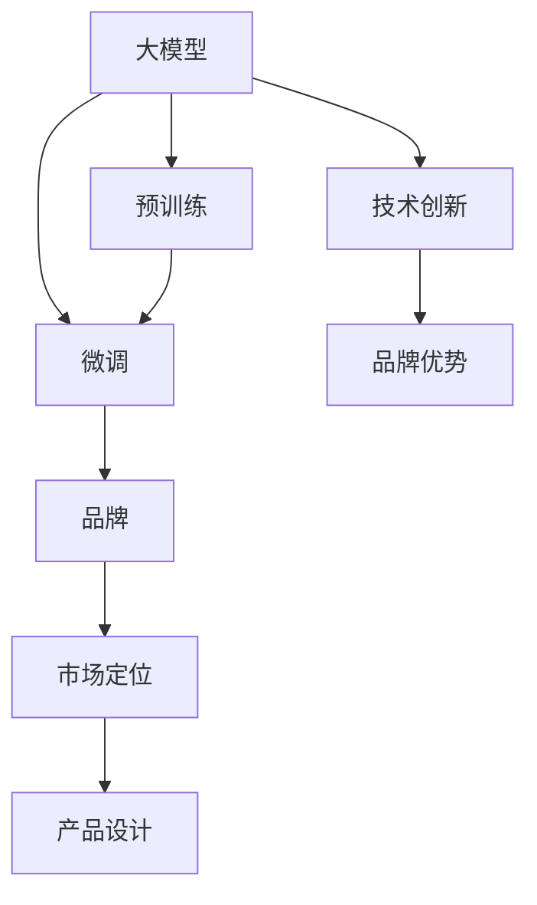

                 

# AI 大模型创业：如何利用品牌优势？

在当今人工智能(AI)领域，大模型(如BERT, GPT)已经成为技术应用的趋势。随着各大公司纷纷推出自家的AI大模型，创业公司如何突围？利用品牌优势无疑是其中一条重要路径。本文将从品牌建设、市场定位、产品设计等多个角度，探讨如何通过品牌建设，实现AI大模型的市场成功。

## 1. 背景介绍

近年来，AI大模型以其卓越的性能和广泛的应用场景，吸引了各行业投资者的广泛关注。如Google的BERT, OpenAI的GPT-3等模型已经证明了大模型的应用潜力。这不仅对学术界产生了深远影响，也引发了产业界的激烈竞争。众多AI创业公司也纷纷涌入大模型领域，希望通过技术创新和品牌建设，在激烈的竞争中脱颖而出。

### 1.1 研究现状

AI大模型的发展经历了预训练-微调(Pre-training-Fine-tuning)两个阶段。预训练是指在大规模无标签数据上，通过自监督学习，使得模型能够捕捉语言的广泛特征。微调则是指在预训练基础上，通过监督学习优化模型，适应特定的下游任务。这一过程不仅提升了模型的性能，也为创业公司提供了新的技术壁垒。

在技术上，各大公司普遍采用Transformer架构，并在大规模语料库上进行预训练，如GPT-3就使用了数万亿字级别的文本数据。然而，预训练阶段的高昂成本，使得大模型更多集中在拥有雄厚资本的巨头手中。对于创业公司，如何在技术上突破巨头封锁，同时利用品牌优势，实现市场突围，成为值得深入探讨的问题。

## 2. 核心概念与联系

### 2.1 核心概念概述

- **大模型(Large Language Models, LLMs)**: 以Transformer架构为代表的大规模预训练语言模型，如BERT, GPT。通过在大量无标签文本数据上预训练，学习到丰富的语言表示。
- **预训练(Pre-training)**: 在无标签数据上进行自监督学习，学习通用的语言表示。
- **微调(Fine-tuning)**: 在预训练模型的基础上，使用下游任务的少量标注数据，通过有监督学习优化模型在特定任务上的性能。
- **品牌(Brand)**: 公司通过一系列市场行为，建立并提升自身在公众心中的形象和认知。
- **品牌战略(Brand Strategy)**: 通过差异化、定位等策略，形成独特的品牌优势，从而获取竞争优势。

这些概念之间的逻辑关系可以通过以下Mermaid流程图来展示：



这个流程图展示了大模型与品牌建设的整体流程：预训练-微调得到的大模型，通过品牌建设策略，在市场中寻求独特的定位和产品设计，最终实现品牌优势。

## 3. 核心算法原理 & 具体操作步骤

### 3.1 算法原理概述

利用品牌优势的核心在于，通过品牌建设与技术研发的双轮驱动，形成独特的市场定位。在技术上，大模型微调是提升性能的关键；在品牌上，通过市场定位和差异化策略，构建独特的品牌形象。

### 3.2 算法步骤详解

#### 3.2.1 品牌建设

品牌建设是一个持续的过程，需要从多个方面入手：
1. **市场调研**：了解目标市场的需求和竞争状况，寻找独特的市场切入点。
2. **品牌定位**：明确公司的品牌形象和核心价值，形成独特的品牌标识。
3. **品牌传播**：通过各种渠道（如社交媒体、博客、会议等）传播品牌理念，提升品牌知名度。
4. **品牌管理**：维护品牌形象，确保市场反馈及时处理。

#### 3.2.2 技术创新

技术创新是品牌建设的基石，主要体现在以下几个方面：
1. **预训练模型选择**：选择适合自己业务场景的预训练模型，或在此基础上进行微调。
2. **微调策略**：设计合适的微调目标函数，选择适当的损失函数和优化器。
3. **参数高效微调**：避免全参数微调，减少计算资源消耗，提高微调效率。
4. **任务适配层设计**：根据具体任务，设计合适的输出层和损失函数，优化模型性能。

#### 3.2.3 市场定位

市场定位是品牌建设的核心，通过以下步骤实现：
1. **细分市场**：确定目标市场中的细分领域，如金融、医疗、教育等。
2. **差异化策略**：与传统解决方案相比，展示自己技术的独特之处，如更好的效果、更低的成本等。
3. **竞争分析**：分析竞争对手的优势和不足，寻找市场机会。

#### 3.2.4 产品设计

产品设计是品牌实现的关键环节，包括：
1. **界面设计**：设计友好的用户界面，提升用户体验。
2. **功能设计**：根据市场调研结果，设计满足用户需求的功能。
3. **用户体验**：从用户角度出发，优化交互流程，提升用户满意度。

### 3.3 算法优缺点

#### 3.3.1 优点

1. **市场突围**：通过品牌建设，可以有效地突围巨头企业的市场垄断，打开新的市场空间。
2. **用户粘性**：独特的品牌优势可以提升用户粘性，增强用户忠诚度。
3. **差异化竞争**：品牌优势使得创业公司可以在市场中形成差异化竞争，吸引更多用户关注。

#### 3.3.2 缺点

1. **品牌建设周期长**：品牌建设需要时间，短期内难以见效。
2. **技术创新难度大**：在大模型微调中，技术壁垒高，创业公司技术积累不足。
3. **市场风险高**：品牌策略失误，可能导致市场推广效果不佳。

### 3.4 算法应用领域

品牌战略在大模型创业中的应用领域十分广泛：
1. **金融科技(Fintech)**: 利用大模型进行金融舆情监测、风险预测等。
2. **医疗健康**: 使用大模型进行病历分析、医疗问答等。
3. **教育**: 开发智能辅导系统，提升教育资源配置效率。
4. **智能客服**: 构建智能客服系统，提升客户服务质量。
5. **广告营销**: 利用大模型进行文本生成，提升广告文案的创新性和吸引力。

## 4. 数学模型和公式 & 详细讲解 & 举例说明

### 4.1 数学模型构建

大模型的预训练过程可以通过以下公式表示：
$$
M_{\theta} = \text{Transformer}(\text{Encoder}(\text{Pre-training Input}), \text{Encoder}) 
$$

其中，$M_{\theta}$ 表示模型，$\theta$ 表示模型参数。预训练过程的输入为大规模无标签文本数据。

### 4.2 公式推导过程

预训练过程通过自监督学习任务（如语言建模、掩码语言模型）进行，其目标函数为：
$$
\mathcal{L}_{\text{pre-training}} = \frac{1}{N} \sum_{i=1}^N \ell_i(M_{\theta}(x_i))
$$

其中，$N$ 表示训练样本数量，$\ell_i$ 表示对样本 $i$ 的损失函数。常见的预训练任务包括掩码语言模型、掩码实体识别等。

### 4.3 案例分析与讲解

以GPT-3为例，其在预训练阶段使用了约1万亿字级别的数据，通过掩码语言模型进行自监督学习。微调过程则通过在特定任务上训练模型，如文本分类、命名实体识别等，以适应具体需求。

## 5. 项目实践：代码实例和详细解释说明

### 5.1 开发环境搭建

以TensorFlow为例，开发环境搭建步骤如下：
1. 安装TensorFlow：`pip install tensorflow`
2. 安装相关依赖：`pip install torch sklearn`
3. 安装Pandas：`pip install pandas`
4. 安装Jupyter Notebook：`pip install jupyter`
5. 安装NVIDIA GPU（如果使用GPU）：确保CUDA和cuDNN安装正确。

### 5.2 源代码详细实现

以下是一个简单的微调代码示例，展示了如何基于大模型进行命名实体识别任务微调：

```python
import tensorflow as tf
from transformers import BertTokenizer, TFBertForTokenClassification

# 初始化预训练模型和分词器
model = TFBertForTokenClassification.from_pretrained('bert-base-cased')
tokenizer = BertTokenizer.from_pretrained('bert-base-cased')

# 加载训练数据
train_dataset = ...
val_dataset = ...

# 定义模型和优化器
model.compile(loss='binary_crossentropy', optimizer='adam', metrics=['accuracy'])

# 训练模型
model.fit(train_dataset, epochs=5, validation_data=val_dataset)

# 评估模型
model.evaluate(val_dataset)
```

### 5.3 代码解读与分析

代码中，我们首先加载了预训练的BERT模型和分词器。然后，定义了模型结构，选择了合适的损失函数和优化器。接着，将训练数据集和验证数据集加载到模型中，开始训练模型。最后，使用验证集评估模型效果。

## 6. 实际应用场景

### 6.4 未来应用展望

未来，大模型在品牌建设和技术创新方面的发展将更加多样：
1. **跨领域应用**：大模型将被应用于更多垂直领域，如医疗、金融、教育等。
2. **多模态融合**：融合视觉、音频等多模态数据，提升模型对现实世界的理解和建模能力。
3. **可解释性增强**：通过符号化的先验知识，增强模型的可解释性。
4. **安全性保障**：构建安全的模型训练和应用流程，保障用户数据和模型安全。
5. **隐私保护**：采用差分隐私等技术，保护用户隐私。

## 7. 工具和资源推荐

### 7.1 学习资源推荐

- **《Transformer从原理到实践》系列博文**：介绍Transformer原理、BERT模型、微调技术等。
- **CS224N《深度学习自然语言处理》课程**：斯坦福大学课程，包含Lecture视频和配套作业。
- **《Natural Language Processing with Transformers》书籍**：介绍如何使用Transformers库进行NLP任务开发。
- **HuggingFace官方文档**：提供海量预训练模型和微调样例。
- **CLUE开源项目**：涵盖大量NLP数据集，提供基于微调的baseline模型。

### 7.2 开发工具推荐

- **PyTorch**：灵活的深度学习框架，支持多种预训练模型。
- **TensorFlow**：生产部署方便的深度学习框架，适合大规模工程应用。
- **Weights & Biases**：模型训练实验跟踪工具。
- **TensorBoard**：模型训练可视化工具。
- **Google Colab**：在线Jupyter Notebook环境，方便快速上手实验。

### 7.3 相关论文推荐

- **Attention is All You Need**：Transformer原论文。
- **BERT: Pre-training of Deep Bidirectional Transformers for Language Understanding**：BERT模型论文。
- **Parameter-Efficient Transfer Learning for NLP**：参数高效微调方法。
- **Prefix-Tuning: Optimizing Continuous Prompts for Generation**：提示学习(Prompt-based Learning)范式。
- **AdaLoRA: Adaptive Low-Rank Adaptation for Parameter-Efficient Fine-Tuning**：自适应低秩适应的微调方法。

## 8. 总结：未来发展趋势与挑战

### 8.1 研究成果总结

品牌建设和技术创新是创业公司在大模型应用中的两条重要路径。品牌建设能够帮助创业公司突围巨头垄断，打开市场空间。技术创新则通过提升模型性能，赢得更多用户关注。两者协同推进，助力创业公司在激烈竞争中取得成功。

### 8.2 未来发展趋势

未来大模型将向多模态、跨领域、可解释性等方向发展。同时，随着预训练模型的普及，新的技术范式将不断涌现，如自监督学习、无监督学习等。

### 8.3 面临的挑战

大模型品牌建设和技术创新面临诸多挑战：
1. 品牌建设周期长，短期内难以见效。
2. 技术壁垒高，创业公司技术积累不足。
3. 市场风险高，品牌策略失误可能导致市场推广效果不佳。

### 8.4 研究展望

未来研究应关注以下几个方面：
1. 如何在大规模无标签数据上进行有效预训练。
2. 如何提升大模型在特定任务上的泛化性能。
3. 如何利用多模态数据提升大模型的应用范围和效果。
4. 如何增强大模型的可解释性和安全性。

## 9. 附录：常见问题与解答

### 9.1 常见问题解答

**Q1: 如何评估模型的泛化性能？**

A: 泛化性能可以通过在独立验证集或测试集上进行模型评估，并计算模型的准确率、召回率等指标。

**Q2: 如何优化模型的训练效率？**

A: 优化训练效率可以通过以下方法：
1. 数据增强：使用数据增强技术，扩充训练数据。
2. 正则化：采用L2正则化、Dropout等技术，避免过拟合。
3. 学习率调度：使用学习率调度技术，如Warmup、Cyclical Learning Rate等。

**Q3: 如何处理数据不平衡问题？**

A: 数据不平衡问题可以通过以下方法解决：
1. 重采样：对少数类数据进行过采样，对多数类数据进行欠采样。
2. 类别权重：对少数类样本赋予更高的权重，提升模型对少数类的预测效果。

**Q4: 如何在特定任务上进行微调？**

A: 特定任务的微调可以通过以下步骤进行：
1. 选择合适的预训练模型。
2. 设计合适的任务适配层。
3. 选择合适的损失函数和优化器。
4. 在标注数据上进行微调训练。

**Q5: 如何保护用户隐私？**

A: 保护用户隐私可以通过以下方法：
1. 差分隐私：在训练和推理过程中，引入差分隐私技术，保护用户数据隐私。
2. 匿名化处理：对用户数据进行匿名化处理，防止数据泄露。

**Q6: 如何优化模型推理速度？**

A: 优化模型推理速度可以通过以下方法：
1. 模型压缩：通过剪枝、量化等技术，减小模型尺寸。
2. 硬件优化：使用GPU、TPU等高性能设备，提高计算速度。

**Q7: 如何增强模型的可解释性？**

A: 增强模型可解释性可以通过以下方法：
1. 符号化先验知识：引入符号化先验知识，指导模型学习。
2. 因果分析：通过因果分析技术，增强模型的可解释性。

---

作者：禅与计算机程序设计艺术 / Zen and the Art of Computer Programming

