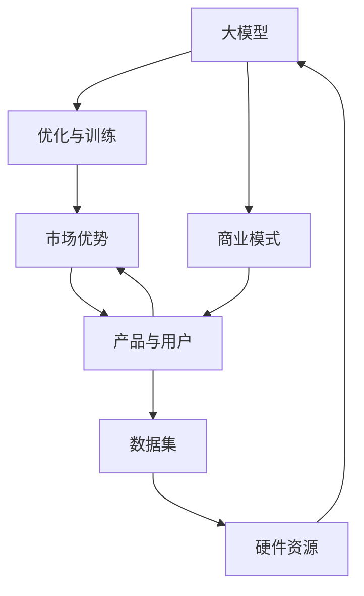

                 

# AI 大模型创业：如何利用市场优势？

> 关键词：
- AI大模型
- 创业
- 市场优势
- 数据集
- 硬件资源
- 应用场景
- 商业模式
- 用户需求
- 技术壁垒
- 可持续发展

## 1. 背景介绍

随着人工智能技术的飞速发展，大模型（Large Models）在商业领域的潜力日益显现，尤其在AI大模型创业领域。近年来，出现了许多基于大模型技术的初创公司，比如GPT-3的开发者OpenAI、深度学习初创公司如HuggingFace等。这些公司主要专注于大模型的开发和应用，如自然语言处理、图像识别、语音识别等。这些公司在各自领域获得了显著的技术突破，吸引了广泛的市场关注。

然而，AI大模型创业虽然技术门槛较高，但同时也面临着重重挑战，如数据集的获取、硬件资源的投入、应用场景的拓展等。因此，本文将围绕AI大模型创业的要素及如何利用市场优势展开探讨。

## 2. 核心概念与联系

### 2.1 核心概念概述

AI大模型创业指的是以大模型为基础的创业模式，即通过开发、优化、训练和应用大模型，创建具有商业价值的人工智能应用。这一模式通常需要依赖大量数据、高性能计算资源、算法优化和工程技术。

大模型（Large Model）指包含大量参数的深度学习模型，可以用于自然语言处理、计算机视觉、语音识别等多个领域。大模型能够学习并应用海量的数据，从而进行复杂的模式识别和预测任务。

市场优势（Market Advantage）则指的是在创业过程中，通过优质的产品、技术领先、用户体验等因素，在竞争激烈的市场中脱颖而出，赢得用户和投资者的青睐。

### 2.2 核心概念联系

大模型是AI大模型创业的基石，提供技术支持。通过不断优化大模型，创业公司能够开发出具有竞争力的产品，而市场优势则是创业公司能否成功的重要保障。两者相辅相成，共同推动AI大模型创业的成功。

以下是一个Mermaid流程图，展示了AI大模型创业中各个核心概念之间的关系：



## 3. 核心算法原理 & 具体操作步骤

### 3.1 算法原理概述

AI大模型创业的算法原理主要是基于深度学习模型，特别是Transformer架构。大模型通过对大量数据的学习，能够获得丰富而有效的特征表示，从而在各个领域展现强大的表现力。

Transformer架构由谷歌在2017年提出，是一种基于注意力机制的神经网络模型，能够高效地处理长序列数据。大模型在预训练阶段，通常会在大规模语料库上进行无监督学习，如GPT-3、BERT等。通过这些预训练模型，大模型能够学习到语言、图像、声音等数据的泛化能力。

### 3.2 算法步骤详解

AI大模型创业的算法步骤一般包括以下几个方面：

1. **数据集准备**：收集并预处理数据集，确保数据集的质量和多样性。数据集的质量对于模型的训练至关重要。
2. **模型选择与初始化**：选择适合的大模型架构（如Transformer、BERT），并进行模型初始化。
3. **预训练**：在大规模数据集上进行预训练，通常采用无监督学习的方式。
4. **微调**：在特定任务上进行微调，如分类、翻译、问答等。
5. **模型部署**：将微调后的模型部署到实际应用场景中，进行推理和预测。
6. **持续优化**：根据反馈信息不断优化模型，提升性能。

### 3.3 算法优缺点

AI大模型创业的算法具有以下优点：

1. **强大的泛化能力**：大模型通过对大规模数据的学习，能够获得丰富的特征表示，从而提升模型的泛化能力。
2. **高效的处理能力**：大模型能够处理大规模的数据集，尤其是自然语言处理领域。
3. **灵活的应用场景**：大模型可以在多个领域进行应用，如自然语言处理、计算机视觉、语音识别等。

同时，大模型算法也存在以下缺点：

1. **高昂的计算成本**：训练和微调大模型需要大量的计算资源和存储资源。
2. **依赖大规模数据**：大模型的性能高度依赖于数据的质量和数量。
3. **难以解释**：大模型通常是"黑盒"模型，难以解释其内部工作机制。

### 3.4 算法应用领域

AI大模型创业可以应用于多个领域，包括但不限于：

- **自然语言处理**：如问答系统、文本生成、情感分析、机器翻译等。
- **计算机视觉**：如图像分类、目标检测、图像生成、视频分析等。
- **语音识别**：如语音转文本、语音生成、语音命令等。
- **智能推荐系统**：如个性化推荐、商品推荐、用户行为预测等。

## 4. 数学模型和公式 & 详细讲解 & 举例说明

### 4.1 数学模型构建

AI大模型创业通常采用基于Transformer的架构，其核心公式为：

$$
\mathbf{X}_{t+1} = \mathbf{X}_t + \alpha \mathbf{X}_t \mathbf{Q}^T (\mathbf{K} \mathbf{V}^{-1} \mathbf{Q}) \mathbf{X}_t + \mathbf{b}
$$

其中，$\mathbf{X}_t$ 表示输入序列，$\alpha$ 为学习率，$\mathbf{Q}$、$\mathbf{K}$、$\mathbf{V}$ 分别为查询矩阵、键矩阵和值矩阵，$\mathbf{b}$ 为偏置项。

### 4.2 公式推导过程

以上公式展示了Transformer模型中自注意力机制的工作原理。通过计算自注意力矩阵，模型能够根据输入序列的不同部分，动态调整权重，从而提高模型的表达能力和泛化能力。

### 4.3 案例分析与讲解

在自然语言处理领域，一个典型的应用是机器翻译。通过预训练模型BERT，可以对大量双语语料进行训练，学习到语言之间的转换关系。在微调阶段，可以针对特定的语言对进行微调，提高模型的翻译质量。例如，GPT-3在大规模双语数据集上进行预训练，然后针对特定语言对进行微调，可以取得显著的翻译效果提升。

## 5. 项目实践：代码实例和详细解释说明

### 5.1 开发环境搭建

AI大模型创业的开发环境搭建主要依赖于以下工具和平台：

1. **Python编程语言**：用于模型开发和训练。
2. **TensorFlow或PyTorch框架**：提供高效的深度学习模型构建和训练功能。
3. **Google Colab或Jupyter Notebook**：在线开发和测试平台。
4. **GPU或TPU**：高性能计算资源，加速模型训练。

### 5.2 源代码详细实现

以机器翻译为例，可以采用以下Python代码进行模型实现：

```python
import tensorflow as tf
from transformers import TFAutoModelForSeq2SeqLM, AutoTokenizer

# 加载预训练模型和 tokenizer
model_name = 't5-small'
model = TFAutoModelForSeq2SeqLM.from_pretrained(model_name)
tokenizer = AutoTokenizer.from_pretrained(model_name)

# 构建翻译模型
class Seq2Seq(tf.keras.Model):
    def __init__(self, encoder, decoder):
        super(Seq2Seq, self).__init__()
        self.encoder = encoder
        self.decoder = decoder

    def call(self, inputs, targets):
        features = self.encoder(inputs)
        outputs = self.decoder(features, targets)
        return outputs

# 构建编码器和解码器
encoder = model.get_input_embeddings()
decoder = model.get_output_embeddings()

# 构建翻译模型
seq2seq = Seq2Seq(encoder, decoder)

# 训练模型
optimizer = tf.keras.optimizers.Adam(learning_rate=5e-5)
loss = tf.keras.losses.SparseCategoricalCrossentropy(from_logits=True)
seq2seq.compile(optimizer=optimizer, loss=loss)

# 训练数据集
train_dataset = ...
train_dataset = tf.data.Dataset.from_tensor_slices((inputs, targets))
train_dataset = train_dataset.shuffle(buffer_size=1024).batch(batch_size=32)

# 训练模型
seq2seq.fit(train_dataset, epochs=num_epochs, validation_data=val_dataset)
```

### 5.3 代码解读与分析

以上代码展示了使用TensorFlow和HuggingFace的TFAutoModelForSeq2SeqLM模型进行机器翻译的实现。首先加载预训练模型和 tokenizer，然后构建编码器和解码器，最后训练翻译模型。

代码中使用了Adam优化器和交叉熵损失函数，通过在线性层和softmax层进行预测，并使用SparseCategoricalCrossentropy损失函数计算预测值与真实标签之间的差异。

### 5.4 运行结果展示

训练完成后，模型可以在特定任务上进行推理和预测。以下是一个机器翻译的例子：

```python
# 推理数据集
test_dataset = ...
test_dataset = tf.data.Dataset.from_tensor_slices((test_input, test_target))

# 预测
results = seq2seq.predict(test_dataset)
```

## 6. 实际应用场景

### 6.1 智能客服

智能客服是AI大模型创业的一个典型应用场景。通过大模型微调，智能客服系统能够自动处理大量客户咨询，提升客服效率和质量。智能客服系统通过预训练模型BERT进行初始化，然后针对特定行业和常见问题进行微调，可以自动理解客户的问题并提供答案。例如，电商客服可以通过对客户历史订单和对话进行训练，提高推荐的准确性和及时性。

### 6.2 医疗诊断

AI大模型创业在医疗诊断领域也有广泛应用。通过预训练模型对海量的医疗数据进行学习，大模型可以辅助医生进行疾病诊断和治疗方案的推荐。例如，医疗问答系统可以通过对大量病历和诊断数据进行微调，回答病人的常见问题。同时，大模型还可以对病人的症状和病历进行分析，提供可能的疾病诊断和治疗建议。

### 6.3 金融风险管理

AI大模型创业在金融风险管理领域也有显著的潜力和应用价值。通过预训练模型对金融市场数据进行学习，大模型可以预测股票市场的波动和金融风险，帮助投资者做出更明智的投资决策。例如，智能投顾系统可以通过对历史交易数据和市场信息进行微调，提供个性化的投资建议。

### 6.4 未来应用展望

未来，AI大模型创业将继续拓展其在各个领域的应用。随着技术进步和市场需求的不断增长，AI大模型创业将迎来更多的商业机会和挑战。未来展望包括以下几个方向：

1. **跨领域应用**：大模型可以在多个领域进行应用，如医疗、金融、教育、制造业等，推动各行业的数字化转型。
2. **人机协同**：大模型与人类专家协同工作，提升决策质量和效率。
3. **持续学习**：大模型能够不断学习新的数据和任务，保持其与时俱进的能力。
4. **隐私保护**：大模型在处理敏感数据时，需要遵循隐私保护原则，确保数据安全和用户隐私。
5. **标准化**：大模型和应用需要在标准化和互操作性方面取得进展，便于集成和扩展。

## 7. 工具和资源推荐

### 7.1 学习资源推荐

为了帮助开发者更好地理解和应用AI大模型创业，以下是一些推荐的学习资源：

1. **《深度学习》（Deep Learning）**：Ian Goodfellow等人所著，详细介绍了深度学习的基本概念和算法。
2. **《TensorFlow官方文档》**：TensorFlow的官方文档，提供了丰富的学习资料和实践指南。
3. **HuggingFace博客和教程**：HuggingFace提供的大量博客和教程，涵盖了从模型选择到微调的各种实用技巧。
4. **Coursera课程**：Coursera提供的深度学习相关课程，如深度学习专项课程、自然语言处理课程等。
5. **Kaggle竞赛**：Kaggle平台上的各类竞赛和项目，可以帮助开发者积累实践经验。

### 7.2 开发工具推荐

AI大模型创业的开发需要依赖以下工具和平台：

1. **TensorFlow**：提供高效的深度学习模型构建和训练功能。
2. **PyTorch**：提供灵活的深度学习模型构建和训练功能。
3. **Google Colab**：提供免费的GPU资源，方便开发者进行模型训练。
4. **Jupyter Notebook**：提供交互式编程环境，便于模型开发和调试。
5. **Amazon SageMaker**：提供云平台上的深度学习模型训练和部署服务。

### 7.3 相关论文推荐

为了深入理解AI大模型创业的理论基础和技术细节，以下是一些推荐的论文：

1. **Attention is All You Need**：谷歌提出的Transformer架构，奠定了大模型在自然语言处理领域的基础。
2. **BERT: Pre-training of Deep Bidirectional Transformers for Language Understanding**：Google提出的BERT模型，通过预训练大模型，显著提升了自然语言处理的性能。
3. **GPT-3: Language Models are Unsupervised Multitask Learners**：OpenAI提出的GPT-3模型，展示了大模型在自然语言处理领域的强大能力。
4. **Large-Scale Scalable Parallel Training for Deep Learning**：Facebook提出的模型并行技术，提供了高效训练大模型的方法。
5. **Adaptive Low-Rank Adaptation for Parameter-Efficient Fine-Tuning**：提出AdaLoRA方法，使得大模型可以在参数高效微调的前提下，保持较高的性能。

## 8. 总结：未来发展趋势与挑战

### 8.1 研究成果总结

AI大模型创业在技术、应用和市场方面取得了显著进展。通过不断优化大模型，开发出具有商业价值的人工智能应用。大模型在自然语言处理、计算机视觉、语音识别等领域表现出色，展示了强大的泛化能力和处理能力。

### 8.2 未来发展趋势

未来，AI大模型创业将继续沿着以下趋势发展：

1. **技术创新**：持续探索新的深度学习架构和技术，提升大模型的性能和效率。
2. **多模态融合**：将自然语言处理、计算机视觉和语音识别等多种模态进行融合，提升人工智能系统的感知和推理能力。
3. **跨领域应用**：拓展大模型在各个领域的应用，推动各行业的数字化转型。
4. **人机协同**：大模型与人类专家协同工作，提升决策质量和效率。
5. **标准化**：大模型和应用需要在标准化和互操作性方面取得进展，便于集成和扩展。

### 8.3 面临的挑战

AI大模型创业在快速发展的过程中，仍面临以下挑战：

1. **数据获取和处理**：大模型对数据的需求量巨大，数据获取和处理成本较高。
2. **计算资源**：大模型需要大量的计算资源进行训练和推理，高性能计算资源的成本较高。
3. **模型可解释性**：大模型通常是"黑盒"模型，难以解释其内部工作机制。
4. **用户隐私**：大模型在处理敏感数据时，需要遵循隐私保护原则，确保数据安全和用户隐私。
5. **市场竞争**：AI大模型创业竞争激烈，需要不断创新和优化，才能在市场中获得优势。

### 8.4 研究展望

未来，AI大模型创业需要在以下几个方面进行深入研究：

1. **数据增强和迁移学习**：探索更高效的数据增强和迁移学习方法，提高大模型的泛化能力和适应性。
2. **模型压缩和优化**：开发更高效的模型压缩和优化技术，降低大模型的计算和存储成本。
3. **人机交互设计**：设计更自然、更高效的交互界面，提升用户体验。
4. **隐私保护和公平性**：研究隐私保护和公平性技术，确保人工智能系统的透明性和公正性。
5. **跨领域知识整合**：研究跨领域知识整合技术，提升大模型的通用性和适应性。

## 9. 附录：常见问题与解答

### Q1: 什么是AI大模型？

A: AI大模型指的是包含大量参数的深度学习模型，可以用于自然语言处理、计算机视觉、语音识别等多个领域。大模型通过学习大量数据，能够获得丰富的特征表示，从而在各个领域展现强大的表现力。

### Q2: AI大模型创业的商业模式是什么？

A: AI大模型创业的商业模式主要包括以下几种：

1. **SaaS模式**：提供基于云的人工智能服务，按需付费。
2. **B2B模式**：直接面向企业用户，提供定制化的解决方案。
3. **B2C模式**：面向普通用户，提供智能助手、翻译、图像识别等服务。
4. **合作伙伴模式**：与各类企业、开发者合作，提供API接口和技术支持。

### Q3: 如何选择合适的AI大模型？

A: 选择合适的AI大模型需要考虑以下几个因素：

1. **领域适应性**：选择适合特定领域的大模型，确保模型能够更好地适应任务。
2. **性能指标**：评估模型的性能指标，如准确率、召回率、F1分数等，选择表现优异的大模型。
3. **计算资源**：考虑模型的计算资源需求，选择合适的硬件平台进行训练和推理。
4. **开源社区支持**：选择社区活跃、文档详尽的大模型，便于后续开发和维护。

### Q4: 大模型在处理大规模数据时面临哪些挑战？

A: 大模型在处理大规模数据时面临以下挑战：

1. **计算资源**：大规模数据需要大量的计算资源进行训练和推理，高性能计算资源的成本较高。
2. **存储资源**：大规模数据需要大量的存储空间，数据存储和读取的效率较低。
3. **数据质量**：数据质量对模型的性能和泛化能力有很大影响，需要高质量的数据进行训练。
4. **数据隐私**：处理敏感数据时需要遵循隐私保护原则，确保数据安全和用户隐私。

### Q5: 如何提高AI大模型的泛化能力？

A: 提高AI大模型的泛化能力可以从以下几个方面入手：

1. **数据增强**：通过数据增强技术，扩充训练集的多样性，提高模型的泛化能力。
2. **迁移学习**：通过迁移学习技术，在大规模数据上预训练模型，然后在特定任务上进行微调。
3. **正则化**：使用正则化技术，如L2正则、Dropout等，避免模型过拟合。
4. **多任务学习**：通过多任务学习技术，同时学习多个任务，提高模型的泛化能力。
5. **对抗训练**：使用对抗训练技术，提高模型的鲁棒性和泛化能力。

---

作者：禅与计算机程序设计艺术 / Zen and the Art of Computer Programming

