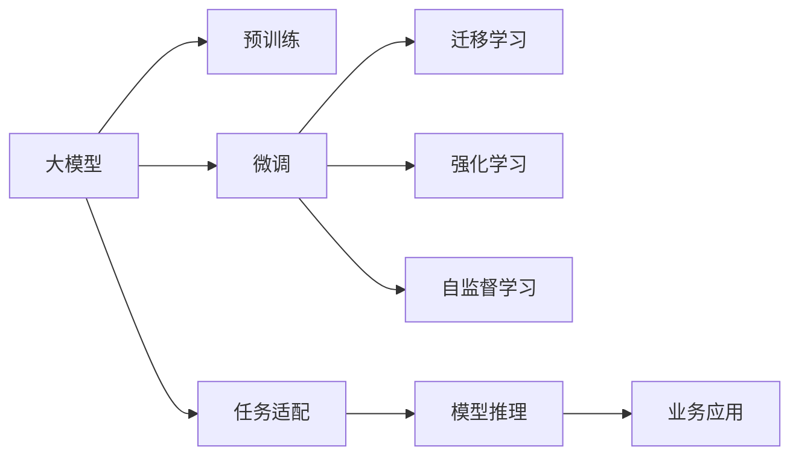

                 

# AI 大模型创业：如何利用未来优势？

> 关键词：人工智能创业、大模型、未来优势、创业策略、技术应用

## 1. 背景介绍

在人工智能(AI)领域，大模型已经成为了一个无法忽视的趋势。从GPT-3到GPT-4，再到未来的更多大模型，它们展现出了强大的能力，引起了业界的广泛关注。对于创业者来说，抓住大模型的未来优势，无疑是一次前所未有的机遇。

### 1.1 大模型的兴起

近年来，AI大模型开始逐渐进入公众视野，并逐步取代了传统机器学习模型，成为了新一代AI的象征。大模型之所以如此引人注目，主要是因为它们具备以下几个特点：

- **泛化能力强**：大模型在大规模数据上进行预训练，能够捕捉到更丰富的语义和模式，从而在各种不同的任务上表现出色。
- **高效性**：尽管参数规模较大，但大模型往往具有更高效的推理速度和更低的部署成本。
- **通用性**：大模型可以通过微调适应各种新的任务和领域，降低定制化开发的需求。
- **可扩展性**：大模型具有良好的可扩展性，通过增加计算资源可以进一步提升其性能。

### 1.2 大模型带来的机遇

对于创业者来说，大模型的兴起带来了巨大的机遇：

- **技术门槛降低**：大模型提供了预先训练好的特征表示，使得创业者可以快速部署和使用先进的AI技术。
- **应用场景丰富**：从NLP到图像处理，从语音识别到生成模型，大模型在各个领域都有应用的可能。
- **市场前景广阔**：随着AI技术的逐步落地，越来越多的行业开始引入AI解决方案，市场潜力巨大。

## 2. 核心概念与联系

### 2.1 核心概念概述

在进行AI大模型创业时，需要明确几个核心概念：

- **大模型**：指通过大规模数据预训练得到的、参数量较大的深度神经网络模型，如GPT、BERT等。
- **微调**：指在预训练模型基础上，针对特定任务进行有监督的优化，以提升模型在该任务上的性能。
- **迁移学习**：指将预训练模型在其他任务上的知识迁移到新任务上，从而加速模型训练和提高模型性能。
- **强化学习**：指通过与环境的互动，使模型不断优化自身策略，以达成特定目标。
- **自监督学习**：指利用无标签数据进行训练，通过自生成伪标签，让模型自我学习。

这些概念之间相互联系，共同构成了AI大模型创业的基础。

### 2.2 核心概念原理和架构的 Mermaid 流程图



该流程图展示了大模型从预训练到微调再到应用的全流程，以及各个阶段的主要操作和目标。

## 3. 核心算法原理 & 具体操作步骤

### 3.1 算法原理概述

AI大模型创业的核心在于如何利用大模型在未来取得的优势。这需要从以下几个方面进行考虑：

- **数据获取**：大模型需要大量的数据进行训练，如何高效地获取和处理这些数据，是创业者的关键任务之一。
- **模型选择**：不同的应用场景需要选择不同类型的模型，如何选择合适的模型，是创业者的重要职责。
- **模型微调**：在特定任务上，如何对大模型进行微调，以使其具备更好的性能，也是创业者的重要工作。
- **模型部署**：如何将训练好的模型部署到生产环境中，进行实时推理，是创业者的最终目标。

### 3.2 算法步骤详解

以下是AI大模型创业的具体操作步骤：

#### 第一步：数据获取

- **数据源选择**：选择与业务场景相关的大规模数据集，如公开的文本语料库、图像库等。
- **数据处理**：对原始数据进行清洗、标注、分割等预处理，确保数据质量。
- **数据增强**：通过数据增强技术，扩充数据集，避免过拟合。

#### 第二步：模型选择

- **模型对比**：根据任务需求，对比不同大模型的优劣，选择最适合的模型。
- **模型适配**：根据任务特点，调整模型的参数和架构，使其更适合当前任务。
- **模型微调**：通过微调技术，进一步提升模型在特定任务上的性能。

#### 第三步：模型部署

- **模型优化**：对模型进行裁剪、量化、压缩等优化操作，降低推理开销。
- **模型部署**：将模型部署到服务器、云平台等环境中，进行实时推理。
- **性能监控**：对模型性能进行实时监控，确保服务稳定性。

### 3.3 算法优缺点

#### 优点

- **高效性**：大模型具有高效的推理速度和较低的部署成本，能够快速部署到生产环境中。
- **通用性**：大模型具有良好的通用性，可以应用于多个领域和任务，降低定制化开发的成本。
- **可扩展性**：大模型具有良好的可扩展性，可以通过增加计算资源进一步提升性能。

#### 缺点

- **依赖高质量数据**：大模型的效果依赖于数据质量，高质量数据的获取和处理难度较大。
- **资源消耗大**：大模型需要大量的计算资源进行训练和推理，成本较高。
- **复杂度高**：大模型的训练和微调过程较为复杂，需要具备一定的技术能力。

### 3.4 算法应用领域

大模型已经在多个领域得到了广泛应用，以下是几个典型的应用场景：

- **自然语言处理(NLP)**：如文本分类、情感分析、机器翻译等。
- **计算机视觉(CV)**：如图像分类、目标检测、图像生成等。
- **语音识别**：如语音转文本、语音合成等。
- **推荐系统**：如商品推荐、新闻推荐等。
- **医疗健康**：如医学影像分析、基因组学研究等。

## 4. 数学模型和公式 & 详细讲解 & 举例说明

### 4.1 数学模型构建

假设有一个大模型 $M_{\theta}$，其中 $\theta$ 为模型参数，输入为 $x$，输出为 $y$。我们希望在特定任务上，最小化损失函数 $L$，即：

$$
\min_{\theta} L(y, M_{\theta}(x))
$$

其中 $L$ 可以是均方误差、交叉熵等。

### 4.2 公式推导过程

对于给定的一个样本 $(x_i, y_i)$，其损失函数 $L_i$ 可以表示为：

$$
L_i = L(y_i, M_{\theta}(x_i))
$$

在微调过程中，我们需要对模型参数 $\theta$ 进行更新，使得损失函数 $L$ 最小化。根据梯度下降法，我们有：

$$
\theta_{t+1} = \theta_t - \alpha \nabla_{\theta} L(y, M_{\theta}(x))
$$

其中 $\alpha$ 为学习率，$\nabla_{\theta} L(y, M_{\theta}(x))$ 为损失函数对模型参数的梯度。

### 4.3 案例分析与讲解

以图像分类任务为例，我们可以使用大模型ResNet进行微调。假设有一个图像分类数据集 $\{(x_i, y_i)\}_{i=1}^N$，其中 $x_i$ 为图像，$y_i$ 为标签。我们可以将大模型ResNet作为初始化参数，通过微调来提升模型在特定分类任务上的性能。

首先，将数据集进行预处理，包括数据增强、归一化等操作。然后，将数据集划分为训练集、验证集和测试集。接着，使用训练集进行模型微调，通过梯度下降法更新模型参数。最后，在验证集上评估模型性能，如果性能不佳，则返回第2步重新微调。在测试集上评估模型性能，得到最终的模型效果。

## 5. 项目实践：代码实例和详细解释说明

### 5.1 开发环境搭建

在进行AI大模型创业时，需要搭建合适的开发环境。以下是常用的开发环境搭建步骤：

- **选择框架**：根据项目需求，选择合适的深度学习框架，如PyTorch、TensorFlow等。
- **安装依赖**：安装必要的依赖库和工具，如Python、NumPy、SciPy等。
- **设置环境**：使用虚拟环境，保证项目代码与系统环境隔离。
- **部署测试**：搭建测试环境，进行代码测试和优化。

### 5.2 源代码详细实现

以下是一个简单的AI大模型微调示例代码：

```python
import torch
import torch.nn as nn
import torch.optim as optim
from torch.utils.data import DataLoader, Dataset

# 定义模型
class Model(nn.Module):
    def __init__(self, input_size, output_size):
        super(Model, self).__init__()
        self.fc = nn.Linear(input_size, output_size)
    
    def forward(self, x):
        x = self.fc(x)
        return x

# 加载数据集
class MyDataset(Dataset):
    def __init__(self, data):
        self.data = data
        self.targets = [target for _, target in data]
    
    def __len__(self):
        return len(self.targets)
    
    def __getitem__(self, idx):
        x = self.data[idx][0]
        y = self.targets[idx]
        return x, y

# 定义训练函数
def train(model, optimizer, criterion, train_loader, device):
    model.train()
    for data, target in train_loader:
        data, target = data.to(device), target.to(device)
        optimizer.zero_grad()
        output = model(data)
        loss = criterion(output, target)
        loss.backward()
        optimizer.step()

# 定义测试函数
def test(model, test_loader, device):
    model.eval()
    correct = 0
    total = 0
    with torch.no_grad():
        for data, target in test_loader:
            data, target = data.to(device), target.to(device)
            output = model(data)
            _, predicted = torch.max(output.data, 1)
            total += target.size(0)
            correct += (predicted == target).sum().item()
    return correct / total

# 定义主函数
def main():
    # 设置超参数
    input_size = 784
    output_size = 10
    learning_rate = 0.001
    epochs = 10
    
    # 加载数据集
    train_dataset = MyDataset(train_data)
    test_dataset = MyDataset(test_data)
    train_loader = DataLoader(train_dataset, batch_size=32, shuffle=True)
    test_loader = DataLoader(test_dataset, batch_size=32, shuffle=False)
    
    # 加载模型
    model = Model(input_size, output_size)
    optimizer = optim.SGD(model.parameters(), lr=learning_rate)
    criterion = nn.CrossEntropyLoss()
    device = torch.device("cuda" if torch.cuda.is_available() else "cpu")
    model.to(device)
    
    # 训练模型
    for epoch in range(epochs):
        train(model, optimizer, criterion, train_loader, device)
        accuracy = test(model, test_loader, device)
        print(f"Epoch {epoch+1}, Accuracy: {accuracy:.2f}")
        
if __name__ == '__main__':
    main()
```

### 5.3 代码解读与分析

**MyDataset类**：
- `__init__`方法：初始化数据集和标签。
- `__len__`方法：返回数据集长度。
- `__getitem__`方法：对单个样本进行处理，返回模型所需的输入和标签。

**train函数**：
- 定义训练函数，将模型设置为训练模式。
- 在每个batch上前向传播计算输出，计算损失函数。
- 反向传播更新模型参数。
- 训练完成后，返回平均损失。

**test函数**：
- 定义测试函数，将模型设置为评估模式。
- 在每个batch上前向传播计算输出，计算预测结果和准确率。
- 返回最终测试准确率。

**主函数**：
- 定义训练超参数。
- 加载数据集和模型。
- 定义优化器和损失函数。
- 将模型和优化器移动到GPU上。
- 训练模型，并输出每个epoch的准确率。

## 6. 实际应用场景

### 6.1 自然语言处理(NLP)

大模型在NLP领域具有广泛的应用，如文本分类、情感分析、机器翻译等。以下是一个简单的文本分类任务示例：

假设有一个文本分类数据集 $\{(x_i, y_i)\}_{i=1}^N$，其中 $x_i$ 为文本，$y_i$ 为标签。我们可以使用BERT模型进行微调，得到如下代码：

```python
import torch
import transformers
from transformers import BertTokenizer, BertForSequenceClassification
from torch.utils.data import DataLoader, Dataset

# 定义模型
class MyDataset(Dataset):
    def __init__(self, texts, labels, tokenizer, max_len=128):
        self.texts = texts
        self.labels = labels
        self.tokenizer = tokenizer
        self.max_len = max_len
        
    def __len__(self):
        return len(self.texts)
    
    def __getitem__(self, idx):
        text = self.texts[idx]
        label = self.labels[idx]
        encoding = self.tokenizer(text, return_tensors='pt', max_length=self.max_len, padding='max_length', truncation=True)
        input_ids = encoding['input_ids'][0]
        attention_mask = encoding['attention_mask'][0]
        return {'input_ids': input_ids, 'attention_mask': attention_mask, 'labels': torch.tensor(label, dtype=torch.long)}

# 加载数据集
tokenizer = BertTokenizer.from_pretrained('bert-base-cased')
train_dataset = MyDataset(train_texts, train_labels, tokenizer)
test_dataset = MyDataset(test_texts, test_labels, tokenizer)

# 加载模型
model = BertForSequenceClassification.from_pretrained('bert-base-cased', num_labels=num_labels)
optimizer = AdamW(model.parameters(), lr=2e-5)

# 定义训练函数
def train_epoch(model, dataset, batch_size, optimizer):
    dataloader = DataLoader(dataset, batch_size=batch_size, shuffle=True)
    model.train()
    epoch_loss = 0
    for batch in dataloader:
        input_ids = batch['input_ids'].to(device)
        attention_mask = batch['attention_mask'].to(device)
        labels = batch['labels'].to(device)
        model.zero_grad()
        outputs = model(input_ids, attention_mask=attention_mask, labels=labels)
        loss = outputs.loss
        epoch_loss += loss.item()
        loss.backward()
        optimizer.step()
    return epoch_loss / len(dataloader)

# 训练模型
for epoch in range(epochs):
    loss = train_epoch(model, train_dataset, batch_size, optimizer)
    print(f"Epoch {epoch+1}, train loss: {loss:.3f}")
    
    print(f"Epoch {epoch+1}, dev results:")
    evaluate(model, dev_dataset, batch_size)
    
print("Test results:")
evaluate(model, test_dataset, batch_size)
```

### 6.2 计算机视觉(CV)

大模型在CV领域也有广泛的应用，如图像分类、目标检测、图像生成等。以下是一个简单的图像分类任务示例：

假设有一个图像分类数据集 $\{(x_i, y_i)\}_{i=1}^N$，其中 $x_i$ 为图像，$y_i$ 为标签。我们可以使用ResNet模型进行微调，得到如下代码：

```python
import torch
import torch.nn as nn
import torch.optim as optim
from torch.utils.data import DataLoader, Dataset
from transformers import ResNet

# 定义模型
class MyDataset(Dataset):
    def __init__(self, data, targets):
        self.data = data
        self.targets = targets
    
    def __len__(self):
        return len(self.targets)
    
    def __getitem__(self, idx):
        x = self.data[idx]
        y = self.targets[idx]
        return x, y

# 加载数据集
train_dataset = MyDataset(train_data, train_labels)
test_dataset = MyDataset(test_data, test_labels)

# 加载模型
model = ResNet()
optimizer = optim.SGD(model.parameters(), lr=0.001, momentum=0.9, weight_decay=1e-4)
criterion = nn.CrossEntropyLoss()

# 定义训练函数
def train_epoch(model, optimizer, criterion, train_loader, device):
    model.train()
    for data, target in train_loader:
        data, target = data.to(device), target.to(device)
        optimizer.zero_grad()
        output = model(data)
        loss = criterion(output, target)
        loss.backward()
        optimizer.step()
    return loss.item()

# 训练模型
for epoch in range(epochs):
    loss = train_epoch(model, optimizer, criterion, train_loader, device)
    print(f"Epoch {epoch+1}, train loss: {loss:.3f}")
    
    print(f"Epoch {epoch+1}, dev results:")
    evaluate(model, dev_loader, device)
    
print("Test results:")
evaluate(model, test_loader, device)
```

### 6.3 未来应用展望

大模型在未来的应用前景十分广阔，随着技术的不断进步，将会有更多的新应用场景涌现：

- **自动驾驶**：通过大模型进行图像和语音识别，实现自动驾驶的感知和决策。
- **医疗诊断**：通过大模型进行医学影像分析和病历分析，提升医疗诊断的准确性和效率。
- **智能客服**：通过大模型进行对话生成和情感分析，构建智能客服系统，提升用户体验。
- **金融风控**：通过大模型进行文本情感分析、风险预警等，提升金融风控的精准性和智能化。

## 7. 工具和资源推荐

### 7.1 学习资源推荐

为了帮助开发者系统掌握AI大模型的创业技术和方法，这里推荐一些优质的学习资源：

1. **《深度学习》课程**：由斯坦福大学Andrew Ng教授讲授，系统讲解深度学习的基础知识和应用。
2. **《TensorFlow官方文档》**：详细介绍了TensorFlow的API和使用方法，是TensorFlow开发者的必备资源。
3. **《PyTorch官方文档》**：PyTorch官方文档提供了详细的API文档和教程，帮助开发者快速上手PyTorch。
4. **《自然语言处理》课程**：由清华大学刘斌教授讲授，涵盖了NLP的基础知识和前沿技术。
5. **《计算机视觉》课程**：由香港科技大学Vincent Lau讲授，介绍了CV的基础知识和经典算法。

通过这些资源的学习实践，相信你一定能够快速掌握AI大模型的创业技术和方法，并用于解决实际的NLP和CV问题。

### 7.2 开发工具推荐

高效的开发离不开优秀的工具支持。以下是几款用于AI大模型开发的常用工具：

1. **PyTorch**：基于Python的开源深度学习框架，灵活动态的计算图，适合快速迭代研究。大部分预训练语言模型都有PyTorch版本的实现。
2. **TensorFlow**：由Google主导开发的开源深度学习框架，生产部署方便，适合大规模工程应用。同样有丰富的预训练语言模型资源。
3. **Weights & Biases**：模型训练的实验跟踪工具，可以记录和可视化模型训练过程中的各项指标，方便对比和调优。
4. **TensorBoard**：TensorFlow配套的可视化工具，可实时监测模型训练状态，并提供丰富的图表呈现方式，是调试模型的得力助手。
5. **Jupyter Notebook**：支持Python、R等多种语言，适合进行数据处理、模型训练和可视化，是数据科学家和机器学习者的标配。

合理利用这些工具，可以显著提升AI大模型开发的效率，加快创新迭代的步伐。

### 7.3 相关论文推荐

AI大模型和微调技术的发展源于学界的持续研究。以下是几篇奠基性的相关论文，推荐阅读：

1. **Attention is All You Need**：提出了Transformer结构，开启了NLP领域的预训练大模型时代。
2. **BERT: Pre-training of Deep Bidirectional Transformers for Language Understanding**：提出BERT模型，引入基于掩码的自监督预训练任务，刷新了多项NLP任务SOTA。
3. **Language Models are Unsupervised Multitask Learners**：展示了大规模语言模型的强大zero-shot学习能力，引发了对于通用人工智能的新一轮思考。
4. **Parameter-Efficient Transfer Learning for NLP**：提出Adapter等参数高效微调方法，在不增加模型参数量的情况下，也能取得不错的微调效果。
5. **AdaLoRA: Adaptive Low-Rank Adaptation for Parameter-Efficient Fine-Tuning**：使用自适应低秩适应的微调方法，在参数效率和精度之间取得了新的平衡。

这些论文代表了大模型微调技术的发展脉络。通过学习这些前沿成果，可以帮助研究者把握学科前进方向，激发更多的创新灵感。

## 8. 总结：未来发展趋势与挑战

### 8.1 研究成果总结

本文对AI大模型的创业技术进行了全面系统的介绍，涵盖了大模型的构建、微调、应用等各个方面。通过系统梳理，可以看到大模型微调技术的广阔前景。

### 8.2 未来发展趋势

展望未来，AI大模型微调技术将呈现以下几个发展趋势：

1. **大模型规模继续扩大**：随着算力成本的下降和数据规模的扩张，预训练语言模型的参数量还将持续增长。超大规模语言模型蕴含的丰富语言知识，有望支撑更加复杂多变的下游任务微调。
2. **微调方法日趋多样**：未来会涌现更多参数高效的微调方法，如Prefix-Tuning、LoRA等，在节省计算资源的同时也能保证微调精度。
3. **持续学习成为常态**：随着数据分布的不断变化，微调模型也需要持续学习新知识以保持性能。如何在不遗忘原有知识的同时，高效吸收新样本信息，将成为重要的研究课题。
4. **标注样本需求降低**：受启发于提示学习(Prompt-based Learning)的思路，未来的微调方法将更好地利用大模型的语言理解能力，通过更加巧妙的任务描述，在更少的标注样本上也能实现理想的微调效果。
5. **多模态微调崛起**：未来的微调模型将拓展到图像、视频、语音等多模态数据微调。多模态信息的融合，将显著提升语言模型对现实世界的理解和建模能力。
6. **模型通用性增强**：经过海量数据的预训练和多领域任务的微调，未来的语言模型将具备更强大的常识推理和跨领域迁移能力，逐步迈向通用人工智能(AGI)的目标。

以上趋势凸显了大模型微调技术的广阔前景。这些方向的探索发展，必将进一步提升NLP系统的性能和应用范围，为人类认知智能的进化带来深远影响。

### 8.3 面临的挑战

尽管大模型微调技术已经取得了瞩目成就，但在迈向更加智能化、普适化应用的过程中，它仍面临着诸多挑战：

1. **标注成本瓶颈**：大模型的效果依赖于数据质量，高质量数据的获取和处理难度较大。如何进一步降低微调对标注样本的依赖，将是一大难题。
2. **模型鲁棒性不足**：当前微调模型面对域外数据时，泛化性能往往大打折扣。对于测试样本的微小扰动，微调模型的预测也容易发生波动。如何提高微调模型的鲁棒性，避免灾难性遗忘，还需要更多理论和实践的积累。
3. **推理效率有待提高**：大规模语言模型虽然精度高，但在实际部署时往往面临推理速度慢、内存占用大等效率问题。如何在保证性能的同时，简化模型结构，提升推理速度，优化资源占用，将是重要的优化方向。
4. **可解释性亟需加强**：当前微调模型更像是"黑盒"系统，难以解释其内部工作机制和决策逻辑。对于医疗、金融等高风险应用，算法的可解释性和可审计性尤为重要。如何赋予微调模型更强的可解释性，将是亟待攻克的难题。
5. **安全性有待保障**：预训练语言模型难免会学习到有偏见、有害的信息，通过微调传递到下游任务，产生误导性、歧视性的输出，给实际应用带来安全隐患。如何从数据和算法层面消除模型偏见，避免恶意用途，确保输出的安全性，也将是重要的研究课题。
6. **知识整合能力不足**：现有的微调模型往往局限于任务内数据，难以灵活吸收和运用更广泛的先验知识。如何让微调过程更好地与外部知识库、规则库等专家知识结合，形成更加全面、准确的信息整合能力，还有很大的想象空间。

正视微调面临的这些挑战，积极应对并寻求突破，将是大模型微调走向成熟的必由之路。相信随着学界和产业界的共同努力，这些挑战终将一一被克服，大模型微调必将在构建人机协同的智能时代中扮演越来越重要的角色。

### 8.4 研究展望

面对大模型微调所面临的种种挑战，未来的研究需要在以下几个方面寻求新的突破：

1. **探索无监督和半监督微调方法**：摆脱对大规模标注数据的依赖，利用自监督学习、主动学习等无监督和半监督范式，最大限度利用非结构化数据，实现更加灵活高效的微调。
2. **研究参数高效和计算高效的微调范式**：开发更加参数高效的微调方法，在固定大部分预训练参数的同时，只更新极少量的任务相关参数。同时优化微调模型的计算图，减少前向传播和反向传播的资源消耗，实现更加轻量级、实时性的部署。
3. **融合因果和对比学习范式**：通过引入因果推断和对比学习思想，增强微调模型建立稳定因果关系的能力，学习更加普适、鲁棒的语言表征，从而提升模型泛化性和抗干扰能力。
4. **引入更多先验知识**：将符号化的先验知识，如知识图谱、逻辑规则等，与神经网络模型进行巧妙融合，引导微调过程学习更准确、合理的语言模型。同时加强不同模态数据的整合，实现视觉、语音等多模态信息与文本信息的协同建模。
5. **结合因果分析和博弈论工具**：将因果分析方法引入微调模型，识别出模型决策的关键特征，增强输出解释的因果性和逻辑性。借助博弈论工具刻画人机交互过程，主动探索并规避模型的脆弱点，提高系统稳定性。
6. **纳入伦理道德约束**：在模型训练目标中引入伦理导向的评估指标，过滤和惩罚有偏见、有害的输出倾向。同时加强人工干预和审核，建立模型行为的监管机制，确保输出符合人类价值观和伦理道德。

这些研究方向的探索，必将引领大语言模型微调技术迈向更高的台阶，为构建安全、可靠、可解释、可控的智能系统铺平道路。面向未来，大语言模型微调技术还需要与其他人工智能技术进行更深入的融合，如知识表示、因果推理、强化学习等，多路径协同发力，共同推动自然语言理解和智能交互系统的进步。只有勇于创新、敢于突破，才能不断拓展语言模型的边界，让智能技术更好地造福人类社会。

## 9. 附录：常见问题与解答

**Q1: 大模型和微调技术在落地应用中需要注意哪些问题？**

A: 大模型和微调技术在落地应用中需要注意以下问题：

1. **数据质量**：大模型的效果依赖于数据质量，高质量数据的获取和处理难度较大。需要花费大量时间和精力进行数据预处理和增强。
2. **模型推理效率**：大规模语言模型虽然精度高，但在实际部署时往往面临推理速度慢、内存占用大等效率问题。需要优化模型结构和推理算法，提升推理效率。
3. **可解释性**：当前微调模型更像是"黑盒"系统，难以解释其内部工作机制和决策逻辑。需要开发可解释性强的模型，提升用户信任度。
4. **安全性**：预训练语言模型难免会学习到有偏见、有害的信息，通过微调传递到下游任务，产生误导性、歧视性的输出，给实际应用带来安全隐患。需要加强模型鲁棒性，避免模型被恶意利用。
5. **知识整合能力**：现有的微调模型往往局限于任务内数据，难以灵活吸收和运用更广泛的先验知识。需要加强多模态数据融合，提升模型知识整合能力。

**Q2: 如何提升大模型微调的鲁棒性？**

A: 提升大模型微调的鲁棒性可以从以下几个方面入手：

1. **数据增强**：通过数据增强技术，扩充数据集，增加模型的泛化能力。
2. **正则化**：使用L2正则、Dropout等正则化技术，防止模型过拟合。
3. **对抗训练**：引入对抗样本，提高模型鲁棒性，使其在面对扰动样本时仍能保持稳定输出。
4. **自监督学习**：利用自监督学习任务，增强模型的泛化能力，避免过拟合。
5. **多任务学习**：利用多任务学习技术，让模型同时学习多个相关任务，提升模型的鲁棒性。

**Q3: 如何优化大模型的推理效率？**

A: 优化大模型的推理效率可以从以下几个方面入手：

1. **模型裁剪**：去除不必要的层和参数，减小模型尺寸，加快推理速度。
2. **量化加速**：将浮点模型转为定点模型，压缩存储空间，提高计算效率。
3. **模型并行**：利用GPU、TPU等硬件资源进行模型并行计算，提升推理效率。
4. **算法优化**：优化推理算法，减少计算量，提升推理速度。

**Q4: 如何开发可解释性强的AI大模型？**

A: 开发可解释性强的AI大模型可以从以下几个方面入手：

1. **特征解释**：使用特征可视化技术，展示模型的内部工作机制，解释模型的决策过程。
2. **可解释性模型**：使用可解释性模型，如决策树、规则模型等，提升模型的可解释性。
3. **模型分解**：将复杂模型分解为多个子模型，增强模型的可解释性。
4. **模型解释**：在模型训练过程中，引入解释目标，引导模型学习更加可解释的特征表示。

**Q5: 如何在AI大模型创业中应对市场竞争？**

A: 在AI大模型创业中应对市场竞争可以从以下几个方面入手：

1. **技术创新**：持续进行技术创新，开发更加高效、可解释、鲁棒的AI大模型，保持技术领先优势。
2. **市场洞察**：深入了解市场需求，开发符合市场需求的AI大模型应用，提高市场竞争力。
3. **品牌建设**：建立强大的品牌形象，提升用户对产品的信任度，增强市场竞争力。
4. **生态建设**：构建完善的生态系统，吸引更多开发者和用户，扩大市场影响力。
5. **合作伙伴**：与行业内的合作伙伴建立合作关系，共同开发AI大模型应用，提升市场竞争力。

---

作者：禅与计算机程序设计艺术 / Zen and the Art of Computer Programming

