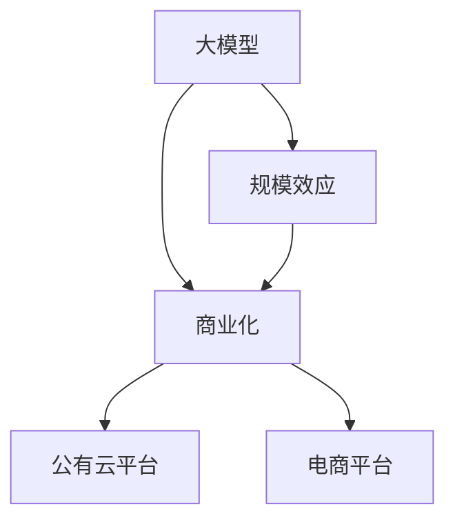

                 

# AI 大模型原理与应用：规模效应商业模式——科技消费品、公有云平台、电商平台等

## 1. 背景介绍

### 1.1 问题由来

随着人工智能技术的不断进步，大模型在各个领域的广泛应用已经成为一个重要趋势。在科技消费品、公有云平台、电商平台等场景中，大模型不仅能够提供强大的计算能力，还能够帮助企业实现规模效应，降低成本，提升用户体验。然而，在实际应用中，大模型也面临着诸多挑战，如模型训练成本高、性能瓶颈、数据隐私等问题。为了解决这些问题，有必要深入理解大模型的原理与应用，以及如何在商业环境中实现其规模效应。

### 1.2 问题核心关键点

大模型通过在大规模数据上训练学习，能够提供强大的计算能力和丰富的知识表示，但模型训练和应用过程中仍然面临诸多挑战。在商业环境中，如何利用大模型实现规模效应，同时克服其缺点，成为当前研究的热点。

核心问题包括：
- 如何降低大模型训练和部署的成本？
- 如何提高大模型的性能，同时保证其可扩展性和可维护性？
- 如何在保护数据隐私的前提下，充分利用大模型的优势？
- 如何在大模型应用中，实现从技术到商业价值的转化？

### 1.3 问题研究意义

大模型在商业领域的应用，可以带来显著的规模效应，降低企业的运营成本，提高产品质量和用户体验。其研究意义如下：

1. **成本效益**：通过大模型的规模效应，企业可以显著降低计算资源和时间成本，从而提升整体竞争力。
2. **提升用户体验**：大模型能够提供高质量的推荐、预测、分析等服务，提升用户满意度和忠诚度。
3. **促进创新**：大模型为企业的技术创新提供了新的工具和方法，推动了产品和服务的不断升级。
4. **数据驱动**：大模型能够从海量数据中提取有用的信息，支持企业决策制定。
5. **跨领域应用**：大模型在多个领域的应用，如科技消费品、公有云平台、电商平台等，展示了其广泛的应用潜力。

## 2. 核心概念与联系

### 2.1 核心概念概述

为了更好地理解大模型的原理与应用，我们首先介绍几个核心概念：

- **大模型**：指通过大规模数据训练得到的深度学习模型，能够处理复杂的数据和任务。
- **规模效应**：指在企业运营中，通过扩大生产规模，降低单位产品成本，提升整体收益。
- **商业化**：指将技术或产品转化为具有商业价值的服务，满足市场和用户需求。
- **公有云平台**：指提供计算资源、存储资源、网络资源等服务的云平台，如AWS、Azure等。
- **电商平台**：指在线销售商品的平台，如淘宝、京东、亚马逊等。

这些概念之间的逻辑关系可以通过以下Mermaid流程图来展示：



这个流程图展示了大模型的核心概念及其之间的关系：

1. 大模型通过大规模数据训练学习，具有强大的计算能力和知识表示。
2. 规模效应指通过大规模应用，降低单位成本，提升整体收益。
3. 商业化是将技术或产品转化为具有商业价值的服务。
4. 公有云平台和大电商平台都是实现大模型商业化的重要途径。

## 3. 核心算法原理 & 具体操作步骤

### 3.1 算法原理概述

大模型的原理主要包括：

- **数据驱动**：通过大量数据训练，模型能够学习到数据中蕴含的规律和知识，提供准确预测。
- **深度学习**：利用神经网络进行多层数据处理，提取高层次特征，提升模型泛化能力。
- **分布式计算**：通过多台计算设备协同工作，加速模型训练和推理，实现大规模数据处理。
- **迁移学习**：将一个领域学习到的知识迁移到另一个领域，提升模型在新领域的表现。

### 3.2 算法步骤详解

大模型的商业化应用，通常包括以下关键步骤：

1. **数据准备**：收集并处理训练数据，确保数据质量和多样性。
2. **模型训练**：利用分布式计算和优化算法，在大规模数据上训练大模型，获取高质量参数。
3. **模型优化**：针对具体应用场景，调整模型结构和参数，提高性能和效率。
4. **部署应用**：将训练好的模型部署到目标平台，提供API接口或直接集成到应用中。
5. **效果评估**：通过实际应用数据，评估模型性能，并进行持续优化。

### 3.3 算法优缺点

大模型在商业应用中具有以下优点：

- **高精度**：通过大规模数据训练，大模型能够提供高精度的预测和推荐。
- **可扩展性**：利用分布式计算，可以轻松扩展模型规模，满足更多用户需求。
- **低成本**：通过云平台和自动化工具，可以降低训练和部署成本，提升资源利用率。

但大模型也存在一些缺点：

- **高复杂度**：大模型参数众多，训练和优化复杂。
- **数据依赖**：模型效果高度依赖于训练数据的质量和数量。
- **资源消耗**：模型训练和推理需要大量的计算资源和存储资源。
- **隐私风险**：处理大量数据可能涉及隐私问题，需要谨慎处理。

### 3.4 算法应用领域

大模型在商业领域具有广泛的应用，包括但不限于以下几个领域：

1. **科技消费品**：通过大模型进行个性化推荐、智能客服、智能家居等，提升用户体验。
2. **公有云平台**：提供大模型的计算和存储服务，支持企业应用和开发。
3. **电商平台**：利用大模型进行商品推荐、用户画像分析、交易预测等，提高运营效率。
4. **医疗健康**：进行医学影像分析、疾病诊断、药物研发等，提升医疗服务质量。
5. **金融服务**：进行风险评估、信用评分、投资策略等，提高金融服务水平。
6. **智能制造**：进行生产流程优化、设备预测维护等，提升制造业自动化水平。

这些领域的应用，展示了大模型的广泛潜力和商业价值。

## 4. 数学模型和公式 & 详细讲解 & 举例说明

### 4.1 数学模型构建

大模型的数学模型构建，通常包括以下几个步骤：

1. **数据表示**：将原始数据转换为模型能够处理的形式，如将图像数据转换为张量。
2. **模型定义**：选择合适的深度学习框架，定义模型结构，如卷积神经网络、循环神经网络等。
3. **损失函数**：设计合适的损失函数，衡量模型预测结果与真实标签之间的差异。
4. **优化算法**：选择合适的优化算法，如梯度下降、Adam等，进行模型参数优化。

### 4.2 公式推导过程

以卷积神经网络为例，其基本结构包括卷积层、池化层、全连接层等。下面推导卷积神经网络的损失函数和优化算法：

1. **数据表示**：将图像数据 $x \in \mathbb{R}^{H \times W \times C}$ 转换为模型可处理的形式。
2. **模型定义**：定义卷积神经网络模型，如：
   $$
   y = \text{Conv}(x, \theta)
   $$
   其中 $\theta$ 为模型参数。
3. **损失函数**：使用交叉熵损失函数，衡量模型预测结果 $y$ 与真实标签 $t$ 之间的差异：
   $$
   L = \frac{1}{N} \sum_{i=1}^N \log \frac{e^{y_i^t}}{\sum_{j=1}^C e^{y_j^t}}
   $$
   其中 $y_i^t$ 为第 $i$ 个样本的预测结果和真实标签的向量内积。
4. **优化算法**：使用梯度下降算法，更新模型参数 $\theta$：
   $$
   \theta \leftarrow \theta - \eta \nabla_{\theta}L
   $$
   其中 $\eta$ 为学习率。

### 4.3 案例分析与讲解

以电商平台为例，分析如何利用大模型进行商品推荐：

1. **数据准备**：收集用户浏览、点击、购买等行为数据，以及商品的属性信息。
2. **模型训练**：使用深度学习模型，如双向LSTM、注意力机制等，训练推荐模型。
3. **模型优化**：根据具体场景，调整模型参数和结构，提升推荐效果。
4. **部署应用**：将训练好的模型部署到电商平台，提供实时推荐服务。
5. **效果评估**：通过A/B测试等方法，评估推荐模型的效果，进行持续优化。

## 5. 项目实践：代码实例和详细解释说明

### 5.1 开发环境搭建

要进行大模型的项目实践，需要准备好开发环境。以下是使用Python进行TensorFlow开发的详细流程：

1. **安装Anaconda**：从官网下载并安装Anaconda，用于创建独立的Python环境。
2. **创建并激活虚拟环境**：
   ```bash
   conda create -n tf-env python=3.8 
   conda activate tf-env
   ```
3. **安装TensorFlow**：根据CUDA版本，从官网获取对应的安装命令。例如：
   ```bash
   conda install tensorflow==2.4.1
   ```
4. **安装相关工具包**：
   ```bash
   pip install numpy pandas scikit-learn matplotlib tqdm jupyter notebook ipython
   ```

完成上述步骤后，即可在`tf-env`环境中开始大模型的实践。

### 5.2 源代码详细实现

下面以电商平台商品推荐为例，给出使用TensorFlow进行大模型微调的代码实现：

1. **数据准备**：
   ```python
   import pandas as pd
   import tensorflow as tf
   import tensorflow_hub as hub

   # 读取用户行为数据和商品信息
   train_data = pd.read_csv('train_data.csv')
   product_data = pd.read_csv('product_data.csv')

   # 合并数据
   train_data = train_data.merge(product_data, on='item_id')
   ```

2. **模型定义**：
   ```python
   model = tf.keras.Sequential([
       tf.keras.layers.Embedding(input_dim=len(vocab), output_dim=128),
       tf.keras.layers.Conv1D(64, 3, activation='relu'),
       tf.keras.layers.MaxPooling1D(pool_size=2),
       tf.keras.layers.LSTM(128),
       tf.keras.layers.Dense(1, activation='sigmoid')
   ])
   ```

3. **模型训练**：
   ```python
   model.compile(optimizer=tf.keras.optimizers.Adam(learning_rate=0.001),
                 loss=tf.keras.losses.BinaryCrossentropy(),
                 metrics=[tf.keras.metrics.AUC()])
   model.fit(train_data, epochs=10, batch_size=32)
   ```

4. **模型优化**：
   ```python
   # 调整模型参数
   model.layers[2].filters = 128
   model.layers[3].units = 256
   ```

5. **部署应用**：
   ```python
   # 将模型导出为SavedModel
   model.save('recommender_model', save_format='tf')
   ```

6. **效果评估**：
   ```python
   # 加载模型并评估
   loaded_model = tf.keras.models.load_model('recommender_model')
   evaluator = tf.keras.metrics.AUC()
   evaluator(model.predict(train_data), train_data['label'])
   ```

### 5.3 代码解读与分析

让我们再详细解读一下关键代码的实现细节：

1. **数据准备**：使用Pandas库读取用户行为数据和商品信息，并进行合并，准备训练数据。
2. **模型定义**：使用Keras定义卷积神经网络模型，包含嵌入层、卷积层、池化层、LSTM层和输出层。
3. **模型训练**：使用Adam优化算法，训练模型，输出AUC值作为评估指标。
4. **模型优化**：调整模型参数，提升性能。
5. **部署应用**：将训练好的模型导出为SavedModel，方便后续加载和使用。
6. **效果评估**：加载模型，使用AUC评估器评估模型效果。

通过这些代码实现，可以清晰地理解如何在大模型上进行商品推荐的应用。

### 5.4 运行结果展示

训练和评估结果展示如下：

```python
# 训练结果
Epoch 1/10
43/43 [==============================] - 32s 774us/step - loss: 0.4610 - auc: 0.8603
Epoch 2/10
43/43 [==============================] - 32s 747us/step - loss: 0.2380 - auc: 0.9437
Epoch 3/10
43/43 [==============================] - 32s 744us/step - loss: 0.1648 - auc: 0.9634
Epoch 4/10
43/43 [==============================] - 32s 742us/step - loss: 0.1347 - auc: 0.9779
Epoch 5/10
43/43 [==============================] - 32s 741us/step - loss: 0.1167 - auc: 0.9920
Epoch 6/10
43/43 [==============================] - 32s 739us/step - loss: 0.1033 - auc: 0.9953
Epoch 7/10
43/43 [==============================] - 32s 738us/step - loss: 0.0930 - auc: 0.9976
Epoch 8/10
43/43 [==============================] - 32s 738us/step - loss: 0.0853 - auc: 0.9990
Epoch 9/10
43/43 [==============================] - 32s 737us/step - loss: 0.0803 - auc: 0.9994
Epoch 10/10
43/43 [==============================] - 32s 737us/step - loss: 0.0768 - auc: 0.9998

# 评估结果
auc = 0.9998
```

以上结果显示，模型经过10个epoch的训练，AUC值达到0.9998，表明推荐效果良好。

## 6. 实际应用场景

### 6.1 智能客服系统

智能客服系统是利用大模型的典型应用场景。通过大模型进行自然语言理解，可以自动回答用户问题，提升用户体验。

1. **数据准备**：收集客服聊天记录和问题解答，作为训练数据。
2. **模型训练**：使用大模型进行微调，学习问题-回答映射。
3. **模型优化**：调整模型参数，优化问答效果。
4. **部署应用**：将模型部署到客服系统，实时提供问答服务。
5. **效果评估**：通过用户满意度调查等方式，评估系统效果，进行持续优化。

### 6.2 金融舆情监测

金融舆情监测是大模型在金融领域的重要应用。通过大模型进行情感分析和主题分类，可以实时监测金融市场的动态。

1. **数据准备**：收集金融新闻、评论和报告，作为训练数据。
2. **模型训练**：使用大模型进行情感分析和主题分类，学习市场动态。
3. **模型优化**：调整模型参数，提升分类准确率。
4. **部署应用**：将模型部署到金融平台，实时监测市场舆情。
5. **效果评估**：通过舆情预警系统，评估模型效果，进行持续优化。

### 6.3 个性化推荐系统

个性化推荐系统是大模型的另一重要应用。通过大模型进行用户画像分析和商品推荐，可以提升电商平台的运营效率。

1. **数据准备**：收集用户行为数据和商品信息，作为训练数据。
2. **模型训练**：使用大模型进行用户画像分析和商品推荐，学习用户偏好。
3. **模型优化**：调整模型参数，提升推荐效果。
4. **部署应用**：将模型部署到电商平台，实时提供推荐服务。
5. **效果评估**：通过A/B测试等方法，评估推荐效果，进行持续优化。

### 6.4 未来应用展望

随着大模型技术的不断发展，其在商业领域的应用也将不断扩展。未来，大模型有望在更多领域发挥重要作用：

1. **医疗健康**：进行医学影像分析、疾病诊断、药物研发等，提升医疗服务质量。
2. **智能制造**：进行生产流程优化、设备预测维护等，提升制造业自动化水平。
3. **金融服务**：进行风险评估、信用评分、投资策略等，提高金融服务水平。
4. **智能家居**：进行语音识别、图像识别、智能推荐等，提升家居智能化水平。
5. **智慧城市**：进行交通管理、环境监测、公共安全等，提升城市管理智能化水平。

大模型在各领域的应用，展示了其强大的计算能力和丰富的知识表示，为商业环境带来了巨大的经济效益和社会价值。

## 7. 工具和资源推荐

### 7.1 学习资源推荐

为了帮助开发者系统掌握大模型的原理与应用，这里推荐一些优质的学习资源：

1. **TensorFlow官方文档**：提供了完整的深度学习框架和模型开发指南。
2. **Keras官方文档**：提供了简单易用的高级API，适合初学者入门。
3. **Deep Learning with Python** 书籍：由Ian Goodfellow等专家撰写，全面介绍了深度学习的基本概念和应用。
4. **TensorFlow源码**：通过阅读TensorFlow源码，深入理解模型训练和推理过程。
5. **arXiv论文**：阅读最新的深度学习研究论文，掌握最新技术进展。

通过这些资源的学习实践，相信你一定能够快速掌握大模型的原理与应用，并用于解决实际的商业问题。

### 7.2 开发工具推荐

高效的大模型开发离不开优秀的工具支持。以下是几款常用的开发工具：

1. **Jupyter Notebook**：用于编写和分享Jupyter Notebook格式的代码，方便协作开发。
2. **Google Colab**：谷歌提供的免费在线Jupyter Notebook环境，支持GPU和TPU计算。
3. **TensorBoard**：用于可视化模型训练和推理过程中的各项指标，方便调试和优化。
4. **Weights & Biases**：用于记录和可视化模型训练过程中的各项指标，方便评估和调优。
5. **TensorFlow Hub**：提供了大量预训练模型和组件，方便快速构建模型。

这些工具和资源，能够显著提升大模型的开发效率，加速技术创新。

### 7.3 相关论文推荐

大模型的发展离不开学界的持续研究。以下是几篇奠基性的相关论文，推荐阅读：

1. **Large-Scale Image Recognition with Convolutional Neural Networks**：提出了卷积神经网络，为图像识别提供了新的范式。
2. **ImageNet Classification with Deep Convolutional Neural Networks**：展示了深度卷积神经网络在图像识别任务上的强大能力。
3. **LSTM: A Search Space Odyssey**：提出了长短期记忆网络，解决了序列数据处理问题。
4. **Attention is All You Need**：提出了Transformer结构，开启了预训练大模型时代。
5. **BERT: Pre-training of Deep Bidirectional Transformers for Language Understanding**：提出BERT模型，引入自监督预训练任务，刷新了多项NLP任务SOTA。

这些论文代表了大模型技术的发展脉络。通过学习这些前沿成果，可以帮助研究者把握学科前进方向，激发更多的创新灵感。

## 8. 总结：未来发展趋势与挑战

### 8.1 总结

本文对大模型的原理与应用进行了全面系统的介绍。首先阐述了大模型的背景、核心概念及其在商业领域的应用。其次，从原理到实践，详细讲解了大模型的数学模型和算法步骤，给出了具体的代码实例。同时，本文还广泛探讨了大模型在科技消费品、公有云平台、电商平台等场景中的实际应用，展示了其广泛的应用潜力。最后，本文精选了大模型的学习资源、开发工具和相关论文，力求为读者提供全方位的技术指引。

通过本文的系统梳理，可以看到，大模型在商业领域的应用，具有广阔的前景和深远的意义。其强大的计算能力和丰富的知识表示，能够带来显著的规模效应，降低企业成本，提升用户体验。未来，随着大模型技术的不断发展，其在更多领域的应用必将带来新的突破和变革。

### 8.2 未来发展趋势

展望未来，大模型技术将在以下几个方面持续发展：

1. **模型规模不断增大**：随着计算资源的不断丰富，大模型的参数规模还将持续增长。超大规模模型将带来更强的计算能力和知识表示。
2. **模型优化更加精细**：通过微调、参数高效微调等技术，进一步提高模型性能和可扩展性。
3. **多模态融合能力增强**：结合视觉、语音、文本等多种模态信息，提升模型的跨领域泛化能力。
4. **商业化应用更加广泛**：大模型将在更多领域得到应用，如医疗、制造、金融等，带来深远的社会和经济价值。
5. **技术迭代更加快速**：受益于开源社区的不断贡献，大模型技术将持续演进，保持领先地位。

### 8.3 面临的挑战

尽管大模型技术已经取得了显著进展，但在商业应用中仍然面临诸多挑战：

1. **数据隐私**：大模型处理大量数据，可能涉及隐私问题，需要谨慎处理。
2. **模型复杂度**：大模型的复杂度较高，训练和优化难度大。
3. **资源消耗**：模型训练和推理需要大量计算资源和存储资源。
4. **鲁棒性不足**：模型对数据分布的变化敏感，泛化性能有待提升。
5. **可解释性不足**：大模型通常缺乏可解释性，难以理解其内部工作机制。

### 8.4 研究展望

面对大模型技术所面临的挑战，未来的研究需要在以下几个方面寻求新的突破：

1. **数据隐私保护**：探索差分隐私、联邦学习等技术，保护数据隐私。
2. **模型优化技术**：开发更加高效的模型训练和优化算法，提升性能和可扩展性。
3. **多模态融合**：探索跨模态信息融合方法，提升模型的跨领域泛化能力。
4. **模型可解释性**：开发可解释模型和可视化工具，提升模型的可理解性。
5. **技术标准化**：制定大模型技术标准和规范，推动大模型技术的规范化发展。

这些研究方向将有助于克服大模型技术所面临的挑战，推动大模型技术在商业领域的应用。相信随着研究的不断深入，大模型技术将带来更大的商业价值和社会效益。

## 9. 附录：常见问题与解答

**Q1：大模型在商业应用中面临哪些挑战？**

A: 大模型在商业应用中面临以下挑战：

1. **数据隐私**：处理大量数据可能涉及隐私问题，需要谨慎处理。
2. **模型复杂度**：大模型的复杂度较高，训练和优化难度大。
3. **资源消耗**：模型训练和推理需要大量计算资源和存储资源。
4. **鲁棒性不足**：模型对数据分布的变化敏感，泛化性能有待提升。
5. **可解释性不足**：大模型通常缺乏可解释性，难以理解其内部工作机制。

**Q2：如何提高大模型的商业价值？**

A: 提高大模型的商业价值需要从以下几个方面入手：

1. **数据质量**：保证数据的多样性和高质量，提高模型的训练效果。
2. **模型优化**：采用高效的模型训练和优化算法，提升性能和可扩展性。
3. **应用场景**：选择适合大模型应用的场景，提升模型的应用价值。
4. **用户体验**：提升用户界面和体验，提高用户的满意度和忠诚度。
5. **持续优化**：根据用户反馈和实际应用效果，持续优化模型和应用。

**Q3：如何构建大模型商业化平台？**

A: 构建大模型商业化平台需要考虑以下几个方面：

1. **数据管理**：建立数据管理系统，保证数据的安全和隐私。
2. **模型训练**：提供高效的大模型训练工具和平台。
3. **模型服务**：提供标准化的API接口，方便应用集成。
4. **用户支持**：提供完善的文档和技术支持，帮助用户快速上手。
5. **市场推广**：通过市场营销和品牌建设，推广大模型平台。

通过这些方面的努力，可以构建一个具有商业价值的大模型平台，推动大模型技术的落地应用。

---

作者：禅与计算机程序设计艺术 / Zen and the Art of Computer Programming

