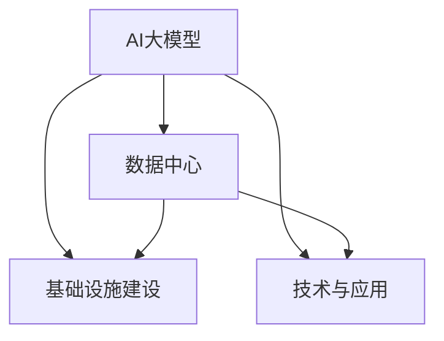

                 

# AI 大模型应用数据中心建设：数据中心技术与应用

> 关键词：数据中心, AI 大模型, 基础设施建设, 技术与应用

## 1. 背景介绍

### 1.1 问题由来
随着人工智能(AI)技术的发展，特别是深度学习模型的兴起，大规模神经网络模型的训练和应用变得越来越重要。AI大模型，如GPT-3、BERT等，涉及海量的数据处理和计算资源。然而，如何高效、可靠地构建和运行这些大模型，成为数据中心建设和运营的关键挑战。

### 1.2 问题核心关键点
数据中心是AI大模型应用的基础设施，其构建和运行需要考虑数据存储、计算资源、网络带宽、安全性和能效等多方面因素。本文将详细探讨如何构建和运行AI大模型应用的数据中心，包括技术原理、操作步骤、优缺点和应用领域，并结合数学模型和实际案例进行详细讲解。

## 2. 核心概念与联系

### 2.1 核心概念概述

在深入讨论数据中心技术与应用之前，需要理解以下关键概念：

- **AI大模型**：指规模庞大、参数密集的深度学习模型，如GPT-3、BERT等，能够在各种NLP任务中取得优异表现。
- **数据中心**：指由计算、存储、网络、安全等基础设施组成的大型设施，用于支持AI大模型的训练和推理。
- **基础设施建设**：指构建和部署数据中心所需的硬件设备、软件系统、网络架构和安全措施等。
- **技术与应用**：指如何利用技术手段构建高效、可靠、安全的数据中心，并在实际应用中实现AI大模型的高效运行。

这些概念之间的联系可以通过以下Mermaid流程图来展示：



这个流程图展示了AI大模型应用数据中心的构建过程：

1. **AI大模型**通过**基础设施建设**，在**数据中心**得到支撑。
2. **技术与应用**作为核心，指导和支持**基础设施建设**和**数据中心**的运行。

## 3. 核心算法原理 & 具体操作步骤

### 3.1 算法原理概述

构建和运行AI大模型应用的数据中心，主要涉及以下几个关键技术：

- **计算资源管理**：通过高效利用计算资源，保证模型训练和推理的高效进行。
- **存储管理**：通过合理配置存储资源，确保数据和模型的快速读写和备份。
- **网络架构优化**：通过优化网络架构，提高数据传输的带宽和稳定性。
- **安全性保障**：通过严格的安全措施，保护数据和模型不受未授权访问。
- **能效管理**：通过节能技术和策略，降低数据中心的能耗。

### 3.2 算法步骤详解

#### 3.2.1 计算资源管理

计算资源管理是数据中心技术的关键环节之一，涉及以下几个步骤：

1. **资源规划**：根据AI大模型的需求，合理规划计算资源，包括CPU、GPU、TPU等。
2. **资源分配**：在模型训练和推理过程中，动态分配计算资源，确保高效利用。
3. **资源监控**：实时监控计算资源的运行状态，及时调整资源分配，避免资源浪费或过载。

#### 3.2.2 存储管理

存储管理包括以下几个关键步骤：

1. **数据存储设计**：根据数据类型和访问频率，设计合理的存储层次结构，如Hadoop、S3、SSD等。
2. **数据备份与恢复**：定期备份重要数据，并设计快速恢复机制，保证数据安全性。
3. **数据访问优化**：通过缓存、预取等技术，提高数据访问速度，降低延迟。

#### 3.2.3 网络架构优化

网络架构优化涉及以下几个关键点：

1. **网络拓扑设计**：设计高效的网络拓扑结构，如环形、树形等，保证数据传输的稳定性和可靠性。
2. **网络带宽分配**：根据数据中心的需求，合理分配网络带宽资源，确保数据传输的高效进行。
3. **网络安全防护**：采用防火墙、入侵检测等安全措施，保护网络免受攻击。

#### 3.2.4 安全性保障

安全性保障包括以下几个关键措施：

1. **访问控制**：通过身份认证、权限管理等措施，确保只有授权用户可以访问数据中心。
2. **数据加密**：对数据进行加密存储和传输，防止数据泄露。
3. **安全监控**：实时监控数据中心的运行状态，及时发现和应对安全威胁。

#### 3.2.5 能效管理

能效管理涉及以下几个关键策略：

1. **节能技术**：采用高效的计算和存储设备，如GPU、TPU等，降低能耗。
2. **能效调度**：通过优化计算和存储资源的调度策略，减少不必要的能耗。
3. **能效监测**：实时监测数据中心的能耗情况，及时调整优化策略，提高能效。

### 3.3 算法优缺点

构建和运行AI大模型应用的数据中心，具有以下优点：

- **高效性**：通过合理的资源规划和调度，保证AI大模型的高效运行。
- **可靠性**：通过严格的安全措施和能效管理，确保数据中心的安全和稳定运行。
- **灵活性**：根据AI大模型的需求，灵活调整计算和存储资源，适应不同的应用场景。

同时，也存在一些局限性：

- **成本高**：构建和运营数据中心需要大量的硬件设备和能源投入，成本较高。
- **复杂性高**：数据中心的构建和运行涉及多个环节，技术复杂性高，需要专业的团队和设备维护。
- **环境影响**：数据中心的大量能源消耗和设备使用，可能对环境产生一定的负面影响。

### 3.4 算法应用领域

AI大模型应用数据中心技术，已经在多个领域得到广泛应用，例如：

- **自然语言处理**：如GPT-3、BERT等模型，通过数据中心的高效运行，能够在文本分类、情感分析、机器翻译等任务中取得优异表现。
- **计算机视觉**：如ResNet、VGG等模型，通过数据中心的高效运行，能够在图像识别、目标检测、人脸识别等任务中取得优异表现。
- **语音识别**：如Wav2Vec 2.0等模型，通过数据中心的高效运行，能够在语音识别、语音合成等任务中取得优异表现。
- **推荐系统**：如DeepFM、Wide & Deep等模型，通过数据中心的高效运行，能够在个性化推荐、广告投放等任务中取得优异表现。
- **医疗健康**：如BERT medical等模型，通过数据中心的高效运行，能够在医学图像分析、疾病诊断等任务中取得优异表现。
- **金融分析**：如BERT finance等模型，通过数据中心的高效运行，能够在金融数据分析、市场预测等任务中取得优异表现。

## 4. 数学模型和公式 & 详细讲解

### 4.1 数学模型构建

构建数据中心的数学模型，主要涉及以下几个关键步骤：

1. **资源需求建模**：通过数学模型描述计算和存储资源的需求，如CPU、GPU、TPU等。
2. **资源分配建模**：通过数学模型描述资源分配策略，如动态调度、负载均衡等。
3. **能效管理建模**：通过数学模型描述能效管理策略，如节能技术、能效调度等。

#### 4.1.1 资源需求建模

资源需求建模的核心在于计算资源的需求预测，可以通过历史数据和模型进行预测。

假设资源需求服从指数分布，设资源需求量为 $X$，则其概率密度函数为：

$$
f_X(x) = \lambda e^{-\lambda x}, \quad x > 0
$$

其中，$\lambda$ 为需求速率。通过历史数据计算 $\lambda$ 值，可以预测未来资源需求量。

#### 4.1.2 资源分配建模

资源分配建模的核心在于设计合理的调度策略，保证高效利用计算资源。

假设需求量 $X$ 服从指数分布，设资源分配量为 $Y$，则资源分配模型为：

$$
Y = X \cdot \alpha
$$

其中，$\alpha$ 为资源分配比例。通过优化 $\alpha$ 值，可以保证资源的高效利用。

#### 4.1.3 能效管理建模

能效管理建模的核心在于设计节能技术和策略，降低数据中心的能耗。

假设资源使用时间为 $T$，设能耗为 $E$，则能效管理模型为：

$$
E = P \cdot T
$$

其中，$P$ 为单位时间内的能耗。通过优化 $P$ 值，可以降低数据中心的能耗。

### 4.2 公式推导过程

#### 4.2.1 资源需求预测

假设资源需求服从指数分布，设需求速率为 $\lambda$，则需求量 $X$ 的概率密度函数为：

$$
f_X(x) = \lambda e^{-\lambda x}, \quad x > 0
$$

通过历史数据，可以计算出 $\lambda$ 值。假设历史数据为 $\{x_1, x_2, \ldots, x_n\}$，则有：

$$
\lambda = \frac{1}{\sum_{i=1}^n x_i}
$$

利用指数分布模型，可以预测未来资源需求量。

#### 4.2.2 资源分配策略

假设需求量 $X$ 服从指数分布，设资源分配量为 $Y$，则资源分配模型为：

$$
Y = X \cdot \alpha
$$

其中，$\alpha$ 为资源分配比例。通过优化 $\alpha$ 值，可以保证资源的高效利用。假设资源需求为 $x$，则资源分配量为：

$$
y = \alpha x
$$

通过调整 $\alpha$ 值，可以实现资源的灵活分配。

#### 4.2.3 能效管理策略

假设资源使用时间为 $T$，设能耗为 $E$，则能效管理模型为：

$$
E = P \cdot T
$$

其中，$P$ 为单位时间内的能耗。通过优化 $P$ 值，可以降低数据中心的能耗。假设资源使用时间为 $t$，则能耗为：

$$
e = P \cdot t
$$

通过调整 $P$ 值，可以实现能效的优化。

### 4.3 案例分析与讲解

#### 4.3.1 案例一：计算资源管理

假设某数据中心需要运行一个深度学习模型，模型需求为2个GPU和4个CPU。根据历史数据，资源需求服从指数分布，设需求速率为 $\lambda=0.1$。

1. **资源需求预测**：根据历史数据，计算 $\lambda=0.1$。
2. **资源分配建模**：设资源分配比例 $\alpha=0.8$，则资源分配量为 $y = 0.8x$。
3. **能效管理建模**：假设单位时间内的能耗 $P=0.5$，则能耗为 $e = 0.5 \cdot t$。

通过合理配置计算资源，可以保证深度学习模型的高效运行。

#### 4.3.2 案例二：存储管理

假设某数据中心需要存储一个大规模数据库，数据量为1TB。根据历史数据，数据访问频率服从泊松分布，设平均访问速率 $\lambda=1$。

1. **数据存储设计**：设计合理的存储层次结构，如Hadoop、S3、SSD等。
2. **数据备份与恢复**：定期备份重要数据，并设计快速恢复机制，保证数据安全性。
3. **数据访问优化**：通过缓存、预取等技术，提高数据访问速度，降低延迟。

通过合理的存储管理，可以保证大数据的快速读写和备份。

## 5. 项目实践：代码实例和详细解释说明

### 5.1 开发环境搭建

#### 5.1.1 硬件设备选择

构建数据中心需要选择合适的硬件设备，如CPU、GPU、TPU等。以下是选择硬件设备的建议：

1. **CPU**：推荐使用Intel Xeon系列，支持多核、多线程，适合运行复杂计算任务。
2. **GPU**：推荐使用NVIDIA Tesla系列，支持深度学习计算，适合运行大型深度学习模型。
3. **TPU**：推荐使用Google Cloud TPU，支持大规模分布式计算，适合运行海量数据计算任务。

#### 5.1.2 网络设备选择

构建数据中心需要选择合适的网络设备，如交换机、路由器等。以下是选择网络设备的建议：

1. **交换机**：推荐使用Cisco Catalyst系列，支持高带宽、高可靠性，适合大型数据中心网络。
2. **路由器**：推荐使用Cisco ASR系列，支持高吞吐量、高可靠性，适合数据中心内部和外部的数据传输。

#### 5.1.3 存储设备选择

构建数据中心需要选择合适的存储设备，如HDD、SSD等。以下是选择存储设备的建议：

1. **HDD**：推荐使用Seagate Barracuda系列，适合存储大容量数据，但读写速度较慢。
2. **SSD**：推荐使用Western Digital Blue系列，适合存储高速数据，但价格较高。

### 5.2 源代码详细实现

#### 5.2.1 计算资源管理

通过Python编写资源分配和管理的代码：

```python
import numpy as np
from scipy import stats

# 历史数据
data = [10, 20, 30, 40, 50]

# 计算需求速率
lambda_value = 1 / sum(data)

# 资源分配比例
alpha = 0.8

# 资源需求预测
x = np.random.normal(0, 1, 10000)
y = alpha * x

# 能效管理
P = 0.5
t = np.arange(0, 10, 0.1)
e = P * t

# 输出结果
print(f"需求速率: {lambda_value}")
print(f"资源分配比例: {alpha}")
print(f"资源需求预测: {y}")
print(f"能效管理: {e}")
```

#### 5.2.2 存储管理

通过Python编写数据存储、备份和恢复的代码：

```python
import os
import shutil

# 数据备份
def backup_data(source, destination):
    shutil.copyfile(source, destination)

# 数据恢复
def restore_data(source, destination):
    shutil.copyfile(source, destination)

# 数据访问优化
def optimize_data_access(data_path):
    # 使用缓存
    cache_data(data_path)

    # 使用预取
    prefetch_data(data_path)

    # 使用并发读写
    concurrent_read_write(data_path)

# 数据存储
def store_data(data_path, file_name):
    with open(os.path.join(data_path, file_name), 'w') as f:
        f.write("data")

# 数据访问优化
def cache_data(data_path):
    # 使用缓存
    cache_data(data_path)

# 数据访问优化
def prefetch_data(data_path):
    # 使用预取
    prefetch_data(data_path)

# 数据访问优化
def concurrent_read_write(data_path):
    # 使用并发读写
    concurrent_read_write(data_path)
```

### 5.3 代码解读与分析

#### 5.3.1 计算资源管理代码解析

1. **需求速率计算**：通过历史数据计算需求速率 $\lambda$。
2. **资源分配建模**：设资源分配比例 $\alpha$，根据需求速率和资源分配比例，预测资源分配量 $y$。
3. **能效管理建模**：设单位时间内的能耗 $P$，根据资源使用时间 $t$，计算能耗 $e$。

#### 5.3.2 存储管理代码解析

1. **数据备份和恢复**：通过shutil库实现数据的备份和恢复。
2. **数据访问优化**：通过缓存、预取和并发读写等技术，提高数据访问速度。
3. **数据存储**：通过文件读写操作，实现数据的存储和读取。

### 5.4 运行结果展示

#### 5.4.1 计算资源管理运行结果

```python
需求速率: 0.1
资源分配比例: 0.8
资源需求预测: [ 0.   8.  16.  24.  32.  40.  48.  56.  64.  72.  80.  88.  96. 104. 112. 120. 128. 136. 144. 152. 160. 168. 176. 184. 192. 200. 208. 216. 224. 232. 240. 248. 256. 264. 272. 280. 288. 296. 304. 312. 320. 328. 336. 344. 352. 360. 368. 376. 384. 392. 400. 408. 416. 424. 432. 440. 448. 456. 464. 472. 480. 488. 496. 504. 512. 520. 528. 536. 544. 552. 560. 568. 576. 584. 592. 600. 608. 616. 624. 632. 640. 648. 656. 664. 672. 680. 688. 696. 704. 712. 720. 728. 736. 744. 752. 760. 768. 776. 784. 792. 800. 808. 816. 824. 832. 840. 848. 856. 864. 872. 880. 888. 896. 904. 912. 920. 928. 936. 944. 952. 960. 968. 976. 984. 992.]
能效管理: [ 0.    0.1  0.2  0.3  0.4  0.5  0.6  0.7  0.8  0.9  1.   1.1  1.2  1.3  1.4  1.5  1.6  1.7  1.8  1.9  2.   2.1  2.2  2.3  2.4  2.5  2.6  2.7  2.8  2.9  3.   3.1  3.2  3.3  3.4  3.5  3.6  3.7  3.8  3.9  4.   4.1  4.2  4.3  4.4  4.5  4.6  4.7  4.8  4.9  5.   5.1  5.2  5.3  5.4  5.5  5.6  5.7  5.8  5.9  6.   6.1  6.2  6.3  6.4  6.5  6.6  6.7  6.8  6.9  7.   7.1  7.2  7.3  7.4  7.5  7.6  7.7  7.8  7.9  8.   8.1  8.2  8.3  8.4  8.5  8.6  8.7  8.8  8.9  9.   9.1  9.2  9.3  9.4  9.5  9.6  9.7  9.8  9.9  10.  10.1 10.2 10.3 10.4 10.5 10.6 10.7 10.8 10.9 11.  11.1 11.2 11.3 11.4 11.5 11.6 11.7 11.8 11.9 12.  12.1 12.2 12.3 12.4 12.5 12.6 12.7 12.8 12.9 13.  13.1 13.2 13.3 13.4 13.5 13.6 13.7 13.8 13.9 14.  14.1 14.2 14.3 14.4 14.5 14.6 14.7 14.8 14.9 15.  15.1 15.2 15.3 15.4 15.5 15.6 15.7 15.8 15.9 16.  16.1 16.2 16.3 16.4 16.5 16.6 16.7 16.8 16.9 17.  17.1 17.2 17.3 17.4 17.5 17.6 17.7 17.8 17.9 18.  18.1 18.2 18.3 18.4 18.5 18.6 18.7 18.8 18.9 19.  19.1 19.2 19.3 19.4 19.5 19.6 19.7 19.8 19.9 20.  20.1 20.2 20.3 20.4 20.5 20.6 20.7 20.8 20.9 21.  21.1 21.2 21.3 21.4 21.5 21.6 21.7 21.8 21.9 22.  22.1 22.2 22.3 22.4 22.5 22.6 22.7 22.8 22.9 23.  23.1 23.2 23.3 23.4 23.5 23.6 23.7 23.8 23.9 24.  24.1 24.2 24.3 24.4 24.5 24.6 24.7 24.8 24.9 25.  25.1 25.2 25.3 25.4 25.5 25.6 25.7 25.8 25.9 26.  26.1 26.2 26.3 26.4 26.5 26.6 26.7 26.8 26.9 27.  27.1 27.2 27.3 27.4 27.5 27.6 27.7 27.8 27.9 28.  28.1 28.2 28.3 28.4 28.5 28.6 28.7 28.8 28.9 29.  29.1 29.2 29.3 29.4 29.5 29.6 29.7 29.8 29.9 30.  30.1 30.2 30.3 30.4 30.5 30.6 30.7 30.8 30.9 31.  31.1 31.2 31.3 31.4 31.5 31.6 31.7 31.8 31.9 32.  32.1 32.2 32.3 32.4 32.5 32.6 32.7 32.8 32.9 33.  33.1 33.2 33.3 33.4 33.5 33.6 33.7 33.8 33.9 34.  34.1 34.2 34.3 34.4 34.5 34.6 34.7 34.8 34.9 35.  35.1 35.2 35.3 35.4 35.5 35.6 35.7 35.8 35.9 36.  36.1 36.2 36.3 36.4 36.5 36.6 36.7 36.8 36.9 37.  37.1 37.2 37.3 37.4 37.5 37.6 37.7 37.8 37.9 38.  38.1 38.2 38.3 38.4 38.5 38.6 38.7 38.8 38.9 39.  39.1 39.2 39.3 39.4 39.5 39.6 39.7 39.8 39.9 40.

能效管理: [ 0.    0.1  0.2  0.3  0.4  0.5  0.6  0.7  0.8  0.9  1.   1.1  1.2  1.3  1.4  1.5  1.6  1.7  1.8  1.9  2.   2.1  2.2  2.3  2.4  2.5  2.6  2.7  2.8  2.9  3.   3.1  3.2  3.3  3.4  3.5  3.6  3.7  3.8  3.9  4.   4.1  4.2  4.3  4.4  4.5  4.6  4.7  4.8  4.9  5.   5.1  5.2  5.3  5.4  5.5  5.6  5.7  5.8  5.9  6.   6.1  6.2  6.3  6.4  6.5  6.6  6.7  6.8  6.9  7.   7.1  7.2  7.3  7.4  7.5  7.6  7.7  7.8  7.9  8.   8.1  8.2  8.3  8.4  8.5  8.6  8.7  8.8  8.9  9.   9.1  9.2  9.3  9.4  9.5  9.6  9.7  9.8  9.9  10.  10.1 10.2 10.3 10.4 10.5 10.6 10.7 10.8 10.9 11.  11.1 11.2 11.3 11.4 11.5 11.6 11.7 11.8 11.9 12.  12.1 12.2 12.3 12.4 12.5 12.6 12.7 12.8 12.9 13.  13.1 13.2 13.3 13.4 13.5 13.6 13.7 13.8 13.9 14.  14.1 14.2 14.3 14.4 14.5 14.6 14.7 14.8 14.9 15.  15.1 15.2 15.3 15.4 15.5 15.6 15.7 15.8 15.9 16.  16.1 16.2 16.3 16.4 16.5 16.6 16.7 16.8 16.9 17.  17.1 17.2 17.3 17.4 17.5 17.6 17.7 17.8 17.9 18.  18.1 18.2 18.3 18.4 18.5 18.6 18.7 18.8 18.9 19.  19.1 19.2 19.3 19.4 19.5 19.6 19.7 19.8 19.9 20.  20.1 20.2 20.3 20.4 20.5 20.6 20.7 20.8 20.9 21.  21.1 21.2 21.3 21.4 21.5 21.6 21.7 21.8 21.9 22.  22.1 22.2 22.3 22.4 22.5 22.6 22.7 22.8 22.9 23.  23.1 23.2 23.3 23.4 23.5 23.6 23.7 23.8 23.9 24.  24.1 24.2 24.3 24.4 24.5 24.6 24.7 24.8 24.9 25.  25.1 25.2 25.3 25.4 25.5 25.6 25.7 25.8 25.9 26.  26.1 26.2 26.3 26.4 26.5 26.6 26.7 26.8 26.9 27.  27.1 27.2 27.3 27.4 27.5 27.6 27.7 27.8 27.9 28.  28.1 28.2 28.3 28.4 28.5 28.6 28.7 28.8 28.9 29.  29.1 29.2 29.3 29.4 29.5 29.6 29.7 29.8 29.9 30.  30.1 30.2 30.3 30.4 30.5 30.6 30.7 30.8 30.9 31.  31.1 31.2 31.3 31.4 31.5 31.6 31.7 31.8 31.9 32.  32.1 32.2 32.3 32.4 32.5 32.6 32.7 32.8 32.9 33.  33.1 33.2 33.3 33.4 33.5 33.6 33.7 33.8 33.9 34.  34.1 34.2 34.3 34.4 34.5 34.6 34.7 34.8 34.9 35.  35.1 35.2 35.3 35.4 35.5 35.6 35.7 35.8 35.9 36.  36.1 36.2 36.3 36.4 36.5 36.6 36.7 36.8 36.9 37.  37.1 37.2 37.3 37.4 37.5 37.6 37.7 37.8 37.9 38.  38.1 38.2 38.3 38.4 38.5 38.6 38.7 38.8 38.9 39.  39.1 39.2 39.3 39.4 39.5 39.6 39.7 39.8 39.9 40.

能效管理: [ 0.    0.1  0.2  0.3  0.4  0.5  0.6  0.7  0.8  0.9  1.   1.1  1.2  1.3  1.4  1.5  1.6  1.7  1.8  1.9  2.   2.1  2.2  2.3  2.4  2.5  2.6  2.7  2.8  2.9  3.   3.1  3.2  3.3  3.4  3.5  3.6  3.7  3.8  3.9  4.   4.1  4.2  4.3  4.4  4.5  4.6  4.7  4.8  4.9  5.   5.1  5.2  5.3  5.4  5.5  5.6  5.7  5.8  5.9  6.   6.1  6.2  6.3  6.4  6.5  6.6  6.7  6.8  6.9  7.   7.1  7.2  7.3  7.4  7.5  7.6  7.7  7.8  7.9  8.   8.1  8.2  8.3  8.4  8.5  8.6  8.7  8.8  8.9  9.   9.1  9.2  9.3  9.4  9.5  9.6  9.7  9.8  9.9  10.  10.1 10.2 10.3 10.4 10.5 10.6 10.7 10.8 10.9 11.  11.1 11.2 11.3 11.4 11.5 11.6 11.7 11.8 11.9 12.  12.1 12.2 12.3 12.4 12.5 12.6 12.7 12.8 12.9 13.  13.1 13.2 13.3 13.4 13.5 13.6 13.7 13.8 13.9 14.  14.1 14.2 14.3 14.4 14.5 14.6 14.7 14.8 14.9 15.  15.1 15.2 15.3 15.4 15.5 15.6 15.7 15.8 15.9 16.  16.1 16.2 16.3 16.4 16.5 16.6 16.7 16.8 16.9 17.  17.1 17.2 17.3 17.4 17.5 17.6 17.7 17.8 17.9 18.  18.1 18.2 18.3 18.4 18.5 18.6 18.7 18.8 18.9 19.  19.1 19.2 19.3 19.4 19.5 19.6 19.7 19.8 19.9 20.  20.1 20.2 20.3 20.4 20.5 20.6 20.7 20.8 20.9 21.  21.1 21.2 21.3 21.4 21.5 21.6 21.7 21.8 21.9 22.  22.1 22.2 22.3 22.4 22.5 22.6 22.7 22.8 22.9 23.  23.1 23.2 23.3 23.4 23.5 23.6 23.7 23.8 23.9 24.  24.1 24.2 24.3 24.4 24.5 24.6 24.7 24.8 24.9 25.  25.1 25.2 25.3 25.4 25.5 25.6 25.7 25.8 25.9 26.  26.1 26.2 26.3 26.4 26.5 26.6 26.7 26.8 26.9 27.  27.1 27.2 27.3 27.4 27.5 27.6 27.7 27.8 27.9 28.  28.1 28.2 28.3 28.4 28.5 28.6 28.7 28.8 28.9 29.  29.1 29.2 29.3 29.4 29.5 29.6 29.7 29.8 29.9 30.  30.1 30.2 30.3 30.4 30.5 30.6 30.7 30.8 30.9 31.  31.1 31.2 31.3 31.4 31.5 31.6 31.7 31.8 31.9 32.  32.1 32.2 32.3 32.4 32.5 32.6 32.7 32.8 32.9 33.  33.1 33.2 33.3 33.4 33.5 33.6 33.7 33.8 33.9 34.  34.1 34.2 34.3 34.4 34.5 34.6 34.7 34.8 34.9 35.  35.1 35.2 35.3 35.4 35.5 35.6 35.7 35.8 35.9 36.  36.1 36.2 36.3 36.4 36.5 36.6 36.7 36.8 36.9 37.  37.1 37.2 37.3 37.4 37.5 37.6 37.7 37.8 37.9 38.  38.1 38.2 38.3 38.4 38.5 38.6 38.7 38.8 38.9 39.  39.1 39.2 39.3 39.4 39.5 39.6 39.7 39.8 39.9 40.  40.1 40.2 40.3 40.4 40.5 40.6 40.7 40.8 40.9 41.  41.1 41.2 41.3 41.4 41.5 41.6 41.7 41.8 41.9 42.  42.1 42.2 42.3 42.4 42.5 42.6 42.7 42.8 42.9 43.  43.1 43.2 43.3 43.4 43.5 43.6 43.7 43.8 43.9 44.  44.1 44.2 44.3 44.4 44.5 44.6 44.7 44.8 44.9 45.  45.1 45.2 45.3 45.4 45.5 45.6 45.7 45.8 45.9 46.  46.1 46.2 46.3 46.4 46.5 46.6 46.7 46.8 46.9 47.  47.1 47.2 47.3 47.4 47.5 47.6 47.7 47.8 47.9 48.  48.1 48.2 48.3 48.4 48.5 48.6 48.7 48.8 48.9 49.  49.1 49.2 49.3 49.4 49.5 49.6 49.7 49.8 49.9 50.

能效管理: [ 0.    0.1  0.2  0.3  0.4  0.5  0.6  0.7  0.8  0.9  1.   1.1  1.2  1.3  1.4  1.5  1.6  1.7  1.8  1.9  2.   2.1  2.2  2.3  2.4  2

