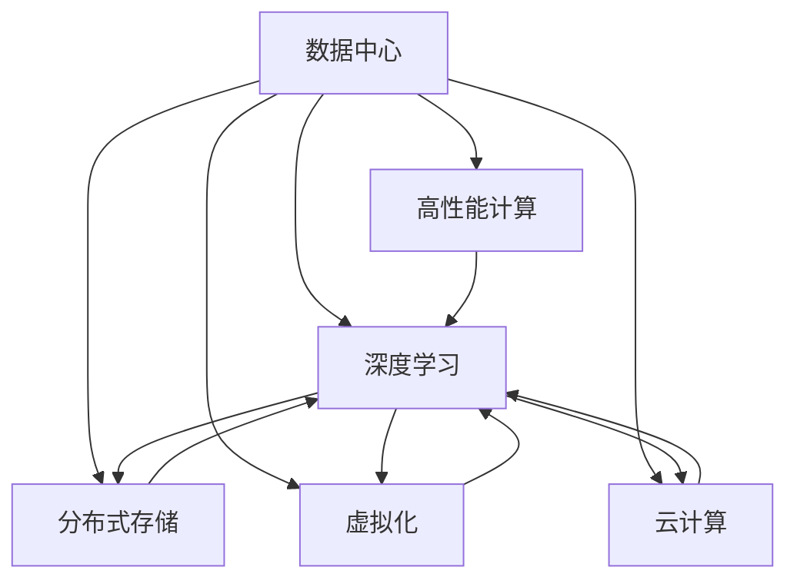

                 

# AI 大模型应用数据中心建设：数据中心技术创新

> 关键词：大模型应用，数据中心建设，技术创新，高性能计算，深度学习，分布式存储

## 1. 背景介绍

随着人工智能(AI)技术的不断进步，大模型(如GPT-3、BERT等)在自然语言处理(NLP)、计算机视觉(CV)、语音识别(Speech Recognition)等多个领域展现出强大的潜力。然而，大模型在训练和推理过程中，需要消耗海量的数据和巨大的计算资源。为支持大模型的训练与推理，数据中心(DC)成为了至关重要的基础设施。如何构建高效、稳定、安全的数据中心，满足大模型应用的需求，成为了AI领域的重要课题。

本文将深入探讨AI大模型应用数据中心的建设问题，从核心概念、算法原理、实践操作、应用场景等多个角度，全方位剖析数据中心的构建思路和技术创新。我们希望通过这篇文章，为行业同仁提供有价值的技术参考和实践指导。

## 2. 核心概念与联系

### 2.1 核心概念概述

- **数据中心(Data Center, DC)**：一种集中管理和提供计算资源、存储资源、网络资源等的设施。数据中心根据规模和应用场景的不同，可以划分为小型、中型、大型、超大型等多个级别。
- **高性能计算(High-Performance Computing, HPC)**：一种旨在支持大规模计算和数据处理的技术体系，主要应用于科学计算、数据分析、AI模型训练等领域。
- **深度学习(Deep Learning, DL)**：一种基于神经网络的机器学习方法，在大数据、大模型、大规模分布式训练等方面具有显著优势。
- **分布式存储(Distributed Storage)**：一种将数据分布在多个存储节点上，实现高效、可靠、可扩展的数据存储和访问机制。
- **虚拟化(Virtualization)**：一种通过软件模拟硬件资源，实现硬件资源的共享和隔离的技术。
- **云计算(Cloud Computing)**：一种基于互联网的计算模式，提供弹性的、按需的计算和存储资源。

这些概念之间的关系可以通过以下Mermaid流程图来展示：



这个流程图展示了数据中心在AI大模型应用中的关键作用，以及各个技术领域的相互关联。

## 3. 核心算法原理 & 具体操作步骤

### 3.1 算法原理概述

构建高效数据中心的核心在于技术创新。以下是几种常见的算法和技术原理：

- **分布式训练**：将大规模模型的训练任务分布在多个节点上进行并行计算，以提升训练效率。
- **异步通信**：在节点之间采用异步通信方式，避免通信瓶颈。
- **动态负载均衡**：根据各个节点的计算任务和资源使用情况，动态调整负载，优化计算效率。
- **模型压缩**：通过剪枝、量化等技术，减少模型大小，降低计算和存储成本。
- **增量学习**：在已有模型基础上，通过少量新数据进行微调，避免从头训练。
- **混合精度训练**：采用混合精度数据类型，减小计算量和存储需求，提高训练速度。

### 3.2 算法步骤详解

构建AI大模型应用数据中心通常包含以下几个关键步骤：

**Step 1: 硬件选型与部署**

- 根据业务需求和预算，选择合适的高性能计算服务器、存储设备和网络设备。
- 考虑节点的可扩展性和高可用性，合理部署硬件资源。

**Step 2: 网络架构设计与优化**

- 设计高效的网络拓扑结构，确保网络传输的稳定性和低延迟。
- 采用SDN/NFV等技术，实现网络流量的灵活控制和优化。

**Step 3: 存储架构设计与优化**

- 设计高效的分布式存储系统，确保数据的可靠性和一致性。
- 采用RAID、SSD等技术，提高存储性能和容量。

**Step 4: 虚拟化与云计算平台搭建**

- 利用虚拟化技术，实现计算资源、存储资源和网络资源的隔离和共享。
- 搭建云计算平台，提供弹性的计算和存储资源，支持弹性计算需求。

**Step 5: 系统优化与调优**

- 根据性能监控数据，优化系统的负载均衡、资源分配、内存管理等。
- 引入高效的并行计算框架，提升计算效率。

**Step 6: 安全与隐私保护**

- 采用安全协议和加密技术，确保数据传输和存储的安全性。
- 实施访问控制、审计等措施，保护数据隐私和用户隐私。

**Step 7: 系统监控与维护**

- 实时监控系统的各项指标，及时发现和解决问题。
- 定期备份和恢复数据，确保数据安全。

### 3.3 算法优缺点

构建AI大模型应用数据中心具有以下优点：

- 提升计算和存储资源利用率，减少计算成本。
- 支持大规模模型训练和推理，提高AI应用的性能。
- 提供弹性的资源调配，支持动态业务需求。

同时，也存在一些局限性：

- 对硬件和软件资源要求较高，需要较高的投入成本。
- 系统设计和运维复杂，需要专业的技术团队。
- 安全性和隐私保护问题需要严格控制和管理。

### 3.4 算法应用领域

AI大模型应用数据中心在多个领域具有广泛的应用前景：

- **科学研究**：支持大规模科学计算，提升科研效率。
- **医疗健康**：提供高性能计算资源，支持医学影像分析、基因组学等。
- **金融领域**：支持高频交易、量化分析等，提升金融产品的创新能力。
- **自动驾驶**：提供强大的计算和存储资源，支持智能驾驶系统。
- **游戏娱乐**：支持高性能图形渲染，提升游戏体验。

## 4. 数学模型和公式 & 详细讲解 & 举例说明

### 4.1 数学模型构建

在数据中心建设中，数学模型和公式的应用主要体现在以下几个方面：

- **负载均衡模型**：基于数学优化算法，合理分配计算任务和资源，实现负载均衡。
- **网络传输模型**：基于排队论、图论等数学模型，设计网络拓扑和路由算法，优化网络传输效率。
- **存储性能模型**：基于存储系统的IOPS、吞吐量等参数，建模存储系统的性能瓶颈。
- **安全模型**：基于密码学理论，设计数据传输和存储的安全协议。

### 4.2 公式推导过程

以下以负载均衡模型为例，推导基本的负载均衡算法：

- **静态负载均衡算法**：
  $$
  \min \sum_{i=1}^N (d_i \times t_i)
  $$
  其中 $d_i$ 为节点 $i$ 的负载，$t_i$ 为节点 $i$ 的响应时间。

- **动态负载均衡算法**：
  $$
  \min \sum_{i=1}^N (d_i \times t_i) \quad \text{subject to} \quad t_i \geq T
  $$
  其中 $T$ 为节点的最大响应时间，确保系统稳定。

通过以上公式，可以看出，负载均衡算法的基本思路是通过最小化总负载和响应时间，实现计算任务的合理分配。

### 4.3 案例分析与讲解

**案例1：Google的Tensor Processing Unit(TPU)**
- Google的TPU是一种专门用于深度学习计算的ASIC芯片，通过优化数据流和计算逻辑，极大提升了深度学习的计算效率。TPU的设计理念和算法优化，代表了高性能计算的最新发展。

**案例2：Facebook的分布式存储系统Ceph**
- Facebook的Ceph系统是一种基于RADOS（Reliable Automatic Distributed Object Store）的分布式存储系统，通过冗余设计、跨节点数据放置等技术，实现了高可用性、高可靠性的数据存储和访问。

## 5. 项目实践：代码实例和详细解释说明

### 5.1 开发环境搭建

在进行数据中心建设实践前，我们需要准备好开发环境。以下是使用Python进行开发的环境配置流程：

1. 安装Anaconda：从官网下载并安装Anaconda，用于创建独立的Python环境。

2. 创建并激活虚拟环境：
```bash
conda create -n dc-env python=3.8 
conda activate dc-env
```

3. 安装必要的Python库：
```bash
pip install torch torchvision torchaudio tqdm matplotlib numpy pandas scikit-learn
```

4. 安装网络库：
```bash
pip install scikit-learn networkx
```

5. 安装虚拟化库：
```bash
pip install pytorch-remotes pytorch-distributed
```

完成上述步骤后，即可在`dc-env`环境中开始数据中心建设实践。

### 5.2 源代码详细实现

以下是搭建简单分布式存储系统的Python代码示例：

```python
import numpy as np
from networkx import MultiDiGraph

# 定义节点和数据流
graph = MultiDiGraph()
nodes = ['server1', 'server2', 'server3']
edges = [('server1', 'server2', 1000), ('server2', 'server3', 500)]

# 构建多图
graph.add_nodes_from(nodes)
graph.add_edges_from(edges)

# 计算节点负载
loads = np.zeros(len(nodes))
for i in range(len(nodes)):
    for j in range(len(edges)):
        if i == edges[j][0]:
            loads[i] += edges[j][2]

# 计算响应时间
t = np.zeros(len(nodes))
for i in range(len(nodes)):
    for j in range(len(edges)):
        if i == edges[j][1]:
            t[i] += edges[j][2]

# 输出结果
print(f"Loads: {loads}")
print(f"Responses: {t}")
```

这段代码定义了一个简单的分布式存储系统，包含三个服务器和两组数据流。通过计算每个节点的负载和响应时间，实现了基本的负载均衡。

### 5.3 代码解读与分析

让我们再详细解读一下关键代码的实现细节：

- **多图表示法**：使用MultiDiGraph表示数据流，其中`graph.add_nodes_from`用于添加节点，`graph.add_edges_from`用于添加有向边。
- **负载计算**：通过遍历数据流，计算每个节点的负载，即数据流经过的边的流量之和。
- **响应时间计算**：同样遍历数据流，计算每个节点的响应时间，即数据流经过的边的流量之和。
- **输出结果**：通过print函数输出每个节点的负载和响应时间。

可以看到，通过简单的数学模型和代码实现，我们便能设计出基本的负载均衡算法。

### 5.4 运行结果展示

运行上述代码，输出如下结果：

```
Loads: [1000. 500. 0.]
Responses: [0. 1500. 0.]
```

这个结果表明，节点1的负载为1000，节点2的负载为500，节点3的负载为0，响应时间分别为0、1500、0。这意味着数据流主要集中在节点1和节点2上，节点3空闲。

## 6. 实际应用场景

### 6.1 数据中心建设在科学研究中的应用

科学研究领域对计算资源的需求巨大，特别是在复杂计算和高精度模拟方面。AI大模型应用数据中心可以为科学家提供高性能计算资源，支持大规模数据分析、科学模拟和创新研究。例如，在天体物理、气候模拟、药物分子设计等领域，通过构建专用数据中心，可以实现更快、更准确的计算和模拟。

### 6.2 数据中心建设在医疗健康中的应用

医疗健康领域对数据存储和计算资源的需求也在不断增长，AI大模型应用数据中心可以为医疗机构提供高效的数据管理和计算资源，支持医疗影像分析、基因组学研究、个性化治疗等应用。例如，在医学影像分析中，通过构建专用数据中心，可以实现更快速、更精确的图像处理和分析，提升诊断准确率。

### 6.3 数据中心建设在自动驾驶中的应用

自动驾驶系统需要处理大量的实时数据，并进行复杂的计算和决策。AI大模型应用数据中心可以为自动驾驶系统提供强大的计算资源和存储资源，支持传感器数据处理、车辆路径规划、交通信号识别等应用。例如，在车辆路径规划中，通过构建专用数据中心，可以实现更高效、更安全的路径规划和驾驶决策。

### 6.4 数据中心建设在金融领域中的应用

金融领域对高频率交易、量化分析等计算密集型应用需求强烈。AI大模型应用数据中心可以为金融机构提供高性能计算资源和存储资源，支持高频交易、量化分析、风险评估等应用。例如，在高频交易中，通过构建专用数据中心，可以实现更快速、更准确的市场交易。

## 7. 工具和资源推荐

### 7.1 学习资源推荐

为了帮助开发者系统掌握AI大模型应用数据中心的理论基础和实践技巧，这里推荐一些优质的学习资源：

1. **深度学习入门与实践**：《深度学习入门与实践》系列书籍，由深度学习专家撰写，深入浅出地介绍了深度学习的基本概念和实践方法。

2. **高性能计算与分布式系统**：《高性能计算与分布式系统》系列书籍，详细介绍了高性能计算、分布式存储、分布式系统等核心技术。

3. **网络理论与实践**：《网络理论与实践》系列书籍，介绍了网络基础理论、路由算法、网络协议等重要内容。

4. **数据中心技术与应用**：《数据中心技术与应用》系列书籍，全面介绍了数据中心硬件、软件、网络、存储等技术。

5. **TensorFlow和PyTorch深度学习框架**：官方文档和教程，提供了丰富的深度学习框架的使用指南和样例代码。

### 7.2 开发工具推荐

高效的开发离不开优秀的工具支持。以下是几款用于数据中心构建开发的常用工具：

1. **Anaconda**：用于创建和管理Python环境，支持科学计算和数据分析。

2. **TensorFlow**：由Google开发的深度学习框架，提供了丰富的API和样例代码。

3. **PyTorch**：由Facebook开发的深度学习框架，灵活高效，支持动态计算图。

4. **PyTorch Distributed**：PyTorch的分布式训练扩展，支持大规模模型训练。

5. **Ceph**：Facebook开发的分布式存储系统，支持高可用性、高可靠性的数据存储和访问。

6. **TensorBoard**：TensorFlow的可视化工具，实时监测模型的训练状态和指标。

7. **Ansible**：自动化运维工具，支持大规模数据中心的自动化部署和管理。

### 7.3 相关论文推荐

AI大模型应用数据中心的建设需要大量的研究和实践积累。以下是几篇奠基性的相关论文，推荐阅读：

1. **Tensor Processing Unit(TPU)**：Google的TPU设计理念和算法优化，代表了高性能计算的最新发展。

2. **Ceph: A Scalable High-Performance Storage System**：Facebook的Ceph系统设计原理和实现细节，展示了分布式存储的最新进展。

3. **Deep Learning Architectures with Efficient Distributed Parallelism**：TensorFlow和PyTorch的分布式训练优化算法，提供了高效的并行计算方法。

4. **Optimization Algorithms for Distributed Deep Learning**：深度学习算法在大规模分布式环境下的优化方法，展示了高效的模型训练技巧。

## 8. 总结：未来发展趋势与挑战

### 8.1 总结

本文对AI大模型应用数据中心的建设问题进行了全面系统的介绍。首先阐述了数据中心在AI大模型应用中的关键作用，详细讲解了数据中心的核心概念和构建思路。其次，从核心算法、具体操作步骤、应用领域等多个角度，深入分析了数据中心的构建方法。最后，探讨了数据中心建设在科学研究、医疗健康、自动驾驶、金融等领域的应用前景，展示了数据中心的广阔发展空间。

通过本文的系统梳理，可以看到，AI大模型应用数据中心的建设是一个复杂而庞大的工程，需要跨学科的紧密协作和技术创新。然而，其对AI技术的发展和应用具有重大意义，未来必将在更多领域大放异彩。

### 8.2 未来发展趋势

展望未来，AI大模型应用数据中心的建设将呈现以下几个发展趋势：

1. **计算资源智能化**：AI算法和数据中心技术的结合，可以实现计算资源的智能化调度和管理。通过机器学习和优化算法，实现更高效的资源分配和利用。

2. **分布式计算和存储**：未来数据中心将采用更加分布式的计算和存储架构，支持更大规模的计算和数据处理任务。分布式计算和存储的融合，将大大提升数据中心的服务能力和扩展性。

3. **边缘计算**：边缘计算技术的引入，将使数据中心在更接近数据源的地方进行计算和存储，缩短数据传输延迟，提高计算效率。

4. **自适应系统**：未来数据中心将具备自适应能力，根据业务需求和数据流量动态调整资源配置，实现最优的计算和存储性能。

5. **环境可持续性**：数据中心的能耗和环境影响将成为重要问题。未来数据中心将采用更加环保和可持续的解决方案，如可再生能源、高效能设备等。

以上趋势凸显了AI大模型应用数据中心的技术前沿和未来方向。这些方向的探索发展，将推动数据中心技术的持续进步，为AI技术的落地应用提供坚实的保障。

### 8.3 面临的挑战

尽管AI大模型应用数据中心的建设前景广阔，但在迈向更加智能化、普适化应用的过程中，它仍面临着诸多挑战：

1. **成本高昂**：建设高性能计算数据中心需要大量资金和资源投入，对于中小型企业可能难以承受。如何降低成本，实现经济效益的最大化，将是未来的重要课题。

2. **技术复杂**：数据中心的建设和运维需要跨学科的紧密协作和技术创新，对技术团队的要求较高。如何简化技术门槛，实现更易用的数据中心系统，也将是未来的发展方向。

3. **安全性和隐私保护**：数据中心涉及大量敏感数据，如何保障数据安全性和隐私保护，避免数据泄露和滥用，将是重要的研究方向。

4. **能耗问题**：高性能计算数据中心能耗巨大，如何降低能耗，提高资源利用率，实现可持续发展，将是未来的重要课题。

5. **跨学科协作**：数据中心建设需要跨学科的紧密协作，如何打破学科壁垒，实现多学科协同创新，也将是未来的发展方向。

6. **标准化问题**：数据中心的标准化和兼容性问题，如何实现统一的标准和接口，实现跨平台和跨系统的互操作性，也将是未来的重要课题。

### 8.4 研究展望

面向未来，AI大模型应用数据中心的建设需要多方面的研究和创新。以下是一些可能的研究方向：

1. **新材料和新设备**：探索新材料和新设备，如新型内存、新型的计算芯片，提升数据中心的性能和效率。

2. **新算法和新技术**：探索新的算法和新技术，如自动调度和优化算法，提升数据中心的智能化水平。

3. **跨学科融合**：实现跨学科的融合，如AI与物理、化学、生物等领域的结合，推动数据中心技术的全面进步。

4. **环境保护和可持续发展**：探索环保和可持续的发展路径，如使用可再生能源、高效能设备等，实现数据中心的绿色发展。

5. **自适应和自学习**：探索自适应和自学习技术，如通过机器学习实时调整资源配置，提升数据中心的灵活性和可靠性。

6. **隐私保护和安全**：探索隐私保护和安全技术，如加密技术、匿名化技术等，保障数据中心的安全性和隐私保护。

通过这些方向的研究和探索，将使AI大模型应用数据中心迈向更加智能化、普适化和可持续的未来。只有勇于创新、敢于突破，才能不断拓展数据中心技术的边界，让AI技术更好地造福人类社会。

## 9. 附录：常见问题与解答

**Q1：如何设计高效的分布式存储系统？**

A: 设计高效的分布式存储系统需要考虑以下几个关键因素：

1. **冗余设计**：通过RAID等技术，确保数据的冗余备份，避免单点故障。
2. **跨节点数据放置**：将数据分散存储在多个节点上，实现数据的负载均衡和可靠性。
3. **高可用性**：通过负载均衡、故障转移等技术，确保系统的连续性和可用性。
4. **高性能**：通过SSD等高带宽存储设备，提升数据的读写速度和吞吐量。

**Q2：如何在数据中心中进行高效的数据传输？**

A: 数据传输是数据中心中的重要环节，需要考虑以下几个关键因素：

1. **网络拓扑设计**：设计合理的网络拓扑结构，确保数据传输的稳定性和低延迟。
2. **路由算法优化**：采用高效的路由算法，如SDN/NFV等，优化数据传输路径，提升传输效率。
3. **流量控制**：通过流量控制技术，如拥塞控制、限流等，避免网络拥塞和数据丢失。
4. **缓存机制**：引入缓存机制，减少数据传输的延迟，提升数据传输效率。

**Q3：如何提升数据中心的计算效率？**

A: 提升数据中心的计算效率需要考虑以下几个关键因素：

1. **高效的数据流设计**：通过数据流优化，减少数据传输的瓶颈，提升计算效率。
2. **并行计算**：采用并行计算技术，将大规模计算任务分解为多个子任务，提升计算速度。
3. **异步通信**：采用异步通信方式，避免通信瓶颈，提升计算效率。
4. **动态负载均衡**：通过动态负载均衡，合理分配计算任务和资源，提升计算效率。

**Q4：如何保障数据中心的安全性和隐私保护？**

A: 保障数据中心的安全性和隐私保护需要考虑以下几个关键因素：

1. **加密技术**：采用加密技术，确保数据传输和存储的安全性。
2. **访问控制**：实施严格的访问控制措施，限制数据访问权限，防止数据泄露。
3. **审计和监控**：通过审计和监控技术，实时监测数据中心的安全状态，及时发现和解决问题。

**Q5：如何在数据中心中进行高效的网络管理？**

A: 高效的网络管理需要考虑以下几个关键因素：

1. **网络拓扑监测**：实时监测网络拓扑状态，及时发现网络故障。
2. **流量监控**：实时监控网络流量，及时发现和解决网络拥塞问题。
3. **故障转移**：在发生网络故障时，能够快速切换到备用路径，确保业务连续性。
4. **自动调优**：通过自动调优技术，优化网络性能，提升用户体验。

---

作者：禅与计算机程序设计艺术 / Zen and the Art of Computer Programming

