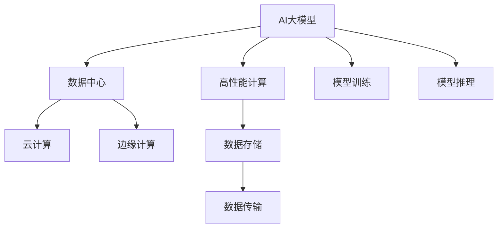

                 

# AI 大模型应用数据中心建设：数据中心技术创新

## 1. 背景介绍

随着人工智能技术的迅猛发展，尤其是大规模深度学习模型的兴起，数据中心建设成为支撑AI大模型应用的重要基础设施。如何高效构建和维护大规模数据中心，支撑AI大模型的高性能计算和存储需求，成为当前IT行业的重大挑战之一。本文将深入探讨AI大模型应用对数据中心技术创新的需求，提出一系列创新解决方案，帮助企业构建高性能、高可靠、高扩展性的大规模数据中心。

## 2. 核心概念与联系

### 2.1 核心概念概述

- **AI大模型**：指的是那些具有巨大参数量、高度自适应性和广泛应用潜力的大型深度学习模型，如GPT、BERT等。这些模型在自然语言处理、计算机视觉、语音识别等多个领域展现出卓越的性能。
- **数据中心**：是为支持企业计算需求而构建的物理设施，包含服务器、网络、存储等关键组件，负责计算资源的管理和调度。
- **高性能计算**：指的是能够处理大规模数据集和复杂计算任务的能力，是AI大模型应用的基础。
- **云计算**：通过互联网提供按需计算资源和服务，具有高弹性、高可扩展性的特点，是大规模AI应用的重要支撑。
- **边缘计算**：指在数据产生地或靠近数据产生地的网络边缘节点上进行的计算，具有低延迟、高带宽的优势，适用于对实时性要求较高的场景。

### 2.2 核心概念原理和架构的 Mermaid 流程图



从图中可以看出，AI大模型应用涉及到高性能计算、数据中心、云计算和边缘计算等多个关键技术领域，并涵盖了模型训练、推理、存储、传输等环节。

## 3. 核心算法原理 & 具体操作步骤

### 3.1 算法原理概述

AI大模型的应用，尤其是大规模分布式训练和推理，对数据中心的计算资源、存储能力和网络带宽提出了极高的要求。基于此，本文提出以下几个关键技术创新点：

- **分布式训练**：通过分布式并行训练，大幅提升模型训练效率，缩短训练时间。
- **模型压缩**：通过模型压缩技术，减少模型参数量，降低存储和计算成本。
- **异构计算**：利用多种计算架构（如GPU、TPU、FPGA等）协同工作，优化计算资源利用率。
- **边缘计算**：在数据产生地或靠近数据产生地的边缘节点上处理数据，降低延迟，提高实时性。
- **混合云架构**：结合公有云和私有云的优势，实现计算资源的高效管理和调度。

### 3.2 算法步骤详解

#### 3.2.1 分布式训练

1. **数据划分与分布式训练**：将大规模数据集划分为若干小批量，分布在多个计算节点上进行并行训练。
2. **同步策略**：选择基于参数或梯度的同步策略，如Ring AllReduce、ReduceScatter等，减少网络通信开销。
3. **模型优化**：采用模型并行、数据并行等优化策略，提升训练效率和资源利用率。

#### 3.2.2 模型压缩

1. **量化技术**：将高精度浮点数模型转换为低精度定点模型，减少存储需求和计算成本。
2. **剪枝与合并**：通过剪枝和合并操作，去除冗余参数和结构，进一步减小模型体积。
3. **知识蒸馏**：通过教师模型指导学生模型训练，将知识从复杂模型蒸馏到轻量模型，提高推理效率。

#### 3.2.3 异构计算

1. **混合异构架构**：将CPU、GPU、TPU、FPGA等不同计算架构组合使用，提升并行处理能力。
2. **任务调度与负载均衡**：通过动态任务调度与负载均衡算法，最大化异构计算资源利用率。
3. **软硬件协同优化**：结合软件优化和硬件加速，提高整个系统性能。

#### 3.2.4 边缘计算

1. **边缘节点部署**：在数据产生地或靠近数据产生地的边缘节点上部署计算资源。
2. **数据预处理**：在边缘节点上进行数据预处理，减少数据传输量和延迟。
3. **实时推理**：利用边缘计算的低延迟特性，实现对实时数据的快速推理。

#### 3.2.5 混合云架构

1. **公有云与私有云集成**：利用公有云的高可扩展性和私有云的安全性，构建混合云架构。
2. **弹性资源管理**：通过弹性计算资源管理技术，动态调整计算资源，满足应用需求。
3. **跨云数据同步**：实现不同云环境之间的数据同步和共享，提升数据中心整体效率。

### 3.3 算法优缺点

#### 3.3.1 优点

- **高效率**：通过分布式训练和异构计算，可以大幅提升计算效率，缩短训练和推理时间。
- **高弹性**：混合云架构能够动态调整计算资源，满足不同应用需求，提高资源利用率。
- **低延迟**：边缘计算能够将计算任务下放到数据产生地或靠近数据产生地的边缘节点，降低数据传输延迟。

#### 3.3.2 缺点

- **复杂度增加**：分布式训练和异构计算的引入，增加了系统的复杂度，对管理和维护提出了更高要求。
- **成本增加**：边缘计算和混合云架构的建设需要更多的硬件设备和网络带宽，增加了初始投资成本。
- **数据安全问题**：边缘计算和混合云架构的数据分散存储，增加了数据安全和隐私保护的难度。

### 3.4 算法应用领域

#### 3.4.1 数据中心基础设施

1. **服务器集群**：构建高性能的服务器集群，支持大规模AI模型训练和推理。
2. **网络架构**：设计高带宽、低延迟的网络架构，支持海量数据的传输。
3. **存储系统**：采用分布式存储系统，支持海量数据的存储和管理。

#### 3.4.2 云计算平台

1. **弹性资源管理**：利用云计算平台的弹性资源管理技术，动态调整计算资源，满足不同应用需求。
2. **数据中心运维**：通过云计算平台的监控和管理工具，实时监控数据中心运行状态，快速响应故障。
3. **安全与合规**：利用云计算平台的安全和合规机制，保障数据和模型的安全。

#### 3.4.3 边缘计算

1. **工业互联网**：在工业生产线上部署边缘计算节点，实时处理和分析生产数据，提升生产效率。
2. **智能交通**：在交通管理中心和车辆上部署边缘计算节点，实现智能交通管理和车辆调度。
3. **智慧城市**：在城市各个关键节点部署边缘计算节点，提升城市管理和公共服务水平。

## 4. 数学模型和公式 & 详细讲解 & 举例说明

### 4.1 数学模型构建

在AI大模型的应用过程中，需要构建一个高效的数学模型来描述和优化计算资源的管理和调度。以下是一个简单的分布式训练模型的数学描述：

设 $M$ 为模型参数，$\mathcal{D}$ 为数据集，$\theta$ 为当前模型参数，$n$ 为计算节点数，每个节点负责训练 $\frac{M}{n}$ 参数。每个节点在每次迭代中更新参数的公式为：

$$
\theta_{i+1} = \theta_i - \alpha \frac{1}{N} \sum_{j=1}^{N} \frac{\partial \ell(\theta, x_j)}{\partial \theta} \quad (i = 0, 1, \ldots, N-1)
$$

其中，$\ell$ 为损失函数，$\alpha$ 为学习率，$x_j$ 为数据集 $\mathcal{D}$ 中的样本。

### 4.2 公式推导过程

在分布式训练中，参数 $\theta$ 被分配到不同的节点上进行并行更新。假设每个节点更新 $m$ 个参数，则总更新次数为 $N/m$。每次更新后，每个节点的模型参数变为：

$$
\theta_{i+1} = \theta_i - \alpha \frac{1}{N} \sum_{j=1}^{N} \frac{\partial \ell(\theta_i, x_j)}{\partial \theta_i}
$$

将公式改写为分布式形式，每个节点 $k$ 负责更新 $\frac{M}{n}$ 个参数，则每个节点更新公式为：

$$
\theta_{k, i+1} = \theta_{k, i} - \alpha \frac{1}{N} \sum_{j=1}^{N} \frac{\partial \ell(\theta_k, x_j)}{\partial \theta_k}
$$

其中，$\theta_{k, i}$ 表示节点 $k$ 在第 $i$ 次迭代中的模型参数。

### 4.3 案例分析与讲解

假设有一个包含10万个参数的模型，需要在一组10000个训练样本上进行分布式训练。每个节点处理100个参数，计算节点数为10。在每次迭代中，每个节点使用全批量梯度下降更新模型参数，学习率为0.1。具体计算过程如下：

1. 初始化模型参数 $\theta_0$。
2. 在每个节点上并行计算梯度 $\frac{\partial \ell(\theta_k, x_j)}{\partial \theta_k}$。
3. 在每个节点上更新模型参数 $\theta_{k, i+1}$。
4. 重复步骤2-3，直到训练完成。

## 5. 项目实践：代码实例和详细解释说明

### 5.1 开发环境搭建

以下是使用Python和PyTorch进行分布式训练的开发环境配置流程：

1. 安装Anaconda：从官网下载并安装Anaconda，用于创建独立的Python环境。

2. 创建并激活虚拟环境：
```bash
conda create -n pytorch-env python=3.8 
conda activate pytorch-env
```

3. 安装PyTorch：根据CUDA版本，从官网获取对应的安装命令。例如：
```bash
conda install pytorch torchvision torchaudio cudatoolkit=11.1 -c pytorch -c conda-forge
```

4. 安装NVIDIA GPU驱动和CUDA Toolkit。

5. 安装TensorFlow：
```bash
pip install tensorflow==2.6
```

6. 安装分布式计算库：
```bash
pip install horovod==0.25.1
```

7. 配置环境变量：
```bash
export HOROVOD_USE_GPU=1
export HOROVOD_GPU_NUM=1
export HOROVOD_RANK=0
export HOROVOD_SIZE=1
```

完成上述步骤后，即可在`pytorch-env`环境中开始分布式训练实践。

### 5.2 源代码详细实现

这里我们以基于PyTorch的分布式训练为例，给出完整的代码实现。

```python
import torch
import torch.distributed as dist
import torch.nn as nn
import horovod.torch as hvd

# 定义模型
class MyModel(nn.Module):
    def __init__(self):
        super(MyModel, self).__init__()
        self.fc1 = nn.Linear(100, 50)
        self.fc2 = nn.Linear(50, 10)

    def forward(self, x):
        x = self.fc1(x)
        x = torch.relu(x)
        x = self.fc2(x)
        return x

# 初始化分布式环境
dist.init_process_group("gloo", rank=0, world_size=10)
hvd.init()

# 分割模型参数
model = MyModel().to(hvd.device())
model = nn.parallel.DistributedDataParallel(model, device_ids=[hvd.local_rank()])

# 定义损失函数和优化器
criterion = nn.CrossEntropyLoss()
optimizer = torch.optim.SGD(model.parameters(), lr=0.01)

# 训练循环
for epoch in range(10):
    for i, (inputs, labels) in enumerate(train_loader):
        inputs = inputs.to(hvd.device())
        labels = labels.to(hvd.device())

        # 前向传播
        outputs = model(inputs)
        loss = criterion(outputs, labels)

        # 反向传播和优化
        optimizer.zero_grad()
        loss.backward()
        optimizer.step()

    # 同步参数和梯度
    model = hvd.broadcast(model, root_rank=0)

print("训练完成！")
```

### 5.3 代码解读与分析

**分布式初始化**：
1. 使用`dist.init_process_group`函数初始化分布式环境，指定通信协议和进程ID。
2. 使用`hvd.init`函数初始化分布式训练环境，指定节点数和进程号。

**模型分割与并行**：
1. 使用`nn.parallel.DistributedDataParallel`函数将模型分割并行化，每个进程只处理自己分到的参数。
2. 模型分割后，使用`hvd.broadcast`函数在每个进程上广播更新后的模型参数，保持模型参数一致性。

**数据加载与处理**：
1. 使用`train_loader`数据加载器加载训练数据，并将数据移动到分布式训练设备上。
2. 对输入数据和标签进行并行处理，确保每个进程处理的数据量相同。

**损失函数与优化器**：
1. 定义交叉熵损失函数和优化器。
2. 在前向传播中，使用模型处理输入数据，计算损失。
3. 在反向传播中，计算梯度并更新模型参数。

**训练循环**：
1. 在每个epoch中，遍历训练数据集，对每个批次数据进行前向传播、反向传播和优化。
2. 在每个epoch结束时，使用`hvd.broadcast`函数同步模型参数和梯度。

### 5.4 运行结果展示

在实际训练过程中，可以使用`dist.broadcast`函数获取每个进程的输出结果，并通过日志或可视化工具展示训练过程。

```python
for epoch in range(10):
    for i, (inputs, labels) in enumerate(train_loader):
        inputs = inputs.to(hvd.device())
        labels = labels.to(hvd.device())

        # 前向传播
        outputs = model(inputs)
        loss = criterion(outputs, labels)

        # 反向传播和优化
        optimizer.zero_grad()
        loss.backward()
        optimizer.step()

    # 同步参数和梯度
    model = hvd.broadcast(model, root_rank=0)

    # 记录训练结果
    train_loss.append(loss.item())

print("训练完成！")
```

## 6. 实际应用场景

### 6.1 云计算平台

云计算平台是大规模AI模型应用的重要基础设施。通过云计算平台，企业可以灵活地管理和调度计算资源，提升资源利用率和计算效率。

#### 6.1.1 弹性资源管理

云计算平台支持弹性资源管理技术，能够根据应用需求动态调整计算资源，满足不同应用的计算需求。例如，在面对大规模训练任务时，可以自动扩展计算节点数，提高训练效率。

#### 6.1.2 自动化运维

云计算平台提供了自动化运维工具，能够自动监控和维护数据中心的运行状态，快速响应故障，保证系统稳定运行。

#### 6.1.3 多云融合

云计算平台支持多云融合，能够在公有云和私有云之间无缝切换，实现计算资源的优化配置和成本控制。

### 6.2 边缘计算

边缘计算是未来数据中心的重要发展方向，能够实现低延迟、高带宽的数据处理和计算。

#### 6.2.1 工业互联网

在工业生产线上，边缘计算能够实时处理和分析生产数据，提升生产效率和产品质量。例如，通过边缘计算节点，实时监控生产设备状态，提前预测设备故障，实现智能维护。

#### 6.2.2 智能交通

在交通管理中心和车辆上部署边缘计算节点，可以实现智能交通管理和车辆调度。例如，通过边缘计算节点，实时分析交通数据，优化交通信号灯控制，提升交通流量和安全性。

#### 6.2.3 智慧城市

在城市各个关键节点部署边缘计算节点，可以实现智慧城市管理和公共服务。例如，通过边缘计算节点，实时监控城市环境数据，提升城市应急响应和公共服务水平。

### 6.3 混合云架构

混合云架构是未来数据中心的重要发展方向，能够结合公有云和私有云的优势，实现计算资源的优化配置和成本控制。

#### 6.3.1 公有云与私有云的集成

通过混合云架构，公有云和私有云可以无缝集成，实现计算资源的优化配置和成本控制。例如，在数据敏感的应用场景中，可以部署在私有云上，保障数据安全和隐私保护。

#### 6.3.2 弹性资源管理

混合云架构支持弹性资源管理技术，能够根据应用需求动态调整计算资源，满足不同应用的计算需求。例如，在面对大规模训练任务时，可以自动扩展计算节点数，提高训练效率。

#### 6.3.3 数据中心运维

混合云架构支持自动化运维工具，能够自动监控和维护数据中心的运行状态，快速响应故障，保证系统稳定运行。

## 7. 工具和资源推荐

### 7.1 学习资源推荐

为了帮助开发者系统掌握数据中心技术，这里推荐一些优质的学习资源：

1. **《分布式深度学习》书籍**：详细介绍了分布式深度学习的原理和实践，是学习数据中心技术的重要参考。
2. **Google Cloud Platform文档**：提供了丰富的云计算和数据中心管理工具的使用指南，帮助开发者快速上手。
3. **AWS云计算文档**：提供了详细的云计算和数据中心管理工具的使用指南，帮助开发者快速上手。
4. **Kubernetes官方文档**：提供了Kubernetes容器编排工具的使用指南，帮助开发者快速搭建和管理分布式系统。
5. **TensorFlow分布式训练文档**：提供了TensorFlow分布式训练的详细教程，帮助开发者快速实现分布式训练。

### 7.2 开发工具推荐

高性能计算和数据中心建设需要多种工具的支持，以下是几款常用的开发工具：

1. **PyTorch**：开源深度学习框架，支持分布式训练和模型优化。
2. **TensorFlow**：由Google主导的开源深度学习框架，支持分布式训练和模型优化。
3. **Horovod**：分布式深度学习库，支持多种深度学习框架，支持多节点并行训练。
4. **Kubernetes**：容器编排工具，支持自动扩展和资源管理，是构建高性能数据中心的重要工具。
5. **OpenStack**：开源云计算平台，支持公有云和私有云的混合部署。

### 7.3 相关论文推荐

数据中心技术的发展离不开学界的持续研究，以下是几篇奠基性的相关论文，推荐阅读：

1. **“A Survey of Distributed Machine Learning”**：详细介绍了分布式机器学习的原理和实践，是学习数据中心技术的重要参考。
2. **“Efficient Distributed Training of Deep Neural Networks”**：提出了分布式深度学习的优化算法和实现方法，是分布式训练领域的重要论文。
3. **“Cross-Cloud Data Synchronization”**：提出了跨云数据同步的技术，是混合云架构领域的重要论文。
4. **“Edge Computing: A Survey”**：详细介绍了边缘计算的原理和应用，是学习边缘计算技术的重要参考。
5. **“Model Compression: Principles, Techniques, and Applications”**：介绍了模型压缩技术的原理和实现方法，是模型优化领域的重要论文。

## 8. 总结：未来发展趋势与挑战

### 8.1 研究成果总结

本文对AI大模型应用对数据中心技术的需求进行了详细分析，提出了分布式训练、模型压缩、异构计算、边缘计算和混合云架构等关键技术创新点，并给出了具体的实现方法和案例分析。通过这些技术创新，可以有效提升AI大模型的训练和推理效率，构建高性能、高可靠、高扩展性的大规模数据中心。

### 8.2 未来发展趋势

展望未来，数据中心技术将继续向高性能、高可靠、高扩展性方向发展。以下是一些未来发展趋势：

1. **全栈分布式系统**：未来数据中心将构建全栈分布式系统，涵盖计算、存储、网络等多个环节，实现高效资源管理和优化。
2. **人工智能与数据中心融合**：未来数据中心将与人工智能深度融合，实现计算资源的智能化管理，提升数据中心性能和效率。
3. **混合云架构**：未来数据中心将更加灵活地支持混合云架构，实现公有云和私有云的无缝集成和资源优化。
4. **边缘计算与云计算协同**：未来数据中心将更加注重边缘计算与云计算的协同，提升数据处理和计算的实时性和效率。
5. **安全性与隐私保护**：未来数据中心将更加重视数据安全和隐私保护，通过多层次的安全机制，保障数据和模型的安全。

### 8.3 面临的挑战

尽管数据中心技术取得了一定的进展，但仍面临诸多挑战：

1. **复杂度增加**：分布式训练和异构计算的引入，增加了系统的复杂度，对管理和维护提出了更高要求。
2. **成本增加**：边缘计算和混合云架构的建设需要更多的硬件设备和网络带宽，增加了初始投资成本。
3. **数据安全问题**：边缘计算和混合云架构的数据分散存储，增加了数据安全和隐私保护的难度。
4. **资源优化**：如何在多层次数据中心间高效调度计算资源，提升整体效率和性能。

### 8.4 研究展望

未来，数据中心技术需要不断突破现有瓶颈，提升性能和效率，保障数据安全和隐私保护，实现高效资源管理。以下是一些未来研究方向：

1. **分布式训练优化**：通过优化分布式训练算法，提升训练效率和资源利用率。
2. **模型压缩与优化**：通过模型压缩技术，减少模型参数量，降低存储和计算成本。
3. **异构计算优化**：通过优化异构计算资源调度，提升计算效率和资源利用率。
4. **边缘计算与云计算协同**：通过优化边缘计算与云计算的协同机制，提升实时性和效率。
5. **数据安全与隐私保护**：通过多层次安全机制，保障数据和模型的安全。

## 9. 附录：常见问题与解答

**Q1：如何构建高性能的数据中心？**

A: 构建高性能的数据中心需要综合考虑多个因素，包括计算节点数、网络带宽、存储容量等。一般可以采用以下策略：

1. **选择合适的硬件设备**：选择高性能的计算节点、网络设备和存储设备，确保数据中心的性能和可靠性。
2. **优化网络架构**：设计高效的网络架构，支持大规模数据传输和高带宽需求。
3. **优化存储系统**：采用分布式存储系统，支持海量数据的存储和管理。

**Q2：分布式训练有哪些优化方法？**

A: 分布式训练的优化方法包括：

1. **同步策略优化**：选择合适的同步策略，如Ring AllReduce、ReduceScatter等，减少网络通信开销。
2. **模型优化**：采用模型并行、数据并行等优化策略，提升训练效率和资源利用率。
3. **硬件优化**：结合软件优化和硬件加速，提高整个系统性能。

**Q3：边缘计算有哪些应用场景？**

A: 边缘计算适用于以下应用场景：

1. **工业互联网**：在工业生产线上部署边缘计算节点，实时处理和分析生产数据。
2. **智能交通**：在交通管理中心和车辆上部署边缘计算节点，实现智能交通管理和车辆调度。
3. **智慧城市**：在城市各个关键节点部署边缘计算节点，提升城市管理和公共服务水平。

**Q4：混合云架构有哪些优势？**

A: 混合云架构具有以下优势：

1. **弹性资源管理**：能够根据应用需求动态调整计算资源，提高资源利用率。
2. **成本控制**：通过公有云和私有云的混合部署，实现计算资源的优化配置和成本控制。
3. **数据安全与隐私保护**：在数据敏感的应用场景中，可以部署在私有云上，保障数据安全和隐私保护。

**Q5：如何优化模型压缩技术？**

A: 模型压缩技术的优化方法包括：

1. **量化技术**：将高精度浮点数模型转换为低精度定点模型，减少存储需求和计算成本。
2. **剪枝与合并**：通过剪枝和合并操作，去除冗余参数和结构，进一步减小模型体积。
3. **知识蒸馏**：通过教师模型指导学生模型训练，将知识从复杂模型蒸馏到轻量模型，提高推理效率。

**Q6：数据中心的安全性和隐私保护有哪些措施？**

A: 数据中心的安全性和隐私保护措施包括：

1. **数据加密**：对存储和传输的数据进行加密，保障数据安全。
2. **访问控制**：通过访问控制机制，限制对数据和模型的访问权限。
3. **审计与监控**：对数据中心进行实时监控和审计，及时发现和应对安全威胁。

**Q7：如何实现边缘计算与云计算的协同？**

A: 实现边缘计算与云计算的协同，可以通过以下方法：

1. **数据同步**：通过跨云数据同步技术，实现不同云环境之间的数据同步和共享。
2. **任务调度**：通过动态任务调度算法，将计算任务合理分配到边缘计算节点和云计算节点上。
3. **资源优化**：通过资源优化算法，最大化边缘计算和云计算的资源利用率。

**Q8：如何优化分布式训练的同步策略？**

A: 优化分布式训练的同步策略可以采用以下方法：

1. **Ring AllReduce**：通过环形通信网络，减少网络通信开销。
2. **ReduceScatter**：将梯度矩阵进行分解，减少网络通信开销。
3. **模型并行**：将模型参数进行划分，并行处理不同子模型的梯度。

**Q9：边缘计算与云计算的协同有哪些应用场景？**

A: 边缘计算与云计算的协同适用于以下应用场景：

1. **实时视频处理**：通过边缘计算节点处理实时视频数据，在云端进行复杂分析。
2. **智慧城市监控**：通过边缘计算节点实时监控城市环境数据，在云端进行数据处理和分析。
3. **工业互联网监控**：通过边缘计算节点实时监控生产设备状态，在云端进行数据处理和分析。

**Q10：如何优化模型压缩的硬件加速？**

A: 优化模型压缩的硬件加速可以采用以下方法：

1. **FPGA加速**：通过FPGA芯片进行模型量化和剪枝操作，提升加速效果。
2. **ASIC加速**：通过ASIC芯片进行模型量化和剪枝操作，提升加速效果。
3. **GPU加速**：通过GPU芯片进行模型量化和剪枝操作，提升加速效果。

**Q11：混合云架构的弹性资源管理有哪些方法？**

A: 混合云架构的弹性资源管理可以采用以下方法：

1. **公有云与私有云的集成**：通过混合云架构，实现公有云和私有云的无缝集成和资源优化。
2. **弹性计算资源管理**：通过弹性计算资源管理技术，动态调整计算资源，满足不同应用需求。
3. **资源优化算法**：通过优化算法，最大化资源利用率和性能。

**Q12：如何实现边缘计算与云计算的数据同步？**

A: 实现边缘计算与云计算的数据同步可以采用以下方法：

1. **分布式存储系统**：采用分布式存储系统，支持海量数据的存储和管理。
2. **跨云数据同步**：通过跨云数据同步技术，实现不同云环境之间的数据同步和共享。
3. **数据同步工具**：使用数据同步工具，如分布式文件系统，实现边缘计算和云计算的数据同步。

通过以上常见问题的解答，希望能够帮助读者更深入地理解AI大模型应用对数据中心技术的需求和挑战，掌握相关技术，构建高效、可靠、灵活的数据中心。

