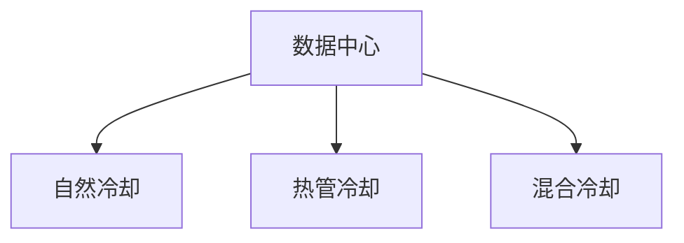

                 

# AI 大模型应用数据中心建设：数据中心绿色节能

随着人工智能(AI)和大数据技术的迅猛发展，数据中心成为了支撑AI大模型训练和推理的关键基础设施。然而，大规模数据中心的能耗问题也随之凸显，节能减排、绿色环保成为了亟需解决的重大课题。本文将从核心概念与联系、核心算法原理、项目实践、实际应用场景等多个角度，系统探讨AI大模型应用数据中心的绿色节能建设。

## 1. 背景介绍

### 1.1 问题由来
数据中心是互联网时代不可或缺的核心基础设施，提供了数据存储、计算、网络等综合服务。然而，随着AI技术的不断进步，数据中心对于AI模型的支撑作用越来越重要，但同时也带来了巨大的能源消耗问题。数据中心的PUE（Power Usage Effectiveness，能效比）普遍较高，约为1.5到2.0，而理想PUE应为1.0，即数据中心总输入功率的1/3是用于计算，其余2/3用于空调和照明。

### 1.2 问题核心关键点
在AI大模型应用的背景下，数据中心节能减排问题显得尤为迫切。主要原因包括：
- AI模型需要庞大的计算资源，例如GPT-3等大规模模型，训练一次的耗电量可达百万千瓦时，对数据中心的能耗提出了更高要求。
- 随着数据量的不断增长，数据中心需要存储和管理的数据量呈指数级增长，带来更大的能源需求。
- 数据中心的IT设备和制冷设备能耗是其主要能耗来源，如何优化这些设备，降低整体能耗，成为节能减排的关键。

## 2. 核心概念与联系

### 2.1 核心概念概述

为更好地理解数据中心绿色节能的实现方法，本节将介绍几个密切相关的核心概念：

- 数据中心(Data Center)：一种集中管理和运算数据的设施，包含计算、存储、网络、冷却等多个子系统。
- 能效比(Power Usage Effectiveness, PUE)：衡量数据中心能源效率的指标，即数据中心总能耗与IT设备能耗的比值。
- 自然冷却(Natural Cooling)：利用自然环境（如水体、风、大地）进行冷却，降低数据中心的能耗。
- 热管冷却(Thermal Management)：使用热管技术将热量从热源快速传输到散热器，有效降低数据中心温度。
- 混合冷却(Hybrid Cooling)：结合传统冷却方法和自然冷却技术，综合控制数据中心温度，优化能耗。

这些核心概念之间的逻辑关系可以通过以下Mermaid流程图来展示：



这个流程图展示了大模型应用数据中心的冷却系统核心概念及其之间的关系：

1. 数据中心通过自然冷却、热管冷却和混合冷却等多种方式进行降温。
2. 自然冷却利用外部自然环境进行冷却，适用于气候条件良好的区域。
3. 热管冷却通过热管技术将热量快速传递，适用于小型数据中心。
4. 混合冷却结合传统冷却与自然冷却技术，适用于气候条件多样和规模较大的数据中心。

## 3. 核心算法原理 & 具体操作步骤

### 3.1 算法原理概述

AI大模型应用数据中心的绿色节能建设，本质上是一个多目标优化问题，涉及到计算效率、能耗、冷却效率等多个维度。其核心思想是：在保证计算性能的前提下，优化数据中心的整体能耗，最大化自然冷却与热管冷却的比例，降低PUE值。

形式化地，假设数据中心的计算任务为 $T$，计算功耗为 $P_C$，冷却系统功耗为 $P_L$，PUE为 $U$，优化目标为：

$$
\min_{T, P_C, P_L} U = \frac{P_C + P_L}{P_C}
$$

其中 $P_C + P_L$ 为数据中心的总功耗，$P_C$ 为IT设备功耗，$P_L$ 为冷却系统功耗。

### 3.2 算法步骤详解

数据中心的绿色节能建设一般包括以下几个关键步骤：

**Step 1: 设计数据中心基础设施**
- 设计合理的硬件布局，优化数据中心的服务器、存储设备、网络设备等IT设备的摆放位置。
- 选择合适的冷却系统，根据气候条件和数据中心规模，确定自然冷却、热管冷却和混合冷却的比例。

**Step 2: 计算功耗分析**
- 使用能耗监测工具，实时监测数据中心的电力消耗、IT设备和冷却系统的功耗。
- 通过建模和仿真，评估不同配置和策略下的能耗情况。

**Step 3: 冷却系统优化**
- 调整冷却系统的工作模式，增加自然冷却比例，减少热管冷却的运行时间。
- 优化冷却系统内部的布局和参数设置，提高冷却效率。

**Step 4: 绿色计算策略**
- 采用高效的绿色计算技术，如动态电压频率调整(Dynamic Voltage and Frequency Scaling, DVFS)、基于硬件的机器学习加速等。
- 优化计算任务调度，减少计算设备的空闲时间，提高计算资源的利用率。

**Step 5: 数据中心运维优化**
- 实时监控数据中心的状态，及时调整能耗策略。
- 引入智能运维技术，自动调整冷却系统和IT设备的能耗，实现节能减排。

### 3.3 算法优缺点

数据中心绿色节能建设方法具有以下优点：
1. 降低能耗。通过优化冷却系统和计算资源，有效降低数据中心的总功耗，减少碳排放。
2. 提高能效。提高计算资源的利用率，降低IT设备的空闲时间，提升数据中心的整体能效。
3. 减少运维成本。通过智能运维技术，自动调整冷却系统和IT设备的能耗，减少人工运维的投入。

同时，该方法也存在一定的局限性：
1. 初期投资高。建设自然冷却系统或热管冷却系统，需要较高的初始投资。
2. 对气候条件要求高。自然冷却适用于气候条件良好的区域，而热管冷却技术应用场景有限。
3. 冷却系统复杂。混合冷却系统需要综合多种冷却技术，设计和运维复杂。
4. 计算资源优化难度大。优化计算任务调度和计算资源分配，需要更复杂的管理和监控机制。

尽管存在这些局限性，但就目前而言，数据中心绿色节能建设仍然是AI大模型应用的关键技术之一。未来相关研究的重点在于如何进一步降低冷却系统的初始投资和运行成本，提高自然冷却和热管冷却技术的普及率，同时兼顾计算性能和能耗优化等因素。

### 3.4 算法应用领域

数据中心绿色节能技术广泛应用于各类AI大模型应用场景，包括：

- 云计算平台：通过优化冷却系统和计算资源，提升云计算服务的能效。
- 数据存储系统：降低存储系统的能耗，提高数据存储的环保性。
- 高计算密集型应用：如深度学习模型训练、图像处理、科学研究等，优化计算资源和冷却系统，提升计算效率和能效。
- 边缘计算节点：在分布式系统中，优化边缘节点的能耗和冷却，降低整体系统的能耗和延迟。

## 4. 数学模型和公式 & 详细讲解 & 举例说明

### 4.1 数学模型构建

本节将使用数学语言对数据中心绿色节能的优化过程进行更加严格的刻画。

假设数据中心的计算任务为 $T$，计算功耗为 $P_C$，冷却系统功耗为 $P_L$，PUE为 $U$。优化目标是最小化PUE值，即：

$$
\min_{P_C, P_L} U = \frac{P_C + P_L}{P_C}
$$

设 $U_0$ 为初始PUE值，$P_L_0$ 为初始冷却系统功耗。若通过优化策略将冷却系统功耗降低到 $P_L$，则PUE值的变化为：

$$
\Delta U = \frac{P_C + P_L}{P_C} - \frac{P_C + P_L_0}{P_C} = \frac{P_L - P_L_0}{P_C}
$$

即每减少1单位冷却系统功耗，PUE值减少 $\frac{1}{P_C}$ 单位。

### 4.2 公式推导过程

对于具体的优化策略，我们可以将其表示为冷却系统功耗的变化量 $\Delta P_L$，则有：

$$
\Delta U = \frac{\Delta P_L}{P_C}
$$

其中 $\Delta P_L$ 通常包括自然冷却技术的应用、热管冷却技术的应用、混合冷却技术的应用等多种方式。例如，假设数据中心通过应用自然冷却技术，将冷却系统功耗从 $P_L_0$ 降低到 $P_L$，则有：

$$
\Delta P_L = P_L_0 - P_L
$$

代入上式得：

$$
\Delta U = \frac{P_L_0 - P_L}{P_C}
$$

其中 $P_C$ 为数据中心的IT设备功耗。在实际应用中，我们需要根据具体的数据中心规模和计算任务需求，选择合适的冷却技术，并计算相应的 $\Delta P_L$，从而得到优化的PUE值。

### 4.3 案例分析与讲解

以某数据中心为例，假设其初始PUE为1.8，计算功耗为200kW，冷却系统功耗为400kW。通过优化，使其采用50%的自然冷却技术，则冷却系统功耗降低为300kW，优化后的PUE为：

$$
U = \frac{200 + 300}{200} = 1.5
$$

优化后的PUE值比初始值减少了0.3，显著降低了数据中心的能耗。

## 5. 项目实践：代码实例和详细解释说明

### 5.1 开发环境搭建

在进行绿色节能项目实践前，我们需要准备好开发环境。以下是使用Python进行开发的环境配置流程：

1. 安装Anaconda：从官网下载并安装Anaconda，用于创建独立的Python环境。

2. 创建并激活虚拟环境：
```bash
conda create -n ai-data-center python=3.8 
conda activate ai-data-center
```

3. 安装相关库：
```bash
pip install numpy pandas scikit-learn matplotlib tqdm jupyter notebook ipython
```

完成上述步骤后，即可在`ai-data-center`环境中开始项目实践。

### 5.2 源代码详细实现

以下是一个使用Python实现的简单数据中心能耗优化示例代码，包含对PUE的计算和优化策略的模拟。

```python
from sympy import symbols, Eq, solve

# 定义符号
P_C, P_L, U_initial, U_optimal, delta_U, delta_P_L = symbols('P_C P_L U_initial U_optimal delta_U delta_P_L')

# 定义初始条件
U_initial = 1.8  # 初始PUE值
P_C = 200  # 初始计算功耗
P_L_initial = 400  # 初始冷却系统功耗

# 定义优化目标
U_optimal = U_initial - delta_U
delta_U = delta_P_L / P_C  # 计算PUE变化的公式

# 假设采用50%的自然冷却技术
delta_P_L = P_L_initial / 2  # 冷却系统功耗降低至初始值的一半

# 求解优化后的PUE
U_optimal = U_initial - delta_U.subs(delta_P_L, delta_P_L)

print(f"初始PUE: {U_initial}")
print(f"优化后PUE: {U_optimal}")
```

### 5.3 代码解读与分析

让我们再详细解读一下关键代码的实现细节：

**符号定义**：
- 定义了多个符号变量，包括计算功耗 $P_C$，冷却系统功耗 $P_L$，初始PUE值 $U_initial$，优化后的PUE值 $U_optimal$，PUE变化量 $\delta_U$ 和冷却系统功耗变化量 $\delta_P_L$。

**初始条件**：
- 初始化数据中心的计算功耗 $P_C$ 和冷却系统功耗 $P_L_initial$，以及初始PUE值 $U_initial$。

**优化目标**：
- 计算优化后的PUE值 $U_optimal$，假设采用50%的自然冷却技术，计算系统功耗变化量 $\delta_P_L$，并代入PUE变化量公式 $\delta_U$ 中。

**求解优化后的PUE**：
- 根据优化目标和初始条件，求解优化后的PUE值。

**输出结果**：
- 输出初始PUE值和优化后的PUE值，计算优化效果。

可以看到，Python代码简单明了，通过符号运算实现了PUE的计算和优化。这种计算方式可以方便地推广到更复杂的数据中心模型中，实现更高效的节能优化。

## 6. 实际应用场景

### 6.1 云计算平台

云计算平台是当前数据中心的主要应用场景之一，通过优化冷却系统和计算资源，可以有效降低云计算服务的能耗，提升用户体验。

具体而言，云计算平台可以通过多种策略实现绿色节能：
- 采用高效冷却技术：如自然冷却、热管冷却等，降低冷却系统的功耗。
- 优化计算任务调度：通过动态调整计算任务的优先级和负载分配，提高计算资源的利用率。
- 引入智能运维系统：实时监测数据中心的运行状态，自动调整冷却系统和IT设备的能耗，实现节能减排。

### 6.2 数据存储系统

数据存储系统在数据中心的能耗占比也较大，优化存储系统的能耗可以显著降低数据中心的整体能耗。

具体而言，数据存储系统可以通过以下方式实现绿色节能：
- 采用高效存储介质：如SSD硬盘、NVMe存储等，降低存储系统的功耗。
- 优化存储任务调度：通过动态调整存储任务的优先级和负载分配，提高存储系统的利用率。
- 引入智能存储系统：实时监测存储系统的运行状态，自动调整存储设备的能耗，实现节能减排。

### 6.3 高计算密集型应用

高计算密集型应用如深度学习模型训练、图像处理、科学研究等，对计算资源和冷却系统的需求较高，优化其能耗具有重要意义。

具体而言，高计算密集型应用可以通过以下方式实现绿色节能：
- 采用高效计算硬件：如GPU、FPGA等，提高计算效率，降低能耗。
- 优化计算任务调度：通过动态调整计算任务的优先级和负载分配，提高计算资源的利用率。
- 引入智能计算系统：实时监测计算系统的运行状态，自动调整计算设备的能耗，实现节能减排。

### 6.4 边缘计算节点

边缘计算节点在分布式系统中扮演重要角色，优化其能耗可以显著降低整体系统的能耗和延迟。

具体而言，边缘计算节点可以通过以下方式实现绿色节能：
- 采用高效边缘计算硬件：如IoT设备、嵌入式计算等，降低边缘节点的功耗。
- 优化边缘计算任务调度：通过动态调整边缘计算任务的优先级和负载分配，提高边缘节点的利用率。
- 引入智能边缘计算系统：实时监测边缘计算节点的运行状态，自动调整边缘节点的能耗，实现节能减排。

## 7. 工具和资源推荐

### 7.1 学习资源推荐

为了帮助开发者系统掌握数据中心绿色节能的理论基础和实践技巧，这里推荐一些优质的学习资源：

1. 《数据中心能源管理》系列书籍：由权威机构出版，系统介绍了数据中心能耗管理的理论基础和实践方法。
2. 《高效冷却技术》课程：由知名大学或研究机构开设的在线课程，深入讲解了数据中心冷却技术的最新进展。
3. 《智能运维技术》书籍：介绍了智能运维技术在数据中心中的应用，包括实时监测、自动控制等。
4. 数据中心能效管理网站：如EnergyStar、Open Compute Project等，提供大量关于数据中心能效管理的最新资讯和案例分析。
5. 开源能效管理工具：如Open Compute Labs、Green Energy Metrics等，提供高效能管理和节能优化工具。

通过对这些资源的学习实践，相信你一定能够快速掌握数据中心绿色节能的精髓，并用于解决实际问题。

### 7.2 开发工具推荐

高效的开发离不开优秀的工具支持。以下是几款用于数据中心绿色节能开发的常用工具：

1. Python：由于其灵活性和强大的数据处理能力，Python是数据中心能效管理开发的首选语言。
2. Jupyter Notebook：用于编写和分享数据中心能效管理的分析代码和报告。
3. TensorBoard：用于实时监测数据中心的能耗数据，提供直观的可视化展示。
4. Grafana：用于构建数据中心能效管理的仪表盘，实时监控关键性能指标。
5. Ansys Fluent：用于仿真和优化数据中心的冷却系统，提供详细的冷却效果模拟和优化建议。

合理利用这些工具，可以显著提升数据中心绿色节能的开发效率，加快创新迭代的步伐。

### 7.3 相关论文推荐

数据中心绿色节能技术的发展源于学界的持续研究。以下是几篇奠基性的相关论文，推荐阅读：

1. "Data Center Energy Efficiency: A Survey"（数据中心能效管理综述）：详细介绍了数据中心能效管理的理论、技术、挑战和未来方向。
2. "A Survey on Data Center Green Cooling Technologies"（数据中心绿色冷却技术综述）：系统综述了数据中心冷却技术的最新进展和应用场景。
3. "Optimization of Data Center Energy Consumption Using Machine Learning"（数据中心能耗优化研究）：探讨了机器学习在数据中心能耗优化中的应用。
4. "A Review of Dynamic Voltage and Frequency Scaling Techniques"（动态电压频率调整技术综述）：详细介绍了动态电压频率调整技术的实现方法和应用效果。
5. "Energy-Efficient Data Center Operations"（节能高效的数据中心操作）：介绍了数据中心节能运营的最新实践和经验。

这些论文代表了大模型应用数据中心绿色节能技术的发展脉络。通过学习这些前沿成果，可以帮助研究者把握学科前进方向，激发更多的创新灵感。

## 8. 总结：未来发展趋势与挑战

### 8.1 总结

本文对基于大模型应用的数据中心绿色节能建设进行了全面系统的介绍。首先阐述了数据中心绿色节能的研究背景和意义，明确了优化数据中心能耗的重要性。其次，从原理到实践，详细讲解了绿色节能的数学模型和核心算法，给出了优化策略的代码实例。同时，本文还广泛探讨了绿色节能在云计算、数据存储、高计算密集型应用、边缘计算等多个场景中的应用前景，展示了绿色节能技术的广阔前景。

通过本文的系统梳理，可以看到，数据中心绿色节能技术正在成为AI大模型应用的重要保障。这些方向的探索发展，必将进一步提升数据中心的能效，降低碳排放，为AI技术的可持续发展提供坚实基础。

### 8.2 未来发展趋势

展望未来，数据中心绿色节能技术将呈现以下几个发展趋势：

1. 能效比持续降低。随着技术进步和设备更新，数据中心的PUE值有望进一步降低，减少能源消耗。
2. 智能运维普及。引入智能运维系统，实现对数据中心能耗的实时监控和优化，降低运维成本。
3. 冷却技术创新。新型的自然冷却和热管冷却技术不断涌现，提升数据中心的冷却效率。
4. 多模态融合。结合不同模态的数据中心设备和技术，实现更全面的节能优化。
5. 模型优化并行。引入并行计算技术，加速数据中心的能效优化和计算任务处理。

以上趋势凸显了数据中心绿色节能技术的广阔前景。这些方向的探索发展，必将进一步提升数据中心的能效，为AI技术的可持续发展提供坚实基础。

### 8.3 面临的挑战

尽管数据中心绿色节能技术已经取得了显著进展，但在迈向更加智能化、普适化应用的过程中，它仍面临着诸多挑战：

1. 初期投资高。建设自然冷却系统或热管冷却系统，需要较高的初始投资。
2. 对气候条件要求高。自然冷却适用于气候条件良好的区域，而热管冷却技术应用场景有限。
3. 冷却系统复杂。混合冷却系统需要综合多种冷却技术，设计和运维复杂。
4. 计算资源优化难度大。优化计算任务调度和计算资源分配，需要更复杂的管理和监控机制。
5. 数据中心建设周期长。数据中心的建设周期长，短期内难以实现大规模部署。

尽管存在这些挑战，但就目前而言，数据中心绿色节能建设仍然是AI大模型应用的关键技术之一。未来相关研究的重点在于如何进一步降低冷却系统的初始投资和运行成本，提高自然冷却和热管冷却技术的普及率，同时兼顾计算性能和能耗优化等因素。

### 8.4 研究展望

面向未来，数据中心绿色节能技术还需要与其他AI技术进行更深入的融合，如知识表示、因果推理、强化学习等，多路径协同发力，共同推动数据中心的可持续发展。具体而言，未来的研究方向包括：

1. 结合大数据和人工智能技术，实现数据中心的预测性运维，提前识别和处理潜在故障。
2. 引入机器学习和深度学习技术，优化数据中心的能耗模型和调度策略，实现更高效的节能优化。
3. 探索新型的冷却技术和设备，如相变冷却、液冷技术等，提升数据中心的冷却效率。
4. 引入自然语言处理技术，实现对数据中心运维日志的智能分析和决策支持。
5. 结合区块链和智能合约技术，建立数据中心的绿色节能激励机制，鼓励更多企业参与节能减排。

这些研究方向的探索，必将引领数据中心绿色节能技术迈向更高的台阶，为AI技术的可持续发展提供坚实保障。相信随着技术的不断进步，数据中心绿色节能技术必将更加成熟和普及，为全球可持续发展贡献力量。

## 9. 附录：常见问题与解答

**Q1：数据中心绿色节能的实现方法有哪些？**

A: 数据中心的绿色节能实现方法包括但不限于：
1. 自然冷却：利用自然环境进行冷却，适用于气候条件良好的区域。
2. 热管冷却：使用热管技术将热量快速传输到散热器，适用于小型数据中心。
3. 混合冷却：结合传统冷却方法和自然冷却技术，适用于气候条件多样和规模较大的数据中心。
4. 优化计算资源：采用高效计算硬件和算法，提高计算资源的利用率。
5. 智能运维：实时监测数据中心的运行状态，自动调整冷却系统和IT设备的能耗，实现节能减排。

**Q2：如何优化数据中心的冷却系统？**

A: 数据中心的冷却系统优化可以从以下几个方面进行：
1. 设计合理的硬件布局，优化数据中心的服务器、存储设备、网络设备等IT设备的摆放位置。
2. 选择适合的冷却技术，根据气候条件和数据中心规模，确定自然冷却、热管冷却和混合冷却的比例。
3. 调整冷却系统的工作模式，增加自然冷却比例，减少热管冷却的运行时间。
4. 优化冷却系统内部的布局和参数设置，提高冷却效率。

**Q3：数据中心绿色节能的优化目标是什么？**

A: 数据中心绿色节能的优化目标是降低数据中心的能耗，提高数据中心的能效，即通过优化冷却系统和计算资源，降低PUE值。PUE是衡量数据中心能源效率的指标，即数据中心总能耗与IT设备能耗的比值。

**Q4：数据中心绿色节能技术在实际应用中面临哪些挑战？**

A: 数据中心绿色节能技术在实际应用中面临以下挑战：
1. 初期投资高：建设自然冷却系统或热管冷却系统，需要较高的初始投资。
2. 对气候条件要求高：自然冷却适用于气候条件良好的区域，而热管冷却技术应用场景有限。
3. 冷却系统复杂：混合冷却系统需要综合多种冷却技术，设计和运维复杂。
4. 计算资源优化难度大：优化计算任务调度和计算资源分配，需要更复杂的管理和监控机制。
5. 数据中心建设周期长：数据中心的建设周期长，短期内难以实现大规模部署。

**Q5：数据中心绿色节能技术未来有哪些发展方向？**

A: 数据中心绿色节能技术未来的发展方向包括但不限于：
1. 能效比持续降低：随着技术进步和设备更新，数据中心的PUE值有望进一步降低。
2. 智能运维普及：引入智能运维系统，实现对数据中心能耗的实时监控和优化。
3. 冷却技术创新：新型的自然冷却和热管冷却技术不断涌现，提升数据中心的冷却效率。
4. 多模态融合：结合不同模态的数据中心设备和技术，实现更全面的节能优化。
5. 模型优化并行：引入并行计算技术，加速数据中心的能效优化和计算任务处理。

总之，数据中心绿色节能技术还需要进一步的创新和优化，以适应未来的能源需求和可持续发展要求。

