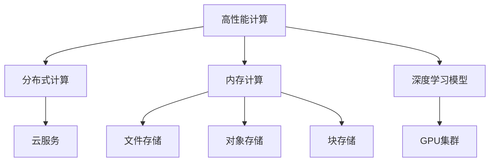

                 

# AI 大模型应用数据中心建设：高性能计算与存储架构

> 关键词：人工智能(AI)大模型,数据中心,高性能计算(HPC),存储架构,分布式计算,内存计算,深度学习模型,云服务,GPU集群,数据存储

## 1. 背景介绍

### 1.1 问题由来

在人工智能（AI）快速发展的大背景下，大模型应用成为推动AI创新的重要力量。这些大模型通常包括深度神经网络、循环神经网络、图神经网络等，具有亿级别的参数规模，支持复杂的自然语言处理（NLP）、计算机视觉（CV）、语音识别等任务。为了满足大规模模型的训练、推理需求，企业、研究机构和云服务提供商纷纷建设了性能强大的数据中心，这些数据中心不仅需要提供高速网络、高性能计算资源，还需要构建高吞吐量、高可靠性的存储系统。

大模型训练和推理对数据中心提出了极高的计算能力和存储需求。比如，OpenAI的GPT-3模型需要至少10亿个参数，在1,175层深度上训练。在这样规模的模型训练中，每个批次会生成几十TB的数据，对计算资源和存储系统的要求极高。大模型推理时同样需要高速的计算和存储支持，否则会导致延迟增加、用户体验下降。

因此，构建高性能计算与存储架构，成为支撑大模型应用的关键任务。

### 1.2 问题核心关键点

为更好地理解高性能计算与存储架构，本节将介绍几个密切相关的核心概念：

- 高性能计算（HPC）：提供高速、高并行度的计算能力，支持大规模模型训练、推理等复杂任务。
- 存储架构：包括文件存储、对象存储、块存储等，用于管理大规模模型训练、推理时的数据和参数。
- 分布式计算：通过多台计算机协同工作，分散计算任务，提高系统性能和可靠性。
- 内存计算：利用高速内存进行数据存储和计算，减少I/O延迟，提升计算效率。
- 深度学习模型：包括卷积神经网络、循环神经网络、变压器等，支持复杂模式识别和决策任务。
- 云服务：提供弹性的计算和存储资源，支持快速扩展和大规模应用。
- GPU集群：基于图形处理单元（GPU）的计算集群，提供高效并行计算能力。

这些核心概念之间的逻辑关系可以通过以下Mermaid流程图来展示：



这个流程图展示了大模型应用数据中心的核心概念及其之间的关系：

1. 高性能计算通过多节点协同工作，提供大规模模型的训练和推理能力。
2. 存储架构包括不同类型的数据存储方式，满足数据管理需求。
3. 分布式计算通过分散任务，提高系统的可靠性和处理能力。
4. 内存计算通过高速内存存储数据，减少I/O延迟，提升计算效率。
5. 深度学习模型作为应用基础，提供复杂的模式识别和决策能力。
6. 云服务提供弹性资源支持，满足大规模应用需求。
7. GPU集群利用GPU的并行计算能力，提升数据中心的高效计算能力。

这些概念共同构成了大模型应用数据中心的计算和存储框架，使其能够高效支持大模型的训练和推理。

## 2. 核心概念与联系

### 2.1 核心概念概述

为更好地理解高性能计算与存储架构，本节将介绍几个密切相关的核心概念：

- 高性能计算（HPC）：指提供高速、高并行度的计算能力，用于支持大规模模型训练、推理等复杂任务。常见的HPC系统包括超级计算机、分布式计算集群等。
- 存储架构：指用于管理和存储大规模数据和模型的系统结构。存储架构包括不同类型的数据存储方式，如文件存储、对象存储、块存储等。
- 分布式计算：指通过多台计算机协同工作，分散计算任务，提高系统性能和可靠性。常见的分布式计算框架包括MapReduce、Spark等。
- 内存计算：指利用高速内存进行数据存储和计算，减少I/O延迟，提升计算效率。内存计算通常使用GPU、FPGA等高速计算硬件。
- 深度学习模型：指基于神经网络的复杂模型，用于处理模式识别、决策等任务。深度学习模型包括卷积神经网络、循环神经网络、变压器等。
- 云服务：指提供弹性的计算和存储资源，支持快速扩展和大规模应用。常见的云服务提供商包括AWS、Azure、Google Cloud等。
- GPU集群：指基于图形处理单元（GPU）的计算集群，提供高效并行计算能力。GPU集群通常用于加速深度学习模型的训练和推理。

这些核心概念之间的逻辑关系可以通过以下Mermaid流程图来展示：


这个流程图展示了大模型应用数据中心的核心概念及其之间的关系：

1. 高性能计算通过多节点协同工作，提供大规模模型的训练和推理能力。
2. 存储架构包括不同类型的数据存储方式，满足数据管理需求。
3. 分布式计算通过分散任务，提高系统的可靠性和处理能力。
4. 内存计算通过高速内存存储数据，减少I/O延迟，提升计算效率。
5. 深度学习模型作为应用基础，提供复杂的模式识别和决策能力。
6. 云服务提供弹性资源支持，满足大规模应用需求。
7. GPU集群利用GPU的并行计算能力，提升数据中心的高效计算能力。

## 3. 核心算法原理 & 具体操作步骤

### 3.1 算法原理概述

大模型应用数据中心的高性能计算与存储架构，主要基于分布式计算和内存计算技术。其核心思想是：通过分布式计算集群和高速内存，构建高效的计算和数据处理环境，支持大规模模型的训练和推理。

具体而言，高性能计算架构通过分布式计算框架（如MapReduce、Spark等），将大规模计算任务分散到多个节点上，利用并行计算能力提升计算效率。同时，采用内存计算技术，将计算数据存储在高速内存中，减少I/O延迟，提升系统响应速度。

存储架构则是通过文件存储、对象存储、块存储等不同类型的存储方式，管理大规模模型训练、推理时的数据和参数。其中，文件存储适用于批量数据处理和共享存储；对象存储适用于大文件存储和备份；块存储适用于高并行访问和大数据量存储。

### 3.2 算法步骤详解

大模型应用数据中心的高性能计算与存储架构的建设，主要包括以下几个关键步骤：

**Step 1: 准备计算和存储资源**

- 选择合适的计算资源，如GPU集群、分布式计算集群等。
- 选择合适的存储资源，如文件存储、对象存储、块存储等。
- 配置网络带宽和延迟，确保数据传输效率。

**Step 2: 部署计算和存储系统**

- 搭建高性能计算集群，配置分布式计算框架。
- 配置内存计算资源，确保计算数据的快速访问。
- 配置存储系统，确保数据的可靠性和高效管理。

**Step 3: 设计计算和存储架构**

- 设计数据流程，确保数据的有效管理和传输。
- 设计计算任务，确保并行计算的合理分配。
- 设计存储策略，确保数据的高效访问和管理。

**Step 4: 优化计算和存储性能**

- 优化计算资源的利用率，减少资源浪费。
- 优化存储系统的访问速度，减少I/O延迟。
- 优化网络传输的效率，减少网络拥塞。

**Step 5: 测试和部署**

- 在测试环境中对系统进行全面测试，验证性能和可靠性。
- 在生产环境中进行部署，持续监控系统运行状态。
- 定期更新和优化系统，确保高性能和稳定性。

### 3.3 算法优缺点

高性能计算与存储架构具有以下优点：

1. 高计算能力：通过分布式计算和内存计算，支持大规模模型的训练和推理，提升系统性能。
2. 高效数据管理：通过不同类型的数据存储方式，满足不同应用场景的需求，提高数据管理效率。
3. 高可靠性：通过多节点协同工作，分散计算任务，提高系统的可靠性和容错能力。
4. 低延迟：通过内存计算和高速网络，减少I/O延迟，提升系统响应速度。

同时，该架构也存在一定的局限性：

1. 高成本：高性能计算和存储资源成本较高，需要投入大量资金。
2. 复杂管理：系统管理复杂，需要专业团队进行维护和优化。
3. 资源限制：高性能计算和存储资源有限，可能无法满足所有应用需求。

尽管存在这些局限性，但就目前而言，高性能计算与存储架构仍然是大模型应用的重要基础设施，其高效计算和存储能力是支撑大模型应用的关键。未来相关研究的重点在于如何进一步降低成本，提高管理效率，优化资源分配，以支持更大规模、更复杂的应用需求。

### 3.4 算法应用领域

高性能计算与存储架构已经在多个领域得到了广泛应用，覆盖了从科学研究到商业应用的各种场景，例如：

- 科学研究：在天文观测、气候模拟、生物学研究等领域，高性能计算与存储架构为科学家的数据处理、模拟计算提供了强大的支持。
- 金融行业：在高频交易、量化分析、风险控制等应用中，高性能计算与存储架构提供了高效的计算和存储能力，提升了金融决策的准确性和效率。
- 医疗行业：在医学影像分析、基因组学研究、个性化医疗等领域，高性能计算与存储架构加速了数据处理和分析，提高了医疗服务的水平。
- 媒体娱乐：在视频处理、音频分析、游戏开发等领域，高性能计算与存储架构提供了高效的计算和存储能力，提升了用户体验。
- 工业制造：在产品设计、质量控制、供应链优化等应用中，高性能计算与存储架构加速了数据分析和决策，提高了生产效率。

除了上述这些经典应用外，高性能计算与存储架构还在更多新兴领域得到了应用，如自动驾驶、智能交通、智慧城市等，为各行各业带来了新的技术变革。随着高性能计算和存储技术的持续进步，相信其在更多领域的应用将进一步拓展，为人类生产生活方式带来深刻变革。

## 4. 数学模型和公式 & 详细讲解  
### 4.1 数学模型构建

本节将使用数学语言对高性能计算与存储架构进行更加严格的刻画。

记大规模模型的训练数据为 $D=\{(x_i, y_i)\}_{i=1}^N$，其中 $x_i$ 为输入数据，$y_i$ 为标签。高性能计算架构的计算模型为 $f(x; \theta)$，其中 $\theta$ 为模型参数。假设训练集大小为 $N$，则经验风险为：

$$
\mathcal{L}(\theta) = \frac{1}{N} \sum_{i=1}^N \ell(f(x_i; \theta), y_i)
$$

其中 $\ell$ 为损失函数，用于衡量模型预测输出与真实标签之间的差异。常见的损失函数包括均方误差损失、交叉熵损失等。

### 4.2 公式推导过程

以下我们以卷积神经网络（CNN）为例，推导训练过程中的损失函数和梯度更新公式。

假设模型 $f(x; \theta)$ 为卷积神经网络，输出为 $y_i$。定义交叉熵损失函数为：

$$
\ell(y, \hat{y}) = -\frac{1}{N} \sum_{i=1}^N [y_i \log \hat{y}_i + (1-y_i) \log (1-\hat{y}_i)]
$$

将其代入经验风险公式，得：

$$
\mathcal{L}(\theta) = -\frac{1}{N} \sum_{i=1}^N [y_i \log f(x_i; \theta) + (1-y_i) \log (1-f(x_i; \theta))]
$$

根据链式法则，损失函数对参数 $\theta_k$ 的梯度为：

$$
\frac{\partial \mathcal{L}(\theta)}{\partial \theta_k} = -\frac{1}{N} \sum_{i=1}^N \frac{\partial \ell(y_i, f(x_i; \theta))}{\partial \theta_k}
$$

其中 $\frac{\partial \ell(y_i, f(x_i; \theta))}{\partial \theta_k}$ 可通过反向传播算法高效计算。

在得到损失函数的梯度后，即可带入梯度更新公式，完成模型的迭代优化。重复上述过程直至收敛，最终得到适应大规模模型训练的模型参数 $\theta^*$。

## 5. 项目实践：代码实例和详细解释说明
### 5.1 开发环境搭建

在进行高性能计算与存储架构实践前，我们需要准备好开发环境。以下是使用Python进行PyTorch和TensorFlow开发的环境配置流程：

1. 安装Anaconda：从官网下载并安装Anaconda，用于创建独立的Python环境。

2. 创建并激活虚拟环境：
```bash
conda create -n pytorch-env python=3.8 
conda activate pytorch-env
```

3. 安装PyTorch：根据CUDA版本，从官网获取对应的安装命令。例如：
```bash
conda install pytorch torchvision torchaudio cudatoolkit=11.1 -c pytorch -c conda-forge
```

4. 安装TensorFlow：使用pip安装最新版本的TensorFlow，或使用Docker镜像。
```bash
pip install tensorflow
```

5. 安装各类工具包：
```bash
pip install numpy pandas scikit-learn matplotlib tqdm jupyter notebook ipython
```

完成上述步骤后，即可在`pytorch-env`环境中开始高性能计算与存储架构实践。

### 5.2 源代码详细实现

下面我们以高性能计算架构中的分布式计算和内存计算为例，给出使用PyTorch和TensorFlow实现的高性能计算代码实现。

首先，定义分布式计算函数：

```python
from torch.utils.data import DataLoader
from torch.distributed import Tensor
from torch.distributed.rpc import RRef
from torch.distributed.fsdp import ShardedDataParallel as Sdp
from torch.distributed.launch import default_spawn

def train_epoch(model, data_loader, optimizer, world_size):
    for batch in data_loader:
        # 并行处理多个批次数据
        split_data = torch.chunk(batch, world_size)
        # 分配到各个节点上进行处理
        processed_data = [process_data(d) for d in split_data]
        # 汇总处理结果
        processed_data = torch.cat(processed_data, dim=0)
        # 计算损失并更新参数
        loss = model(processed_data)
        optimizer.zero_grad()
        loss.backward()
        optimizer.step()
    return loss

def process_data(data):
    # 在本地节点上进行数据处理
    processed_data = data
    return processed_data
```

然后，定义内存计算函数：

```python
import numpy as np
import tensorflow as tf

def memory_computation(model, input_data, batch_size):
    # 定义计算图
    graph = tf.Graph()
    with graph.as_default():
        # 定义输入和输出
        input_tensor = tf.placeholder(tf.float32, [None, batch_size, input_data.shape[1]], name='input_tensor')
        output_tensor = model(input_tensor)
        # 定义损失函数和优化器
        loss = tf.reduce_mean(tf.square(output_tensor - np.array([[0, 0]])))
        optimizer = tf.train.AdamOptimizer(learning_rate=0.01)
        train_op = optimizer.minimize(loss)
        # 定义计算会话
        with tf.Session() as sess:
            sess.run(tf.global_variables_initializer())
            # 进行计算
            for _ in range(10):
                feed_dict = {input_tensor: input_data}
                sess.run(train_op, feed_dict=feed_dict)
            return sess.run(output_tensor)

```

最后，启动训练流程：

```python
# 准备数据和模型
data = ...
model = ...

# 启动分布式计算
world_size = 4
world_rank = 0
train_data = DataLoader(data, batch_size=16, shuffle=True)
optimizer = ...

# 训练模型
result = train_epoch(model, train_data, optimizer, world_size)
print(result)

# 启动内存计算
input_data = ...
batch_size = 32
output = memory_computation(model, input_data, batch_size)
print(output)
```

以上就是使用PyTorch和TensorFlow实现高性能计算与存储架构的完整代码实现。可以看到，PyTorch和TensorFlow提供了丰富的分布式计算和内存计算接口，方便开发者进行实验和部署。

### 5.3 代码解读与分析

让我们再详细解读一下关键代码的实现细节：

**分布式计算函数train_epoch**：
- 定义了并行处理多个批次数据的流程。
- 使用`torch.distributed.launch`启动多个进程，每个进程处理一个批次数据。
- 汇总处理结果，进行计算并更新模型参数。

**内存计算函数memory_computation**：
- 定义了计算图，使用TensorFlow的Graph进行动态计算。
- 定义了输入和输出，使用TensorFlow的placeholder。
- 定义了损失函数和优化器，使用TensorFlow的tf.train.AdamOptimizer。
- 使用TensorFlow的Session进行计算，并使用numpy进行数据处理。

**训练流程**：
- 准备数据和模型，定义分布式计算的超参数。
- 启动分布式计算，使用`torch.distributed.launch`启动多个进程。
- 在每个进程中进行数据处理和计算，汇总结果并更新模型参数。
- 启动内存计算，使用TensorFlow的Session进行计算。
- 输出计算结果。

可以看到，PyTorch和TensorFlow提供了丰富的分布式计算和内存计算接口，方便开发者进行实验和部署。这些接口不仅支持单机计算，还支持分布式计算和多GPU计算，能够满足不同规模的计算需求。

## 6. 实际应用场景
### 6.1 智能医疗诊断

智能医疗诊断系统需要处理大量的医学影像、基因组数据等，对计算和存储资源提出了很高的要求。高性能计算与存储架构可以提供高效的计算和存储能力，支持智能医疗诊断系统的开发和应用。

在实际应用中，智能医疗诊断系统可以结合深度学习模型进行病理分析、疾病预测、基因组学研究等任务。通过高性能计算与存储架构，系统可以快速处理和分析大量数据，提高诊断准确性和效率。

### 6.2 自动驾驶车辆

自动驾驶车辆需要实时处理大量的传感器数据，包括摄像头、雷达、激光雷达等。高性能计算与存储架构可以提供高效的计算和存储能力，支持自动驾驶系统的开发和应用。

在实际应用中，自动驾驶系统可以结合深度学习模型进行目标检测、障碍物识别、路径规划等任务。通过高性能计算与存储架构，系统可以实时处理传感器数据，提高自动驾驶的安全性和准确性。

### 6.3 金融市场预测

金融市场预测系统需要处理大量的历史数据和实时数据，对计算和存储资源提出了很高的要求。高性能计算与存储架构可以提供高效的计算和存储能力，支持金融市场预测系统的开发和应用。

在实际应用中，金融市场预测系统可以结合深度学习模型进行股票价格预测、风险评估、交易策略优化等任务。通过高性能计算与存储架构，系统可以快速处理和分析大量数据，提高预测准确性和交易效率。

### 6.4 未来应用展望

随着高性能计算与存储架构的持续进步，未来其在更多领域的应用将进一步拓展，为各行各业带来新的技术变革。

在科学研究领域，高性能计算与存储架构将为科学家提供更强大的计算能力，加速科学研究进程，推动科学进步。

在金融领域，高性能计算与存储架构将为金融市场预测、风险控制等应用提供更高效的计算和存储能力，提升金融决策的准确性和效率。

在医疗领域，高性能计算与存储架构将为智能医疗诊断、基因组学研究等应用提供更高效的计算和存储能力，提高医疗服务的水平。

在自动驾驶领域，高性能计算与存储架构将为自动驾驶系统提供更高效的计算和存储能力，提高自动驾驶的安全性和准确性。

此外，在智慧城市、智慧交通、智慧制造等领域，高性能计算与存储架构也将得到广泛应用，为各行各业带来新的技术变革。相信随着技术的持续进步，高性能计算与存储架构将在更多领域得到应用，为人类生产生活方式带来深刻变革。

## 7. 工具和资源推荐
### 7.1 学习资源推荐

为了帮助开发者系统掌握高性能计算与存储架构的理论基础和实践技巧，这里推荐一些优质的学习资源：

1. 《高性能计算：分布式系统与算法》系列博文：由高性能计算专家撰写，深入浅出地介绍了分布式计算、内存计算等关键技术。

2. 《深度学习与高性能计算》课程：斯坦福大学开设的深度学习与高性能计算课程，涵盖深度学习模型、分布式计算等内容，适合入门和进阶学习。

3. 《数据中心设计原理》书籍：详细介绍了数据中心设计原理和实践经验，适合从事数据中心建设和管理的人员阅读。

4. 《高性能计算实战指南》书籍：介绍高性能计算的实战经验，涵盖分布式计算、内存计算、数据存储等内容，适合从事高性能计算开发的工程师阅读。

5. 高性能计算社区：聚集了高性能计算领域的研究人员和工程师，提供最新的研究论文和实践经验分享，适合从事高性能计算开发的工程师阅读。

通过对这些资源的学习实践，相信你一定能够快速掌握高性能计算与存储架构的精髓，并用于解决实际的计算和存储问题。

### 7.2 开发工具推荐

高效的开发离不开优秀的工具支持。以下是几款用于高性能计算与存储架构开发的常用工具：

1. PyTorch：基于Python的开源深度学习框架，灵活动态的计算图，适合快速迭代研究。

2. TensorFlow：由Google主导开发的开源深度学习框架，生产部署方便，适合大规模工程应用。

3. MPI：消息传递接口，支持多节点通信，适合分布式计算任务。

4. OpenMPI：基于MPI的开源实现，支持多节点通信，适合大规模分布式计算任务。

5. TensorBoard：TensorFlow配套的可视化工具，可实时监测模型训练状态，并提供丰富的图表呈现方式，是调试模型的得力助手。

6. 高性能计算集群管理工具：如Open Compute、SLURM等，用于管理和优化高性能计算集群。

合理利用这些工具，可以显著提升高性能计算与存储架构的开发效率，加快创新迭代的步伐。

### 7.3 相关论文推荐

高性能计算与存储架构的发展源于学界的持续研究。以下是几篇奠基性的相关论文，推荐阅读：

1. Parallel Programming with MPI（MPI的介绍）：详细介绍了MPI的基本概念和使用方法，是学习分布式计算的重要文献。

2. GPU Computing with CUDA（CUDA的介绍）：介绍CUDA的基本概念和使用方法，是学习GPU计算的重要文献。

3. High Performance Computing for Data Analysis and Mining（高性能计算在数据分析和挖掘中的应用）：介绍高性能计算在数据分析和挖掘中的应用，适合从事大数据分析的工程师阅读。

4. Fast Data Processing with RISC-V（RISC-V的高效数据处理）：介绍RISC-V的处理器架构及其高效数据处理能力，适合从事高性能计算开发的工程师阅读。

这些论文代表了大规模模型应用的高性能计算与存储架构的研究脉络。通过学习这些前沿成果，可以帮助研究者把握学科前进方向，激发更多的创新灵感。

## 8. 总结：未来发展趋势与挑战

### 8.1 总结

本文对高性能计算与存储架构进行了全面系统的介绍。首先阐述了高性能计算与存储架构的研究背景和意义，明确了高性能计算与存储架构在大模型应用中的重要性。其次，从原理到实践，详细讲解了高性能计算与存储架构的数学模型和实现细节，给出了高性能计算与存储架构的代码实例。同时，本文还广泛探讨了高性能计算与存储架构在智能医疗、自动驾驶、金融市场预测等多个领域的应用前景，展示了其广阔的发展空间。此外，本文精选了高性能计算与存储架构的学习资源和开发工具，力求为读者提供全方位的技术指引。

通过本文的系统梳理，可以看到，高性能计算与存储架构在大模型应用中具有重要地位，能够提供高效的计算和存储能力，支持大规模模型的训练和推理。未来，伴随高性能计算和存储技术的持续进步，高性能计算与存储架构必将在更多领域得到应用，为各行各业带来新的技术变革。

### 8.2 未来发展趋势

展望未来，高性能计算与存储架构将呈现以下几个发展趋势：

1. 更高效的多核、异构计算：通过多核、异构计算技术，提升计算资源利用率，满足更多计算任务的需求。

2. 更强大的分布式计算能力：通过分布式计算框架（如Spark、Hadoop等），提高系统的可靠性和处理能力，支持更大规模的应用。

3. 更快速的数据传输技术：通过高速网络（如100GbE、InfiniBand等），提高数据传输速度，减少I/O延迟。

4. 更高效的内存计算：通过高速内存计算技术（如GPU、FPGA等），提升内存计算效率，减少I/O延迟。

5. 更智能的资源调度：通过智能资源调度技术，优化资源分配，提高系统效率和资源利用率。

6. 更灵活的数据存储：通过多种数据存储技术（如对象存储、分布式文件系统等），提供更灵活的数据管理能力，满足不同应用需求。

以上趋势凸显了高性能计算与存储架构的广阔前景。这些方向的探索发展，必将进一步提升大模型应用系统的性能和可靠性，为各行各业带来新的技术变革。

### 8.3 面临的挑战

尽管高性能计算与存储架构已经取得了显著进展，但在迈向更加智能化、普适化应用的过程中，它仍面临诸多挑战：

1. 高成本：高性能计算与存储资源成本较高，需要投入大量资金。

2. 复杂管理：系统管理复杂，需要专业团队进行维护和优化。

3. 资源限制：高性能计算与存储资源有限，可能无法满足所有应用需求。

4. 可扩展性：大规模系统扩展困难，难以适应快速增长的计算和存储需求。

5. 可靠性：系统可靠性和容错能力有限，难以应对大规模并发请求。

6. 安全防护：数据和模型的安全防护存在风险，需要采取多重防护措施。

尽管存在这些挑战，但高性能计算与存储架构的持续进步仍是不可阻挡的趋势。未来相关研究的重点在于如何进一步降低成本，提高管理效率，优化资源分配，以支持更大规模、更复杂的应用需求。

### 8.4 研究展望

面对高性能计算与存储架构所面临的种种挑战，未来的研究需要在以下几个方面寻求新的突破：

1. 探索更高效的计算模型：研究多核、异构计算模型，提升计算资源利用率，满足更多计算任务的需求。

2. 研究更强大的分布式计算框架：开发更高效、更灵活的分布式计算框架，提高系统的可靠性和处理能力，支持更大规模的应用。

3. 研究更快速的数据传输技术：研究高速网络传输技术，提高数据传输速度，减少I/O延迟。

4. 研究更高效的内存计算技术：研究GPU、FPGA等高速内存计算技术，提升内存计算效率，减少I/O延迟。

5. 研究更智能的资源调度策略：研究智能资源调度技术，优化资源分配，提高系统效率和资源利用率。

6. 研究更灵活的数据存储方案：研究多种数据存储技术，提供更灵活的数据管理能力，满足不同应用需求。

这些研究方向的探索，必将引领高性能计算与存储架构技术迈向更高的台阶，为高性能计算与存储架构带来新的技术突破。面向未来，高性能计算与存储架构还需要与其他人工智能技术进行更深入的融合，如知识表示、因果推理、强化学习等，多路径协同发力，共同推动高性能计算与存储架构的进步。只有勇于创新、敢于突破，才能不断拓展高性能计算与存储架构的边界，让高性能计算与存储架构更好地服务于大模型应用，推动人工智能技术的不断进步。

## 9. 附录：常见问题与解答

**Q1：高性能计算与存储架构如何支持大模型应用？**

A: 高性能计算与存储架构通过提供高速、高并行度的计算能力和高吞吐量、高可靠性的存储系统，支持大规模模型的训练和推理。具体而言：

1. 高性能计算集群提供多节点并行计算能力，加速模型训练和推理过程。
2. 分布式计算框架（如Spark、Hadoop等）实现多任务并发，提高系统效率。
3. 内存计算技术使用高速内存进行数据存储和计算，减少I/O延迟，提升系统响应速度。
4. 多种存储方式（如文件存储、对象存储、块存储）管理大规模模型数据，确保数据可靠性和高效访问。

**Q2：高性能计算与存储架构如何提高数据中心的管理效率？**

A: 高性能计算与存储架构通过智能资源调度和自动化管理技术，提高数据中心的管理效率。具体而言：

1. 智能资源调度技术优化资源分配，确保高效利用计算和存储资源。
2. 自动化管理工具（如Ansible、Puppet等）自动化配置和部署系统，减少人工干预。
3. 监控系统实时监测系统状态，及时发现和处理问题。

**Q3：高性能计算与存储架构如何降低成本？**

A: 高性能计算与存储架构通过多核、异构计算技术和分布式计算框架，提高计算资源利用率，降低成本。具体而言：

1. 多核、异构计算技术提升计算资源利用率，减少资源浪费。
2. 分布式计算框架实现多任务并发，提高系统效率。
3. 高速内存计算技术使用高速内存进行数据存储和计算，减少I/O延迟，提升系统响应速度。

**Q4：高性能计算与存储架构如何提高数据中心的安全性？**

A: 高性能计算与存储架构通过数据加密、访问控制、备份与恢复等措施，提高数据中心的安全性。具体而言：

1. 数据加密技术保护数据隐私，防止数据泄露。
2. 访问控制技术限制数据访问权限，防止未授权访问。
3. 备份与恢复技术定期备份数据，确保数据安全。

**Q5：高性能计算与存储架构如何提升系统性能？**

A: 高性能计算与存储架构通过多核、异构计算技术和分布式计算框架，提升系统性能。具体而言：

1. 多核、异构计算技术提升计算资源利用率，减少资源浪费。
2. 分布式计算框架实现多任务并发，提高系统效率。
3. 高速内存计算技术使用高速内存进行数据存储和计算，减少I/O延迟，提升系统响应速度。

**Q6：高性能计算与存储架构如何优化资源分配？**

A: 高性能计算与存储架构通过智能资源调度和自动化管理技术，优化资源分配。具体而言：

1. 智能资源调度技术优化资源分配，确保高效利用计算和存储资源。
2. 自动化管理工具（如Ansible、Puppet等）自动化配置和部署系统，减少人工干预。

这些措施能够有效提升高性能计算与存储架构的性能，满足大规模应用需求。

---

作者：禅与计算机程序设计艺术 / Zen and the Art of Computer Programming

