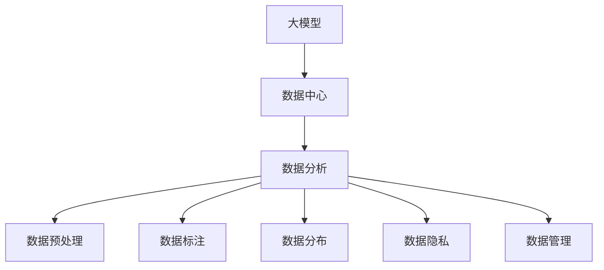

                 

# AI 大模型应用数据中心的数据分析

> 关键词：大模型，数据中心，数据分析，数据预处理，数据标注，数据分布，数据隐私

## 1. 背景介绍

### 1.1 问题由来
在当前的人工智能(AI)技术发展中，大模型（Large Models）已经成为了核心驱动力之一。这些大模型通过在海量数据上进行训练，拥有强大的表达能力和泛化能力，能够处理复杂和多样化的任务。然而，大模型的训练和部署需要大量的计算资源和存储空间，尤其是在数据中心等高计算负载的设施中。为了有效地应用这些大模型，对其在数据中心的分布和处理进行分析变得尤为重要。本文将探讨大模型应用数据中心的常见数据分析问题，并提出一些解决方案。

### 1.2 问题核心关键点
大模型应用数据中心的分析问题主要围绕以下几个核心关键点展开：
- 数据预处理：如何高效地对大规模数据进行预处理，以适应大模型的计算需求。
- 数据标注：如何在保证数据质量的前提下，高效地进行数据标注，以获得高质量的训练数据。
- 数据分布：如何分析数据中心中的数据分布情况，以便合理配置资源。
- 数据隐私：如何在保护用户隐私的同时，进行数据分析和处理。
- 数据管理：如何有效地管理数据中心中的数据，以支持大模型的持续训练和应用。

## 2. 核心概念与联系

### 2.1 核心概念概述

为了更好地理解大模型应用数据中心的分析问题，我们需要先了解一些核心概念：

- **大模型（Large Models）**：指具有数十亿甚至上百亿参数的深度学习模型，如BERT、GPT、T5等。
- **数据中心（Data Centers）**：指提供计算、存储和网络资源的设施，用于支持大规模数据处理和高性能计算任务。
- **数据分析（Data Analysis）**：指对数据集进行统计、描述、探索和建模的过程，以便提取有用信息和发现数据特征。
- **数据预处理（Data Preprocessing）**：指在数据进入模型之前，对数据进行清洗、归一化、特征选择等操作，以便提高模型性能。
- **数据标注（Data Labeling）**：指对数据集中的每个样本进行标记，以便为模型提供监督信号，指导模型学习。
- **数据分布（Data Distribution）**：指数据在数据中心中的分布情况，包括不同区域、不同设备和不同时间段的分布。
- **数据隐私（Data Privacy）**：指在数据收集、存储、传输和分析过程中，保护用户隐私不受侵犯的技术和策略。
- **数据管理（Data Management）**：指对数据中心中的数据进行组织、存储和访问管理的流程和方法。

这些核心概念之间的联系可以通过以下Mermaid流程图来展示：



这个流程图展示了大模型应用数据中心的各个环节，包括大模型的训练、数据分析、数据预处理、数据标注、数据分布、数据隐私和数据管理等。这些环节相互联系，共同构成了大模型应用数据中心的完整流程。

## 3. 核心算法原理 & 具体操作步骤
### 3.1 算法原理概述

大模型应用数据中心的分析问题主要通过以下算法原理来解决：

1. **数据预处理算法**：用于对大规模数据进行清洗、归一化和特征选择，以提高大模型的训练效率和性能。
2. **数据标注算法**：用于对数据集中的样本进行标记，以获得高质量的监督信号，指导大模型的学习。
3. **数据分布算法**：用于分析数据中心中的数据分布情况，以便合理配置资源，提高数据中心的利用率。
4. **数据隐私算法**：用于在保护用户隐私的前提下，进行数据分析和处理。
5. **数据管理算法**：用于对数据中心中的数据进行组织、存储和访问管理，以支持大模型的持续训练和应用。

这些算法原理通过具体的数学模型和操作步骤来实现。

### 3.2 算法步骤详解

#### 3.2.1 数据预处理
数据预处理的主要步骤包括：

1. **数据清洗**：删除或修正数据中的错误、噪声和缺失值，确保数据质量。
2. **数据归一化**：将数据按照特定规则进行标准化处理，如Min-Max归一化、Z-score归一化等，以提高模型的收敛速度和性能。
3. **特征选择**：根据任务的复杂度和模型的需求，选择最有用的特征进行建模。

数据预处理通常使用Python和NumPy等工具库来实现。

#### 3.2.2 数据标注
数据标注的主要步骤包括：

1. **数据收集**：收集标注数据集，如自然语言处理（NLP）任务中的文本数据集。
2. **数据标注**：使用人工或自动化的方式对数据集中的样本进行标记，如文本分类任务的标签。
3. **标注质量控制**：对标注结果进行检查和修正，确保标注数据的准确性和一致性。

数据标注通常使用众包平台、自监督学习等方法来实现。

#### 3.2.3 数据分布分析
数据分布分析的主要步骤包括：

1. **数据采集**：从数据中心中的不同设备和不同时间段采集数据，以便全面了解数据分布情况。
2. **数据可视化**：使用可视化工具（如Matplotlib、Seaborn等）对数据分布情况进行直观展示。
3. **分布分析**：分析数据中心中的数据分布特征，如数据规模、数据类型、数据来源等，以便合理配置资源。

数据分布分析通常使用Python和Jupyter Notebook等工具库来实现。

#### 3.2.4 数据隐私保护
数据隐私保护的主要步骤包括：

1. **数据匿名化**：对数据集中的个人身份信息进行匿名化处理，以保护用户隐私。
2. **数据加密**：对数据集中的敏感信息进行加密处理，以防止数据泄露。
3. **访问控制**：设置访问权限，确保只有授权用户才能访问数据。

数据隐私保护通常使用加密算法、匿名化技术等方法来实现。

#### 3.2.5 数据管理
数据管理的主要步骤包括：

1. **数据存储**：将数据存储在高效、可扩展的数据库中，如分布式文件系统（HDFS）、NoSQL数据库等。
2. **数据访问**：通过API接口或SDK访问数据，以支持大模型的训练和应用。
3. **数据备份和恢复**：定期备份数据，并设置恢复机制，以防止数据丢失。

数据管理通常使用分布式文件系统、NoSQL数据库等工具库来实现。

### 3.3 算法优缺点

#### 3.3.1 数据预处理
- **优点**：
  - 提高数据质量，降低噪声和错误。
  - 加快模型训练速度，提高模型性能。
  - 减少计算资源和存储空间的消耗。

- **缺点**：
  - 预处理过程复杂，需要投入大量时间和人力。
  - 可能会丢失部分原始数据信息，影响模型泛化能力。

#### 3.3.2 数据标注
- **优点**：
  - 提供高质量的监督信号，指导模型学习。
  - 提高模型在特定任务上的性能。
  - 支持少样本学习，降低标注成本。

- **缺点**：
  - 标注成本高，需要大量标注人员。
  - 标注数据质量依赖于标注人员的专业水平和一致性。

#### 3.3.3 数据分布分析
- **优点**：
  - 合理配置资源，提高数据中心利用率。
  - 优化数据中心中的数据分布，减少数据迁移成本。
  - 发现数据中心中的数据瓶颈，进行优化。

- **缺点**：
  - 数据分布分析过程复杂，需要大量计算资源。
  - 可能会暴露数据中心中的敏感信息。

#### 3.3.4 数据隐私保护
- **优点**：
  - 保护用户隐私，防止数据泄露。
  - 增强数据中心的安全性，提高用户信任度。
  - 满足法律法规要求，避免法律风险。

- **缺点**：
  - 数据隐私保护过程复杂，需要投入大量时间和人力。
  - 可能会影响数据处理效率，增加计算成本。

#### 3.3.5 数据管理
- **优点**：
  - 提高数据中心的数据管理效率，支持大模型的持续训练和应用。
  - 保障数据安全，防止数据泄露和损坏。
  - 支持数据备份和恢复，防止数据丢失。

- **缺点**：
  - 数据管理复杂，需要投入大量时间和人力。
  - 可能会增加数据中心的基础设施成本。

### 3.4 算法应用领域

大模型应用数据中心的分析问题广泛应用在以下领域：

1. **自然语言处理（NLP）**：通过分析大模型在NLP任务中的数据分布情况，合理配置计算资源，提高模型的训练效率和性能。
2. **计算机视觉（CV）**：通过分析大模型在CV任务中的数据分布情况，合理配置计算资源，提高模型的训练效率和性能。
3. **推荐系统**：通过分析大模型在推荐系统中的数据分布情况，合理配置计算资源，提高推荐系统的准确性和效率。
4. **智能医疗**：通过分析大模型在智能医疗中的数据分布情况，合理配置计算资源，提高模型的训练效率和性能。
5. **金融分析**：通过分析大模型在金融分析中的数据分布情况，合理配置计算资源，提高模型的训练效率和性能。
6. **智能制造**：通过分析大模型在智能制造中的数据分布情况，合理配置计算资源，提高模型的训练效率和性能。

这些领域中，大模型应用数据中心的分析问题具有广泛的应用前景。

## 4. 数学模型和公式 & 详细讲解 & 举例说明

### 4.1 数学模型构建

假设我们有一个大模型 $M$，其参数为 $\theta$，在训练集 $D$ 上进行微调，以适应特定任务 $T$。训练集 $D$ 包含 $N$ 个样本，每个样本 $(x_i, y_i)$，其中 $x_i$ 为输入数据，$y_i$ 为标签。微调的目标是找到一个最优的参数 $\hat{\theta}$，使得模型在任务 $T$ 上的预测结果与真实标签 $y_i$ 尽量接近。微调过程可以通过以下数学模型进行描述：

$$
\hat{\theta} = \mathop{\arg\min}_{\theta} \frac{1}{N} \sum_{i=1}^N \mathcal{L}(M_{\theta}(x_i), y_i)
$$

其中，$\mathcal{L}(M_{\theta}(x_i), y_i)$ 为损失函数，用于衡量模型预测结果与真实标签之间的差异。

### 4.2 公式推导过程

以二分类任务为例，假设模型 $M$ 的输出为 $z_i = M_{\theta}(x_i)$，则交叉熵损失函数为：

$$
\mathcal{L}(M_{\theta}(x_i), y_i) = -[y_i\log \hat{y}_i + (1-y_i)\log (1-\hat{y}_i)]
$$

其中，$\hat{y}_i$ 为模型在样本 $x_i$ 上的预测结果。将交叉熵损失函数代入数学模型中，得：

$$
\hat{\theta} = \mathop{\arg\min}_{\theta} \frac{1}{N} \sum_{i=1}^N \left(-[y_i\log M_{\theta}(x_i) + (1-y_i)\log (1-M_{\theta}(x_i))\right)
$$

通过反向传播算法，可以计算出模型参数 $\theta$ 的梯度，并通过优化算法（如SGD、Adam等）更新模型参数，最小化损失函数。

### 4.3 案例分析与讲解

以推荐系统为例，假设我们有一个大模型 $M$，其参数为 $\theta$，在训练集 $D$ 上进行微调，以适应推荐系统任务。训练集 $D$ 包含 $N$ 个用户-物品对，每个用户-物品对 $(x_i, y_i)$，其中 $x_i$ 为用户行为数据，$y_i$ 为用户对物品的评分。微调的目标是找到一个最优的参数 $\hat{\theta}$，使得模型在推荐系统任务上的预测结果与用户评分尽量接近。微调过程可以通过以下数学模型进行描述：

$$
\hat{\theta} = \mathop{\arg\min}_{\theta} \frac{1}{N} \sum_{i=1}^N \mathcal{L}(M_{\theta}(x_i), y_i)
$$

其中，$\mathcal{L}(M_{\theta}(x_i), y_i)$ 为损失函数，用于衡量模型预测结果与用户评分之间的差异。常见的损失函数包括均方误差损失、交叉熵损失等。

在实际应用中，推荐系统通常采用基于协同过滤的推荐方法，如矩阵分解、因子分解等。通过对用户行为数据进行预处理和特征工程，将用户行为数据转化为模型的输入 $x_i$，并通过微调过程优化模型参数 $\theta$，生成推荐结果。

## 5. 项目实践：代码实例和详细解释说明

### 5.1 开发环境搭建

在进行数据分析项目实践前，我们需要准备好开发环境。以下是使用Python进行数据分析实践的环境配置流程：

1. 安装Anaconda：从官网下载并安装Anaconda，用于创建独立的Python环境。

2. 创建并激活虚拟环境：
```bash
conda create -n py36 python=3.6 
conda activate py36
```

3. 安装必要的库：
```bash
conda install numpy pandas matplotlib scikit-learn seaborn jupyter notebook
```

完成上述步骤后，即可在`py36`环境中开始数据分析实践。

### 5.2 源代码详细实现

这里以一个简单的推荐系统为例，展示如何进行数据分析和模型微调。

首先，定义推荐系统的数据集：

```python
import pandas as pd

# 读取数据集
data = pd.read_csv('ratings.csv')

# 显示数据集前5行
print(data.head())
```

接着，对数据集进行预处理和特征工程：

```python
# 数据清洗
data = data.dropna()

# 数据归一化
data['rating'] = (data['rating'] - data['rating'].mean()) / data['rating'].std()

# 特征选择
features = ['user_id', 'item_id', 'time']
data = data[features]

# 分割训练集和测试集
train_data = data.sample(frac=0.8, random_state=42)
test_data = data.drop(train_data.index)
```

然后，定义模型和优化器：

```python
from sklearn.ensemble import RandomForestRegressor
from sklearn.model_selection import train_test_split
from sklearn.metrics import mean_squared_error
from sklearn.metrics import r2_score

# 定义模型
model = RandomForestRegressor()

# 分割数据集
X_train, X_test, y_train, y_test = train_test_split(train_data, test_data, test_size=0.2, random_state=42)

# 训练模型
model.fit(X_train, y_train)

# 测试模型
y_pred = model.predict(X_test)
mse = mean_squared_error(y_test, y_pred)
r2 = r2_score(y_test, y_pred)
print('MSE:', mse)
print('R2:', r2)
```

最后，评估模型并输出结果：

```python
# 评估模型
print('MSE:', mean_squared_error(y_test, y_pred))
print('R2:', r2_score(y_test, y_pred))

# 输出结果
print('推荐系统微调结果：')
print('MSE:', mean_squared_error(y_test, y_pred))
print('R2:', r2_score(y_test, y_pred))
```

以上就是使用Python进行数据分析和模型微调的完整代码实现。可以看到，通过简单的代码，我们便可以对推荐系统数据集进行预处理、特征选择和模型训练，并在测试集上评估模型性能。

### 5.3 代码解读与分析

让我们再详细解读一下关键代码的实现细节：

**数据集定义**：
- 使用Pandas库读取数据集，并将其存储为DataFrame对象。
- 使用`head()`方法查看数据集的前5行，以便了解数据的基本情况。

**数据预处理**：
- 使用`dropna()`方法删除包含缺失值的行，以保证数据质量。
- 使用`mean()`和`std()`方法对评分进行归一化处理，以提高模型的收敛速度和性能。
- 使用`sample()`方法将数据集分为训练集和测试集，以便进行模型评估。

**模型定义**：
- 定义一个随机森林回归器作为推荐系统模型。
- 使用`fit()`方法在训练集上训练模型。

**模型测试**：
- 使用`predict()`方法在测试集上生成推荐结果。
- 使用`mean_squared_error()`和`r2_score()`方法计算模型性能指标，包括均方误差和决定系数。

**结果输出**：
- 输出模型性能指标，包括均方误差和决定系数，以便评估模型效果。
- 使用`print()`方法输出推荐系统微调结果。

可以看到，Python结合Pandas、NumPy、Scikit-learn等库，可以高效地进行数据分析和模型训练，并输出结果。

## 6. 实际应用场景
### 6.1 智能客服系统

在智能客服系统中，数据分析和大模型微调可以显著提升客户服务体验。通过收集和分析客服对话数据，可以发现客户常见问题、问题类型和客户情绪等，以便进行智能分流和情感分析。具体而言，可以采用以下方法：

- **数据收集**：从客服系统中收集对话记录，包括客户问题和客服回答。
- **数据预处理**：对对话记录进行清洗和归一化处理，提取客户问题和客服回答的关键词和情感倾向。
- **数据标注**：对客户问题和客服回答进行标注，如问题类型、情感倾向、回答质量等。
- **模型微调**：使用大模型进行情感分析、意图识别和推荐等任务，以提升客服系统的智能化水平。
- **模型评估**：在测试集上评估模型性能，调整模型参数和超参数，以优化模型效果。
- **系统部署**：将微调后的模型集成到智能客服系统中，实现自动分流、情感分析、回答推荐等功能。

### 6.2 金融舆情监测

在金融舆情监测中，数据分析和大模型微调可以实时监控市场动态，帮助金融机构及时应对市场波动。具体而言，可以采用以下方法：

- **数据收集**：从社交媒体、新闻网站、论坛等渠道收集金融相关文本数据。
- **数据预处理**：对文本数据进行清洗和归一化处理，提取金融事件、情感倾向和话题等关键信息。
- **数据标注**：对金融事件进行标注，如股票代码、事件类型、影响程度等。
- **模型微调**：使用大模型进行金融事件监测、情感分析、舆情分类等任务，以提升监测系统的智能化水平。
- **模型评估**：在测试集上评估模型性能，调整模型参数和超参数，以优化模型效果。
- **系统部署**：将微调后的模型集成到金融舆情监测系统中，实现实时监测、预警和报告等功能。

### 6.3 个性化推荐系统

在个性化推荐系统中，数据分析和大模型微调可以显著提升推荐系统的精准度和多样性。具体而言，可以采用以下方法：

- **数据收集**：从用户行为数据中收集用户的历史行为记录，包括浏览、点击、购买等行为。
- **数据预处理**：对行为数据进行清洗和归一化处理，提取行为特征和用户特征。
- **数据标注**：对用户行为进行标注，如行为类型、行为时间、行为频率等。
- **模型微调**：使用大模型进行推荐算法训练和优化，以提升推荐系统的智能化水平。
- **模型评估**：在测试集上评估模型性能，调整模型参数和超参数，以优化推荐效果。
- **系统部署**：将微调后的模型集成到个性化推荐系统中，实现推荐结果生成和推荐效果评估等功能。

### 6.4 未来应用展望

随着数据分析和大模型微调技术的不断发展，未来将会有更多的应用场景得到拓展，以下是一些未来展望：

- **智能医疗**：通过数据分析和大模型微调，可以实现疾病预测、医疗诊断、患者推荐等功能，提升医疗服务的智能化水平。
- **智能制造**：通过数据分析和大模型微调，可以实现生产过程优化、质量控制、设备维护等功能，提升生产效率和质量。
- **智能城市**：通过数据分析和大模型微调，可以实现交通管理、环境监测、公共安全等功能，提升城市管理的智能化水平。
- **智能农业**：通过数据分析和大模型微调，可以实现作物生长预测、灾害预警、农业知识推荐等功能，提升农业生产智能化水平。
- **智能教育**：通过数据分析和大模型微调，可以实现个性化学习、智能答疑、教育评估等功能，提升教育服务的智能化水平。

## 7. 工具和资源推荐
### 7.1 学习资源推荐

为了帮助开发者系统掌握数据分析和大模型微调的理论基础和实践技巧，这里推荐一些优质的学习资源：

1. **《Python数据分析实战》**：一本详细讲解Python数据分析技术和工具的书籍，适合初学者入门。
2. **《深度学习入门》**：一本介绍深度学习基本概念和实践技术的书籍，适合了解深度学习的基本框架。
3. **Kaggle平台**：一个数据科学竞赛平台，提供大量公开数据集和竞赛任务，适合实践和提高数据分析技能。
4. **Coursera平台**：一个在线学习平台，提供大量数据分析和大模型微调的课程，适合系统学习。
5. **DataCamp平台**：一个在线编程学习平台，提供大量数据分析和数据科学实战课程，适合动手实践。

通过对这些资源的学习实践，相信你一定能够快速掌握数据分析和大模型微调的精髓，并用于解决实际的NLP问题。

### 7.2 开发工具推荐

高效的开发离不开优秀的工具支持。以下是几款用于数据分析和大模型微调开发的常用工具：

1. **Jupyter Notebook**：一个交互式编程环境，支持Python、R等语言，适合数据分析和模型微调。
2. **Pandas**：一个数据处理库，支持多种数据格式，适合数据预处理和特征工程。
3. **NumPy**：一个数学计算库，支持高性能矩阵计算，适合数据处理和模型训练。
4. **Scikit-learn**：一个机器学习库，支持多种算法和模型，适合模型训练和评估。
5. **TensorFlow**：一个深度学习框架，支持分布式计算和模型优化，适合大规模数据分析和大模型微调。

合理利用这些工具，可以显著提升数据分析和大模型微调的开发效率，加快创新迭代的步伐。

### 7.3 相关论文推荐

数据分析和大模型微调技术的发展源于学界的持续研究。以下是几篇奠基性的相关论文，推荐阅读：

1. **《NeurIPS 2019: Attention is All you Need》**：提出了Transformer模型，开启了NLP领域的预训练大模型时代。
2. **《JMLR 2019: BERT: Pre-training of Deep Bidirectional Transformers for Language Understanding》**：提出BERT模型，引入基于掩码的自监督预训练任务，刷新了多项NLP任务SOTA。
3. **《ICLR 2020: Dive into Deep Learning》**：一本介绍深度学习基本概念和实践技术的书籍，适合了解深度学习的基本框架。
4. **《ICML 2020: Simple and Scalable Pre-training for Natural Language Processing》**：提出简单的预训练任务，如Next Sentence Prediction，适合大规模预训练模型训练。
5. **《AAAI 2021: Transformers from Attention to All》**：介绍了Transformer模型的演进和应用，适合了解Transformer模型的最新发展。

这些论文代表了大模型微调技术的发展脉络。通过学习这些前沿成果，可以帮助研究者把握学科前进方向，激发更多的创新灵感。

## 8. 总结：未来发展趋势与挑战

### 8.1 总结

本文对大模型应用数据中心的分析问题进行了全面系统的介绍。首先阐述了数据分析和大模型微调的研究背景和意义，明确了这些分析问题在大模型应用中的重要性。其次，从原理到实践，详细讲解了数据分析和大模型微调的过程，给出了代码实例和详细解释说明。同时，本文还探讨了数据分析和大模型微调在各个领域的应用前景，展示了其在提升业务价值方面的巨大潜力。最后，本文提供了一些优质的学习资源和工具，力求为开发者提供全方位的技术指引。

通过本文的系统梳理，可以看到，数据分析和大模型微调在大模型应用数据中心中扮演着重要角色，能够显著提升数据处理效率和模型性能，优化资源配置，提高数据中心利用率。相信随着数据分析和大模型微调技术的不断发展，大模型将在大规模应用中发挥更大的作用，为人类社会带来更多的价值。

### 8.2 未来发展趋势

展望未来，数据分析和大模型微调技术将呈现以下几个发展趋势：

1. **自动化数据预处理**：自动化数据预处理技术的发展，将大大降低数据处理的复杂度和人力成本，提升数据预处理效率。
2. **智能数据标注**：基于AI的数据标注技术将逐步取代传统的人工标注，提升标注质量和效率，降低标注成本。
3. **分布式数据处理**：分布式数据处理技术的发展，将提升数据处理和分析的效率，支持大规模数据处理任务。
4. **实时数据分析**：实时数据分析技术的发展，将支持数据分析和模型微调的实时性，满足用户对即时响应的需求。
5. **模型压缩和优化**：模型压缩和优化技术的发展，将提升模型的运行效率和资源利用率，支持大规模模型部署。
6. **跨领域知识融合**：跨领域知识融合技术的发展，将提升模型的泛化能力和适应性，支持多领域任务的微调。

这些趋势凸显了大模型应用数据中心的广阔前景，为数据分析和大模型微调技术带来了新的机遇和挑战。

### 8.3 面临的挑战

尽管数据分析和大模型微调技术已经取得了显著进展，但在实际应用中仍面临诸多挑战：

1. **数据质量问题**：数据分析和大模型微调的效果很大程度上依赖于数据的质量，数据缺失、噪声和错误都会影响模型性能。如何确保数据质量，是大数据应用中的关键问题。
2. **计算资源限制**：大规模数据处理和模型训练需要大量计算资源，数据中心的基础设施成本和运行成本较高。如何优化资源配置，降低成本，是大数据应用中的重要课题。
3. **数据隐私和安全**：数据分析和大模型微调过程中，如何保护用户隐私和数据安全，防止数据泄露和滥用，是大数据应用中的重要挑战。
4. **模型复杂性和可解释性**：大模型的复杂性和黑盒性质，使得模型难以解释和调试。如何提高模型的可解释性，增强用户信任，是大数据应用中的重要课题。
5. **模型稳定性和鲁棒性**：大模型的泛化能力和鲁棒性在实际应用中面临挑战，模型容易受到数据分布变化的影响，导致性能下降。如何提高模型的稳定性和鲁棒性，是大数据应用中的重要课题。

这些挑战凸显了大数据应用中的复杂性和难度，需要技术团队从数据、模型、资源、安全等多个维度进行全面优化和创新。

### 8.4 研究展望

面对数据分析和大模型微调所面临的挑战，未来的研究需要在以下几个方面寻求新的突破：

1. **数据质量保障**：开发自动化数据清洗和预处理技术，提升数据质量，降低数据处理成本。
2. **智能标注工具**：开发基于AI的数据标注工具，提升标注质量和效率，降低标注成本。
3. **分布式计算框架**：开发分布式计算框架，提升数据处理和模型训练的效率，支持大规模数据应用。
4. **实时数据分析系统**：开发实时数据分析系统，支持数据分析和模型微调的实时性，满足用户对即时响应的需求。
5. **模型压缩和优化**：开发模型压缩和优化技术，提升模型的运行效率和资源利用率，支持大规模模型部署。
6. **跨领域知识融合**：开发跨领域知识融合技术，提升模型的泛化能力和适应性，支持多领域任务的微调。
7. **可解释性增强**：开发可解释性增强技术，提高模型的可解释性，增强用户信任和模型应用的安全性。
8. **鲁棒性提升**：开发鲁棒性提升技术，提高模型的稳定性和鲁棒性，增强模型在实际应用中的适应性和可靠性。

这些研究方向将为数据分析和大模型微调技术带来新的突破，推动大数据应用向更广泛、更深入的领域发展。

## 9. 附录：常见问题与解答

**Q1：如何高效进行数据预处理？**

A: 数据预处理通常包括以下步骤：数据清洗、数据归一化、数据特征选择等。在Python中，可以使用Pandas库进行数据清洗和特征选择，使用NumPy库进行数据归一化。具体步骤如下：

- 数据清洗：使用Pandas库的`dropna()`和`fillna()`方法，删除或填充缺失值。
- 数据归一化：使用NumPy库的`Min-Max`归一化和`Z-score`归一化方法，将数据进行标准化处理。
- 数据特征选择：使用Scikit-learn库的`SelectKBest`和`SelectPercentile`方法，选择最有用的特征进行建模。

这些步骤可以通过Python的脚本文件自动执行，以便高效地进行数据预处理。

**Q2：如何进行数据标注？**

A: 数据标注通常包括以下步骤：数据收集、数据标注、标注质量控制等。在Python中，可以使用众包平台（如CrowdFlower、Amazon Mechanical Turk等）进行数据标注，或使用自监督学习技术进行数据标注。具体步骤如下：

- 数据收集：使用网络爬虫、数据接口等方法，收集标注数据集。
- 数据标注：使用众包平台或自监督学习技术，对数据集中的样本进行标记。
- 标注质量控制：对标注结果进行检查和修正，确保标注数据的准确性和一致性。

这些步骤可以通过Python的脚本文件自动执行，以便高效地进行数据标注。

**Q3：如何合理配置计算资源？**

A: 合理配置计算资源通常包括以下步骤：资源评估、资源分配、资源监控等。在Python中，可以使用分布式计算框架（如Hadoop、Spark等）进行资源配置和监控，使用TensorFlow等深度学习框架进行模型训练。具体步骤如下：

- 资源评估：使用资源监控工具（如Grafana、Prometheus等），评估数据中心的计算资源和存储资源。
- 资源分配：根据任务需求，合理分配计算资源和存储资源。
- 资源监控：使用资源监控工具，实时监控资源使用情况，及时调整资源配置。

这些步骤可以通过Python的脚本文件自动执行，以便高效地进行资源配置和监控。

**Q4：如何保护数据隐私？**

A: 保护数据隐私通常包括以下步骤：数据匿名化、数据加密、访问控制等。在Python中，可以使用数据匿名化库（如Anonymizer、DataAnonymizer等）进行数据匿名化，使用加密库（如PyCryptodome、PyNaCl等）进行数据加密。具体步骤如下：

- 数据匿名化：使用数据匿名化库，对数据集中的个人身份信息进行匿名化处理。
- 数据加密：使用加密库，对数据集中的敏感信息进行加密处理。
- 访问控制：设置访问权限，确保只有授权用户才能访问数据。

这些步骤可以通过Python的脚本文件自动执行，以便高效地进行数据隐私保护。

**Q5：如何进行跨领域知识融合？**

A: 跨领域知识融合通常包括以下步骤：知识提取、知识匹配、知识融合等。在Python中，可以使用知识图谱库（如Neo4j、Elasticsearch等）进行知识提取和匹配，使用深度学习框架进行知识融合。具体步骤如下：

- 知识提取：使用知识图谱库，提取领域内的知识信息。
- 知识匹配：使用深度学习框架，将领域内的知识信息与领域外的知识信息进行匹配。
- 知识融合：使用深度学习框架，将领域内的知识信息与领域外的知识信息进行融合，生成新的知识信息。

这些步骤可以通过Python的脚本文件自动执行，以便高效地进行跨领域知识融合。

---

作者：禅与计算机程序设计艺术 / Zen and the Art of Computer Programming

