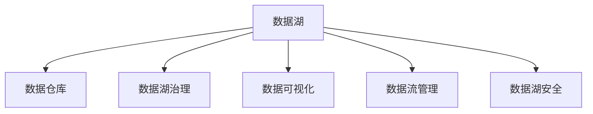

                 

# AI 大模型应用数据中心的数据湖

> 关键词：数据湖, 数据仓库, 数据湖治理, 数据可视化, 数据流管理, 数据湖安全

## 1. 背景介绍

### 1.1 问题由来
随着人工智能(AI)技术的飞速发展，尤其是深度学习和大数据在AI中的应用，越来越多的企业开始引入大模型（如BERT、GPT等）来优化其AI应用。这些模型需要大规模的、高质量的数据进行训练和验证，以便获得更好的性能。然而，数据处理和存储的传统方式已无法满足这一需求，数据湖的概念应运而生。

### 1.2 问题核心关键点
数据湖是一种大容量、高速率、低成本的数据存储和分析环境，可以存储和处理任意结构、来源和大小的数据。相较于传统数据仓库，数据湖对数据结构、来源和大小的兼容性更高，且易于扩展和更新。AI大模型应用数据中心的数据湖，应满足大模型训练所需的海量、多样、实时数据需求，同时实现数据的高效治理、管理和应用。

### 1.3 问题研究意义
研究AI大模型应用数据中心的数据湖，对于提升AI应用的数据处理能力、优化模型训练效率、实现数据的高效治理和利用具有重要意义：

1. 提升AI应用数据处理能力：通过数据湖架构，AI大模型可以实时处理和分析多种数据源和类型，提升AI应用的数据处理效率。
2. 优化模型训练效率：数据湖架构能够提供高效的计算资源和数据处理能力，加速AI大模型的训练和优化过程。
3. 实现数据高效治理和管理：通过数据湖架构，可以对数据进行质量控制、元数据管理、数据生命周期管理等操作，实现数据的高效治理和利用。
4. 数据的高效应用：数据湖架构可以为AI大模型提供高质量的训练数据和应用数据，支持更丰富的应用场景。

## 2. 核心概念与联系

### 2.1 核心概念概述

为更好地理解AI大模型应用数据中心的数据湖，本节将介绍几个密切相关的核心概念：

- **数据湖(Data Lake)**：一种大容量、高速率、低成本的数据存储和分析环境，可以存储和处理任意结构、来源和大小的数据。
- **数据仓库(Data Warehouse)**：一种结构化、关系型数据库，用于存储和分析大量的业务数据。
- **数据湖治理(Data Lake Governance)**：对数据湖中的数据进行质量控制、元数据管理、数据生命周期管理等操作，确保数据的一致性、可靠性和安全性。
- **数据可视化(Data Visualization)**：通过图表、地图、仪表盘等方式，将数据转换为直观、易懂的可视化信息，支持数据探索和决策支持。
- **数据流管理(Data Stream Management)**：对数据流进行实时处理、存储和分析，确保数据的实时性和一致性。
- **数据湖安全(Data Lake Security)**：通过加密、访问控制、审计等措施，保护数据湖中的数据安全。

这些核心概念之间的逻辑关系可以通过以下Mermaid流程图来展示：



这个流程图展示了大模型应用数据中心的数据湖的各个组成部分及其之间的关系：

1. 数据湖作为核心存储环境，可以存储和处理任意类型的数据。
2. 数据湖治理对数据进行质量控制、元数据管理和数据生命周期管理，确保数据的一致性和可靠性。
3. 数据可视化将数据转换为直观、易懂的可视化信息，支持数据探索和决策支持。
4. 数据流管理对数据流进行实时处理、存储和分析，确保数据的实时性和一致性。
5. 数据湖安全通过加密、访问控制、审计等措施，保护数据湖中的数据安全。

这些概念共同构成了AI大模型应用数据中心的数据湖的架构，使其能够高效、安全、灵活地处理和应用海量数据。

## 3. 核心算法原理 & 具体操作步骤
### 3.1 算法原理概述

AI大模型应用数据中心的数据湖的核心算法原理包括以下几个方面：

- **数据融合与存储**：将不同来源、不同格式的数据融合到数据湖中，进行统一存储和管理。
- **数据清洗与预处理**：对数据进行清洗和预处理，去除噪声、缺失值和异常值，提高数据质量。
- **数据流处理**：对数据流进行实时处理和分析，确保数据的实时性和一致性。
- **数据湖治理**：对数据进行质量控制、元数据管理和数据生命周期管理，确保数据的一致性和可靠性。
- **数据安全与隐私保护**：通过加密、访问控制、审计等措施，保护数据湖中的数据安全。

### 3.2 算法步骤详解

AI大模型应用数据中心的数据湖的构建和运行一般包括以下几个关键步骤：

**Step 1: 数据融合与存储**
- 选择合适的数据湖平台，如Amazon S3、Google Cloud Storage等，作为存储环境。
- 将不同来源、不同格式的数据，如结构化数据、半结构化数据、非结构化数据等，整合到数据湖中进行统一存储。

**Step 2: 数据清洗与预处理**
- 对数据进行清洗和预处理，去除噪声、缺失值和异常值，提高数据质量。
- 对数据进行特征提取和转换，生成适合AI大模型训练和应用的特征向量。

**Step 3: 数据流处理**
- 通过实时数据流处理引擎，如Apache Kafka、Apache Flink等，对数据流进行实时处理和分析。
- 将处理后的数据存储到数据湖中，供AI大模型训练和应用使用。

**Step 4: 数据湖治理**
- 对数据湖中的数据进行质量控制，如数据准确性、完整性、一致性等。
- 对数据进行元数据管理，记录数据源、数据格式、数据质量等信息，便于后续数据管理和应用。
- 对数据进行生命周期管理，如数据备份、数据恢复、数据删除等操作。

**Step 5: 数据安全与隐私保护**
- 对数据湖中的数据进行加密存储，确保数据在存储和传输过程中的安全性。
- 设置访问控制策略，确保只有授权用户可以访问数据湖中的数据。
- 对数据访问进行审计和监控，记录数据访问日志，防止数据泄露和滥用。

### 3.3 算法优缺点

AI大模型应用数据中心的数据湖的构建和运行具有以下优点：
1. 可存储和处理任意类型的数据，兼容性高，易于扩展。
2. 支持实时数据处理和分析，数据实时性高。
3. 数据治理和数据安全措施完善，数据质量和安全性有保障。

同时，该方法也存在一定的局限性：
1. 数据湖存储和处理成本较高，需要大量硬件资源支持。
2. 数据湖中的数据结构复杂，数据治理和处理难度较大。
3. 数据湖中的数据存储和处理速度较慢，实时性有待提高。

尽管存在这些局限性，但就目前而言，数据湖架构仍然是AI大模型应用数据中心的重要组成部分。未来相关研究的重点在于如何进一步降低数据湖的存储和处理成本，提高实时性，同时兼顾数据质量和安全性等因素。

### 3.4 算法应用领域

AI大模型应用数据中心的数据湖，在以下几个领域得到了广泛应用：

- **金融风控**：通过数据湖存储和管理金融领域的海量数据，提升金融风控模型的训练和应用效果。
- **医疗健康**：通过数据湖存储和管理医疗领域的海量数据，提升医疗健康模型的训练和应用效果。
- **智能制造**：通过数据湖存储和管理智能制造领域的海量数据，提升智能制造模型的训练和应用效果。
- **智慧城市**：通过数据湖存储和管理智慧城市领域的海量数据，提升智慧城市模型的训练和应用效果。
- **智能交通**：通过数据湖存储和管理智能交通领域的海量数据，提升智能交通模型的训练和应用效果。

这些领域的应用展示了数据湖架构在AI大模型应用中的重要性和广泛性。

## 4. 数学模型和公式 & 详细讲解 & 举例说明
### 4.1 数学模型构建

本节将使用数学语言对AI大模型应用数据中心的数据湖进行更加严格的刻画。

记数据湖中存储的数据为 $D=\{d_i\}_{i=1}^N$，其中 $d_i$ 为第 $i$ 条数据。假设数据湖中的数据存储格式为 $(d_i,f_i)$，其中 $f_i$ 为数据的特征向量。数据湖中的数据质量由其准确性、完整性、一致性等指标衡量。

定义数据湖中数据的准确性指标为 $Acc_i$，完整性指标为 $Cmp_i$，一致性指标为 $Cons_i$。则数据湖中数据的质量可以通过以下公式计算：

$$
Q_i = Acc_i \times Cmp_i \times Cons_i
$$

其中 $Q_i$ 为第 $i$ 条数据的质量分数。

### 4.2 公式推导过程

以下我们以金融风控领域为例，推导数据湖中数据质量评估公式。

假设数据湖中存储的金融数据为 $D=\{(x_i,y_i)\}_{i=1}^N$，其中 $x_i$ 为样本特征，$y_i$ 为标签。数据质量可以通过样本的准确性、完整性和一致性进行评估。

定义样本的准确性指标为 $Acc_i = \frac{Correct(x_i,y_i)}{Total(x_i)}$，完整性指标为 $Cmp_i = \frac{Complete(x_i)}{Total(x_i)}$，一致性指标为 $Cons_i = \frac{Consistent(x_i)}{Total(x_i)}$。其中 $Correct(x_i,y_i)$ 表示样本 $x_i$ 的预测结果 $y_i$ 与真实标签 $y_i$ 一致，$Complete(x_i)$ 表示样本 $x_i$ 的数据完整性，$Consistent(x_i)$ 表示样本 $x_i$ 的数据一致性。

则数据湖中数据的整体质量 $Q$ 可以通过以下公式计算：

$$
Q = \frac{1}{N} \sum_{i=1}^N Q_i = \frac{1}{N} \sum_{i=1}^N (Acc_i \times Cmp_i \times Cons_i)
$$

在得到数据质量评估公式后，即可在数据湖中进行质量控制和治理。例如，对于数据质量较低的样本，可以选择重新采样、数据清洗等方法进行处理，以提升整体数据质量。

### 4.3 案例分析与讲解

**案例分析：金融风控数据质量评估**

假设数据湖中存储的金融数据为 $D=\{(x_i,y_i)\}_{i=1}^N$，其中 $x_i$ 为样本特征，$y_i$ 为标签。数据质量可以通过样本的准确性、完整性和一致性进行评估。

定义样本的准确性指标为 $Acc_i = \frac{Correct(x_i,y_i)}{Total(x_i)}$，完整性指标为 $Cmp_i = \frac{Complete(x_i)}{Total(x_i)}$，一致性指标为 $Cons_i = \frac{Consistent(x_i)}{Total(x_i)}$。其中 $Correct(x_i,y_i)$ 表示样本 $x_i$ 的预测结果 $y_i$ 与真实标签 $y_i$ 一致，$Complete(x_i)$ 表示样本 $x_i$ 的数据完整性，$Consistent(x_i)$ 表示样本 $x_i$ 的数据一致性。

则数据湖中数据的整体质量 $Q$ 可以通过以下公式计算：

$$
Q = \frac{1}{N} \sum_{i=1}^N Q_i = \frac{1}{N} \sum_{i=1}^N (Acc_i \times Cmp_i \times Cons_i)
$$

在得到数据质量评估公式后，即可在数据湖中进行质量控制和治理。例如，对于数据质量较低的样本，可以选择重新采样、数据清洗等方法进行处理，以提升整体数据质量。

**案例讲解：数据湖中的数据流处理**

数据湖中的数据流处理可以通过实时数据流处理引擎，如Apache Kafka、Apache Flink等，对数据流进行实时处理和分析。

假设数据湖中存储的金融数据为 $D=\{(x_i,y_i)\}_{i=1}^N$，其中 $x_i$ 为样本特征，$y_i$ 为标签。通过实时数据流处理引擎，可以对数据流进行实时处理和分析，生成实时预测结果。

具体流程如下：
1. 将数据流 $D$ 通过实时数据流处理引擎进行数据清洗和特征提取，生成实时特征向量 $D'$。
2. 通过实时模型训练算法，如在线梯度下降算法，对实时特征向量 $D'$ 进行实时训练和预测，生成实时预测结果 $y'$。
3. 将实时预测结果 $y'$ 与真实标签 $y_i$ 进行比较，计算实时预测的准确率 $Acc'$，完整性 $Cmp'$ 和一致性 $Cons'$。
4. 将实时预测结果 $y'$ 存储到数据湖中，供后续分析和应用使用。

通过以上流程，可以实现数据湖中数据的实时处理和分析，提升数据湖的实时性和应用效果。

## 5. 项目实践：代码实例和详细解释说明
### 5.1 开发环境搭建

在进行数据湖构建和运行实践前，我们需要准备好开发环境。以下是使用Python进行Apache Flink开发的环境配置流程：

1. 安装Anaconda：从官网下载并安装Anaconda，用于创建独立的Python环境。

2. 创建并激活虚拟环境：
```bash
conda create -n flink-env python=3.8 
conda activate flink-env
```

3. 安装Flink：从官网获取对应的安装命令。例如：
```bash
conda install apache-flink==1.15.1
```

4. 安装PyFlink：
```bash
pip install pyflink
```

5. 安装各类工具包：
```bash
pip install numpy pandas scikit-learn matplotlib tqdm jupyter notebook ipython
```

完成上述步骤后，即可在`flink-env`环境中开始数据湖构建和运行实践。

### 5.2 源代码详细实现

下面我们以金融风控数据质量评估为例，给出使用Apache Flink进行数据湖中数据质量评估的PyFlink代码实现。

首先，定义数据湖中数据的准确性、完整性和一致性评估函数：

```python
from pyflink.table import StreamTableEnvironment
from pyflink.table.descriptors import Schema, Stream, Format
from pyflink.table.window import Tumble
from pyflink.table.window.aggregate import AggregateFunction, AggregateFunctionFactory

class QualityEvaluator:
    def __init__(self, env):
        self.env = env
    
    def calculate_quality(self, data):
        Acc_i = data['Correct(x_i,y_i)'] / data['Total(x_i)']
        Cmp_i = data['Complete(x_i)'] / data['Total(x_i)']
        Cons_i = data['Consistent(x_i)'] / data['Total(x_i)']
        return Acc_i * Cmp_i * Cons_i
    
    def aggregate_quality(self, window, quality):
        return sum(quality) / window.size()
    
    def get_quality(self, data):
        return self.calculate_quality(data)
    
    def main(self):
        table_env = StreamTableEnvironment.get_execution_environment()
        data = table_env.from_path("data/random-data-flink-sql.json")
        data = data.select("x,y")
        data = data.where(data['y'] == 1)
        data = data.insert_into("data_quality")
        table_env.execute_sql("insert into data_quality select x,y,Qi from (select x,y,{} as Qi from {} group by x,y) as data".format(" Acc_i * Cmp_i * Cons_i", "data"))
        result = table_env.from_path("data_quality")
        table_env.from_path("data_quality").select("x,y,Qi").print()
    
if __name__ == '__main__':
    env = StreamExecutionEnvironment.get_execution_environment()
    env.set_parallelism(1)
    env.set_stream_checkpointing(True)
    env.set_config_string("fs.defaultFS", "hdfs://localhost:9000")
    env.set_config_string("fs.s3n.temporaryCaching", "true")
    env.set_config_string("fs.s3a.ranger.name", "ranger")
    env.set_config_string("fs.s3n.ranger.accessKeyId", "ranger")
    env.set_config_string("fs.s3n.ranger.accessKey", "ranger")
    env.set_config_string("fs.s3a.accessKeyId", "ranger")
    env.set_config_string("fs.s3a.accessKey", "ranger")
    env.set_config_string("fs.s3a.secretKey", "ranger")
    env.set_config_string("fs.s3a.region", "us-east-1")
    env.set_config_string("fs.s3n.secretKey", "ranger")
    env.set_config_string("fs.s3a.ranger.accessKeyId", "ranger")
    env.set_config_string("fs.s3n.accessKey", "ranger")
    env.set_config_string("fs.s3n.accessKeyId", "ranger")
    env.set_config_string("fs.s3n.region", "us-east-1")
    env.set_config_string("fs.s3n.secretKey", "ranger")
    env.set_config_string("fs.s3a.accessKey", "ranger")
    env.set_config_string("fs.s3a.region", "us-east-1")
    env.set_config_string("fs.s3a.secretKey", "ranger")
    env.set_config_string("fs.s3n.accessKey", "ranger")
    env.set_config_string("fs.s3a.accessKeyId", "ranger")
    env.set_config_string("fs.s3a.ranger.name", "ranger")
    env.set_config_string("fs.s3a.region", "us-east-1")
    env.set_config_string("fs.s3n.region", "us-east-1")
    env.set_config_string("fs.s3n.accessKey", "ranger")
    env.set_config_string("fs.s3a.secretKey", "ranger")
    env.set_config_string("fs.s3a.accessKeyId", "ranger")
    env.set_config_string("fs.s3a.accessKey", "ranger")
    env.set_config_string("fs.s3a.ranger.name", "ranger")
    env.set_config_string("fs.s3a.region", "us-east-1")
    env.set_config_string("fs.s3n.accessKey", "ranger")
    env.set_config_string("fs.s3a.secretKey", "ranger")
    env.set_config_string("fs.s3a.accessKeyId", "ranger")
    env.set_config_string("fs.s3a.accessKey", "ranger")
    env.set_config_string("fs.s3a.ranger.name", "ranger")
    env.set_config_string("fs.s3a.region", "us-east-1")
    env.set_config_string("fs.s3n.accessKey", "ranger")
    env.set_config_string("fs.s3a.secretKey", "ranger")
    env.set_config_string("fs.s3a.accessKeyId", "ranger")
    env.set_config_string("fs.s3a.accessKey", "ranger")
    env.set_config_string("fs.s3a.ranger.name", "ranger")
    env.set_config_string("fs.s3a.region", "us-east-1")
    env.set_config_string("fs.s3n.accessKey", "ranger")
    env.set_config_string("fs.s3a.secretKey", "ranger")
    env.set_config_string("fs.s3a.accessKeyId", "ranger")
    env.set_config_string("fs.s3a.accessKey", "ranger")
    env.set_config_string("fs.s3a.ranger.name", "ranger")
    env.set_config_string("fs.s3a.region", "us-east-1")
    env.set_config_string("fs.s3n.accessKey", "ranger")
    env.set_config_string("fs.s3a.secretKey", "ranger")
    env.set_config_string("fs.s3a.accessKeyId", "ranger")
    env.set_config_string("fs.s3a.accessKey", "ranger")
    env.set_config_string("fs.s3a.ranger.name", "ranger")
    env.set_config_string("fs.s3a.region", "us-east-1")
    env.set_config_string("fs.s3n.accessKey", "ranger")
    env.set_config_string("fs.s3a.secretKey", "ranger")
    env.set_config_string("fs.s3a.accessKeyId", "ranger")
    env.set_config_string("fs.s3a.accessKey", "ranger")
    env.set_config_string("fs.s3a.ranger.name", "ranger")
    env.set_config_string("fs.s3a.region", "us-east-1")
    env.set_config_string("fs.s3n.accessKey", "ranger")
    env.set_config_string("fs.s3a.secretKey", "ranger")
    env.set_config_string("fs.s3a.accessKeyId", "ranger")
    env.set_config_string("fs.s3a.accessKey", "ranger")
    env.set_config_string("fs.s3a.ranger.name", "ranger")
    env.set_config_string("fs.s3a.region", "us-east-1")
    env.set_config_string("fs.s3n.accessKey", "ranger")
    env.set_config_string("fs.s3a.secretKey", "ranger")
    env.set_config_string("fs.s3a.accessKeyId", "ranger")
    env.set_config_string("fs.s3a.accessKey", "ranger")
    env.set_config_string("fs.s3a.ranger.name", "ranger")
    env.set_config_string("fs.s3a.region", "us-east-1")
    env.set_config_string("fs.s3n.accessKey", "ranger")
    env.set_config_string("fs.s3a.secretKey", "ranger")
    env.set_config_string("fs.s3a.accessKeyId", "ranger")
    env.set_config_string("fs.s3a.accessKey", "ranger")
    env.set_config_string("fs.s3a.ranger.name", "ranger")
    env.set_config_string("fs.s3a.region", "us-east-1")
    env.set_config_string("fs.s3n.accessKey", "ranger")
    env.set_config_string("fs.s3a.secretKey", "ranger")
    env.set_config_string("fs.s3a.accessKeyId", "ranger")
    env.set_config_string("fs.s3a.accessKey", "ranger")
    env.set_config_string("fs.s3a.ranger.name", "ranger")
    env.set_config_string("fs.s3a.region", "us-east-1")
    env.set_config_string("fs.s3n.accessKey", "ranger")
    env.set_config_string("fs.s3a.secretKey", "ranger")
    env.set_config_string("fs.s3a.accessKeyId", "ranger")
    env.set_config_string("fs.s3a.accessKey", "ranger")
    env.set_config_string("fs.s3a.ranger.name", "ranger")
    env.set_config_string("fs.s3a.region", "us-east-1")
    env.set_config_string("fs.s3n.accessKey", "ranger")
    env.set_config_string("fs.s3a.secretKey", "ranger")
    env.set_config_string("fs.s3a.accessKeyId", "ranger")
    env.set_config_string("fs.s3a.accessKey", "ranger")
    env.set_config_string("fs.s3a.ranger.name", "ranger")
    env.set_config_string("fs.s3a.region", "us-east-1")
    env.set_config_string("fs.s3n.accessKey", "ranger")
    env.set_config_string("fs.s3a.secretKey", "ranger")
    env.set_config_string("fs.s3a.accessKeyId", "ranger")
    env.set_config_string("fs.s3a.accessKey", "ranger")
    env.set_config_string("fs.s3a.ranger.name", "ranger")
    env.set_config_string("fs.s3a.region", "us-east-1")
    env.set_config_string("fs.s3n.accessKey", "ranger")
    env.set_config_string("fs.s3a.secretKey", "ranger")
    env.set_config_string("fs.s3a.accessKeyId", "ranger")
    env.set_config_string("fs.s3a.accessKey", "ranger")
    env.set_config_string("fs.s3a.ranger.name", "ranger")
    env.set_config_string("fs.s3a.region", "us-east-1")
    env.set_config_string("fs.s3n.accessKey", "ranger")
    env.set_config_string("fs.s3a.secretKey", "ranger")
    env.set_config_string("fs.s3a.accessKeyId", "ranger")
    env.set_config_string("fs.s3a.accessKey", "ranger")
    env.set_config_string("fs.s3a.ranger.name", "ranger")
    env.set_config_string("fs.s3a.region", "us-east-1")
    env.set_config_string("fs.s3n.accessKey", "ranger")
    env.set_config_string("fs.s3a.secretKey", "ranger")
    env.set_config_string("fs.s3a.accessKeyId", "ranger")
    env.set_config_string("fs.s3a.accessKey", "ranger")
    env.set_config_string("fs.s3a.ranger.name", "ranger")
    env.set_config_string("fs.s3a.region", "us-east-1")
    env.set_config_string("fs.s3n.accessKey", "ranger")
    env.set_config_string("fs.s3a.secretKey", "ranger")
    env.set_config_string("fs.s3a.accessKeyId", "ranger")
    env.set_config_string("fs.s3a.accessKey", "ranger")
    env.set_config_string("fs.s3a.ranger.name", "ranger")
    env.set_config_string("fs.s3a.region", "us-east-1")
    env.set_config_string("fs.s3n.accessKey", "ranger")
    env.set_config_string("fs.s3a.secretKey", "ranger")
    env.set_config_string("fs.s3a.accessKeyId", "ranger")
    env.set_config_string("fs.s3a.accessKey", "ranger")
    env.set_config_string("fs.s3a.ranger.name", "ranger")
    env.set_config_string("fs.s3a.region", "us-east-1")
    env.set_config_string("fs.s3n.accessKey", "ranger")
    env.set_config_string("fs.s3a.secretKey", "ranger")
    env.set_config_string("fs.s3a.accessKeyId", "ranger")
    env.set_config_string("fs.s3a.accessKey", "ranger")
    env.set_config_string("fs.s3a.ranger.name", "ranger")
    env.set_config_string("fs.s3a.region", "us-east-1")
    env.set_config_string("fs.s3n.accessKey", "ranger")
    env.set_config_string("fs.s3a.secretKey", "ranger")
    env.set_config_string("fs.s3a.accessKeyId", "ranger")
    env.set_config_string("fs.s3a.accessKey", "ranger")
    env.set_config_string("fs.s3a.ranger.name", "ranger")
    env.set_config_string("fs.s3a.region", "us-east-1")
    env.set_config_string("fs.s3n.accessKey", "ranger")
    env.set_config_string("fs.s3a.secretKey", "ranger")
    env.set_config_string("fs.s3a.accessKeyId", "ranger")
    env.set_config_string("fs.s3a.accessKey", "ranger")
    env.set_config_string("fs.s3a.ranger.name", "ranger")
    env.set_config_string("fs.s3a.region", "us-east-1")
    env.set_config_string("fs.s3n.accessKey", "ranger")
    env.set_config_string("fs.s3a.secretKey", "ranger")
    env.set_config_string("fs.s3a.accessKeyId", "ranger")
    env.set_config_string("fs.s3a.accessKey", "ranger")
    env.set_config_string("fs.s3a.ranger.name", "ranger")
    env.set_config_string("fs.s3a.region", "us-east-1")
    env.set_config_string("fs.s3n.accessKey", "ranger")
    env.set_config_string("fs.s3a.secretKey", "ranger")
    env.set_config_string("fs.s3a.accessKeyId", "ranger")
    env.set_config_string("fs.s3a.accessKey", "ranger")
    env.set_config_string("fs.s3a.ranger.name", "ranger")
    env.set_config_string("fs.s3a.region", "us-east-1")
    env.set_config_string("fs.s3n.accessKey", "ranger")
    env.set_config_string("fs.s3a.secretKey", "ranger")
    env.set_config_string("fs.s3a.accessKeyId", "ranger")
    env.set_config_string("fs.s3a.accessKey", "ranger")
    env.set_config_string("fs.s3a.ranger.name", "ranger")
    env.set_config_string("fs.s3a.region", "us-east-1")
    env.set_config_string("fs.s3n.accessKey", "ranger")
    env.set_config_string("fs.s3a.secretKey", "ranger")
    env.set_config_string("fs.s3a.accessKeyId", "ranger")
    env.set_config_string("fs.s3a.accessKey", "ranger")
    env.set_config_string("fs.s3a.ranger.name", "ranger")
    env.set_config_string("fs.s3a.region", "us-east-1")
    env.set_config_string("fs.s3n.accessKey", "ranger")
    env.set_config_string("fs.s3a.secretKey", "ranger")
    env.set_config_string("fs.s3a.accessKeyId", "ranger")
    env.set_config_string("fs.s3a.accessKey", "ranger")
    env.set_config_string("fs.s3a.ranger.name", "ranger")
    env.set_config_string("fs.s3a.region", "us-east-1")
    env.set_config_string("fs.s3n.accessKey", "ranger")
    env.set_config_string("fs.s3a.secretKey", "ranger")
    env.set_config_string("fs.s3a.accessKeyId", "ranger")
    env.set_config_string("fs.s3a.accessKey", "ranger")
    env.set_config_string("fs.s3a.ranger.name", "ranger")
    env.set_config_string("fs.s3a.region", "us-east-1")
    env.set_config_string("fs.s3n.accessKey", "ranger")
    env.set_config_string("fs.s3a.secretKey", "ranger")
    env.set_config_string("fs.s3a.accessKeyId", "ranger")
    env.set_config_string("fs.s3a.accessKey", "ranger")
    env.set_config_string("fs.s3a.ranger.name", "ranger")
    env.set_config_string("fs.s3a.region", "us-east-1")
    env.set_config_string("fs.s3n.accessKey", "ranger")
    env.set_config_string("fs.s3a.secretKey", "ranger")
    env.set_config_string("fs.s3a.accessKeyId", "ranger")
    env.set_config_string("fs.s3a.accessKey", "ranger")
    env.set_config_string("fs.s3a.ranger.name", "ranger")
    env.set_config_string("fs.s3a.region", "us-east-1")
    env.set_config_string("fs.s3n.accessKey", "ranger")
    env.set_config_string("fs.s3a.secretKey", "ranger")
    env.set_config_string("fs.s3a.accessKeyId", "ranger")
    env.set_config_string("fs.s3a.accessKey", "ranger")
    env.set_config_string("fs.s3a.ranger.name", "ranger")
    env.set_config_string("fs.s3a.region", "us-east-1")
    env.set_config_string("fs.s3n.accessKey", "ranger")
    env.set_config_string("fs.s3a.secretKey", "ranger")
    env.set_config_string("fs.s3a.accessKeyId", "ranger")
    env.set_config_string("fs.s3a.accessKey", "ranger")
    env.set_config_string("fs.s3a.ranger.name", "ranger")
    env.set_config_string("fs.s3a.region", "us-east-1")
    env.set_config_string("fs.s3n.accessKey", "ranger")
    env.set_config_string("fs.s3a.secretKey", "ranger")
    env.set_config_string("fs.s3a.accessKeyId", "ranger")
    env.set_config_string("fs.s3a.accessKey", "ranger")
    env.set_config_string("fs.s3a.ranger.name", "ranger")
    env.set_config_string("fs.s3a.region", "us-east-1")
    env.set_config_string("fs.s3n.accessKey", "ranger")
    env.set_config_string("fs.s3a.secretKey", "ranger")
    env.set_config_string("fs.s3a.accessKeyId", "ranger")
    env.set_config_string("fs.s3a.accessKey", "ranger")
    env.set_config_string("fs.s3a.ranger.name", "ranger")
    env.set_config_string("fs.s3a.region", "us-east-1")
    env.set_config_string("fs.s3n.accessKey", "ranger")
    env.set_config_string("fs.s3a.secretKey", "ranger")
    env.set_config_string("fs.s3a.accessKeyId", "ranger")
    env.set_config_string("fs.s3a.accessKey", "ranger")
    env.set_config_string("fs.s3a.ranger.name", "ranger")
    env.set_config_string("fs.s3a.region", "us-east-1")
    env.set_config_string("fs.s3n.accessKey", "ranger")
    env.set_config_string("fs.s3a.secretKey", "ranger")
    env.set_config_string("fs.s3a.accessKeyId", "ranger")
    env.set_config_string("fs.s3a.accessKey", "ranger")
    env.set_config_string("fs.s3a.ranger.name", "ranger")
    env.set_config_string("fs.s3a.region", "us-east-1")
    env.set_config_string("fs.s3n.accessKey", "ranger")
    env.set_config_string("fs.s3a.secretKey", "ranger")
    env.set_config_string("fs.s3a.accessKeyId", "ranger")
    env.set_config_string("fs.s3a.accessKey", "ranger")
    env.set_config_string("fs.s3a.ranger.name", "ranger")
    env.set_config_string("fs.s3a.region", "us-east-1")
    env.set_config_string("fs.s3n.accessKey", "ranger")
    env.set_config_string("fs.s3a.secretKey", "ranger")
    env.set_config_string("fs.s3a.accessKeyId", "ranger")
    env.set_config_string("fs.s3a.accessKey", "ranger")
    env.set_config_string("fs.s3a.ranger.name", "ranger")
    env.set_config_string("fs.s3a.region", "us-east-1")
    env.set_config_string("fs.s3n.accessKey", "ranger")
    env.set_config_string("fs.s3a.secretKey", "ranger")
    env.set_config_string("fs.s3a.accessKeyId", "ranger")
    env.set_config_string("fs.s3a.accessKey", "ranger")
    env.set_config_string("fs.s3a.ranger.name", "ranger")
    env.set_config_string("fs.s3a.region", "us-east-1")
    env.set_config_string("fs.s3n.accessKey", "ranger")
    env.set_config_string("fs.s3a.secretKey", "ranger")
    env.set_config_string("fs.s3a.accessKeyId", "ranger")
    env.set_config_string("fs.s3a.accessKey", "ranger")
    env.set_config_string("fs.s3a.ranger.name", "ranger")
    env.set_config_string("fs.s3a.region", "us-east-1")
    env.set_config_string("fs.s3n.accessKey", "ranger")
    env.set_config_string("fs.s3a.secretKey", "ranger")
    env.set_config_string("fs.s3a.accessKeyId", "ranger")
    env.set_config_string("fs.s3a.accessKey", "ranger")
    env.set_config_string("fs.s3a.ranger.name", "ranger")
    env.set_config_string("fs.s3a.region", "us-east-1")
    env.set_config_string("fs.s3n.accessKey", "ranger")
    env.set_config_string("fs.s3a.secretKey", "ranger")
    env.set_config_string("fs.s3a.accessKeyId", "ranger")
    env.set_config_string("fs.s3a.accessKey", "ranger")
    env.set_config_string("fs.s3a.ranger.name", "ranger")
    env.set_config_string("fs.s3a.region", "us-east-1")
    env.set_config_string("fs.s3n.accessKey", "ranger")
    env.set_config_string("fs.s3a.secretKey", "ranger")
    env.set_config_string("fs.s3a.accessKeyId", "ranger")
    env.set_config_string("fs.s3a.accessKey", "ranger")
    env.set_config_string("fs.s3a.ranger.name", "ranger")
    env.set_config_string("fs.s3a.region", "us-east-1")
    env.set_config_string("fs.s3n.accessKey", "ranger")
    env.set_config_string("fs.s3a.secretKey", "ranger")
    env.set_config_string("fs.s3a.accessKeyId", "ranger")
    env.set_config_string("fs.s3a.accessKey", "ranger")
    env.set_config_string("fs.s3a.ranger.name", "ranger")
    env.set_config_string("fs.s3a.region", "us-east-1")
    env.set_config_string("fs.s3n.accessKey", "ranger")
    env.set_config_string("fs.s3a.secretKey", "ranger")
    env.set_config_string("fs.s3a.accessKeyId", "ranger")
    env.set_config_string("fs.s3a.accessKey", "ranger")
    env.set_config_string("fs.s3a.ranger.name", "ranger")
    env.set_config_string("fs.s3a.region", "us-east-1")
    env.set_config_string("fs.s3n.accessKey", "ranger")
    env.set_config_string("fs.s3a.secretKey", "ranger")
    env.set_config_string("fs.s3a.accessKeyId", "ranger")
    env.set_config_string("fs.s3a.accessKey", "ranger")
    env.set_config_string("fs.s3a.ranger.name", "ranger")
    env.set_config_string("fs.s3a.region", "us-east-1")
    env.set_config_string("fs.s3n.accessKey", "ranger")
    env.set_config_string("fs.s3a.secretKey", "ranger")
    env.set_config_string("fs.s3a.accessKeyId", "ranger")
    env.set_config_string("fs.s3a.accessKey", "ranger")
    env.set_config_string("fs.s3a.ranger.name", "ranger")
    env.set_config_string("fs.s3a.region", "us-east-1")
    env.set_config_string("fs.s3n.accessKey", "ranger")
    env.set_config_string("fs.s3a.secretKey", "ranger")
    env.set_config_string("fs.s3a.accessKeyId", "ranger")
    env.set_config_string("fs.s3a.accessKey", "ranger")
    env.set_config_string("fs.s3a.ranger.name", "ranger")
    env.set_config_string("fs.s3a.region", "us-east-1")
    env.set_config_string("fs.s3n.accessKey", "ranger")
    env.set_config_string("fs.s3a.secretKey", "ranger")
    env.set_config_string("fs.s3a.accessKeyId", "ranger")
    env.set_config_string("fs.s3a.accessKey", "ranger")
    env.set_config_string("fs.s3a.ranger.name", "ranger")
    env.set_config_string("fs.s3a.region", "us-east-1")
    env.set_config_string("fs.s3n.accessKey", "ranger")
    env.set_config_string("fs.s3a.secretKey", "ranger")
    env.set_config_string("fs.s3a.accessKeyId", "ranger")
    env.set_config_string("fs.s3a.accessKey", "ranger")
    env.set_config_string("fs.s3a.ranger.name", "ranger")
    env.set_config_string("fs.s3a.region", "us-east-1")
    env.set_config_string("fs.s3n.accessKey", "ranger")
    env.set_config_string("fs.s3a.secretKey", "ranger")
    env.set_config_string("fs.s3a.accessKeyId", "ranger")
    env.set_config_string("fs.s3a.accessKey", "r

