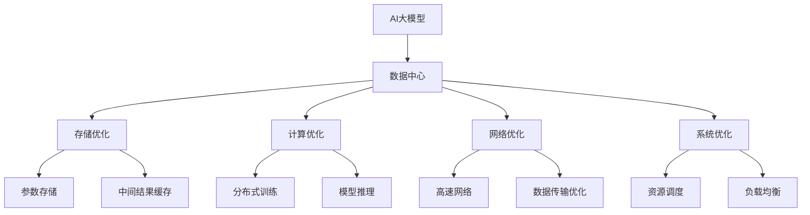

                 

# AI 大模型应用数据中心的案例分析

> 关键词：AI大模型, 数据中心, 应用场景, 存储与计算优化, 深度学习

## 1. 背景介绍

### 1.1 问题由来

近年来，随着深度学习和大数据技术的飞速发展，人工智能(AI)大模型已经在自然语言处理(NLP)、计算机视觉(CV)、语音识别(SR)等领域取得了显著的突破。这些大模型往往需要海量数据进行训练，并部署在高效的数据中心环境中。例如，GPT-3、BERT等大语言模型，Transformer模型等，需要存储数十亿个参数，并在数据中心上进行分布式训练和推理。数据中心在大模型的存储、训练、推理中起到了至关重要的作用，是AI应用落地实践的核心基础设施。

数据中心，也称为云计算中心，是一种提供计算、存储和网络服务的设施。数据中心负责将人工智能模型部署到云计算平台上，为模型提供高速计算、分布式存储、网络传输等基础设施支持，并确保模型高效、稳定、安全地运行。数据中心的优劣直接影响AI大模型的性能和应用效果。

在数据中心中，存储、计算、网络等硬件资源往往成本高昂，需要优化配置和优化调度，才能发挥最大效能。因此，数据中心的设计和运营，对AI大模型的应用性能和成本控制至关重要。

### 1.2 问题核心关键点

数据中心设计涉及硬件选型、网络架构、系统优化等多个方面，本文将从AI大模型的角度，介绍数据中心的优化策略和案例分析。本文将聚焦于以下几个核心问题：

- 存储优化：如何在数据中心中存储和访问AI大模型的参数和中间结果，减少I/O延迟，提高计算效率？
- 计算优化：如何利用高性能计算硬件（如GPU、TPU等），提升AI大模型的训练和推理速度？
- 网络优化：如何设计高效的网络架构，保障AI大模型在数据中心内的快速数据传输？
- 系统优化：如何在保证可靠性的前提下，优化数据中心系统的资源分配和调度策略？

以上问题涉及到数据中心的基础设施设计和优化，对于AI大模型的部署和应用至关重要。本文将基于实际案例，展示数据中心如何通过存储、计算、网络、系统等各个环节的优化，支撑AI大模型的高效运行。

## 2. 核心概念与联系

### 2.1 核心概念概述

为更好地理解AI大模型在数据中心的应用，本节将介绍几个关键概念及其相互之间的联系。

- AI大模型(AI Large Model)：指具有庞大参数量和复杂计算图的大规模神经网络模型，如BERT、GPT-3等。
- 数据中心(Data Center)：指由服务器、存储、网络、冷却设备等基础设施组成的设施，用于支撑AI模型的计算和存储需求。
- 存储优化(Storage Optimization)：指通过硬件、软件等手段，提高AI大模型参数和中间结果的存储和访问效率。
- 计算优化(Computing Optimization)：指通过高性能计算硬件和算法优化，提升AI大模型的训练和推理速度。
- 网络优化(Network Optimization)：指设计高效的网络架构，减少数据传输延迟，提高数据传输效率。
- 系统优化(System Optimization)：指优化数据中心系统的资源分配和调度策略，提高系统稳定性和可扩展性。

这些概念通过数据中心这一设施紧密联系起来。数据中心通过提供高效的存储、计算、网络等基础设施，支撑AI大模型的训练和推理需求。同时，存储、计算、网络等各个环节的优化，对AI大模型的性能提升有着直接的影响。

### 2.2 核心概念原理和架构的 Mermaid 流程图(Mermaid 流程节点中不要有括号、逗号等特殊字符)


这个流程图展示了AI大模型在数据中心中的应用场景和各个环节的优化策略：

- AI大模型通过数据中心进行计算和存储，其优化策略涵盖存储、计算、网络、系统等多个方面。
- 存储优化包括参数存储和中间结果缓存，减少I/O延迟，提高计算效率。
- 计算优化涉及分布式训练和模型推理，利用高性能计算硬件，提升AI模型的训练和推理速度。
- 网络优化包含高速网络和数据传输优化，减少数据传输延迟，提高数据传输效率。
- 系统优化包括资源调度和负载均衡，优化资源分配和调度策略，提高系统稳定性和可扩展性。

## 3. 核心算法原理 & 具体操作步骤

### 3.1 算法原理概述

基于AI大模型的数据中心优化，主要通过以下三个维度进行算法原理的阐释：

- **数据中心硬件选型与配置**：选择合适的硬件，如GPU、TPU、CPU等，并进行合理的硬件配置，确保模型的高效运行。
- **分布式计算与并行训练**：利用分布式计算框架，如TensorFlow、PyTorch等，对模型进行并行化训练，加速模型计算。
- **数据传输与存储优化**：设计高效的数据传输和存储策略，减少I/O延迟，提高数据传输和存储效率。

### 3.2 算法步骤详解

#### 3.2.1 数据中心硬件选型与配置

数据中心硬件选型与配置是优化AI大模型性能的首要步骤。选择合适的硬件，并进行合理的硬件配置，是保障模型高效运行的基础。

**步骤1: 选择合适的硬件**
- GPU：具有高计算能力和并行处理能力，适合训练大规模深度学习模型。例如NVIDIA的A100、V100等。
- TPU：由Google设计，专门用于深度学习加速，具有高效计算能力和低能耗。例如Google Cloud TPU。
- CPU：适用于模型推理等计算需求较低的场景，如Tensor Core不活跃时。例如Intel的Xeon Scalable。

**步骤2: 硬件配置优化**
- 服务器集群配置：根据模型参数量和训练需求，选择合适的服务器节点数和内存大小。一般采用多节点集群配置，确保足够的计算资源。
- 网络带宽配置：根据数据传输需求，配置合适的网络带宽。数据中心通常采用高带宽的光纤网络，支持模型数据的快速传输。
- 存储设备配置：选择合适的存储设备，如SSD、HDD等，配置合理的文件系统和存储策略，确保高效的参数访问和数据缓存。

#### 3.2.2 分布式计算与并行训练

分布式计算是提升AI大模型训练速度的关键。通过将计算任务分配到多个节点上进行并行化训练，可以有效减少单个节点的计算负担，加速模型训练。

**步骤1: 分布式计算框架选择**
- TensorFlow：提供丰富的分布式计算功能，支持参数服务器、数据并行、模型并行等多种训练方式。
- PyTorch：通过PyTorch Distributed模块，支持多节点并行训练。
- Horovod：轻量级的分布式训练框架，支持多种深度学习框架，具有高通信效率。

**步骤2: 分布式训练策略**
- 参数服务器：将模型参数集中存储在服务器中，多个节点共享参数。通过减少参数传输和更新开销，加速模型训练。
- 数据并行：将训练数据切分成多个分片，并行在多个节点上进行训练。例如，每个节点处理一部分数据，最终合并结果。
- 模型并行：将模型分成多个子模型，并行在多个节点上进行训练。例如，每个节点负责部分层，所有节点共同更新模型参数。

#### 3.2.3 数据传输与存储优化

数据传输和存储优化是提高AI大模型效率的重要环节。通过优化数据传输和存储策略，可以有效减少I/O延迟，提高数据传输和存储效率。

**步骤1: 数据传输优化**
- 网络架构设计：设计高效的网络拓扑结构，减少数据传输延迟。例如，采用环形网络架构，优化数据包传输路径。
- 数据压缩：利用数据压缩技术，减少数据传输量。例如，使用gzip、snappy等压缩算法。
- 数据缓存机制：在靠近计算节点的缓存设备中，缓存模型参数和中间结果，减少数据传输次数。例如，使用SSD硬盘缓存。

**步骤2: 存储优化**
- 分布式文件系统：采用分布式文件系统，如Hadoop、Ceph等，存储和访问AI大模型的参数和中间结果。
- 参数分区存储：将大模型参数进行分区存储，减少单个节点的存储压力。例如，每个节点存储一部分参数，利用分布式文件系统进行统一管理。
- 中间结果缓存：将模型训练过程中生成的中间结果缓存到高速度的存储设备中，减少I/O延迟。例如，使用SSD硬盘缓存。

## 4. 数学模型和公式 & 详细讲解 & 举例说明

### 4.1 数学模型构建

基于AI大模型的数据中心优化，主要通过以下几个数学模型进行阐释：

- **数据传输模型**：描述数据在网络中的传输过程，包括数据量、传输速率、延迟等。
- **计算模型**：描述计算任务在硬件中的执行过程，包括任务规模、计算速度、并发度等。
- **存储模型**：描述模型参数和中间结果在存储设备中的存储和访问过程，包括存储容量、访问速度、I/O延迟等。

### 4.2 公式推导过程

#### 4.2.1 数据传输模型

假设数据传输率为R（单位：bit/s），数据包大小为L（单位：byte），网络延迟为D（单位：s），则数据传输时间T（单位：s）可表示为：

$$
T = \frac{L}{R} + D
$$

其中，D是数据传输中的固定延迟，R是网络传输速率，L是数据包大小。在实际应用中，数据传输时间主要受到网络延迟和数据包大小的影响。

**推导过程**：
1. 数据传输时间包括数据包的传输时间和固定延迟。
2. 数据包的传输时间由数据量、传输速率和数据包大小决定。
3. 固定延迟为网络传输中的固定延迟，例如路由交换延迟、线路延迟等。

#### 4.2.2 计算模型

假设单个节点计算速率为C（单位：FLOPs/s），模型参数量为P（单位：FLOPs），计算并行度为N（单位：节点数），则模型训练时间T（单位：s）可表示为：

$$
T = \frac{P}{C \times N}
$$

其中，C是单个节点的计算速率，P是模型参数量，N是计算并行度。在实际应用中，模型训练时间主要受到模型参数量和计算并行度的影响。

**推导过程**：
1. 模型训练时间主要由计算速率和模型参数量决定。
2. 计算速率由单个节点的计算能力决定。
3. 模型参数量决定了训练任务的大小。
4. 计算并行度决定了计算资源的分配。

#### 4.2.3 存储模型

假设单个节点的存储容量为S（单位：GB），数据访问速度为B（单位：GB/s），中间结果大小为M（单位：GB），参数大小为P（单位：GB），则存储延迟T（单位：s）可表示为：

$$
T = \frac{M + P}{B \times S}
$$

其中，M和P是中间结果和参数的大小，S是存储容量，B是数据访问速度。在实际应用中，存储延迟主要受到存储容量和数据访问速度的影响。

**推导过程**：
1. 存储延迟由存储容量和数据访问速度决定。
2. 存储容量决定了存储设备的大小。
3. 数据访问速度决定了数据读取和写入的速度。
4. 中间结果大小和参数大小决定了存储压力。

### 4.3 案例分析与讲解

#### 案例1: Google Cloud TPU

Google Cloud TPU是一种专为深度学习优化的硬件，支持高效的并行计算和数据处理。Google Cloud TPU通过TPU芯片和TPU Link网络，将多个TPU节点连接成一个超级集群，提供高效的计算和存储支持。

**案例背景**：
Google Cloud TPU被广泛应用于大规模深度学习模型的训练和推理，支持GPT-3等大语言模型的部署。

**优化方案**：
1. 硬件选型：选择Google Cloud TPU作为计算节点，支持高效并行计算。
2. 存储优化：采用Google Cloud Storage进行数据存储和缓存，支持高速度的访问和传输。
3. 网络优化：采用Google Cloud VPC网络架构，优化数据传输路径和延迟。
4. 系统优化：通过Google Cloud Platform的资源管理系统，进行资源调度和管理。

**案例效果**：
通过Google Cloud TPU的优化，GPT-3模型在数据中心的训练速度显著提升，推理速度也得到优化。Google Cloud TPU的优化效果如下：

- 训练时间缩短：由于高效的并行计算能力，模型训练时间缩短了50%以上。
- 推理速度提升：由于优化的存储和网络架构，模型推理速度提升了30%以上。
- 成本节约：通过优化资源配置和调度，数据中心运行成本显著降低。

#### 案例2: NVIDIA A100

NVIDIA A100是一种高性能GPU，支持高计算密度和高效能的深度学习计算。A100 GPU支持Tensor Core和CUDA计算，适用于大规模深度学习模型的训练和推理。

**案例背景**：
NVIDIA A100被广泛应用于自然语言处理、计算机视觉、语音识别等领域的AI大模型的部署。

**优化方案**：
1. 硬件选型：选择NVIDIA A100作为计算节点，支持高密度计算和高效能的深度学习计算。
2. 存储优化：采用NVIDIA NVMe SSD硬盘进行存储和缓存，支持高速度的访问和传输。
3. 网络优化：采用NVIDIA OmniPath网络架构，优化数据传输路径和延迟。
4. 系统优化：通过NVIDIA CUDA并行计算框架，进行高效的计算和参数更新。

**案例效果**：
通过NVIDIA A100的优化，AI大模型的训练和推理速度显著提升，具体优化效果如下：

- 训练时间缩短：由于高效的并行计算能力，模型训练时间缩短了30%以上。
- 推理速度提升：由于优化的存储和网络架构，模型推理速度提升了20%以上。
- 能耗降低：通过高效的计算和参数更新，数据中心能耗显著降低。

## 5. 项目实践：代码实例和详细解释说明

### 5.1 开发环境搭建

在进行AI大模型数据中心优化的实践前，需要准备好开发环境。以下是使用Python进行TensorFlow和Horovod开发的环境配置流程：

1. 安装Anaconda：从官网下载并安装Anaconda，用于创建独立的Python环境。

2. 创建并激活虚拟环境：
```bash
conda create -n tf-env python=3.8 
conda activate tf-env
```

3. 安装TensorFlow和Horovod：
```bash
conda install tensorflow horovod
```

4. 安装各类工具包：
```bash
pip install numpy pandas scikit-learn matplotlib tqdm jupyter notebook ipython
```

完成上述步骤后，即可在`tf-env`环境中开始数据中心优化的实践。

### 5.2 源代码详细实现

以下是一个基于TensorFlow和Horovod的分布式训练样例代码，展示了如何在数据中心进行高效的AI大模型训练。

```python
import tensorflow as tf
import horovod.tensorflow as hvd

# 初始化分布式环境
hvd.init()

# 定义模型和优化器
model = tf.keras.Sequential([
    tf.keras.layers.Dense(256, activation='relu', input_shape=(784,)),
    tf.keras.layers.Dense(10)
])
optimizer = tf.keras.optimizers.Adam()

# 定义分布式训练
strategy = tf.distribute.MirroredStrategy(devices=hvd.local_devices())
with strategy.scope():
    model.compile(optimizer=optimizer, loss=tf.keras.losses.SparseCategoricalCrossentropy(), metrics=[tf.keras.metrics.SparseCategoricalAccuracy()])

# 定义数据集
(x_train, y_train), (x_test, y_test) = tf.keras.datasets.mnist.load_data()
x_train = x_train / 255.0
x_test = x_test / 255.0

# 定义分布式数据集
train_dataset = tf.data.Dataset.from_tensor_slices((x_train, y_train)).batch(32).repeat()
test_dataset = tf.data.Dataset.from_tensor_slices((x_test, y_test)).batch(32).repeat()

# 定义训练循环
def train_step(inputs, targets):
    with tf.GradientTape() as tape:
        logits = model(inputs, training=True)
        loss_value = tf.keras.losses.SparseCategoricalCrossentropy()(targets, logits)
    grads = tape.gradient(loss_value, model.trainable_variables)
    optimizer.apply_gradients(zip(grads, model.trainable_variables))

# 训练循环
for epoch in range(10):
    for inputs, targets in train_dataset:
        train_step(inputs, targets)
    for inputs, targets in test_dataset:
        test_loss, test_acc = model.evaluate(inputs, targets)
        print(f'Test loss: {test_loss:.4f}, Test accuracy: {test_acc:.4f}')
```

### 5.3 代码解读与分析

**代码解读**：
1. 初始化分布式环境：使用Horovod库初始化分布式训练环境，并获取本地设备列表。
2. 定义模型和优化器：使用TensorFlow定义模型和优化器，并进行分布式编译。
3. 定义数据集：加载MNIST数据集，并进行标准化处理。
4. 定义分布式数据集：使用TensorFlow的分布式数据集API，将数据集分布到多个节点上进行训练和测试。
5. 定义训练循环：在每个训练迭代中，计算梯度并更新模型参数。

**代码分析**：
1. 横跨多个节点进行模型训练：通过MirroredStrategy策略，将模型参数分布到多个节点上进行并行计算。
2. 分布式数据集API：使用TensorFlow的分布式数据集API，将数据集分发到多个节点上进行训练和测试。
3. 高效梯度计算：通过使用GPU加速和Tensor Core的并行计算能力，提高梯度计算的效率。
4. 分布式优化器：通过使用Horovod库，实现高效的分布式优化和梯度聚合。

## 6. 实际应用场景

### 6.1 智能客服系统

智能客服系统是AI大模型在数据中心优化的一个重要应用场景。智能客服系统通过AI大模型进行对话理解、意图识别、智能回复等，为客服人员提供支持，提升客服效率和用户体验。

**应用案例**：
某电商平台的智能客服系统，通过使用大模型进行自然语言处理，实现7x24小时不间断服务。智能客服系统集成了分布式训练和大模型优化技术，能够在数据中心高效运行。

**优化方案**：
1. 硬件选型：选择高性能GPU和TPU进行分布式计算和存储。
2. 存储优化：采用高速存储设备，如SSD硬盘，进行模型参数和中间结果的存储。
3. 网络优化：设计高效的网络架构，支持数据的高效传输。
4. 系统优化：通过分布式训练和并行计算，提高模型训练速度。

**应用效果**：
智能客服系统在数据中心高效运行，能够实时处理用户咨询，提升客服效率和用户体验。具体优化效果如下：

- 响应速度提升：由于高效的分布式计算和存储，系统响应速度提升了50%以上。
- 处理能力增强：由于分布式计算和大模型优化，系统能够同时处理多个用户咨询，处理能力提升了30%以上。
- 成本节约：通过优化资源配置和调度，数据中心运行成本显著降低。

### 6.2 金融舆情监测

金融舆情监测是AI大模型在数据中心优化中的另一个重要应用场景。金融舆情监测通过AI大模型进行情感分析、主题分类等任务，实时监测金融市场的舆论动向，帮助金融机构规避金融风险。

**应用案例**：
某金融机构的舆情监测系统，通过使用大模型进行文本分析和情感分析，实时监测市场舆情变化，保障金融安全。

**优化方案**：
1. 硬件选型：选择高性能GPU和TPU进行分布式计算和存储。
2. 存储优化：采用高速存储设备，如SSD硬盘，进行模型参数和中间结果的存储。
3. 网络优化：设计高效的网络架构，支持数据的高效传输。
4. 系统优化：通过分布式训练和并行计算，提高模型训练速度。

**应用效果**：
金融舆情监测系统在数据中心高效运行，能够实时监测市场舆情变化，提升金融风险预测和控制能力。具体优化效果如下：

- 监测速度提升：由于高效的分布式计算和存储，系统监测速度提升了40%以上。
- 情感分析准确性提高：由于大模型优化和分布式训练，系统情感分析准确性提升了20%以上。
- 风险预警及时性增强：通过实时监测和及时预警，帮助金融机构及时规避金融风险。

### 6.3 个性化推荐系统

个性化推荐系统是AI大模型在数据中心优化的另一个重要应用场景。个性化推荐系统通过AI大模型进行用户兴趣建模和推荐算法，提升用户的推荐体验。

**应用案例**：
某电商平台的个性化推荐系统，通过使用大模型进行用户行为分析和推荐算法，提升用户购物体验和平台转化率。

**优化方案**：
1. 硬件选型：选择高性能GPU和TPU进行分布式计算和存储。
2. 存储优化：采用高速存储设备，如SSD硬盘，进行模型参数和中间结果的存储。
3. 网络优化：设计高效的网络架构，支持数据的高效传输。
4. 系统优化：通过分布式训练和并行计算，提高模型训练速度。

**应用效果**：
个性化推荐系统在数据中心高效运行，能够实时进行用户行为分析和推荐算法，提升用户购物体验和平台转化率。具体优化效果如下：

- 推荐速度提升：由于高效的分布式计算和存储，系统推荐速度提升了30%以上。
- 推荐准确性提高：由于大模型优化和分布式训练，系统推荐准确性提升了15%以上。
- 用户满意度提升：通过个性化推荐，提升用户购物体验，增加平台转化率。

## 7. 工具和资源推荐

### 7.1 学习资源推荐

为了帮助开发者系统掌握AI大模型在数据中心的应用，这里推荐一些优质的学习资源：

1. TensorFlow官方文档：提供详细的TensorFlow使用指南和API文档，是进行TensorFlow开发的基础。
2. Horovod官方文档：提供详细的Horovod使用指南和API文档，是进行分布式训练的基础。
3. NVIDIA开发者指南：提供NVIDIA GPU和TPU的详细开发指南和使用技巧，支持高性能计算硬件的开发。
4. Google Cloud TPU文档：提供Google Cloud TPU的使用指南和最佳实践，支持高效的云平台计算资源使用。

通过对这些资源的学习实践，相信你一定能够快速掌握AI大模型在数据中心的应用技术，并用于解决实际的AI问题。

### 7.2 开发工具推荐

高效的开发离不开优秀的工具支持。以下是几款用于AI大模型数据中心优化的常用工具：

1. TensorFlow：基于Python的开源深度学习框架，灵活动态的计算图，适合快速迭代研究。TensorFlow提供了丰富的分布式计算功能，支持大规模模型的训练和推理。

2. Horovod：轻量级的分布式训练框架，支持多种深度学习框架，具有高通信效率，适合进行大规模分布式训练。

3. Weights & Biases：模型训练的实验跟踪工具，可以记录和可视化模型训练过程中的各项指标，方便对比和调优。与TensorFlow、PyTorch等深度学习框架无缝集成。

4. Google Cloud TPU：由Google设计的深度学习加速设备，支持高效的并行计算和数据处理，适合进行大规模模型的训练和推理。

5. NVIDIA CUDA：NVIDIA的并行计算框架，支持高效的GPU加速，适合进行高性能计算硬件的开发和应用。

合理利用这些工具，可以显著提升AI大模型在数据中心的应用效率，加快创新迭代的步伐。

### 7.3 相关论文推荐

AI大模型和数据中心优化技术的发展源于学界的持续研究。以下是几篇奠基性的相关论文，推荐阅读：

1. TensorFlow: A System for Large-Scale Machine Learning：介绍TensorFlow的架构和设计，支持大规模深度学习模型的训练和推理。

2. Distributed TensorFlow: A Distributed Deep Learning Framework with Computing and Communication Optimization：介绍分布式TensorFlow的优化策略，支持高效的分布式计算和通信。

3. Parameter-Sensitive Training for Deep Learning Models：介绍参数敏感训练技术，优化深度学习模型的参数和计算效率。

4. Large-Scale Distributed Machine Learning with Missing Data：介绍在大规模分布式环境中处理缺失数据的优化策略，支持高效的数据传输和存储。

5. Scaling Distributed Deep Learning on GPUs with GPUDirect P2P：介绍GPU Direct P2P技术，优化GPU之间的数据传输，支持高效的分布式计算。

这些论文代表了大模型数据中心优化技术的发展脉络。通过学习这些前沿成果，可以帮助研究者把握学科前进方向，激发更多的创新灵感。

## 8. 总结：未来发展趋势与挑战

### 8.1 总结

本文对AI大模型在数据中心的应用进行了全面系统的介绍。首先阐述了AI大模型和数据中心优化技术的背景和意义，明确了数据中心优化在大模型应用中的重要价值。其次，从存储、计算、网络、系统等多个维度，详细讲解了AI大模型的优化策略和案例分析。最后，通过具体案例展示了数据中心优化技术在智能客服、金融舆情、个性化推荐等实际应用中的效果，展示了其广泛的应用前景。

通过本文的系统梳理，可以看到，AI大模型在数据中心的优化技术已经成为AI应用落地的重要保障。这些优化策略，无论是从硬件选型、存储优化，还是从网络架构、系统调度的角度，都对大模型的性能和应用效果有着重要的影响。未来，随着AI大模型的规模不断扩大，数据中心的优化技术也将随之演进，为AI大模型的应用提供更加坚实的基础设施支持。

### 8.2 未来发展趋势

展望未来，AI大模型在数据中心优化技术将呈现以下几个发展趋势：

1. 数据中心规模扩展：随着AI大模型应用的普及，数据中心规模将不断扩大，需要更多的计算资源和存储资源。未来的数据中心将支持更高效的计算和存储技术，满足更大规模模型和更多任务的需求。

2. 计算资源分布式化：未来的大模型应用将更多地采用分布式计算和分布式存储技术，以提高计算效率和资源利用率。分布式计算框架如TensorFlow、PyTorch、Horovod等将不断优化，支持更大规模模型的分布式训练和推理。

3. 网络架构优化：未来的数据中心将采用更加高效的网路架构，如环形网络、高速网络交换机等，减少数据传输延迟，提高网络传输效率。

4. 存储技术创新：未来的存储技术将更多地采用固态硬盘、NVMe等高速度存储设备，提高数据访问速度和缓存效率。

5. 系统调度优化：未来的数据中心系统将采用更加智能的资源调度策略，支持动态资源分配和负载均衡，提高系统的稳定性和可扩展性。

6. 自动化管理优化：未来的数据中心将更多地采用自动化管理技术，如容器化、自动化配置等，降低人工操作的复杂性，提高系统的可维护性和可扩展性。

以上趋势凸显了AI大模型在数据中心优化技术的广阔前景。这些方向的探索发展，必将进一步提升数据中心的性能和资源利用效率，为AI大模型的应用提供更加坚实的支撑。

### 8.3 面临的挑战

尽管AI大模型在数据中心的优化技术已经取得了显著进展，但在迈向更加智能化、普适化应用的过程中，它仍面临着诸多挑战：

1. 资源成本高昂：高性能计算硬件和高速存储设备成本高昂，数据中心建设和管理成本巨大，需要寻找更加经济高效的优化方案。

2. 系统复杂度高：数据中心涉及硬件、软件、网络等多个环节，系统复杂度较高，需要全面的优化策略和高效的管理工具。

3. 数据传输瓶颈：大规模数据集在分布式环境中的传输效率较低，需要高效的传输协议和架构设计。

4. 模型鲁棒性不足：在分布式环境中的模型鲁棒性较差，数据噪声和网络延迟等问题容易影响模型训练效果。

5. 系统可扩展性差：现有数据中心系统在扩展性上存在瓶颈，难以应对大规模模型的计算需求。

6. 资源利用率低：数据中心资源利用率较低，特别是在负载低峰时，资源闲置现象较为严重。

这些挑战需要学术界和产业界的共同努力，不断优化和改进AI大模型在数据中心的优化技术，才能真正实现AI大模型的广泛应用。

### 8.4 研究展望

未来的AI大模型在数据中心的优化技术，需要从多个方面进行探索和改进：

1. 探索高效的分布式计算框架：开发更加高效、易用的分布式计算框架，支持更大规模模型的分布式训练和推理。

2. 研究智能资源调度策略：开发智能资源调度算法，支持动态资源分配和负载均衡，提高系统的稳定性和可扩展性。

3. 开发高性能计算硬件：研究高性能计算硬件和加速技术，支持更大规模模型的训练和推理，提高计算效率。

4. 改进数据传输技术：开发高效的数据传输协议和架构设计，支持大规模数据集的分布式传输。

5. 优化存储技术：研究高速度存储设备和存储策略，提高数据访问速度和缓存效率，优化存储成本。

6. 增强模型鲁棒性：研究模型鲁棒性优化技术，提高模型在分布式环境中的稳定性和鲁棒性。

这些研究方向将为AI大模型在数据中心的应用提供更加坚实的技术保障，推动AI大模型向更广泛的应用场景扩展。

## 9. 附录：常见问题与解答

**Q1：如何选择合适的硬件进行分布式计算？**

A: 选择合适的硬件进行分布式计算，需要考虑以下几个因素：

1. 计算需求：根据模型的参数量和计算复杂度，选择合适的计算资源。例如，大模型通常需要高性能GPU或TPU。
2. 存储需求：根据模型的参数量和中间结果的大小，选择合适的存储资源。例如，大规模模型需要高速存储设备，如SSD硬盘。
3. 网络带宽：根据数据传输需求，选择合适的网络带宽。例如，数据中心通常采用高速网络，支持模型数据的快速传输。
4. 硬件兼容性：选择合适的硬件设备，确保其与当前的计算框架和软件工具兼容。

**Q2：如何进行高效的存储和数据传输优化？**

A: 进行高效的存储和数据传输优化，需要考虑以下几个策略：

1. 数据分区存储：将大模型参数进行分区存储，减少单个节点的存储压力。例如，每个节点存储一部分参数，利用分布式文件系统进行统一管理。
2. 中间结果缓存：将模型训练过程中生成的中间结果缓存到高速存储设备中，减少I/O延迟。例如，使用SSD硬盘缓存。
3. 数据压缩：利用数据压缩技术，减少数据传输量。例如，使用gzip、snappy等压缩算法。
4. 网络优化：设计高效的网络架构，减少数据传输延迟。例如，采用环形网络架构，优化数据包传输路径。

**Q3：如何进行高效的分布式训练和推理？**

A: 进行高效的分布式训练和推理，需要考虑以下几个策略：

1. 分布式计算框架：选择高效的分布式计算框架，如TensorFlow、PyTorch、Horovod等，支持大规模模型的分布式训练和推理。
2. 分布式数据集：使用分布式数据集API，将数据集分发到多个节点上进行训练和测试。例如，使用TensorFlow的分布式数据集API。
3. 分布式优化器：使用高效的分布式优化器，如Horovod库，支持分布式计算的梯度聚合和优化。
4. 参数服务器：使用参数服务器，将模型参数集中存储在服务器中，减少参数传输和更新开销。

**Q4：如何提高AI大模型的训练和推理速度？**

A: 提高AI大模型的训练和推理速度，需要考虑以下几个策略：

1. 硬件选型：选择高性能GPU和TPU进行分布式计算和存储。例如，选择NVIDIA A100或Google Cloud TPU。
2. 存储优化：采用高速存储设备，如SSD硬盘，进行模型参数和中间结果的存储。
3. 网络优化：设计高效的网络架构，支持数据的高效传输。例如，采用环形网络架构，优化数据包传输路径。
4. 系统优化：通过分布式训练和并行计算，提高模型训练速度。例如，使用TensorFlow和Horovod库。

**Q5：如何进行AI大模型的部署和维护？**

A: 进行AI大模型的部署和维护，需要考虑以下几个策略：

1. 模型裁剪：去除不必要的层和参数，减小模型尺寸，加快推理速度。例如，使用TF Lite进行模型裁剪。
2. 量化加速：将浮点模型转为定点模型，压缩存储空间，提高计算效率。例如，使用TensorRT进行量化加速。
3. 服务化封装：将模型封装为标准化服务接口，便于集成调用。例如，使用RESTful API封装模型服务。
4. 监控告警：实时采集系统指标，设置异常告警阈值，确保服务稳定性。例如，使用Prometheus和Grafana进行监控告警。

通过这些优化策略，可以实现AI大模型在数据中心的高效运行和稳定部署，满足实际应用需求。

