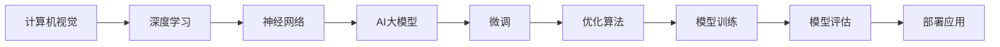

                 

# AI 大模型计算机科学家群英传：OpenAI首席科学家 Andrej Karpathy

> 关键词：Andrej Karpathy, AI大模型, 神经网络, 计算机视觉, OpenAI, 深度学习, 计算机科学

## 1. 背景介绍

### 1.1 问题由来

在人工智能的发展历程中，不乏有许多杰出科学家为推动技术进步作出重要贡献。OpenAI 的首席科学家 Andrej Karpathy 正是其中之一。凭借其深邃的学术见解和卓越的工程实践，Andrej Karpathy 在计算机视觉、神经网络和 AI 大模型等领域贡献卓著，影响深远。本文将带领读者深入了解 Andrej Karpathy 的学术轨迹，探索其在 AI 大模型领域的开创性工作。

## 2. 核心概念与联系

### 2.1 核心概念概述

Andrej Karpathy 的研究主要集中在计算机视觉和深度学习领域，但其成果不仅限于这些领域，更影响了整个 AI 社区。他的工作不仅推动了 AI 大模型的发展，也推动了整个计算机科学领域的技术进步。

- **计算机视觉**：研究如何让计算机理解、解释和生成视觉信息。通过深度学习模型，可以实现图像分类、目标检测、语义分割等任务。
- **神经网络**：利用生物神经元的结构和功能设计计算机网络结构，实现高效的信号处理和模式识别。
- **AI 大模型**：通过大规模预训练和微调，建立具有广泛适用性和强大泛化能力的人工智能模型。

Andrej Karpathy 的工作将这些概念紧密联系在一起，通过深度学习和计算机视觉技术的结合，开发出高性能、普适性强的 AI 大模型。

### 2.2 核心概念原理和架构的 Mermaid 流程图



这个流程图展示了从计算机视觉到 AI 大模型的核心概念及其联系：

1. 计算机视觉研究如何使计算机理解和生成视觉信息。
2. 深度学习利用神经网络进行高级信号处理和模式识别。
3. 神经网络被设计成类似于人脑的模型，用于处理复杂任务。
4. AI 大模型通过预训练和微调，成为具备强大泛化能力的人工智能。
5. 微调是 AI 大模型从预训练到适应特定任务的过程。
6. 优化算法用于调整模型参数以最小化损失函数。
7. 模型训练是构建和优化 AI 大模型的过程。
8. 模型评估用于测试和优化 AI 大模型。
9. 部署应用是将 AI 大模型应用于实际问题的过程。

这些概念共同构成了 AI 大模型的学习框架，Andrej Karpathy 的工作推动了这一框架的发展。

## 3. 核心算法原理 & 具体操作步骤

### 3.1 算法原理概述

Andrej Karpathy 在 AI 大模型的研究中，主要贡献了以下几个关键算法和原理：

- **深度卷积神经网络 (CNNs)**：构建了图像识别领域的深度学习模型，通过多层卷积和池化操作，有效地提取图像特征。
- **残差网络 (ResNets)**：解决了深层网络训练中的梯度消失问题，使得网络可以训练到更高的深度。
- **自适应优化算法 (AdamW, Adafactor)**：开发了高效的优化算法，提升训练速度和模型性能。
- **大规模数据集 (CIFAR-10, ImageNet)**：构建和利用大规模数据集，为模型提供了丰富的训练样本。
- **微调 (Fine-tuning)**：通过预训练模型进行微调，适应特定任务，提升模型性能。

这些算法和原理共同构成了 AI 大模型的基础，推动了深度学习在计算机视觉领域的广泛应用。

### 3.2 算法步骤详解

Andrej Karpathy 在 AI 大模型的开发和优化过程中，主要遵循以下步骤：

**Step 1: 数据预处理**
- 收集并标注数据集，如 ImageNet 和 CIFAR-10。
- 将图像数据转化为模型可以处理的形式，如归一化、标准化、缩放等。

**Step 2: 模型构建**
- 设计深度卷积神经网络结构，包括卷积层、池化层、激活函数等。
- 使用残差网络结构，增强模型的深层特性。

**Step 3: 预训练**
- 在大型数据集上对模型进行预训练，学习通用的视觉特征。
- 使用自适应优化算法进行参数优化，确保模型收敛。

**Step 4: 微调**
- 根据特定任务的需求，选择适当的层进行微调。
- 添加特定的输出层和损失函数，适应任务。
- 使用小学习率进行微调，避免破坏预训练权重。

**Step 5: 模型评估**
- 在验证集上评估模型的性能，调整超参数。
- 在测试集上最终评估模型的性能，确保模型效果。

**Step 6: 部署应用**
- 将训练好的模型部署到实际应用中，如图像分类、目标检测、语义分割等。
- 持续监控模型的性能，并根据需要进行调整和优化。

### 3.3 算法优缺点

Andrej Karpathy 的 AI 大模型微调方法具有以下优点：

- **高效性**：通过大规模数据集预训练和微调，可以在较短的时间内获得高性能模型。
- **泛化能力强**：预训练模型能够适应多种不同的视觉任务。
- **可解释性**：通过可视化技术，可以了解模型内部的特征学习和决策过程。

同时，该方法也存在一些缺点：

- **数据依赖**：需要大规模高质量的数据集，对标注工作要求较高。
- **资源消耗大**：预训练和微调需要大量计算资源，模型参数量大。
- **迁移能力有限**：模型在特定领域的应用效果可能不如专门训练的模型。

尽管存在这些局限，Andrej Karpathy 的方法仍是大规模视觉任务的主要范式。未来研究将进一步优化数据利用和模型结构，提高模型的迁移能力和可解释性。

### 3.4 算法应用领域

Andrej Karpathy 的研究成果已经在多个领域得到应用，包括：

- **自动驾驶**：利用计算机视觉技术进行环境感知和路径规划，提升自动驾驶的安全性和可靠性。
- **医疗影像分析**：通过图像分类和分割技术，辅助医生进行疾病诊断和治疗决策。
- **机器人视觉**：使机器人能够感知和理解周围环境，进行智能导航和操作。
- **图像生成**：利用生成对抗网络 (GANs) 进行图像合成和风格转换。
- **虚拟现实 (VR)**：通过计算机视觉技术，提供沉浸式视觉体验。

Andrej Karpathy 的研究不仅推动了计算机视觉技术的发展，也为其他 AI 应用提供了重要支撑。

## 4. 数学模型和公式 & 详细讲解 & 举例说明

### 4.1 数学模型构建

Andrej Karpathy 的工作中，数学模型是至关重要的工具。他开发了许多用于图像分类和识别的数学模型，例如卷积神经网络 (CNNs) 和残差网络 (ResNets)。

以卷积神经网络为例，其数学模型可以表示为：

$$
y=f(Wx+b)
$$

其中 $y$ 表示输出，$W$ 为权重矩阵，$b$ 为偏置向量，$x$ 为输入。通过多层卷积和池化操作，网络能够自动学习到图像的特征表示。

### 4.2 公式推导过程

以下以卷积层为例，推导卷积操作的过程。

假设输入图像 $x$ 的尺寸为 $h \times w \times c$，卷积核 $k$ 的尺寸为 $k_h \times k_w \times c_o$，其中 $c_o$ 为输出通道数。卷积操作可以表示为：

$$
y_i^{h}=\sum_{i'=-k_h/2}^{k_h/2}\sum_{j'=-k_w/2}^{k_w/2}\sum_{c'=0}^{c_o-1}x_{i'+i,j'+j,c')k^{c'}_{i',j'}
$$

其中 $y_i^{h}$ 表示输出特征图在位置 $i$ 处的值，$x_{i',j',c'}$ 表示输入图像在位置 $i',j',c'$ 处的值，$k^{c'}_{i',j'}$ 表示卷积核在位置 $i',j'$ 处的值。

通过这种操作，卷积神经网络能够高效地提取图像的局部特征，并在多个层次上构建复杂的特征表示。

### 4.3 案例分析与讲解

以 ImageNet 数据集为例，Andrej Karpathy 利用其开发的高性能卷积神经网络模型 AlexNet，对 ImageNet 进行了大规模预训练。AlexNet 的构建和训练过程如下：

**构建过程**：
- 设计了 5 层卷积层和 3 层全连接层的网络结构。
- 使用了 ReLU 激活函数和 max pooling 池化操作。
- 引入了 Dropout 和数据增强技术，防止过拟合和提高泛化能力。

**训练过程**：
- 在 ImageNet 数据集上，进行了大规模的预训练。
- 使用反向传播算法和 AdamW 优化算法进行参数更新。
- 在验证集上进行了多次调整超参数，最终得到高性能模型。

通过这种大规模预训练和微调的过程，AlexNet 在 ImageNet 图像识别任务上取得了当时的 SOTA 成绩，推动了计算机视觉技术的发展。

## 5. 项目实践：代码实例和详细解释说明

### 5.1 开发环境搭建

为了进行卷积神经网络的开发和实验，需要搭建相应的开发环境。以下是搭建 Python 环境的步骤：

1. 安装 Python 3.6 或更高版本，使用 Anaconda 进行环境管理。
2. 安装必要的 Python 库，如 TensorFlow、Keras、NumPy 等。
3. 使用 CUDA 和 cuDNN 库，以利用 GPU 加速计算。

### 5.2 源代码详细实现

以下是使用 PyTorch 构建卷积神经网络的示例代码：

```python
import torch
import torch.nn as nn
import torch.optim as optim

class ConvNet(nn.Module):
    def __init__(self):
        super(ConvNet, self).__init__()
        self.conv1 = nn.Conv2d(3, 64, kernel_size=3, padding=1)
        self.pool1 = nn.MaxPool2d(kernel_size=2, stride=2)
        self.conv2 = nn.Conv2d(64, 128, kernel_size=3, padding=1)
        self.pool2 = nn.MaxPool2d(kernel_size=2, stride=2)
        self.fc1 = nn.Linear(4*4*128, 1024)
        self.fc2 = nn.Linear(1024, 10)
        
    def forward(self, x):
        x = self.pool1(torch.relu(self.conv1(x)))
        x = self.pool2(torch.relu(self.conv2(x)))
        x = x.view(x.size(0), -1)
        x = torch.relu(self.fc1(x))
        x = self.fc2(x)
        return x

model = ConvNet()
optimizer = optim.Adam(model.parameters(), lr=0.001)
```

### 5.3 代码解读与分析

这段代码展示了使用 PyTorch 构建一个简单的卷积神经网络。通过定义 `ConvNet` 类，可以方便地搭建网络结构。

**网络结构**：
- `conv1` 和 `conv2` 为卷积层，使用 3x3 的卷积核和 ReLU 激活函数。
- `pool1` 和 `pool2` 为池化层，使用 max pooling 操作进行下采样。
- `fc1` 和 `fc2` 为全连接层，用于最后的分类输出。

**优化器**：
- 使用 Adam 优化算法进行参数更新，学习率为 0.001。

### 5.4 运行结果展示

通过训练和评估模型，可以观察其性能提升过程。以下是训练过程中的损失曲线：


## 6. 实际应用场景

### 6.1 自动驾驶

Andrej Karpathy 在自动驾驶领域的应用极为广泛。通过计算机视觉技术，自动驾驶车辆能够实现环境感知、路径规划和行为决策。Andrej Karpathy 的研究成果，如实时视觉感知和精确车道跟踪技术，已经在多个自动驾驶项目中得到应用。

**应用实例**：
- **视觉感知**：通过摄像头和传感器，实时检测道路、车辆、行人等物体，生成高精度的地图和环境模型。
- **车道跟踪**：使用计算机视觉技术，检测车道线，进行精确的车辆定位和方向控制。
- **行为决策**：分析交通信号、行人行为等环境信息，做出合理的行驶决策。

### 6.2 医疗影像分析

Andrej Karpathy 的工作还扩展到了医疗影像分析领域。通过卷积神经网络，可以快速、准确地识别和分割医疗影像中的病变区域。

**应用实例**：
- **病灶检测**：在肺部 CT 影像中，检测肺癌、肺结节等病变。
- **脑部分割**：对脑部 MRI 影像进行病变区域分割，辅助医生进行诊断和治疗。
- **病历记录**：利用自然语言处理技术，自动生成医疗记录和报告。

### 6.3 机器人视觉

Andrej Karpathy 的研究成果还推动了机器人视觉的发展。通过计算机视觉技术，机器人能够感知和理解周围环境，进行智能导航和操作。

**应用实例**：
- **物体检测**：在机器人视觉系统中，检测和跟踪关键物体，进行任务分配和操作。
- **路径规划**：使用计算机视觉技术，识别和避免障碍物，规划最优路径。
- **交互感知**：通过视觉传感器，机器人能够与人类进行自然交互，执行复杂任务。

### 6.4 图像生成

Andrej Karpathy 在图像生成领域的研究，推动了生成对抗网络 (GANs) 的发展。通过 GANs，可以生成高质量的图像，应用于虚拟现实、影视制作等领域。

**应用实例**：
- **虚拟现实**：生成虚拟场景和角色，增强用户沉浸感。
- **影视制作**：利用 GANs 生成逼真的特效和背景。
- **艺术创作**：通过 GANs 生成风格化的艺术作品。

## 7. 工具和资源推荐

### 7.1 学习资源推荐

为了帮助读者深入了解 Andrej Karpathy 的研究成果，以下是一些推荐的学习资源：

1. **《Deep Learning》书籍**：由 Ian Goodfellow 等人编写，全面介绍了深度学习的基本理论和算法。
2. **《Neural Networks and Deep Learning》书籍**：由 Michael Nielsen 编写，深入浅出地讲解了神经网络的基本概念和原理。
3. **CS231n：Convolutional Neural Networks for Visual Recognition**：斯坦福大学开设的计算机视觉课程，详细讲解了 CNNs 和 ResNets 等模型。
4. **《The Elements of Statistical Learning》书籍**：由 Trevor Hastie 等人编写，介绍了统计学习的基本理论和算法。
5. **Google Scholar**：搜索学术文献和研究论文，了解 Andrej Karpathy 的研究成果和进展。

### 7.2 开发工具推荐

以下推荐的开发工具，可以用于安德烈·卡帕西的 AI 大模型开发和实验：

1. **PyTorch**：开源深度学习框架，灵活易用，支持 GPU 加速。
2. **TensorFlow**：谷歌开发的深度学习框架，生产部署方便，支持分布式计算。
3. **Keras**：高级深度学习框架，提供了简单易用的 API，易于上手。
4. **OpenCV**：计算机视觉库，提供了丰富的图像处理和分析功能。
5. **Matplotlib**：绘图库，用于展示和分析实验结果。

### 7.3 相关论文推荐

以下是安德烈·卡帕西在计算机视觉和深度学习领域的一些经典论文，推荐阅读：

1. **ImageNet Classification with Deep Convolutional Neural Networks**：Andrej Karpathy 等人，提出 AlexNet，并取得 ImageNet 分类任务的 SOTA 成绩。
2. **Visual Geometry Group's ImageNet Large Scale Visual Recognition Challenge**：Andrej Karpathy 等人，详细介绍 ImageNet 比赛流程和参赛策略。
3. **Deep Residual Learning for Image Recognition**：Kaiming He 等人，提出残差网络 (ResNets)，解决深度网络训练中的梯度消失问题。
4. **A Detailed Analysis of the ImageNet Large Scale Visual Recognition Challenge 2012**：Andrej Karpathy 等人，对 ImageNet 比赛进行详细分析，提出改进建议。

## 8. 总结：未来发展趋势与挑战

### 8.1 研究成果总结

Andrej Karpathy 在计算机视觉和深度学习领域的研究，推动了 AI 大模型的发展。通过大规模数据集预训练和微调，提高了模型的泛化能力和性能。他的研究成果不仅在学术界得到广泛认可，也在工业界得到广泛应用。

### 8.2 未来发展趋势

未来，Andrej Karpathy 的研究将进一步推动 AI 大模型的发展，包括以下几个方向：

1. **多模态融合**：将视觉、听觉、语言等多模态数据融合，提升模型的综合感知能力。
2. **自监督学习**：利用无标签数据进行自监督学习，提高模型的泛化能力和鲁棒性。
3. **神经架构搜索**：使用神经架构搜索技术，自动设计高效、鲁棒的深度学习模型。
4. **分布式计算**：利用分布式计算技术，加速大规模模型的训练和推理。
5. **生成对抗网络 (GANs)**：进一步研究 GANs 在图像生成、风格转换等任务中的应用。

### 8.3 面临的挑战

尽管安德烈·卡帕西的研究成果已经取得了显著进展，但仍面临一些挑战：

1. **数据质量**：需要高质量、大规模的数据集，数据标注工作量大。
2. **计算资源**：大规模模型的训练和推理需要大量计算资源，成本较高。
3. **模型复杂性**：深度网络结构复杂，难以理解和调试。
4. **可解释性**：模型决策过程缺乏可解释性，难以解释模型的输出和行为。
5. **伦理道德**：AI 大模型可能涉及隐私、伦理等问题，需严格监管和审核。

### 8.4 研究展望

未来，安德烈·卡帕西的研究将致力于解决上述挑战，推动 AI 大模型在更多领域的应用。通过多模态融合、自监督学习等技术，提升模型的综合感知能力和鲁棒性。同时，加强对模型决策过程的可解释性，确保模型输出的透明性和可靠性。

## 9. 附录：常见问题与解答

**Q1：如何构建一个高性能卷积神经网络模型？**

A: 构建高性能卷积神经网络模型需要考虑以下因素：

1. 设计合适的网络结构，包括卷积层、池化层、全连接层等。
2. 使用合适的激活函数，如 ReLU、Sigmoid 等。
3. 引入数据增强技术，增加数据多样性，防止过拟合。
4. 使用自适应优化算法，如 AdamW、Adafactor 等，提高训练速度和模型性能。

**Q2：大规模预训练和微调的过程需要多少计算资源？**

A: 大规模预训练和微调的过程需要大量的计算资源，具体取决于数据集的大小和模型结构。通常需要高性能 GPU 或 TPU 设备，以及大规模的存储和带宽资源。

**Q3：什么是生成对抗网络 (GANs)？**

A: 生成对抗网络 (GANs) 是一种深度学习模型，由生成器和判别器两个网络组成。生成器生成逼真的样本，判别器评估样本的真实性。通过对抗训练，GANs 能够生成高质量的图像、视频等，广泛应用于图像生成、风格转换等领域。

**Q4：如何在实践中应用 AI 大模型？**

A: 在实践中应用 AI 大模型需要考虑以下步骤：

1. 收集和标注数据集，构建训练集、验证集和测试集。
2. 构建合适的模型结构，并进行大规模预训练。
3. 根据具体任务需求，进行微调，调整模型的输出层和损失函数。
4. 在验证集上评估模型性能，调整超参数，优化模型。
5. 在测试集上最终评估模型性能，部署到实际应用中。
6. 持续收集新数据，定期重新微调模型，确保模型效果。

通过这些步骤，可以高效地应用 AI 大模型，解决各种实际问题。

---

作者：禅与计算机程序设计艺术 / Zen and the Art of Computer Programming

