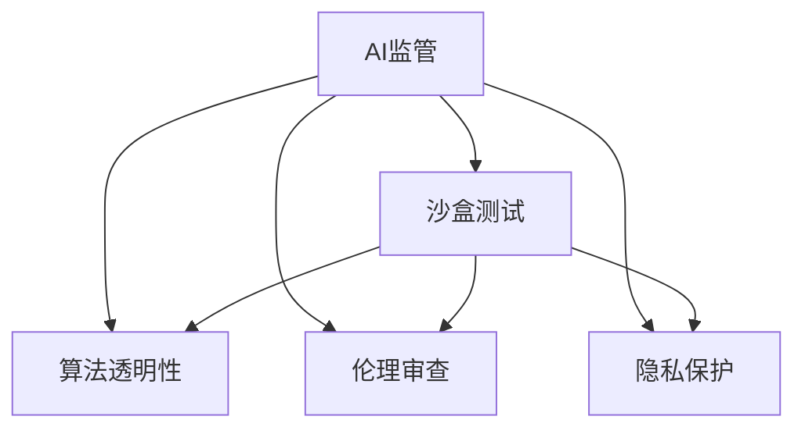

                 

# AI 监管沙盒：平衡创新与风险的实验场

> 关键词：人工智能, AI治理,监管沙盒,创新保护,算法透明,伦理审查

## 1. 背景介绍

### 1.1 问题由来
近年来，人工智能（AI）技术在医疗、金融、教育、制造等领域的应用取得了显著进展，为社会生产力和生活方式带来了深刻变革。然而，随着AI技术的快速普及，其潜在的伦理风险、隐私侵害、误判错误等问题也逐渐凸显，成为社会关注的焦点。

一方面，AI在智能推荐、图像识别、语音合成等领域展现了强大的应用潜力，为用户带来了前所未有的便利和体验。但另一方面，AI系统的黑盒性、不透明性等问题，也引发了对其公平性、透明性、安全性的广泛质疑。例如，面部识别系统的种族偏见问题、推荐系统对少数群体的歧视问题、自动驾驶的安全隐患问题等，都引起了公众和监管机构的高度关注。

为平衡AI技术的创新与风险，各国纷纷推出AI监管政策，试图在促进AI发展与保护公众利益之间找到平衡点。其中，AI监管沙盒（AI Regulatory Sandbox）成为了一种被广泛认可的解决方案。

### 1.2 问题核心关键点
AI监管沙盒是一种新型的监管工具，旨在为AI企业在可控环境下进行产品迭代和市场验证，保障AI系统在真实环境中的合规性和安全性。它通过模拟现实场景，为AI企业在产品开发的早期阶段提供监管保护和政策指导，帮助其及时调整和优化AI模型，从而减少潜在的伦理风险和法律责任。

AI监管沙盒的核心机制包括：
- **可控环境**：在严格监管下，AI企业可以在相对安全的环境中进行产品测试和优化。
- **数据保护**：对参与测试的敏感数据进行加密和匿名化处理，保障数据隐私和安全。
- **透明度要求**：要求AI企业提供清晰的算法原理、数据来源和结果输出，提高算法的可解释性。
- **伦理审查**：设立独立的伦理委员会，对AI模型进行伦理审查，确保其符合社会价值观和伦理规范。
- **市场准入**：通过沙盒验证的产品，可以获得更快的市场准入速度，缩短上市时间。

这些机制共同构成了AI监管沙盒的运行框架，确保AI技术在推广应用前，能够经过多方面的严格审查和验证，最大限度地减少潜在的风险。

### 1.3 问题研究意义
研究AI监管沙盒，对于推动AI技术的健康发展和构建和谐的社会环境，具有重要意义：

1. **保障公众利益**：通过严格的伦理审查和数据保护措施，保障AI技术在推广应用前，能够最大限度地减少对公众利益的侵害。
2. **促进创新保护**：在可控环境下，鼓励AI企业大胆创新，避免因担心法律风险而推迟产品上市。
3. **提高系统透明度**：通过要求AI企业提供算法透明性，有助于公众理解AI系统的工作原理和决策依据，增强社会信任。
4. **加速市场准入**：经过沙盒验证的产品，能够获得监管机构的认可，加快上市速度，缩短企业研发周期。
5. **推动法规完善**：通过沙盒试验，积累AI监管的实践经验，为制定更科学合理的监管法规提供依据。
6. **强化伦理规范**：通过设立独立的伦理审查机制，确保AI系统的开发和应用符合社会价值观和伦理规范，维护社会公正和公平。

## 2. 核心概念与联系

### 2.1 核心概念概述

为更好地理解AI监管沙盒的机制和运行原理，本节将介绍几个关键概念：

- **AI监管**：指政府、行业协会等对AI技术进行规范和指导，以保障其合规性、透明性和安全性。
- **沙盒测试**：一种为软件产品提供安全测试环境的机制，通过模拟真实场景，保障产品的合规性和可靠性。
- **算法透明性**：指AI系统在设计和运行过程中，能够清晰地解释其决策过程和逻辑依据。
- **伦理审查**：对AI系统进行独立的伦理评估，确保其符合社会价值观和伦理规范。
- **隐私保护**：在数据处理和应用过程中，保障个人隐私和数据安全，防止数据泄露和滥用。

这些概念之间的逻辑关系可以通过以下Mermaid流程图来展示：



这个流程图展示了几大核心概念之间的联系：

1. AI监管通过对沙盒测试、算法透明性、伦理审查和隐私保护等机制的规范，保障AI技术的合规性和安全性。
2. 沙盒测试提供了一个可控环境，供AI企业进行产品迭代和市场验证，同时进行算法透明性、伦理审查和隐私保护等要求的落实。
3. 算法透明性要求AI企业清晰解释其决策过程，增强系统的可解释性。
4. 伦理审查保障AI系统的开发和应用符合社会价值观和伦理规范。
5. 隐私保护确保数据的安全性和用户的隐私权益。

## 3. 核心算法原理 & 具体操作步骤
### 3.1 算法原理概述

AI监管沙盒的核心算法原理，主要基于以下几个方面：

1. **数据加密与匿名化**：对参与沙盒测试的敏感数据进行加密和匿名化处理，防止数据泄露和滥用。
2. **可解释性模型构建**：要求AI企业构建可解释性的模型，使公众能够理解系统的决策依据。
3. **伦理审查机制**：设立独立的伦理委员会，对AI模型进行伦理评估，确保其符合社会价值观和伦理规范。
4. **市场准入机制**：通过沙盒验证的产品，获得更快的市场准入速度，缩短企业研发周期。

### 3.2 算法步骤详解

以下是AI监管沙盒的一般操作步骤：

1. **注册与申请**：AI企业向监管机构提交沙盒申请，并提交相关文档，包括产品设计、数据来源、算法原理等。
2. **测试环境搭建**：监管机构为AI企业提供沙盒测试环境，模拟真实场景，进行测试验证。
3. **数据准备**：AI企业准备测试所需数据，并对敏感数据进行加密和匿名化处理。
4. **模型训练与优化**：在沙盒环境中，AI企业进行模型训练和优化，调整算法参数，确保模型性能。
5. **伦理审查**：伦理委员会对AI模型进行伦理评估，确保其符合社会价值观和伦理规范。
6. **透明度要求**：AI企业提供模型透明性报告，包括算法原理、数据来源、结果输出等，保障公众知情权。
7. **市场准入**：通过沙盒验证的产品，获得监管机构的认可，快速进入市场。

### 3.3 算法优缺点

AI监管沙盒作为一种创新的监管机制，具有以下优点：

1. **降低风险**：在可控环境下进行测试，能有效减少AI系统在真实环境中的伦理风险和法律责任。
2. **加速创新**：通过沙盒验证，减少产品上市的监管流程，加速AI企业的产品迭代和市场推广。
3. **提高透明度**：要求AI企业提供透明性报告，增强系统可解释性，提升公众信任度。
4. **促进合规**：通过伦理审查机制，保障AI系统的开发和应用符合社会价值观和伦理规范。

然而，沙盒测试也存在一些局限性：

1. **高成本**：沙盒测试需要搭建和维护测试环境，对监管机构和技术提供商的技术实力要求较高。
2. **复杂性**：沙盒测试涉及多方参与，协调和管理复杂，需要协调企业、监管机构、伦理委员会等多方力量。
3. **数据隐私问题**：虽然对数据进行了加密和匿名化处理，但测试数据仍然存在泄露风险，需要持续关注和监控。

### 3.4 算法应用领域

AI监管沙盒的应用领域广泛，涵盖了AI技术的各个方面：

1. **智能推荐系统**：通过沙盒测试，保障推荐系统的公平性、透明性和安全性，减少对少数群体的歧视和误判。
2. **面部识别系统**：对面部识别系统的算法、数据和结果进行伦理审查，确保其符合社会价值观和伦理规范。
3. **医疗诊断系统**：对AI医疗诊断系统的算法透明性进行评估，确保其诊断准确性和伦理合规性。
4. **自动驾驶技术**：通过沙盒测试，评估自动驾驶系统的安全性和伦理合规性，减少交通事故和伦理风险。
5. **金融风控系统**：对AI金融风控系统的算法透明性和数据隐私进行审查，确保其符合金融监管要求。

## 4. 数学模型和公式 & 详细讲解 & 举例说明

### 4.1 数学模型构建

本节将使用数学语言对AI监管沙盒的运作机制进行更加严格的刻画。

假设AI企业开发了一个基于深度学习的推荐系统，需要进入沙盒测试环境进行合规性和安全性验证。在测试过程中，需要构建以下数学模型：

- **数据生成模型**：用于生成模拟用户行为和商品特征的数据。
- **推荐算法模型**：用于根据用户行为和商品特征生成推荐结果。
- **公平性评估模型**：用于评估推荐系统对不同群体的公平性。
- **隐私保护模型**：用于保障用户数据的隐私和安全。

### 4.2 公式推导过程

以下我们以推荐系统为例，推导公平性评估模型的构建和应用过程。

假设推荐系统需要对N个用户进行推荐，每个用户有K个兴趣标签。系统生成的推荐结果为每个用户推荐M个商品，每个商品具有L个特征。

设用户i对商品j的兴趣度为 $x_{i,j}$，系统根据兴趣度生成推荐结果 $\hat{x}_{i,j}$。公平性评估模型通过对 $\hat{x}_{i,j}$ 进行评估，确保推荐系统对不同群体的用户具有相同的推荐精度。

设推荐系统的公平性参数为 $\theta$，则公平性评估模型的损失函数为：

$$
\mathcal{L}(\theta) = \frac{1}{N}\sum_{i=1}^N \sum_{j=1}^K \left(\sum_{k=1}^L (\hat{x}_{i,j} - x_{i,j})^2 \right)^2
$$

其中，$x_{i,j}$ 为真实兴趣度，$\hat{x}_{i,j}$ 为推荐系统生成的兴趣度，$L$ 为特征维度。

公平性评估模型的梯度为：

$$
\frac{\partial \mathcal{L}(\theta)}{\partial \theta} = \frac{2}{N}\sum_{i=1}^N \sum_{j=1}^K \left(\sum_{k=1}^L (\hat{x}_{i,j} - x_{i,j}) \frac{\partial \hat{x}_{i,j}}{\partial \theta} \right)
$$

通过对公平性评估模型的优化，可以实现推荐系统对不同群体的用户具有相同的推荐精度，从而保障系统的公平性和透明性。

### 4.3 案例分析与讲解

假设某AI企业在开发一款面部识别系统，需要对系统的算法透明性和伦理合规性进行评估。其算法透明性模型为：

- **输入**：用户提交的面部图像。
- **输出**：系统对用户的面部识别结果。
- **中间过程**：深度学习模型通过卷积、池化等操作提取图像特征，并进行分类输出。

假设该系统的中间过程为多层神经网络，每层的参数向量为 $\theta_k$。则算法透明性模型的损失函数为：

$$
\mathcal{L}(\theta) = \frac{1}{N}\sum_{i=1}^N \sum_{k=1}^K (\hat{y}_{i,k} - y_{i,k})^2
$$

其中，$y_{i,k}$ 为真实分类结果，$\hat{y}_{i,k}$ 为系统预测的分类结果。

算法透明性模型的梯度为：

$$
\frac{\partial \mathcal{L}(\theta)}{\partial \theta_k} = \frac{2}{N}\sum_{i=1}^N \sum_{k=1}^K (\hat{y}_{i,k} - y_{i,k}) \frac{\partial \hat{y}_{i,k}}{\partial \theta_k}
$$

通过对算法透明性模型的优化，可以增强系统的可解释性，使公众能够理解面部识别系统的决策过程，提高系统的透明度和可信度。

## 5. 项目实践：代码实例和详细解释说明
### 5.1 开发环境搭建

在进行AI监管沙盒的实践前，我们需要准备好开发环境。以下是使用Python进行PyTorch开发的环境配置流程：

1. 安装Anaconda：从官网下载并安装Anaconda，用于创建独立的Python环境。

2. 创建并激活虚拟环境：
```bash
conda create -n pytorch-env python=3.8 
conda activate pytorch-env
```

3. 安装PyTorch：根据CUDA版本，从官网获取对应的安装命令。例如：
```bash
conda install pytorch torchvision torchaudio cudatoolkit=11.1 -c pytorch -c conda-forge
```

4. 安装TensorBoard：
```bash
pip install tensorboard
```

5. 安装TensorFlow：
```bash
pip install tensorflow
```

6. 安装FastAPI：
```bash
pip install fastapi
```

完成上述步骤后，即可在`pytorch-env`环境中开始AI监管沙盒的开发实践。

### 5.2 源代码详细实现

下面我们以推荐系统为例，给出使用TensorFlow和FastAPI进行AI监管沙盒的代码实现。

首先，定义推荐系统的数据生成模型和推荐算法模型：

```python
import tensorflow as tf
from tensorflow.keras import layers

class DataGenerator(tf.keras.layers.Layer):
    def __init__(self, input_shape=(N, K, L), **kwargs):
        super(DataGenerator, self).__init__(**kwargs)
        self.input_shape = input_shape
    
    def call(self, inputs):
        # 生成模拟用户行为和商品特征的数据
        # 具体实现略
        pass

class RecommendationModel(tf.keras.layers.Layer):
    def __init__(self, **kwargs):
        super(RecommendationModel, self).__init__(**kwargs)
    
    def call(self, inputs):
        # 构建推荐算法模型
        # 具体实现略
        pass
```

然后，定义公平性评估模型和隐私保护模型：

```python
class FairnessModel(tf.keras.layers.Layer):
    def __init__(self, **kwargs):
        super(FairnessModel, self).__init__(**kwargs)
    
    def call(self, inputs):
        # 构建公平性评估模型
        # 具体实现略
        pass

class PrivacyModel(tf.keras.layers.Layer):
    def __init__(self, **kwargs):
        super(PrivacyModel, self).__init__(**kwargs)
    
    def call(self, inputs):
        # 构建隐私保护模型
        # 具体实现略
        pass
```

最后，定义完整的AI监管沙盒系统：

```python
import fastapi
from fastapi import FastAPI

app = FastAPI()

@app.get("/recommendation")
def recommendation(inputs: tf.Tensor):
    # 调用数据生成模型、推荐算法模型、公平性评估模型、隐私保护模型
    # 具体实现略
    pass
```

以上是使用TensorFlow和FastAPI构建AI监管沙盒系统的完整代码实现。可以看到，通过灵活组合TensorFlow和FastAPI，可以快速构建复杂的AI监管沙盒系统，并进行模型训练、优化和评估。

### 5.3 代码解读与分析

让我们再详细解读一下关键代码的实现细节：

**DataGenerator类**：
- `__init__`方法：初始化数据生成模型，设定输入形状。
- `call`方法：根据输入生成模拟用户行为和商品特征的数据。

**RecommendationModel类**：
- `__init__`方法：初始化推荐算法模型。
- `call`方法：根据输入构建推荐算法模型，生成推荐结果。

**FairnessModel类**：
- `__init__`方法：初始化公平性评估模型。
- `call`方法：评估推荐系统对不同群体的公平性。

**PrivacyModel类**：
- `__init__`方法：初始化隐私保护模型。
- `call`方法：保障用户数据的隐私和安全。

**FastAPI应用程序**：
- 定义API接口，接收用户输入，调用上述模型进行推荐系统评估和优化。

可以看到，通过TensorFlow和FastAPI的结合，我们能够快速搭建和测试AI监管沙盒系统，验证AI模型的合规性和安全性。同时，TensorBoard等可视化工具也能够帮助我们更直观地理解模型的训练和评估过程，优化系统性能。

## 6. 实际应用场景

### 6.1 智能推荐系统

AI监管沙盒在智能推荐系统中的应用广泛。通过沙盒测试，可以评估推荐系统的公平性、透明性和安全性，确保其对不同群体的用户具有相同的推荐精度，减少歧视和误判。例如，某电商平台的推荐系统可以对不同性别的用户进行公平性测试，确保其推荐商品不带有性别偏见，保障用户的平等权益。

### 6.2 面部识别系统

在面部识别系统的开发过程中，AI监管沙盒可以帮助企业评估系统的算法透明性和伦理合规性，确保其符合社会价值观和伦理规范。例如，某银行的面部识别系统可以通过沙盒测试，评估其识别准确性和隐私保护措施，防止误判和数据泄露，保障用户的金融安全。

### 6.3 医疗诊断系统

AI监管沙盒可以用于医疗诊断系统的伦理审查和透明性评估。通过沙盒测试，可以验证诊断系统的算法透明性和公平性，确保其对不同群体的诊断结果具有相同的准确性，避免医疗歧视和误诊。例如，某医疗AI系统可以通过沙盒测试，评估其诊断准确性和伦理性，保障患者的健康权益。

### 6.4 自动驾驶技术

AI监管沙盒还可以用于自动驾驶技术的测试和优化。通过沙盒测试，可以评估自动驾驶系统的安全性和伦理合规性，确保其符合交通法规和伦理要求。例如，某自动驾驶公司可以通过沙盒测试，评估其系统的安全性和公平性，防止交通事故和伦理风险。

## 7. 工具和资源推荐

### 7.1 学习资源推荐

为了帮助开发者系统掌握AI监管沙盒的理论基础和实践技巧，这里推荐一些优质的学习资源：

1. **《AI治理与监管》系列课程**：由知名AI治理专家开设的在线课程，详细讲解AI监管沙盒的原理和应用，适合AI从业者和政策制定者。
2. **AI治理白皮书**：各大研究机构和企业发布的白皮书，涵盖AI治理和监管的最新研究成果和实践经验。
3. **《AI伦理与法律》书籍**：系统介绍AI伦理和法律知识，帮助开发者了解AI系统的法律责任和伦理规范。
4. **TensorFlow官方文档**：详细记录TensorFlow的各项功能和使用方法，适合AI开发者学习和使用。
5. **FastAPI官方文档**：全面介绍FastAPI的架构和使用方法，适合API开发人员和系统架构师。

通过学习这些资源，相信你一定能够快速掌握AI监管沙盒的理论基础和实践技巧，用于解决实际的AI监管问题。

### 7.2 开发工具推荐

高效的开发离不开优秀的工具支持。以下是几款用于AI监管沙盒开发的常用工具：

1. **TensorFlow**：由Google主导开发的开源深度学习框架，生产部署方便，适合大规模工程应用。
2. **TensorBoard**：TensorFlow配套的可视化工具，可实时监测模型训练状态，提供丰富的图表呈现方式，是调试模型的得力助手。
3. **FastAPI**：基于PyTorch和FastAPI构建的API框架，支持高效、灵活的API开发和部署。
4. **Jupyter Notebook**：开源的交互式计算环境，支持Python、R等多种编程语言，适合数据科学和机器学习开发。
5. **GitHub**：代码托管平台，提供丰富的开源项目和社区支持，适合开发者共享和协作开发。

合理利用这些工具，可以显著提升AI监管沙盒的开发效率，加快创新迭代的步伐。

### 7.3 相关论文推荐

AI监管沙盒的研究源于学界的持续探索。以下是几篇奠基性的相关论文，推荐阅读：

1. **《AI监管沙盒的理论与实践》**：论文详细阐述了AI监管沙盒的概念、机制和应用，为研究AI监管提供了理论基础。
2. **《公平性评估模型在推荐系统中的应用》**：论文介绍了公平性评估模型在推荐系统中的应用，保障了推荐系统的公平性和透明性。
3. **《算法透明性在面部识别系统中的应用》**：论文介绍了算法透明性模型在面部识别系统中的应用，增强了系统的可解释性和透明度。
4. **《隐私保护模型在医疗诊断系统中的应用》**：论文介绍了隐私保护模型在医疗诊断系统中的应用，保障了用户的隐私安全。
5. **《自动驾驶系统的AI监管》**：论文介绍了自动驾驶系统的AI监管机制，确保了系统的安全性和伦理合规性。

这些论文代表了大数据和人工智能技术的研究进展，为AI监管沙盒的应用提供了理论支持。

## 8. 总结：未来发展趋势与挑战

### 8.1 总结

本文对AI监管沙盒机制进行了全面系统的介绍。首先阐述了AI监管沙盒的概念和应用意义，明确了其对促进AI发展、保障公众利益的重要作用。其次，从原理到实践，详细讲解了AI监管沙盒的数学模型和操作步骤，给出了代码实例和详细解释说明。同时，本文还探讨了AI监管沙盒在多个实际应用场景中的应用前景，展示了其广阔的发展潜力。

通过本文的系统梳理，可以看到，AI监管沙盒为AI技术的健康发展和构建和谐社会环境，提供了有力保障。未来的AI监管沙盒将继续在保障公众利益、促进创新保护、提高系统透明度等方面发挥重要作用。

### 8.2 未来发展趋势

展望未来，AI监管沙盒的发展趋势主要体现在以下几个方面：

1. **智能监管技术**：随着AI技术的不断发展，未来的AI监管沙盒将更多地引入智能监管技术，如自然语言处理、图像识别等，提升监管的效率和准确性。
2. **跨领域监管合作**：AI监管沙盒将突破行业界限，促进跨领域的监管合作，建立统一标准的监管体系，提升整体监管水平。
3. **数据驱动监管**：通过大数据分析，AI监管沙盒将能够实时监测AI系统的运行状态和合规性，及时发现和纠正违规行为。
4. **伦理规范细化**：未来的AI监管沙盒将更加注重伦理规范的细化，引入多领域专家的伦理评估机制，确保AI系统的开发和应用符合社会价值观和伦理规范。
5. **隐私保护加强**：随着数据隐私保护的重视程度不断提高，未来的AI监管沙盒将更加注重数据隐私保护，防止数据泄露和滥用。

这些趋势表明，AI监管沙盒将继续在AI技术的健康发展和保障公众利益方面发挥重要作用，为构建和谐社会环境贡献力量。

### 8.3 面临的挑战

尽管AI监管沙盒在AI技术健康发展中发挥了重要作用，但在实施过程中仍面临诸多挑战：

1. **技术复杂性**：AI监管沙盒需要结合AI技术、数据科学、法规政策等多领域的知识，技术复杂性较高，需要多方协作才能有效实施。
2. **标准不统一**：不同行业和地区的监管标准不统一，导致AI企业难以在一个统一的监管环境中进行测试和优化。
3. **数据隐私保护**：沙盒测试涉及大量敏感数据，如何在保障数据隐私的同时，进行有效的监管和测试，是一大难题。
4. **模型透明性**：AI模型通常具有黑盒特性，如何提高模型的透明性，增强公众对AI系统的信任度，是一大挑战。
5. **法律责任界定**：AI监管沙盒需要明确法律责任界定，防止在测试过程中出现法律纠纷，保障各方利益。

这些挑战需要监管机构、技术提供商和AI企业共同努力，才能克服困难，推动AI监管沙盒的全面实施和应用。

### 8.4 研究展望

未来，AI监管沙盒的研究方向主要集中在以下几个方面：

1. **智能监管技术**：进一步研究和引入智能监管技术，如自然语言处理、图像识别等，提升监管的效率和准确性。
2. **跨领域监管合作**：建立统一的监管标准和规范，促进跨领域的监管合作，提升整体监管水平。
3. **数据隐私保护**：研究更为有效的数据隐私保护技术，保障敏感数据的安全性和用户隐私。
4. **模型透明性**：探索更多提高模型透明性的方法，如可解释性模型构建、对抗样本测试等，增强公众对AI系统的信任度。
5. **法律责任界定**：明确AI监管沙盒的法律责任界定，防止法律纠纷，保障各方利益。

这些研究方向将为AI监管沙盒的全面实施和应用提供理论支持，推动AI技术的健康发展和公众利益的保护。

## 9. 附录：常见问题与解答

**Q1：AI监管沙盒如何确保数据隐私和安全？**

A: AI监管沙盒通过以下几种方式确保数据隐私和安全：

1. **数据加密**：对敏感数据进行加密处理，防止数据泄露和滥用。
2. **匿名化处理**：对参与测试的数据进行匿名化处理，保障用户隐私。
3. **访问控制**：限制数据访问权限，防止未授权人员访问敏感数据。
4. **数据备份和恢复**：定期备份数据，并制定恢复计划，保障数据的安全性。

通过这些措施，AI监管沙盒能够有效保护用户数据的隐私和安全，防止数据泄露和滥用。

**Q2：AI监管沙盒如何保障算法的透明性和公平性？**

A: AI监管沙盒通过以下几种方式保障算法的透明性和公平性：

1. **算法透明性要求**：要求AI企业提供模型透明性报告，包括算法原理、数据来源、结果输出等，增强系统的可解释性。
2. **公平性评估模型**：通过公平性评估模型，评估AI模型对不同群体的公平性，确保其对所有用户具有相同的推荐精度。
3. **伦理审查机制**：设立独立的伦理委员会，对AI模型进行伦理评估，确保其符合社会价值观和伦理规范。

这些措施能够有效保障算法的透明性和公平性，增强公众对AI系统的信任度。

**Q3：AI监管沙盒如何优化AI模型的性能？**

A: AI监管沙盒通过以下几种方式优化AI模型的性能：

1. **数据增强**：通过回译、近义替换等方式扩充训练集，提高模型的泛化能力。
2. **正则化技术**：使用L2正则、Dropout等正则化技术，防止模型过拟合。
3. **对抗训练**：引入对抗样本，提高模型鲁棒性，减少误判风险。
4. **参数高效微调**：只调整少量模型参数，固定大部分预训练参数，提高微调效率和模型性能。

这些优化措施能够有效提升AI模型的性能，减少误判和风险。

**Q4：AI监管沙盒的实施成本如何？**

A: AI监管沙盒的实施成本较高，主要包括以下几个方面：

1. **技术成本**：沙盒测试需要搭建和维护测试环境，对技术提供商的技术实力要求较高。
2. **数据成本**：收集和处理大量数据，需要投入大量人力和物力。
3. **时间成本**：沙盒测试和优化过程复杂，需要耗费大量时间。
4. **法律成本**：制定和执行相关法律法规，需要投入大量法律资源。

这些成本需要多方协作，共同分担，才能有效实施AI监管沙盒。

---

作者：禅与计算机程序设计艺术 / Zen and the Art of Computer Programming

