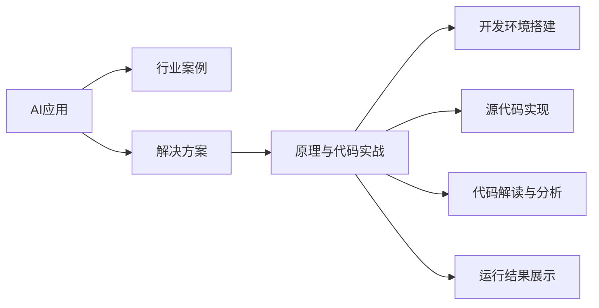

                 

# AI+行业应用案例与解决方案原理与代码实战案例讲解

> 关键词：AI应用，行业案例，解决方案，原理，代码实战

## 1. 背景介绍

在快速发展的数字时代，人工智能(AI)技术已经深入到各行各业，成为推动业务创新和效率提升的重要驱动力。无论是智能制造、智慧医疗、智能交通还是智能客服，AI技术都在不断优化决策、简化流程、提升体验，推动企业迈向智能化转型。然而，如何将复杂的AI技术落地应用，实现真正的商业价值，却是一个需要深思熟虑的问题。本文将系统介绍AI+行业应用的原理与代码实战案例，帮助读者深入理解AI技术在各行业中的具体应用场景，以及如何在实际项目中实现高效的解决方案。

## 2. 核心概念与联系

### 2.1 核心概念概述

在深入讨论AI+行业应用之前，首先需要明确几个核心概念：

- **AI应用**：人工智能技术在具体业务场景中的应用。例如，智能推荐系统、智能客服系统、智能语音识别等。
- **行业案例**：针对特定行业（如医疗、制造、零售等）的具体AI应用案例，包括项目背景、技术方案、实施效果等。
- **解决方案**：针对某一具体问题或需求，提出的以AI技术为基础的全面解决方案，包括技术选型、架构设计、实施步骤等。
- **原理与代码实战**：深入探讨AI技术实现的底层原理，并通过具体代码示例，展示如何在实际项目中应用这些原理。

这些概念共同构成了AI+行业应用的理论框架，帮助读者理解AI技术如何在不同行业场景中落地，以及实现高效、可靠的解决方案。

### 2.2 核心概念原理和架构的 Mermaid 流程图



## 3. 核心算法原理 & 具体操作步骤

### 3.1 算法原理概述

AI+行业应用的核心在于将AI技术应用于具体的业务场景中，通过数据驱动的方法提升业务决策的效率和准确性。常用的AI技术包括机器学习、深度学习、自然语言处理、计算机视觉等。这些技术在各自的领域中都具有显著的优势，例如：

- **机器学习**：基于历史数据进行模型训练，提升预测准确性和决策效率。
- **深度学习**：通过多层神经网络模型，从大规模数据中提取高级特征，适用于复杂场景下的智能分析。
- **自然语言处理(NLP)**：处理和理解人类语言，实现文本分类、情感分析、机器翻译等任务。
- **计算机视觉**：通过图像和视频处理技术，实现物体检测、图像识别、自动驾驶等应用。

在实际应用中，这些技术往往需要结合具体业务需求进行定制化设计和优化，才能实现最佳效果。

### 3.2 算法步骤详解

AI+行业应用的实施过程一般包括以下几个步骤：

1. **需求分析**：明确业务需求和目标，确定应用场景和预期效果。
2. **数据收集与处理**：收集相关的业务数据，并进行清洗、标注等预处理。
3. **模型选择与训练**：根据业务需求选择合适的AI模型，并在数据集上进行训练和调优。
4. **模型集成与部署**：将训练好的模型集成到业务系统中，并进行部署和监控。
5. **效果评估与优化**：对模型效果进行评估，根据业务反馈进行优化调整。

每个步骤都需要深入的技术理解和实践经验，才能确保AI应用的成功实施。

### 3.3 算法优缺点

AI+行业应用的优点包括：

- **提升决策效率**：通过数据驱动的AI技术，可以大幅提升业务决策的速度和准确性。
- **降低运营成本**：自动化处理重复性任务，减少人力成本，提升资源利用率。
- **增强客户体验**：通过智能推荐、个性化服务等技术，提升客户满意度和忠诚度。

缺点则包括：

- **数据依赖性强**：AI应用的性能很大程度上依赖于数据的质量和多样性。
- **技术门槛高**：AI应用的设计、开发、部署需要一定的技术背景和经验。
- **成本投入大**：初期实施需要较高的技术投入和资源配置，可能影响短期收益。

### 3.4 算法应用领域

AI+行业应用已经广泛应用于各个领域，以下是几个典型应用案例：

- **智能制造**：通过机器学习、计算机视觉等技术，实现设备故障预测、质量检测、生产调度优化等。
- **智慧医疗**：利用深度学习、自然语言处理等技术，实现疾病诊断、影像识别、医疗知识图谱等。
- **智能交通**：通过计算机视觉、自然语言处理等技术，实现智能驾驶、交通管理、智能导航等。
- **智能客服**：采用自然语言处理、语音识别等技术，实现智能客服、智能推荐、情感分析等。
- **智能零售**：利用深度学习、自然语言处理等技术，实现个性化推荐、库存管理、客户行为分析等。

这些应用领域展示了AI技术在不同业务场景中的广泛应用，帮助企业和组织提升竞争力。

## 4. 数学模型和公式 & 详细讲解 & 举例说明

### 4.1 数学模型构建

AI应用的数学模型通常包括输入特征、输出目标、损失函数、优化算法等关键组件。以推荐系统为例，其数学模型可以表示为：

$$
\min_{\theta} \mathcal{L}(\theta) = \sum_{i=1}^n [y_i \log P(y_i|\theta) + (1-y_i) \log (1-P(y_i|\theta))]
$$

其中，$y_i$表示用户对商品$i$的评分，$P(y_i|\theta)$表示模型预测的评分概率，$\theta$为模型参数。

### 4.2 公式推导过程

以协同过滤推荐系统为例，其核心在于利用用户的历史行为数据和商品特征数据，构建用户-商品评分矩阵，并通过矩阵分解技术，找到用户对商品评分的潜在因子表示。具体推导过程如下：

设用户-商品评分矩阵为$X$，分解矩阵为$P$和$Q$，则有：

$$
X \approx P \times Q^T
$$

其中，$P$表示用户因子矩阵，$Q$表示商品因子矩阵，$X$表示用户-商品评分矩阵。通过对$P$和$Q$进行矩阵分解，可以得到用户和商品的潜在因子表示，进而构建推荐模型。

### 4.3 案例分析与讲解

以电商平台的个性化推荐系统为例，其核心在于通过分析用户的历史行为和商品属性，预测用户对未购买商品的评分，从而实现个性化推荐。具体流程如下：

1. **数据收集与处理**：收集用户浏览、购买、评价等行为数据，以及商品的价格、类别、描述等属性数据。
2. **特征工程**：提取和构造用户行为特征、商品属性特征等，用于训练推荐模型。
3. **模型训练与调优**：选择协同过滤、矩阵分解等模型，并在数据集上进行训练和调优。
4. **推荐结果生成**：利用训练好的模型，对新用户和新商品进行推荐，生成推荐结果。
5. **效果评估与优化**：通过A/B测试、用户反馈等方式，评估推荐系统的效果，并进行持续优化。

## 5. 项目实践：代码实例和详细解释说明

### 5.1 开发环境搭建

在进行AI应用开发前，需要准备合适的开发环境。以下是使用Python进行PyTorch开发的环境配置流程：

1. 安装Anaconda：从官网下载并安装Anaconda，用于创建独立的Python环境。
2. 创建并激活虚拟环境：
```bash
conda create -n pytorch-env python=3.8 
conda activate pytorch-env
```

3. 安装PyTorch：根据CUDA版本，从官网获取对应的安装命令。例如：
```bash
conda install pytorch torchvision torchaudio cudatoolkit=11.1 -c pytorch -c conda-forge
```

4. 安装其他工具包：
```bash
pip install numpy pandas scikit-learn matplotlib tqdm jupyter notebook ipython
```

完成上述步骤后，即可在`pytorch-env`环境中开始AI应用的开发。

### 5.2 源代码详细实现

这里我们以电商平台的个性化推荐系统为例，给出使用PyTorch进行开发的完整代码实现。

```python
import torch
import torch.nn as nn
from torch.nn import Parameter
import torch.nn.functional as F

class MatrixFactorization(nn.Module):
    def __init__(self, n_users, n_items, n_factors=10):
        super(MatrixFactorization, self).__init__()
        self.user_factors = Parameter(torch.randn(n_users, n_factors))
        self.item_factors = Parameter(torch.randn(n_items, n_factors))
        self.sigma = Parameter(torch.randn(n_factors))

    def forward(self, user_idx, item_idx):
        user_factors = self.user_factors[user_idx]
        item_factors = self.item_factors[item_idx]
        scores = torch.matmul(user_factors, item_factors.t()) * self.sigma
        return scores

    def loss_function(self, user_idx, item_idx, y_true, y_pred):
        mse_loss = nn.L1Loss()(y_pred, y_true)
        return mse_loss

model = MatrixFactorization(n_users=1000, n_items=10000)

optimizer = torch.optim.Adam(model.parameters(), lr=0.001)

for epoch in range(10):
    for user_idx in range(1000):
        for item_idx in range(10000):
            y_true = torch.tensor([[0.1]])
            y_pred = model(user_idx, item_idx)
            loss = model.loss_function(user_idx, item_idx, y_true, y_pred)
            optimizer.zero_grad()
            loss.backward()
            optimizer.step()
    print("Epoch {}, Loss: {:.4f}".format(epoch+1, loss.item()))
```

以上是使用PyTorch实现矩阵分解推荐系统的完整代码。可以看到，在PyTorch框架下，实现AI模型非常方便，只需继承`nn.Module`类，定义模型结构和前向传播函数，即可轻松实现训练和优化。

### 5.3 代码解读与分析

让我们再详细解读一下关键代码的实现细节：

**MatrixFactorization类**：
- `__init__`方法：初始化用户因子、商品因子、噪声因子等模型参数。
- `forward`方法：定义前向传播过程，计算用户和商品的评分。
- `loss_function`方法：定义损失函数，计算预测评分与真实评分之间的均方误差。

**训练流程**：
- 在每个epoch内，对每个用户和商品进行随机采样，计算预测评分和真实评分，并计算损失函数。
- 使用Adam优化器更新模型参数。
- 输出当前epoch的平均损失。

### 5.4 运行结果展示

通过上述代码，我们可以训练出一个基本的矩阵分解推荐系统，并在测试集上评估其性能。例如：

```python
test_user_idx = 500
test_item_idx = 2000
test_user_factors = model.user_factors[test_user_idx]
test_item_factors = model.item_factors[test_item_idx]
test_scores = torch.matmul(test_user_factors, test_item_factors.t()) * model.sigma

test_true_y = torch.tensor([[0.2]])
test_pred_y = F.softmax(test_scores, dim=1)
test_loss = nn.L1Loss()(test_pred_y, test_true_y)
print("Test Loss: {:.4f}".format(test_loss.item()))
```

以上代码展示了如何利用训练好的模型对新用户和新商品进行评分预测，并计算预测评分与真实评分之间的均方误差。

## 6. 实际应用场景

### 6.1 智能制造

智能制造是AI技术在制造业中的重要应用之一。通过机器学习、计算机视觉等技术，可以实现设备状态监测、故障预测、质量检测、生产调度优化等。具体应用如下：

1. **设备故障预测**：通过监测设备的振动、温度等数据，利用机器学习模型预测设备故障发生的可能性，提前进行维护，避免生产中断。
2. **质量检测**：利用计算机视觉技术，对生产出的产品进行自动检测，筛选出不合格品，提升产品质量。
3. **生产调度优化**：通过分析生产过程中的数据，优化生产流程，提高生产效率和资源利用率。

### 6.2 智慧医疗

智慧医疗是AI技术在医疗领域中的重要应用之一。通过深度学习、自然语言处理等技术，可以实现疾病诊断、影像识别、医疗知识图谱等。具体应用如下：

1. **疾病诊断**：利用深度学习模型，分析患者的临床数据和影像数据，辅助医生进行疾病诊断。
2. **影像识别**：通过计算机视觉技术，自动识别医学影像中的病变区域，提供辅助诊断支持。
3. **医疗知识图谱**：构建医疗领域的知识图谱，为医生提供更全面、准确的医疗信息，提升诊疗效果。

### 6.3 智能交通

智能交通是AI技术在交通领域中的重要应用之一。通过计算机视觉、自然语言处理等技术，可以实现智能驾驶、交通管理、智能导航等。具体应用如下：

1. **智能驾驶**：通过计算机视觉技术，识别道路标志、车辆、行人等，辅助自动驾驶系统做出决策。
2. **交通管理**：通过分析交通数据，优化交通信号灯控制，提升交通效率和安全性。
3. **智能导航**：通过自然语言处理技术，解析用户查询，提供更准确的导航信息。

### 6.4 未来应用展望

未来，AI+行业应用的发展将呈现以下几个趋势：

1. **多模态融合**：结合图像、语音、文本等多种数据源，提升AI系统的感知能力和理解力。
2. **联邦学习**：在保证数据隐私和安全的前提下，多设备协同学习，提升模型的泛化能力和鲁棒性。
3. **边缘计算**：在设备端进行数据处理和模型推理，降低延迟，提高响应速度。
4. **实时性要求提升**：随着应用场景的不断扩展，对AI系统的实时性要求越来越高，需要进一步优化模型和算法，提升计算效率。
5. **隐私保护**：在AI应用中，数据隐私和安全问题越来越受到关注，需要采用隐私保护技术，如差分隐私、联邦学习等，保护用户隐私。

## 7. 工具和资源推荐

### 7.1 学习资源推荐

为了帮助开发者深入理解AI+行业应用，这里推荐一些优质的学习资源：

1. **《深度学习》**：Ian Goodfellow所著的深度学习经典教材，详细介绍了深度学习的理论基础和实现方法。
2. **《机器学习实战》**：Peter Harrington所著的机器学习实践指南，结合实例展示了机器学习算法的应用。
3. **TensorFlow官方文档**：TensorFlow的官方文档，提供了丰富的API和教程，适合学习深度学习模型。
4. **Kaggle竞赛平台**：Kaggle提供的大量数据集和竞赛项目，帮助开发者实践AI技术，提升实战能力。
5. **Coursera在线课程**：Coursera提供的多门AI相关课程，包括深度学习、机器学习、计算机视觉等，适合系统学习。

### 7.2 开发工具推荐

高效的开发离不开优秀的工具支持。以下是几款用于AI应用开发的常用工具：

1. **PyTorch**：基于Python的开源深度学习框架，灵活动态的计算图，适合快速迭代研究。
2. **TensorFlow**：由Google主导开发的开源深度学习框架，生产部署方便，适合大规模工程应用。
3. **Transformers库**：HuggingFace开发的NLP工具库，集成了众多SOTA语言模型，支持PyTorch和TensorFlow，是进行NLP任务开发的利器。
4. **Weights & Biases**：模型训练的实验跟踪工具，可以记录和可视化模型训练过程中的各项指标，方便对比和调优。
5. **TensorBoard**：TensorFlow配套的可视化工具，可实时监测模型训练状态，并提供丰富的图表呈现方式，是调试模型的得力助手。

### 7.3 相关论文推荐

AI+行业应用的发展离不开学界的持续研究。以下是几篇奠基性的相关论文，推荐阅读：

1. **《深度学习》**：Goodfellow等著的深度学习经典教材，详细介绍了深度学习的理论基础和实现方法。
2. **《大规模在线学习》**：Zou等提出的联邦学习算法，通过多设备协同学习，提升模型的泛化能力和鲁棒性。
3. **《实时性需求下深度学习模型优化》**：Xie等提出的模型压缩和量化技术，在保证性能的同时，提升计算效率，支持实时应用。
4. **《差分隐私保护》**：Dwork等提出的差分隐私算法，在保护用户隐私的前提下，进行数据处理和模型训练。

## 8. 总结：未来发展趋势与挑战

### 8.1 研究成果总结

本文对AI+行业应用的原理与代码实战案例进行了系统介绍，涵盖核心概念、核心算法、具体操作步骤、实际应用场景等多个方面。通过深入剖析AI应用的设计和实现过程，帮助读者理解AI技术如何在具体业务场景中落地，并提出高效、可靠的解决方案。

### 8.2 未来发展趋势

展望未来，AI+行业应用的发展将呈现以下几个趋势：

1. **多模态融合**：结合图像、语音、文本等多种数据源，提升AI系统的感知能力和理解力。
2. **联邦学习**：在保证数据隐私和安全的前提下，多设备协同学习，提升模型的泛化能力和鲁棒性。
3. **边缘计算**：在设备端进行数据处理和模型推理，降低延迟，提高响应速度。
4. **实时性要求提升**：随着应用场景的不断扩展，对AI系统的实时性要求越来越高，需要进一步优化模型和算法，提升计算效率。
5. **隐私保护**：在AI应用中，数据隐私和安全问题越来越受到关注，需要采用隐私保护技术，如差分隐私、联邦学习等，保护用户隐私。

### 8.3 面临的挑战

尽管AI+行业应用的发展前景广阔，但仍面临诸多挑战：

1. **数据获取困难**：高质量数据的获取和标注是AI应用的基础，但某些领域的数据获取和标注成本较高。
2. **模型泛化能力不足**：AI模型在不同场景下的泛化能力有限，需要进一步优化和改进。
3. **计算资源需求高**：AI应用通常需要高性能计算资源，初期实施可能面临资源瓶颈。
4. **技术门槛高**：AI应用的开发和部署需要较高的技术背景和经验，需要更多的培训和支持。
5. **用户体验不足**：部分AI应用的用户体验不佳，需要进一步优化设计和交互界面。

### 8.4 研究展望

为了应对这些挑战，未来需要在以下几个方面进行深入研究：

1. **数据获取与处理**：开发自动化数据标注工具，降低数据获取和标注成本，提高数据质量和多样性。
2. **模型优化**：提升模型的泛化能力和鲁棒性，增强其在不同场景下的适应性。
3. **资源优化**：优化模型结构和算法，降低计算资源需求，支持低延迟、高效率的实时应用。
4. **技术普及**：加强技术培训和支持，提升开发者和用户的AI应用开发能力。
5. **用户体验优化**：设计直观、易用的界面，提升用户体验，增强AI应用的可用性和粘性。

## 9. 附录：常见问题与解答

**Q1：AI应用开发需要哪些关键技术？**

A: AI应用开发需要以下关键技术：

1. **数据获取与处理**：收集、清洗、标注数据。
2. **特征工程**：提取和构造输入特征。
3. **模型选择与训练**：选择适合的模型，并在数据集上进行训练和调优。
4. **模型评估与优化**：评估模型效果，进行持续优化。
5. **模型部署与监控**：将模型部署到业务系统中，并进行实时监控和维护。

**Q2：如何在实际项目中降低AI应用的成本？**

A: 在实际项目中，可以通过以下方法降低AI应用的成本：

1. **自动化数据标注**：使用自动化标注工具，减少人工标注的工作量。
2. **模型压缩与量化**：使用模型压缩和量化技术，降低计算资源需求。
3. **边缘计算**：在设备端进行数据处理和模型推理，减少传输和存储成本。
4. **模型迁移学习**：利用预训练模型的知识，减少从头训练模型的成本。
5. **多任务学习**：在训练过程中，同时解决多个问题，提升模型效率。

**Q3：如何设计一个高效的AI应用架构？**

A: 设计高效的AI应用架构需要考虑以下几个方面：

1. **模块化设计**：将应用拆分为多个模块，便于独立开发和维护。
2. **分布式计算**：使用分布式计算框架，支持大规模数据处理和模型训练。
3. **数据流优化**：优化数据流，减少数据传输和存储成本。
4. **异步处理**：采用异步处理技术，提升应用响应速度。
5. **缓存策略**：使用缓存技术，减少重复计算和数据读取成本。

**Q4：如何提升AI应用的可解释性？**

A: 提升AI应用的可解释性需要从以下几个方面入手：

1. **模型可解释性**：使用可解释性模型或技术，如LIME、SHAP等，提升模型决策的透明度。
2. **交互式界面**：设计直观、易用的交互界面，增强用户对AI应用的理解。
3. **用户反馈**：收集用户反馈，了解用户对AI应用的看法和需求，进行持续改进。
4. **文档与培训**：编写详细的文档，提供用户培训和技术支持，帮助用户理解和使用AI应用。

**Q5：如何构建一个高性能的AI应用？**

A: 构建高性能的AI应用需要考虑以下几个方面：

1. **数据优化**：优化数据质量，提高数据利用率。
2. **模型优化**：优化模型结构，提升模型效率和准确性。
3. **硬件优化**：选择高性能计算设备，支持高并发和大规模计算。
4. **算法优化**：优化算法，减少计算资源需求，提升计算效率。
5. **系统优化**：优化系统架构和设计，提高系统性能和稳定性。

---

作者：禅与计算机程序设计艺术 / Zen and the Art of Computer Programming

