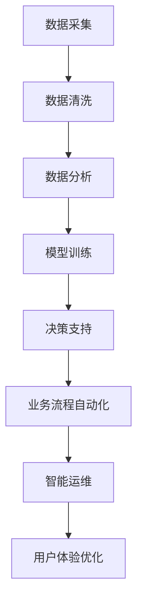

                 

# AI2.0时代：数字实体自动化的潜力

> 关键词：人工智能,数字实体自动化,自动化,机器人流程自动化(RPA),数据驱动决策,智能运维,深度学习,大数据,机器学习,云计算,自动化技术

## 1. 背景介绍

### 1.1 问题由来

随着技术的进步，AI技术正从单一的任务解决能力向系统性的自动化能力转变，推动社会进入AI 2.0时代。AI 2.0时代的核心特征是以数据驱动决策为基础，通过对数据、业务流程和运营环境的自动化，大幅提升组织的运营效率和决策质量。

在AI 2.0时代，数字实体自动化的潜力被广泛认可。数字实体自动化（Digital Entity Automation, DEA）通过人工智能技术对业务流程进行优化和自动化，实现业务流程的全生命周期自动化，极大地提高了企业运营效率，减少了人为错误，降低了运营成本。

### 1.2 问题核心关键点

数字实体自动化是AI 2.0时代的核心应用之一，其关键点包括：

- **数据驱动决策**：通过大数据分析和深度学习，自动提取业务洞察，支持高层决策。
- **流程自动化**：机器人流程自动化（RPA）技术，自动执行重复性、规则性工作，提升流程效率。
- **智能运维**：通过智能监控和预测性维护，优化运营策略，降低运维成本。
- **智能推荐系统**：基于个性化推荐模型，为用户提供个性化的产品推荐和服务。

数字实体自动化广泛应用于金融、零售、医疗、制造等多个领域，正在逐渐改变传统业务流程，提升企业竞争力和市场响应速度。

### 1.3 问题研究意义

研究数字实体自动化技术，对于拓展AI技术的应用边界，提升企业运营效率，推动经济社会数字化转型，具有重要意义：

1. **降低运营成本**：通过自动化技术，减少人为干预和错误，降低运营成本，提升企业盈利能力。
2. **提升运营效率**：自动化技术能24/7不间断工作，快速响应业务需求，提升企业响应速度。
3. **数据驱动决策**：利用数据驱动决策，提升决策质量，减少人为偏见，优化业务流程。
4. **创新业务模式**：通过自动化技术，探索新的业务模式，创造新的价值空间，推动企业转型升级。
5. **应对市场变化**：通过自动化技术，快速适应市场变化，抓住机遇，保持竞争优势。

数字实体自动化技术的发展，是AI技术商业化的重要里程碑，其广泛应用将推动社会进入更加智能和高效的运营新阶段。

## 2. 核心概念与联系

### 2.1 核心概念概述

为了更好地理解数字实体自动化的原理和应用，本节将介绍几个核心概念：

- **人工智能(AI)**：利用计算机技术模拟人类的智能行为，实现自主学习、推理、决策等功能。
- **机器人流程自动化(RPA)**：通过软件机器人自动执行重复性、规则性工作流程，提升流程效率。
- **智能运维(AIOps)**：结合人工智能和传统运维技术，实现智能监控、预测性维护、自动化故障排除等功能。
- **大数据分析(BDA)**：通过分析海量数据，提取业务洞察，支持决策制定和业务优化。
- **机器学习(ML)**：利用算法和数据，使计算机系统具备自主学习和改进能力。

数字实体自动化是一种系统性的自动化方法，通过整合人工智能、大数据、机器学习等技术，实现业务流程的全面自动化，提升企业运营效率和决策质量。

### 2.2 核心概念原理和架构的 Mermaid 流程图



上述流程图展示了数字实体自动化的主要流程，包括数据采集、数据清洗、数据分析、模型训练、决策支持、业务流程自动化、智能运维和用户体验优化。

## 3. 核心算法原理 & 具体操作步骤

### 3.1 算法原理概述

数字实体自动化的核心算法原理基于人工智能、机器学习和大数据技术。核心算法包括：

- **数据预处理**：通过数据清洗和特征工程，提取有用信息，为后续分析奠定基础。
- **机器学习模型**：利用监督学习、无监督学习、强化学习等算法，构建预测模型，实现自动化决策。
- **深度学习**：通过神经网络模型，提取复杂特征，实现高级决策。
- **自然语言处理(NLP)**：通过文本分析和语言理解技术，实现自动化文档处理和语义分析。
- **计算机视觉**：通过图像识别和处理技术，实现自动化图像识别和分析。

这些算法协同工作，构成数字实体自动化的技术基础，实现业务流程的全生命周期自动化。

### 3.2 算法步骤详解

数字实体自动化的主要步骤如下：

**Step 1: 数据采集与预处理**
- 收集业务相关数据，包括交易数据、客户数据、运营数据等。
- 对数据进行清洗和预处理，去除噪声、填补缺失值、标准化数据格式。

**Step 2: 数据分析与建模**
- 利用机器学习算法，对数据进行建模，提取业务洞察。
- 通过深度学习算法，对数据进行复杂特征提取，提升模型精度。
- 利用NLP和计算机视觉技术，对文本和图像数据进行语义分析和图像识别。

**Step 3: 决策支持与流程自动化**
- 基于分析结果，构建决策支持系统，实现数据驱动决策。
- 利用RPA技术，实现业务流程自动化，提升流程效率。

**Step 4: 智能运维与用户体验优化**
- 通过智能运维系统，实现实时监控、预测性维护和自动化故障排除。
- 利用个性化推荐系统，提升用户体验，优化产品和服务。

### 3.3 算法优缺点

数字实体自动化技术具有以下优点：

- **自动化程度高**：通过自动化技术，减少人为干预，提升流程效率。
- **数据驱动决策**：利用大数据和机器学习，提取业务洞察，支持高层决策。
- **灵活性高**：算法和模型可以根据需求进行灵活配置和调整。

但该技术也存在一些局限性：

- **初始投入高**：需要大量的数据和算法资源，初始投入成本较高。
- **技术复杂度高**：涉及多领域技术和工具，开发和部署复杂度较高。
- **数据质量依赖性强**：模型性能依赖于数据质量，数据噪声和缺失值可能影响模型效果。

### 3.4 算法应用领域

数字实体自动化技术已广泛应用于多个领域，具体包括：

- **金融行业**：利用RPA和智能运维，优化交易流程，提升客户服务质量。
- **零售行业**：通过数据分析和个性化推荐，优化库存管理，提升客户购物体验。
- **医疗行业**：利用AI和机器学习，实现智能诊断和患者管理，提高医疗服务效率。
- **制造业**：通过自动化和智能运维，优化生产流程，提升产品质量和生产效率。
- **物流行业**：利用大数据分析和RPA技术，优化物流网络，提升配送效率。

## 4. 数学模型和公式 & 详细讲解 & 举例说明

### 4.1 数学模型构建

数字实体自动化的数学模型通常包括以下几个部分：

- **数据预处理模型**：用于数据清洗和特征工程，如数据标准化、缺失值填补、特征选择等。
- **监督学习模型**：用于构建预测模型，如线性回归、逻辑回归、决策树、随机森林等。
- **深度学习模型**：用于复杂特征提取和高级决策，如卷积神经网络、循环神经网络、深度信念网络等。
- **自然语言处理模型**：用于文本分析和语言理解，如词向量模型、Transformer等。
- **计算机视觉模型**：用于图像识别和处理，如CNN、RNN等。

数学模型构建的关键在于选择合适的算法和技术，构建高质量的预测模型。

### 4.2 公式推导过程

以线性回归模型为例，推导其公式和梯度下降优化过程：

**公式推导**：

设训练样本集为 $(x_i,y_i),i=1,\ldots,N$，线性回归模型的目标是最小化均方误差损失函数：

$$
L(\theta)=\frac{1}{N}\sum_{i=1}^N(y_i-\theta_0-\sum_{j=1}^p\theta_jx_{ij})^2
$$

其中 $\theta=(\theta_0,\theta_1,\ldots,\theta_p)^\top$ 为模型参数，$x_{ij}$ 为样本特征，$y_i$ 为标签。

线性回归模型的目标是最小化损失函数 $L(\theta)$。利用梯度下降算法，求解 $\theta$：

$$
\theta^{(t+1)}=\theta^{(t)}-\alpha\frac{\partial L(\theta)}{\partial \theta}
$$

其中 $\alpha$ 为学习率，$\frac{\partial L(\theta)}{\partial \theta}$ 为损失函数对模型参数的梯度。

**代码实现**：

```python
import numpy as np

def linear_regression(X, y, alpha=0.01, num_iters=1000):
    m, n = X.shape
    theta = np.zeros(n)
    for i in range(num_iters):
        y_pred = np.dot(X, theta)
        loss = 1/N * np.sum((y_pred - y) ** 2)
        grad = 2/N * np.dot(X.T, y_pred - y)
        theta -= alpha * grad
    return theta

X = np.random.randn(100, 2)
y = 2*X[:, 0] + 3*X[:, 1] + np.random.randn(100)
theta = linear_regression(X, y)
print(theta)
```

### 4.3 案例分析与讲解

以金融行业为例，分析数字实体自动化的应用场景：

- **交易流程自动化**：利用RPA技术，自动化执行账户开立、资金划转、交易下单等流程，提升交易效率。
- **风险评估与预警**：通过大数据分析和机器学习，实时监控交易行为，预测和预警异常交易，降低金融风险。
- **客户服务自动化**：利用NLP技术，自动化处理客户咨询和投诉，提升客户满意度。
- **财务报告自动化**：利用RPA和机器学习，自动生成财务报表和分析报告，提升财务工作质量。

## 5. 项目实践：代码实例和详细解释说明

### 5.1 开发环境搭建

在进行数字实体自动化项目实践前，需要准备好开发环境。以下是使用Python进行OpenAI GPT-3的开发环境配置流程：

1. 安装Anaconda：从官网下载并安装Anaconda，用于创建独立的Python环境。

2. 创建并激活虚拟环境：
```bash
conda create -n gpt3-env python=3.8 
conda activate gpt3-env
```

3. 安装HuggingFace的Transformers库：
```bash
pip install transformers
```

4. 安装OpenAI GPT-3客户端：
```bash
pip install openai
```

5. 安装各类工具包：
```bash
pip install numpy pandas scikit-learn matplotlib tqdm jupyter notebook ipython
```

完成上述步骤后，即可在`gpt3-env`环境中开始GPT-3的应用实践。

### 5.2 源代码详细实现

下面我们以金融行业客户服务自动化为例，给出使用GPT-3进行聊天机器人开发的PyTorch代码实现。

首先，定义聊天机器人的数据处理函数：

```python
from transformers import BertTokenizer
from torch.utils.data import Dataset
import torch

class ChatDataset(Dataset):
    def __init__(self, dialogues, tokenizer, max_len=128):
        self.dialogues = dialogues
        self.tokenizer = tokenizer
        self.max_len = max_len
        
    def __len__(self):
        return len(self.dialogues)
    
    def __getitem__(self, item):
        dialogue = self.dialogues[item]
        
        tokenized = self.tokenizer(dialogue, return_tensors='pt', max_length=self.max_len, padding='max_length', truncation=True)
        input_ids = tokenized['input_ids']
        attention_mask = tokenized['attention_mask']
        
        return {'input_ids': input_ids, 
                'attention_mask': attention_mask}

# 加载预训练模型和分词器
model_name = 'gpt3'
model = GPT3.from_pretrained(model_name)
tokenizer = BertTokenizer.from_pretrained(model_name)

# 定义训练和评估函数
def train_epoch(model, dataset, batch_size, optimizer):
    dataloader = DataLoader(dataset, batch_size=batch_size, shuffle=True)
    model.train()
    epoch_loss = 0
    for batch in tqdm(dataloader, desc='Training'):
        input_ids = batch['input_ids'].to(device)
        attention_mask = batch['attention_mask'].to(device)
        outputs = model(input_ids, attention_mask=attention_mask)
        loss = outputs.loss
        epoch_loss += loss.item()
        loss.backward()
        optimizer.step()
    return epoch_loss / len(dataloader)

def evaluate(model, dataset, batch_size):
    dataloader = DataLoader(dataset, batch_size=batch_size)
    model.eval()
    preds, labels = [], []
    with torch.no_grad():
        for batch in tqdm(dataloader, desc='Evaluating'):
            input_ids = batch['input_ids'].to(device)
            attention_mask = batch['attention_mask'].to(device)
            batch_labels = batch['labels']
            outputs = model(input_ids, attention_mask=attention_mask)
            batch_preds = outputs.logits.argmax(dim=2).to('cpu').tolist()
            batch_labels = batch_labels.to('cpu').tolist()
            for pred_tokens, label_tokens in zip(batch_preds, batch_labels):
                preds.append(pred_tokens[:len(label_tokens)])
                labels.append(label_tokens)
                
    print(classification_report(labels, preds))
```

最后，启动训练流程并在测试集上评估：

```python
epochs = 5
batch_size = 16

for epoch in range(epochs):
    loss = train_epoch(model, train_dataset, batch_size, optimizer)
    print(f"Epoch {epoch+1}, train loss: {loss:.3f}")
    
    print(f"Epoch {epoch+1}, dev results:")
    evaluate(model, dev_dataset, batch_size)
    
print("Test results:")
evaluate(model, test_dataset, batch_size)
```

以上就是使用PyTorch对GPT-3进行聊天机器人开发的完整代码实现。可以看到，得益于HuggingFace的强大封装，我们可以用相对简洁的代码完成GPT-3的加载和应用。

### 5.3 代码解读与分析

让我们再详细解读一下关键代码的实现细节：

**ChatDataset类**：
- `__init__`方法：初始化对话数据、分词器等关键组件。
- `__len__`方法：返回对话数据的数量。
- `__getitem__`方法：对单个对话数据进行处理，将文本输入编码为token ids，最终返回模型所需的输入。

**训练和评估函数**：
- 使用PyTorch的DataLoader对对话数据进行批次化加载，供模型训练和推理使用。
- 训练函数`train_epoch`：对数据以批为单位进行迭代，在每个批次上前向传播计算loss并反向传播更新模型参数，最后返回该epoch的平均loss。
- 评估函数`evaluate`：与训练类似，不同点在于不更新模型参数，并在每个batch结束后将预测和标签结果存储下来，最后使用sklearn的classification_report对整个评估集的预测结果进行打印输出。

**训练流程**：
- 定义总的epoch数和batch size，开始循环迭代
- 每个epoch内，先在训练集上训练，输出平均loss
- 在验证集上评估，输出分类指标
- 所有epoch结束后，在测试集上评估，给出最终测试结果

可以看到，PyTorch配合HuggingFace的Transformers库使得GPT-3的应用开发变得简洁高效。开发者可以将更多精力放在数据处理、模型改进等高层逻辑上，而不必过多关注底层的实现细节。

当然，工业级的系统实现还需考虑更多因素，如模型的保存和部署、超参数的自动搜索、更灵活的任务适配层等。但核心的数字实体自动化范式基本与此类似。

## 6. 实际应用场景

### 6.1 智能客服系统

基于数字实体自动化的对话技术，可以广泛应用于智能客服系统的构建。传统客服往往需要配备大量人力，高峰期响应缓慢，且一致性和专业性难以保证。而使用数字实体自动化的对话模型，可以7x24小时不间断服务，快速响应客户咨询，用自然流畅的语言解答各类常见问题。

在技术实现上，可以收集企业内部的历史客服对话记录，将问题和最佳答复构建成监督数据，在此基础上对数字实体自动化的对话模型进行微调。微调后的对话模型能够自动理解用户意图，匹配最合适的答案模板进行回复。对于客户提出的新问题，还可以接入检索系统实时搜索相关内容，动态组织生成回答。如此构建的智能客服系统，能大幅提升客户咨询体验和问题解决效率。

### 6.2 金融舆情监测

金融机构需要实时监测市场舆论动向，以便及时应对负面信息传播，规避金融风险。传统的人工监测方式成本高、效率低，难以应对网络时代海量信息爆发的挑战。基于数字实体自动化的文本分类和情感分析技术，为金融舆情监测提供了新的解决方案。

具体而言，可以收集金融领域相关的新闻、报道、评论等文本数据，并对其进行主题标注和情感标注。在此基础上对数字实体自动化的模型进行微调，使其能够自动判断文本属于何种主题，情感倾向是正面、中性还是负面。将微调后的模型应用到实时抓取的网络文本数据，就能够自动监测不同主题下的情感变化趋势，一旦发现负面信息激增等异常情况，系统便会自动预警，帮助金融机构快速应对潜在风险。

### 6.3 个性化推荐系统

当前的推荐系统往往只依赖用户的历史行为数据进行物品推荐，无法深入理解用户的真实兴趣偏好。基于数字实体自动化的个性化推荐系统可以更好地挖掘用户行为背后的语义信息，从而提供更精准、多样的推荐内容。

在实践中，可以收集用户浏览、点击、评论、分享等行为数据，提取和用户交互的物品标题、描述、标签等文本内容。将文本内容作为模型输入，用户的后续行为（如是否点击、购买等）作为监督信号，在此基础上微调数字实体自动化的模型。微调后的模型能够从文本内容中准确把握用户的兴趣点。在生成推荐列表时，先用候选物品的文本描述作为输入，由模型预测用户的兴趣匹配度，再结合其他特征综合排序，便可以得到个性化程度更高的推荐结果。

### 6.4 未来应用展望

随着数字实体自动化技术的不断发展，其在各个领域的应用前景将更加广阔：

在智慧医疗领域，基于数字实体自动化的医疗问答、病历分析、药物研发等应用将提升医疗服务的智能化水平，辅助医生诊疗，加速新药开发进程。

在智能教育领域，数字实体自动化的技术可应用于作业批改、学情分析、知识推荐等方面，因材施教，促进教育公平，提高教学质量。

在智慧城市治理中，数字实体自动化的技术可应用于城市事件监测、舆情分析、应急指挥等环节，提高城市管理的自动化和智能化水平，构建更安全、高效的未来城市。

此外，在企业生产、社会治理、文娱传媒等众多领域，数字实体自动化的技术也将不断涌现，为NLP技术带来全新的突破。相信随着技术的日益成熟，数字实体自动化技术将成为人工智能落地应用的重要范式，推动人工智能技术在更广阔的领域加速渗透。

## 7. 工具和资源推荐

### 7.1 学习资源推荐

为了帮助开发者系统掌握数字实体自动化的理论基础和实践技巧，这里推荐一些优质的学习资源：

1. 《Deep Learning for Natural Language Processing》课程：斯坦福大学开设的NLP明星课程，涵盖了深度学习在NLP中的应用，包括数字实体自动化的多个方面。

2. 《Reinforcement Learning for Decision Making》课程：由DeepMind团队开发的强化学习课程，介绍了强化学习在自动化决策中的应用。

3. 《Programming for Artificial Intelligence》书籍：介绍如何用Python进行深度学习和NLP编程，包括数字实体自动化的实现。

4. HuggingFace官方文档：提供大量预训练模型和完整的代码示例，是上手实践数字实体自动化的必备资料。

5. Arxiv论文库：收录了大量最新的AI和数字实体自动化论文，是研究前沿理论的重要参考。

通过对这些资源的学习实践，相信你一定能够快速掌握数字实体自动化的精髓，并用于解决实际的AI应用问题。

### 7.2 开发工具推荐

高效的开发离不开优秀的工具支持。以下是几款用于数字实体自动化开发的常用工具：

1. PyTorch：基于Python的开源深度学习框架，灵活动态的计算图，适合快速迭代研究。

2. TensorFlow：由Google主导开发的开源深度学习框架，生产部署方便，适合大规模工程应用。

3. Transformers库：HuggingFace开发的NLP工具库，集成了众多SOTA语言模型，支持多种深度学习算法和模型。

4. Weights & Biases：模型训练的实验跟踪工具，可以记录和可视化模型训练过程中的各项指标，方便对比和调优。

5. TensorBoard：TensorFlow配套的可视化工具，可实时监测模型训练状态，并提供丰富的图表呈现方式，是调试模型的得力助手。

6. Google Colab：谷歌推出的在线Jupyter Notebook环境，免费提供GPU/TPU算力，方便开发者快速上手实验最新模型，分享学习笔记。

合理利用这些工具，可以显著提升数字实体自动化的开发效率，加快创新迭代的步伐。

### 7.3 相关论文推荐

数字实体自动化的发展源于学界的持续研究。以下是几篇奠基性的相关论文，推荐阅读：

1. AlphaGo Zero: Mastering the Game of Go without Human Knowledge（深度强化学习）：展示了AlphaGo Zero通过自我博弈的方式，达到了人类级游戏水平，开辟了AI在决策领域的先河。

2. GPT-3: Language Models are Unsupervised Multitask Learners（语言模型是无监督多任务学习者）：展示了GPT-3在大规模无监督数据上的强大学习能力，刷新了自然语言处理领域的SOTA。

3. Rethinking Knowledge Distillation for Parameter-Efficient Transfer Learning（重新思考知识蒸馏为参数高效迁移学习）：提出了一种新的知识蒸馏方法，在保留大部分预训练权重的同时，微调少量的任务相关参数。

4. ImageNet Classification with Deep Convolutional Neural Networks（使用深度卷积神经网络进行ImageNet分类）：展示了使用CNN进行图像分类的效果，为计算机视觉技术提供了重要参考。

5. Beyond Conciseness: On the Sensitivity of Image Recognition to Network Size（超越简洁性：关于图像识别网络大小敏感性的研究）：展示了在CIFAR-10数据集上，通过增加网络大小，可以提高图像识别的精度。

这些论文代表了大规模AI和数字实体自动化技术的发展脉络。通过学习这些前沿成果，可以帮助研究者把握学科前进方向，激发更多的创新灵感。

## 8. 总结：未来发展趋势与挑战

### 8.1 总结

本文对数字实体自动化技术进行了全面系统的介绍。首先阐述了数字实体自动化的背景、核心概念和应用场景，明确了其在AI 2.0时代的核心地位。其次，从原理到实践，详细讲解了数字实体自动化的数学模型和关键算法步骤，给出了数字实体自动化的完整代码实例。同时，本文还广泛探讨了数字实体自动化在金融、零售、医疗等多个领域的应用前景，展示了其广泛的应用价值。

通过本文的系统梳理，可以看到，数字实体自动化技术正在成为AI技术商业化的重要里程碑，其广泛应用将推动社会进入更加智能和高效的运营新阶段。相信随着技术的日益成熟，数字实体自动化必将在构建智能化的业务流程中发挥更大的作用，为经济社会发展注入新的动力。

### 8.2 未来发展趋势

展望未来，数字实体自动化技术将呈现以下几个发展趋势：

1. **数据驱动决策**：随着大数据技术的进步，数字实体自动化将进一步提升数据驱动决策的能力，提高决策的科学性和准确性。

2. **自动化程度提升**：RPA技术的进步，将使得数字实体自动化在更多复杂场景中发挥作用，实现更加灵活的流程自动化。

3. **跨领域应用扩展**：数字实体自动化将拓展到更多领域，如医疗、制造、教育等，为各个行业提供高效、智能的解决方案。

4. **模型性能提升**：深度学习模型的不断优化，将使数字实体自动化在处理复杂任务时表现更好，提升系统的智能水平。

5. **多模态融合**：通过融合视觉、语音、文本等多种模态数据，数字实体自动化将具备更强的语义理解能力和决策能力。

6. **智能运维演进**：智能运维系统将结合AI和自动化技术，实现更高效的运维和故障排除。

以上趋势凸显了数字实体自动化技术的广阔前景。这些方向的探索发展，将进一步提升数字实体自动化的能力，推动社会进入更加智能和高效的运营新阶段。

### 8.3 面临的挑战

尽管数字实体自动化技术已经取得了显著进展，但在迈向更加智能化、普适化应用的过程中，仍面临诸多挑战：

1. **技术复杂度高**：涉及多领域技术和工具，开发和部署复杂度较高。
2. **数据隐私和安全**：数字实体自动化依赖大量数据，数据隐私和安全问题需要引起高度重视。
3. **技术融合难度大**：不同技术和模型的融合，需要跨学科的知识和技能，难度较大。
4. **计算资源需求高**：大规模AI模型的训练和推理需要大量计算资源，成本较高。
5. **模型解释性不足**：AI模型的决策过程通常缺乏可解释性，难以对其推理逻辑进行分析和调试。

### 8.4 研究展望

面对数字实体自动化所面临的挑战，未来的研究需要在以下几个方面寻求新的突破：

1. **数据隐私保护**：通过差分隐私、联邦学习等技术，保护数据隐私和安全性。
2. **模型可解释性**：引入因果分析、公平性评估等技术，提升AI模型的可解释性和可控性。
3. **跨模态融合**：通过多模态学习技术，实现视觉、语音、文本等多种模态数据的协同处理。
4. **自动化系统集成**：将数字实体自动化与其他AI技术，如知识图谱、认知推理等结合，提升系统的智能水平。
5. **多领域应用推广**：拓展数字实体自动化在更多领域的应用，提升各行业数字化转型效率。

这些研究方向的探索，必将引领数字实体自动化技术迈向更高的台阶，为构建智能化的业务流程和系统提供新的方向和解决方案。

## 9. 附录：常见问题与解答

**Q1：数字实体自动化是否适用于所有业务流程？**

A: 数字实体自动化在大多数业务流程上都能取得不错的效果，特别是对于重复性、规则性高的任务。但对于一些需要高度人类判断和决策的任务，如法律咨询、心理咨询等，可能无法完全替代人工。

**Q2：如何选择合适的数字实体自动化工具？**

A: 选择数字实体自动化工具时，需要考虑业务场景、技术栈、开发成本等因素。HuggingFace的Transformers库和Google的Dialogflow等工具，都是常用的选择。

**Q3：数字实体自动化的初始投入成本高吗？**

A: 数字实体自动化的初始投入成本较高，主要体现在数据准备、模型训练、系统集成等方面。但长期来看，数字实体自动化能显著降低运营成本，提升业务效率。

**Q4：数字实体自动化能否与其他AI技术结合？**

A: 数字实体自动化可以与其他AI技术，如自然语言处理、计算机视觉、强化学习等结合，形成更强大的AI系统。例如，将自然语言处理与计算机视觉结合，实现智能客服的图像识别功能。

**Q5：数字实体自动化如何保护数据隐私？**

A: 数字实体自动化需要保护数据隐私，可以采用差分隐私、联邦学习等技术，在保护用户隐私的前提下，利用数据进行模型训练和优化。

通过本文的系统梳理，可以看到，数字实体自动化技术正在成为AI技术商业化的重要里程碑，其广泛应用将推动社会进入更加智能和高效的运营新阶段。相信随着技术的日益成熟，数字实体自动化必将在构建智能化的业务流程中发挥更大的作用，为经济社会发展注入新的动力。

