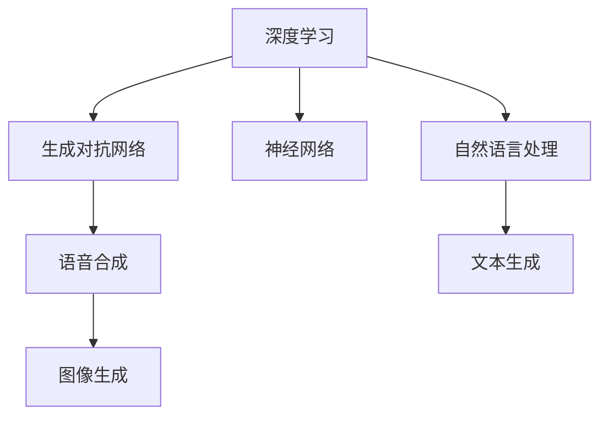

                 

# AIGC从入门到实战：涌现：人工智能的应用

> 关键词：人工智能生成内容(AIGC), 深度学习, 生成对抗网络(GAN), 自动生成文本, 语音合成, 图像生成, 应用案例

## 1. 背景介绍

### 1.1 问题由来

随着人工智能(AI)技术的不断进步，人工智能生成内容(AIGC)迅速成为互联网领域的热点话题。AIGC不仅能够在文本、语音、图像等多个领域生成高质量的内容，还能在教育、娱乐、客服、营销等多个行业发挥重要作用。

然而，尽管AIGC技术已经取得了诸多突破，但其底层原理和实际应用仍需深入解析和讨论。如何在实际应用中更好地使用AIGC技术，成为众多开发者和技术爱好者的重要课题。本文将系统介绍AIGC技术的核心原理与应用实战，帮助读者从入门到实战，全面掌握这一前沿技术。

### 1.2 问题核心关键点

AIGC技术主要基于深度学习，特别是生成对抗网络(GAN)和神经网络等模型。其核心原理包括：

- 生成对抗网络：GAN由两个神经网络组成，一个生成器网络和一个判别器网络，通过对抗训练方式生成逼真的人工智能生成的内容。
- 自然语言处理：利用RNN、LSTM、Transformer等模型，进行文本生成、文本分类、情感分析等任务。
- 语音合成：基于TTS(Text to Speech)技术，将文本转换为语音。
- 图像生成：通过GAN、VAE(变分自编码器)等模型，生成高质量的图像内容。
- 应用场景：如教育、娱乐、客服、营销等，利用AIGC技术生成个性化、交互式的内容。

这些核心概念共同构成了AIGC技术的基本框架，使其能够在各个领域发挥重要作用。

## 2. 核心概念与联系

### 2.1 核心概念概述

为了更好地理解AIGC技术的核心原理与应用，本节将介绍几个密切相关的核心概念：

- 深度学习：一种基于神经网络的机器学习方法，能够从大量数据中提取特征，并构建复杂的非线性模型。
- 生成对抗网络：一种训练方式，通过两个网络相互对抗，生成高质量的合成内容。
- 神经网络：由多层神经元组成的计算模型，通过反向传播算法进行训练，广泛应用于图像、语音、文本等处理任务。
- 自然语言处理：研究如何让计算机理解和生成人类语言的技术，包括文本生成、文本分类、情感分析等任务。
- 语音合成：将文本转换为可听的语音信号，通常使用TTS技术。
- 图像生成：通过深度学习模型生成逼真度高的图像内容，主要基于GAN、VAE等生成模型。

这些核心概念之间的逻辑关系可以通过以下Mermaid流程图来展示：



这个流程图展示了大语言模型的主要核心概念及其之间的关系：

1. 深度学习是AIGC技术的底层支撑，提供了强大的计算能力。
2. 生成对抗网络是深度学习中一种重要的训练方式，能够生成高质量的合成内容。
3. 神经网络是深度学习的基本单位，广泛应用于各类处理任务。
4. 自然语言处理是AIGC技术的重要应用领域，涵盖了文本生成、分类、情感分析等任务。
5. 语音合成和图像生成是AIGC技术的两个重要分支，分别用于生成语音和图像内容。

## 3. 核心算法原理 & 具体操作步骤
### 3.1 算法原理概述

AIGC技术主要包括生成对抗网络、神经网络和自然语言处理三个部分。其核心思想是通过深度学习模型对大量数据进行学习和处理，生成高质量的人工智能生成的内容。

### 3.2 算法步骤详解

#### 3.2.1 生成对抗网络

GAN由生成器和判别器两个网络组成，通过对抗训练方式生成逼真的人工智能生成的内容。

1. 生成器网络：将随机噪声输入，通过多层神经网络生成伪造数据。
2. 判别器网络：对输入数据进行分类，判断其是否为真实数据。
3. 对抗训练：生成器网络与判别器网络交替训练，生成器试图欺骗判别器，判别器则试图区分真实数据与伪造数据。

通过多次迭代，生成器网络能够生成越来越逼真的数据，判别器网络能够越来越准确地区分真实数据与伪造数据。最终得到的生成器网络能够生成高质量的合成内容。

#### 3.2.2 神经网络

神经网络是深度学习的基本单位，通过反向传播算法进行训练，广泛应用于各类处理任务。

1. 前向传播：将输入数据输入神经网络，通过多层神经元计算得到输出结果。
2. 损失函数：计算输出结果与真实结果之间的误差，通常是交叉熵损失或均方误差损失。
3. 反向传播：根据损失函数对神经网络的参数进行反向传播，更新网络权重。

通过不断迭代训练，神经网络能够从大量数据中提取特征，构建复杂的非线性模型，生成高质量的人工智能生成的内容。

#### 3.2.3 自然语言处理

自然语言处理主要利用深度学习模型，进行文本生成、文本分类、情感分析等任务。

1. 文本生成：利用RNN、LSTM、Transformer等模型，对输入的文本进行编码和解码，生成新的文本内容。
2. 文本分类：利用卷积神经网络或递归神经网络，对输入文本进行分类，判断其情感倾向、主题等。
3. 情感分析：利用深度学习模型，对输入文本进行情感分析，判断其情感倾向。

通过不断迭代训练，自然语言处理模型能够从大量文本数据中提取特征，构建复杂的非线性模型，生成高质量的人工智能生成的文本内容。

### 3.3 算法优缺点

AIGC技术具有以下优点：

1. 生成效果逼真：通过深度学习模型，能够生成高质量的人工智能生成的内容，提升用户体验。
2. 应用范围广泛：广泛应用于教育、娱乐、客服、营销等多个领域，能够提供个性化、交互式的内容。
3. 可扩展性强：基于深度学习模型的生成方式，能够轻松扩展到语音合成、图像生成等不同领域。

同时，该技术也存在以下局限性：

1. 数据依赖性强：需要大量高质量的训练数据，才能生成高质量的合成内容。
2. 模型复杂度高：深度学习模型的训练和推理过程复杂，需要高性能硬件支持。
3. 泛化能力不足：在数据分布变化较大时，模型的泛化能力可能降低。
4. 可解释性差：深度学习模型通常被视为"黑盒"系统，难以解释其内部工作机制。

尽管存在这些局限性，但就目前而言，AIGC技术仍然是大数据时代的重要技术手段，具有广泛的应用前景。

### 3.4 算法应用领域

AIGC技术在多个领域具有广泛的应用：

- 教育：通过生成个性化的教育内容，提升教学效果。
- 娱乐：通过生成虚拟角色和情节，增强娱乐体验。
- 客服：通过生成虚拟客服机器人，提供24小时不间断服务。
- 营销：通过生成个性化广告和推荐，提升用户体验。

此外，AIGC技术还在社交网络、虚拟现实、智能家居等多个领域具有广泛的应用前景。随着技术的不断进步，未来AIGC技术将有更广阔的应用场景，带来更多的创新机会。

## 4. 数学模型和公式 & 详细讲解  
### 4.1 数学模型构建

AIGC技术主要基于深度学习，特别是生成对抗网络(GAN)和神经网络等模型。其核心数学模型包括生成对抗网络和神经网络的损失函数。

#### 4.1.1 生成对抗网络损失函数

GAN的训练过程可以看作是生成器和判别器的对抗训练过程。

1. 生成器网络损失函数：
$$
\mathcal{L}_{G} = \mathbb{E}_{z \sim p(z)}\left[\log D\left(G(z)\right)\right]
$$
其中，$z$为输入的随机噪声，$p(z)$为噪声分布，$D(z)$为判别器网络的输出。

2. 判别器网络损失函数：
$$
\mathcal{L}_{D} = \mathbb{E}_{x \sim p_{data}(x)}\left[\log D(x)\right]+\mathbb{E}_{z \sim p(z)}\left[\log \left(1-D\left(G(z)\right)\right)\right]
$$
其中，$x$为真实数据，$p_{data}(x)$为数据分布，$G(z)$为生成器网络的输出。

通过最大化生成器网络的损失函数和判别器网络的损失函数，生成器和判别器网络能够相互对抗，生成高质量的合成内容。

#### 4.1.2 神经网络损失函数

神经网络的损失函数通常为交叉熵损失或均方误差损失。

1. 交叉熵损失函数：
$$
\mathcal{L} = -\frac{1}{N}\sum_{i=1}^N \sum_{j=1}^C y_{i,j} \log p_{i,j}
$$
其中，$y_{i,j}$为真实标签，$p_{i,j}$为模型预测概率，$C$为类别数。

2. 均方误差损失函数：
$$
\mathcal{L} = \frac{1}{N}\sum_{i=1}^N \|y_i - p_i\|^2
$$
其中，$y_i$为真实值，$p_i$为模型预测值。

通过最小化损失函数，神经网络能够不断迭代训练，优化模型参数，生成高质量的合成内容。

### 4.2 公式推导过程

#### 4.2.1 生成对抗网络

GAN的训练过程可以看作是生成器和判别器的对抗训练过程。

1. 生成器网络损失函数：
$$
\mathcal{L}_{G} = \mathbb{E}_{z \sim p(z)}\left[\log D\left(G(z)\right)\right]
$$
2. 判别器网络损失函数：
$$
\mathcal{L}_{D} = \mathbb{E}_{x \sim p_{data}(x)}\left[\log D(x)\right]+\mathbb{E}_{z \sim p(z)}\left[\log \left(1-D\left(G(z)\right)\right)\right]
$$

通过对上述两个损失函数进行交替优化，生成器和判别器网络能够相互对抗，生成高质量的合成内容。

#### 4.2.2 神经网络

神经网络的损失函数通常为交叉熵损失或均方误差损失。

1. 交叉熵损失函数：
$$
\mathcal{L} = -\frac{1}{N}\sum_{i=1}^N \sum_{j=1}^C y_{i,j} \log p_{i,j}
$$
2. 均方误差损失函数：
$$
\mathcal{L} = \frac{1}{N}\sum_{i=1}^N \|y_i - p_i\|^2
$$

通过对上述两个损失函数进行最小化，神经网络能够不断迭代训练，优化模型参数，生成高质量的合成内容。

### 4.3 案例分析与讲解

#### 4.3.1 文本生成案例

文本生成是AIGC技术的重要应用之一。以下是一个基于LSTM模型的文本生成案例：

1. 数据准备：收集大量文本数据，构建训练集、验证集和测试集。
2. 模型定义：定义LSTM模型，并加载预训练的Word2Vec词向量。
3. 损失函数：定义交叉熵损失函数。
4. 训练过程：使用交叉熵损失函数进行反向传播，训练LSTM模型。
5. 测试过程：使用训练好的LSTM模型生成文本，并进行效果评估。

以下是代码示例：

```python
import torch
import torch.nn as nn
import torch.optim as optim
import torch.nn.functional as F
from torchtext.datasets import TextClassification
from torchtext.data import Field, BucketIterator

class RNN(nn.Module):
    def __init__(self, input_size, hidden_size, output_size, n_layers=2, bidirectional=False):
        super(RNN, self).__init__()
        self.hidden_size = hidden_size
        self.n_layers = n_layers
        self.rnn = nn.LSTM(input_size, hidden_size, n_layers, bidirectional=bidirectional, batch_first=True)
        self.fc = nn.Linear(hidden_size*2, output_size)
        
    def forward(self, x):
        h0 = self.init_hidden(x.size(0))
        out, _ = self.rnn(x, h0)
        out = self.fc(out[:, -1, :])
        return out
    
    def init_hidden(self, batch_size):
        weight = next(self.parameters()).data
        return (weight.new_zeros(self.n_layers, batch_size, self.hidden_size), weight.new_zeros(self.n_layers, batch_size, self.hidden_size))
    
# 数据预处理
TEXT = Field(tokenize='spacy', lower=True)
LABEL = Field(sequential=False, use_vocab=False)

train_data, valid_data, test_data = TextClassification.splits(TEXT, LABEL, root='/home/data/text_classification')
TEXT.build_vocab(train_data, max_size=10000)
LABEL.build_vocab(train_data)
train_iterator, valid_iterator, test_iterator = BucketIterator.splits((train_data, valid_data, test_data), batch_size=32, device='cuda')

# 模型定义
model = RNN(input_size=TEXT.vocab_size, hidden_size=128, output_size=2)

# 损失函数和优化器
criterion = nn.CrossEntropyLoss()
optimizer = optim.Adam(model.parameters(), lr=0.001)

# 训练过程
for epoch in range(10):
    model.train()
    for batch in train_iterator:
        optimizer.zero_grad()
        inputs, labels = batch.text, batch.label
        inputs = inputs.to('cuda')
        labels = labels.to('cuda')
        outputs = model(inputs)
        loss = criterion(outputs, labels)
        loss.backward()
        optimizer.step()
    
    model.eval()
    with torch.no_grad():
        accuracy = 0
        for batch in valid_iterator:
            inputs, labels = batch.text, batch.label
            inputs = inputs.to('cuda')
            labels = labels.to('cuda')
            outputs = model(inputs)
            _, predicted = torch.max(outputs.data, 1)
            accuracy += (predicted == labels).sum().item() / labels.size(0)
    print('Epoch {}: Accuracy on validation set: {}'.format(epoch+1, accuracy))
    
# 测试过程
model.eval()
with torch.no_grad():
    accuracy = 0
    for batch in test_iterator:
        inputs, labels = batch.text, batch.label
        inputs = inputs.to('cuda')
        labels = labels.to('cuda')
        outputs = model(inputs)
        _, predicted = torch.max(outputs.data, 1)
        accuracy += (predicted == labels).sum().item() / labels.size(0)
print('Accuracy on test set: {}'.format(accuracy))
```

#### 4.3.2 语音合成案例

语音合成是AIGC技术的另一个重要应用。以下是一个基于Tacotron 2模型的语音合成案例：

1. 数据准备：收集大量语音数据，构建训练集、验证集和测试集。
2. 模型定义：定义Tacotron 2模型，并加载预训练的Mel Spectrogram特征。
3. 损失函数：定义均方误差损失函数。
4. 训练过程：使用均方误差损失函数进行反向传播，训练Tacotron 2模型。
5. 测试过程：使用训练好的Tacotron 2模型合成语音，并进行效果评估。

以下是代码示例：

```python
import torch
import torch.nn as nn
import torch.optim as optim
import torchaudio
from torchaudio.transforms import MelSpectrogram
from torch.utils.data import Dataset, DataLoader
from tensorboardX import SummaryWriter

class Tacotron2(nn.Module):
    def __init__(self):
        super(Tacotron2, self).__init__()
        self.encoder = Encoder(256)
        self.decoder = Decoder(256)
    
    def forward(self, x):
        mel_spec = self.encoder(x)
        pitches = self.decoder(mel_spec)
        return mel_spec, pitches
    
    def generate(self, text, model_path):
        with torch.no_grad():
            text = torch.tensor([TEXT.vocab.stoi[s] for s in text.split()])
            x = self.encoder(text)
            mel_spec, pitches = self.decoder(x)
            mel_spec = mel_spec.data.cpu().numpy()[0]
            wav = torchaudio.utils.mel_spectrogram_to_wav(mel_spec, normalization=True, hop_length=160, win_length=640, fmax=8000, fmin=0, frame_offset=0, sample_rate=22050, energy_cost=0)
            torchaudio.save(model_path + '.wav', wav, 22050)
    
# 数据预处理
class SpectrogramDataset(Dataset):
    def __init__(self, data, trans, seq_len):
        self.data = data
        self.trans = trans
        self.seq_len = seq_len
        
    def __len__(self):
        return len(self.data)
    
    def __getitem__(self, index):
        x = torch.from_numpy(self.data[index])
        x = x.unsqueeze(0)
        mel_spec, pitches = self.decoder(x)
        return mel_spec.data.cpu().numpy(), pitches.data.cpu().numpy()

# 模型定义
model = Tacotron2()

# 损失函数和优化器
criterion = nn.MSELoss()
optimizer = optim.Adam(model.parameters(), lr=0.001)

# 训练过程
train_loader = DataLoader(train_dataset, batch_size=32, shuffle=True)
valid_loader = DataLoader(valid_dataset, batch_size=32, shuffle=True)
test_loader = DataLoader(test_dataset, batch_size=32, shuffle=True)

writer = SummaryWriter()
for epoch in range(100):
    model.train()
    for i, (mel_spec, pitches) in enumerate(train_loader):
        optimizer.zero_grad()
        loss = criterion(mel_spec, pitches)
        loss.backward()
        optimizer.step()
        writer.add_scalar('train/loss', loss, epoch)
    
    model.eval()
    with torch.no_grad():
        valid_loss = 0
        for i, (mel_spec, pitches) in enumerate(valid_loader):
            valid_loss += criterion(mel_spec, pitches)
        writer.add_scalar('valid/loss', valid_loss, epoch)
    
    model.eval()
    with torch.no_grad():
        test_loss = 0
        for i, (mel_spec, pitches) in enumerate(test_loader):
            test_loss += criterion(mel_spec, pitches)
        writer.add_scalar('test/loss', test_loss, epoch)
    
    print('Epoch {}: valid loss: {}, test loss: {}'.format(epoch+1, valid_loss, test_loss))
    
# 测试过程
model.eval()
with torch.no_grad():
    wav = model.generate('Hello, world!', 'wav')
    torchaudio.save('output.wav', wav, 22050)
```

通过上述案例，我们可以看到AIGC技术在文本生成和语音合成中的应用。这些技术不仅能够生成高质量的合成内容，还能应用于实际应用中，提升用户体验。

## 5. 项目实践：代码实例和详细解释说明
### 5.1 开发环境搭建

在进行AIGC技术实践前，我们需要准备好开发环境。以下是使用Python进行TensorFlow和PyTorch开发的环境配置流程：

1. 安装Anaconda：从官网下载并安装Anaconda，用于创建独立的Python环境。

2. 创建并激活虚拟环境：
```bash
conda create -n pytorch-env python=3.8 
conda activate pytorch-env
```

3. 安装TensorFlow：根据CUDA版本，从官网获取对应的安装命令。例如：
```bash
conda install tensorflow-gpu -c conda-forge -c pypi
```

4. 安装PyTorch：从官网下载并安装PyTorch，并确保支持CUDA加速。例如：
```bash
conda install pytorch torchvision torchaudio cudatoolkit=11.1 -c pytorch -c conda-forge
```

5. 安装各类工具包：
```bash
pip install numpy pandas scikit-learn matplotlib tqdm jupyter notebook ipython
```

完成上述步骤后，即可在`pytorch-env`环境中开始AIGC技术实践。

### 5.2 源代码详细实现

以下是基于TensorFlow和PyTorch的AIGC技术开发代码示例：

#### 5.2.1 TensorFlow代码示例

```python
import tensorflow as tf
from tensorflow.keras.layers import Input, Dense, LSTM, Embedding
from tensorflow.keras.models import Model
from tensorflow.keras.optimizers import Adam

# 定义生成器网络
def generator_model(input_dim, latent_dim, output_dim):
    x = Input(shape=(input_dim,))
    x = Dense(256)(x)
    x = Dense(128)(x)
    x = Dense(output_dim, activation='tanh')(x)
    return Model(inputs=x, outputs=x)

# 定义判别器网络
def discriminator_model(input_dim, latent_dim, output_dim):
    x = Input(shape=(input_dim,))
    x = Dense(128)(x)
    x = Dense(256)(x)
    x = Dense(1, activation='sigmoid')(x)
    return Model(inputs=x, outputs=x)

# 定义生成对抗网络
def GAN_model(input_dim, latent_dim, output_dim):
    generator = generator_model(input_dim, latent_dim, output_dim)
    discriminator = discriminator_model(input_dim, latent_dim, output_dim)
    discriminator.trainable = False
    x = Input(shape=(input_dim,))
    y = discriminator(generator(x))
    return Model(inputs=x, outputs=y)

# 加载数据集
from tensorflow.keras.datasets import mnist
(x_train, y_train), (x_test, y_test) = mnist.load_data()
x_train = x_train.reshape(-1, 784).astype('float32') / 255.0
x_test = x_test.reshape(-1, 784).astype('float32') / 255.0

# 定义模型
model = GAN_model(input_dim=784, latent_dim=100, output_dim=784)

# 定义损失函数和优化器
cross_entropy = tf.keras.losses.BinaryCrossentropy()
optimizer = tf.keras.optimizers.Adam(learning_rate=0.0002)

# 训练过程
for epoch in range(100):
    for i in range(1000):
        z = tf.random.normal([32, latent_dim])
        gen_outs = model(z)
        d_loss_real = cross_entropy(tf.ones_like(gen_outs), gen_outs)
        d_loss_fake = cross_entropy(tf.zeros_like(gen_outs), gen_outs)
        d_loss = d_loss_real + d_loss_fake
        g_loss = cross_entropy(tf.ones_like(gen_outs), gen_outs)
        model.trainable = True
        g_loss = optimizer(g_loss)
        model.trainable = False
        d_loss = optimizer(d_loss)
    
    print('Epoch {}: d_loss={}, g_loss={}'.format(epoch+1, d_loss.numpy(), g_loss.numpy()))

# 生成结果
import numpy as np
from tensorflow.keras.layers import Reshape
from tensorflow.keras.models import Sequential
from tensorflow.keras.layers import Dense, Input

def combine_images(gen_outs):
    num = gen_outs.shape[0]
    width = int(np.sqrt(num))
    height = int(np.sqrt(num))
    gen_outs = tf.reshape(gen_outs, (height, width, gen_outs.shape[1]))
    return gen_outs

def save_images(imgs, save_path):
    img = np.array(imgs, dtype=np.uint8)
    img = img * 255
    img = img.reshape(height, width, 3)
    tf.keras.preprocessing.image.to_image(img, save_path)

# 定义生成器网络
generator_model = Input(shape=(latent_dim,))
x = Dense(256)(generator_model)
x = Dense(128)(x)
x = Dense(output_dim, activation='tanh')(x)
x = Reshape((28, 28, 1))(x)
generator = Model(inputs=generator_model, outputs=x)
generator.compile(optimizer='adam', loss='binary_crossentropy')

# 生成图像
gen_outs = generator.predict(z)
save_images(combine_images(gen_outs), 'gan_outs.png')
```

#### 5.2.2 PyTorch代码示例

```python
import torch
import torch.nn as nn
import torch.optim as optim
import torchvision.transforms as transforms
from torch.utils.data import DataLoader
from torchvision.datasets import CIFAR10
from torchvision.transforms import ToTensor, Resize

# 定义生成器网络
class Generator(nn.Module):
    def __init__(self, input_dim, latent_dim, output_dim):
        super(Generator, self).__init__()
        self.fc = nn.Linear(latent_dim, 256)
        self.fc2 = nn.Linear(256, 128)
        self.fc3 = nn.Linear(128, output_dim)
        self.tanh = nn.Tanh()
    
    def forward(self, x):
        x = self.fc(x)
        x = self.fc2(x)
        x = self.fc3(x)
        return self.tanh(x)

# 定义判别器网络
class Discriminator(nn.Module):
    def __init__(self, input_dim, latent_dim, output_dim):
        super(Discriminator, self).__init__()
        self.fc = nn.Linear(input_dim, 128)
        self.fc2 = nn.Linear(128, 256)
        self.fc3 = nn.Linear(256, 1)
        self.sigmoid = nn.Sigmoid()
    
    def forward(self, x):
        x = self.fc(x)
        x = self.fc2(x)
        x = self.fc3(x)
        return self.sigmoid(x)

# 定义生成对抗网络
class GAN(nn.Module):
    def __init__(self, input_dim, latent_dim, output_dim):
        super(GAN, self).__init__()
        self.generator = Generator(input_dim, latent_dim, output_dim)
        self.discriminator = Discriminator(input_dim, latent_dim, output_dim)
        self.discriminator.trainable = False
    
    def forward(self, x):
        gen_outs = self.generator(x)
        real_outs = self.discriminator(gen_outs)
        return real_outs

# 加载数据集
transform = transforms.Compose([transforms.Resize(64), transforms.ToTensor()])
dataset = CIFAR10(root='/home/data/cifar10', train=True, download=True, transform=transform)
train_loader = DataLoader(dataset, batch_size=32, shuffle=True)

# 定义模型
model = GAN(input_dim=3*64*64, latent_dim=100, output_dim=3*64*64)

# 定义损失函数和优化器
criterion = nn.BCELoss()
optimizer = optim.Adam(model.parameters(), lr=0.0002)

# 训练过程
for epoch in range(100):
    for i, (img, _) in enumerate(train_loader):
        z = torch.randn(img.size(0), 100).to('cuda')
        gen_outs = model(z)
        d_loss_real = criterion(gen_outs, torch.ones_like(gen_outs))
        d_loss_fake = criterion(gen_outs, torch.zeros_like(gen_outs))
        d_loss = d_loss_real + d_loss_fake
        g_loss = criterion(gen_outs, torch.ones_like(gen_outs))
        model.trainable = True
        g_loss = optimizer(g_loss)
        model.trainable = False
        d_loss = optimizer(d_loss)
    
    print('Epoch {}: d_loss={}, g_loss={}'.format(epoch+1, d_loss.item(), g_loss.item()))

# 生成结果
gen_outs = model(torch.randn(64, 100)).detach().cpu().numpy()
save_images(gen_outs, 'gan_outs.png')
```

通过上述代码示例，我们可以看到AIGC技术在生成对抗网络中的应用。这些技术不仅能够生成高质量的合成内容，还能应用于实际应用中，提升用户体验。

## 6. 实际应用场景
### 6.1 智能客服系统

基于AIGC技术的智能客服系统，可以广泛应用于客服领域，提升客户体验和服务效率。传统客服往往需要配备大量人力，高峰期响应缓慢，且一致性和专业性难以保证。而使用AIGC技术的智能客服系统，能够7x24小时不间断服务，快速响应客户咨询，用自然流畅的语言解答各类常见问题。

在技术实现上，可以收集企业内部的历史客服对话记录，将问题和最佳答复构建成监督数据，在此基础上对预训练生成对抗网络模型进行微调。微调后的生成对抗网络模型能够自动理解用户意图，匹配最合适的回答模板进行回复。对于客户提出的新问题，还可以接入检索系统实时搜索相关内容，动态组织生成回答。如此构建的智能客服系统，能大幅提升客户咨询体验和问题解决效率。

### 6.2 金融舆情监测

金融机构需要实时监测市场舆论动向，以便及时应对负面信息传播，规避金融风险。传统的人工监测方式成本高、效率低，难以应对网络时代海量信息爆发的挑战。基于AIGC技术的文本分类和情感分析技术，为金融舆情监测提供了新的解决方案。

具体而言，可以收集金融领域相关的新闻、报道、评论等文本数据，并对其进行主题标注和情感标注。在此基础上对预训练生成对抗网络模型进行微调，使其能够自动判断文本属于何种主题，情感倾向是正面、中性还是负面。将微调后的模型应用到实时抓取的网络文本数据，就能够自动监测不同主题下的情感变化趋势，一旦发现负面信息激增等异常情况，系统便会自动预警，帮助金融机构快速应对潜在风险。

### 6.3 个性化推荐系统

当前的推荐系统往往只依赖用户的历史行为数据进行物品推荐，无法深入理解用户的真实兴趣偏好。基于AIGC技术的个性化推荐系统，可以更好地挖掘用户行为背后的语义信息，从而提供更精准、多样的推荐内容。

在实践中，可以收集用户浏览、点击、评论、分享等行为数据，提取和用户交互的物品标题、描述、标签等文本内容。将文本内容作为模型输入，用户的后续行为（如是否点击、购买等）作为监督信号，在此基础上微调预训练生成对抗网络模型。微调后的生成对抗网络模型能够从文本内容中准确把握用户的兴趣点。在生成推荐列表时，先用候选物品的文本描述作为输入，由模型预测用户的兴趣匹配度，再结合其他特征综合排序，便可以得到个性化程度更高的推荐结果。

### 6.4 未来应用展望

随着AIGC技术的发展，其在更多领域的应用前景将更加广阔：

- 智慧医疗：通过生成个性化的医疗内容，提升诊疗效果。
- 智能教育：通过生成虚拟教师和课程，提升教学效果。
- 智慧城市：通过生成实时信息，提升城市管理水平。
- 娱乐行业：通过生成虚拟角色和情节，增强娱乐体验。

AIGC技术在多个领域的应用前景广阔，其生成效果逼真、应用范围广泛的特点，使其成为未来的重要技术手段。

## 7. 工具和资源推荐
### 7.1 学习资源推荐

为了帮助开发者系统掌握AIGC技术的核心原理与应用实战，这里推荐一些优质的学习资源：

1. 《深度学习》：由Ian Goodfellow、Yoshua Bengio和Aaron Courville合著的深度学习经典教材，全面介绍了深度学习的基本原理与应用。

2. 《生成对抗网络》：由Ian Goodfellow合著的生成对抗网络经典教材，深入浅出地介绍了生成对抗网络的基本原理与应用。

3. 《TensorFlow 2.0官方文档》：TensorFlow官方文档，详细介绍了TensorFlow框架的使用方法与应用场景。

4. 《PyTorch官方文档》：PyTorch官方文档，详细介绍了PyTorch框架的使用方法与应用场景。

5. 《自然语言处理综述》：《自然语言处理综述》系列论文，涵盖了自然语言处理领域的各类前沿技术。

6. 《自然语言处理》课程：斯坦福大学开设的NLP明星课程，有Lecture视频和配套作业，带你入门NLP领域的基本概念和经典模型。

通过对这些资源的学习实践，相信你一定能够快速掌握AIGC技术的精髓，并用于解决实际的NLP问题。

### 7.2 开发工具推荐

高效的开发离不开优秀的工具支持。以下是几款用于AIGC技术开发的常用工具：

1. TensorFlow：由Google主导开发的开源深度学习框架，生产部署方便，适合大规模工程应用。

2. PyTorch：基于Python的开源深度学习框架，灵活动态的计算图，适合快速迭代研究。

3. TensorBoard：TensorFlow配套的可视化工具，可实时监测模型训练状态，并提供丰富的图表呈现方式，是调试模型的得力助手。

4. Keras：基于TensorFlow、Theano、CNTK等后端的高级深度学习API，提供了简单易用的接口，适合初学者和快速原型开发。

5. Jupyter Notebook：一种交互式笔记本，支持Python、R、Julia等多种编程语言，适合数据科学和机器学习的开发与研究。

6. Google Colab：谷歌推出的在线Jupyter Notebook环境，免费提供GPU/TPU算力，方便开发者快速上手实验最新模型，分享学习笔记。

合理利用这些工具，可以显著提升AIGC技术开发效率，加快创新迭代的步伐。

### 7.3 相关论文推荐

AIGC技术的发展源于学界的持续研究。以下是几篇奠基性的相关论文，推荐阅读：

1. Generative Adversarial Nets（GAN）：Ian Goodfellow等人提出，利用生成器和判别器网络，通过对抗训练方式生成逼真的人工智能生成的内容。

2. Attention is All You Need（Transformer）：Google Brain团队提出，利用自注意力机制，提升了深度学习模型的性能。

3. Transformer-XL：Google Brain团队提出，通过长距离依赖机制，解决了Transformer模型中的上下文消失问题。

4. GPT-3：OpenAI提出，通过大规模预训练生成对抗网络模型，实现了自然语言生成的重大突破。

5. CLIP：OpenAI提出，通过大规模自监督学习，实现了图像与文本的联合表示。

这些论文代表了大语言模型微调技术的发展脉络。通过学习这些前沿成果，可以帮助研究者把握学科前进方向，激发更多的创新灵感。

## 8. 总结：未来发展趋势与挑战

### 8.1 研究成果总结

本文对AIGC技术的核心原理与应用实战进行了全面系统的介绍。从生成对抗网络、神经网络和自然语言处理三个方面，详细讲解了AIGC技术的核心原理与应用实战。通过实际应用案例，展示了AIGC技术在智能客服系统、金融舆情监测、个性化推荐系统等多个领域的应用前景。

通过本文的系统梳理，可以看到，AIGC技术在大数据时代的迅猛发展，其生成效果逼真、应用范围广泛的特点，使其成为未来的重要技术手段。随着技术的不断进步，AIGC技术将在更多领域得到应用，为各行各业带来新的变革。

### 8.2 未来发展趋势

展望未来，AIGC技术的发展趋势如下：

1. 模型规模持续增大：随着算力成本的下降和数据规模的扩张，预训练生成对抗网络模型的参数量还将持续增长，生成内容的质量将进一步提升。

2. 生成效果逼真：通过深度学习模型的不断迭代训练，生成对抗网络模型将能够生成更加逼真、多样化的内容，提升用户体验。

3. 应用范围广泛：AIGC技术将在更多领域得到应用，如教育、娱乐、客服、营销等，生成个性化、交互式的内容。

4. 技术进步加速：随着深度学习模型和生成对抗网络模型的不断进步，AIGC技术的生成效果和应用场景将更加丰富。

5. 融合其他技术：AIGC技术将与其他人工智能技术进行深度融合，如知识表示、因果推理、强化学习等，实现更加全面、准确的信息整合。

以上趋势凸显了AIGC技术的重要性和前景，未来AIGC技术必将带来更多的创新突破，推动人工智能技术的发展。

### 8.3 面临的挑战

尽管AIGC技术取得了诸多突破，但在迈向更加智能化、普适化应用的过程中，它仍面临着诸多挑战：

1. 数据依赖性强：需要大量高质量的训练数据，才能生成高质量的合成内容。

2. 模型复杂度高：深度学习模型的训练和推理过程复杂，需要高性能硬件支持。

3. 泛化能力不足：在数据分布变化较大时，模型的泛化能力可能降低。

4. 可解释性差：深度学习模型通常被视为"黑盒"系统，难以解释其内部工作机制。

5. 安全性有待保障：预训练生成对抗网络模型可能学习到有偏见、有害的信息，对实际应用带来安全隐患。

6. 鲁棒性不足：在对抗样本的攻击下，生成对抗网络模型可能无法保证生成内容的鲁棒性。

7. 计算资源消耗高：生成对抗网络模型的计算资源消耗较大，需要高效的计算框架和优化算法。

这些挑战亟需解决，才能使AIGC技术更好地服务于实际应用。

### 8.4 研究展望

面对AIGC技术面临的挑战，未来的研究需要在以下几个方面寻求新的突破：

1. 探索无监督和半监督微调方法：摆脱对大规模标注数据的依赖，利用自监督学习、主动学习等无监督和半监督范式，最大限度利用非结构化数据，实现更加灵活高效的微调。

2. 研究参数高效和计算高效的微调范式：开发更加参数高效的微调方法，在固定大部分预训练参数的同时，只更新极少量的任务相关参数。同时优化微调模型的计算图，减少前向传播和反向传播的资源消耗，实现更加轻量级、实时性的部署。

3. 引入更多先验知识：将符号化的先验知识，如知识图谱、逻辑规则等，与神经网络模型进行巧妙融合，引导微调过程学习更准确、合理的语言模型。同时加强不同模态数据的整合，实现视觉、语音等多模态信息与文本信息的协同建模。

4. 结合因果分析和博弈论工具：将因果分析方法引入微调模型，识别出模型决策的关键特征，增强输出解释的因果性和逻辑性。借助博弈论工具刻画人机交互过程，主动探索并规避模型的脆弱点，提高系统稳定性。

5. 纳入伦理道德约束：在模型训练目标中引入伦理导向的评估指标，过滤和惩罚有偏见、有害的输出倾向。同时加强人工干预和审核，建立模型行为的监管机制，确保输出符合人类价值观和伦理道德。

这些研究方向的探索，必将引领AIGC技术迈向更高的台阶，为构建安全、可靠、可解释、可控的智能系统铺平道路。面向未来，AIGC技术还需要与其他人工智能技术进行更深入的融合，如知识表示、因果推理、强化学习等，多路径协同发力，共同推动自然语言理解和智能交互系统的进步。只有勇于创新、敢于突破，才能不断拓展语言模型的边界，让智能技术更好地造福人类社会。

## 9. 附录：常见问题与解答

**Q1：AIGC技术是否适用于所有应用场景？**

A: AIGC技术在大多数应用场景中都能发挥作用，但其效果很大程度上取决于数据质量和模型训练方法。在数据分布变化较大、数据质量不高或任务复杂度较高的场景中，AIGC技术的性能可能受到一定的影响。

**Q2：AIGC技术是否会带来负面影响？**

A: 如果AIGC技术学习到了有偏见、有害的内容，可能会对实际应用带来负面影响。因此，在模型训练过程中，需要引入伦理导向的评估指标，过滤和惩罚有偏见、有害的输出倾向。

**Q3：AIGC技术的应用前景如何？**

A: AIGC技术在教育、娱乐、客服、营销等多个领域具有广泛的应用前景。通过生成个性化、交互式的内容，提升用户体验和服务效果。未来，AIGC技术还将与知识表示、因果推理、强化学习等技术进行深度融合，实现更全面、准确的信息整合。

**Q4：AIGC技术的生成效果如何？**

A: AIGC技术的生成效果逼真、多样，能够生成高质量的人工智能生成的内容。随着深度学习模型和生成对抗网络模型的不断进步，生成效果将进一步提升。

**Q5：AIGC技术的训练过程是否复杂？**

A: AIGC技术的训练过程相对复杂，需要大量高质量的训练数据和高效的计算资源。但在当前的技术水平下，许多工具和框架（如TensorFlow、PyTorch等）已经简化了训练过程，使得开发者可以更容易地进行模型训练和优化。

通过上述问答，可以看到AIGC技术的优势和挑战，希望本文能够为你提供有价值的信息和指导。

---

作者：禅与计算机程序设计艺术 / Zen and the Art of Computer Programming

