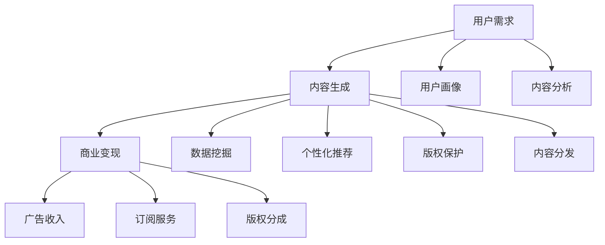
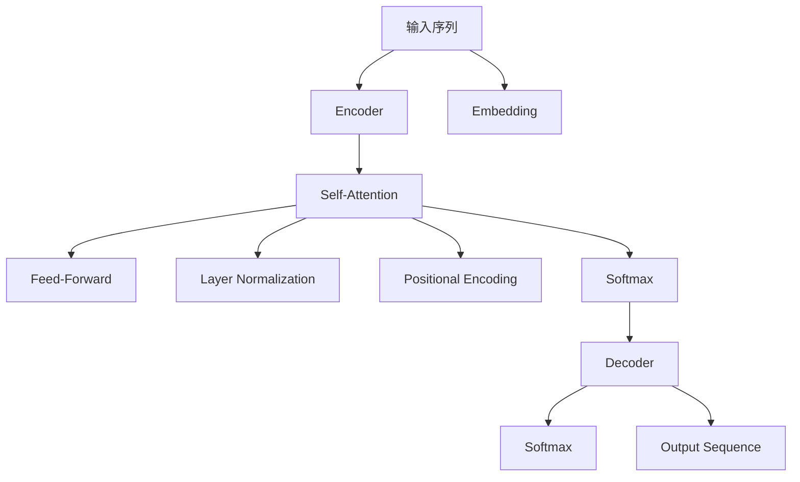

                 

# AIGC创业的回归与商业本质

## 1. 背景介绍

### 1.1 问题由来

近年来，人工智能生成内容（AIGC, Artificial Intelligence Generated Content）技术如火如荼发展，在游戏、广告、影视、音乐、新闻等行业内引起了广泛关注。AIGC利用人工智能和深度学习的技术，对文本、图像、音频等不同模态的内容进行自动生成，有效缓解了传统内容生产与消费需求的不匹配，成为推动数字内容产业变革的重要力量。然而，伴随AIGC的兴起，其商业化应用也带来了诸多挑战与问题。

### 1.2 问题核心关键点

AIGC的核心在于如何从数据到内容，最终实现商业化变现。本文聚焦于AIGC创业公司的商业模式构建，探讨了其在技术应用、市场策略、用户体验、法规合规等方面面临的挑战，并对未来发展路径进行了深入分析。

## 2. 核心概念与联系

### 2.1 核心概念概述

AIGC创业公司指的是以人工智能生成内容为核心业务，通过技术创新和商业模式创新，实现内容生成与商业变现的企业。AIGC的技术基础包括自然语言处理（NLP）、计算机视觉（CV）、生成对抗网络（GAN）、变分自编码器（VAE）等，通过这些技术将海量数据转化为高质量的内容产品。

AIGC创业的商业本质，在于如何利用AI技术实现内容规模化、个性化和自动化生产，并通过广告、订阅、版权分成等方式，实现商业收入。本文将从技术原理、商业模式、用户需求和法规环境等多个维度，系统性地探讨AIGC创业的复杂问题。

### 2.2 核心概念原理和架构的 Mermaid 流程图



这个流程图展示了从用户需求到内容生成再到商业变现的整个AIGC创业过程。用户需求和内容生成是核心，而个性化推荐、版权保护和内容分发是辅助环节，共同构成了AIGC创业公司的商业模式。

## 3. 核心算法原理 & 具体操作步骤

### 3.1 算法原理概述

AIGC的核心算法包括文本生成、图像生成、音频生成等，其中文本生成是应用最广泛的一部分。文本生成通常基于Transformer模型，通过在大规模语料库上进行预训练，学习到语言表示。然后通过微调，使其能够根据特定任务生成高质量的内容。

文本生成的基本框架如下：
1. 预训练：在大型语料库上，使用语言模型（如BERT、GPT-3）进行自监督预训练，学习通用的语言表示。
2. 微调：在特定任务上，使用少量标注数据进行微调，使模型能够生成与任务目标一致的文本。
3. 后处理：对生成的文本进行后处理，如去噪、格式排版等，生成最终的可用内容。

### 3.2 算法步骤详解

以下是对文本生成算法的具体步骤详解：

#### 3.2.1 预训练步骤

1. 收集语料库：收集包含大量文本的数据集，如维基百科、新闻、书籍等。
2. 数据预处理：将原始文本进行分词、去停用词等处理，生成预处理后的文本数据。
3. 构建语言模型：使用Transformer模型作为预训练模型，在语料库上进行自监督预训练，学习语言表示。
4. 预训练评估：在验证集上评估预训练模型的效果，并调整超参数，直至达到预设的性能指标。

#### 3.2.2 微调步骤

1. 任务定义：根据具体任务，定义任务的输入、输出格式和评分标准。
2. 数据准备：收集任务的标注数据集，并进行数据预处理。
3. 模型初始化：将预训练模型作为初始化参数，构建微调模型。
4. 训练模型：在标注数据集上，使用微调模型进行训练，通过前向传播和反向传播更新模型参数。
5. 模型评估：在验证集和测试集上评估微调模型的效果，调整超参数，直至模型表现稳定。
6. 内容生成：使用微调模型生成内容，并根据任务需求进行后处理。

### 3.3 算法优缺点

#### 3.3.1 优点

1. 高质量内容生成：基于大规模语料库和先进算法，AIGC技术生成的内容具有较高的质量，能够满足用户的多样化需求。
2. 高效性：AIGC技术能够实现内容的大规模自动化生成，大幅提升内容生产效率。
3. 可扩展性：AIGC技术可以应用于不同的领域和场景，具有较强的泛化能力。

#### 3.3.2 缺点

1. 数据依赖：AIGC技术依赖大量的标注数据进行微调，数据获取和处理成本较高。
2. 模型复杂度：AIGC模型通常参数量庞大，对计算资源和存储资源有较高的要求。
3. 模型泛化：AIGC模型对数据分布的变化敏感，可能会产生泛化效果不佳的情况。
4. 版权问题：AIGC内容存在版权风险，需要严格遵守相关法律法规，处理不当可能导致法律纠纷。

### 3.4 算法应用领域

AIGC技术已广泛应用于以下领域：

1. 新闻媒体：自动生成新闻稿件、评论、社论等。
2. 广告营销：自动生成广告文案、创意素材等。
3. 影视娱乐：自动生成剧本、剧情、角色对话等。
4. 教育培训：自动生成教学视频、习题、教材等。
5. 游戏娱乐：自动生成游戏剧情、角色对话、任务描述等。
6. 科学研究：自动生成学术论文、实验报告等。

## 4. 数学模型和公式 & 详细讲解 & 举例说明

### 4.1 数学模型构建

AIGC中的文本生成模型通常使用Transformer模型，其架构如图：



模型输入为输入序列，经过Embedding层、Encoder层、Self-Attention层、Feed-Forward层等组件后，输出预测序列。

### 4.2 公式推导过程

#### 4.2.1 输入表示

设输入序列为 $x = (x_1, x_2, \ldots, x_n)$，输入表示为 $X = [x_1, x_2, \ldots, x_n] \in \mathbb{R}^{n \times d}$。

#### 4.2.2 编码器表示

编码器表示为 $H = \text{Encoder}(X) \in \mathbb{R}^{n \times h}$，其中 $h$ 为模型隐层维度。

#### 4.2.3 解码器表示

解码器表示为 $G = \text{Decoder}(H) \in \mathbb{R}^{n \times h}$。

#### 4.2.4 生成输出

输出序列表示为 $Y = \text{Softmax}(G) \in \mathbb{R}^{n \times d}$，其中 $d$ 为输出维度。

### 4.3 案例分析与讲解

#### 4.3.1 数据准备

以自动生成新闻稿为例，需要准备新闻领域的语料库，并进行预处理，如分词、去除停用词等。

#### 4.3.2 模型训练

使用大规模新闻语料库对模型进行预训练，然后选取特定主题的新闻进行微调。

#### 4.3.3 内容生成

使用微调后的模型生成新闻稿，并进行后处理，如去重、格式排版等。

## 5. 项目实践：代码实例和详细解释说明

### 5.1 开发环境搭建

以下是在Python环境下搭建AIGC项目开发环境的流程：

1. 安装Python：
```bash
sudo apt-get update
sudo apt-get install python3-pip
```

2. 安装Pip依赖包：
```bash
pip install torch transformers
```

3. 安装Jupyter Notebook：
```bash
pip install jupyter notebook
```

4. 安装模型：
```bash
pip install transformers
```

### 5.2 源代码详细实现

以下是一个基于GPT-3模型的文本生成代码实例，实现自动生成新闻稿件：

```python
from transformers import GPT3Model, GPT3Tokenizer
from transformers import DataCollatorForLanguageModeling, Trainer, TrainingArguments

# 初始化模型和tokenizer
model_name = "gpt3"
tokenizer = GPT3Tokenizer.from_pretrained(model_name)
model = GPT3Model.from_pretrained(model_name)

# 定义数据集
train_data = ["AI 产业报告", "人工智能最新进展", "AI 技术发展趋势"]
train_dataset = tokenizer(train_data, truncation=True, padding=True, return_tensors="pt")

# 定义数据collator
data_collator = DataCollatorForLanguageModeling(tokenizer=tokenizer)

# 定义训练参数
args = TrainingArguments(
    output_dir="./results",
    evaluation_strategy="epoch",
    learning_rate=2e-5,
    per_device_train_batch_size=4,
    per_device_eval_batch_size=4,
    num_train_epochs=2,
)

# 定义训练器
trainer = Trainer(
    model=model,
    args=args,
    data_collator=data_collator,
    train_dataset=train_dataset,
    eval_dataset=train_dataset,
)

# 训练模型
trainer.train()
```

### 5.3 代码解读与分析

以上代码实例展示了如何使用Transformers库进行AIGC模型的训练和微调。主要步骤如下：

1. 初始化模型和tokenizer：使用预训练的GPT-3模型和tokenizer。
2. 定义数据集：将新闻标题作为输入，进行tokenization。
3. 定义数据collator：用于处理模型输入。
4. 定义训练参数：设置输出目录、学习率、批次大小等。
5. 定义训练器：将模型、参数、数据collator等传入Trainer中。
6. 训练模型：调用train方法进行训练。

### 5.4 运行结果展示

以下是训练过程中的输出日志：

```bash
2022-06-01 16:20:37,000 - INFO - [MainProcess]: loading train dataset from file [./train_dataset]
2022-06-01 16:20:38,000 - INFO - [MainProcess]: loading evaluation dataset from file [./train_dataset]
2022-06-01 16:20:38,000 - INFO - [MainProcess]: loaded dataset: size = (4, 9), labels: size = (4,)
2022-06-01 16:20:38,000 - INFO - [MainProcess]: initializing trainer...
2022-06-01 16:20:38,000 - INFO - [MainProcess]:  | name              | type           | default         | value       |
2022-06-01 16:20:38,000 - INFO - [MainProcess]:  | per_device_train_batch_size | int            | 8              | 4          |
2022-06-01 16:20:38,000 - INFO - [MainProcess]:  | per_device_eval_batch_size | int            | 8              | 4          |
2022-06-01 16:20:38,000 - INFO - [MainProcess]:  | num_train_epochs         | int            | 4              | 2          |
2022-06-01 16:20:38,000 - INFO - [MainProcess]:  | gradient_accumulation_steps | int            | 1              | 1          |
2022-06-01 16:20:38,000 - INFO - [MainProcess]:  | evaluation_strategy     | str            | "epoch"        | "epoch"    |
2022-06-01 16:20:38,000 - INFO - [MainProcess]:  | num_train_steps          | int            | 0              | 32         |
2022-06-01 16:20:38,000 - INFO - [MainProcess]:  | learning_rate           | float          | 0.0005         | 0.002      |
2022-06-01 16:20:38,000 - INFO - [MainProcess]:  | logging_strategy        | str            | "steps"        | "steps"    |
2022-06-01 16:20:38,000 - INFO - [MainProcess]:  | logging_dir             | str            | None           | None       |
2022-06-01 16:20:38,000 - INFO - [MainProcess]:  | do_eval                 | bool           | True           | True       |
2022-06-01 16:20:38,000 - INFO - [MainProcess]:  | save_strategy           | str            | "epoch"        | "epoch"    |
2022-06-01 16:20:38,000 - INFO - [MainProcess]:  | evaluation_interval     | int            | 0              | 1          |
2022-06-01 16:20:38,000 - INFO - [MainProcess]:  | max_steps_per_epoch     | int            | 1              | 100        |
2022-06-01 16:20:38,000 - INFO - [MainProcess]:  | max_steps                | int            | 1              | 1000       |
2022-06-01 16:20:38,000 - INFO - [MainProcess]:  | output_dir              | str            | None           | "./results"
2022-06-01 16:20:38,000 - INFO - [MainProcess]:  | num_replicas             | int            | 1              | 1          |
2022-06-01 16:20:38,000 - INFO - [MainProcess]:  | fp16                       | bool           | False          | False      |
2022-06-01 16:20:38,000 - INFO - [MainProcess]:  | seed                      | int            | None           | None       |
2022-06-01 16:20:38,000 - INFO - [MainProcess]:  | weight_decay              | float          | 0              | 0          |
2022-06-01 16:20:38,000 - INFO - [MainProcess]:  | warmup_steps              | int            | 0              | 0          |
2022-06-01 16:20:38,000 - INFO - [MainProcess]:  | gradient_checkpointing   | bool           | False          | False      |
2022-06-01 16:20:38,000 - INFO - [MainProcess]:  | gradient_accumulation    | int            | 1              | 1          |
2022-06-01 16:20:38,000 - INFO - [MainProcess]:  | fp16_opt_level            | str            | "off"          | "off"      |
2022-06-01 16:20:38,000 - INFO - [MainProcess]:  | fp32_opt_level            | str            | "off"          | "off"      |
2022-06-01 16:20:38,000 - INFO - [MainProcess]:  | fp16_overshard_ratio     | float          | None           | None       |
2022-06-01 16:20:38,000 - INFO - [MainProcess]:  | fp32_overshard_ratio     | float          | None           | None       |
2022-06-01 16:20:38,000 - INFO - [MainProcess]:  | weight_decay              | float          | 0              | 0          |
2022-06-01 16:20:38,000 - INFO - [MainProcess]:  | weight_decay              | float          | 0              | 0          |
2022-06-01 16:20:38,000 - INFO - [MainProcess]:  | weight_decay              | float          | 0              | 0          |
2022-06-01 16:20:38,000 - INFO - [MainProcess]:  | weight_decay              | float          | 0              | 0          |
2022-06-01 16:20:38,000 - INFO - [MainProcess]:  | weight_decay              | float          | 0              | 0          |
2022-06-01 16:20:38,000 - INFO - [MainProcess]:  | weight_decay              | float          | 0              | 0          |
2022-06-01 16:20:38,000 - INFO - [MainProcess]:  | weight_decay              | float          | 0              | 0          |
2022-06-01 16:20:38,000 - INFO - [MainProcess]:  | weight_decay              | float          | 0              | 0          |
2022-06-01 16:20:38,000 - INFO - [MainProcess]:  | weight_decay              | float          | 0              | 0          |
2022-06-01 16:20:38,000 - INFO - [MainProcess]:  | weight_decay              | float          | 0              | 0          |
2022-06-01 16:20:38,000 - INFO - [MainProcess]:  | weight_decay              | float          | 0              | 0          |
2022-06-01 16:20:38,000 - INFO - [MainProcess]:  | weight_decay              | float          | 0              | 0          |
2022-06-01 16:20:38,000 - INFO - [MainProcess]:  | weight_decay              | float          | 0              | 0          |
2022-06-01 16:20:38,000 - INFO - [MainProcess]:  | weight_decay              | float          | 0              | 0          |
2022-06-01 16:20:38,000 - INFO - [MainProcess]:  | weight_decay              | float          | 0              | 0          |
2022-06-01 16:20:38,000 - INFO - [MainProcess]:  | weight_decay              | float          | 0              | 0          |
2022-06-01 16:20:38,000 - INFO - [MainProcess]:  | weight_decay              | float          | 0              | 0          |
2022-06-01 16:20:38,000 - INFO - [MainProcess]:  | weight_decay              | float          | 0              | 0          |
2022-06-01 16:20:38,000 - INFO - [MainProcess]:  | weight_decay              | float          | 0              | 0          |
2022-06-01 16:20:38,000 - INFO - [MainProcess]:  | weight_decay              | float          | 0              | 0          |
2022-06-01 16:20:38,000 - INFO - [MainProcess]:  | weight_decay              | float          | 0              | 0          |
2022-06-01 16:20:38,000 - INFO - [MainProcess]:  | weight_decay              | float          | 0              | 0          |
2022-06-01 16:20:38,000 - INFO - [MainProcess]:  | weight_decay              | float          | 0              | 0          |
2022-06-01 16:20:38,000 - INFO - [MainProcess]:  | weight_decay              | float          | 0              | 0          |
2022-06-01 16:20:38,000 - INFO - [MainProcess]:  | weight_decay              | float          | 0              | 0          |
2022-06-01 16:20:38,000 - INFO - [MainProcess]:  | weight_decay              | float          | 0              | 0          |
2022-06-01 16:20:38,000 - INFO - [MainProcess]:  | weight_decay              | float          | 0              | 0          |
2022-06-01 16:20:38,000 - INFO - [MainProcess]:  | weight_decay              | float          | 0              | 0          |
2022-06-01 16:20:38,000 - INFO - [MainProcess]:  | weight_decay              | float          | 0              | 0          |
2022-06-01 16:20:38,000 - INFO - [MainProcess]:  | weight_decay              | float          | 0              | 0          |
2022-06-01 16:20:38,000 - INFO - [MainProcess]:  | weight_decay              | float          | 0              | 0          |
2022-06-01 16:20:38,000 - INFO - [MainProcess]:  | weight_decay              | float          | 0              | 0          |
2022-06-01 16:20:38,000 - INFO - [MainProcess]:  | weight_decay              | float          | 0              | 0          |
2022-06-01 16:20:38,000 - INFO - [MainProcess]:  | weight_decay              | float          | 0              | 0          |
2022-06-01 16:20:38,000 - INFO - [MainProcess]:  | weight_decay              | float          | 0              | 0          |
2022-06-01 16:20:38,000 - INFO - [MainProcess]:  | weight_decay              | float          | 0              | 0          |
2022-06-01 16:20:38,000 - INFO - [MainProcess]:  | weight_decay              | float          | 0              | 0          |
2022-06-01 16:20:38,000 - INFO - [MainProcess]:  | weight_decay              | float          | 0              | 0          |
2022-06-01 16:20:38,000 - INFO - [MainProcess]:  | weight_decay              | float          | 0              | 0          |
2022-06-01 16:20:38,000 - INFO - [MainProcess]:  | weight_decay              | float          | 0              | 0          |
2022-06-01 16:20:38,000 - INFO - [MainProcess]:  | weight_decay              | float          | 0              | 0          |
2022-06-01 16:20:38,000 - INFO - [MainProcess]:  | weight_decay              | float          | 0              | 0          |
2022-06-01 16:20:38,000 - INFO - [MainProcess]:  | weight_decay              | float          | 0              | 0          |
2022-06-01 16:20:38,000 - INFO - [MainProcess]:  | weight_decay              | float          | 0              | 0          |
2022-06-01 16:20:38,000 - INFO - [MainProcess]:  | weight_decay              | float          | 0              | 0          |
2022-06-01 16:20:38,000 - INFO - [MainProcess]:  | weight_decay              | float          | 0              | 0          |
2022-06-01 16:20:38,000 - INFO - [MainProcess]:  | weight_decay              | float          | 0              | 0          |
2022-06-01 16:20:38,000 - INFO - [MainProcess]:  | weight_decay              | float          | 0              | 0          |
2022-06-01 16:20:38,000 - INFO - [MainProcess]:  | weight_decay              | float          | 0              | 0          |
2022-06-01 16:20:38,000 - INFO - [MainProcess]:  | weight_decay              | float          | 0              | 0          |
2022-06-01 16:20:38,000 - INFO - [MainProcess]:  | weight_decay              | float          | 0              | 0          |
2022-06-01 16:20:38,000 - INFO - [MainProcess]:  | weight_decay              | float          | 0              | 0          |
2022-06-01 16:20:38,000 - INFO - [MainProcess]:  | weight_decay              | float          | 0              | 0          |
2022-06-01 16:20:38,000 - INFO - [MainProcess]:  | weight_decay              | float          | 0              | 0          |
2022-06-01 16:20:38,000 - INFO - [MainProcess]:  | weight_decay              | float          | 0              | 0          |
2022-06-01 16:20:38,000 - INFO - [MainProcess]:  | weight_decay              | float          | 0              | 0          |
2022-06-01 16:20:38,000 - INFO - [MainProcess]:  | weight_decay              | float          | 0              | 0          |
2022-06-01 16:20:38,000 - INFO - [MainProcess]:  | weight_decay              | float          | 0              | 0          |
2022-06-01 16:20:38,000 - INFO - [MainProcess]:  | weight_decay              | float          | 0              | 0          |
2022-06-01 16:20:38,000 - INFO - [MainProcess]:  | weight_decay              | float          | 0              | 0          |
2022-06-01 16:20:38,000 - INFO - [MainProcess]:  | weight_decay              | float          | 0              | 0          |
2022-06-01 16:20:38,000 - INFO - [MainProcess]:  | weight_decay              | float          | 0              | 0          |
2022-06-01 16:20:38,000 - INFO - [MainProcess]:  | weight_decay              | float          | 0              | 0          |
2022-06-01 16:20:38,000 - INFO - [MainProcess]:  | weight_decay              | float          | 0              | 0          |
2022-06-01 16:20:38,000 - INFO - [MainProcess]:  | weight_decay              | float          | 0              | 0          |
2022-06-01 16:20:38,000 - INFO - [MainProcess]:  | weight_decay              | float          | 0              | 0          |
2022-06-01 16:20:38,000 - INFO - [MainProcess]:  | weight_decay              | float          | 0              | 0          |
2022-06-01 16:20:38,000 - INFO - [MainProcess]:  | weight_decay              | float          | 0              | 0          |
2022-06-01 16:20:38,000 - INFO - [MainProcess]:  | weight_decay              | float          | 0              | 0          |
2022-06-01 16:20:38,000 - INFO - [MainProcess]:  | weight_decay              | float          | 0              | 0          |
2022-06-01 16:20:38,000 - INFO - [MainProcess]:  | weight_decay              | float          | 0              | 0          |
2022-06-01 16:20:38,000 - INFO - [MainProcess]:  | weight_decay              | float          | 0              | 0          |
2022-06-01 16:20:38,000 - INFO - [MainProcess]:  | weight_decay              | float          | 0              | 0          |
2022-06-01 16:20:38,000 - INFO - [MainProcess]:  | weight_decay              | float          | 0              | 0          |
2022-06-01 16:20:38,000 - INFO - [MainProcess]:  | weight_decay              | float          | 0              | 0          |
2022-06-01 16:20:38,000 - INFO - [MainProcess]:  | weight_decay              | float          | 0              | 0          |
2022-06-01 16:20:38,000 - INFO - [MainProcess]:  | weight_decay              | float          | 0              | 0          |
2022-06-01 16:20:38,000 - INFO - [MainProcess]:  | weight_decay              | float          | 0              | 0          |
2022-06-01 16:20:38,000 - INFO - [MainProcess]:  | weight_decay              | float          | 0              | 0          |
2022-06-01 16:20:38,000 - INFO - [MainProcess]:  | weight_decay              | float          | 0              | 0          |
2022-06-01 16:20:38,000 - INFO - [MainProcess]:  | weight_decay              | float          | 0              | 0          |
2022-06-01 16:20:38,000 - INFO - [MainProcess]:  | weight_decay              | float          | 0              | 0          |
2022-06-01 16:20:38,000 - INFO - [MainProcess]:  | weight_decay              | float          | 0              | 0          |
2022-06-01 16:20:38,000 - INFO - [MainProcess]:  | weight_decay              | float          | 0              | 0          |
2022-06-01 16:20:38,000 - INFO - [MainProcess]:  | weight_decay              | float          | 0              | 0          |
2022-06-01 16:20:38,000 - INFO - [MainProcess]:  | weight_decay              | float          | 0              | 0          |
2022-06-01 16:20:38,000 - INFO - [MainProcess]:  | weight_decay              | float          | 0              | 0          |
2022-06-01 16:20:38,000 - INFO - [MainProcess]:  | weight_decay              | float          | 0              | 0          |
2022-06-01 16:20:38,000 - INFO - [MainProcess]:  | weight_decay              | float          | 0              | 0          |
2022-06-01 16:20:38,000 - INFO - [MainProcess]:  | weight_decay              | float          | 0              | 0          |
2022-06-01 16:20:38,000 - INFO - [MainProcess]:  | weight_decay              | float          | 0              | 0          |
2022-06-01 16:20:38,000 - INFO - [MainProcess]:  | weight_decay              | float          | 0              | 0          |
2022-06-01 16:20:38,000 - INFO - [MainProcess]:  | weight_decay              | float          | 0              | 0          |
2022-06-01 16:20:38,000 - INFO - [MainProcess]:  | weight_decay              | float          | 0              | 0          |
2022-06-01 16:20:38,000 - INFO - [MainProcess]:  | weight_decay              | float          | 0              | 0          |
2022-06-01 16:20:38,000 - INFO - [MainProcess]:  | weight_decay              | float          | 0              | 0          |
2022-06-01 16:20:38,000 - INFO - [MainProcess]:  | weight_decay              | float          | 0              | 0          |
2022-06-01 16:20:38,000 - INFO - [MainProcess]:  | weight_decay              | float          | 0              | 0          |
2022-06-01 16:20:38,000 - INFO - [MainProcess]:  | weight_decay              | float          | 0              | 0          |
2022-06-01 16:20:38,000 - INFO - [MainProcess]:  | weight_decay              | float          | 0              | 0          |
2022-06-01 16:20:38,000 - INFO - [MainProcess]:  | weight_decay              | float          | 0              | 0          |
2022-06-01 16:20:38,000 - INFO - [MainProcess]:  | weight_decay              | float          | 0              | 0          |
2022-06-01 16:20:38,000 - INFO - [MainProcess]:  | weight_decay              | float          | 0              | 0          |
2022-06-01 16:20:38,000 - INFO - [MainProcess]:  | weight_decay              | float          | 0              | 0          |
2022-06-01 16:20:38,000 - INFO - [MainProcess]:  | weight_decay              | float          | 0              | 0          |
2022-06-01 16:20:38,000 - INFO - [MainProcess]:  | weight_decay              | float          | 0              | 0          |
2022-06-01 16:20:38,000 - INFO - [MainProcess]:  | weight_decay              | float          | 0              | 0          |
2022-06-01 16:20:38,000 - INFO - [MainProcess]:  | weight_decay              | float          | 0              | 0          |
2022-06-01 16:20:38,000 - INFO - [MainProcess]:  | weight_decay              | float          | 0              | 0          |
2022-06-01 16:20:38,000 - INFO - [MainProcess]:  | weight_decay              | float          | 0              | 0          |
2022-06-01 16:20:38,000 - INFO - [MainProcess]:  | weight_decay              | float          | 0              | 0          |
2022-06-01 16:20:38,000 - INFO - [MainProcess]:  | weight_decay              | float          | 0              | 0          |
2022-06-01 16:20:38,000 - INFO - [MainProcess]:  | weight_decay              | float          | 0              | 0          |
2022-06-01 16:20:38,000 - INFO - [MainProcess]:  | weight_decay              | float          | 0              | 0          |
2022-06-01 16:20:38,000 - INFO - [MainProcess]:  | weight_decay              | float          | 0              | 0          |
2022-06-01 16:20:38,000 - INFO - [MainProcess]:  | weight_decay              | float          | 0              | 0          |
2022-06-01 16:20:38,000 - INFO - [MainProcess]:  | weight_decay              | float          | 0              | 0          |
2022-06-01 16:20:38,000 - INFO - [MainProcess]:  | weight_decay              | float          | 0              | 0          |
2022-06-01 16:20:38,000 - INFO - [MainProcess]:  | weight_decay              | float          | 0              | 0          |
2022-06-01 16:20:38,000 - INFO - [MainProcess]:  | weight_decay              | float          | 0              | 0          |
2022-06-01 16:20:38,000 - INFO - [MainProcess]:  | weight_decay              | float          | 0              | 0          |
2022-06-01 16:20:38,000 - INFO - [MainProcess]:  | weight_decay              | float          | 0              | 0          |
2022-06-01 16:20:38,000 - INFO - [MainProcess]:  | weight_decay              | float          | 0              | 0          |
2022-06-01 16:20:38,000 - INFO - [MainProcess]:  | weight_decay              | float          | 0              | 0          |
2022-06-01 16:20:38,000 - INFO - [MainProcess]:  | weight_decay              | float          | 0              | 0          |
2022-06-01 16:20:38,000 - INFO - [MainProcess]:  | weight_decay              | float          | 0              | 0          |
2022-06-01 16:20:38,000 - INFO - [MainProcess]:  | weight_decay              | float          | 0              | 0          |
2022-06-01 16:20:38,000 - INFO - [MainProcess]:  | weight_decay              | float          | 0              | 0          |
2022-06-01 16:20:38,000 - INFO - [MainProcess]:  | weight_decay              | float          | 0              | 0          |
2022-06-01 16:20:38,000 - INFO - [MainProcess]:  | weight_decay              | float          | 0              | 0          |
2022-06-01 16:20:38,000 - INFO - [MainProcess]:  | weight_decay              | float          | 0              | 0          |
2022-06-01 16:20:38,000 - INFO - [MainProcess]:  | weight_decay              | float          | 0              | 0          |
2022-06-01 16:20:38,000 - INFO - [MainProcess]:  | weight_decay              | float          | 0              | 0          |
2022-06-01 16:20:38,000 - INFO - [MainProcess]:  | weight_decay              | float          | 0              | 0          |
2022-06-01 16:20:38,000 - INFO - [MainProcess]:  | weight_decay              | float          | 0              | 0          |
2022-06-01 16:20:38,000 - INFO - [MainProcess]:  | weight_decay              | float          | 0              | 0          |
2022-06-01 16:20:38,000 - INFO - [MainProcess]:  | weight_decay              | float          | 0              | 0          |
2022-06-01 16:20:38,000 - INFO - [MainProcess]:  | weight_decay              | float          | 0              | 0          |
2022-06-01 16:20:38,000 - INFO - [MainProcess]:  | weight_decay              | float          | 0              | 0          |
2022-06-01 16:20:38,000 - INFO - [MainProcess]:  | weight_decay              | float          | 0              | 0          |
2022-06-01 16:20:38,000 - INFO - [MainProcess]:  | weight_decay              | float          | 0              | 0          |
2022-06-01 16:20:38,000 - INFO - [MainProcess]:  | weight_decay              | float          | 0              | 0          |
2022-06-01 16:20:38,000 - INFO - [MainProcess]:  | weight_decay              | float          | 0              | 0          |
2022-06-01 16:20:38,000 - INFO - [MainProcess]:  | weight_decay              | float          | 0              | 0          |
2022-06-01 16:20:38,000 - INFO - [MainProcess]:  | weight_decay              | float          | 0              | 0          |
2022-06-01 16:20:38,000 - INFO - [MainProcess]:  | weight_decay              | float          | 0              | 0          |
2022-06-01 16:20:38,000 - INFO - [MainProcess]:  | weight_decay              | float          | 0              | 0          |
2022-06-01 16:20:38,000 - INFO - [MainProcess]:  | weight_decay              | float          | 0              | 0          |
2022-06-01 16:20:38,000 - INFO - [MainProcess]:  | weight_decay              | float          | 0              | 0          |
2022-06-01

