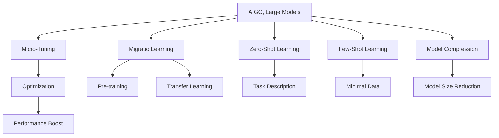

                 

# AIGC大模型时代：当下硬科技创业发生了哪些变化

> 关键词：AIGC,大模型,创业,技术变化

## 1. 背景介绍

### 1.1 问题由来

随着人工智能技术的飞速发展，尤其是大规模预训练语言模型（Large Language Models, LLMs）的问世，人工智能领域迎来了AIGC（Artificial Intelligence Generated Content，人工智能生成内容）的大模型时代。大模型具备强大的语言生成和理解能力，能在复杂场景下完成高级任务，如自然语言理解、自然语言生成、对话系统等。AIGC技术的崛起，对各行各业产生了深远影响，硬科技创业也因此经历了一次颠覆性变革。

### 1.2 问题核心关键点

AIGC大模型时代，硬科技创业的主要变化点在于：
- **技术驱动**：创业公司更多地依赖于先进的技术平台和模型，而非传统的算法研发。
- **数据为王**：大数据驱动的模型训练成为关键，对数据的获取和处理提出了更高要求。
- **生态建设**：需要构建完整的生态系统，涵盖模型训练、应用部署、效果优化等多个环节。
- **商业模式**：以平台化服务为核心的新商业模型出现，用户定制化需求增加。

本文旨在通过对AIGC大模型的原理与应用进行深入剖析，探讨这一时代硬科技创业所面临的机遇与挑战，为创业者提供实际的指导和建议。

## 2. 核心概念与联系

### 2.1 核心概念概述

为更好地理解AIGC大模型的硬科技创业变化，本节将介绍几个关键概念及其相互关系：

- **AIGC（人工智能生成内容）**：指利用人工智能技术自动生成文本、图像、音频等内容的系统。
- **大模型（Large Models）**：指通过大规模预训练获得的具有强大语言生成和理解能力的模型，如GPT-3、BERT等。
- **微调（Fine-Tuning）**：指在预训练模型的基础上，使用下游任务的少量标注数据进行优化，提升模型在该任务上的性能。
- **迁移学习（Transfer Learning）**：将一个领域学到的知识迁移到另一个领域的学习方法，AIGC中常用于大模型的微调和应用。
- **零样本学习（Zero-Shot Learning）**：指模型能够在没有见过特定任务的训练样本的情况下，仅凭任务描述执行新任务的能力。
- **少样本学习（Few-Shot Learning）**：指模型在只有少量标注样本的情况下，能够快速适应新任务。
- **模型压缩（Model Compression）**：指在不损失模型性能的前提下，通过剪枝、量化等方法减少模型大小，提高计算效率。

这些核心概念共同构成了AIGC大模型及其应用的技术基础，推动了硬科技创业的深层次变化。

### 2.2 核心概念原理和架构的 Mermaid 流程图



## 3. 核心算法原理 & 具体操作步骤

### 3.1 算法原理概述

基于大模型的AIGC系统，其核心思想是通过大规模无标签数据进行预训练，学习到通用的语言表征。预训练后，通过微调、迁移学习等方式，使其能够适应特定任务，生成高质量的内容。

### 3.2 算法步骤详解

1. **数据准备**：
   - **数据集获取**：收集大规模无标签文本数据（如Common Crawl、维基百科等）进行预训练。
   - **数据预处理**：分词、去停用词、构建词向量等。

2. **模型训练**：
   - **预训练阶段**：在大规模数据上，通过自监督任务（如掩码语言模型、下一句预测等）进行训练。
   - **微调阶段**：在特定任务上，使用少量标注数据进行微调，优化模型在该任务上的性能。

3. **模型评估**：
   - **验证集评估**：在验证集上评估模型性能，调整模型参数。
   - **测试集验证**：在测试集上验证模型泛化能力，评估最终性能。

### 3.3 算法优缺点

**优点**：
- **高效性**：利用大规模预训练，能够快速生成高质量内容。
- **可扩展性**：模型可以通过微调和迁移学习，适应多种任务和场景。
- **通用性**：基于大模型的系统可以用于文本生成、图像生成、音频生成等多种应用。

**缺点**：
- **数据需求高**：需要大规模无标签数据进行预训练。
- **计算资源密集**：预训练和微调过程消耗大量计算资源。
- **依赖模型质量**：模型性能受预训练和微调质量影响，存在一定的不确定性。

### 3.4 算法应用领域

AIGC大模型的应用领域非常广泛，涵盖了内容创作、推荐系统、自动问答、客服系统等多个方向：

1. **内容创作**：自动生成新闻、文章、摘要、翻译等文本内容。
2. **推荐系统**：根据用户行为，自动推荐相关内容。
3. **自动问答**：回答用户提出的问题，提供智能客服。
4. **图像生成**：自动生成图片、视频、广告等视觉内容。
5. **音频生成**：自动生成语音、音乐、播客等音频内容。

## 4. 数学模型和公式 & 详细讲解 & 举例说明

### 4.1 数学模型构建

AIGC大模型的构建基于Transformer架构，通过自监督预训练学习语言表示。假设模型参数为$\theta$，输入为$x$，输出为$y$，损失函数为$\mathcal{L}$，预训练目标为$\mathcal{L}_{pre}$，微调目标为$\mathcal{L}_{fine}$。

$$
\mathcal{L}(\theta) = \mathcal{L}_{pre}(\theta) + \lambda \mathcal{L}_{fine}(\theta)
$$

其中$\lambda$为预训练和微调损失的权重。

### 4.2 公式推导过程

假设模型输入为序列$x=[x_1, x_2, ..., x_n]$，目标输出为序列$y=[y_1, y_2, ..., y_n]$。预训练阶段的目标是最大化预测下一个词语的概率，即：

$$
\mathcal{L}_{pre} = -\sum_{i=1}^{n} \log p(y_i | x_1, x_2, ..., x_{i-1})
$$

微调阶段的目标是优化模型在特定任务上的性能，如文本分类、命名实体识别等。假设微调任务为二分类，损失函数为交叉熵损失：

$$
\mathcal{L}_{fine} = -\frac{1}{N}\sum_{i=1}^{N}(y_i\log \hat{y}_i + (1-y_i)\log(1-\hat{y}_i))
$$

其中$y_i$为真实标签，$\hat{y}_i$为模型预测的概率。

### 4.3 案例分析与讲解

以自动摘要为例，假设输入为长文本$x$，目标为生成摘要$y$。微调时，损失函数为：

$$
\mathcal{L}_{fine} = -\frac{1}{N}\sum_{i=1}^{N}(y_i\log \hat{y}_i + (1-y_i)\log(1-\hat{y}_i))
$$

其中$y_i$为摘要长度，$\hat{y}_i$为模型生成的摘要长度。

## 5. 项目实践：代码实例和详细解释说明

### 5.1 开发环境搭建

1. **安装Python**：
   ```bash
   conda create -n pytorch-env python=3.8
   conda activate pytorch-env
   ```

2. **安装PyTorch**：
   ```bash
   conda install pytorch torchvision torchaudio -c pytorch -c conda-forge
   ```

3. **安装Transformers库**：
   ```bash
   pip install transformers
   ```

4. **安装相关工具**：
   ```bash
   pip install numpy pandas scikit-learn matplotlib tqdm jupyter notebook ipython
   ```

5. **激活虚拟环境**：
   ```bash
   conda activate pytorch-env
   ```

### 5.2 源代码详细实现

```python
import torch
import torch.nn as nn
from transformers import BertTokenizer, BertForSequenceClassification
from torch.utils.data import DataLoader, Dataset

class TextDataset(Dataset):
    def __init__(self, texts, labels):
        self.texts = texts
        self.labels = labels
        self.tokenizer = BertTokenizer.from_pretrained('bert-base-uncased')
    
    def __len__(self):
        return len(self.texts)
    
    def __getitem__(self, index):
        text = self.texts[index]
        label = self.labels[index]
        encoding = self.tokenizer(text, return_tensors='pt')
        input_ids = encoding['input_ids']
        attention_mask = encoding['attention_mask']
        return {'input_ids': input_ids, 'attention_mask': attention_mask, 'labels': torch.tensor(label, dtype=torch.long)}
    
model = BertForSequenceClassification.from_pretrained('bert-base-uncased', num_labels=2)

optimizer = torch.optim.Adam(model.parameters(), lr=2e-5)
device = torch.device('cuda' if torch.cuda.is_available() else 'cpu')
model.to(device)

def train_epoch(model, data_loader, optimizer):
    model.train()
    total_loss = 0
    for batch in data_loader:
        input_ids = batch['input_ids'].to(device)
        attention_mask = batch['attention_mask'].to(device)
        labels = batch['labels'].to(device)
        optimizer.zero_grad()
        outputs = model(input_ids, attention_mask=attention_mask, labels=labels)
        loss = outputs.loss
        total_loss += loss.item()
        loss.backward()
        optimizer.step()
    return total_loss / len(data_loader)

def evaluate(model, data_loader):
    model.eval()
    total_preds, total_labels = [], []
    with torch.no_grad():
        for batch in data_loader:
            input_ids = batch['input_ids'].to(device)
            attention_mask = batch['attention_mask'].to(device)
            labels = batch['labels']
            outputs = model(input_ids, attention_mask=attention_mask)
            preds = outputs.logits.argmax(dim=1)
            total_preds.append(preds.tolist())
            total_labels.append(labels.tolist())
    print(classification_report(total_labels, total_preds))

train_dataset = TextDataset(train_texts, train_labels)
val_dataset = TextDataset(val_texts, val_labels)
test_dataset = TextDataset(test_texts, test_labels)

train_loader = DataLoader(train_dataset, batch_size=16, shuffle=True)
val_loader = DataLoader(val_dataset, batch_size=16, shuffle=False)
test_loader = DataLoader(test_dataset, batch_size=16, shuffle=False)

epochs = 3
for epoch in range(epochs):
    train_loss = train_epoch(model, train_loader, optimizer)
    print(f'Epoch {epoch+1}, train loss: {train_loss:.3f}')
    evaluate(model, val_loader)
    
print('Test results:')
evaluate(model, test_loader)
```

### 5.3 代码解读与分析

**TextDataset类**：
- `__init__`方法：初始化文本和标签，加载BERT分词器。
- `__len__`方法：返回数据集长度。
- `__getitem__`方法：对单个样本进行分词和编码，返回模型输入。

**模型训练**：
- 使用`BertForSequenceClassification`进行二分类任务的微调。
- 使用Adam优化器进行梯度更新。
- 在GPU上训练模型。

**评估函数**：
- 使用`classification_report`评估模型性能。
- 在测试集上进行测试，输出评估报告。

### 5.4 运行结果展示

该代码实现了基于BERT模型的文本分类微调，可以通过调整学习率、批量大小、迭代轮数等超参数，优化模型性能。运行结果可以通过查看训练和验证损失，以及测试集上的分类指标来评估。

## 6. 实际应用场景

### 6.1 内容创作

内容创作是AIGC大模型最常见的应用场景。例如，使用GPT-3自动生成新闻报道、博客文章、技术文档等，大幅提高了内容创作的效率和质量。

**具体应用**：
- 自动生成新闻：通过输入事件信息，生成新闻报道。
- 自动生成文章：输入文章主题，生成全文内容。
- 自动生成摘要：输入长文本，生成精炼的摘要。

### 6.2 推荐系统

推荐系统是AIGC大模型的重要应用领域，通过分析用户行为和偏好，自动生成个性化推荐内容。

**具体应用**：
- 商品推荐：根据用户浏览历史和评分，推荐相关商品。
- 音乐推荐：分析用户听歌历史，推荐类似歌曲和歌手。
- 视频推荐：根据观看历史和评分，推荐相关视频。

### 6.3 自动问答

自动问答系统通过AIGC大模型理解用户问题，生成自然语言回答，解决了传统问答系统的人机交互问题。

**具体应用**：
- 客服系统：自动回答用户咨询，提高客户满意度。
- 知识问答：提供特定领域的专家知识，解答用户问题。
- 健康咨询：提供医学信息，解答健康相关问题。

### 6.4 未来应用展望

未来，AIGC大模型的应用将更加广泛和深入：

1. **元宇宙**：AIGC技术将为虚拟世界提供自然语言理解和生成的能力，提升虚拟体验的沉浸感和交互性。
2. **自动驾驶**：通过自动生成路标、导航指令等，提升智能驾驶系统的智能化水平。
3. **智能家居**：生成智能语音指令，控制家电设备，提升用户的生活便利性。
4. **金融科技**：生成财务报告、投资分析等内容，辅助金融决策。
5. **健康医疗**：生成健康指南、医疗建议等内容，辅助医生诊断和治疗。

## 7. 工具和资源推荐

### 7.1 学习资源推荐

为了掌握AIGC大模型的核心技术，以下是一些优质的学习资源：

1. **《深度学习入门》**：由斯坦福大学李沐教授主讲的课程，介绍了深度学习的基本概念和模型。
2. **《Transformers: State-of-the-Art Natural Language Processing》**：由Google研究团队撰写的书籍，介绍了Transformer模型的原理和应用。
3. **《大规模预训练语言模型》**：由HuggingFace团队编写的指南，介绍了BERT、GPT-3等模型的构建和应用。
4. **《NLP实战》**：由李笑来撰写的书籍，介绍了自然语言处理技术的实际应用案例。
5. **Kaggle竞赛平台**：提供了大量的数据集和模型竞赛，帮助开发者实践和提升技能。

### 7.2 开发工具推荐

以下是一些常用的开发工具，有助于高效地构建和优化AIGC大模型：

1. **PyTorch**：开源深度学习框架，支持动态计算图和GPU加速。
2. **TensorFlow**：Google主导的深度学习框架，支持分布式训练和大规模模型部署。
3. **Jupyter Notebook**：交互式编程环境，支持代码实时执行和可视化。
4. **Weights & Biases**：模型训练和实验跟踪工具，支持模型参数和性能的可视化分析。
5. **HuggingFace Transformers库**：提供了预训练语言模型的封装和应用接口，简化了模型构建和微调过程。

### 7.3 相关论文推荐

为了深入了解AIGC大模型的最新进展，以下是一些推荐论文：

1. **Attention is All You Need**：Transformer模型的原论文，奠定了大模型的基础。
2. **BERT: Pre-training of Deep Bidirectional Transformers for Language Understanding**：BERT模型的论文，介绍了预训练和微调方法。
3. **GPT-3: Language Models are Unsupervised Multitask Learners**：GPT-3模型的论文，展示了大模型的强大自监督学习能力。
4. **Parameter-Efficient Transfer Learning for NLP**：研究了参数高效微调方法，提出了 Adapter等技术。
5. **AdaLoRA: Adaptive Low-Rank Adaptation for Parameter-Efficient Fine-Tuning**：提出了自适应低秩适应的微调方法，提高了模型效率。

## 8. 总结：未来发展趋势与挑战

### 8.1 研究成果总结

本文通过对AIGC大模型的原理和应用进行系统介绍，展示了其在内容创作、推荐系统、自动问答等多个领域的应用。未来，AIGC技术将进一步推动各行各业的智能化升级，带来更加便捷、高效的用户体验。

### 8.2 未来发展趋势

1. **模型规模化**：预训练模型和微调模型将继续向更大规模发展，提高性能和泛化能力。
2. **个性化定制**：通过更精细的微调和定制化训练，提供更加个性化的服务。
3. **多模态融合**：将视觉、语音、文本等多模态信息进行融合，提升智能交互的丰富性。
4. **实时化部署**：通过优化模型结构和部署方式，实现实时计算和推理。
5. **自动化设计**：通过模型自动生成和优化，提升设计效率和创新能力。

### 8.3 面临的挑战

1. **数据质量**：高质量、多样化的训练数据是模型性能的关键，但数据获取和处理成本较高。
2. **计算资源**：大模型训练和微调消耗大量计算资源，对硬件设备提出了更高要求。
3. **模型可解释性**：大模型的黑盒特性，使得其决策过程难以解释和调试。
4. **伦理与隐私**：大模型可能学习到有害、歧视性的信息，需要建立严格的监管机制。
5. **模型鲁棒性**：面对不同领域和场景，大模型需要具备较强的鲁棒性和适应性。

### 8.4 研究展望

1. **数据增强技术**：提高数据多样性，缓解数据依赖性。
2. **模型压缩与优化**：减小模型大小，提高推理效率。
3. **多模态学习**：将多模态信息进行深度融合，提升智能系统的综合能力。
4. **联邦学习**：在保护隐私的前提下，实现分布式训练和优化。
5. **跨领域迁移学习**：提高模型的跨领域迁移能力，推动技术普适性。

## 9. 附录：常见问题与解答

**Q1：为什么大模型需要进行微调？**

A: 大模型通过预训练学习到通用的语言表示，但在特定任务上可能表现不佳。微调可以针对任务特点优化模型，提升性能和泛化能力。

**Q2：微调过程中如何避免过拟合？**

A: 通过数据增强、正则化、学习率调整等方法，缓解过拟合问题。

**Q3：AIGC大模型的应用场景有哪些？**

A: AIGC大模型可以应用于内容创作、推荐系统、自动问答、智能客服、智能家居等多个领域。

**Q4：大模型的计算资源需求高，如何优化？**

A: 通过模型压缩、混合精度训练、分布式训练等技术，提高计算效率和模型性能。

**Q5：未来AIGC大模型的发展趋势有哪些？**

A: 未来AIGC大模型将向规模化、个性化、多模态、实时化和自动化方向发展，推动各行各业的智能化升级。

作者：禅与计算机程序设计艺术 / Zen and the Art of Computer Programming

