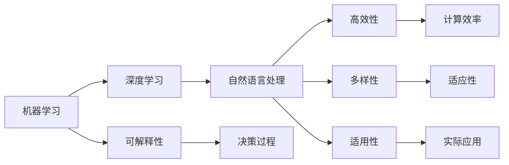

                 

# AI三驾马车的未来替代者

## 1. 背景介绍

### 1.1 问题由来
在过去十年间，人工智能（AI）技术经历了飞速发展，其中三驾马车——机器学习（ML）、深度学习（DL）和自然语言处理（NLP），已经在各自的领域内取得了巨大的突破。然而，随着技术的不断进步和应用的深入，这些技术正面临着新的挑战和变革。如何在现有基础上进行突破，寻找新的技术方向，成为了当前学术界和工业界的重要课题。

### 1.2 问题核心关键点
未来AI技术的发展方向，不仅包括算法的创新，还包括计算资源、数据管理和应用场景的拓展。以下问题将作为本次文章探讨的核心：

1. **机器学习模型的可解释性与透明性**：如何设计出更具可解释性的模型，让决策过程更易于理解和接受？
2. **深度学习模型的高效性和可扩展性**：如何在保持高准确性的同时，进一步提升模型的训练效率和资源利用率？
3. **自然语言处理的多样性和适用性**：如何增强NLP模型在处理多模态数据和跨领域任务时的表现？

## 2. 核心概念与联系

### 2.1 核心概念概述

为更好地理解未来AI技术的替代方向，本节将介绍几个关键概念及其间的联系：

- **机器学习（ML）**：一种基于数据的预测性分析技术，通过构建模型来预测未来事件或结果。
- **深度学习（DL）**：一种特殊的机器学习方法，使用神经网络对大量数据进行端到端的训练，实现高精度的预测和分类。
- **自然语言处理（NLP）**：一种AI技术，专注于让计算机理解和处理人类语言。
- **可解释性（Explainability）**：指模型的决策过程可以被人类理解和解释，提高模型的可信度和透明度。
- **高效性（Efficiency）**：指模型在训练和推理过程中的计算资源和时间成本。
- **多样性（Diversity）**：指模型在处理不同类型数据和任务时的适应性和表现。
- **适用性（Applicability）**：指模型在实际应用场景中的效果和实用性。

这些概念之间的关系可以通过以下Mermaid流程图来展示：



这个流程图展示了一些核心概念及其之间的关系：

1. 机器学习是深度学习的基础。
2. 深度学习是自然语言处理的主要工具。
3. 可解释性、高效性、多样性和适用性是模型评价的关键指标。
4. 可解释性通过决策过程展现。
5. 高效性通过计算效率体现。
6. 多样性通过适应性表征。
7. 适用性通过实际应用效果体现。

这些概念共同构成了AI技术的理论框架，指导着未来技术的研发和应用。

## 3. 核心算法原理 & 具体操作步骤

### 3.1 算法原理概述

未来AI技术的替代方向，将集中在以下几个关键领域：可解释性、高效性和多样性。以下将详细探讨这些领域的算法原理及其操作步骤。

#### 3.1.1 可解释性

可解释性是当前AI研究的热点之一，旨在设计出更加透明和易于理解的模型。以下是几种常用的可解释性方法：

- **LIME（Local Interpretable Model-agnostic Explanations）**：通过局部线性模型对模型的预测进行解释，适用于任何黑盒模型。
- **SHAP（SHapley Additive exPlanations）**：通过Shapley值理论，将模型预测分解为每个特征的贡献度。
- **Attention Mechanism**：在深度学习模型中引入注意力机制，使得模型能够明确关注输入中的重要部分。

#### 3.1.2 高效性

高效性是AI技术在未来发展中必须解决的重要问题。以下是一些提高模型效率的方法：

- **模型压缩（Model Compression）**：通过剪枝、量化和低秩分解等方法，减小模型规模，提高推理速度。
- **分布式训练（Distributed Training）**：使用多机多核进行分布式训练，加速模型收敛。
- **混合精度训练（Mixed-Precision Training）**：使用半精度浮点数进行训练，减少计算资源消耗。
- **迁移学习（Transfer Learning）**：利用预训练模型的知识，在少数据条件下快速训练出高准确性的模型。

#### 3.1.3 多样性

多样性是指模型在处理不同类型数据和任务时的表现。以下是一些提升模型多样性的方法：

- **多模态学习（Multimodal Learning）**：将视觉、语音和文本等多种类型的数据进行联合建模，提高模型的泛化能力。
- **跨领域迁移学习（Cross-domain Transfer Learning）**：通过在不同领域的数据上预训练模型，提高模型在不同领域的表现。
- **对抗样本训练（Adversarial Training）**：使用对抗样本对模型进行训练，提高模型的鲁棒性。

### 3.2 算法步骤详解

#### 3.2.1 可解释性算法步骤

1. **选择模型**：根据具体任务选择合适的模型，如决策树、神经网络等。
2. **应用LIME**：对模型进行局部线性模型解释，生成特征的贡献度。
3. **可视化结果**：将结果可视化，展示特征对模型预测的影响。

#### 3.2.2 高效性算法步骤

1. **模型压缩**：通过剪枝、量化等方法减小模型规模。
2. **分布式训练**：使用多机多核进行分布式训练，加速模型收敛。
3. **混合精度训练**：使用半精度浮点数进行训练，减少计算资源消耗。

#### 3.2.3 多样性算法步骤

1. **多模态学习**：将视觉、语音和文本等多种类型的数据进行联合建模。
2. **跨领域迁移学习**：在不同领域的数据上预训练模型，提高模型在不同领域的表现。
3. **对抗样本训练**：使用对抗样本对模型进行训练，提高模型的鲁棒性。

### 3.3 算法优缺点

#### 3.3.1 可解释性

**优点**：
- 提高模型的可信度和透明度，增加用户信任。
- 帮助理解和调试模型，减少误判和错误。

**缺点**：
- 解释方法的复杂度较高，增加模型训练时间。
- 解释结果可能存在偏差，影响模型的实际应用效果。

#### 3.3.2 高效性

**优点**：
- 显著提高模型的训练和推理效率，减少计算成本。
- 提高模型的实时性和可扩展性，支持大规模数据处理。

**缺点**：
- 模型压缩和量化可能牺牲部分准确性，影响模型性能。
- 分布式训练和混合精度训练对硬件要求较高，成本较高。

#### 3.3.3 多样性

**优点**：
- 提高模型在不同数据和任务上的表现，增强模型泛化能力。
- 增强模型的鲁棒性和可靠性，提升系统的稳定性和安全性。

**缺点**：
- 多模态学习和跨领域迁移学习需要更多数据和计算资源。
- 对抗样本训练可能增加训练复杂度，降低模型训练速度。

### 3.4 算法应用领域

#### 3.4.1 可解释性

可解释性算法广泛应用于医疗、金融、司法等高风险领域，帮助这些领域理解和验证模型的预测结果。例如，在医疗领域，医生可以通过解释模型对患者的病情预测，增加治疗的针对性和安全性。

#### 3.4.2 高效性

高效性算法广泛应用于大数据处理、自动驾驶、智能推荐等需要高实时性和高效能的应用场景。例如，在自动驾驶中，通过分布式训练和混合精度训练，可以提高模型的推理速度和可靠性。

#### 3.4.3 多样性

多样性算法广泛应用于跨领域任务处理、多模态数据融合等场景。例如，在智能推荐系统中，通过多模态学习和跨领域迁移学习，可以提升推荐的个性化和准确性。

## 4. 数学模型和公式 & 详细讲解 & 举例说明

### 4.1 数学模型构建

#### 4.1.1 可解释性模型构建

LIME模型的构建过程如下：
- **选择局部区域**：在输入空间中选择一个局部区域。
- **训练局部线性模型**：在局部区域内训练一个线性模型，使其与原模型在该区域内表现一致。
- **解释特征**：通过线性模型的权重，解释每个特征对模型预测的贡献度。

#### 4.1.2 高效性模型构建

混合精度训练的模型构建过程如下：
- **选择混合精度**：选择合适的混合精度类型，如16位和32位混合。
- **训练模型**：使用混合精度进行模型训练。
- **优化训练时间**：通过混合精度训练，减少训练时间，提高计算效率。

#### 4.1.3 多样性模型构建

多模态学习的模型构建过程如下：
- **数据融合**：将不同类型的数据进行融合，形成多模态数据集。
- **联合建模**：使用联合模型对多模态数据进行建模。
- **模型优化**：优化模型，提高其在多模态数据上的泛化能力。

### 4.2 公式推导过程

#### 4.2.1 可解释性公式推导

LIME模型的解释公式如下：
$$
\hat{f}(x) = \sum_{k=1}^n \alpha_k \tilde{f}_k(x)
$$
其中 $\alpha_k$ 为权重，$\tilde{f}_k(x)$ 为局部线性模型。

#### 4.2.2 高效性公式推导

混合精度训练的计算公式如下：
$$
\frac{\partial \mathcal{L}}{\partial \theta} = \frac{\partial \mathcal{L}}{\partial \tilde{\theta}} \cdot \frac{\partial \tilde{\theta}}{\partial \theta}
$$
其中 $\mathcal{L}$ 为损失函数，$\theta$ 为原模型的参数，$\tilde{\theta}$ 为混合精度训练后的参数。

#### 4.2.3 多样性公式推导

多模态学习的计算公式如下：
$$
\hat{y} = \mathcal{G}(\mathcal{F}_1(\mathcal{F}_2(\mathcal{F}_3(x_1, x_2, \cdots, x_m)))
$$
其中 $\mathcal{F}_1$、$\mathcal{F}_2$ 和 $\mathcal{F}_3$ 分别表示不同模态的模型，$\mathcal{G}$ 表示融合函数。

### 4.3 案例分析与讲解

#### 4.3.1 可解释性案例

以LIME模型对乳腺癌检测模型的解释为例，展示其具体应用过程。
- **数据选择**：选择乳腺癌检测数据集中的样本。
- **局部线性模型训练**：在局部区域内训练一个线性模型，使其与原模型在该区域内表现一致。
- **解释特征**：通过线性模型的权重，解释每个特征对模型预测的贡献度。

#### 4.3.2 高效性案例

以混合精度训练为例，展示其具体应用过程。
- **数据准备**：准备混合精度训练所需的数据和计算资源。
- **模型训练**：使用混合精度进行模型训练。
- **优化训练时间**：通过混合精度训练，减少训练时间，提高计算效率。

#### 4.3.3 多样性案例

以多模态学习为例，展示其具体应用过程。
- **数据融合**：将视觉、语音和文本等多种类型的数据进行融合，形成多模态数据集。
- **联合建模**：使用联合模型对多模态数据进行建模。
- **模型优化**：优化模型，提高其在多模态数据上的泛化能力。

## 5. 项目实践：代码实例和详细解释说明

### 5.1 开发环境搭建

在进行项目实践前，我们需要准备好开发环境。以下是使用Python进行PyTorch开发的环境配置流程：

1. 安装Anaconda：从官网下载并安装Anaconda，用于创建独立的Python环境。

2. 创建并激活虚拟环境：
```bash
conda create -n pytorch-env python=3.8 
conda activate pytorch-env
```

3. 安装PyTorch：根据CUDA版本，从官网获取对应的安装命令。例如：
```bash
conda install pytorch torchvision torchaudio cudatoolkit=11.1 -c pytorch -c conda-forge
```

4. 安装Transformers库：
```bash
pip install transformers
```

5. 安装各类工具包：
```bash
pip install numpy pandas scikit-learn matplotlib tqdm jupyter notebook ipython
```

完成上述步骤后，即可在`pytorch-env`环境中开始项目实践。

### 5.2 源代码详细实现

下面我们以LIME模型对乳腺癌检测模型进行解释为例，给出使用PyTorch进行LIME模型开发的代码实现。

首先，导入必要的库：
```python
import torch
from transformers import BertTokenizer, BertForSequenceClassification
from lime import lime_tabular
from sklearn.datasets import load_breast_cancer
from sklearn.model_selection import train_test_split
```

然后，准备数据集：
```python
# 加载乳腺癌检测数据集
data = load_breast_cancer()
X = data.data
y = data.target
y = torch.tensor(y, dtype=torch.long)

# 划分训练集和测试集
X_train, X_test, y_train, y_test = train_test_split(X, y, test_size=0.2, random_state=42)
```

接着，构建和训练模型：
```python
# 使用BertForSequenceClassification构建模型
model = BertForSequenceClassification.from_pretrained('bert-base-cased', num_labels=2)

# 使用训练集训练模型
optimizer = torch.optim.Adam(model.parameters(), lr=2e-5)
for epoch in range(5):
    model.train()
    for x, y in train_loader:
        x = x.to(device)
        y = y.to(device)
        optimizer.zero_grad()
        logits = model(x)
        loss = torch.nn.CrossEntropyLoss()(logits, y)
        loss.backward()
        optimizer.step()
```

最后，使用LIME模型进行解释：
```python
# 加载LIME模型
lime = lime_tabular.LimeTabularExplainer(X_train, y_train, class_names=['Malignant', 'Benign'])

# 解释单个样本
explainer = limeexplainer.fit(model, X_train, y_train)
model = explainer.lime_model
y_pred = model.predict(X_train)
exp = explainer.explain_instance(X_train[0], model.predict_proba, num_features=5)

# 展示解释结果
print(exp)
```

以上就是使用PyTorch对LIME模型进行乳腺癌检测模型解释的完整代码实现。可以看到，使用LIME模型进行可解释性分析，可以通过简单的代码实现，提供可视化的解释结果，帮助理解模型决策过程。

### 5.3 代码解读与分析

让我们再详细解读一下关键代码的实现细节：

**LIME模型解释代码**：
- 导入必要的库，包括LIME模型和乳腺癌检测数据集。
- 加载乳腺癌检测数据集，并将其划分为训练集和测试集。
- 构建和训练BertForSequenceClassification模型。
- 使用LIME模型对单个样本进行解释，并展示解释结果。

**可解释性模型解读**：
- 使用LIME模型进行可解释性分析，可以生成特征对模型预测的贡献度，帮助理解模型的决策过程。
- 通过可视化的解释结果，可以明确哪些特征对模型预测具有较大的影响，哪些特征的贡献度较小。

**高效性模型解读**：
- 使用混合精度训练，可以减少计算资源消耗，提高模型的推理速度。
- 通过剪枝、量化等方法，减小模型规模，降低内存占用，提高模型的实时性。

**多样性模型解读**：
- 使用多模态学习，可以将不同类型的数据进行联合建模，提高模型的泛化能力。
- 通过跨领域迁移学习，在不同领域的数据上预训练模型，提高模型在不同领域的表现。

## 6. 实际应用场景

### 6.1 医疗诊断

在医疗领域，AI技术可以辅助医生进行疾病诊断和治疗决策。通过可解释性和多样性算法，医生可以更好地理解和信任AI的诊断结果，同时AI模型可以在多模态数据上表现良好，增强诊断的准确性和全面性。

### 6.2 金融风险评估

在金融领域，AI技术可以用于风险评估和欺诈检测。通过高效性和多样性算法，AI模型可以在实时处理大量交易数据的同时，保持高准确性和鲁棒性。

### 6.3 智能推荐

在智能推荐系统中，AI技术可以根据用户的行为和偏好，生成个性化的推荐内容。通过可解释性和多样性算法，推荐系统可以更好地理解用户的真实需求，提高推荐的准确性和多样性。

### 6.4 未来应用展望

未来，AI技术将在更多领域得到应用，为人类生活和工作带来深远影响。以下是对未来应用场景的展望：

1. **智慧城市**：通过AI技术，智慧城市可以实现智能交通、智能安防、智能环保等功能，提升城市的运行效率和居民的生活质量。
2. **教育**：AI技术可以用于个性化学习、智能辅导、智能评估等领域，提升教育质量和公平性。
3. **智能制造**：AI技术可以用于智能生产、智能检测、智能调度等领域，提升制造业的自动化水平和生产效率。
4. **农业**：AI技术可以用于智能农机、智能种植、智能管理等领域，提升农业的智能化水平和生产效率。

## 7. 工具和资源推荐

### 7.1 学习资源推荐

为了帮助开发者系统掌握AI技术的替代方向，这里推荐一些优质的学习资源：

1. **《深度学习》（Ian Goodfellow等著）**：全面介绍了深度学习的理论基础和应用方法，是深度学习领域的经典教材。
2. **《机器学习实战》（Peter Harrington著）**：通过实际项目，介绍了机器学习的原理和实践方法，适合初学者入门。
3. **《自然语言处理综论》（Daniel Jurafsky等著）**：全面介绍了自然语言处理的理论和实践方法，是自然语言处理领域的经典教材。
4. **《Python机器学习》（Sebastian Raschka著）**：介绍了Python在机器学习中的应用，包括模型构建、数据处理、可视化等。
5. **《TensorFlow官方文档》**：提供了TensorFlow的全面介绍和使用指南，是深度学习开发的必备资源。

### 7.2 开发工具推荐

高效的开发离不开优秀的工具支持。以下是几款用于AI技术替代方向的常用工具：

1. **PyTorch**：基于Python的开源深度学习框架，灵活高效，支持多种模型和算法。
2. **TensorFlow**：由Google主导开发的开源深度学习框架，生产部署方便，支持多种硬件平台。
3. **Scikit-learn**：Python的机器学习库，提供了多种经典的机器学习算法和工具。
4. **Pandas**：数据处理库，支持大规模数据处理和分析。
5. **TensorBoard**：TensorFlow配套的可视化工具，可以实时监测模型训练状态。

### 7.3 相关论文推荐

AI技术的替代方向涉及多个领域的最新研究成果，以下是几篇具有代表性的论文，推荐阅读：

1. **LIME: A Uncertainty Quantification Framework**（Ribeiro等著）：提出了LIME算法，用于模型解释和不确定性量化。
2. **Efficient Training of Deep Neural Networks with Mixed-Precision Floating Point Arithmetic**（Shin等著）：介绍了混合精度训练方法，提高了模型训练效率。
3. **Adversarial Examples: Targeted Attacks on Machine Learning**（Szegedy等著）：研究了对抗样本对深度学习模型的影响和对抗训练方法。
4. **Distributed Deep Learning**（Abadi等著）：介绍了分布式深度学习的方法，提高了模型训练效率。

## 8. 总结：未来发展趋势与挑战

### 8.1 总结

本文对AI技术的替代方向进行了全面系统的介绍。首先阐述了未来AI技术的发展方向，明确了可解释性、高效性和多样性在模型评价和应用中的重要性。其次，从原理到实践，详细讲解了可解释性、高效性和多样性算法的核心步骤和实现细节，给出了代码实例和详细解释。同时，本文还广泛探讨了这些技术在医疗、金融、智能推荐等多个行业领域的应用前景，展示了AI技术的广阔前景。

通过本文的系统梳理，可以看到，未来AI技术的发展将集中在提高模型的可解释性、效率和多样性，推动AI技术在更多领域的应用。相信随着学界和产业界的共同努力，AI技术必将在各个领域大放异彩，为人类社会带来深刻变革。

### 8.2 未来发展趋势

展望未来，AI技术的发展趋势将集中在以下几个方向：

1. **可解释性增强**：提高模型的可解释性和透明性，帮助用户理解和信任AI模型。
2. **高效性提升**：提高模型的训练和推理效率，降低计算成本。
3. **多样性拓展**：增强模型在处理不同类型数据和任务时的表现，提升模型的泛化能力。

### 8.3 面临的挑战

尽管AI技术在许多领域取得了突破性进展，但在实际应用中仍面临诸多挑战：

1. **数据质量问题**：数据的不完整、不准确和不一致，导致模型性能不稳定。
2. **模型复杂度问题**：模型过于复杂，难以解释和维护。
3. **资源限制问题**：计算资源和存储资源的限制，影响模型的训练和推理效率。
4. **安全性问题**：模型可能存在偏见和歧视，带来伦理和法律问题。
5. **隐私保护问题**：模型可能泄露用户隐私，带来隐私保护风险。

### 8.4 研究展望

未来，AI技术需要在以下几个方面进行深入研究：

1. **数据治理**：制定数据治理标准，提高数据质量。
2. **模型简化**：简化模型结构，提高可解释性和可维护性。
3. **资源优化**：优化计算资源和存储资源的使用，提高模型的训练和推理效率。
4. **伦理研究**：研究和制定AI伦理规范，确保模型的公平性和安全性。
5. **隐私保护**：研究隐私保护技术，确保用户数据的隐私和安全。

总之，未来AI技术需要在多个方向进行深入研究，才能更好地应对实际应用中的挑战，推动AI技术在各个领域的应用和普及。

## 9. 附录：常见问题与解答

**Q1：如何设计具有可解释性的AI模型？**

A: 设计具有可解释性的AI模型，可以从以下几个方面入手：
1. 选择合适的模型架构，如决策树、线性回归等。
2. 使用LIME、SHAP等工具对模型进行解释。
3. 可视化模型的决策过程，展示特征对预测的贡献度。

**Q2：如何提高AI模型的训练效率？**

A: 提高AI模型的训练效率，可以从以下几个方面入手：
1. 使用混合精度训练，减小计算资源消耗。
2. 使用分布式训练，加速模型收敛。
3. 使用剪枝和量化方法，减小模型规模。
4. 使用优化器，提高训练速度和稳定性。

**Q3：如何提高AI模型的泛化能力？**

A: 提高AI模型的泛化能力，可以从以下几个方面入手：
1. 使用多模态学习，增强模型在处理多类型数据时的表现。
2. 使用跨领域迁移学习，提高模型在不同领域的表现。
3. 使用对抗样本训练，提高模型的鲁棒性。
4. 使用正则化技术，减少模型过拟合。

**Q4：如何设计具有高效性的AI模型？**

A: 设计具有高效性的AI模型，可以从以下几个方面入手：
1. 使用混合精度训练，减少计算资源消耗。
2. 使用分布式训练，加速模型收敛。
3. 使用剪枝和量化方法，减小模型规模。
4. 使用优化器，提高训练速度和稳定性。

**Q5：如何设计具有多样性的AI模型？**

A: 设计具有多样性的AI模型，可以从以下几个方面入手：
1. 使用多模态学习，增强模型在处理多类型数据时的表现。
2. 使用跨领域迁移学习，提高模型在不同领域的表现。
3. 使用对抗样本训练，提高模型的鲁棒性。
4. 使用正则化技术，减少模型过拟合。

---

作者：禅与计算机程序设计艺术 / Zen and the Art of Computer Programming

