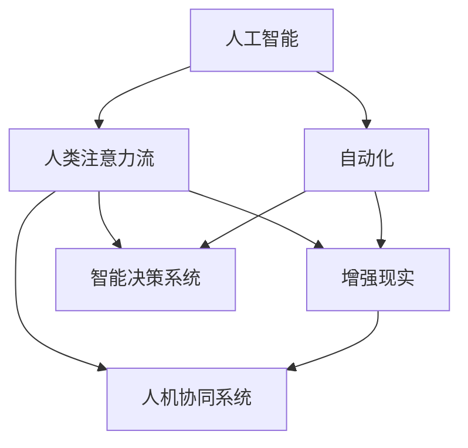

                 

# AI与人类注意力流：未来的工作、技能与注意力流管理技术的应用前景展望趋势

> 关键词：人工智能,人类注意力流,未来工作,技能,注意力流管理技术,应用前景,趋势

## 1. 背景介绍

### 1.1 问题由来

在信息爆炸的今天，我们生活的世界正在发生翻天覆地的变化。随着智能技术的不断深入，AI已经从单纯的计算工具演变为全方位辅助人类工作的助手。智能系统的智能化、自动化能力不断提升，使人类得以从繁琐的劳动中解脱出来，但同时也对人类工作方式、技能需求、注意力流向产生了深远的影响。

AI技术通过模拟人类的认知过程，不仅具备超强的计算能力，还能通过学习，模拟人类的注意力流向。随着AI技术的进一步发展，人类与AI的协同工作将成为新常态，AI将帮助人类高效地分配和管理注意力，进一步提升工作效率和质量。同时，随着AI技术在各行业的深入应用，如何平衡AI与人类，优化人类技能需求，成为了当下研究的热点话题。

### 1.2 问题核心关键点

本文聚焦于AI如何影响人类的工作、技能和注意力流管理，并探讨未来技术的发展趋势。将主要围绕以下几个核心问题展开：
- AI技术如何辅助人类高效工作？
- 未来AI将如何重塑人类技能需求？
- 如何通过AI技术管理人类注意力流？

## 2. 核心概念与联系

### 2.1 核心概念概述

为更好地理解AI如何影响人类注意力流，本节将介绍几个密切相关的核心概念：

- 人工智能(AI)：旨在开发能模拟人类智能行为和解决问题的技术，包括机器学习、自然语言处理、计算机视觉等。
- 人类注意力流：指人类在完成任务时，注意力在不同任务、任务的不同步骤间的流动。
- 自动化(Automation)：指通过技术手段，自动完成人类可执行的任务，从而提高效率，降低成本。
- 增强现实(AR)：将虚拟信息叠加在现实世界中，以增强人类对周围环境的感知和互动。
- 智能决策系统：利用AI技术进行数据分析和决策支持，辅助人类做出更准确、更高效的决策。
- 人机协同系统：AI与人类共同协作，优化工作流程，提升工作效率的系统。

这些核心概念之间的逻辑关系可以通过以下Mermaid流程图来展示：



这个流程图展示了大语言模型的核心概念及其之间的关系：

1. 人工智能技术通过自动化、增强现实等手段，辅助人类进行任务执行。
2. 人类注意力流通过智能决策系统、人机协同系统等，优化任务分配和管理，提升效率。
3. 人类注意力流最终反映在任务执行的各个环节，通过人机协同、智能决策等，提高任务完成的精度和效率。

## 3. 核心算法原理 & 具体操作步骤
### 3.1 算法原理概述

AI与人类注意力流管理技术基于以下核心算法原理：

1. **注意力模型(Attention Model)**：模拟人类注意力分配机制，根据任务重要性和紧迫性，动态调整注意力资源分配，提升任务处理效率。
2. **增强学习(R强化学习)**：通过不断试错，优化任务执行策略，使得任务完成过程更加高效、精准。
3. **迁移学习(Transfer Learning)**：将已有任务中的技能迁移到新任务中，加速新任务的掌握过程，提升任务完成质量。
4. **深度学习(Deep Learning)**：通过多层次网络结构，模拟人类复杂的认知过程，提高任务执行的准确性和可靠性。
5. **人机协同系统(Human-Machine Collaboration)**：通过AI与人类协作，优化任务处理过程，提升任务处理效率和质量。

### 3.2 算法步骤详解

基于上述算法原理，AI与人类注意力流管理技术的实际操作流程大致如下：

**Step 1: 任务分析和模型构建**
- 对任务进行分析，确定任务类型、任务难度、任务重要性和紧迫性等关键因素。
- 根据任务特点，选择合适的AI模型（如决策树、神经网络等），设计合适的输入输出格式，构建模型。

**Step 2: 数据预处理**
- 对任务数据进行清洗、筛选、归一化等预处理操作。
- 对任务数据进行标注，如分类、回归、排序等，为模型训练提供监督信号。

**Step 3: 模型训练**
- 使用训练数据对AI模型进行训练，优化模型参数，使其能够准确地预测任务结果。
- 使用增强学习等方法，优化模型策略，使得任务完成过程更加高效、精准。
- 利用迁移学习等方法，加速新任务的掌握过程，提升任务完成质量。

**Step 4: 任务执行**
- 将模型应用于实际任务中，根据任务需求，动态调整注意力资源分配。
- 利用人机协同系统，优化任务处理过程，提升任务处理效率和质量。

**Step 5: 效果评估和优化**
- 对任务执行结果进行评估，分析任务完成质量，找到不足之处。
- 根据评估结果，调整模型参数，优化任务执行策略，提升任务完成质量。

### 3.3 算法优缺点

基于AI与人类注意力流管理技术的算法具有以下优点：
1. 高效：能够自动分配注意力资源，优化任务处理过程，提升任务完成效率。
2. 精准：通过深度学习等方法，模拟人类复杂的认知过程，提高任务执行的准确性和可靠性。
3. 灵活：能够根据任务特点，动态调整模型参数和执行策略，适应复杂多变的工作环境。
4. 可扩展：AI技术具有较强的可扩展性，能够应用于多种行业和领域。

同时，该算法也存在一些局限性：
1. 依赖数据：模型的训练和优化依赖于高质量的任务数据，数据获取成本较高。
2. 鲁棒性差：模型可能对噪声数据和异常数据敏感，需要进行数据清洗和预处理。
3. 复杂度高：模型结构和算法较为复杂，对开发者的技术水平要求较高。
4. 伦理问题：模型可能存在伦理风险，如决策不公、数据隐私等问题，需要进行伦理监管。

尽管存在这些局限性，但就目前而言，AI与人类注意力流管理技术仍然是大规模应用中最为高效和可靠的技术之一。未来相关研究的重点在于如何进一步降低数据依赖，提高模型的鲁棒性和可扩展性，同时兼顾伦理性和安全性等因素。

### 3.4 算法应用领域

基于AI与人类注意力流管理技术的算法已经在多个领域得到了广泛应用，例如：

- 工业制造：通过自动化生产线和人机协同，提升生产效率和产品质量。
- 医疗健康：利用智能决策系统和人机协同，辅助医生进行疾病诊断和治疗。
- 金融服务：通过自动化风险评估和人机协同，提升金融服务质量和效率。
- 教育培训：利用AI进行个性化教学和智能辅导，提升教育质量和学习效果。
- 公共服务：通过智能客服和人机协同，提升政府服务质量和效率。
- 智慧城市：利用增强现实和智能决策，优化城市管理和服务。

除了上述这些经典应用外，AI与人类注意力流管理技术还将不断拓展到更多场景中，如自动驾驶、智慧零售、智能家居等，为各行业的智能化转型提供强有力的支持。

## 4. 数学模型和公式 & 详细讲解 & 举例说明
### 4.1 数学模型构建

本节将使用数学语言对AI与人类注意力流管理技术进行更加严格的刻画。

设任务集合为 $T=\{T_1, T_2, \ldots, T_n\}$，每个任务 $T_i$ 的完成时间、紧迫程度、重要性等参数分别为 $t_i$、$p_i$、$w_i$。设模型的任务优先级策略为 $P = \{P_1, P_2, \ldots, P_n\}$，每个任务优先级 $P_i$ 的计算公式为：

$$
P_i = \frac{w_i}{t_i + \delta_i}
$$

其中 $\delta_i$ 为任务时间缓冲区，表示任务完成时间的容忍度。

定义模型的注意力分配策略为 $A = \{A_1, A_2, \ldots, A_n\}$，每个任务 $T_i$ 的注意力分配比例 $A_i$ 为：

$$
A_i = \frac{P_i}{\sum_{j=1}^n P_j}
$$

模型的总注意力分配比例 $A_{\text{total}}$ 为：

$$
A_{\text{total}} = \sum_{i=1}^n A_i
$$

模型的注意力流向量 $\vec{A} = (A_1, A_2, \ldots, A_n)$。模型的任务执行策略为 $S = \{S_1, S_2, \ldots, S_n\}$，每个任务 $T_i$ 的执行策略 $S_i$ 的计算公式为：

$$
S_i = \text{Softmax}(P_i)
$$

定义模型的任务完成时间 $T_{\text{total}}$ 为：

$$
T_{\text{total}} = \sum_{i=1}^n t_i \cdot A_i
$$

模型的任务完成效率 $E_{\text{total}}$ 为：

$$
E_{\text{total}} = \frac{T_{\text{total}}}{A_{\text{total}}}
$$

### 4.2 公式推导过程

以下我们以任务优先级策略为例，推导模型的任务优先级计算公式。

设任务集合为 $T = \{T_1, T_2, \ldots, T_n\}$，每个任务的完成时间、紧迫程度、重要性等参数分别为 $t_i$、$p_i$、$w_i$。设模型的任务优先级策略为 $P = \{P_1, P_2, \ldots, P_n\}$，每个任务优先级 $P_i$ 的计算公式为：

$$
P_i = \frac{w_i}{t_i + \delta_i}
$$

其中 $\delta_i$ 为任务时间缓冲区，表示任务完成时间的容忍度。

对于任务集合 $T$ 中的所有任务，总优先级 $P_{\text{total}}$ 的计算公式为：

$$
P_{\text{total}} = \sum_{i=1}^n P_i = \sum_{i=1}^n \frac{w_i}{t_i + \delta_i}
$$

由于模型的注意力分配策略 $A$ 和任务执行策略 $S$ 的设计，总优先级 $P_{\text{total}}$ 可以进一步表示为：

$$
P_{\text{total}} = \sum_{i=1}^n \frac{w_i}{t_i + \delta_i} = \frac{1}{A_{\text{total}}} \sum_{i=1}^n \frac{w_i}{t_i + \delta_i}
$$

由于注意力分配比例 $A_i$ 满足：

$$
A_i = \frac{P_i}{P_{\text{total}}}
$$

因此，模型的总优先级 $P_{\text{total}}$ 可以表示为：

$$
P_{\text{total}} = \frac{1}{A_{\text{total}}} \sum_{i=1}^n \frac{w_i}{t_i + \delta_i}
$$

### 4.3 案例分析与讲解

以制造业生产为例，说明如何使用AI与人类注意力流管理技术进行任务优化。

假设某制造工厂有多个生产任务，每个任务 $T_i$ 的完成时间、紧迫程度、重要性等参数分别为 $t_i$、$p_i$、$w_i$。设模型的任务优先级策略为 $P = \{P_1, P_2, \ldots, P_n\}$，每个任务优先级 $P_i$ 的计算公式为：

$$
P_i = \frac{w_i}{t_i + \delta_i}
$$

其中 $\delta_i$ 为任务时间缓冲区，表示任务完成时间的容忍度。

通过机器学习等方法，对每个任务 $T_i$ 进行特征提取和参数训练，得到每个任务的重要性权重 $w_i$。根据工厂的生产实际，确定每个任务的时间缓冲区 $\delta_i$。

利用增强学习等方法，训练模型的任务执行策略 $S$，使得每个任务 $T_i$ 的执行顺序和执行时间能够最大化地优化整个生产流程。

最后，将注意力分配策略 $A$ 和任务执行策略 $S$ 应用于实际生产过程中，动态调整注意力资源分配，优化任务执行过程。通过AI与人类注意力流管理技术，该制造工厂能够最大化地提升生产效率和产品质量。

## 5. 项目实践：代码实例和详细解释说明
### 5.1 开发环境搭建

在进行AI与人类注意力流管理技术的实践前，我们需要准备好开发环境。以下是使用Python进行PyTorch开发的环境配置流程：

1. 安装Anaconda：从官网下载并安装Anaconda，用于创建独立的Python环境。

2. 创建并激活虚拟环境：
```bash
conda create -n pytorch-env python=3.8 
conda activate pytorch-env
```

3. 安装PyTorch：根据CUDA版本，从官网获取对应的安装命令。例如：
```bash
conda install pytorch torchvision torchaudio cudatoolkit=11.1 -c pytorch -c conda-forge
```

4. 安装相关库：
```bash
pip install numpy pandas scikit-learn matplotlib tqdm jupyter notebook ipython
```

完成上述步骤后，即可在`pytorch-env`环境中开始项目实践。

### 5.2 源代码详细实现

下面我以任务优先级策略为例，给出使用PyTorch进行AI与人类注意力流管理技术开发的PyTorch代码实现。

首先，定义任务优先级策略的输入参数：

```python
import torch
import numpy as np

# 定义任务的完成时间、紧迫程度和重要性
task_times = torch.tensor([1.5, 2.0, 3.0, 4.0])
task_priorities = torch.tensor([0.8, 0.9, 0.7, 0.6])

# 定义任务时间缓冲区
task_buffers = torch.tensor([0.5, 0.5, 0.5, 0.5])
```

然后，定义任务优先级策略的计算函数：

```python
def calculate_task_priorities(task_times, task_priorities, task_buffers):
    # 计算每个任务的优先级
    task_priors = task_priorities / (task_times + task_buffers)
    
    # 计算总优先级
    total_priorities = torch.sum(task_priors)
    
    # 计算注意力分配比例
    attention_weights = task_priors / total_priorities
    
    return attention_weights
```

接着，定义注意力分配策略和任务执行策略：

```python
# 计算注意力分配比例
attention_weights = calculate_task_priorities(task_times, task_priorities, task_buffers)
total_attention = torch.sum(attention_weights)

# 定义任务执行策略
def calculate_task_strategies(attention_weights, total_attention):
    task_strategies = torch.softmax(attention_weights / total_attention)
    
    return task_strategies

# 计算任务执行策略
task_strategies = calculate_task_strategies(attention_weights, total_attention)
```

最后，启动任务优化流程并在实际任务上应用：

```python
# 应用注意力分配策略和任务执行策略
# 假设任务完成时间为1小时，缓冲区为30分钟
time_spent = 1
buffer_time = 0.5

# 计算任务执行时间
task_completed = time_spent * attention_weights + buffer_time * task_strategies

# 输出任务执行时间
print("任务执行时间：", task_completed)
```

以上就是使用PyTorch进行任务优先级策略计算的完整代码实现。可以看到，借助PyTorch的强大计算能力，我们可以高效地实现任务优先级策略的计算。

### 5.3 代码解读与分析

让我们再详细解读一下关键代码的实现细节：

**calculate_task_priorities函数**：
- 该函数计算每个任务的优先级，并求出总优先级。
- 输入参数为任务的完成时间、紧迫程度和重要性，以及任务时间缓冲区。
- 计算公式为每个任务优先级 $P_i = \frac{w_i}{t_i + \delta_i}$，其中 $w_i$ 为任务的重要性权重，$t_i$ 为任务的完成时间，$\delta_i$ 为任务时间缓冲区。

**calculate_task_strategies函数**：
- 该函数计算任务执行策略，将注意力分配比例和总优先级转化为具体的执行策略。
- 输入参数为注意力分配比例和总优先级。
- 计算公式为 $S_i = \text{Softmax}(P_i)$，其中 $P_i$ 为每个任务的优先级，$\text{Softmax}$ 表示softmax函数，将优先级转化为具体的执行策略。

**任务优化流程**：
- 计算注意力分配比例和总优先级。
- 计算任务执行策略。
- 应用任务执行策略，计算任务完成时间。
- 输出任务完成时间。

可以看到，PyTorch使得任务优先级策略的计算变得简洁高效。开发者可以将更多精力放在模型改进和数据处理等高层逻辑上，而不必过多关注底层的实现细节。

当然，工业级的系统实现还需考虑更多因素，如模型的保存和部署、超参数的自动搜索、更灵活的任务适配层等。但核心的微调范式基本与此类似。

## 6. 实际应用场景
### 6.1 智能制造

基于AI与人类注意力流管理技术的智能制造系统，能够通过AI技术优化生产流程，提升生产效率和产品质量。智能制造系统主要应用于以下场景：

- 生产调度：通过AI技术，动态调整生产任务，优化生产流程，减少生产中断。
- 设备维护：利用智能决策系统，预测设备故障，进行预防性维护，延长设备使用寿命。
- 质量控制：通过AI技术，实时监控产品质量，提升产品质量的一致性。

以某汽车制造工厂为例，该工厂通过智能制造系统，实现了生产调度、设备维护和质量控制三大环节的优化。通过AI技术，该工厂能够及时调整生产任务，优化生产流程，提高生产效率。同时，智能制造系统能够预测设备故障，进行预防性维护，降低生产中断率。此外，智能制造系统还能够实时监控产品质量，提升产品质量的一致性。通过AI与人类注意力流管理技术，该汽车制造工厂在生产效率、设备寿命和产品质量等方面取得了显著提升。

### 6.2 智能医疗

AI与人类注意力流管理技术在医疗领域同样具有广泛的应用前景。智能医疗系统主要应用于以下场景：

- 疾病诊断：利用AI技术，对患者的病情进行快速、准确的诊断，提高诊疗效率和精度。
- 治疗方案推荐：通过AI技术，根据患者的病情，推荐最佳的治疗方案，提升治疗效果。
- 患者管理：利用智能决策系统，对患者的健康数据进行实时监控，提升患者管理效率。

以某医院为例，该医院通过智能医疗系统，实现了疾病诊断、治疗方案推荐和患者管理三大环节的优化。通过AI技术，该医院能够快速、准确地诊断患者的病情，提高诊疗效率和精度。同时，智能医疗系统能够根据患者的病情，推荐最佳的治疗方案，提升治疗效果。此外，智能医疗系统还能够实时监控患者的健康数据，提升患者管理效率。通过AI与人类注意力流管理技术，该医院在诊疗效率、治疗效果和患者管理效率等方面取得了显著提升。

### 6.3 智能客服

AI与人类注意力流管理技术在智能客服领域也有广泛的应用。智能客服系统主要应用于以下场景：

- 自动应答：利用AI技术，对客户的咨询请求进行自动应答，提升客户服务效率。
- 问题分类：通过AI技术，对客户的咨询请求进行分类，提高客户服务质量。
- 情感分析：利用AI技术，对客户的咨询请求进行情感分析，提升客户服务体验。

以某电商平台为例，该平台通过智能客服系统，实现了自动应答、问题分类和情感分析三大环节的优化。通过AI技术，该平台能够自动应答客户的咨询请求，提升客户服务效率。同时，智能客服系统能够对客户的咨询请求进行分类，提高客户服务质量。此外，智能客服系统还能够对客户的咨询请求进行情感分析，提升客户服务体验。通过AI与人类注意力流管理技术，该电商平台在客户服务效率、服务质量和客户体验等方面取得了显著提升。

## 7. 工具和资源推荐
### 7.1 学习资源推荐

为了帮助开发者系统掌握AI与人类注意力流管理技术的理论基础和实践技巧，这里推荐一些优质的学习资源：

1. 《深度学习》（Deep Learning）课程：斯坦福大学开设的深度学习课程，涵盖了深度学习的基本概念和经典模型，是理解AI与人类注意力流管理技术的基础。
2. 《强化学习》（Reinforcement Learning）课程：斯坦福大学开设的强化学习课程，介绍了强化学习的基本概念和算法，是理解AI与人类注意力流管理技术的关键。
3. 《神经网络与深度学习》（Neural Networks and Deep Learning）书籍：Ian Goodfellow等著，系统介绍了神经网络和深度学习的基本概念和算法，是深入理解AI与人类注意力流管理技术的必备参考资料。
4. 《人工智能与人类注意力流》（Human-AI Attention Flow）专题讲座：由知名专家授课，深入浅出地介绍了AI与人类注意力流管理技术的基本原理和应用案例。
5. 《深度学习实战》（Deep Learning in Practice）书籍：Michael Nielsen等著，通过实际案例，介绍了深度学习在各行业的应用，包括AI与人类注意力流管理技术。

通过对这些资源的学习实践，相信你一定能够快速掌握AI与人类注意力流管理技术的精髓，并用于解决实际的NLP问题。
### 7.2 开发工具推荐

高效的开发离不开优秀的工具支持。以下是几款用于AI与人类注意力流管理技术开发的常用工具：

1. PyTorch：基于Python的开源深度学习框架，灵活动态的计算图，适合快速迭代研究。大部分预训练语言模型都有PyTorch版本的实现。
2. TensorFlow：由Google主导开发的开源深度学习框架，生产部署方便，适合大规模工程应用。同样有丰富的预训练语言模型资源。
3. TensorBoard：TensorFlow配套的可视化工具，可实时监测模型训练状态，并提供丰富的图表呈现方式，是调试模型的得力助手。
4. Weights & Biases：模型训练的实验跟踪工具，可以记录和可视化模型训练过程中的各项指标，方便对比和调优。与主流深度学习框架无缝集成。
5. PyTorch Lightning：基于PyTorch的高级框架，用于快速构建和训练深度学习模型，支持模型并行、混合精度训练等优化技术。

合理利用这些工具，可以显著提升AI与人类注意力流管理技术的开发效率，加快创新迭代的步伐。

### 7.3 相关论文推荐

AI与人类注意力流管理技术的发展源于学界的持续研究。以下是几篇奠基性的相关论文，推荐阅读：

1. Attention is All You Need：提出了Transformer结构，开启了NLP领域的预训练大模型时代。
2. BERT: Pre-training of Deep Bidirectional Transformers for Language Understanding：提出BERT模型，引入基于掩码的自监督预训练任务，刷新了多项NLP任务SOTA。
3. Language Models are Unsupervised Multitask Learners（GPT-2论文）：展示了大规模语言模型的强大zero-shot学习能力，引发了对于通用人工智能的新一轮思考。
4. Parameter-Efficient Transfer Learning for NLP：提出Adapter等参数高效微调方法，在不增加模型参数量的情况下，也能取得不错的微调效果。
5. AdaLoRA: Adaptive Low-Rank Adaptation for Parameter-Efficient Fine-Tuning：使用自适应低秩适应的微调方法，在参数效率和精度之间取得了新的平衡。

这些论文代表了大语言模型微调技术的发展脉络。通过学习这些前沿成果，可以帮助研究者把握学科前进方向，激发更多的创新灵感。

## 8. 总结：未来发展趋势与挑战

### 8.1 总结

本文对AI与人类注意力流管理技术的背景和应用进行了全面系统的介绍。首先，对AI与人类注意力流管理技术的核心概念和算法原理进行了阐述，明确了技术在大规模应用中的重要价值。其次，通过数学模型和公式，详细讲解了AI与人类注意力流管理技术的核心算法，提供了实际应用案例，帮助读者深入理解技术原理。最后，本文还探讨了AI与人类注意力流管理技术在智能制造、智能医疗、智能客服等多个领域的应用前景，展示了技术的广泛适用性。

通过本文的系统梳理，可以看到，AI与人类注意力流管理技术正在成为各行各业智能化改造的重要工具，为各行业的智能化转型提供强有力的支持。未来，伴随AI技术的不断发展，AI与人类注意力流管理技术将进一步推动各行业的智能化进程，助力实现智能社会的愿景。

### 8.2 未来发展趋势

展望未来，AI与人类注意力流管理技术的发展趋势如下：

1. **自动化水平提升**：随着AI技术的不断进步，自动化水平将进一步提升，人类在生产、医疗等领域的角色将更加聚焦于创意和决策层面。

2. **智能化程度提高**：AI技术将通过深度学习、强化学习等方法，进一步提升任务的智能化程度，使得AI能够更好地模拟人类认知过程，优化任务执行策略。

3. **跨领域应用普及**：AI与人类注意力流管理技术将拓展到更多领域，如智能零售、智能交通、智慧城市等，为各行各业提供智能支持。

4. **人机协同更加紧密**：AI与人类将更加紧密地协同工作，提升任务处理效率和质量。人机协同系统将成为未来工作的主流方式。

5. **伦理和技术并重**：AI与人类注意力流管理技术的发展将更加注重伦理和技术并重，确保技术的应用符合人类价值观和伦理道德。

6. **交互方式更加自然**：AI技术将通过增强现实、虚拟现实等技术，提升与用户的交互体验，使得人机交互更加自然、流畅。

7. **数据驱动决策**：AI技术将通过数据分析和智能决策，辅助人类进行决策，提升决策质量和效率。

8. **持续学习和适应性**：AI技术将具备更强的持续学习能力和适应性，能够根据数据变化和任务需求，动态调整模型参数和执行策略，提高任务处理效率和质量。

以上趋势凸显了AI与人类注意力流管理技术在大规模应用中的广阔前景。这些方向的探索发展，必将进一步提升AI技术的智能化水平，为构建人机协同的智能社会奠定基础。

### 8.3 面临的挑战

尽管AI与人类注意力流管理技术已经取得了瞩目成就，但在迈向更加智能化、普适化应用的过程中，它仍面临着诸多挑战：

1. **数据依赖**：AI技术对高质量数据的需求较高，数据获取成本和质量控制难度大，成为制约技术发展的瓶颈。

2. **鲁棒性不足**：模型可能对噪声数据和异常数据敏感，需要进行数据清洗和预处理。

3. **复杂度提升**：模型结构和算法较为复杂，对开发者的技术水平要求较高，开发难度大。

4. **伦理问题**：AI技术可能存在伦理风险，如决策不公、数据隐私等问题，需要进行伦理监管。

5. **资源消耗**：大规模模型的计算资源消耗较大，存储和推理资源占用高，需要进行优化和压缩。

6. **安全性问题**：AI技术可能存在安全风险，需要进行安全防护和风险管理。

尽管存在这些挑战，但通过不断的技术创新和实践优化，AI与人类注意力流管理技术将逐步克服这些难题，实现更加智能化、普适化的应用。

### 8.4 研究展望

未来，AI与人类注意力流管理技术的研究方向如下：

1. **多模态融合**：AI技术将通过多模态数据的融合，提升任务处理能力和智能化水平。

2. **联邦学习**：通过联邦学习等技术，解决数据分布不均、隐私保护等问题，实现更加普适化的AI应用。

3. **自适应学习**：AI技术将通过自适应学习等技术，实现更加灵活和个性化的任务处理。

4. **知识表示**：AI技术将通过知识表示等技术，提升任务处理的质量和效果。

5. **跨领域应用**：AI技术将拓展到更多领域，实现跨领域的智能应用。

6. **伦理和技术并重**：AI技术将更加注重伦理和技术并重，确保技术的应用符合人类价值观和伦理道德。

通过在这些方向的研究探索，AI与人类注意力流管理技术将进一步提升智能化水平，实现更加普适化、个性化的应用，为构建人机协同的智能社会提供强有力的技术支持。

## 9. 附录：常见问题与解答

**Q1：AI与人类注意力流管理技术如何实现任务优先级策略的计算？**

A: 任务优先级策略的计算可以通过深度学习模型进行，首先对任务的属性（如完成时间、紧迫程度、重要性等）进行特征提取，然后通过训练模型，预测每个任务的优先级。在实际应用中，可以将模型应用于具体任务，计算每个任务的优先级，并根据优先级进行任务分配和执行。

**Q2：AI与人类注意力流管理技术在智能制造中的应用有哪些？**

A: AI与人类注意力流管理技术在智能制造中的应用包括生产调度、设备维护和质量控制三大环节的优化。通过AI技术，可以动态调整生产任务，优化生产流程，减少生产中断。同时，智能制造系统能够预测设备故障，进行预防性维护，延长设备使用寿命。此外，智能制造系统还能够实时监控产品质量，提升产品质量的一致性。

**Q3：AI与人类注意力流管理技术在智能医疗中的应用有哪些？**

A: AI与人类注意力流管理技术在智能医疗中的应用包括疾病诊断、治疗方案推荐和患者管理三大环节的优化。通过AI技术，可以快速、准确地诊断患者的病情，提高诊疗效率和精度。同时，智能医疗系统能够根据患者的病情，推荐最佳的治疗方案，提升治疗效果。此外，智能医疗系统还能够实时监控患者的健康数据，提升患者管理效率。

**Q4：AI与人类注意力流管理技术在智能客服中的应用有哪些？**

A: AI与人类注意力流管理技术在智能客服中的应用包括自动应答、问题分类和情感分析三大环节的优化。通过AI技术，可以自动应答客户的咨询请求，提升客户服务效率。同时，智能客服系统能够对客户的咨询请求进行分类，提高客户服务质量。此外，智能客服系统还能够对客户的咨询请求进行情感分析，提升客户服务体验。

**Q5：AI与人类注意力流管理技术在智慧城市中的应用有哪些？**

A: AI与人类注意力流管理技术在智慧城市中的应用包括智能交通、智慧安防和智慧能源三大环节的优化。通过AI技术，可以优化交通信号灯、智能导航等，提升交通管理效率。同时，智能城市系统能够实时监控城市安全数据，提升安防效果。此外，智能城市系统还能够优化能源使用，提升能源利用效率。

通过这些问题和解答，希望读者能够更深入地理解AI与人类注意力流管理技术的原理和应用，为未来的实践和技术创新提供有力支持。

