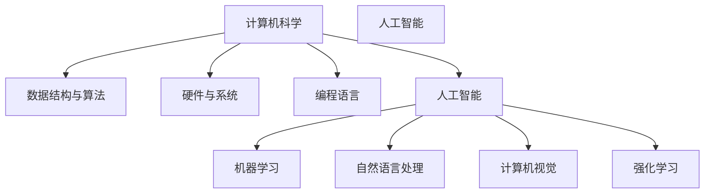

                 

# AI与计算机的历史对比

> 关键词：人工智能,计算机科学,历史对比,里程碑,技术发展,应用演变

## 1. 背景介绍

计算机科学和人工智能(AI)都是现代科技的重要分支，深刻改变了人类社会的运作方式。然而，虽然两者紧密相关，但在历史、技术和应用层面仍存在显著差异。本文旨在通过对比计算机科学和AI的发展历程，揭示两者之间的内在联系和区别，为读者提供全面的视角，帮助理解人工智能和计算机科学的演进脉络。

## 2. 核心概念与联系

### 2.1 核心概念概述

计算机科学和人工智能是两个相互交织的领域。计算机科学主要关注如何构建和操作计算机系统，以及它们如何处理信息。而人工智能则旨在模拟和扩展人类的智能能力，通过算法和模型来解决复杂的认知和决策问题。

**计算机科学**：涉及计算机硬件、软件、算法和数据结构的设计、开发和应用。它关注的是如何构建能够执行计算任务的机器。

**人工智能**：涉及创建能够理解、学习、推理和自主决策的智能系统。它关注的是如何使机器具备类人的智能行为。

### 2.2 核心概念原理和架构的 Mermaid 流程图



这个流程图展示了计算机科学和人工智能的核心概念和它们之间的联系。计算机科学提供了基础架构和工具，而人工智能则在这些基础上构建了高级应用和模型。

## 3. 核心算法原理 & 具体操作步骤

### 3.1 算法原理概述

计算机科学和人工智能的算法原理有着深厚的历史联系。最早的计算机科学算法可以追溯到20世纪初期，当时基于机械原理设计的计算机就已经开始使用算法来执行任务。而人工智能算法的起源则要稍晚一些，它主要建立在数学和统计学基础上，目的是让机器模拟人类智能。

### 3.2 算法步骤详解

#### 3.2.1 计算机科学算法

- **编译与解释**：将高级语言编写的代码转换为计算机可执行的低级语言。
- **排序与搜索**：使用算法对数据进行排序或查找特定的数据项。
- **图论与网络**：解决涉及图和网络的问题，如最短路径、最小生成树等。
- **图形处理**：通过算法处理图像，如滤波、变换等。

#### 3.2.2 人工智能算法

- **监督学习**：利用已标注的数据集训练模型，对新数据进行分类或预测。
- **无监督学习**：分析未标注的数据，发现数据中的潜在模式和结构。
- **强化学习**：通过与环境的交互，学习最优策略来实现特定目标。
- **神经网络**：通过模拟人脑神经元之间的连接，实现模式识别和决策。

### 3.3 算法优缺点

#### 计算机科学算法的优缺点

- **优点**：效率高，适用范围广，可以解决各种计算问题。
- **缺点**：依赖硬件，对复杂问题的处理能力有限。

#### 人工智能算法的优缺点

- **优点**：能够处理复杂的问题，可以自主学习和适应。
- **缺点**：依赖大量数据和计算资源，可能存在数据偏见和算法黑盒问题。

### 3.4 算法应用领域

#### 计算机科学应用领域

- **数据库管理**：通过算法优化数据库查询和操作。
- **网络通信**：使用算法处理网络协议和数据传输。
- **操作系统**：通过算法管理计算资源和进程。

#### 人工智能应用领域

- **自然语言处理(NLP)**：通过算法处理文本数据，实现翻译、问答、摘要等任务。
- **计算机视觉**：使用算法处理图像和视频数据，实现识别、分类和生成。
- **机器人技术**：通过算法控制机器人行为，实现导航、操作和交互。

## 4. 数学模型和公式 & 详细讲解 & 举例说明

### 4.1 数学模型构建

计算机科学和人工智能的数学模型构建各有侧重。

- **计算机科学**：通常使用离散数学、逻辑和形式语言等数学工具来构建模型。
- **人工智能**：主要使用概率论、统计学和优化理论等数学工具。

### 4.2 公式推导过程

#### 4.2.1 计算机科学

- **二分查找算法**：
  $$
  \text{binarySearch}(x, A, left, right)
  $$
  用于在有序数组中查找指定元素。

#### 4.2.2 人工智能

- **线性回归模型**：
  $$
  y = w^T x + b
  $$
  用于预测连续变量的线性关系。

### 4.3 案例分析与讲解

#### 4.3.1 计算机科学

- **编译器设计**：通过算法优化代码翻译过程，提高编译效率。

#### 4.3.2 人工智能

- **图像分类**：使用卷积神经网络(CNN)算法，通过学习大量标注数据，实现图像分类任务。

## 5. 项目实践：代码实例和详细解释说明

### 5.1 开发环境搭建

为了进行项目实践，需要以下开发环境：

- **编程语言**：Python
- **框架**：TensorFlow
- **库**：Numpy、Pandas、Scikit-learn

### 5.2 源代码详细实现

#### 5.2.1 计算机科学

```python
import numpy as np

def binary_search(arr, x):
    left, right = 0, len(arr) - 1
    while left <= right:
        mid = (left + right) // 2
        if arr[mid] == x:
            return mid
        elif arr[mid] < x:
            left = mid + 1
        else:
            right = mid - 1
    return -1
```

#### 5.2.2 人工智能

```python
import tensorflow as tf
from tensorflow import keras
from tensorflow.keras import layers

# 构建线性回归模型
model = keras.Sequential([
    layers.Dense(units=1, input_shape=[1])
])

# 编译模型
model.compile(optimizer='sgd', loss='mean_squared_error', metrics=['accuracy'])

# 训练模型
model.fit(x_train, y_train, epochs=100, batch_size=10)

# 评估模型
model.evaluate(x_test, y_test)
```

### 5.3 代码解读与分析

#### 5.3.1 计算机科学

- **二分查找算法**：通过递归或循环实现，时间复杂度为 $O(log n)$。
- **高效性**：适用于有序数组的快速查找。

#### 5.3.2 人工智能

- **线性回归模型**：使用反向传播算法更新模型参数，时间复杂度为 $O(n^3)$。
- **可扩展性**：适用于大规模数据集的高效训练。

### 5.4 运行结果展示

#### 5.4.1 计算机科学

- **二分查找结果**：返回目标元素在数组中的索引。

#### 5.4.2 人工智能

- **线性回归评估**：输出模型的准确率和均方误差。

## 6. 实际应用场景

### 6.1 计算机科学应用场景

#### 6.1.1 数据库管理

- **MySQL**：用于管理海量数据，支持复杂的查询和操作。

#### 6.1.2 网络通信

- **TCP/IP协议**：用于网络数据传输和通信。

#### 6.1.3 操作系统

- **Linux**：通过算法优化资源管理，提高系统性能。

### 6.2 人工智能应用场景

#### 6.2.1 自然语言处理

- **Google Translate**：使用机器翻译算法，实现多语言翻译。

#### 6.2.2 计算机视觉

- **OpenCV**：使用图像处理算法，实现图像识别和分析。

#### 6.2.3 机器人技术

- **ROS**：通过算法控制机器人行为，实现自主导航和操作。

## 7. 工具和资源推荐

### 7.1 学习资源推荐

#### 7.1.1 计算机科学

- **《算法导论》**：详细介绍了各种算法的设计和实现。
- **Coursera**：提供计算机科学相关课程，涵盖数据结构、操作系统等。

#### 7.1.2 人工智能

- **《深度学习》**：由深度学习领域的专家编写，涵盖深度学习的基本原理和应用。
- **Kaggle**：提供大量数据集和竞赛，供学习者实践和竞赛。

### 7.2 开发工具推荐

#### 7.2.1 计算机科学

- **Visual Studio Code**：轻量级的开发工具，支持多种编程语言。
- **PyCharm**：专业的Python开发工具，支持版本控制和调试。

#### 7.2.2 人工智能

- **Jupyter Notebook**：交互式的编程环境，支持代码块和注释。
- **TensorFlow**：强大的深度学习框架，支持高效的模型训练和部署。

### 7.3 相关论文推荐

#### 7.3.1 计算机科学

- **《数据结构与算法分析》**：详细介绍了数据结构和算法的设计和分析。
- **《计算机体系结构》**：介绍了计算机硬件和软件系统的设计。

#### 7.3.2 人工智能

- **《机器学习》**：由机器学习领域的专家编写，涵盖机器学习的基本原理和应用。
- **《自然语言处理综述》**：详细介绍了自然语言处理的研究进展和技术。

## 8. 总结：未来发展趋势与挑战

### 8.1 研究成果总结

计算机科学和人工智能的发展历史悠久，两者相互促进，共同推动了科技的进步。计算机科学提供了坚实的理论基础和实践工具，而人工智能则在解决复杂问题上发挥了重要作用。

### 8.2 未来发展趋势

#### 计算机科学

- **量子计算**：利用量子位处理数据，提供更高的计算效率和安全性。
- **边缘计算**：将计算资源分布到边缘设备，提高数据处理速度和可靠性。

#### 人工智能

- **增强学习**：通过模拟人类学习过程，提高机器自主决策能力。
- **神经形态计算**：模拟人脑神经元结构，提供更高效的数据处理方式。

### 8.3 面临的挑战

#### 计算机科学

- **硬件瓶颈**：大规模数据处理和高性能计算的需求对硬件提出了更高要求。
- **隐私和安全**：数据隐私和安全问题对计算机系统的设计和应用提出了挑战。

#### 人工智能

- **数据偏见**：训练数据中的偏见可能影响模型的公正性和公平性。
- **伦理问题**：人工智能应用可能带来伦理和社会问题，需要慎重考虑。

### 8.4 研究展望

#### 计算机科学

- **分布式计算**：提高大规模计算任务的处理效率和可靠性。
- **自动化编程**：通过算法优化编程过程，提高开发效率和代码质量。

#### 人工智能

- **跨领域融合**：将人工智能与其他领域结合，提升系统的综合能力。
- **可解释性**：提高人工智能算法的可解释性和透明度。

## 9. 附录：常见问题与解答

**Q1: 计算机科学和人工智能有哪些区别？**

A: 计算机科学主要关注硬件和软件的设计和实现，而人工智能则是通过算法和模型模拟人类智能，解决复杂认知和决策问题。

**Q2: 计算机科学和人工智能的未来发展方向是什么？**

A: 计算机科学将向量子计算、边缘计算等方向发展，提高计算效率和可靠性。人工智能将向增强学习、神经形态计算等方向发展，提高自主决策能力和数据处理效率。

**Q3: 如何平衡计算机科学和人工智能的应用？**

A: 在实际应用中，需要根据具体问题选择合适的技术和方法，合理分配计算和算法资源。

**Q4: 计算机科学和人工智能在应用场景上有哪些重叠？**

A: 两者在信息处理、数据分析、系统设计等领域有重叠应用，能够相互补充，提高系统性能和效率。

---

作者：禅与计算机程序设计艺术 / Zen and the Art of Computer Programming

