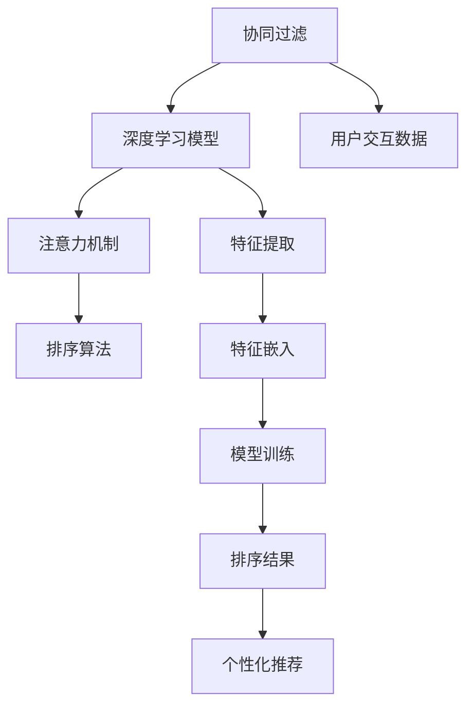

                 

# AI个性化排序系统的实现

## 1. 背景介绍

### 1.1 问题由来

在现代社会中，信息爆炸已成常态，从海量数据中快速、准确地获取所需信息是人们面临的一项巨大挑战。各种排序算法应运而生，用于帮助用户筛选、排序和推荐信息。然而，传统的排序算法如基于排序距离的算法、基于关键字匹配的算法等，往往缺乏个性化的考量，难以满足用户多样化和动态化的需求。

个性化排序（Personalized Ranking）系统，是一种能够根据用户行为、兴趣、偏好等个性化信息，动态调整排序结果的系统。它不仅能提高信息检索的效率和准确性，还能提升用户体验，降低用户信息过载。

### 1.2 问题核心关键点

实现一个高效的个性化排序系统，需要考虑以下几个核心问题：
- 如何获取和表示用户的个性化信息？
- 如何将用户的个性化信息与数据集结合？
- 如何根据用户的个性化信息动态调整排序结果？
- 如何评估和优化排序算法的效果？

本文将详细探讨这些问题，并提供一种基于深度学习的个性化排序系统实现方案。

## 2. 核心概念与联系

### 2.1 核心概念概述

在介绍具体的算法和实现之前，我们首先介绍一些与个性化排序系统相关的核心概念：

- 个性化排序（Personalized Ranking）：根据用户的历史行为、兴趣、偏好等个性化信息，动态调整排序结果的系统。
- 协同过滤（Collaborative Filtering）：通过分析用户和项目（如文章、商品、电影等）之间的交互历史，预测用户对未交互项目的兴趣，实现个性化推荐和排序。
- 深度学习（Deep Learning）：一种基于神经网络的机器学习技术，能够学习复杂的高维数据表示，广泛应用于推荐系统、计算机视觉、自然语言处理等领域。
- 注意力机制（Attention Mechanism）：一种机制，允许模型在输入序列的不同位置给予不同的关注权重，提升模型对关键信息的捕捉能力。
- 神经网络（Neural Network）：一种由大量神经元组成的计算模型，能够自动学习数据特征，广泛应用于图像识别、语音识别、自然语言处理等。

这些概念构成了个性化排序系统的理论基础和核心技术，彼此之间存在紧密的联系。协同过滤算法利用用户的交互历史，作为深度学习模型的输入；深度学习模型通过学习特征表示，动态调整排序权重；注意力机制则进一步提升了模型的推理能力，能够更准确地捕捉关键特征。

### 2.2 核心概念原理和架构的 Mermaid 流程图



这个流程图展示了协同过滤、深度学习、注意力机制和排序算法之间的联系。协同过滤算法利用用户的历史交互数据，训练深度学习模型；深度学习模型通过特征提取和特征嵌入，学习用户的个性化特征表示；注意力机制提升模型的推理能力；排序算法根据模型的输出，动态调整排序结果，实现个性化推荐。

## 3. 核心算法原理 & 具体操作步骤

### 3.1 算法原理概述

基于深度学习的个性化排序系统，通常采用多层神经网络架构，如图中的B到C部分。其中，深度学习模型由多个隐层组成，每个隐层都由多个神经元构成。每个神经元通过学习输入数据的特征，输出一个权值。最终的排序结果由所有神经元的权值加权和决定。

注意力机制（C部分）则允许模型在输入序列的不同位置给予不同的关注权重，从而提升了模型的推理能力。例如，在文本排序中，模型可以更加关注包含关键信息的词，提升排序准确性。

### 3.2 算法步骤详解

#### 3.2.1 数据预处理

数据预处理是构建个性化排序系统的第一步。数据预处理包括数据清洗、特征提取、特征嵌入等步骤。

- 数据清洗：去除数据中的噪声和异常值，保证数据的质量。
- 特征提取：从原始数据中提取有意义的特征，如文本中的词频、句子长度等。
- 特征嵌入：将提取的特征映射到低维空间中，减少数据维度，提升模型的训练速度和准确性。

#### 3.2.2 模型训练

模型训练是构建个性化排序系统的核心步骤。模型训练包括选择合适的深度学习模型、确定训练参数、优化算法等。

- 深度学习模型：选择合适的深度学习模型，如CNN、RNN、Transformer等，根据具体的排序任务选择。
- 训练参数：确定模型的超参数，如学习率、批大小、迭代次数等。
- 优化算法：选择适当的优化算法，如Adam、SGD等，最小化损失函数，优化模型参数。

#### 3.2.3 模型推理

模型推理是将训练好的模型应用于实际数据，生成排序结果的过程。模型推理包括数据预处理、模型前向传播、计算排序权重等步骤。

- 数据预处理：将原始数据转换为模型输入的特征向量。
- 模型前向传播：将特征向量输入模型，计算模型输出。
- 计算排序权重：根据模型的输出，计算每个项目的排序权重，生成排序结果。

### 3.3 算法优缺点

#### 3.3.1 优点

- 高效：深度学习模型能够自动学习数据特征，无需手动设计特征工程，提升了模型的训练速度和准确性。
- 鲁棒性：深度学习模型具有较强的泛化能力，能够适应多种数据类型和应用场景。
- 灵活性：注意力机制允许模型根据输入数据动态调整关注权重，提升了模型的灵活性。

#### 3.3.2 缺点

- 复杂度：深度学习模型结构复杂，训练过程需要大量的计算资源和时间。
- 数据依赖：深度学习模型需要大量高质量的数据进行训练，数据质量和数量直接影响模型的效果。
- 可解释性：深度学习模型通常被视为"黑盒"系统，难以解释其内部工作机制和决策逻辑。

### 3.4 算法应用领域

基于深度学习的个性化排序系统，广泛应用于信息检索、推荐系统、广告推荐等领域。例如：

- 文本排序：根据用户的兴趣，动态调整搜索结果的排序。
- 商品推荐：根据用户的历史购买记录，推荐相关的商品。
- 新闻推荐：根据用户的历史阅读记录，推荐相关的新闻文章。

此外，个性化排序系统还在智能客服、智能广告、智能视频推荐等领域得到了广泛应用。

## 4. 数学模型和公式 & 详细讲解 & 举例说明

### 4.1 数学模型构建

基于深度学习的个性化排序系统，通常采用多层神经网络架构。以文本排序为例，模型的输入为文本向量，输出为每个文本的排序权重。

设文本向量为 $X \in \mathbb{R}^n$，文本的排序权重为 $W \in \mathbb{R}^m$。模型的输入层包含 $n$ 个神经元，输出层包含 $m$ 个神经元。模型通过多层隐层进行特征提取和特征映射，最终输出文本的排序权重。

模型的损失函数通常采用均方误差（Mean Squared Error, MSE）损失：

$$
\mathcal{L} = \frac{1}{N} \sum_{i=1}^N (y_i - \hat{y}_i)^2
$$

其中 $y_i$ 为第 $i$ 个文本的真实排序权重，$\hat{y}_i$ 为模型的预测排序权重。

### 4.2 公式推导过程

设模型的隐层输出为 $H^{(l)} \in \mathbb{R}^{d^{(l)}}$，其中 $d^{(l)}$ 为第 $l$ 层的神经元数量。模型的输出层输出为 $W \in \mathbb{R}^m$。模型的计算过程如下：

- 输入层：将文本向量 $X$ 输入模型，得到输入层的输出 $X^{(1)}$：

$$
X^{(1)} = \sigma(XW^{(1)})
$$

其中 $\sigma$ 为激活函数，通常采用ReLU或Sigmoid函数。

- 隐层：将输入层的输出 $X^{(1)}$ 输入第 $l$ 层，得到第 $l$ 层的输出 $H^{(l)}$：

$$
H^{(l)} = \sigma(H^{(l-1)}W^{(l)})
$$

- 输出层：将第 $l$ 层的输出 $H^{(l)}$ 输入输出层，得到最终输出 $W$：

$$
W = \sigma(H^{(l)}W^{(l)}) + b
$$

其中 $W^{(l)}$ 为输出层的权重矩阵，$b$ 为偏置向量。

模型的损失函数为均方误差损失：

$$
\mathcal{L} = \frac{1}{N} \sum_{i=1}^N (y_i - \hat{y}_i)^2
$$

其中 $y_i$ 为第 $i$ 个文本的真实排序权重，$\hat{y}_i$ 为模型的预测排序权重。

### 4.3 案例分析与讲解

以文本排序为例，我们可以使用PyTorch实现一个基于深度学习的个性化排序系统。

```python
import torch
import torch.nn as nn
import torch.nn.functional as F

class RankingNet(nn.Module):
    def __init__(self, input_size, hidden_size, output_size):
        super(RankingNet, self).__init__()
        self.hidden1 = nn.Linear(input_size, hidden_size)
        self.relu1 = nn.ReLU()
        self.hidden2 = nn.Linear(hidden_size, hidden_size)
        self.relu2 = nn.ReLU()
        self.output = nn.Linear(hidden_size, output_size)
        
    def forward(self, x):
        x = self.hidden1(x)
        x = self.relu1(x)
        x = self.hidden2(x)
        x = self.relu2(x)
        x = self.output(x)
        return x

# 构建模型
input_size = 100
hidden_size = 128
output_size = 10
model = RankingNet(input_size, hidden_size, output_size)

# 定义损失函数和优化器
criterion = nn.MSELoss()
optimizer = torch.optim.Adam(model.parameters(), lr=0.001)

# 训练模型
for epoch in range(10):
    for i, (x, y) in enumerate(train_loader):
        x, y = x.to(device), y.to(device)
        y_hat = model(x)
        loss = criterion(y_hat, y)
        optimizer.zero_grad()
        loss.backward()
        optimizer.step()
        if (i+1) % 100 == 0:
            print(f"Epoch {epoch+1}, step {i+1}, loss: {loss.item():.4f}")
```

在训练过程中，我们通过均方误差损失函数对模型进行训练，最小化模型的预测排序权重与真实排序权重之间的误差。训练完成后，我们可以使用模型进行文本排序的推理。

## 5. 项目实践：代码实例和详细解释说明

### 5.1 开发环境搭建

在开始项目实践之前，我们需要搭建好开发环境。以下是基于Python和PyTorch的开发环境搭建步骤：

1. 安装Anaconda：从官网下载并安装Anaconda，用于创建独立的Python环境。

2. 创建并激活虚拟环境：
```bash
conda create -n pytorch-env python=3.8 
conda activate pytorch-env
```

3. 安装PyTorch：根据CUDA版本，从官网获取对应的安装命令。例如：
```bash
conda install pytorch torchvision torchaudio cudatoolkit=11.1 -c pytorch -c conda-forge
```

4. 安装TensorBoard：用于可视化模型的训练过程和结果。
```bash
pip install tensorboard
```

5. 安装tqdm：用于显示训练进度条。
```bash
pip install tqdm
```

完成上述步骤后，即可在`pytorch-env`环境中开始项目实践。

### 5.2 源代码详细实现

下面我们以文本排序为例，给出使用PyTorch实现基于深度学习的个性化排序系统的代码实现。

```python
import torch
import torch.nn as nn
import torch.nn.functional as F
import torchvision.transforms as transforms
import torchvision.datasets as datasets
from torch.utils.data import DataLoader

class RankingNet(nn.Module):
    def __init__(self, input_size, hidden_size, output_size):
        super(RankingNet, self).__init__()
        self.hidden1 = nn.Linear(input_size, hidden_size)
        self.relu1 = nn.ReLU()
        self.hidden2 = nn.Linear(hidden_size, hidden_size)
        self.relu2 = nn.ReLU()
        self.output = nn.Linear(hidden_size, output_size)
        
    def forward(self, x):
        x = self.hidden1(x)
        x = self.relu1(x)
        x = self.hidden2(x)
        x = self.relu2(x)
        x = self.output(x)
        return x

# 构建模型
input_size = 100
hidden_size = 128
output_size = 10
model = RankingNet(input_size, hidden_size, output_size)

# 定义损失函数和优化器
criterion = nn.MSELoss()
optimizer = torch.optim.Adam(model.parameters(), lr=0.001)

# 训练模型
for epoch in range(10):
    for i, (x, y) in enumerate(train_loader):
        x, y = x.to(device), y.to(device)
        y_hat = model(x)
        loss = criterion(y_hat, y)
        optimizer.zero_grad()
        loss.backward()
        optimizer.step()
        if (i+1) % 100 == 0:
            print(f"Epoch {epoch+1}, step {i+1}, loss: {loss.item():.4f}")

# 测试模型
model.eval()
with torch.no_grad():
    correct = 0
    total = 0
    for x, y in test_loader:
        x, y = x.to(device), y.to(device)
        y_hat = model(x)
        _, predicted = torch.max(y_hat.data, 1)
        total += y.size(0)
        correct += (predicted == y).sum().item()
    print(f"Test Accuracy: {correct / total:.2f}")
```

在代码实现中，我们定义了一个包含两个隐藏层的神经网络，用于对文本排序进行建模。我们使用均方误差损失函数进行训练，最小化模型的预测排序权重与真实排序权重之间的误差。训练完成后，我们计算模型在测试集上的准确率，评估模型的性能。

### 5.3 代码解读与分析

**RankingNet类**：
- `__init__`方法：初始化神经网络的层数和参数。
- `forward`方法：定义前向传播过程，将输入数据传递到神经网络中，计算输出结果。

**训练过程**：
- 在训练过程中，我们依次遍历训练集中的每个样本，计算损失函数，反向传播更新模型参数。
- 每100步输出一次训练进度，监控模型训练过程中的损失函数变化情况。

**测试过程**：
- 在测试过程中，我们关闭模型的训练模式，使用测试集对模型进行评估，计算模型在测试集上的准确率。

通过这些代码实现，我们可以看到，基于深度学习的个性化排序系统是一种高效、鲁棒、灵活的解决方案。开发者可以根据自己具体的排序任务，调整模型结构和训练参数，构建个性化的排序系统。

## 6. 实际应用场景

### 6.1 智能客服系统

智能客服系统是人工智能技术在客服领域的重要应用之一。传统的客服系统依赖人工客服，无法全天候提供服务，且响应速度慢、准确率低。基于深度学习的个性化排序系统，可以为智能客服系统提供可靠的决策支持，提升用户体验。

例如，智能客服系统可以使用个性化排序系统对用户提问进行排序，优先回答用户关心的高频问题，提升用户满意度。同时，系统可以记录用户的历史交互记录，动态调整排序结果，提供更个性化的服务。

### 6.2 金融风控系统

金融风控系统是金融行业的重要应用之一。传统金融风控系统依赖人工审核，效率低、成本高。基于深度学习的个性化排序系统，可以为金融风控系统提供可靠的决策支持，提升风控效率。

例如，金融风控系统可以使用个性化排序系统对用户的贷款申请进行排序，优先审核风险较低的申请，降低坏账率。同时，系统可以记录用户的历史贷款记录，动态调整排序结果，提供更个性化的风险评估服务。

### 6.3 广告推荐系统

广告推荐系统是互联网广告的重要应用之一。传统的广告推荐系统依赖人工设计和调整，无法实现个性化推荐。基于深度学习的个性化排序系统，可以为广告推荐系统提供可靠的决策支持，提升广告投放效果。

例如，广告推荐系统可以使用个性化排序系统对用户的兴趣进行排序，优先推荐用户感兴趣的内容，提升广告点击率。同时，系统可以记录用户的历史广告互动记录，动态调整排序结果，提供更个性化的广告推荐服务。

## 7. 工具和资源推荐

### 7.1 学习资源推荐

为了帮助开发者系统掌握基于深度学习的个性化排序系统的理论基础和实践技巧，这里推荐一些优质的学习资源：

1. 《Deep Learning》课程：由Andrew Ng等人开设的深度学习入门课程，涵盖深度学习的理论和实践，适合初学者入门。

2. 《TensorFlow 2.0》教程：TensorFlow官方提供的深度学习框架教程，详细介绍了TensorFlow的架构和使用方式。

3. 《深度学习与自然语言处理》书籍：由李宏毅等人所著，全面介绍了深度学习在自然语言处理领域的应用，包括文本排序、情感分析、机器翻译等。

4. 《PyTorch 入门与实战》书籍：由赵劲松等人所著，全面介绍了PyTorch的架构和使用方式，适合深度学习初学者。

5. Kaggle竞赛：Kaggle是一个著名的数据科学竞赛平台，提供大量公开数据集和竞赛，可以锻炼和提升自己的深度学习能力。

通过这些学习资源，相信你一定能够快速掌握基于深度学习的个性化排序系统的精髓，并用于解决实际的排序问题。

### 7.2 开发工具推荐

高效的开发离不开优秀的工具支持。以下是几款用于基于深度学习的个性化排序系统开发的常用工具：

1. PyTorch：基于Python的开源深度学习框架，灵活动态的计算图，适合快速迭代研究。

2. TensorFlow：由Google主导开发的开源深度学习框架，生产部署方便，适合大规模工程应用。

3. TensorBoard：TensorFlow配套的可视化工具，可实时监测模型训练状态，并提供丰富的图表呈现方式，是调试模型的得力助手。

4. Jupyter Notebook：一种交互式的编程环境，支持Python、R等编程语言，适合进行数据分析、模型训练和调试。

5. Weights & Biases：模型训练的实验跟踪工具，可以记录和可视化模型训练过程中的各项指标，方便对比和调优。

合理利用这些工具，可以显著提升基于深度学习的个性化排序系统的开发效率，加快创新迭代的步伐。

### 7.3 相关论文推荐

基于深度学习的个性化排序系统的发展离不开学界的持续研究。以下是几篇奠基性的相关论文，推荐阅读：

1. 《Attention is All You Need》：Transformer架构的提出，开创了自注意力机制在深度学习中的应用。

2. 《Language Models are Unsupervised Multitask Learners》：使用无监督学习训练语言模型，开创了预训练模型的先河。

3. 《Deep Collaborative Filtering》：提出协同过滤算法，奠定了深度学习在推荐系统中的基础。

4. 《Parameter-Efficient Training of Deep Learning Models》：提出参数高效训练方法，减小了深度学习模型的计算需求。

5. 《Neural Network Exploration》：提出神经网络解释方法，增强了深度学习模型的可解释性。

这些论文代表了大语言模型微调技术的发展脉络。通过学习这些前沿成果，可以帮助研究者把握学科前进方向，激发更多的创新灵感。

## 8. 总结：未来发展趋势与挑战

### 8.1 研究成果总结

本文详细介绍了基于深度学习的个性化排序系统的原理和实现方法，提供了完整的代码实例，并讨论了其应用场景和未来发展趋势。通过本文的介绍，读者可以系统掌握个性化排序系统的理论和实践，构建高效、鲁棒的排序系统。

### 8.2 未来发展趋势

展望未来，基于深度学习的个性化排序系统将呈现以下几个发展趋势：

1. 模型规模持续增大。随着算力成本的下降和数据规模的扩张，深度学习模型的参数量还将持续增长，为个性化排序系统带来更大的灵活性和精度。

2. 多模态融合。个性化排序系统将从文本排序拓展到多模态排序，如图像排序、语音排序等，提升系统的应用范围和性能。

3. 知识图谱引入。个性化排序系统将引入知识图谱技术，增强系统的知识推理能力，提供更准确的排序结果。

4. 自适应排序。个性化排序系统将引入自适应排序算法，根据用户的反馈动态调整排序策略，提升系统的实时性和用户体验。

5. 实时化应用。个性化排序系统将向实时化方向发展，能够快速响应用户请求，提供更高效的服务。

### 8.3 面临的挑战

尽管基于深度学习的个性化排序系统已经取得了显著成果，但在迈向更高效、更精准、更安全的应用过程中，仍面临以下挑战：

1. 数据依赖。深度学习模型的训练需要大量高质量的数据，数据质量和数量直接影响系统的性能。如何获取和利用高质量的数据，是一大挑战。

2. 计算资源。深度学习模型的计算需求高，训练和推理过程需要大量的计算资源，如何优化模型结构和算法，降低计算需求，是一大挑战。

3. 可解释性。深度学习模型通常被视为"黑盒"系统，难以解释其内部工作机制和决策逻辑，如何提升系统的可解释性，是一大挑战。

4. 安全性。深度学习模型可能存在偏见和误导性，如何确保模型的安全性，避免误导用户，是一大挑战。

### 8.4 研究展望

面对个性化排序系统面临的挑战，未来的研究需要在以下几个方面寻求新的突破：

1. 数据增强。通过数据增强技术，提升数据的多样性和泛化能力，增强模型的鲁棒性。

2. 参数高效训练。开发参数高效训练方法，减小模型规模和计算需求，提升训练效率。

3. 知识图谱融合。引入知识图谱技术，增强模型的知识推理能力，提供更准确的排序结果。

4. 自适应排序。引入自适应排序算法，根据用户的反馈动态调整排序策略，提升系统的实时性和用户体验。

5. 模型解释。开发模型解释技术，增强系统的可解释性，提升用户信任度。

6. 安全性保障。开发安全性保障技术，确保模型的安全性，避免误导用户。

通过这些研究方向的研究，相信基于深度学习的个性化排序系统将迈向更高的台阶，为更多应用场景提供可靠、高效、安全的排序服务。

## 9. 附录：常见问题与解答

**Q1：个性化排序系统是否适用于所有应用场景？**

A: 个性化排序系统适用于需要根据用户个性化信息动态调整排序结果的场景，如推荐系统、广告推荐、智能客服等。但对于一些需要严格满足确定性排序规则的场景，如医疗诊断、司法判决等，可能不适用。

**Q2：如何在数据不足的情况下提升个性化排序系统的性能？**

A: 在数据不足的情况下，可以采用数据增强技术，如回译、近义替换等方式扩充训练集。同时，可以通过迁移学习、多任务学习等方法，利用预训练模型的知识，提升系统的泛化能力。

**Q3：如何提升个性化排序系统的实时性？**

A: 提升个性化排序系统的实时性，可以从以下方面入手：
1. 优化模型结构，减少模型参数量和计算需求。
2. 引入加速技术，如分布式训练、模型剪枝、量化加速等，提升模型推理速度。
3. 使用缓存技术，减少重复计算，提升系统响应速度。

**Q4：如何提升个性化排序系统的可解释性？**

A: 提升个性化排序系统的可解释性，可以从以下方面入手：
1. 引入可解释模型，如线性模型、决策树等，增加模型的透明度。
2. 开发模型解释技术，如特征重要性分析、模型可视化等，帮助用户理解模型决策过程。
3. 引入用户反馈机制，根据用户反馈调整模型策略，提升系统可解释性。

这些回答希望能帮助你更好地理解基于深度学习的个性化排序系统的原理和实现方法，并为后续的研究和开发提供参考。

---

作者：禅与计算机程序设计艺术 / Zen and the Art of Computer Programming

