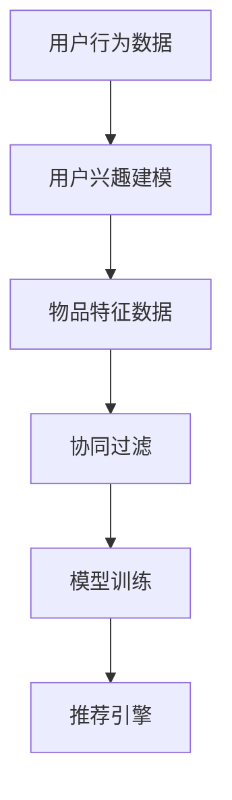

                 

# AI个性化推荐系统的优势

## 1. 背景介绍

### 1.1 问题由来

随着互联网的迅猛发展，用户生成的内容与日俱增。如何在海量数据中迅速找到用户感兴趣的内容，成为各大电商、视频、社交平台亟待解决的问题。传统的推荐系统通常基于用户的历史行为数据进行推荐，但这种基于历史数据的推荐方式，无法完全涵盖用户的兴趣和偏好，且难以适应用户偏好的动态变化。

个性化推荐系统的提出，恰好解决了这一难题。通过分析用户的兴趣和行为数据，推荐系统能够更准确地匹配用户需求，提高用户满意度和平台粘性，从而获得更大的商业价值。个性化推荐系统在电商、视频、新闻等多个领域得到广泛应用，极大地提升了用户体验和平台收益。

### 1.2 问题核心关键点

个性化推荐系统主要围绕两个核心关键点进行构建：

- 用户兴趣建模：从用户历史行为数据中学习用户兴趣，构建用户兴趣表示。
- 物品相似度计算：计算物品之间的相似度，推荐与用户兴趣相似的物品。

本文将详细探讨如何构建高效的个性化推荐系统，从用户兴趣建模和物品相似度计算两个方面展开，帮助读者更好地理解并应用这一强大的技术。

## 2. 核心概念与联系

### 2.1 核心概念概述

为更好地理解个性化推荐系统的工作原理，本节将介绍几个关键概念：

- 个性化推荐系统：利用用户行为数据，为用户推荐感兴趣物品的系统。
- 协同过滤：一种基于用户行为数据的推荐算法，分为基于用户的协同过滤和基于物品的协同过滤。
- 用户行为数据：用户在平台上的浏览、点击、购买、评分等行为数据。
- 物品特征数据：商品、文章、视频等物品的描述、属性、评分等特征数据。
- 模型训练：基于用户行为数据和物品特征数据，通过机器学习算法训练推荐模型。
- 推荐引擎：将训练好的模型应用到实时场景，为用户推荐物品的系统。

这些核心概念之间的逻辑关系可以通过以下Mermaid流程图来展示：



这个流程图展示了个性化推荐系统从数据收集、用户兴趣建模、物品相似度计算、模型训练到实时推荐的全过程。

## 3. 核心算法原理 & 具体操作步骤

### 3.1 算法原理概述

个性化推荐系统的核心算法原理基于协同过滤。协同过滤利用用户行为数据，挖掘用户之间的相似性和物品之间的相似性，进而推荐与用户兴趣相似的物品。

具体来说，协同过滤分为基于用户的协同过滤和基于物品的协同过滤两种：

- 基于用户的协同过滤：根据用户的历史行为数据，计算用户间的相似度，推荐与用户兴趣相似的物品。
- 基于物品的协同过滤：根据物品的特征数据，计算物品间的相似度，推荐与用户历史兴趣相似的物品。

协同过滤的优点在于不需要用户和物品的显式特征，能够捕捉用户和物品之间的隐式关联。但协同过滤也存在一些缺点：

- 数据稀疏性：用户和物品的行为数据往往存在大量空缺，导致矩阵的稀疏性较高。
- 冷启动问题：新用户或新物品没有足够的行为数据，难以进行有效推荐。
- 扩展性：协同过滤算法需要处理大量的稀疏矩阵计算，计算复杂度较高，扩展性较差。

### 3.2 算法步骤详解

#### 3.2.1 数据预处理

数据预处理是构建个性化推荐系统的第一步。主要涉及以下几个步骤：

- 数据清洗：去除无关、噪声数据，保留有用信息。
- 数据集成：将来自不同渠道的数据进行整合，形成统一的格式。
- 数据归一化：将不同来源的数据归一化到相同的尺度，便于后续计算。
- 特征工程：将原始数据转换为模型可以利用的特征向量。

#### 3.2.2 用户兴趣建模

用户兴趣建模是个性化推荐系统的核心环节，主要利用用户历史行为数据构建用户兴趣表示。常用的用户兴趣建模方法包括：

- 基于物品的协同过滤：根据用户的历史行为数据，计算用户间的相似度。
- 基于内容的推荐：根据物品的特征数据，计算物品间的相似度。
- 混合推荐算法：结合多种推荐方法，综合考虑用户和物品的相似性，提高推荐效果。

#### 3.2.3 物品相似度计算

物品相似度计算是推荐系统中另一个关键环节。主要利用物品特征数据计算物品间的相似度。常用的物品相似度计算方法包括：

- 余弦相似度：通过计算物品特征向量的余弦值，得到物品间的相似度。
- Jaccard相似度：通过计算物品特征向量之间的交集与并集，得到物品间的相似度。
- 欧几里得距离：通过计算物品特征向量之间的欧式距离，得到物品间的相似度。

#### 3.2.4 模型训练与评估

模型训练和评估是推荐系统的核心部分，主要利用用户行为数据和物品特征数据，通过机器学习算法训练推荐模型。常用的机器学习算法包括：

- 线性回归：利用用户行为数据和物品特征数据，构建线性模型进行推荐。
- 逻辑回归：利用用户行为数据和物品特征数据，构建逻辑回归模型进行推荐。
- 决策树：利用用户行为数据和物品特征数据，构建决策树模型进行推荐。

模型训练的目的是找到最佳的模型参数，使得推荐模型的输出与真实标签之间误差最小化。常用的评估指标包括：

- 准确率：预测正确的用户和物品数量占总样本数量的比例。
- 召回率：预测正确的用户和物品数量占真实正样本数量的比例。
- F1分数：综合考虑准确率和召回率，用于衡量推荐模型的整体性能。

### 3.3 算法优缺点

#### 3.3.1 优点

个性化推荐系统具有以下优点：

- 高效性：能够快速匹配用户和物品，提高推荐效率。
- 用户体验：能够根据用户兴趣进行个性化推荐，提高用户满意度。
- 商业价值：能够提升用户粘性，增加平台收益。

#### 3.3.2 缺点

个性化推荐系统也存在一些缺点：

- 数据稀疏性：用户和物品的行为数据往往存在大量空缺，导致矩阵的稀疏性较高。
- 冷启动问题：新用户或新物品没有足够的行为数据，难以进行有效推荐。
- 扩展性：协同过滤算法需要处理大量的稀疏矩阵计算，计算复杂度较高，扩展性较差。

### 3.4 算法应用领域

个性化推荐系统在多个领域得到广泛应用，例如：

- 电商：推荐用户感兴趣的商品。
- 视频：推荐用户感兴趣的视频内容。
- 新闻：推荐用户感兴趣的新闻文章。
- 社交：推荐用户感兴趣的朋友和内容。
- 音乐：推荐用户感兴趣的歌曲。

## 4. 数学模型和公式 & 详细讲解 & 举例说明

### 4.1 数学模型构建

本节将使用数学语言对个性化推荐系统的构建进行更加严格的刻画。

记用户集合为 $U$，物品集合为 $V$，用户行为数据矩阵为 $\mathbf{R} \in \mathbb{R}^{m \times n}$，其中 $m$ 为用户的数量，$n$ 为物品的数量。假设 $R_{ui} = 1$ 表示用户 $u$ 对物品 $i$ 进行了行为，否则为 $0$。用户对物品的评分数据为 $Y \in \mathbb{R}^{m \times n}$。

### 4.2 公式推导过程

#### 4.2.1 用户兴趣建模

用户兴趣建模通常采用矩阵分解的方法，将用户和物品的评分数据分解为用户的兴趣因子和物品的特征因子。设用户 $u$ 对物品 $i$ 的评分表示为 $Y_{ui} = \mathbf{u} \cdot \mathbf{v}$，其中 $\mathbf{u} \in \mathbb{R}^m$ 为用户的兴趣因子，$\mathbf{v} \in \mathbb{R}^n$ 为物品的特征因子。

通过对用户兴趣因子和物品特征因子的分解，可以得到用户 $u$ 对物品 $i$ 的评分预测：

$$
\hat{Y}_{ui} = \mathbf{u} \cdot \mathbf{v}
$$

其中 $\mathbf{u} = \mathbf{U} \cdot \mathbf{a}$ 和 $\mathbf{v} = \mathbf{V} \cdot \mathbf{b}$，$\mathbf{a} \in \mathbb{R}^m$ 和 $\mathbf{b} \in \mathbb{R}^n$ 为用户和物品的低维表示。

通过矩阵分解，用户兴趣建模的目标是寻找最佳的 $\mathbf{U}$ 和 $\mathbf{V}$，使得 $\mathbf{R}$ 与 $\mathbf{Y}$ 的均方误差最小化：

$$
\min_{\mathbf{U}, \mathbf{V}} \|\mathbf{R} - \mathbf{UV}^T\|_F^2
$$

#### 4.2.2 物品相似度计算

物品相似度计算常用的方法是余弦相似度，设物品 $i$ 和 $j$ 的特征向量为 $\mathbf{v}_i$ 和 $\mathbf{v}_j$，则物品之间的余弦相似度为：

$$
sim_{ij} = \frac{\mathbf{v}_i \cdot \mathbf{v}_j}{\|\mathbf{v}_i\| \cdot \|\mathbf{v}_j\|}
$$

### 4.3 案例分析与讲解

以电商平台的个性化推荐为例，说明如何利用矩阵分解方法进行用户兴趣建模和物品相似度计算。

首先，将用户和物品的评分数据矩阵 $\mathbf{R}$ 进行分解：

$$
\mathbf{R} \approx \mathbf{UV}^T
$$

其中 $\mathbf{U} \in \mathbb{R}^{m \times k}$ 为用户兴趣因子矩阵，$\mathbf{V} \in \mathbb{R}^{n \times k}$ 为物品特征因子矩阵。

然后，根据用户 $u$ 对物品 $i$ 的评分预测 $\hat{Y}_{ui} = \mathbf{u} \cdot \mathbf{v}$，对新物品 $i$ 进行推荐，选择评分预测最大的物品进行推荐。

最后，利用物品相似度计算方法，计算新物品 $i$ 与已推荐物品 $j$ 的相似度，选择相似度最大的物品进行推荐。

## 5. 项目实践：代码实例和详细解释说明

### 5.1 开发环境搭建

在进行个性化推荐系统开发前，我们需要准备好开发环境。以下是使用Python进行PyTorch开发的环境配置流程：

1. 安装Anaconda：从官网下载并安装Anaconda，用于创建独立的Python环境。

2. 创建并激活虚拟环境：
```bash
conda create -n pytorch-env python=3.8 
conda activate pytorch-env
```

3. 安装PyTorch：根据CUDA版本，从官网获取对应的安装命令。例如：
```bash
conda install pytorch torchvision torchaudio cudatoolkit=11.1 -c pytorch -c conda-forge
```

4. 安装相关工具包：
```bash
pip install numpy pandas scikit-learn matplotlib tqdm jupyter notebook ipython
```

完成上述步骤后，即可在`pytorch-env`环境中开始开发实践。

### 5.2 源代码详细实现

这里我们以基于矩阵分解的用户兴趣建模方法为例，给出一个使用PyTorch实现电商个性化推荐的代码实例。

```python
import torch
import torch.nn as nn
import torch.nn.functional as F

class UserInterestModel(nn.Module):
    def __init__(self, num_users, num_items, num_factors):
        super(UserInterestModel, self).__init__()
        self.num_users = num_users
        self.num_items = num_items
        self.num_factors = num_factors
        
        # 初始化用户兴趣因子矩阵U
        self.U = nn.Parameter(torch.randn(num_users, num_factors))
        
        # 初始化物品特征因子矩阵V
        self.V = nn.Parameter(torch.randn(num_items, num_factors))
        
        # 初始化评分矩阵R
        self.R = torch.randn(num_users, num_items)
        
    def forward(self, u):
        # 计算用户兴趣因子
        u_hat = torch.mm(self.U, self.V)
        
        # 计算用户对物品的评分预测
        y_hat = u_hat * self.V
        
        # 计算损失函数
        loss = F.mse_loss(y_hat, self.R)
        
        return y_hat, loss

# 设置超参数
num_users = 1000
num_items = 1000
num_factors = 50

# 创建模型
model = UserInterestModel(num_users, num_items, num_factors)

# 设置优化器
optimizer = torch.optim.Adam(model.parameters(), lr=0.01)

# 训练模型
for epoch in range(100):
    for u in range(num_users):
        # 随机抽取一个用户
        y_hat, loss = model(u)
        
        # 计算梯度
        optimizer.zero_grad()
        loss.backward()
        optimizer.step()

# 评估模型
y_hat = model(0)
```

以上代码实现了基于矩阵分解的用户兴趣建模方法，通过PyTorch对用户和物品的评分数据进行分解，训练得到用户兴趣因子和物品特征因子。在训练过程中，利用均方误差损失函数对模型进行优化。

### 5.3 代码解读与分析

这里我们详细解读一下关键代码的实现细节：

**UserInterestModel类**：
- `__init__`方法：初始化用户兴趣因子矩阵U、物品特征因子矩阵V和评分矩阵R。
- `forward`方法：计算用户兴趣因子、用户对物品的评分预测，并计算损失函数。

**模型训练**：
- 通过遍历所有用户，计算评分预测，计算均方误差损失函数，并使用优化器进行参数更新。

**模型评估**：
- 通过随机抽取一个用户，计算评分预测。

## 6. 实际应用场景

### 6.1 电商推荐

电商平台的个性化推荐系统是典型应用之一。电商推荐系统通过分析用户历史购买和浏览行为，推荐用户可能感兴趣的商品，提升用户满意度和购买转化率。

在实践中，电商推荐系统通常使用协同过滤算法进行推荐。通过分析用户的历史购买和浏览数据，计算用户和商品之间的相似度，推荐与用户兴趣相似的商品。此外，还可以结合用户画像、商品属性等信息，进行更加精准的推荐。

### 6.2 视频推荐

视频平台的个性化推荐系统能够根据用户历史观看行为，推荐用户可能感兴趣的视频内容，提升用户体验和平台粘性。视频推荐系统通常使用协同过滤算法进行推荐，结合视频标签、评分等信息，进一步提升推荐效果。

## 7. 工具和资源推荐

### 7.1 学习资源推荐

为了帮助开发者系统掌握个性化推荐系统的工作原理和应用技巧，这里推荐一些优质的学习资源：

1. 《推荐系统实战》一书：由知名推荐系统专家撰写，详细介绍了推荐系统的工作原理和实践技巧，适合初学者和进阶者阅读。

2. 《深度学习推荐系统》课程：斯坦福大学开设的推荐系统课程，涵盖推荐系统的工作原理和多种推荐算法，配套实验室练习，让你理论与实践相结合。

3. PyTorch官方文档：PyTorch的官方文档，详细介绍了PyTorch的推荐系统模块，提供了丰富的推荐系统代码示例。

4. 《协同过滤推荐系统》论文：介绍协同过滤算法的原理和实现，适合对协同过滤算法感兴趣的读者阅读。

### 7.2 开发工具推荐

高效的开发离不开优秀的工具支持。以下是几款用于个性化推荐系统开发的常用工具：

1. PyTorch：基于Python的开源深度学习框架，灵活动态的计算图，适合快速迭代研究。大部分推荐系统模块都有PyTorch版本的实现。

2. TensorFlow：由Google主导开发的开源深度学习框架，生产部署方便，适合大规模工程应用。同样有丰富的推荐系统资源。

3. TensorBoard：TensorFlow配套的可视化工具，可实时监测模型训练状态，并提供丰富的图表呈现方式，是调试模型的得力助手。

4. Weights & Biases：模型训练的实验跟踪工具，可以记录和可视化模型训练过程中的各项指标，方便对比和调优。

5. Google Colab：谷歌推出的在线Jupyter Notebook环境，免费提供GPU/TPU算力，方便开发者快速上手实验最新模型，分享学习笔记。

合理利用这些工具，可以显著提升个性化推荐系统的开发效率，加快创新迭代的步伐。

### 7.3 相关论文推荐

个性化推荐系统的发展源于学界的持续研究。以下是几篇奠基性的相关论文，推荐阅读：

1. Matrix Factorization Techniques for Recommender Systems：介绍矩阵分解方法在推荐系统中的应用，是推荐系统的经典论文。

2. Collaborative Filtering for Implicit Feedback Datasets：介绍协同过滤算法在推荐系统中的应用，是推荐系统的经典论文。

3. Deep Collaborative Filtering：介绍深度学习在推荐系统中的应用，适合对深度推荐系统感兴趣的读者阅读。

4. Factorization Machines with Side Information：介绍特征工程在推荐系统中的应用，适合对特征工程感兴趣的读者阅读。

这些论文代表了个性化推荐系统的发展脉络。通过学习这些前沿成果，可以帮助研究者把握学科前进方向，激发更多的创新灵感。

## 8. 总结：未来发展趋势与挑战

### 8.1 研究成果总结

本文对基于协同过滤的个性化推荐系统进行了全面系统的介绍。首先阐述了个性化推荐系统的研究背景和意义，明确了协同过滤在构建推荐系统中的核心作用。其次，从用户兴趣建模和物品相似度计算两个方面，详细讲解了协同过滤的算法原理和具体操作步骤，帮助读者更好地理解并应用这一强大的技术。

通过本文的系统梳理，可以看到，基于协同过滤的个性化推荐系统已经广泛应用于电商、视频等多个领域，极大地提升了用户体验和平台收益。未来，伴随推荐算法的不断演进，推荐系统将能够更加精准、高效地为用户提供个性化推荐，进一步提升用户体验和平台收益。

### 8.2 未来发展趋势

展望未来，个性化推荐系统将呈现以下几个发展趋势：

1. 深度推荐：深度学习技术在推荐系统中的应用将更加广泛，结合用户兴趣建模和物品相似度计算，提高推荐效果。

2. 多模态推荐：结合文本、图像、语音等多种模态信息，进行更加精准的推荐。

3. 跨领域推荐：结合不同领域的用户行为数据，进行跨领域的推荐，提升推荐效果。

4. 实时推荐：结合流式数据处理技术，实现实时推荐，提升用户体验。

5. 混合推荐：结合基于用户的协同过滤和基于物品的协同过滤，综合考虑用户和物品的相似度，提高推荐效果。

6. 稀疏矩阵处理：结合稀疏矩阵处理技术，提高稀疏矩阵的计算效率，提升推荐系统性能。

以上趋势凸显了个性化推荐系统的发展方向。这些方向的探索发展，必将进一步提升推荐系统的性能和应用范围，为推荐系统带来新的突破。

### 8.3 面临的挑战

尽管个性化推荐系统已经取得了瞩目成就，但在迈向更加智能化、普适化应用的过程中，它仍面临诸多挑战：

1. 数据稀疏性：用户和物品的行为数据往往存在大量空缺，导致矩阵的稀疏性较高。

2. 冷启动问题：新用户或新物品没有足够的行为数据，难以进行有效推荐。

3. 扩展性：协同过滤算法需要处理大量的稀疏矩阵计算，计算复杂度较高，扩展性较差。

4. 多模态推荐：结合文本、图像、语音等多种模态信息，进行推荐时，需要考虑不同模态数据之间的协同建模，增加推荐系统的复杂度。

5. 实时推荐：实现实时推荐，需要结合流式数据处理技术，增加推荐系统的计算复杂度。

6. 混合推荐：结合多种推荐方法，综合考虑用户和物品的相似度，需要设计高效的推荐算法，增加推荐系统的复杂度。

7. 用户隐私保护：推荐系统需要考虑用户隐私保护，如何在推荐过程中保护用户数据安全，是亟待解决的问题。

8. 推荐多样性：推荐系统需要保证推荐结果的多样性，避免过度个性化推荐，减少用户的不满。

以上挑战凸显了个性化推荐系统的技术复杂度。为了应对这些挑战，未来的研究需要在数据处理、算法设计、模型部署等多个方面进行全面优化，才能真正实现个性化推荐系统的智能化、普适化和高效化。

### 8.4 研究展望

面对个性化推荐系统所面临的诸多挑战，未来的研究需要在以下几个方面寻求新的突破：

1. 数据处理技术：结合稀疏矩阵处理技术、流式数据处理技术等，提高推荐系统对稀疏数据的处理能力。

2. 算法设计技术：结合深度学习、多模态推荐、混合推荐等技术，提升推荐算法的性能和复杂度。

3. 模型部署技术：结合模型压缩、稀疏化存储等技术，提高推荐系统的部署效率。

4. 用户隐私保护：结合隐私保护技术，在推荐过程中保护用户数据安全。

5. 推荐多样性：结合推荐结果多样性算法，提升推荐系统的多样性，减少用户不满。

6. 多领域推荐：结合跨领域推荐技术，提升推荐系统在不同领域的应用效果。

这些研究方向的探索，必将引领个性化推荐系统向更高的台阶发展，为推荐系统带来新的突破。面向未来，个性化推荐系统需要在数据、算法、模型、隐私保护等多个维度进行全面优化，才能真正实现个性化推荐系统的智能化、普适化和高效化。

## 9. 附录：常见问题与解答

**Q1：个性化推荐系统是否适用于所有NLP任务？**

A: 个性化推荐系统主要适用于电商、视频、新闻等需要推荐物品的场景，对于需要推荐文本内容的场景，如社交、论坛等，可能不太适用。

**Q2：如何缓解推荐系统中的数据稀疏性问题？**

A: 缓解推荐系统中的数据稀疏性问题，可以采用以下方法：

1. 冷启动用户：使用用户画像、用户设备等非行为数据进行推荐。

2. 协同过滤：结合基于用户的协同过滤和基于物品的协同过滤，提高推荐效果。

3. 深度推荐：结合深度学习技术，提高推荐系统的表达能力。

4. 多模态推荐：结合文本、图像、语音等多种模态信息，进行推荐。

5. 推荐多样性：结合推荐结果多样性算法，提升推荐系统的多样性，减少用户不满。

**Q3：推荐系统如何保证推荐结果的多样性？**

A: 推荐系统可以通过以下方法保证推荐结果的多样性：

1. 协同过滤：结合基于用户的协同过滤和基于物品的协同过滤，综合考虑用户和物品的相似度。

2. 混合推荐：结合多种推荐方法，综合考虑用户和物品的相似度。

3. 推荐结果多样性算法：利用随机采样、平衡排序等方法，提高推荐结果的多样性。

4. 用户反馈：根据用户对推荐结果的反馈，调整推荐算法，提高推荐结果的多样性。

**Q4：推荐系统在实际部署时需要注意哪些问题？**

A: 推荐系统在实际部署时，需要注意以下问题：

1. 模型裁剪：去除不必要的层和参数，减小模型尺寸，加快推理速度。

2. 量化加速：将浮点模型转为定点模型，压缩存储空间，提高计算效率。

3. 服务化封装：将模型封装为标准化服务接口，便于集成调用。

4. 弹性伸缩：根据请求流量动态调整资源配置，平衡服务质量和成本。

5. 监控告警：实时采集系统指标，设置异常告警阈值，确保服务稳定性。

6. 安全防护：采用访问鉴权、数据脱敏等措施，保障数据和模型安全。

总之，推荐系统需要从数据、算法、模型、部署等多个维度进行全面优化，才能真正实现个性化推荐系统的智能化、普适化和高效化。

---

作者：禅与计算机程序设计艺术 / Zen and the Art of Computer Programming

