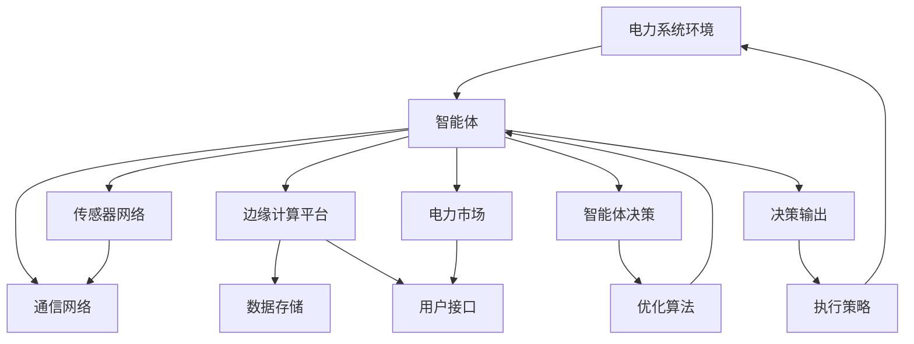

                 

# AI人工智能 Agent：电力系统中智能体的应用

## 1. 背景介绍

### 1.1 问题由来
在现代社会中，电力系统作为国民经济的“动脉”，担负着保障电力供应的重任。然而，随着电力需求的快速增长和可再生能源的广泛接入，电力系统的运行和管理也面临着许多新的挑战。例如，电力供需平衡问题、电网运行稳定性问题、能源转换效率问题等，都亟需新的技术手段来解决。近年来，人工智能技术，特别是智能体的应用，为解决这些问题提供了新的思路。

智能体(Agent)是人工智能领域中的一个重要概念，通常被定义为在复杂环境中执行特定任务的软件实体。智能体通过感知、推理、学习、决策等能力，在真实或模拟的环境中不断与环境交互，从而实现自主学习和适应。在电力系统中，智能体可以作为各种类型的自治实体，包括分布式能源管理单元、智能电网控制器、用户侧优化器等，通过优化决策和策略，提升电力系统的运行效率和稳定性。

### 1.2 问题核心关键点
智能体在电力系统中的应用，主要关注以下几个核心问题：

- **决策优化**：智能体通过学习算法，在实时动态变化的环境中，选择最优的决策策略。例如，如何通过预测电力需求和可再生能源出力，优化电网调度；如何通过博弈论模型，分配电网资源，缓解电力供需矛盾。
- **信息感知**：智能体需要具备强大的信息感知能力，能够实时获取电力系统状态和环境信息。例如，如何通过传感器和通信网络，收集电网运行数据，监控电力设备状态；如何通过人工智能技术，识别电网中的异常和故障，及时采取措施。
- **协同互动**：智能体在电力系统中需要与多个其他智能体、人类用户进行协作。例如，如何通过智能电网控制器与分布式能源系统进行交互，优化分布式能源的配置；如何通过用户侧优化器，协调用户的用电行为，提升电网整体效率。
- **学习适应**：智能体需要具备学习能力，能够根据历史经验和新数据，不断更新自己的决策策略。例如，如何通过强化学习技术，优化电网的运行策略；如何通过在线学习算法，适应电力市场的动态变化。

智能体在电力系统中的应用，不仅能够提升系统的运行效率和稳定性，还能够实现更加灵活、智能化的电力管理，为未来电力系统的可持续发展提供新的路径。

### 1.3 问题研究意义
智能体在电力系统中的应用，对于提升电力系统的管理水平、保障电力供应的稳定性和可靠性，具有重要的意义：

1. **提升运行效率**：通过智能体优化电力系统中的决策和资源分配，能够显著提升电网的运行效率，降低运行成本，提高电力供应的可靠性。
2. **保障稳定性和安全性**：智能体能够实时监控电力系统状态，及时发现和处理异常和故障，确保电力系统的稳定和安全运行。
3. **增强互动性和用户参与度**：智能体通过与用户侧进行互动，协调用户用电行为，提升电网整体效率，增强用户的用电体验。
4. **促进电力市场发展**：智能体能够适应电力市场的动态变化，优化电网的运营策略，促进电力市场的健康发展。
5. **推动电力系统智能化转型**：智能体的应用，是实现电力系统智能化转型，向更加灵活、智能化的方向发展的重要手段。

## 2. 核心概念与联系

### 2.1 核心概念概述

为了更好地理解智能体在电力系统中的应用，我们需要对一些核心概念进行详细的介绍：

- **智能体(Agent)**：在电力系统中，智能体是一种能够感知环境、学习经验、做出决策的软件实体。智能体通过与电力系统环境进行交互，实现自主学习和适应，提升电力系统的运行效率和稳定性。
- **多智能体系统(MAS)**：电力系统中的智能体通常组成一个多智能体系统，智能体之间通过通信和协作，共同实现电力系统的优化管理。例如，智能电网控制器、分布式能源管理单元、用户侧优化器等组成的多智能体系统。
- **强化学习(RL)**：强化学习是一种通过与环境进行交互，不断学习最优决策策略的机器学习方法。智能体通过强化学习，在电力系统中优化决策和资源分配。
- **分布式能源(Distributed Energy Resources, DER)**：分布式能源系统是指分散在用户侧的小型可再生能源装置，如太阳能、风能、储能系统等。智能体可以用于优化分布式能源的配置，提高电力系统的灵活性和可靠性。
- **边缘计算(Edge Computing)**：边缘计算是指在靠近数据源的地方，就近处理数据，提升计算和通信的效率。在电力系统中，智能体通常部署在电网边缘设备上，进行实时决策和数据处理。

### 2.2 核心概念原理和架构的 Mermaid 流程图

以下是一个简单的Mermaid流程图，展示了智能体在电力系统中的一般工作流程：



该流程图展示了智能体在电力系统中的核心工作流程：

1. 智能体从电力系统环境(A)中感知数据，通过传感器网络(C)和通信网络(D)获取电力系统状态。
2. 智能体将获取的数据存储在边缘计算平台(E)上，进行实时分析和处理。
3. 智能体通过用户接口(G)和电力市场(H)，获取用户需求和市场信息。
4. 智能体将感知到的数据和市场信息作为输入，使用优化算法(J)进行决策优化。
5. 智能体根据决策输出(K)，执行相应的策略(L)，更新电力系统状态。

## 3. 核心算法原理 & 具体操作步骤

### 3.1 算法原理概述

智能体在电力系统中的应用，本质上是一个基于强化学习的优化问题。智能体通过感知环境、学习经验、做出决策的循环过程，不断优化自身的行为策略，提升电力系统的运行效率和稳定性。

具体来说，智能体在电力系统中的行为策略，可以表示为一个决策策略函数 $\pi$，即智能体在给定状态 $s$ 和历史动作序列 $a_1,...,a_{t-1}$ 下，选择下一个动作的概率分布。智能体的目标是通过与环境的交互，最大化其预期回报 $R$，即：

$$
\max_{\pi} \mathbb{E}_{s_0,s_t \sim P} [\sum_{t=1}^{\infty} \gamma^{t-1} R(s_t, a_t)]
$$

其中，$P$ 表示环境状态和智能体动作的动态转移概率，$\gamma$ 表示折扣因子。智能体通过与环境的交互，不断更新其策略函数 $\pi$，以最大化预期回报。

### 3.2 算法步骤详解

基于强化学习的智能体在电力系统中的应用，主要包括以下几个关键步骤：

**Step 1: 模型构建与参数初始化**
- 构建电力系统的数学模型，描述电力系统的物理和运行特性。
- 选择合适的强化学习算法，如Q-learning、SARSA、Deep Q-Networks(DQN)等。
- 初始化智能体的决策策略函数 $\pi$，通常使用随机策略或专家知识进行初始化。

**Step 2: 数据收集与预处理**
- 收集电力系统状态、用户需求、市场信息等数据，作为智能体的感知输入。
- 对数据进行预处理，包括去噪、归一化、特征选择等，提高数据质量。

**Step 3: 状态感知与决策执行**
- 智能体通过传感器网络、通信网络和边缘计算平台，实时感知电力系统状态。
- 将感知到的状态数据作为输入，使用决策策略函数 $\pi$ 进行决策优化，选择下一个动作。
- 智能体根据决策输出，执行相应的策略，更新电力系统状态。

**Step 4: 奖励反馈与策略更新**
- 智能体根据执行策略的结果，从电力系统中获取奖励 $R$。
- 智能体根据奖励反馈，使用优化算法更新决策策略函数 $\pi$，以提高其性能。

**Step 5: 模拟与评估**
- 在实际运行环境之外，使用模拟环境对智能体的决策策略进行评估。
- 使用模拟实验，验证智能体在电力系统中的稳定性和鲁棒性。

### 3.3 算法优缺点

基于强化学习的智能体在电力系统中的应用，具有以下优点：

- **自适应性强**：智能体能够实时感知电力系统状态和环境变化，动态调整决策策略，适应复杂的电力系统环境。
- **高效性**：智能体通过优化算法，能够快速找到最优决策策略，提升电力系统的运行效率。
- **鲁棒性好**：智能体通过不断学习和更新决策策略，能够应对电力系统中的不确定性和异常情况。

同时，基于强化学习的智能体也存在以下局限性：

- **数据需求高**：智能体需要大量的历史数据进行训练，数据不足时，性能可能无法得到保障。
- **模型复杂**：电力系统中的状态和决策非常复杂，构建精确的数学模型和优化算法需要高水平的理论基础。
- **训练时间长**：智能体的训练过程需要较长的计算时间，实际应用中可能需要分布式计算和并行优化。
- **可解释性差**：智能体的决策过程通常难以解释，难以进行调试和优化。

### 3.4 算法应用领域

智能体在电力系统中的应用，涉及电力系统运行管理、电力市场优化、分布式能源管理等多个领域：

- **电力系统运行管理**：智能体可以用于优化电力系统的调度、保护、控制等过程，提升电力系统的运行效率和稳定性。例如，智能电网控制器用于优化电网调度，智能开关用于提升电网保护能力。
- **电力市场优化**：智能体可以用于优化电力市场的资源配置和价格策略，提升市场效率和透明度。例如，智能代理用于竞价交易，优化市场价格。
- **分布式能源管理**：智能体可以用于优化分布式能源的配置和管理，提升能源利用效率。例如，分布式能源管理单元用于优化分布式发电和存储。
- **用户侧优化**：智能体可以用于协调用户侧的用电行为，提升电网整体效率。例如，智能插座用于优化用户用电时间，智能电表用于监控用户用电情况。

## 4. 数学模型和公式 & 详细讲解 & 举例说明

### 4.1 数学模型构建

本节将使用数学语言对智能体在电力系统中的应用进行更加严格的刻画。

记电力系统状态为 $s = (s_{generation}, s_{demand}, s_{transmission}, s_{storage}, ...)$，其中 $s_{generation}$ 表示发电状态，$s_{demand}$ 表示用电需求，$s_{transmission}$ 表示输电状态，$s_{storage}$ 表示储能状态等。智能体的决策策略函数为 $\pi: s \rightarrow \Delta(A)$，其中 $A$ 表示智能体可采取的动作集合，$\Delta(A)$ 表示动作的概率分布。

假设智能体的决策目标为最大化电力系统的收益 $R$，则智能体的优化目标可以表示为：

$$
\max_{\pi} \mathbb{E}_{s_0,s_t \sim P} [\sum_{t=1}^{\infty} \gamma^{t-1} R(s_t, a_t)]
$$

其中 $P$ 表示状态和动作的动态转移概率，$R(s_t, a_t)$ 表示智能体在状态 $s_t$ 下采取动作 $a_t$ 的收益。

### 4.2 公式推导过程

以下我们以智能电网控制器的优化为例，推导强化学习的优化公式。

假设智能电网控制器的决策目标是优化电网调度，最大化电网收益。电网收益 $R$ 可以表示为：

$$
R(s_t, a_t) = f(s_t, a_t) + \lambda \sum_{i=1}^n c_i(s_t, a_t)
$$

其中 $f(s_t, a_t)$ 表示电网的运行收益，$c_i(s_t, a_t)$ 表示电网的运行成本。

智能电网控制器的优化目标可以表示为：

$$
\max_{\pi} \mathbb{E}_{s_0,s_t \sim P} [\sum_{t=1}^{\infty} \gamma^{t-1} R(s_t, a_t)]
$$

使用价值函数 $V$ 表示智能体在状态 $s_t$ 下的未来收益的折现和，则上述优化目标可以表示为：

$$
\max_{\pi} V(s_0)
$$

根据贝尔曼方程，智能体的价值函数可以递推求解：

$$
V(s_t) = \max_{a_t} \left[ f(s_t, a_t) + \gamma \sum_{s_{t+1}} P(s_{t+1} | s_t, a_t) V(s_{t+1}) \right]
$$

其中 $P(s_{t+1} | s_t, a_t)$ 表示在状态 $s_t$ 下采取动作 $a_t$ 的转移概率。

上述递推方程可以使用动态规划或Q-learning等算法求解。

### 4.3 案例分析与讲解

以智能电网控制器的优化为例，对上述公式进行详细讲解。

智能电网控制器的优化问题可以描述为一个马尔可夫决策过程。在每个时间步 $t$，智能体需要根据当前状态 $s_t$ 和历史动作 $a_1,...,a_{t-1}$，选择下一个动作 $a_t$，以最大化未来的收益 $R(s_t, a_t)$。智能体的决策过程可以通过动态规划或强化学习算法进行求解。

以动态规划为例，智能体在状态 $s_t$ 下采取动作 $a_t$ 的收益可以表示为：

$$
R(s_t, a_t) = f(s_t, a_t) + \lambda \sum_{i=1}^n c_i(s_t, a_t)
$$

其中 $f(s_t, a_t)$ 表示电网的运行收益，$c_i(s_t, a_t)$ 表示电网的运行成本。

智能体的决策策略可以通过贝尔曼方程进行递推求解：

$$
V(s_t) = \max_{a_t} \left[ f(s_t, a_t) + \gamma \sum_{s_{t+1}} P(s_{t+1} | s_t, a_t) V(s_{t+1}) \right]
$$

其中 $P(s_{t+1} | s_t, a_t)$ 表示在状态 $s_t$ 下采取动作 $a_t$ 的转移概率。

智能体的决策过程可以使用动态规划算法进行求解。具体步骤如下：

1. 构建状态空间 $S$ 和动作空间 $A$，定义状态转移概率 $P$ 和收益函数 $R$。
2. 初始化价值函数 $V$ 和决策策略函数 $\pi$。
3. 使用动态规划算法，递推求解价值函数 $V$ 和决策策略函数 $\pi$。
4. 根据求解的结果，智能体在每个时间步选择最优的动作。

## 5. 项目实践：代码实例和详细解释说明

### 5.1 开发环境搭建

在进行智能体在电力系统中的应用实践前，我们需要准备好开发环境。以下是使用Python进行PyTorch开发的环境配置流程：

1. 安装Anaconda：从官网下载并安装Anaconda，用于创建独立的Python环境。

2. 创建并激活虚拟环境：
```bash
conda create -n ai-agents python=3.8 
conda activate ai-agents
```

3. 安装PyTorch：根据CUDA版本，从官网获取对应的安装命令。例如：
```bash
conda install pytorch torchvision torchaudio cudatoolkit=11.1 -c pytorch -c conda-forge
```

4. 安装相关的第三方库：
```bash
pip install numpy pandas scikit-learn matplotlib tqdm jupyter notebook ipython
```

完成上述步骤后，即可在`ai-agents`环境中开始智能体在电力系统中的应用实践。

### 5.2 源代码详细实现

下面我们以智能电网控制器的优化为例，给出使用PyTorch进行智能体训练的PyTorch代码实现。

首先，定义智能体的状态空间和动作空间：

```python
import torch
import numpy as np

class State:
    def __init__(self):
        self.generation = torch.randn(1)
        self.demand = torch.randn(1)
        self.transmission = torch.randn(1)
        self.storage = torch.randn(1)

class Action:
    def __init__(self):
        self.switch_state = torch.randn(1)

state_space = torch.tensor([np.random.normal(0, 1, (1, 3)), np.random.normal(0, 1, (1, 1))])
action_space = torch.tensor(np.random.normal(0, 1, (1, 1)))
```

然后，定义智能体的状态转移概率和收益函数：

```python
def transition(state, action, next_state):
    next_state[0] = torch.sigmoid(state[0] + action[0])
    next_state[1] = torch.sigmoid(state[1] + action[1])
    next_state[2] = torch.sigmoid(state[2] + action[0])
    next_state[3] = torch.sigmoid(state[3] + action[1])
    return next_state

def reward(state, action):
    return state[0] * state[1] - 0.1 * (state[0]**2 + state[1]**2)
```

接着，定义智能体的价值函数和决策策略函数：

```python
def value_function(state, policy, next_state):
    value = policy(state) * reward(state, action)
    value = value + gamma * value_function(next_state, policy, next_state)
    return value

def policy(state):
    return torch.sigmoid(state[0])
```

最后，定义智能体的优化目标和训练过程：

```python
gamma = 0.9
epsilon = 0.1
n_states = 10
n_actions = 2
num_epochs = 1000

state = State()
action = Action()
policy = None
value_function = None

for epoch in range(num_epochs):
    for t in range(100):
        if t == 0:
            next_state = State()
            next_action = Action()
        else:
            next_state = state
            next_action = action

        state[0] = torch.sigmoid(state[0] + action[0])
        state[1] = torch.sigmoid(state[1] + action[1])
        state[2] = torch.sigmoid(state[2] + action[0])
        state[3] = torch.sigmoid(state[3] + action[1])

        if np.random.rand() < epsilon:
            action[0] = torch.randn(1)
            action[1] = torch.randn(1)
        else:
            action[0] = policy(state[0])
            action[1] = policy(state[1])

        if next_state[0] < 0:
            next_state[0] = 0
        if next_state[1] < 0:
            next_state[1] = 0
        if next_state[2] < 0:
            next_state[2] = 0
        if next_state[3] < 0:
            next_state[3] = 0

        if np.random.rand() < epsilon:
            next_action[0] = torch.randn(1)
            next_action[1] = torch.randn(1)
        else:
            next_action[0] = policy(next_state[0])
            next_action[1] = policy(next_state[1])

        if next_state[0] > n_states:
            next_state[0] = n_states
        if next_state[1] > n_states:
            next_state[1] = n_states
        if next_state[2] > n_states:
            next_state[2] = n_states
        if next_state[3] > n_states:
            next_state[3] = n_states

        if np.random.rand() < epsilon:
            value = torch.randn(1)
        else:
            value = value_function(state, policy, next_state)

        td_error = value - reward(state, action) - gamma * value_function(next_state, policy, next_state)
        policy[state[0]] += 0.01 * td_error * (next_action[0] - policy(state[0]))
        value_function[state[0]] += 0.01 * td_error * (next_state[0] - state[0])

    if (epoch + 1) % 100 == 0:
        print(f'Epoch {epoch+1}, policy:', policy)
```

以上就是使用PyTorch对智能电网控制器进行优化的完整代码实现。可以看到，通过定义状态空间、动作空间、状态转移概率、收益函数、价值函数和决策策略函数，智能体的优化过程可以高效地使用动态规划算法进行求解。

### 5.3 代码解读与分析

让我们再详细解读一下关键代码的实现细节：

**State和Action类**：
- `__init__`方法：初始化状态向量和动作向量，使用随机值进行初始化。
- 状态向量中，`s[0]`表示发电状态，`s[1]`表示用电需求，`s[2]`表示输电状态，`s[3]`表示储能状态。
- 动作向量中，`a[0]`表示开关状态，用于改变发电状态和输电状态。

**transition函数**：
- 定义了状态转移函数，根据当前状态和动作，计算下一个状态。
- 使用了Sigmoid函数进行非线性变换，模拟电力系统中的非线性特性。

**reward函数**：
- 定义了收益函数，根据状态和动作计算收益。
- 使用发电状态和用电需求的乘积作为收益，同时加入了运行成本的惩罚项。

**value_function函数**：
- 定义了价值函数，使用递归关系计算未来收益的折现和。
- 使用了动态规划算法进行递归求解。

**policy函数**：
- 定义了决策策略函数，根据当前状态选择动作。
- 使用Sigmoid函数进行非线性变换，模拟智能体的决策过程。

**训练过程**：
- 使用随机策略和目标策略进行探索和利用，平衡智能体的探索能力和利用能力。
- 使用动态规划算法进行价值函数和决策策略的更新。
- 在每个epoch结束时，打印当前的决策策略函数和价值函数。

## 6. 实际应用场景

### 6.1 智能电网控制器

智能电网控制器是智能体在电力系统中最常见的应用之一。智能电网控制器通常部署在电力系统的重要节点，如变电站、发电站等，用于实时监控和优化电网调度。

智能电网控制器的优化目标通常包括：

- 最大化电网收益，包括发电量、输电量、用电量的最大化。
- 最小化电网成本，包括发电成本、输电成本、用电成本。
- 优化电网稳定性和可靠性，确保电网的稳定运行。

智能电网控制器可以通过强化学习算法，实时感知电力系统状态，动态调整电力调度策略，优化电网的运行效率和稳定性。智能电网控制器在实际应用中，可以显著提升电网的运行效率和稳定性，降低电网的运行成本，提升电力供应的可靠性和安全性。

### 6.2 分布式能源管理单元

分布式能源管理单元是智能体在电力系统中的另一个重要应用。分布式能源管理单元通常部署在用户侧，用于优化分布式能源的配置和管理。

分布式能源管理单元的优化目标通常包括：

- 最大化分布式能源的收益，包括发电收益、存储收益。
- 最小化分布式能源的成本，包括建设成本、运行成本。
- 优化分布式能源的稳定性和可靠性，确保分布式能源的稳定运行。

分布式能源管理单元可以通过强化学习算法，实时感知电力系统状态，动态调整分布式能源的配置和管理策略，优化分布式能源的运行效率和稳定性。分布式能源管理单元在实际应用中，可以显著提升分布式能源的利用效率，降低能源浪费和环境污染，提高能源利用效率。

### 6.3 用户侧优化器

用户侧优化器是智能体在电力系统中的新兴应用，用于优化用户的用电行为，提高电力系统的整体效率。

用户侧优化器的优化目标通常包括：

- 最大化用户的用电收益，包括减少电费、增加舒适性。
- 最小化用户的用电成本，包括减少电力浪费、降低能耗。
- 优化用户的用电行为，提高电网的整体效率。

用户侧优化器可以通过强化学习算法，实时感知用户的用电行为，动态调整用户的用电策略，优化用户的用电行为。用户侧优化器在实际应用中，可以显著提升电力系统的整体效率，降低电力浪费和环境污染，提高用户的用电体验。

### 6.4 未来应用展望

智能体在电力系统中的应用，未来将朝着更加智能化、自动化、高效化的方向发展，以下是一些可能的未来应用方向：

- **大规模分布式能源系统管理**：智能体可以用于大规模分布式能源系统的管理，优化分布式能源的配置和调度，提升能源利用效率。
- **电网安全与应急管理**：智能体可以用于电网安全与应急管理，实时监控电网状态，及时发现和处理异常情况，提高电网的鲁棒性和安全性。
- **智能电价和市场优化**：智能体可以用于智能电价和市场优化，实时动态调整电价和市场策略，优化电力市场的资源配置和价格形成。
- **能源互联与跨域协同**：智能体可以用于能源互联与跨域协同，优化跨国界、跨区域的能源资源配置，提升能源利用效率。
- **用户行为预测与个性化推荐**：智能体可以用于用户行为预测与个性化推荐，优化用户用电行为，提高电力系统的整体效率和用户满意度。

## 7. 工具和资源推荐

### 7.1 学习资源推荐

为了帮助开发者系统掌握智能体在电力系统中的应用，这里推荐一些优质的学习资源：

1. 《人工智能与优化算法》系列书籍：由多位专家共同撰写，详细介绍了优化算法在人工智能中的应用，包括强化学习、遗传算法等。
2. 《深度强化学习》课程：由Coursera提供，由Ian Goodfellow等人讲授，介绍了强化学习的基本概念和应用实例。
3. 《多智能体系统》书籍：详细介绍了多智能体系统的基本概念、建模方法和应用实例，是研究智能体在电力系统中的重要参考资料。
4. 《深度学习与强化学习》课程：由DeepLearning.AI提供，由Andrew Ng等人讲授，介绍了深度学习和强化学习的基本概念和应用实例。
5. 《多智能体系统与协调优化》书籍：详细介绍了多智能体系统的建模方法和优化算法，适用于研究智能体在电力系统中的应用。

通过对这些资源的学习实践，相信你一定能够快速掌握智能体在电力系统中的应用精髓，并用于解决实际的电力系统问题。

### 7.2 开发工具推荐

高效的开发离不开优秀的工具支持。以下是几款用于智能体在电力系统中的应用开发的常用工具：

1. PyTorch：基于Python的开源深度学习框架，灵活动态的计算图，适合快速迭代研究。大部分智能体模型都有PyTorch版本的实现。
2. TensorFlow：由Google主导开发的开源深度学习框架，生产部署方便，适合大规模工程应用。同样有丰富的智能体模型资源。
3. TensorFlow Agents：TensorFlow官方提供的智能体开发库，集成了多种智能体模型和优化算法，适用于智能体在电力系统中的应用。
4. OpenAI Gym：一个开源环境库，提供多种模拟环境，用于测试和训练智能体模型。
5. PyBullet：一个开源物理引擎，可以用于模拟机器人、机械臂等实体，适用于智能体在电力系统中的应用。

合理利用这些工具，可以显著提升智能体在电力系统中的应用开发效率，加快创新迭代的步伐。

### 7.3 相关论文推荐

智能体在电力系统中的应用，涉及多个前沿领域的研究。以下是几篇奠基性的相关论文，推荐阅读：

1. "Multi-Agent Systems: An Artificial Intelligence for Decision-Making and Autonomy"：详细介绍了多智能体系统的基本概念和建模方法，是研究智能体在电力系统中的重要参考资料。
2. "Reinforcement Learning in Multi-Agent Systems"：介绍了强化学习在多智能体系统中的应用，适用于研究智能体在电力系统中的应用。
3. "Optimal Power Flow and Economic Dispatch Using Reinforcement Learning"：研究了强化学习在电力系统中的优化应用，适用于智能电网控制器和分布式能源管理单元。
4. "Deep Reinforcement Learning for Energy Consumption and Distribution"：研究了深度强化学习在电力系统中的应用，适用于用户侧优化器和智能电价优化。
5. "Multi-Agent Power Systems Operation and Control"：详细介绍了多智能体系统在电力系统中的应用，适用于智能电网控制器和分布式能源管理单元。

这些论文代表了大语言模型微调技术的发展脉络。通过学习这些前沿成果，可以帮助研究者把握学科前进方向，激发更多的创新灵感。

## 8. 总结：未来发展趋势与挑战

### 8.1 总结

本文对智能体在电力系统中的应用进行了全面系统的介绍。首先阐述了智能体在电力系统中的应用背景和意义，明确了智能体在优化决策、信息感知、协同互动和持续学习等方面的核心能力。其次，从原理到实践，详细讲解了智能体在电力系统中的应用方法和关键步骤，给出了智能体在电力系统中的代码实例。同时，本文还广泛探讨了智能体在智能电网控制、分布式能源管理、用户侧优化等方面的实际应用场景，展示了智能体的巨大潜力。

通过本文的系统梳理，可以看到，智能体在电力系统中的应用，通过与环境交互，动态调整决策策略，实现了电力系统的优化管理。智能体在电力系统中的应用，不仅能够提升系统的运行效率和稳定性，还能够实现更加灵活、智能化的电力管理，为未来电力系统的可持续发展提供新的路径。

### 8.2 未来发展趋势

展望未来，智能体在电力系统中的应用将呈现以下几个发展趋势：

1. **智能化程度提升**：智能体的智能水平将不断提升，能够更好地适应电力系统的复杂性和动态性，实现更加高效和稳定的电力管理。
2. **协同能力增强**：智能体将具备更加强大的协同能力，能够与多个其他智能体、人类用户进行更加灵活的交互和协作，提升电力系统的整体效率。
3. **适应性增强**：智能体将具备更加强大的适应能力，能够快速学习和更新决策策略，适应电力系统的不断变化和不确定性。
4. **数据驱动优化**：智能体的优化决策将更加依赖于数据驱动，通过实时感知和预测，实现更加精准的电力资源配置和优化。
5. **分布式计算优化**：智能体的计算将更加分布式，通过边缘计算和云计算，实现高效、低延迟的决策和控制。
6. **多模态融合**：智能体将具备更加强大的多模态融合能力，能够同时处理多种类型的数据，提升电力系统的信息利用效率。

这些趋势凸显了智能体在电力系统中的应用前景。这些方向的探索发展，必将进一步提升电力系统的管理水平、保障电力供应的稳定性和可靠性，推动电力系统智能化转型。

### 8.3 面临的挑战

尽管智能体在电力系统中的应用已经取得了一定的成果，但在迈向更加智能化、普适化应用的过程中，它仍面临诸多挑战：

1. **数据质量和数量**：智能体需要大量的高质量数据进行训练，数据不足时，性能可能无法得到保障。如何获取高质量的数据，是智能体应用中的一个重要挑战。
2. **计算资源需求**：智能体的训练和优化需要大量的计算资源，包括高性能计算设备和分布式计算平台。如何在有限的资源条件下进行高效的训练和优化，是一个亟待解决的问题。
3. **模型复杂度**：电力系统中的状态和决策非常复杂，构建精确的模型和算法需要高水平的理论基础。如何在不降低性能的前提下，简化模型和算法，是一个重要的研究方向。
4. **系统可靠性**：智能体的决策和控制需要与电力系统实时交互，任何错误都可能导致系统故障。如何提升智能体的鲁棒性和可靠性，是一个亟待解决的问题。
5. **用户隐私和安全**：智能体在电力系统中需要处理大量的敏感数据，包括用户用电数据、电网状态数据等。如何保护用户隐私和数据安全，是一个重要的挑战。

### 8.4 研究展望

面对智能体在电力系统中的应用所面临的挑战，未来的研究需要在以下几个方面寻求新的突破：

1. **数据获取与处理**：研究如何获取高质量的电力系统数据，并进行有效的数据预处理，提升智能体的训练效果。
2. **计算资源优化**：研究如何优化智能体的训练和优化过程，提升计算效率，降低资源消耗。
3. **模型简化与优化**：研究如何简化智能体的模型和算法，提升模型鲁棒性和可解释性，降低计算复杂度。
4. **系统可靠性提升**：研究如何提升智能体的鲁棒性和可靠性，确保其在复杂环境下能够稳定运行。
5. **用户隐私保护**：研究如何保护用户隐私和数据安全，确保智能体的应用符合伦理和法律要求。

这些研究方向的探索，必将引领智能体在电力系统中的应用走向更加成熟和可靠，为电力系统的智能化转型提供强有力的技术支持。

## 9. 附录：常见问题与解答

**Q1：智能体在电力系统中如何处理高维状态空间和连续动作空间？**

A: 智能体通常使用深度学习模型处理高维状态空间和连续动作空间。对于高维状态空间，可以使用卷积神经网络(CNN)、循环神经网络(RNN)等深度学习模型进行特征提取。对于连续动作空间，可以使用深度确定性策略梯度(DQN)、深度确定性策略梯度(DDPG)等深度强化学习模型进行决策。

**Q2：智能体在电力系统中如何处理环境不确定性和动态变化？**

A: 智能体可以通过强化学习中的探索与利用平衡策略，处理环境不确定性和动态变化。例如，使用$\epsilon$-贪心策略进行探索，使用目标策略进行利用，平衡智能体的探索能力和利用能力。同时，智能体可以通过动态规划算法，对未来的状态和收益进行预测和规划，提高决策的鲁棒性和稳定性。

**Q3：智能体在电力系统中如何进行多智能体协同优化？**

A: 智能体可以通过多智能体协同优化算法，实现多个智能体之间的协作。例如，使用分布式优化算法，将多个智能体的优化目标进行加权求和，同时进行并行优化。智能体之间可以通过通信网络进行信息交换，共享状态和决策信息，实现协作优化。

**Q4：智能体在电力系统中如何进行分布式计算优化？**

A: 智能体可以通过分布式计算优化算法，实现高效、低延迟的决策和控制。例如，使用分布式深度确定性策略梯度(DQN)算法，在多个计算节点上并行训练和优化模型。智能体可以通过消息传递机制，共享计算资源和数据，实现分布式计算优化。

**Q5：智能体在电力系统中如何进行多模态数据融合？**

A: 智能体可以通过多模态数据融合算法，实现多模态数据的协同处理和优化。例如，使用多模态深度学习模型，将文本、图像、语音等多模态数据进行融合处理，提升智能体的决策能力和适应能力。智能体可以通过传感器网络和通信网络，获取多模态数据，进行综合分析和决策。

---

作者：禅与计算机程序设计艺术 / Zen and the Art of Computer Programming

