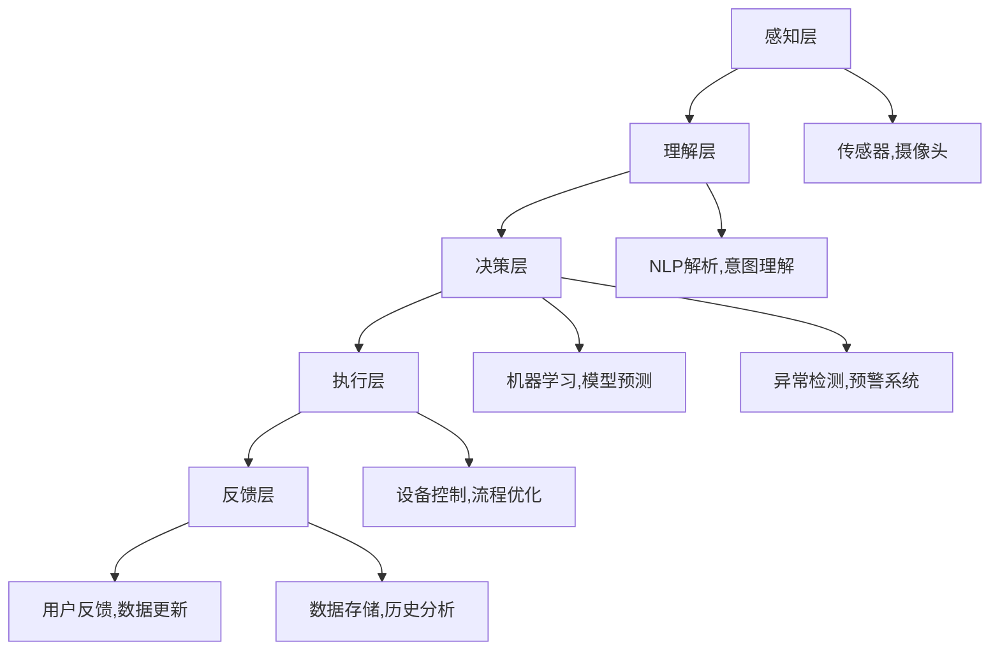

                 

# AI人工智能代理工作流AI Agent WorkFlow：AI代理在物联网场景的应用

> 关键词：人工智能代理(AI Agent),物联网(IoT),工作流(WorkFlow),机器学习(ML),自然语言处理(NLP),智能制造,智慧城市

## 1. 背景介绍

### 1.1 问题由来

随着物联网(IoT)技术的发展，大量智能设备和传感器被广泛应用于生产、生活、交通、安防等多个领域，产生的海量数据需要进行实时处理和分析，以优化资源配置，提升效率，增强安全性。然而，传统的物联网系统往往依赖于中心化的数据中心和人工干预，缺乏灵活性和智能化的处理能力，无法及时应对复杂多变的业务需求。

人工智能代理(AI Agent)作为一种智能化的解决方案，逐渐成为物联网系统的关键组件。AI Agent通过机器学习、自然语言处理(NLP)等技术，具备强大的自动化处理和智能化决策能力，能够实时响应和处理各类物联网场景下的业务需求。AI Agent在生产制造、智慧城市、智能交通等多个领域的应用，正在推动物联网系统的智能化转型。

### 1.2 问题核心关键点

AI Agent的核心价值在于其智能化和自主化能力。通过整合机器学习、NLP、知识表示等前沿技术，AI Agent能够实现自主学习、决策和执行，高效处理各类复杂的物联网业务。

AI Agent的工作流一般包含以下几个关键步骤：

1. **感知**：通过传感器、摄像头等设备获取实时数据，识别目标对象和环境状态。
2. **理解**：使用NLP技术解析用户指令和上下文信息，理解业务需求。
3. **决策**：通过机器学习模型分析数据，预测业务趋势和结果，制定行动方案。
4. **执行**：自动执行预定操作，如调整设备参数、优化流程、报警处理等。
5. **反馈**：根据执行结果和用户反馈，不断优化模型和策略，提升AI Agent的智能化水平。

通过这一循环迭代过程，AI Agent能够不断学习并适应复杂的物联网环境，提升系统的灵活性和智能化程度。

### 1.3 问题研究意义

AI Agent的工作流技术正在推动物联网系统的智能化升级，对于提高资源利用效率、优化业务流程、提升用户体验具有重要意义：

1. **提升生产效率**：在智能制造领域，AI Agent能够实时监控生产线和设备状态，预测故障和能耗，优化生产计划，减少停机时间，提升产量和品质。
2. **增强应急响应**：在智慧城市和安防领域，AI Agent能够实时分析监控数据，识别异常事件，快速响应和处理突发情况，保障城市安全。
3. **优化资源配置**：通过分析设备运行数据和用户需求，AI Agent能够动态调整资源分配，提升能源利用效率，降低运营成本。
4. **改善用户体验**：在智能家居和智能医疗领域，AI Agent能够理解用户需求，自动调整设备和环境设置，提供个性化服务，提升用户体验。
5. **推动智能化转型**：通过AI Agent的智能决策和执行，企业能够实现业务流程自动化，加速数字化转型，提升市场竞争力。

## 2. 核心概念与联系

### 2.1 核心概念概述

为了更好地理解AI Agent的工作流技术，本节将介绍几个核心概念及其相互关系：

- **AI Agent**：一种具备自主感知、理解、决策和执行能力的智能化组件。通过整合机器学习、NLP、知识表示等技术，AI Agent能够处理复杂物联网场景下的业务需求。

- **物联网(IoT)**：通过连接各种智能设备和传感器，实现设备之间的数据交互和信息共享。物联网为AI Agent提供了丰富的数据来源和应用场景。

- **机器学习(ML)**：通过数据驱动的方法，让计算机系统自主学习和优化模型，提升AI Agent的智能化水平。机器学习是AI Agent决策和执行的核心算法。

- **自然语言处理(NLP)**：使计算机能够理解和生成自然语言，实现与用户的智能交互。NLP技术帮助AI Agent理解用户指令和业务需求。

- **工作流(WorkFlow)**：定义和执行一系列任务的流程和逻辑。AI Agent的工作流技术，实现了任务的自动化和智能化处理。

- **智能制造**：通过物联网和AI Agent的协同工作，实现智能化的生产过程和设备管理，提升生产效率和质量。

- **智慧城市**：利用AI Agent实现城市运行数据的智能化分析和管理，提升城市的安全性、便捷性和可持续性。

- **智能交通**：通过AI Agent优化交通流量和路况预测，提升交通效率和安全性。

这些核心概念共同构成了AI Agent技术的应用框架，使其能够灵活应对各类物联网场景，实现业务自动化和智能化。

### 2.2 核心概念原理和架构的 Mermaid 流程图



这个流程图展示了AI Agent工作流的核心组件和流程：

1. **感知层**：通过传感器、摄像头等设备获取实时数据。
2. **理解层**：使用NLP技术解析用户指令和上下文信息。
3. **决策层**：通过机器学习模型分析数据，预测业务趋势和结果。
4. **执行层**：自动执行预定操作，如调整设备参数、优化流程等。
5. **反馈层**：根据执行结果和用户反馈，优化模型和策略。

## 3. 核心算法原理 & 具体操作步骤
### 3.1 算法原理概述

AI Agent的工作流技术本质上是一个基于机器学习和NLP的智能化决策系统。其核心算法原理包括以下几个方面：

1. **感知算法**：通过传感器和摄像头等设备，实时采集环境数据和设备状态。感知算法需要将原始数据转换为机器可处理的形式，提取关键特征。

2. **理解算法**：使用NLP技术解析用户指令和上下文信息，理解业务需求。理解算法需要设计合适的模型和解码策略，实现高效的意图理解。

3. **决策算法**：通过机器学习模型分析数据，预测业务趋势和结果。决策算法需要选择合适的算法和模型结构，提升预测精度和鲁棒性。

4. **执行算法**：根据决策结果，自动执行预定操作。执行算法需要与设备控制和流程管理接口进行对接，确保操作正确无误。

5. **反馈算法**：根据执行结果和用户反馈，不断优化模型和策略。反馈算法需要设计合适的评估指标和迭代策略，提升AI Agent的智能化水平。

### 3.2 算法步骤详解

以下详细讲解AI Agent工作流技术的核心算法步骤：

**Step 1: 数据采集与感知**

1. 部署传感器、摄像头等设备，实时采集环境数据和设备状态。
2. 将采集到的数据进行预处理，提取关键特征。
3. 使用感知算法将原始数据转换为机器可处理的形式。

**Step 2: 意图理解**

1. 通过NLP技术解析用户指令和上下文信息，理解业务需求。
2. 设计合适的意图识别模型，提取关键信息。
3. 使用解码策略生成意图表示，供后续决策使用。

**Step 3: 模型预测与决策**

1. 选择合适的机器学习模型，输入感知和理解结果，进行预测。
2. 设计合适的模型评估指标和优化策略，提升预测精度。
3. 根据预测结果，生成决策方案。

**Step 4: 执行与优化**

1. 将决策结果转换为可执行的命令，控制设备和流程。
2. 设计合适的执行监控机制，确保操作正确无误。
3. 根据执行结果和用户反馈，优化模型和策略。

**Step 5: 持续学习**

1. 设计合适的反馈算法，评估模型性能。
2. 根据反馈结果，不断更新和优化模型。
3. 设计合适的评估指标，评估AI Agent的智能化水平。

### 3.3 算法优缺点

AI Agent的工作流技术具有以下优点：

1. **高效处理复杂任务**：通过机器学习和NLP技术，AI Agent能够高效处理复杂的物联网场景，提升业务处理速度和精度。
2. **自主决策与执行**：AI Agent具备自主感知、理解、决策和执行能力，能够实时响应和处理业务需求，提升系统的灵活性和智能化程度。
3. **灵活性高**：AI Agent可以根据不同的业务需求和数据特点，灵活调整算法和模型，适应不同的应用场景。
4. **可扩展性强**：通过分布式架构和模块化设计，AI Agent能够轻松扩展处理能力，满足大流量和高并发的业务需求。

同时，该技术也存在以下缺点：

1. **数据依赖性强**：AI Agent需要大量高质量的数据进行训练，数据采集和处理成本较高。
2. **模型复杂度较高**：AI Agent的感知、理解、决策和执行算法复杂，开发和调试难度较大。
3. **鲁棒性不足**：在面对复杂多变的环境和异常情况时，AI Agent的预测和决策能力可能受到影响。
4. **可解释性不足**：AI Agent的决策过程缺乏可解释性，难以进行调试和优化。
5. **安全性问题**：AI Agent的决策可能受到模型偏见、数据噪音等因素的影响，存在安全隐患。

尽管存在这些局限性，但AI Agent的工作流技术已经在物联网领域得到了广泛应用，并在多个业务场景中取得了显著成效。未来相关研究仍需关注如何降低数据依赖，提高模型鲁棒性，增强可解释性，确保安全性等问题。

### 3.4 算法应用领域

AI Agent的工作流技术已经在多个物联网场景中得到了应用，例如：

1. **智能制造**：通过AI Agent实时监控生产线设备状态，预测故障和能耗，优化生产计划，提升生产效率和质量。
2. **智慧城市**：利用AI Agent实时分析监控数据，识别异常事件，快速响应和处理突发情况，保障城市安全。
3. **智能交通**：通过AI Agent优化交通流量和路况预测，提升交通效率和安全性。
4. **智能家居**：通过AI Agent理解用户需求，自动调整设备和环境设置，提供个性化服务，提升用户体验。
5. **智能医疗**：利用AI Agent实时分析患者数据，提供个性化的诊疗方案，提升医疗服务质量。
6. **智能安防**：通过AI Agent实时分析监控视频，识别异常行为，提高安防系统的智能化水平。
7. **智能客服**：利用AI Agent自动处理用户咨询和投诉，提升客户服务质量。

除了这些经典应用场景外，AI Agent的工作流技术还在智能物流、智能农业、智能零售等多个领域得到了创新性应用，为物联网系统带来了新的突破。

## 4. 数学模型和公式 & 详细讲解 & 举例说明
### 4.1 数学模型构建

以下通过数学语言对AI Agent的工作流技术进行严格刻画：

设AI Agent的感知数据为 $X$，意图理解结果为 $U$，决策结果为 $D$，执行操作为 $E$，反馈数据为 $F$。

**感知算法**：
$$
\phi(X) = (X_1, X_2, ..., X_n)
$$
其中 $X_i$ 表示第 $i$ 个感知数据。

**理解算法**：
$$
\psi(U|X) = P(U|X)
$$
其中 $P(U|X)$ 表示在给定 $X$ 的条件下，$U$ 的概率分布。

**决策算法**：
$$
\delta(D|U) = \max_{D'} P(D'|U)
$$
其中 $P(D'|U)$ 表示在给定 $U$ 的条件下，$D'$ 的概率。

**执行算法**：
$$
E(D) = F(D)
$$
其中 $F(D)$ 表示将决策结果 $D$ 转换为可执行的操作 $E$。

**反馈算法**：
$$
\beta(F|E) = P(F|E)
$$
其中 $P(F|E)$ 表示在给定 $E$ 的条件下，$F$ 的概率分布。

### 4.2 公式推导过程

以下对AI Agent工作流技术的核心算法进行公式推导：

**感知算法**：
$$
\phi(X) = \{x_1, x_2, ..., x_n\}
$$

**理解算法**：
$$
P(U|X) = \frac{P(U,X)}{P(X)}
$$
其中 $P(U,X)$ 表示 $U$ 和 $X$ 的联合概率分布。

**决策算法**：
$$
P(D'|U) = \sum_{D'} P(D',U)
$$
其中 $P(D',U)$ 表示在给定 $U$ 的条件下，$D'$ 和 $U$ 的联合概率分布。

**执行算法**：
$$
E(D) = f(D')
$$
其中 $f$ 表示将决策结果 $D'$ 转换为可执行操作 $E$ 的映射函数。

**反馈算法**：
$$
P(F|E) = \frac{P(F,E)}{P(E)}
$$
其中 $P(F,E)$ 表示 $F$ 和 $E$ 的联合概率分布。

### 4.3 案例分析与讲解

假设在智能制造场景下，AI Agent需要实时监控设备状态，预测故障并优化生产计划。

**感知数据**：
$$
X = \{x_1, x_2, ..., x_n\}
$$
其中 $x_i$ 表示第 $i$ 个传感器采集的实时数据。

**意图理解**：
$$
U = "设备状态监测"
$$
其中 $U$ 表示意图理解结果。

**决策结果**：
$$
D = "设备状态正常" 或 "设备状态异常"
$$
其中 $D$ 表示决策结果。

**执行操作**：
$$
E = "启动自检" 或 "执行维护"
$$
其中 $E$ 表示执行操作。

**反馈数据**：
$$
F = "设备恢复正常运行" 或 "维护完成"
$$
其中 $F$ 表示反馈数据。

通过以上数学模型，AI Agent能够实时处理生产设备的感知数据，解析用户指令，进行故障预测和生产计划优化，并根据执行结果和用户反馈不断调整模型和策略，提升智能化水平。

## 5. 项目实践：代码实例和详细解释说明
### 5.1 开发环境搭建

以下是使用Python进行TensorFlow开发的环境配置流程：

1. 安装Anaconda：从官网下载并安装Anaconda，用于创建独立的Python环境。

2. 创建并激活虚拟环境：
```bash
conda create -n tf-env python=3.8 
conda activate tf-env
```

3. 安装TensorFlow：根据CUDA版本，从官网获取对应的安装命令。例如：
```bash
conda install tensorflow tensorflow-gpu=cuda11.1 -c conda-forge
```

4. 安装TensorBoard：
```bash
pip install tensorboard
```

5. 安装各类工具包：
```bash
pip install numpy pandas scikit-learn matplotlib tqdm jupyter notebook ipython
```

完成上述步骤后，即可在`tf-env`环境中开始项目实践。

### 5.2 源代码详细实现

以下是使用TensorFlow实现AI Agent的代码示例：

```python
import tensorflow as tf
from tensorflow.keras.layers import Input, Dense, LSTM, Embedding, Dropout
from tensorflow.keras.models import Model
from tensorflow.keras.optimizers import Adam

# 定义感知层
def perception_layer(inputs, embedding_dim):
    perception_input = Input(shape=(None,), name='perception_input')
    perception = Dense(embedding_dim, activation='relu')(perception_input)
    perception = LSTM(64, return_sequences=True)(perception)
    perception = Dropout(0.5)(perception)
    return perception

# 定义理解层
def understanding_layer(inputs, embedding_dim, vocabulary_size):
    understanding_input = Input(shape=(None,), name='understanding_input')
    embedding = Embedding(vocabulary_size, embedding_dim)(understanding_input)
    understanding = Dense(64, activation='relu')(embedding)
    understanding = Dropout(0.5)(understanding)
    return understanding

# 定义决策层
def decision_layer(inputs, embedding_dim):
    decision_input = Input(shape=(None,), name='decision_input')
    decision = Dense(64, activation='relu')(decision_input)
    decision = Dropout(0.5)(decision)
    return decision

# 定义执行层
def execution_layer(inputs, embedding_dim):
    execution_input = Input(shape=(None,), name='execution_input')
    execution = Dense(64, activation='relu')(execution_input)
    execution = Dropout(0.5)(execution)
    return execution

# 定义模型
def ai_agent_model(embedding_dim, vocabulary_size):
    perception = perception_layer(perception_input, embedding_dim)
    understanding = understanding_layer(understanding_input, embedding_dim, vocabulary_size)
    decision = decision_layer(tf.concat([perception, understanding], axis=-1), embedding_dim)
    execution = execution_layer(execution_input, embedding_dim)
    
    ai_agent = Model(inputs=[perception_input, understanding_input, execution_input], outputs=[execution])
    return ai_agent

# 构建模型
ai_agent = ai_agent_model(embedding_dim=64, vocabulary_size=10)

# 编译模型
ai_agent.compile(optimizer=Adam(learning_rate=0.001), loss='mse')

# 训练模型
ai_agent.fit(X_train, y_train, epochs=10, validation_data=(X_val, y_val))

# 评估模型
loss = ai_agent.evaluate(X_test, y_test)
print('Test loss:', loss)
```

在这个代码示例中，我们使用TensorFlow实现了一个简单的AI Agent模型。具体步骤如下：

1. **感知层**：通过LSTM和Dropout层处理感知数据，提取关键特征。
2. **理解层**：使用Embedding层将意图理解结果转换为向量表示，并使用Dense和Dropout层进行特征提取。
3. **决策层**：通过Dense和Dropout层进行决策特征的提取和降维。
4. **执行层**：使用Dense和Dropout层生成可执行操作。
5. **模型构建**：将感知、理解、决策和执行层进行拼接，构建完整的AI Agent模型。
6. **模型编译和训练**：使用Adam优化器和MSE损失函数编译模型，并使用训练数据进行模型训练。
7. **模型评估**：在测试数据上评估模型性能，输出测试损失。

### 5.3 代码解读与分析

让我们进一步解读代码中的关键步骤：

**感知层**：
- 通过LSTM和Dropout层处理感知数据，提取关键特征。
- 感知输入数据为 $X$，使用Dense层进行特征提取，LSTM层进行序列建模，Dropout层进行正则化。

**理解层**：
- 通过Embedding层将意图理解结果转换为向量表示。
- 理解输入数据为 $U$，使用Embedding层将自然语言转换为向量表示，Dense层和Dropout层进行特征提取和正则化。

**决策层**：
- 通过Dense和Dropout层进行决策特征的提取和降维。
- 决策输入数据为 $D$，使用Dense层进行特征提取，Dropout层进行正则化。

**执行层**：
- 使用Dense和Dropout层生成可执行操作。
- 执行输入数据为 $E$，使用Dense层进行特征提取，Dropout层进行正则化。

**模型构建**：
- 将感知、理解、决策和执行层进行拼接，构建完整的AI Agent模型。
- 使用Model函数构建模型，指定输入和输出层。

**模型编译和训练**：
- 使用Adam优化器和MSE损失函数编译模型，并使用训练数据进行模型训练。
- 设置合适的学习率和优化器参数，训练模型。

**模型评估**：
- 在测试数据上评估模型性能，输出测试损失。
- 使用evaluate函数评估模型，输出测试损失。

## 6. 实际应用场景
### 6.1 智能制造

在智能制造领域，AI Agent被广泛应用于生产线的监控和优化。通过实时采集设备状态数据和传感器数据，AI Agent能够实时监测生产设备的运行状况，预测设备故障和能耗，优化生产计划。

**应用场景**：
- **设备状态监测**：通过感知层实时采集传感器数据，理解层解析设备状态信息，决策层进行故障预测，执行层根据预测结果进行设备维护。
- **生产计划优化**：通过感知层实时采集生产线数据，理解层解析生产计划，决策层进行生产调度和资源分配，执行层根据优化结果调整设备参数。

**技术实现**：
- **感知层**：通过部署传感器和摄像头，实时采集生产设备的运行状态和环境数据。
- **理解层**：使用NLP技术解析生产指令和调度计划，理解业务需求。
- **决策层**：通过机器学习模型分析设备数据，预测故障和能耗，制定优化方案。
- **执行层**：自动执行生产调度和设备维护操作，提升生产效率和质量。

### 6.2 智慧城市

在智慧城市领域，AI Agent被广泛应用于城市运行数据的实时分析和处理，提升城市的安全性和便捷性。

**应用场景**：
- **交通流量监测**：通过感知层实时采集交通监控数据，理解层解析用户需求，决策层进行交通流量预测和优化，执行层根据预测结果调整交通信号和路线。
- **紧急事件响应**：通过感知层实时采集监控视频和传感器数据，理解层解析事件类型和位置，决策层进行应急响应和资源分配，执行层根据方案执行紧急处理。

**技术实现**：
- **感知层**：通过部署摄像头和传感器，实时采集城市运行数据和监控视频。
- **理解层**：使用NLP技术解析用户指令和事件信息，理解业务需求。
- **决策层**：通过机器学习模型分析数据，预测交通流量和事件趋势，制定应急响应方案。
- **执行层**：自动执行交通调度和紧急处理操作，提升城市安全性和便捷性。

### 6.3 智能交通

在智能交通领域，AI Agent被广泛应用于交通流量的预测和优化，提升交通效率和安全性。

**应用场景**：
- **交通流量预测**：通过感知层实时采集交通数据，理解层解析路线信息，决策层进行交通流量预测，执行层根据预测结果调整交通信号和路线。
- **事故处理**：通过感知层实时采集事故现场数据，理解层解析事故信息，决策层进行应急处理和资源分配，执行层根据方案执行事故处理。

**技术实现**：
- **感知层**：通过部署传感器和摄像头，实时采集交通数据和事故现场信息。
- **理解层**：使用NLP技术解析路线信息和事故类型，理解业务需求。
- **决策层**：通过机器学习模型分析数据，预测交通流量和事故趋势，制定应急处理方案。
- **执行层**：自动执行交通调度和事故处理操作，提升交通效率和安全性。

## 7. 工具和资源推荐
### 7.1 学习资源推荐

为了帮助开发者系统掌握AI Agent的工作流技术，这里推荐一些优质的学习资源：

1. **《TensorFlow实战指南》系列博文**：由TensorFlow官方和社区贡献者撰写，深入浅出地介绍了TensorFlow的基本概念和实践技巧。

2. **《深度学习理论与实践》课程**：由斯坦福大学开设的深度学习课程，涵盖了深度学习的基本理论和实践应用，适合初学者和进阶开发者。

3. **《AI Agent Design and Implementation》书籍**：详细介绍了AI Agent的设计和实现方法，涵盖感知、理解、决策和执行等多个组件。

4. **TensorFlow官方文档**：提供了丰富的API文档和样例代码，是TensorFlow开发的首选资源。

5. **Kaggle竞赛平台**：提供了大量的AI Agent项目和数据集，适合实践和验证AI Agent算法。

通过对这些资源的学习实践，相信你一定能够快速掌握AI Agent的工作流技术，并用于解决实际的物联网问题。

### 7.2 开发工具推荐

高效的开发离不开优秀的工具支持。以下是几款用于AI Agent开发的常用工具：

1. **TensorFlow**：基于Python的开源深度学习框架，适合进行复杂的模型训练和推理。

2. **TensorBoard**：TensorFlow配套的可视化工具，可以实时监测模型训练状态，并提供丰富的图表呈现方式。

3. **Jupyter Notebook**：开源的交互式编程环境，支持Python和其他语言，适合快速原型开发和协作。

4. **Keras**：基于TensorFlow和Theano等框架的高层API，适合快速构建和调试深度学习模型。

5. **PyTorch**：基于Python的开源深度学习框架，适合进行灵活的模型设计和优化。

合理利用这些工具，可以显著提升AI Agent开发效率，加快创新迭代的步伐。

### 7.3 相关论文推荐

AI Agent的工作流技术源于学界的持续研究。以下是几篇奠基性的相关论文，推荐阅读：

1. **《深度强化学习：用于环境建模、策略学习和任务执行的算法》**：提出了深度强化学习算法，用于AI Agent的自主学习和决策。

2. **《使用深度学习的自然语言理解》**：介绍了NLP技术在意图理解、情感分析等方面的应用。

3. **《智能制造中的AI Agent》**：探讨了AI Agent在智能制造中的应用场景和实现方法。

4. **《智慧城市中的AI Agent》**：介绍了AI Agent在智慧城市中的应用场景和设计思路。

5. **《智能交通中的AI Agent》**：介绍了AI Agent在智能交通中的应用场景和实现方法。

这些论文代表了大规模语言模型微调技术的发展脉络。通过学习这些前沿成果，可以帮助研究者把握学科前进方向，激发更多的创新灵感。

## 8. 总结：未来发展趋势与挑战

### 8.1 总结

本文对AI Agent的工作流技术进行了全面系统的介绍。首先阐述了AI Agent在物联网领域的应用背景和核心价值，明确了其智能化和自主化处理能力。其次，从原理到实践，详细讲解了AI Agent的核心算法步骤，给出了完整的代码实例。同时，本文还广泛探讨了AI Agent在智能制造、智慧城市、智能交通等多个领域的应用前景，展示了其巨大的潜力。此外，本文精选了AI Agent技术的各类学习资源，力求为开发者提供全方位的技术指引。

通过本文的系统梳理，可以看到，AI Agent的工作流技术正在推动物联网系统的智能化升级，对于提高资源利用效率、优化业务流程、提升用户体验具有重要意义。AI Agent通过整合机器学习、NLP等前沿技术，具备强大的自主感知、理解、决策和执行能力，能够实时响应和处理各类物联网业务需求，提升系统的灵活性和智能化程度。未来，伴随AI Agent技术的不断演进，物联网系统的智能化水平将进一步提升，助力企业数字化转型，构建更智能、高效、安全的城市和生产环境。

### 8.2 未来发展趋势

展望未来，AI Agent的工作流技术将呈现以下几个发展趋势：

1. **智能化水平提升**：随着深度学习算法和NLP技术的不断发展，AI Agent的智能化水平将进一步提升，具备更加精确的感知、理解和决策能力。

2. **跨领域融合**：AI Agent将与物联网设备、云计算平台、大数据分析等技术进行深度融合，实现跨领域协同作业，提升系统的整体智能化水平。

3. **自主学习与适应**：AI Agent将具备更加灵活的自主学习能力和适应能力，能够动态调整模型和策略，适应不同业务场景和数据特点。

4. **安全性与隐私保护**：随着AI Agent在更多领域的应用，其安全性与隐私保护将受到更多关注。未来的AI Agent将具备更强的安全机制和隐私保护措施。

5. **人机协作**：AI Agent将与人类用户进行更加紧密的协作，提升用户体验和互动效果。未来，AI Agent将成为人机协同的重要组成部分。

6. **多模态融合**：AI Agent将融合视觉、听觉、触觉等多模态数据，提升对复杂环境的感知和理解能力。

7. **自适应学习**：AI Agent将具备自适应学习能力，能够不断更新和优化模型，提升系统的适应性和灵活性。

### 8.3 面临的挑战

尽管AI Agent的工作流技术已经取得了显著成就，但在迈向更加智能化、普适化应用的过程中，它仍面临着诸多挑战：

1. **数据依赖性强**：AI Agent需要大量高质量的数据进行训练，数据采集和处理成本较高。

2. **模型复杂度高**：AI Agent的感知、理解、决策和执行算法复杂，开发和调试难度较大。

3. **鲁棒性不足**：在面对复杂多变的环境和异常情况时，AI Agent的预测和决策能力可能受到影响。

4. **可解释性不足**：AI Agent的决策过程缺乏可解释性，难以进行调试和优化。

5. **安全性问题**：AI Agent的决策可能受到模型偏见、数据噪音等因素的影响，存在安全隐患。

6. **跨领域应用难度大**：不同领域的业务需求和数据特点不同，AI Agent在跨领域应用时，需要设计多种模型和算法，增加了开发难度。

尽管存在这些挑战，但AI Agent的工作流技术已经在物联网领域得到了广泛应用，并在多个业务场景中取得了显著成效。未来相关研究仍需关注如何降低数据依赖，提高模型鲁棒性，增强可解释性，确保安全性等问题。

### 8.4 研究展望

未来的研究需要在以下几个方面寻求新的突破：

1. **多模态融合**：将视觉、听觉、触觉等多模态数据进行融合，提升AI Agent对复杂环境的感知和理解能力。

2. **自主学习与适应**：设计更加灵活的自主学习算法，使AI Agent能够动态调整模型和策略，适应不同业务场景和数据特点。

3. **安全性与隐私保护**：开发更强的安全机制和隐私保护措施，确保AI Agent的决策和执行过程符合伦理和安全标准。

4. **人机协作**：设计更灵活的人机交互界面，提升用户体验和互动效果，使AI Agent更好地服务于人类用户。

5. **跨领域应用**：开发跨领域的AI Agent模型和算法，实现不同业务场景之间的协同作业，提升系统的整体智能化水平。

6. **模型压缩与优化**：通过模型压缩和优化技术，提升AI Agent的计算效率和推理速度，适应大规模应用场景。

通过这些研究方向，未来AI Agent的工作流技术将在更多领域得到应用，为物联网系统的智能化转型提供新的动力。相信伴随AI Agent技术的不断演进，物联网系统将迎来更加智能化、高效、安全的未来。

## 9. 附录：常见问题与解答

**Q1：AI Agent在智能制造中的具体应用场景有哪些？**

A: AI Agent在智能制造中的应用场景主要包括以下几个方面：

1. **设备状态监测**：通过实时采集传感器数据，解析设备状态信息，进行故障预测和维护。
2. **生产计划优化**：通过实时采集生产线数据，解析生产指令和调度计划，进行生产调度和资源分配。
3. **能耗优化**：通过实时监控设备运行状态和能耗数据，预测能耗趋势，优化能耗使用。
4. **质量控制**：通过实时采集生产数据和检测数据，解析产品质量信息，进行质量控制和异常处理。

**Q2：AI Agent在智慧城市中的具体应用场景有哪些？**

A: AI Agent在智慧城市中的应用场景主要包括以下几个方面：

1. **交通流量监测**：通过实时采集交通监控数据，解析路线信息，进行交通流量预测和优化。
2. **紧急事件响应**：通过实时采集监控视频和传感器数据，解析事件类型和位置，进行应急响应和资源分配。
3. **能源管理**：通过实时监控城市能源数据，预测能源需求，进行能源调度和优化。
4. **环境监测**：通过实时采集环境数据，解析环境信息，进行环境监测和预警。

**Q3：如何设计AI Agent的感知层和理解层？**

A: AI Agent的感知层和理解层设计需要考虑以下几个方面：

1. **感知层**：通过传感器和摄像头等设备，实时采集环境数据和设备状态，将原始数据转换为机器可处理的形式，提取关键特征。
2. **理解层**：使用NLP技术解析用户指令和上下文信息，理解业务需求。
3. **选择合适的算法和模型结构**：感知层可以使用LSTM和Dropout等算法进行特征提取，理解层可以使用Embedding和Dense等算法进行意图解析。
4. **设计合适的输入和输出**：感知层的输入为传感器和摄像头数据，理解层的输入为用户指令和上下文信息，输出为意图表示和理解结果。

通过以上步骤，可以设计出高效的感知层和理解层，提升AI Agent的智能化水平。

**Q4：如何优化AI Agent的决策层和执行层？**

A: AI Agent的决策层和执行层优化需要考虑以下几个方面：

1. **决策层**：通过机器学习模型分析数据，预测业务趋势和结果，制定行动方案。
2. **选择合适的算法和模型结构**：决策层可以使用Dense和Dropout等算法进行特征提取和降维，使用RNN等算法进行序列建模。
3. **设计合适的输入和输出**：决策层的输入为感知层和理解层的输出，输出为决策结果。
4. **优化模型和策略**：通过评估指标和迭代策略，不断优化模型和策略，提升预测精度和决策效果。

通过以上步骤，可以设计出高效的决策层和执行层，提升AI Agent的智能化水平。

**Q5：AI Agent在智能交通中的应用场景有哪些？**

A: AI Agent在智能交通中的应用场景主要包括以下几个方面：

1. **交通流量预测**：通过实时采集交通数据，解析路线信息，进行交通流量预测和优化。
2. **事故处理**：通过实时采集事故现场数据，解析事故信息，进行应急响应和资源分配。
3. **路径规划**：通过实时采集地图数据和车辆状态，解析路径信息，进行路径规划和优化。
4. **公共交通管理**：通过实时监控公共交通数据，解析乘客需求，进行资源分配和调度。

通过以上应用场景，AI Agent可以提升交通系统的智能化和安全性，优化交通流量和路网管理。

---

作者：禅与计算机程序设计艺术 / Zen and the Art of Computer Programming

