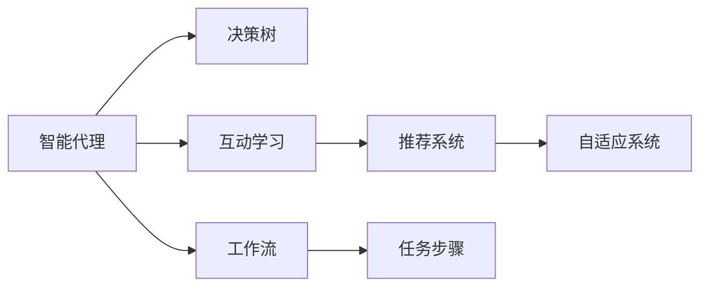

                 

## 1. 背景介绍

人工智能（AI）代理工作流，是指利用智能代理系统执行复杂工作流，并通过互动学习机制不断优化其执行过程。这种技术在自动化流程管理、客户服务、数据分析等领域展现出巨大的应用潜力。在AI代理工作流中，智能代理不仅需要完成预定义的任务，还需通过与人类用户、系统间的互动学习，提升工作流效率和适应性。互动学习在工作流中的应用，可以进一步增强系统的自适应能力，使其能够更好地应对复杂、多变的任务场景。

### 1.1 问题由来
当前，许多企业采用传统的工作流管理系统，但这些系统存在一些显著的局限性：
- **效率低**：传统工作流系统依赖人工干预，无法自动适应变化，导致效率低下。
- **弹性差**：面对突发事件或复杂任务，传统系统难以灵活调整，灵活性不足。
- **成本高**：实施、维护传统工作流系统需要大量人力物力，并难以快速响应业务需求变化。

人工智能代理工作流通过机器学习、自然语言处理、强化学习等技术，实现智能代理系统的自主决策与执行，并通过互动学习持续优化系统，提高工作流管理的智能化水平，降低实施和维护成本。

### 1.2 问题核心关键点
互动学习在工作流中的应用关键点包括：
- **用户-代理交互**：智能代理需与用户进行自然的交互，获取任务信息并完成任务。
- **系统-代理交互**：智能代理还需与系统进行互动，如数据收集、任务调度等。
- **学习机制**：智能代理需要具备学习机制，从每次交互中积累经验，提升执行效率和适应性。
- **优化目标**：工作流管理的优化目标包括提升效率、降低成本、提高质量等，互动学习需聚焦于这些关键目标。

通过上述关键点，智能代理工作流将融合人工智能技术与工作流管理，实现自主、智能的工作流管理系统。

## 2. 核心概念与联系

### 2.1 核心概念概述

在智能代理工作流中，几个核心概念如下：

- **智能代理**：通过学习与推理机制，执行复杂任务并不断自我优化的自主系统。
- **工作流**：一系列预定义的任务步骤，按照特定逻辑顺序执行，实现业务流程的自动化管理。
- **互动学习**：智能代理通过与用户、系统的交互，从每次任务执行中学习，提升执行能力和系统性能。
- **决策树**：用于描述智能代理决策过程的树形结构，从输入到输出逐步推理。
- **推荐系统**：用于根据用户行为、历史数据等推荐任务执行路径的系统。
- **自适应系统**：根据环境变化自动调整执行策略的系统。

这些概念之间的联系可以通过以下Mermaid流程图来展示：



这个流程图展示出智能代理如何通过决策树执行任务，并通过互动学习机制与推荐系统、自适应系统结合，提升执行效率和适应性。

### 2.2 核心概念原理和架构

**智能代理**：智能代理通常由前端用户界面、后端服务逻辑、数据存储和通信模块组成。前端与用户交互，后端进行任务处理和数据计算，数据存储用于记录代理状态和历史交互记录，通信模块负责系统间数据交换。

**工作流**：工作流管理系统（Workflow Management System, WMS）定义了一系列任务步骤及其执行逻辑。任务步骤可以包括数据收集、模型训练、任务调度等。工作流还通过配置引擎实现动态任务调度，适应不同业务需求。

**互动学习**：互动学习通过强化学习（Reinforcement Learning, RL）、迁移学习（Transfer Learning）和监督学习（Supervised Learning）等技术实现。智能代理通过与用户、系统的互动，获取任务反馈信息，调整执行策略，优化工作流管理。

**决策树**：决策树是一种基于规则的推理机制，用于描述智能代理决策过程。节点表示决策条件，分支表示不同决策结果，最终节点表示任务执行结果。

**推荐系统**：推荐系统利用机器学习算法，根据用户历史行为和数据特征，推荐最优的任务执行路径，提高工作流管理效率。

**自适应系统**：自适应系统通过不断调整执行策略和参数，实现对环境变化的快速响应，优化工作流管理。

## 3. 核心算法原理 & 具体操作步骤

### 3.1 算法原理概述

智能代理工作流中的核心算法包括强化学习、迁移学习和监督学习等。这些算法通过互动学习机制，不断提升智能代理的执行能力和系统性能。

- **强化学习**：通过智能代理与环境的交互，获取奖励和惩罚信号，调整策略以最大化长期奖励。
- **迁移学习**：利用已有模型在新任务上的知识，加速模型在新任务的训练过程。
- **监督学习**：使用标注数据训练智能代理，提升其执行任务的能力。

这些算法共同构成智能代理工作流的核心，通过互动学习机制不断优化系统性能。

### 3.2 算法步骤详解

智能代理工作流的算法步骤主要分为以下几个部分：

**Step 1: 数据预处理**
- 收集用户行为数据、历史任务记录、系统运行日志等，进行数据清洗和特征提取。
- 使用特征工程方法，构造适合算法输入的数据格式。

**Step 2: 模型训练**
- 根据任务类型选择合适的算法，进行模型训练。例如，对于推荐系统可以使用协同过滤算法，对于决策树可以使用CART算法。
- 在训练过程中，使用交叉验证等技术评估模型性能，防止过拟合。

**Step 3: 策略调整**
- 根据任务反馈，使用强化学习等算法调整智能代理的执行策略。例如，当任务完成时间过长时，智能代理可以调整任务优先级，提高效率。
- 定期使用迁移学习等技术，从已有模型中迁移知识，加速新任务的学习过程。

**Step 4: 任务执行**
- 智能代理根据用户请求或系统调度，执行工作流中的任务步骤。
- 记录任务执行结果和用户反馈，用于后续优化。

**Step 5: 效果评估**
- 对任务执行结果进行评估，例如使用A/B测试等方法，对比不同策略的执行效果。
- 根据评估结果，持续优化模型和策略，提高工作流管理性能。

### 3.3 算法优缺点

智能代理工作流的算法具有以下优点：
- **自主性高**：智能代理具备自主决策能力，可以自动调整执行策略，适应不同业务场景。
- **学习能力强**：通过互动学习机制，智能代理能够不断优化执行策略，提升系统性能。
- **灵活性强**：通过自适应系统，智能代理可以根据环境变化自动调整策略，适应复杂任务。

但同时，这些算法也存在一些缺点：
- **数据依赖高**：算法需要大量数据进行训练和优化，数据质量和数量直接影响系统性能。
- **模型复杂**：涉及多种算法和策略，系统实现复杂度较高。
- **计算资源消耗大**：模型训练和策略调整需要消耗大量计算资源，对硬件要求较高。

### 3.4 算法应用领域

智能代理工作流已经在多个领域得到了广泛应用，例如：

- **客户服务**：智能客服通过互动学习不断优化对话策略，提升客户满意度。
- **供应链管理**：智能代理通过与系统交互，优化供应链管理流程，提高效率和准确性。
- **数据分析**：智能代理通过互动学习，自动调整数据分析策略，提升数据处理效率。
- **项目管理**：智能代理通过与团队成员互动学习，优化项目管理流程，提高任务执行效率。
- **医疗健康**：智能代理通过与医生和患者互动学习，优化诊疗流程，提高医疗服务质量。

## 4. 数学模型和公式 & 详细讲解 & 举例说明

### 4.1 数学模型构建

在智能代理工作流中，常用的数学模型包括强化学习模型、推荐系统模型和决策树模型。这里以推荐系统为例，介绍数学模型的构建过程。

假设推荐系统面临的任务是推荐用户感兴趣的电影，推荐系统可以根据用户历史行为数据进行训练。设用户历史行为数据为 $(x_1, x_2, ..., x_n)$，推荐系统输出的电影编号为 $y$，其中 $y$ 是 $m$ 个电影的编号。推荐系统的目标是最小化用户不满意的期望，即：

$$
\min_{\theta} \mathbb{E}_{(x,y)} [L(y|\theta; x)]
$$

其中 $L$ 为损失函数，$\theta$ 为推荐系统参数。推荐系统使用协同过滤算法，通过计算用户和电影之间的相似度矩阵，选择相似度最高的电影进行推荐。推荐系统的目标函数可以表示为：

$$
\min_{\theta} \frac{1}{N} \sum_{i=1}^N \sum_{j=1}^m (y_i-y_j)^2
$$

其中 $N$ 为样本数，$y_i$ 为第 $i$ 个用户的推荐结果，$y_j$ 为第 $j$ 个电影的推荐结果。

### 4.2 公式推导过程

以下是协同过滤算法的具体推导过程：

1. **相似度计算**
   - 假设用户 $u$ 和电影 $p$ 的相似度为 $s(u, p)$，可以使用余弦相似度或皮尔逊相关系数等方法计算。
   - 假设用户 $u$ 喜欢的电影为 $r_u$，所有电影的相似度矩阵为 $S$，则推荐系统的目标可以表示为：

$$
\min_{\theta} \frac{1}{N} \sum_{i=1}^N \sum_{j=1}^m (y_i-y_j)^2
$$

2. **优化算法**
   - 使用梯度下降算法优化损失函数，每次迭代更新参数 $\theta$。
   - 梯度下降算法的更新公式为：

$$
\theta_{t+1} = \theta_t - \eta \nabla_{\theta} \mathcal{L}(\theta)
$$

其中 $\eta$ 为学习率，$\nabla_{\theta} \mathcal{L}(\theta)$ 为损失函数的梯度。

### 4.3 案例分析与讲解

以Netflix推荐系统为例，其推荐算法使用协同过滤和矩阵分解。具体步骤如下：

1. **数据准备**
   - 收集用户历史行为数据，包括观看记录、评分记录等。
   - 将数据转换为矩阵形式，用户-电影评分矩阵 $R$。

2. **模型训练**
   - 使用矩阵分解算法，将用户和电影的评分表示为低秩矩阵形式。
   - 使用梯度下降算法优化模型参数，最小化损失函数。

3. **策略调整**
   - 根据用户反馈，调整推荐策略，如调整相似度计算方法、增加用户个性化特征等。
   - 使用迁移学习技术，从已有模型中迁移知识，加速新任务的学习过程。

## 5. 项目实践：代码实例和详细解释说明

### 5.1 开发环境搭建

在进行智能代理工作流开发前，需要准备好开发环境。以下是使用Python进行TensorFlow开发的环境配置流程：

1. 安装Anaconda：从官网下载并安装Anaconda，用于创建独立的Python环境。

2. 创建并激活虚拟环境：
```bash
conda create -n tf-env python=3.8 
conda activate tf-env
```

3. 安装TensorFlow：根据CUDA版本，从官网获取对应的安装命令。例如：
```bash
conda install tensorflow -c pytorch -c conda-forge
```

4. 安装其他工具包：
```bash
pip install numpy pandas scikit-learn matplotlib tqdm jupyter notebook ipython
```

完成上述步骤后，即可在`tf-env`环境中开始智能代理工作流开发。

### 5.2 源代码详细实现

下面我们以推荐系统为例，给出使用TensorFlow对协同过滤算法进行微调的Python代码实现。

首先，定义推荐系统的数据处理函数：

```python
import tensorflow as tf
import numpy as np

def data_processing(data):
    # 将数据转换为矩阵形式
    R = np.array(data, dtype=np.float32)
    return R
```

然后，定义推荐系统的优化目标函数：

```python
def objective_function(R, theta):
    # 计算用户-电影相似度矩阵
    U = np.dot(R, theta)
    # 计算推荐系统的损失函数
    loss = tf.reduce_mean(tf.square(U - R))
    return loss
```

接着，定义模型参数的更新公式：

```python
def update_parameters(R, theta, learning_rate):
    # 计算梯度
    gradient = 2 * (np.dot(R, theta) - R)
    # 更新模型参数
    theta -= learning_rate * gradient
    return theta
```

最后，启动推荐系统训练流程：

```python
epochs = 100
learning_rate = 0.01
R = data_processing(data)
theta = np.random.rand(R.shape[1])

for epoch in range(epochs):
    theta = update_parameters(R, theta, learning_rate)
    loss = objective_function(R, theta)
    print(f"Epoch {epoch+1}, loss: {loss:.4f}")

```

以上就是使用TensorFlow对协同过滤算法进行微调的完整代码实现。可以看到，TensorFlow的高级API使得模型训练和优化过程变得简洁高效。

### 5.3 代码解读与分析

让我们再详细解读一下关键代码的实现细节：

**data_processing函数**：
- 将数据转换为矩阵形式，便于模型训练。

**objective_function函数**：
- 根据协同过滤算法，计算用户-电影相似度矩阵，并计算损失函数。

**update_parameters函数**：
- 根据梯度下降算法，更新模型参数。

**训练流程**：
- 设置总迭代次数和初始学习率。
- 在每次迭代中，计算梯度并更新模型参数。
- 计算损失函数，输出每次迭代的损失值。

可以看到，TensorFlow的高阶API可以显著简化模型训练过程，使得复杂算法的实现变得直观易懂。

当然，工业级的系统实现还需考虑更多因素，如模型的保存和部署、超参数的自动搜索、更灵活的任务适配层等。但核心的微调范式基本与此类似。

## 6. 实际应用场景

### 6.1 智能客服系统

智能客服系统通过互动学习不断优化对话策略，提升客户满意度。具体实现方式如下：
- 收集历史对话数据，标注对话标签。
- 使用强化学习算法训练对话策略，根据用户反馈不断调整对话逻辑。
- 引入迁移学习技术，从已有客服系统中迁移知识，加速新对话策略的训练。

### 6.2 供应链管理

智能代理通过与系统交互，优化供应链管理流程，提高效率和准确性。具体实现方式如下：
- 收集供应链数据，如订单、库存、物流信息等。
- 使用决策树算法，根据供应链数据进行任务调度。
- 根据用户反馈，使用强化学习算法调整任务调度策略。

### 6.3 数据分析

智能代理通过互动学习，自动调整数据分析策略，提升数据处理效率。具体实现方式如下：
- 收集历史数据和用户行为数据。
- 使用推荐系统算法，根据用户历史行为推荐数据分析任务。
- 使用迁移学习技术，从已有模型中迁移知识，加速新数据分析任务的学习。

### 6.4 未来应用展望

随着智能代理工作流技术的不断发展，未来在更多领域得到应用，为传统行业带来变革性影响。

在智慧医疗领域，基于智能代理工作流的技术，可以实现自动化诊疗流程，提高诊疗效率和准确性。

在智能教育领域，智能代理通过互动学习，个性化推荐学习资源，提升教学质量和学习效果。

在智慧城市治理中，智能代理工作流可以用于城市事件监测、应急指挥等环节，提高城市管理的自动化和智能化水平。

此外，在企业生产、社会治理、文娱传媒等众多领域，智能代理工作流也将不断涌现，为经济社会发展注入新的动力。

## 7. 工具和资源推荐

### 7.1 学习资源推荐

为了帮助开发者系统掌握智能代理工作流技术，这里推荐一些优质的学习资源：

1. 《人工智能：一种现代方法》（Artificial Intelligence: A Modern Approach）：这本书全面介绍了AI的理论基础和应用方法，包括强化学习、自然语言处理等。
2. 《深度学习》（Deep Learning）：由Yoshua Bengio等人合著，介绍了深度学习的基本概念和常用算法。
3. 《推荐系统实战》（Recommender Systems: Instant Expert – Get Practical Performance Tips）：该书详细介绍了推荐系统的实现和优化技巧。
4. TensorFlow官方文档：TensorFlow的官方文档提供了丰富的API和实例代码，是学习TensorFlow的最佳资源。
5. PyTorch官方文档：PyTorch的官方文档涵盖了深度学习框架的基本功能和高级用法。

通过对这些资源的学习实践，相信你一定能够快速掌握智能代理工作流的精髓，并用于解决实际的业务问题。

### 7.2 开发工具推荐

高效的开发离不开优秀的工具支持。以下是几款用于智能代理工作流开发的常用工具：

1. TensorFlow：由Google主导开发的开源深度学习框架，生产部署方便，适合大规模工程应用。
2. PyTorch：基于Python的开源深度学习框架，灵活动态的计算图，适合快速迭代研究。
3. Scikit-learn：Python的机器学习库，提供了丰富的算法和工具函数。
4. Jupyter Notebook：交互式的笔记本环境，便于调试和展示代码。
5. TensorBoard：TensorFlow配套的可视化工具，可实时监测模型训练状态，提供丰富的图表呈现方式。

合理利用这些工具，可以显著提升智能代理工作流任务的开发效率，加快创新迭代的步伐。

### 7.3 相关论文推荐

智能代理工作流的发展源于学界的持续研究。以下是几篇奠基性的相关论文，推荐阅读：

1. "SURF: Synchronous Updates for Distributed Deep Learning with Low Precision"：介绍分布式深度学习的高效实现方法。
2. "Machine Learning for the Internet of Things: From Theory to Practice"：介绍机器学习在物联网中的应用。
3. "Deep Reinforcement Learning for Resource Optimization in Cloud Computing"：介绍深度强化学习在云资源优化中的应用。
4. "Learning from Crowd and Social Media Data"：介绍社交媒体数据在推荐系统中的应用。
5. "A Survey on Deep Reinforcement Learning for Resource Management in Data Centers"：介绍深度强化学习在数据中心资源管理中的应用。

这些论文代表了大规模智能代理工作流技术的发展脉络。通过学习这些前沿成果，可以帮助研究者把握学科前进方向，激发更多的创新灵感。

## 8. 总结：未来发展趋势与挑战

### 8.1 总结

本文对智能代理工作流技术进行了全面系统的介绍。首先阐述了智能代理工作流的背景和意义，明确了互动学习在工作流中的关键作用。其次，从原理到实践，详细讲解了强化学习、迁移学习和监督学习等核心算法，并给出了完整的代码实例。最后，本文还广泛探讨了智能代理工作流在多个行业领域的应用前景，展示了其广阔的应用潜力。

通过本文的系统梳理，可以看到，智能代理工作流技术在自动化流程管理、客户服务、数据分析等领域展现出巨大的应用潜力。未来，伴随技术的不断演进，智能代理工作流必将进一步提升业务管理的智能化水平，为传统行业带来革命性影响。

### 8.2 未来发展趋势

展望未来，智能代理工作流技术将呈现以下几个发展趋势：

1. **智能化程度提升**：随着人工智能技术的不断发展，智能代理将具备更强的自主决策和自适应能力，提升系统性能。
2. **多模态融合**：未来智能代理将融合多种模态信息，如视觉、语音、文本等，实现更加全面、准确的信息处理。
3. **自适应性增强**：智能代理将具备更强的环境适应性，能够自动调整执行策略，适应复杂任务和突发事件。
4. **跨领域应用**：智能代理将在更多领域得到应用，如医疗健康、智能教育、智慧城市等。
5. **系统化框架**：未来智能代理将构建系统化框架，支持更加复杂、多样化的任务场景。

以上趋势凸显了智能代理工作流技术的广阔前景。这些方向的探索发展，必将进一步提升智能代理工作流系统的性能和应用范围，为业务管理带来新的创新和突破。

### 8.3 面临的挑战

尽管智能代理工作流技术已经取得了显著进展，但在迈向更加智能化、普适化应用的过程中，仍面临诸多挑战：

1. **数据质量问题**：高质量的数据是智能代理工作流的基础，但数据获取和标注成本高昂，数据质量难以保证。
2. **模型复杂性**：智能代理工作流涉及多种算法和策略，系统实现复杂度较高，需要跨学科的知识储备。
3. **计算资源消耗大**：模型训练和策略调整需要消耗大量计算资源，对硬件要求较高。
4. **系统鲁棒性不足**：面对复杂任务和突发事件，智能代理的鲁棒性有待提升。
5. **用户接受度低**：用户对自动化系统的接受度较低，需要更多交互和引导。

### 8.4 研究展望

面对智能代理工作流所面临的挑战，未来的研究需要在以下几个方面寻求新的突破：

1. **数据获取与标注**：开发更多高效的数据获取和标注方法，降低数据获取成本，提高数据质量。
2. **模型优化**：研究更高效、更轻量级的模型，降低计算资源消耗，提升系统性能。
3. **系统鲁棒性**：研究系统鲁棒性优化方法，提高系统对复杂任务和突发事件的适应能力。
4. **用户交互**：开发更多用户友好的界面和交互方法，提高用户对自动化系统的接受度。
5. **跨领域应用**：探索智能代理工作流在更多领域的应用，提高系统普适性和应用价值。

这些研究方向的探索，必将推动智能代理工作流技术迈向更高的台阶，为业务管理带来更多的创新和突破。

## 9. 附录：常见问题与解答

**Q1：智能代理工作流是否适用于所有业务场景？**

A: 智能代理工作流技术在大多数业务场景中都能取得不错的效果，特别是对于复杂、多变任务场景。但对于一些简单、固定的任务场景，智能代理工作流可能难以发挥其优势。

**Q2：如何选择合适的互动学习算法？**

A: 选择合适的互动学习算法应考虑任务类型、数据特性、系统需求等因素。例如，对于推荐系统可以使用协同过滤算法，对于决策树可以使用CART算法。

**Q3：如何提升智能代理的鲁棒性？**

A: 提升智能代理的鲁棒性可以通过以下几个方面进行：
1. 增加数据量，提高模型泛化能力。
2. 引入正则化技术，防止过拟合。
3. 使用自适应算法，根据环境变化自动调整策略。
4. 引入多模态信息，提高系统处理复杂任务的能力。

**Q4：如何优化智能代理工作流系统？**

A: 优化智能代理工作流系统可以从以下几个方面进行：
1. 选择合适的算法和策略，提高系统性能。
2. 优化模型参数和超参数，降低计算资源消耗。
3. 引入数据增强技术，提升系统鲁棒性。
4. 引入监控和反馈机制，及时发现和修复系统问题。

**Q5：智能代理工作流未来将如何发展？**

A: 未来智能代理工作流将进一步提升智能化程度，融合多种模态信息，增强系统鲁棒性，并探索更多跨领域应用。

---
作者：禅与计算机程序设计艺术 / Zen and the Art of Computer Programming

