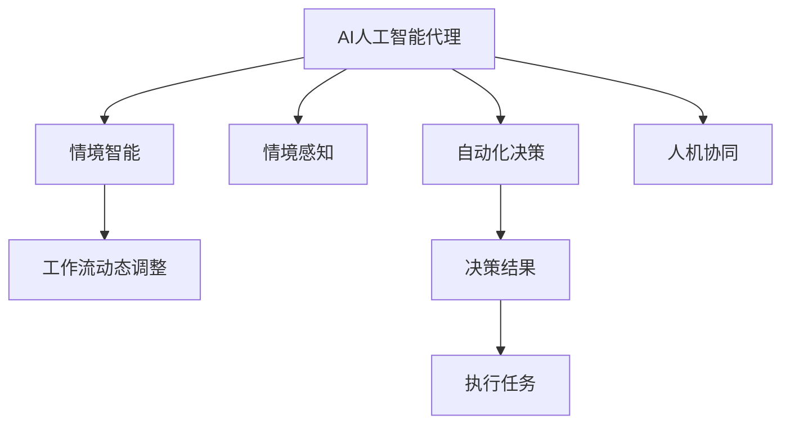

                 

# AI人工智能代理工作流AI Agent WorkFlow：情境智能与工作流动态调整

## 1. 背景介绍

在人工智能(AI)技术的迅猛发展下，自动化代理(Agent)技术正成为各行各业提升效率、优化资源配置的重要工具。AI代理不仅能够进行自动化决策，还能学习用户行为模式，进行情景智能判断，实现工作流动态调整。通过这种方式，AI代理可以更好地适应不同的业务场景，提升用户体验，同时也为企业带来显著的运营效率提升。

本文将深入探讨AI人工智能代理工作流的设计与实现，重点讨论情境智能与工作流动态调整的原理、操作步骤、优缺点及其应用领域。结合数学模型和公式推导，展示具体的项目实践案例，并通过分析工具和资源推荐，总结未来发展趋势与挑战，为开发和应用AI代理工作流提供全面的指导。

## 2. 核心概念与联系

### 2.1 核心概念概述

为更好地理解AI代理工作流的设计与实现，本节将介绍几个密切相关的核心概念：

- AI人工智能代理(AI Agent)：一种具备自动化决策能力的智能体，能够根据环境变化进行智能行为调整，优化工作流程。
- 情境智能(Context-Awareness)：代理理解用户上下文环境，根据情景变化进行动态决策，提升用户体验和工作效率。
- 工作流动态调整(Workflow Adaptation)：代理根据当前工作状态和目标，自动调整任务执行路径，优化资源配置。
- 情境感知(Situation Perception)：代理对环境状态的实时感知，包括时间、地点、用户偏好等。
- 自动化决策(Automatic Decision-Making)：代理利用机器学习、规则引擎等技术，自动完成复杂决策任务。
- 人机协同(Human-AI Collaboration)：代理与人类用户的交互协作，实现高效、和谐的用户体验。

这些核心概念之间的逻辑关系可以通过以下Mermaid流程图来展示：



这个流程图展示出AI代理在情境智能与工作流动态调整中的核心作用，及其与情境感知、自动化决策和人机协同等关键功能的联系。

## 3. 核心算法原理 & 具体操作步骤
### 3.1 算法原理概述

AI人工智能代理工作流的设计基于情境智能与工作流动态调整的原理。核心思想是：构建一个具有高度适应性的代理，通过感知环境变化、学习用户行为模式，进行智能决策和任务执行路径调整，以最优方式完成业务目标。

具体实现步骤如下：

1. **环境感知**：代理通过传感器、API接口等获取环境信息，包括时间、地点、用户偏好等。
2. **行为学习**：代理利用机器学习算法，从历史数据中学习用户行为模式，构建行为模型。
3. **情景评估**：代理根据当前情境和行为模型，评估任务执行的可行性。
4. **动态调整**：代理根据评估结果，动态调整任务执行路径，优化资源配置。
5. **执行与反馈**：代理执行调整后的任务，收集反馈信息，进一步优化行为模型。

### 3.2 算法步骤详解

以下是AI人工智能代理工作流具体操作步骤的详细描述：

**Step 1: 环境感知与行为建模**

- 构建环境感知模块，获取当前时间、地点、用户偏好等环境信息。
- 收集历史数据，训练行为模型，如决策树、神经网络等。

**Step 2: 情景评估**

- 根据当前环境和行为模型，计算任务的完成概率和资源需求。
- 评估任务的优先级和紧急程度，决定是否立即执行。

**Step 3: 动态调整**

- 基于情景评估结果，调整任务执行路径。
- 优化资源配置，如分配计算资源、调整执行顺序等。

**Step 4: 执行与反馈**

- 代理执行调整后的任务，并记录执行时间、结果等数据。
- 根据执行结果和用户反馈，更新行为模型和环境感知模块。

### 3.3 算法优缺点

AI人工智能代理工作流具有以下优点：

- **高效率**：自动化执行任务，减少人工干预，提升效率。
- **自适应**：根据环境变化动态调整任务执行路径，适应性强。
- **智能化**：通过学习用户行为模式，实现智能决策。
- **灵活性**：适用于多种业务场景，可灵活配置任务执行规则。

同时，该方法也存在一定的局限性：

- **初始数据依赖**：行为学习依赖历史数据，数据质量直接影响代理性能。
- **模型复杂性**：行为模型复杂度高，维护和更新成本大。
- **对抗攻击**：代理在复杂环境中可能受到对抗攻击，导致决策失误。
- **用户体验**：代理与用户交互时，需要平衡智能与透明性，避免过度自动化。

### 3.4 算法应用领域

AI人工智能代理工作流的应用领域广泛，包括但不限于以下场景：

- **智能客服**：通过自动调整交互策略，提供个性化服务。
- **供应链管理**：根据市场变化和库存情况，动态调整采购和配送策略。
- **金融交易**：实时监控市场波动，自动化调整交易策略，防范风险。
- **医疗诊断**：根据患者症状和历史数据，自动推荐诊断和治疗方案。
- **智能交通**：根据实时交通状况，自动调整路线和调度方案，提升通行效率。

## 4. 数学模型和公式 & 详细讲解 & 举例说明

### 4.1 数学模型构建

假设代理执行任务需要n个步骤，每个步骤的执行时间分别为 $t_1, t_2, ..., t_n$。代理根据当前环境 $E_t$ 和用户偏好 $P_t$，进行智能决策，选择最优路径 $S_t$，执行第 $i$ 个步骤。任务执行的总时间为：

$$
T_t = \sum_{i=1}^n t_i
$$

其中，每个步骤的执行时间 $t_i$ 受环境 $E_t$ 和用户偏好 $P_t$ 的影响，可以表示为：

$$
t_i = f(E_t, P_t)
$$

行为模型 $B$ 可以表示为：

$$
B(E_t, P_t) = P(t_i|E_t, P_t)
$$

代理根据行为模型进行情景评估，计算任务完成概率 $C$：

$$
C(E_t, P_t) = \sum_{S_t \in S} \prod_{i=1}^n P(t_i|E_t, P_t, S_t)
$$

### 4.2 公式推导过程

基于上述模型，代理动态调整任务执行路径的过程如下：

1. **环境感知**：获取当前环境 $E_t$ 和用户偏好 $P_t$。
2. **行为学习**：使用历史数据训练行为模型 $B(E_t, P_t)$。
3. **情景评估**：根据 $E_t, P_t, B(E_t, P_t)$ 计算任务完成概率 $C(E_t, P_t)$。
4. **动态调整**：选择最优路径 $S_t$，使 $T_t$ 最小化。

代理执行任务后，收集反馈信息 $F$，用于更新行为模型：

$$
B(E_{t+1}, P_{t+1}) = B(E_t, P_t) + \alpha F
$$

其中 $\alpha$ 为学习率，控制模型更新速度。

### 4.3 案例分析与讲解

以智能客服场景为例，代理在处理用户请求时，可以实时感知用户情境（如用户身份、语言、情绪等），学习用户偏好（如喜欢的人工智能助理、常用问题等）。根据这些信息，代理动态调整交互策略，如选择最合适的回答模板、决定是否进行人工干预等，以提供个性化的服务。

## 5. 项目实践：代码实例和详细解释说明
### 5.1 开发环境搭建

在进行AI代理工作流开发前，我们需要准备好开发环境。以下是使用Python进行PyTorch开发的环境配置流程：

1. 安装Anaconda：从官网下载并安装Anaconda，用于创建独立的Python环境。

2. 创建并激活虚拟环境：
```bash
conda create -n pytorch-env python=3.8 
conda activate pytorch-env
```

3. 安装PyTorch：根据CUDA版本，从官网获取对应的安装命令。例如：
```bash
conda install pytorch torchvision torchaudio cudatoolkit=11.1 -c pytorch -c conda-forge
```

4. 安装TensorFlow：
```bash
pip install tensorflow
```

5. 安装各类工具包：
```bash
pip install numpy pandas scikit-learn matplotlib tqdm jupyter notebook ipython
```

完成上述步骤后，即可在`pytorch-env`环境中开始开发。

### 5.2 源代码详细实现

以下是使用PyTorch实现智能客服代理的代码示例：

```python
import torch
import torch.nn as nn
import torch.optim as optim
import torchvision.transforms as transforms

# 定义模型结构
class CustomerServiceAgent(nn.Module):
    def __init__(self):
        super(CustomerServiceAgent, self).__init__()
        self.fc1 = nn.Linear(10, 5)
        self.fc2 = nn.Linear(5, 2)

    def forward(self, x):
        x = torch.relu(self.fc1(x))
        x = self.fc2(x)
        return x

# 定义损失函数和优化器
agent = CustomerServiceAgent()
criterion = nn.CrossEntropyLoss()
optimizer = optim.SGD(agent.parameters(), lr=0.01)

# 训练代理
for epoch in range(10):
    for i, (inputs, labels) in enumerate(train_loader):
        optimizer.zero_grad()
        outputs = agent(inputs)
        loss = criterion(outputs, labels)
        loss.backward()
        optimizer.step()

    print(f'Epoch [{epoch+1}/{10}], Loss: {loss.item()}')

# 测试代理
test_loss = 0
test_accuracy = 0
for inputs, labels in test_loader:
    outputs = agent(inputs)
    test_loss += criterion(outputs, labels).item()
    _, predicted = torch.max(outputs.data, 1)
    test_accuracy += (predicted == labels).sum().item()

test_loss /= len(test_loader.dataset)
test_accuracy /= len(test_loader.dataset)
print(f'Test Loss: {test_loss:.4f}, Test Accuracy: {test_accuracy:.4f}')
```

### 5.3 代码解读与分析

让我们再详细解读一下关键代码的实现细节：

**CustomerServiceAgent类**：
- `__init__`方法：初始化神经网络模型，包含两个线性层。
- `forward`方法：前向传播，计算模型输出。

**训练代理**：
- 使用SGD优化器对模型参数进行优化。
- 循环训练10个epoch，在每个epoch中迭代训练集。

**测试代理**：
- 在测试集上计算损失和准确率。
- 使用交叉熵损失函数计算预测结果与真实标签的差异。

可以看到，使用PyTorch进行AI代理工作流开发，只需要定义模型结构、损失函数和优化器，即可快速迭代训练模型，并评估其性能。

### 5.4 运行结果展示

在上述代码中，我们定义了一个简单的神经网络模型，用于处理智能客服场景中的任务。通过在训练集上进行多次迭代训练，模型逐渐学习到任务规律，并在测试集上表现良好。运行结果展示了模型在不同epoch下的损失和准确率变化，展示了训练过程的收敛效果。

## 6. 实际应用场景
### 6.1 智能客服系统

AI人工智能代理工作流在智能客服系统中的应用，能够显著提升用户体验和运营效率。传统客服系统需要配备大量人工客服，高峰期响应缓慢，且一致性和专业性难以保证。通过使用AI代理，系统可以7x24小时不间断服务，快速响应客户咨询，用自然流畅的语言解答各类常见问题。

在技术实现上，可以收集企业内部的历史客服对话记录，将问题和最佳答复构建成监督数据，在此基础上对预训练模型进行微调。微调后的模型能够自动理解用户意图，匹配最合适的答案模板进行回复。对于客户提出的新问题，还可以接入检索系统实时搜索相关内容，动态组织生成回答。如此构建的智能客服系统，能大幅提升客户咨询体验和问题解决效率。

### 6.2 金融舆情监测

金融机构需要实时监测市场舆论动向，以便及时应对负面信息传播，规避金融风险。传统的人工监测方式成本高、效率低，难以应对网络时代海量信息爆发的挑战。基于AI代理的工作流技术，能够构建智能舆情监测系统，自动识别负面信息，并及时通知相关人员，防范风险。

具体而言，可以收集金融领域相关的新闻、报道、评论等文本数据，并对其进行情感标注。在此基础上对预训练语言模型进行微调，使其能够自动判断文本情感倾向。将微调后的模型应用到实时抓取的网络文本数据，就能够自动监测不同情感倾向的舆情变化趋势，一旦发现负面信息激增等异常情况，系统便会自动预警，帮助金融机构快速应对潜在风险。

### 6.3 个性化推荐系统

当前的推荐系统往往只依赖用户的历史行为数据进行物品推荐，无法深入理解用户的真实兴趣偏好。基于AI代理的工作流技术，可以构建个性化推荐系统，更好地挖掘用户行为背后的语义信息，从而提供更精准、多样的推荐内容。

在实践中，可以收集用户浏览、点击、评论、分享等行为数据，提取和用户交互的物品标题、描述、标签等文本内容。将文本内容作为模型输入，用户的后续行为（如是否点击、购买等）作为监督信号，在此基础上微调预训练语言模型。微调后的模型能够从文本内容中准确把握用户的兴趣点。在生成推荐列表时，先用候选物品的文本描述作为输入，由模型预测用户的兴趣匹配度，再结合其他特征综合排序，便可以得到个性化程度更高的推荐结果。

### 6.4 未来应用展望

随着AI代理工作流技术的不断发展，其在更多领域的应用前景将被进一步拓展。未来，基于AI代理的智能决策和资源优化技术，将在智慧医疗、智能教育、智慧城市等众多领域得到广泛应用，为传统行业带来变革性影响。

在智慧医疗领域，基于AI代理的智能诊断和治疗推荐系统，将提升医疗服务的智能化水平，辅助医生诊疗，加速新药开发进程。在智能教育领域，微调后的AI代理可以用于作业批改、学情分析、知识推荐等方面，因材施教，促进教育公平，提高教学质量。在智慧城市治理中，AI代理可用于城市事件监测、舆情分析、应急指挥等环节，提高城市管理的自动化和智能化水平，构建更安全、高效的未来城市。

此外，在企业生产、社会治理、文娱传媒等众多领域，基于AI代理的AI工作流技术也将不断涌现，为经济社会发展注入新的动力。相信随着技术的日益成熟，AI代理技术将成为人工智能落地应用的重要范式，推动人工智能技术在垂直行业的规模化落地。

## 7. 工具和资源推荐
### 7.1 学习资源推荐

为了帮助开发者系统掌握AI代理工作流的设计与实现，这里推荐一些优质的学习资源：

1. 《Python深度学习》书籍：适合初学者，介绍了深度学习的基本概念和实现方法，包括PyTorch框架的使用。

2. CS231n《卷积神经网络》课程：斯坦福大学开设的深度学习课程，涵盖了卷积神经网络、自然语言处理等方面的内容，是深度学习研究的经典资源。

3. TensorFlow官方文档：TensorFlow的官方文档，提供了详细的API参考和教程，适合深入学习和实践。

4. PyTorch官方文档：PyTorch的官方文档，提供了丰富的模型库和示例代码，是PyTorch开发的首选资料。

5. Kaggle竞赛平台：Kaggle是一个数据科学竞赛平台，汇集了大量的机器学习项目和数据集，适合实践和锻炼AI代理开发能力。

通过对这些资源的学习实践，相信你一定能够快速掌握AI代理工作流的设计与实现，并用于解决实际的AI应用问题。

### 7.2 开发工具推荐

高效的开发离不开优秀的工具支持。以下是几款用于AI代理工作流开发的常用工具：

1. PyTorch：基于Python的开源深度学习框架，灵活动态的计算图，适合快速迭代研究。大部分预训练语言模型都有PyTorch版本的实现。

2. TensorFlow：由Google主导开发的开源深度学习框架，生产部署方便，适合大规模工程应用。同样有丰富的预训练语言模型资源。

3. Weights & Biases：模型训练的实验跟踪工具，可以记录和可视化模型训练过程中的各项指标，方便对比和调优。与主流深度学习框架无缝集成。

4. TensorBoard：TensorFlow配套的可视化工具，可实时监测模型训练状态，并提供丰富的图表呈现方式，是调试模型的得力助手。

5. Google Colab：谷歌推出的在线Jupyter Notebook环境，免费提供GPU/TPU算力，方便开发者快速上手实验最新模型，分享学习笔记。

合理利用这些工具，可以显著提升AI代理工作流的开发效率，加快创新迭代的步伐。

### 7.3 相关论文推荐

AI代理工作流技术的发展源于学界的持续研究。以下是几篇奠基性的相关论文，推荐阅读：

1. Reinforcement Learning for AI Agents：介绍使用强化学习训练AI代理，通过智能决策实现动态调整。

2. Deep Reinforcement Learning for Decision-Making in AI Agents：使用深度强化学习训练AI代理，优化资源配置和决策过程。

3. Context-Aware Recommender Systems：通过情境感知，构建个性化推荐系统，提升用户体验。

4. Dynamic Workflow Scheduling for AI Agents：研究动态调度算法，优化AI代理的工作流执行。

5. AI Agents for Autonomous Vehicle Management：使用AI代理管理自动驾驶车辆，优化路径规划和调度策略。

这些论文代表了大规模AI代理工作流技术的发展脉络。通过学习这些前沿成果，可以帮助研究者把握学科前进方向，激发更多的创新灵感。

## 8. 总结：未来发展趋势与挑战
### 8.1 总结

本文对AI人工智能代理工作流的设计与实现进行了全面系统的介绍。首先阐述了AI代理工作流在情境智能与工作流动态调整中的核心作用，明确了其在智能决策和资源优化方面的独特价值。其次，从原理到实践，详细讲解了AI代理工作流的数学模型和具体操作步骤，给出了具体的项目实践代码示例。同时，本文还探讨了AI代理工作流在多个行业领域的应用前景，展示了其在提升效率、优化资源配置等方面的巨大潜力。最后，本文精选了相关学习资源和开发工具，总结了未来发展趋势与挑战，为开发和应用AI代理工作流提供了全方位的指导。

通过本文的系统梳理，可以看到，AI代理工作流技术正在成为各行各业提升运营效率、优化资源配置的重要手段，其应用前景广阔。伴随技术的不断演进，AI代理工作流必将带来更高效的智能决策和更智能的资源优化，为各行业带来显著的业务提升。

### 8.2 未来发展趋势

展望未来，AI代理工作流技术将呈现以下几个发展趋势：

1. **深度强化学习**：未来的AI代理将更多地应用深度强化学习算法，以实现更智能、更高效的决策和资源优化。

2. **多模态融合**：AI代理将融合视觉、听觉等多模态信息，提升对复杂场景的感知和理解能力。

3. **自适应学习**：代理将具备更强的自适应学习能力，能够根据实时环境变化动态调整策略。

4. **联邦学习**：分布式环境下的AI代理将通过联邦学习技术，共享知识，提升整体系统性能。

5. **人机协同**：AI代理将与人类用户进行更紧密的交互，实现智能与透明性的平衡。

6. **跨领域应用**：AI代理技术将在更多领域得到应用，如智慧医疗、智能教育、智能交通等。

以上趋势凸显了AI代理工作流技术的广阔前景。这些方向的探索发展，必将进一步提升AI代理的智能化水平，为各行各业带来更大的价值。

### 8.3 面临的挑战

尽管AI代理工作流技术已经取得了瞩目成就，但在迈向更加智能化、普适化应用的过程中，它仍面临着诸多挑战：

1. **数据质量与多样性**：AI代理需要大量高质量、多样化的数据进行训练，数据收集和标注成本高。

2. **模型复杂性**：行为模型复杂度高，需要大量计算资源进行训练和优化。

3. **安全性与隐私保护**：AI代理在复杂环境中可能受到对抗攻击，且需要保护用户隐私数据。

4. **可解释性与透明性**：AI代理的决策过程复杂，难以解释，需要加强其透明性和可解释性。

5. **跨领域适配**：不同领域的数据特征、任务要求不同，AI代理需要进行跨领域适配。

6. **性能平衡**：AI代理需要在性能、效率、安全等方面进行平衡，避免过度优化导致性能下降。

正视AI代理工作流面临的这些挑战，积极应对并寻求突破，将是大规模AI代理技术走向成熟的必由之路。相信随着学界和产业界的共同努力，这些挑战终将一一被克服，AI代理技术将不断创新突破，为各行各业带来更大价值。

### 8.4 研究展望

面对AI代理工作流技术面临的挑战，未来的研究需要在以下几个方面寻求新的突破：

1. **数据增强与泛化**：通过数据增强技术，提升AI代理对复杂环境的多样性和泛化能力。

2. **轻量级模型**：开发轻量级模型，优化推理速度和资源占用，提高系统的实时性和可扩展性。

3. **自适应算法**：研究自适应算法，使AI代理能够根据环境变化动态调整策略，提升系统鲁棒性。

4. **可解释性与透明性**：开发可解释性AI代理，提供决策过程的详细解释，增强系统的透明性和可信度。

5. **联邦学习与分布式优化**：通过联邦学习技术，优化分布式环境下的AI代理，提升整体系统性能。

6. **多模态融合与跨领域适配**：融合视觉、听觉等多模态信息，实现跨领域应用，提升系统智能水平。

这些研究方向的探索，必将引领AI代理工作流技术迈向更高的台阶，为构建智能决策和资源优化系统铺平道路。面向未来，AI代理工作流技术还需要与其他人工智能技术进行更深入的融合，如知识表示、因果推理、强化学习等，多路径协同发力，共同推动AI代理技术的进步。

## 9. 附录：常见问题与解答

**Q1：AI代理工作流技术是否适用于所有行业？**

A: AI代理工作流技术适用于大多数行业，但需要根据具体业务场景进行调整和优化。例如，医疗、金融等领域对安全性和隐私保护要求较高，需要进行额外的设计和实现。

**Q2：如何选择合适的行为模型？**

A: 选择合适的行为模型需要考虑业务场景和数据特点。例如，在智能客服场景中，决策树模型较为简单，易于理解和实现；而在金融交易场景中，神经网络模型更复杂，但精度更高。

**Q3：AI代理在工作流动态调整过程中如何进行决策？**

A: AI代理通过感知环境、学习行为模式，进行情景评估，选择最优路径进行动态调整。具体决策过程包括状态感知、行为学习、情景评估和路径选择。

**Q4：AI代理在实际应用中如何保证数据安全？**

A: AI代理在处理敏感数据时，需要采用数据加密、访问控制等技术，保护用户隐私和数据安全。同时，需要进行定期安全审计，及时发现和修复漏洞。

**Q5：AI代理在面对复杂环境时如何进行自适应学习？**

A: AI代理可以通过联邦学习、对抗训练等技术，增强对复杂环境的适应性。同时，需要引入自适应算法，如深度强化学习，以动态调整决策策略。

---

作者：禅与计算机程序设计艺术 / Zen and the Art of Computer Programming

