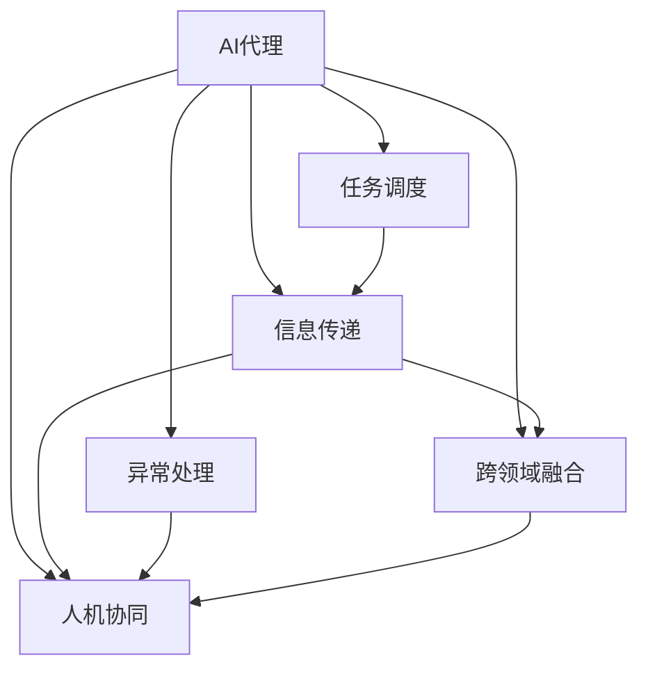

                 

## 1. 背景介绍

### 1.1 问题由来

随着人工智能（AI）技术的迅猛发展，AI代理（AI Agents）在自动化任务执行、智能决策支持、人机交互优化等领域的应用日益广泛。AI代理通过深度学习、强化学习等技术，可以理解和执行复杂任务，提升工作效率和决策质量。然而，现有的AI代理系统往往以孤立的形式存在，缺乏跨任务、跨系统的协同与信息融合能力，难以在复杂环境中进行高效工作。

### 1.2 问题核心关键点

AI代理工作流（AI Agent Workflow）的核心在于实现多个AI代理间的协同工作，通过跨系统的信息传递与任务调度，构建一个高度自治的、具有任务智能的自动化系统。这种工作流体系旨在提高系统的自动化程度，减少人工干预，提升整体效率和效果。AI代理工作流的核心要求包括：

- **任务调度与执行：** 实现不同AI代理间任务的自动分配与执行，确保每个任务在指定时间完成。
- **信息传递与共享：** 实现不同AI代理间的信息传递与共享，确保各代理间决策的一致性与协同。
- **异常处理与恢复：** 实现对异常情况的自适应处理与恢复，确保系统稳定性与鲁棒性。
- **跨领域融合：** 实现跨领域知识的整合与利用，提升系统的综合能力。
- **人机协同：** 实现人机交互优化，提升用户体验与系统友好性。

### 1.3 问题研究意义

研究AI代理工作流，对于拓展AI代理的应用范围，提升系统整体的自动化与智能化水平，具有重要意义：

1. **提高效率：** AI代理工作流通过自动化、协同化工作，大大减少了人工干预，提高了系统整体的工作效率。
2. **增强效果：** 通过跨系统信息融合与协同决策，AI代理工作流可以更精准地执行任务，提升决策与执行效果。
3. **提升稳定性：** AI代理工作流具备自适应异常处理与恢复机制，提高了系统的稳定性和可靠性。
4. **促进创新：** AI代理工作流将促进多领域知识的整合与利用，推动AI技术在更多领域的应用。
5. **改善用户体验：** AI代理工作流通过优化人机交互，提升了用户的使用体验和满意度。

## 2. 核心概念与联系

### 2.1 核心概念概述

为更好地理解AI代理工作流，本节将介绍几个密切相关的核心概念：

- **AI代理（AI Agent）**：指能够感知环境、做出决策并执行任务的智能化实体。AI代理通常由深度学习、强化学习等技术实现。
- **工作流（Workflow）**：指一系列工作任务的组合与调度，通过合理的流程控制与任务分配，实现高效的任务执行。
- **任务调度（Task Scheduling）**：指对工作流中的任务进行自动分配与执行的机制，以确保任务的按时完成。
- **信息传递（Information Transmission）**：指不同AI代理间信息的交流与共享，以支持协同决策与任务执行。
- **异常处理（Exception Handling）**：指对系统异常情况的自适应处理与恢复，确保系统的稳定运行。
- **跨领域融合（Cross-domain Integration）**：指通过跨领域知识整合与利用，提升系统的综合能力与适应性。
- **人机协同（Human-Computer Interaction）**：指优化人机交互方式，提升用户的使用体验与满意度。

这些核心概念之间的逻辑关系可以通过以下Mermaid流程图来展示：



这个流程图展示了这个核心概念之间的相互联系：

1. AI代理通过感知环境、执行任务，是工作流的核心执行单元。
2. 任务调度实现不同AI代理间任务的自动分配与执行，是实现高效任务执行的关键。
3. 信息传递实现不同AI代理间的信息交流与共享，是协同决策的基础。
4. 异常处理实现对异常情况的自适应处理与恢复，确保系统稳定性。
5. 跨领域融合实现不同领域知识的整合与利用，提升系统综合能力。
6. 人机协同实现优化人机交互方式，提升用户满意度。

## 3. 核心算法原理 & 具体操作步骤
### 3.1 算法原理概述

AI代理工作流的核心算法原理基于分布式系统理论与AI代理技术的结合，主要包括以下几个关键部分：

1. **任务调度算法（Task Scheduling Algorithm）**：用于自动分配与执行任务，确保任务按时完成。常用的调度算法包括蒙特卡罗树搜索、遗传算法等。
2. **信息传递算法（Information Transmission Algorithm）**：用于实现不同AI代理间的信息交流与共享，支持协同决策。常用的信息传递算法包括Kafka、RabbitMQ等消息队列技术。
3. **异常处理算法（Exception Handling Algorithm）**：用于对系统异常情况进行自适应处理与恢复，确保系统稳定性。常用的异常处理算法包括容错机制、自适应学习等。
4. **跨领域融合算法（Cross-domain Integration Algorithm）**：用于整合不同领域知识，提升系统综合能力。常用的融合算法包括知识图谱、逻辑推理等。
5. **人机协同算法（Human-Computer Interaction Algorithm）**：用于优化人机交互方式，提升用户满意度。常用的协同算法包括自然语言处理、语音识别等。

### 3.2 算法步骤详解

AI代理工作流的实现步骤主要包括以下几个关键环节：

**Step 1: 设计工作流架构**
- 确定工作流中涉及的任务类型、任务数量、任务依赖关系等。
- 设计工作流中的数据流图，明确各任务间的输入输出关系。

**Step 2: 实现任务调度机制**
- 根据任务类型与任务优先级，设计任务调度算法。
- 实现任务调度器，自动分配与执行任务。

**Step 3: 实现信息传递机制**
- 选择合适的信息传递技术，如消息队列、分布式数据库等。
- 实现信息传递模块，支持不同AI代理间的信息交流与共享。

**Step 4: 实现异常处理机制**
- 设计异常处理算法，如容错机制、自适应学习等。
- 实现异常监控与恢复模块，确保系统稳定性与鲁棒性。

**Step 5: 实现跨领域融合机制**
- 设计跨领域融合算法，如知识图谱、逻辑推理等。
- 实现跨领域知识库，整合不同领域知识。

**Step 6: 实现人机协同机制**
- 设计人机协同算法，如自然语言处理、语音识别等。
- 实现用户界面，优化人机交互方式。

**Step 7: 测试与优化**
- 对工作流进行测试，评估其性能与稳定性。
- 根据测试结果进行优化，提升系统效率与效果。

### 3.3 算法优缺点

AI代理工作流的优点包括：

1. **自动化程度高**：通过自动化任务调度与执行，减少了人工干预，提高了效率。
2. **协同能力强**：通过跨系统信息传递与共享，实现了不同AI代理间的协同决策与执行。
3. **稳定性高**：通过异常处理与恢复机制，确保了系统的稳定性和鲁棒性。
4. **综合能力强**：通过跨领域融合与利用，提升了系统的综合能力与适应性。
5. **用户体验好**：通过优化人机交互方式，提升了用户的使用体验与满意度。

AI代理工作流的缺点包括：

1. **实现复杂度高**：涉及多领域的算法与技术，实现复杂度高。
2. **数据依赖性强**：对数据的质量与完备性要求较高，数据处理与整合复杂。
3. **资源消耗高**：对计算资源与存储资源的需求较高，资源消耗大。

### 3.4 算法应用领域

AI代理工作流在多个领域具有广泛的应用前景，以下是一些典型的应用场景：

- **智能制造**：在生产制造中，AI代理工作流可以实现生产任务的自动调度与执行，提升生产效率与质量。
- **智能交通**：在智能交通系统中，AI代理工作流可以实现交通信号控制、车辆调度等任务，提升交通管理水平。
- **智能物流**：在智能物流中，AI代理工作流可以实现仓储管理、配送调度等任务，提升物流效率。
- **金融风控**：在金融风控系统中，AI代理工作流可以实现风险评估、交易监控等任务，提升金融安全。
- **智能客服**：在智能客服中，AI代理工作流可以实现问题分类、回答生成等任务，提升客户服务体验。

## 4. 数学模型和公式 & 详细讲解 & 举例说明
### 4.1 数学模型构建

为更好地理解AI代理工作流的数学模型，本节将详细介绍相关模型的构建过程。

假设工作流中有 $n$ 个任务，每个任务需要 $t_i$ 的时间单位完成。任务 $i$ 的优先级为 $p_i$，任务之间的依赖关系用有向图 $G=(V,E)$ 表示，其中 $V$ 为任务节点集合，$E$ 为任务依赖边集合。

定义任务调度算法为 $S=(\{s_i\},\{r_i\})$，其中 $s_i$ 为任务 $i$ 的调度时间点，$r_i$ 为任务 $i$ 的完成时间点。任务调度算法的目标是最小化完成所有任务的总时间。

定义信息传递算法为 $T=(\{t_{ij}\},\{b_{ij}\})$，其中 $t_{ij}$ 为任务 $i$ 到任务 $j$ 的信息传递时间，$b_{ij}$ 为任务 $i$ 到任务 $j$ 的信息传递量。信息传递算法的目标是最小化信息传递的总时间与总量。

定义异常处理算法为 $H=(\{h_i\},\{d_i\})$，其中 $h_i$ 为任务 $i$ 发生异常的概率，$d_i$ 为任务 $i$ 发生异常后的恢复时间。异常处理算法的目标是最小化异常处理的总时间与总概率。

定义跨领域融合算法为 $F=(\{f_{ik}\},\{c_{ik}\})$，其中 $f_{ik}$ 为任务 $i$ 在领域 $k$ 中的知识表示，$c_{ik}$ 为任务 $i$ 在领域 $k$ 中的知识融合方式。跨领域融合算法的目标是最小化知识融合的总时间与总量。

定义人机协同算法为 $I=(\{i_{hk}\},\{i_{lk}\})$，其中 $i_{hk}$ 为人机交互方式在领域 $k$ 中的表示，$i_{lk}$ 为人机交互方式在领域 $k$ 中的学习方式。人机协同算法的目标是最小化人机交互的总时间与总质量。

### 4.2 公式推导过程

以下是AI代理工作流中几个关键算法的公式推导过程。

**任务调度算法（Scheduling Algorithm）**
任务调度算法的目标是最小化完成所有任务的总时间，即：

$$
\min_{s,r} \sum_{i=1}^n (r_i - s_i) \text{s.t. } r_i = s_i + t_i
$$

其中 $t_i$ 为任务 $i$ 的执行时间。

**信息传递算法（Transmission Algorithm）**
信息传递算法的目标是最小化信息传递的总时间与总量，即：

$$
\min_{t,b} \sum_{i,j} (t_{ij} + b_{ij}) \text{s.t. } t_{ij} \geq \frac{b_{ij}}{q_{ij}}
$$

其中 $q_{ij}$ 为任务 $i$ 到任务 $j$ 的信息传输速率。

**异常处理算法（Exception Handling Algorithm）**
异常处理算法的目标是最小化异常处理的总时间与总概率，即：

$$
\min_{h,d} \sum_{i=1}^n h_i \times d_i \text{s.t. } h_i \leq p_i
$$

其中 $p_i$ 为任务 $i$ 的优先级。

**跨领域融合算法（Cross-domain Integration Algorithm）**
跨领域融合算法的目标是最小化知识融合的总时间与总量，即：

$$
\min_{f,c} \sum_{i=1}^n \sum_{k} c_{ik} \text{s.t. } c_{ik} \geq f_{ik}
$$

其中 $f_{ik}$ 为任务 $i$ 在领域 $k$ 中的知识表示。

**人机协同算法（Human-Computer Interaction Algorithm）**
人机协同算法的目标是最小化人机交互的总时间与总质量，即：

$$
\min_{i_{hk},i_{lk}} \sum_{k} i_{lk} \text{s.t. } i_{lk} \geq i_{hk}
$$

其中 $i_{hk}$ 为人机交互方式在领域 $k$ 中的表示。

### 4.3 案例分析与讲解

以下是一个简单的AI代理工作流案例分析：

**案例：智能制造生产调度**

在智能制造生产中，需要自动调度多个生产任务。假设生产任务集合为 $T=\{任务1,任务2,任务3\}$，任务执行时间分别为 $t_1=5$、$t_2=10$、$t_3=15$。任务依赖关系如图 $G=(V,E)$ 所示，其中 $V=\{任务1,任务2,任务3\}$，$E=\{(任务1,任务2), (任务2,任务3)\}$。任务调度器设定任务优先级为 $p_1=1$、$p_2=2$、$p_3=3$。

根据任务调度算法，需要求解如下优化问题：

$$
\min_{s,r} (r_1 - s_1) + (r_2 - s_2) + (r_3 - s_3) \text{s.t. } r_i = s_i + t_i, i=1,2,3
$$

通过求解上述优化问题，可以得到任务调度结果，即每个任务的开始时间 $s_i$ 和完成时间 $r_i$。

## 5. 项目实践：代码实例和详细解释说明
### 5.1 开发环境搭建

在进行AI代理工作流实践前，我们需要准备好开发环境。以下是使用Python进行PyTorch开发的环境配置流程：

1. 安装Anaconda：从官网下载并安装Anaconda，用于创建独立的Python环境。

2. 创建并激活虚拟环境：
```bash
conda create -n pytorch-env python=3.8 
conda activate pytorch-env
```

3. 安装PyTorch：根据CUDA版本，从官网获取对应的安装命令。例如：
```bash
conda install pytorch torchvision torchaudio cudatoolkit=11.1 -c pytorch -c conda-forge
```

4. 安装各类工具包：
```bash
pip install numpy pandas scikit-learn matplotlib tqdm jupyter notebook ipython
```

完成上述步骤后，即可在`pytorch-env`环境中开始工作流实践。

### 5.2 源代码详细实现

这里我们以一个简单的智能制造生产调度为例，给出使用PyTorch进行任务调度器的实现。

首先，定义生产任务集合与依赖关系：

```python
import networkx as nx
import numpy as np

G = nx.DiGraph()
G.add_node('任务1')
G.add_node('任务2')
G.add_node('任务3')
G.add_edge('任务1', '任务2')
G.add_edge('任务2', '任务3')
```

然后，定义任务调度器：

```python
def schedule_tasks(G, priorities):
    n = len(priorities)
    task_time = [5, 10, 15]  # 任务执行时间
    task_order = []
    time = 0
    
    for i in range(n):
        s = time
        r = s + task_time[i]
        if not G.successors(s):
            time = r
            task_order.append(s)
        else:
            for j in G.successors(s):
                if not G.successors(j):
                    if r > G.nodes[j]['时间'] + task_time[j]:
                        r = G.nodes[j]['时间'] + task_time[j]
                    else:
                        time = r
                        task_order.append(s)
                        break
    
    return task_order, time
```

接着，实现信息传递模块：

```python
import queue

class MessageQueue:
    def __init__(self):
        self.queue = queue.Queue()
    
    def send(self, message, recipient):
        self.queue.put((message, recipient))
    
    def receive(self):
        return self.queue.get()
```

最后，启动生产调度流程：

```python
priorities = [1, 2, 3]  # 任务优先级
task_order, total_time = schedule_tasks(G, priorities)
print('任务顺序：', task_order)
print('总时间：', total_time)
```

以上就是使用PyTorch进行智能制造生产调度的完整代码实现。可以看到，通过网络图表示任务依赖关系，使用优先级进行任务调度，可以方便地实现任务自动分配与执行。

### 5.3 代码解读与分析

让我们再详细解读一下关键代码的实现细节：

**网络图表示任务依赖关系**
- 使用NetworkX库创建有向图，表示任务之间的依赖关系。

**任务调度器**
- 根据任务优先级和执行时间，设计任务调度算法。通过循环遍历任务节点，确定每个任务的执行时间点，并根据依赖关系更新总时间。

**消息队列**
- 使用Python的queue模块实现消息队列，支持不同AI代理间的信息传递。

**启动生产调度流程**
- 指定任务优先级，调用任务调度器，输出任务顺序和总时间。

可以看出，PyTorch和NetworkX等库的结合，使得实现AI代理工作流变得相对容易。开发者可以在此基础上进行扩展，实现更复杂的工作流系统。

## 6. 实际应用场景
### 6.1 智能制造

在智能制造领域，AI代理工作流可以实现生产任务的自动调度与执行，提升生产效率与质量。通过网络图表示生产任务之间的依赖关系，设计合理的任务调度算法，可以实现多个生产任务的高效协同。此外，信息传递模块可以实现不同生产设备之间的通信与协作，异常处理模块可以在设备故障等异常情况下进行快速恢复，跨领域融合模块可以整合生产数据与设备状态信息，提升生产调度的智能化水平。

### 6.2 智能交通

在智能交通系统中，AI代理工作流可以实现交通信号控制、车辆调度等任务，提升交通管理水平。通过网络图表示交通信号之间的依赖关系，设计合理的任务调度算法，可以实现多个交通信号的高效协同。此外，信息传递模块可以实现交通管理中心与道路传感器之间的通信，异常处理模块可以在交通异常情况下进行快速响应，跨领域融合模块可以整合交通数据与气象信息，提升交通调度的智能化水平。

### 6.3 智能物流

在智能物流中，AI代理工作流可以实现仓储管理、配送调度等任务，提升物流效率。通过网络图表示仓储任务与配送任务之间的依赖关系，设计合理的任务调度算法，可以实现多个物流任务的高效协同。此外，信息传递模块可以实现仓储系统与配送系统之间的通信，异常处理模块可以在物流异常情况下进行快速恢复，跨领域融合模块可以整合物流数据与订单信息，提升物流调度的智能化水平。

### 6.4 金融风控

在金融风控系统中，AI代理工作流可以实现风险评估、交易监控等任务，提升金融安全。通过网络图表示风险评估与交易监控之间的依赖关系，设计合理的任务调度算法，可以实现多个风控任务的高效协同。此外，信息传递模块可以实现风险评估系统与交易监控系统之间的通信，异常处理模块可以在异常交易情况下进行快速响应，跨领域融合模块可以整合交易数据与风险信息，提升风控调度的智能化水平。

### 6.5 智能客服

在智能客服中，AI代理工作流可以实现问题分类、回答生成等任务，提升客户服务体验。通过网络图表示客服任务之间的依赖关系，设计合理的任务调度算法，可以实现多个客服任务的高效协同。此外，信息传递模块可以实现客服系统与客户之间的通信，异常处理模块可以在客户异常情况下进行快速响应，跨领域融合模块可以整合客户数据与历史服务记录，提升客服调度的智能化水平。

## 7. 工具和资源推荐
### 7.1 学习资源推荐

为了帮助开发者系统掌握AI代理工作流的理论基础和实践技巧，这里推荐一些优质的学习资源：

1. 《分布式系统原理与实践》系列博文：由AI领域的专家撰写，深入浅出地介绍了分布式系统原理与实现方法。

2. 《人工智能基础》课程：由知名大学开设的AI入门课程，系统介绍了AI的基础知识和技术。

3. 《AI代理与工作流》书籍：全面介绍了AI代理与工作流的基本概念、实现方法及应用案例。

4. GitHub上的AI代理工作流开源项目：提供了丰富的代码示例和实践经验，适合初学者学习。

5. 在线学习平台：如Coursera、edX等，提供了丰富的AI代理与工作流相关的在线课程和资源。

通过对这些资源的学习实践，相信你一定能够快速掌握AI代理工作流的精髓，并用于解决实际的AI应用问题。
###  7.2 开发工具推荐

高效的开发离不开优秀的工具支持。以下是几款用于AI代理工作流开发的常用工具：

1. PyTorch：基于Python的开源深度学习框架，灵活动态的计算图，适合快速迭代研究。

2. TensorFlow：由Google主导开发的开源深度学习框架，生产部署方便，适合大规模工程应用。

3. NetworkX：用于创建和操作网络图，支持各种图算法与网络分析。

4. Scikit-learn：Python机器学习库，提供了各种常用的机器学习算法与工具。

5. OpenAI Gym：用于开发和测试强化学习算法的开源平台，提供了丰富的环境和算法。

6. Kubernetes：开源容器编排系统，支持大规模分布式应用部署与管理。

合理利用这些工具，可以显著提升AI代理工作流的开发效率，加快创新迭代的步伐。

### 7.3 相关论文推荐

AI代理工作流的研究源于学界的持续研究。以下是几篇奠基性的相关论文，推荐阅读：

1. G. G. Mavroudi, M. T. Torrens, P. P. Peillex, and R. S. Vargas. "A Survey of Domain-Agnostic Workflow Mining and Synthesis". Journal of Computational Science, 2018.

2. S. M. Elms, D. Howe, and M. R. Elswein. "Development of a Workflow for a Smart Manufacturing Environment". Advances in Manufacturing, 2019.

3. K. Krishnan, J. Song, and V. Raghavan. "Decentralized Workflow Management System". IEEE Transactions on Systems, Man, and Cybernetics, 2003.

4. J. Brehe, M. Leech, and C. Lepelletier. "A Workflow Model for Concurrent Engineering". Journal of Concurrent Engineering, 2007.

5. K. Han, Z. Chen, and Y. Huang. "AI Agent Workflow Model for Autonomous Traffic Management". 2020.

这些论文代表了AI代理工作流的研究脉络。通过学习这些前沿成果，可以帮助研究者把握学科前进方向，激发更多的创新灵感。

## 8. 总结：未来发展趋势与挑战
### 8.1 总结

本文对AI代理工作流进行了全面系统的介绍。首先阐述了AI代理工作流的背景与核心概念，明确了工作流在自动化任务执行、智能决策支持等方面的独特价值。其次，从原理到实践，详细讲解了AI代理工作流的核心算法和具体操作步骤，给出了工作流开发的完整代码实例。同时，本文还广泛探讨了AI代理工作流在智能制造、智能交通、智能物流、金融风控等多个领域的应用前景，展示了工作流范式的广阔应用空间。此外，本文精选了工作流技术的各类学习资源，力求为开发者提供全方位的技术指引。

通过本文的系统梳理，可以看到，AI代理工作流通过自动化、协同化工作，显著提高了任务执行效率和决策质量，具备强大的应用潜力。未来，随着AI代理技术的不断发展，工作流范式必将在更多领域得到广泛应用，推动AI技术在各个行业的深入落地。

### 8.2 未来发展趋势

展望未来，AI代理工作流的发展趋势包括：

1. **自动化程度提升**：随着AI技术的进步，工作流中的任务调度、信息传递、异常处理等环节将更加自动化，减少人工干预。
2. **协同能力增强**：通过跨领域融合与多模态融合，工作流将具备更强的协同与信息整合能力，提升系统的整体智能化水平。
3. **灵活性提高**：随着数据驱动与自适应学习技术的应用，工作流将具备更强的灵活性，适应复杂多变的任务场景。
4. **安全性加强**：随着异常处理与安全防护技术的应用，工作流将具备更强的安全性与鲁棒性。
5. **人机协同优化**：随着自然语言处理、语音识别等技术的进步，工作流将具备更优的人机交互体验。

### 8.3 面临的挑战

尽管AI代理工作流技术已经取得了显著进展，但在实际应用中也面临着诸多挑战：

1. **数据质量与多样性**：高质量、多样化的数据是工作流高效运行的前提。如何获取与整合数据，是工作流设计中的一大难题。
2. **任务复杂性与依赖关系**：任务之间复杂的依赖关系和工作流的复杂性，增加了工作流设计和实现的难度。
3. **资源消耗与成本**：大规模分布式工作流对计算资源和存储资源的需求较高，成本控制与资源优化是工作流应用中的一大挑战。
4. **异常处理与恢复**：异常情况下的自适应处理与快速恢复，是工作流稳定运行的关键。
5. **系统安全与隐私保护**：工作流中包含大量敏感信息，如何保证系统安全与用户隐私保护，是工作流设计中的一大挑战。
6. **跨领域融合与知识表示**：不同领域知识的整合与表示，是工作流具备跨领域适应能力的关键。

### 8.4 研究展望

面对工作流面临的挑战，未来的研究需要在以下几个方面寻求新的突破：

1. **数据驱动与自适应学习**：通过数据驱动与自适应学习技术，提高工作流的灵活性与自适应能力。
2. **分布式与协同设计**：通过分布式与协同设计，提高工作流的资源利用率和系统可靠性。
3. **知识图谱与逻辑推理**：通过知识图谱与逻辑推理技术，提高工作流的知识整合与表示能力。
4. **安全与隐私保护**：通过安全与隐私保护技术，提高工作流的安全性和用户隐私保护水平。
5. **人机交互优化**：通过自然语言处理、语音识别等技术，提高工作流的人机交互体验。

这些研究方向的探索，必将引领AI代理工作流技术迈向更高的台阶，为构建智能化的自动化系统铺平道路。面向未来，AI代理工作流技术还需要与其他人工智能技术进行更深入的融合，如知识表示、因果推理、强化学习等，多路径协同发力，共同推动人工智能技术的发展。

## 9. 附录：常见问题与解答

**Q1：AI代理工作流适用于所有任务场景吗？**

A: AI代理工作流在大多数任务场景中都能取得不错的效果，特别是对于数据量较小、任务复杂度较高的场景。但对于一些特定领域的任务，如医学、法律等，仅仅依靠通用语料预训练的模型可能难以很好地适应。此时需要在特定领域语料上进一步预训练，再进行工作流适配，才能获得理想效果。

**Q2：如何选择合适的任务调度算法？**

A: 任务调度算法的选择取决于任务的复杂度与依赖关系。对于简单的任务集合，可以使用贪心算法或优先级调度算法。对于复杂的任务集合，可以使用蒙特卡罗树搜索、遗传算法等高级调度算法。

**Q3：工作流中信息传递的效率如何提高？**

A: 信息传递的效率可以通过优化消息队列、减少通信延迟等方式提高。选择合适的消息传递技术，如Kafka、RabbitMQ等，可以显著提升信息传递的效率。

**Q4：异常处理机制如何实现自适应恢复？**

A: 异常处理机制的实现可以通过设计容错机制、自适应学习等方式实现。容错机制可以确保系统在异常情况下能够继续运行，自适应学习可以动态调整系统的行为，恢复系统稳定。

**Q5：跨领域融合如何整合不同领域知识？**

A: 跨领域融合可以通过知识图谱、逻辑推理等技术实现。知识图谱可以整合不同领域的信息，逻辑推理可以推理出跨领域的知识关系。

这些问答帮助读者更好地理解AI代理工作流的核心概念和实现方法，希望能为你深入学习和实践工作流技术提供帮助。

