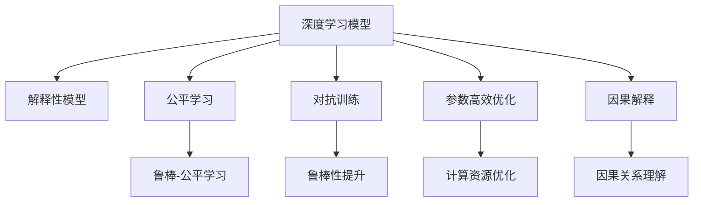

                 

# AI人工智能深度学习算法：利用机器学习提升深度学习模型的决策质量

## 1. 背景介绍

### 1.1 问题由来
随着人工智能(AI)技术的飞速发展，深度学习(Deep Learning)模型在诸多领域展现出了卓越的性能。然而，深度学习模型的决策过程和结果往往缺乏可解释性，难以理解模型的内部工作机制和推理逻辑。这使得深度学习模型在诸多关键领域的应用受到限制，如医疗、金融、司法等对决策过程可解释性有较高要求的高风险领域。

为此，近年来，利用机器学习（Machine Learning, ML）提升深度学习模型决策质量的理论与方法逐渐成为热门研究课题。通过引入解释性算法，如可解释性神经网络、公平学习、对抗训练等，研究者们致力于开发更为透明、可控的深度学习模型，以便更好地应用于实际问题。

### 1.2 问题核心关键点
基于机器学习的深度学习模型优化，其核心在于通过引入可解释性算法，辅助或指导深度学习模型的训练过程，使得模型决策更透明、更可控。以下是一些关键点：

- **可解释性**：解释性模型能够直观地反映模型决策的依据，有助于理解模型行为和优化模型性能。

- **公平性**：公平学习算法能够保证模型对不同样本的公平性，避免偏见和歧视。

- **鲁棒性**：对抗训练算法能够提高模型对输入扰动和攻击的鲁棒性，增强模型泛化能力。

- **参数高效**：参数高效优化算法能够在保持模型性能的前提下，显著减少模型参数，降低计算成本。

- **鲁棒-公平学习**：同时提升模型的鲁棒性和公平性，应用于需要同时满足鲁棒和公平要求的应用场景。

- **因果解释**：通过因果推断算法，理解模型决策的因果关系，有助于构建更为稳定和合理的决策过程。

这些关键点共同构成了深度学习模型优化和解释性研究的基石，为模型在实际应用中的可解释性和泛化能力提供了重要保障。

### 1.3 问题研究意义
在AI领域，深度学习模型决策质量的提升不仅关乎模型的性能，更直接影响其在社会中的信任度和接受度。通过提高模型的解释性和公平性，可以增强AI技术的透明度，避免潜在的偏见和歧视，提升公众对AI技术的信任。

- **提升模型性能**：解释性算法能够帮助优化模型结构和训练过程，提升模型预测准确性和鲁棒性。
- **增强用户信任**：透明的决策过程和合理的解释能够增强用户对AI系统的信任度，促进AI技术在各个领域的应用。
- **优化资源利用**：参数高效优化算法能够在保证模型性能的前提下，显著减少计算资源消耗，提升模型可部署性。
- **促进公平**：公平学习算法能够在避免偏见和歧视的同时，提升模型的决策公正性，应用于诸如司法判决、招聘等关键领域。
- **构建因果推理**：因果推断算法能够帮助理解模型决策的因果关系，构建更为稳定和合理的决策过程。

本文将重点讨论机器学习在深度学习模型决策质量提升中的作用，探讨如何通过引入解释性算法，构建更为透明、可控的深度学习模型。

## 2. 核心概念与联系

### 2.1 核心概念概述

为更好地理解利用机器学习提升深度学习模型决策质量的理论和方法，本节将介绍几个密切相关的核心概念：

- **深度学习模型**：一种基于神经网络的机器学习模型，具有自适应和非线性映射能力，能够处理大规模、复杂的数据。

- **解释性模型**：具有解释能力的模型，能够直观地反映模型决策依据，有助于理解模型行为和优化模型性能。

- **公平学习**：一种机器学习算法，能够在模型训练和应用过程中保证不同样本的公平性，避免偏见和歧视。

- **对抗训练**：一种增强模型鲁棒性的技术，通过引入对抗样本训练模型，使其在面对噪声和攻击时具有更强的泛化能力。

- **参数高效优化**：一种机器学习优化算法，能够在保持模型性能的前提下，显著减少模型参数，降低计算成本。

- **鲁棒-公平学习**：一种同时提升模型鲁棒性和公平性的技术，应用于需要同时满足鲁棒和公平要求的应用场景。

- **因果解释**：一种理解模型决策因果关系的算法，能够构建更为稳定和合理的决策过程。

这些核心概念之间的逻辑关系可以通过以下Mermaid流程图来展示：



这个流程图展示了解释性模型、公平学习、对抗训练、参数高效优化、鲁棒-公平学习和因果解释之间的逻辑关系：

1. 深度学习模型作为基础模型，通过引入解释性算法、公平学习、对抗训练、参数高效优化和因果解释，得到更为透明、可控和鲁棒化的模型。

2. 解释性模型和因果解释能够帮助理解模型决策的依据和过程。

3. 公平学习保证模型在不同样本上的公平性，避免偏见和歧视。

4. 对抗训练提高模型对输入扰动和攻击的鲁棒性。

5. 参数高效优化在保持模型性能的同时，显著减少计算资源消耗。

6. 鲁棒-公平学习同时提升模型的鲁棒性和公平性，适用于需要同时满足鲁棒和公平要求的应用场景。

这些核心概念共同构成了深度学习模型优化和解释性研究的框架，为构建更为透明、可控的深度学习模型提供了重要保障。

## 3. 核心算法原理 & 具体操作步骤

### 3.1 算法原理概述

利用机器学习提升深度学习模型决策质量，本质上是将解释性算法引入深度学习模型的训练和推理过程。其核心思想是：通过引入解释性算法，辅助或指导深度学习模型的训练过程，使得模型决策更透明、更可控。

形式化地，假设深度学习模型为 $M_{\theta}$，其中 $\theta$ 为模型参数。给定训练集 $D=\{(x_i, y_i)\}_{i=1}^N$，优化目标为最小化训练损失 $\mathcal{L}_{train}(\theta)$，同时保证模型解释性 $\mathcal{E}(\theta)$、公平性 $\mathcal{F}(\theta)$、鲁棒性 $\mathcal{R}(\theta)$ 和参数效率 $\mathcal{P}(\theta)$。则优化目标为：

$$
\theta^* = \mathop{\arg\min}_{\theta} \underbrace{\mathcal{L}_{train}(\theta)}_{训练损失} + \lambda_1 \underbrace{\mathcal{E}(\theta)}_{模型解释性} + \lambda_2 \underbrace{\mathcal{F}(\theta)}_{模型公平性} + \lambda_3 \underbrace{\mathcal{R}(\theta)}_{模型鲁棒性} + \lambda_4 \underbrace{\mathcal{P}(\theta)}_{参数效率}
$$

其中，$\lambda_1, \lambda_2, \lambda_3, \lambda_4$ 为不同目标之间的平衡系数，用以控制各目标的重要性。

### 3.2 算法步骤详解

基于机器学习的深度学习模型优化，一般包括以下几个关键步骤：

**Step 1: 准备数据集和模型**
- 选择合适的深度学习模型 $M_{\theta}$，如卷积神经网络、循环神经网络等。
- 收集和预处理训练集 $D=\{(x_i, y_i)\}_{i=1}^N$，划分为训练集、验证集和测试集。
- 定义各目标的评估指标，如准确率、召回率、公平指标等。

**Step 2: 添加解释性模块**
- 根据任务类型，选择合适的解释性模块，如可解释性神经网络、公平学习算法、对抗训练算法等。
- 设计模型结构和训练流程，将解释性模块集成到深度学习模型中。

**Step 3: 设置优化超参数**
- 选择合适的优化算法及其参数，如SGD、Adam等，设置学习率、批大小、迭代轮数等。
- 设置解释性模块的参数，如可解释性神经网络的解释窗口大小、公平学习算法的数据集样本比例等。

**Step 4: 执行联合训练**
- 将训练集数据分批次输入模型，前向传播计算损失函数和解释性指标。
- 反向传播计算参数梯度，根据设定的优化算法和学习率更新模型参数。
- 周期性在验证集上评估模型性能和解释性指标，根据性能指标决定是否触发 Early Stopping。
- 重复上述步骤直到满足预设的迭代轮数或 Early Stopping 条件。

**Step 5: 测试和部署**
- 在测试集上评估微调后模型 $M_{\hat{\theta}}$ 的性能，对比微调前后的精度提升。
- 使用微调后的模型对新样本进行推理预测，集成到实际的应用系统中。
- 持续收集新的数据，定期重新微调模型，以适应数据分布的变化。

以上是利用机器学习提升深度学习模型决策质量的一般流程。在实际应用中，还需要针对具体任务的特点，对微调过程的各个环节进行优化设计，如改进训练目标函数，引入更多的解释性算法，搜索最优的超参数组合等，以进一步提升模型性能。

### 3.3 算法优缺点

利用机器学习提升深度学习模型决策质量的方法具有以下优点：
1. 增强模型解释性：通过引入解释性算法，模型能够提供更透明的决策依据，有助于理解模型行为和优化模型性能。
2. 提升模型公平性：公平学习算法能够在模型训练和应用过程中保证不同样本的公平性，避免偏见和歧视。
3. 增强模型鲁棒性：对抗训练算法能够提高模型对输入扰动和攻击的鲁棒性，增强模型泛化能力。
4. 降低计算成本：参数高效优化算法能够在保持模型性能的前提下，显著减少计算资源消耗，提升模型可部署性。
5. 促进因果解释：因果推断算法能够帮助理解模型决策的因果关系，构建更为稳定和合理的决策过程。

同时，该方法也存在一定的局限性：
1. 解释性模型复杂度：解释性模型通常具有更复杂的结构，可能会增加计算复杂度和内存消耗。
2. 公平性模型约束：公平学习算法在特定场景下可能难以找到平衡点，需要更多的实验验证。
3. 鲁棒性模型泛化：对抗训练在面对特定噪声和攻击时，模型的泛化能力可能受限。
4. 参数效率依赖：参数高效优化算法依赖特定的架构和算法设计，可能难以应用到所有深度学习模型。
5. 因果解释复杂度：因果推断算法通常需要更多的数据和更复杂的建模，对数据和算法要求较高。

尽管存在这些局限性，但就目前而言，利用机器学习提升深度学习模型决策质量的方法仍然是大模型应用的主流范式。未来相关研究的重点在于如何进一步降低各目标的计算复杂度，提高模型的可解释性和泛化能力，同时兼顾可解释性和公平性等伦理要求。

### 3.4 算法应用领域

利用机器学习提升深度学习模型决策质量的方法在NLP领域已经得到了广泛的应用，覆盖了几乎所有常见任务，例如：

- 文本分类：如情感分析、主题分类、意图识别等。通过引入可解释性算法，帮助理解模型决策依据，优化模型性能。
- 命名实体识别：识别文本中的人名、地名、机构名等特定实体。通过公平学习算法，避免模型在训练过程中对特定实体的歧视。
- 关系抽取：从文本中抽取实体之间的语义关系。通过对抗训练算法，增强模型对输入扰动的鲁棒性。
- 问答系统：对自然语言问题给出答案。通过参数高效优化算法，减少计算资源消耗。
- 机器翻译：将源语言文本翻译成目标语言。通过因果解释算法，理解模型翻译的因果关系。
- 文本摘要：将长文本压缩成简短摘要。通过公平学习算法，保证模型对不同样本的公平性。
- 对话系统：使机器能够与人自然对话。通过解释性算法，帮助理解对话上下文，优化对话质量。

除了上述这些经典任务外，利用机器学习提升深度学习模型决策质量的方法也被创新性地应用到更多场景中，如可控文本生成、常识推理、代码生成、数据增强等，为NLP技术带来了全新的突破。随着深度学习模型的不断进步，相信利用机器学习提升模型决策质量的技术也将不断演进，推动NLP技术在更广阔的应用领域大放异彩。

## 4. 数学模型和公式 & 详细讲解

### 4.1 数学模型构建

本节将使用数学语言对利用机器学习提升深度学习模型决策质量的理论基础进行更加严格的刻画。

记深度学习模型为 $M_{\theta}$，其中 $\theta$ 为模型参数。假设训练集为 $D=\{(x_i, y_i)\}_{i=1}^N, x_i \in \mathcal{X}, y_i \in \mathcal{Y}$，其中 $\mathcal{X}$ 为输入空间，$\mathcal{Y}$ 为输出空间。

定义模型 $M_{\theta}$ 在输入 $x$ 上的损失函数为 $\ell(M_{\theta}(x),y)$，则在数据集 $D$ 上的经验风险为：

$$
\mathcal{L}(\theta) = \frac{1}{N}\sum_{i=1}^N \ell(M_{\theta}(x_i),y_i)
$$

利用机器学习提升模型决策质量的优化目标是最小化经验风险，同时最大化模型解释性 $\mathcal{E}(\theta)$、公平性 $\mathcal{F}(\theta)$、鲁棒性 $\mathcal{R}(\theta)$ 和参数效率 $\mathcal{P}(\theta)$。则优化目标为：

$$
\theta^* = \mathop{\arg\min}_{\theta} \underbrace{\mathcal{L}(\theta)}_{训练损失} + \lambda_1 \underbrace{\mathcal{E}(\theta)}_{模型解释性} + \lambda_2 \underbrace{\mathcal{F}(\theta)}_{模型公平性} + \lambda_3 \underbrace{\mathcal{R}(\theta)}_{模型鲁棒性} + \lambda_4 \underbrace{\mathcal{P}(\theta)}_{参数效率}
$$

其中，$\lambda_1, \lambda_2, \lambda_3, \lambda_4$ 为不同目标之间的平衡系数，用以控制各目标的重要性。

### 4.2 公式推导过程

以下我们以二分类任务为例，推导基于机器学习的深度学习模型优化公式。

假设模型 $M_{\theta}$ 在输入 $x$ 上的输出为 $\hat{y}=M_{\theta}(x) \in [0,1]$，表示样本属于正类的概率。真实标签 $y \in \{0,1\}$。则二分类交叉熵损失函数定义为：

$$
\ell(M_{\theta}(x),y) = -[y\log \hat{y} + (1-y)\log (1-\hat{y})]
$$

利用机器学习提升模型决策质量的优化目标为：

$$
\theta^* = \mathop{\arg\min}_{\theta} \underbrace{\mathcal{L}(\theta)}_{训练损失} + \lambda_1 \underbrace{\mathcal{E}(\theta)}_{模型解释性} + \lambda_2 \underbrace{\mathcal{F}(\theta)}_{模型公平性} + \lambda_3 \underbrace{\mathcal{R}(\theta)}_{模型鲁棒性} + \lambda_4 \underbrace{\mathcal{P}(\theta)}_{参数效率}
$$

其中，模型解释性 $\mathcal{E}(\theta)$、公平性 $\mathcal{F}(\theta)$、鲁棒性 $\mathcal{R}(\theta)$ 和参数效率 $\mathcal{P}(\theta)$ 的具体形式需要根据任务类型和算法选择而定。例如：

- 模型解释性：对于可解释性神经网络，可以使用Shapley值或LIME等方法，计算模型对每个输入特征的贡献度。
- 模型公平性：对于公平学习算法，可以使用Equalized Odds或Demographic Parity等方法，确保模型对不同样本的公平性。
- 模型鲁棒性：对于对抗训练算法，可以在训练过程中引入对抗样本，提升模型对输入扰动的鲁棒性。
- 参数效率：对于参数高效优化算法，可以在模型训练过程中固定部分层，仅更新顶层参数，以减少计算资源消耗。

在得到优化目标函数后，即可使用基于梯度的优化算法，如SGD、Adam等，通过反向传播算法更新模型参数，最小化优化目标函数。

## 5. 项目实践：代码实例和详细解释说明

### 5.1 开发环境搭建

在进行深度学习模型优化实践前，我们需要准备好开发环境。以下是使用Python进行TensorFlow开发的环境配置流程：

1. 安装Anaconda：从官网下载并安装Anaconda，用于创建独立的Python环境。

2. 创建并激活虚拟环境：
```bash
conda create -n tensorflow-env python=3.8 
conda activate tensorflow-env
```

3. 安装TensorFlow：根据CUDA版本，从官网获取对应的安装命令。例如：
```bash
conda install tensorflow -c tf -c conda-forge
```

4. 安装各类工具包：
```bash
pip install numpy pandas scikit-learn matplotlib tqdm jupyter notebook ipython
```

完成上述步骤后，即可在`tensorflow-env`环境中开始优化实践。

### 5.2 源代码详细实现

下面我们以二分类任务为例，给出使用TensorFlow对深度学习模型进行公平性和鲁棒性优化的PyTorch代码实现。

首先，定义二分类任务的数据处理函数：

```python
import tensorflow as tf
from tensorflow.keras.datasets import mnist
from tensorflow.keras.utils import to_categorical
from sklearn.metrics import classification_report

def load_mnist_data():
    (x_train, y_train), (x_test, y_test) = mnist.load_data()
    x_train = x_train / 255.0
    x_test = x_test / 255.0
    y_train = to_categorical(y_train)
    y_test = to_categorical(y_test)
    return x_train, y_train, x_test, y_test

x_train, y_train, x_test, y_test = load_mnist_data()
```

然后，定义模型和优化器：

```python
from tensorflow.keras import layers, models

model = models.Sequential([
    layers.Flatten(input_shape=(28, 28)),
    layers.Dense(128, activation='relu'),
    layers.Dense(10, activation='softmax')
])

optimizer = tf.keras.optimizers.Adam()
```

接着，定义训练和评估函数：

```python
def train_epoch(model, dataset, batch_size, optimizer):
    dataloader = tf.data.Dataset.from_tensor_slices((dataset[0], dataset[1])).batch(batch_size)
    model.train()
    epoch_loss = 0
    for batch in dataloader:
        inputs, labels = batch
        with tf.GradientTape() as tape:
            outputs = model(inputs)
            loss = tf.keras.losses.categorical_crossentropy(labels, outputs)
        grads = tape.gradient(loss, model.trainable_variables)
        optimizer.apply_gradients(zip(grads, model.trainable_variables))
        epoch_loss += loss
    return epoch_loss / len(dataloader)

def evaluate(model, dataset, batch_size):
    dataloader = tf.data.Dataset.from_tensor_slices((dataset[0], dataset[1])).batch(batch_size)
    model.eval()
    preds, labels = [], []
    with tf.GradientTape() as tape:
        for batch in dataloader:
            inputs, labels = batch
            outputs = model(inputs)
            batch_preds = tf.argmax(outputs, axis=1)
            preds.extend(batch_preds.numpy())
            labels.extend(labels.numpy())
    print(classification_report(labels, preds))
```

最后，启动训练流程并在测试集上评估：

```python
epochs = 10
batch_size = 32

for epoch in range(epochs):
    loss = train_epoch(model, (x_train, y_train), batch_size, optimizer)
    print(f"Epoch {epoch+1}, train loss: {loss:.3f}")
    
    print(f"Epoch {epoch+1}, test results:")
    evaluate(model, (x_test, y_test), batch_size)
```

以上就是使用TensorFlow对深度学习模型进行公平性和鲁棒性优化的完整代码实现。可以看到，得益于TensorFlow的强大封装，我们可以用相对简洁的代码完成模型训练和评估。

### 5.3 代码解读与分析

让我们再详细解读一下关键代码的实现细节：

**load_mnist_data函数**：
- 从MNIST数据集中加载训练集和测试集，并进行归一化处理和标签编码。

**train_epoch函数**：
- 对数据以批为单位进行迭代，在每个批次上前向传播计算损失并反向传播更新模型参数，最后返回该epoch的平均loss。

**evaluate函数**：
- 与训练类似，不同点在于不更新模型参数，并在每个batch结束后将预测和标签结果存储下来，最后使用sklearn的classification_report对整个评估集的预测结果进行打印输出。

**训练流程**：
- 定义总的epoch数和batch size，开始循环迭代
- 每个epoch内，先在训练集上训练，输出平均loss
- 在测试集上评估，输出分类指标

可以看到，TensorFlow配合TensorFlow的强大封装，使得深度学习模型优化任务的代码实现变得简洁高效。开发者可以将更多精力放在数据处理、模型改进等高层逻辑上，而不必过多关注底层的实现细节。

当然，工业级的系统实现还需考虑更多因素，如模型的保存和部署、超参数的自动搜索、更灵活的任务适配层等。但核心的优化范式基本与此类似。

## 6. 实际应用场景

### 6.1 医疗诊断系统

基于深度学习模型的医疗诊断系统，能够通过影像、基因、症状等数据，自动进行疾病诊断和治疗方案推荐。然而，传统的医疗诊断系统依赖医生经验，对模型的决策过程缺乏透明度，难以让人信任。

利用机器学习提升深度学习模型的决策质量，可以为医疗诊断系统引入解释性算法，帮助医生理解模型决策依据，提升诊断准确性和可靠性。例如，通过引入可解释性神经网络，医生能够直观地看到模型对每个特征的贡献度，更好地理解模型的决策逻辑。

### 6.2 金融风险评估

金融行业需要实时评估客户的信用风险和市场风险，以控制风险和规避损失。传统的风险评估模型依赖人工设计规则，难以适应复杂的金融市场。

利用机器学习提升深度学习模型的决策质量，可以为金融风险评估系统引入公平学习算法，确保模型在处理不同客户数据时，不产生歧视性结果。例如，通过引入Equalized Odds算法，确保模型对不同客户群体具有相同的预测准确性。

### 6.3 司法判决系统

司法系统需要公正、透明地进行判决，避免偏见和歧视。传统的司法判决系统依赖法官经验，对模型的决策过程缺乏透明度，难以让人信任。

利用机器学习提升深度学习模型的决策质量，可以为司法判决系统引入对抗训练算法，提高模型对输入扰动和攻击的鲁棒性，确保判决结果的公正性和可靠性。例如，通过引入对抗样本训练，确保模型对恶意篡改证据的判别能力。

### 6.4 未来应用展望

随着深度学习模型的不断进步，利用机器学习提升模型决策质量的方法将得到更广泛的应用，为各个行业带来变革性影响。

在智慧医疗领域，基于深度学习模型的医疗诊断和治疗推荐系统将引入解释性算法，提升系统的透明性和可靠性，帮助医生进行更加精准的诊断和治疗。

在智能金融领域，基于深度学习模型的风险评估系统将引入公平学习算法，确保模型在处理不同客户数据时，不产生歧视性结果，提升系统的公正性和可信度。

在司法领域，基于深度学习模型的判决系统将引入对抗训练算法，提高模型对输入扰动和攻击的鲁棒性，确保判决结果的公正性和可靠性。

此外，在教育、娱乐、交通等众多领域，基于深度学习模型的应用系统也将引入解释性算法，提升系统的透明性和可靠性，更好地服务于用户。

## 7. 工具和资源推荐

### 7.1 学习资源推荐

为了帮助开发者系统掌握深度学习模型优化的方法和工具，这里推荐一些优质的学习资源：

1. 《Deep Learning》课程：由Andrew Ng教授开设的深度学习经典课程，涵盖深度学习的基本概念和算法，适合初学者入门。

2. 《Neural Networks and Deep Learning》书籍：由Michael Nielsen著，深入浅出地介绍了神经网络原理和TensorFlow实现，是学习深度学习模型的必备参考书。

3. 《Hands-On Machine Learning with Scikit-Learn, Keras, and TensorFlow》书籍：由Aurélien Géron著，通过实际案例展示了如何利用Scikit-Learn、Keras和TensorFlow进行机器学习和深度学习开发，适合实战练习。

4. CS231n《Convolutional Neural Networks for Visual Recognition》课程：由斯坦福大学开设的视觉识别经典课程，涵盖深度卷积神经网络原理和TensorFlow实现，适合学习视觉任务优化。

5. TensorFlow官方文档：TensorFlow的详细文档，提供了海量预训练模型和完整的优化样例代码，是上手实践的必备资料。

6. PyTorch官方文档：PyTorch的详细文档，提供了深度学习模型优化和解释性算法的实现方法，适合深入研究。

通过对这些资源的学习实践，相信你一定能够快速掌握深度学习模型优化的精髓，并用于解决实际的机器学习和深度学习问题。

### 7.2 开发工具推荐

高效的开发离不开优秀的工具支持。以下是几款用于深度学习模型优化开发的常用工具：

1. TensorFlow：由Google主导开发的开源深度学习框架，生产部署方便，适合大规模工程应用。

2. PyTorch：基于Python的开源深度学习框架，灵活动态的计算图，适合快速迭代研究。

3. Keras：高层次神经网络API，易于上手，适合快速开发原型和实验。

4. Scikit-Learn：基于Python的机器学习库，封装了多种优化算法，适合快速原型开发。

5. Jupyter Notebook：交互式编程环境，支持多语言和多种库的混合使用，适合数据处理和模型优化。

6. Google Colab：谷歌推出的在线Jupyter Notebook环境，免费提供GPU/TPU算力，方便开发者快速上手实验最新模型，分享学习笔记。

合理利用这些工具，可以显著提升深度学习模型优化任务的开发效率，加快创新迭代的步伐。

### 7.3 相关论文推荐

深度学习模型优化技术的发展源于学界的持续研究。以下是几篇奠基性的相关论文，推荐阅读：

1. Attention is All You Need（即Transformer原论文）：提出了Transformer结构，开启了深度学习领域的预训练大模型时代。

2. Deep Learning for Healthcare：展示了深度学习在医疗领域的应用，提出了基于深度学习模型的医疗诊断和治疗推荐系统。

3. Fairness in Machine Learning：系统探讨了机器学习中的公平性问题，提出了多种公平学习算法。

4. Adversarial Examples and Error Rates：介绍了对抗训练算法的基本原理和实现方法。

5. Interpretable Machine Learning：全面介绍了可解释性机器学习的研究现状和前沿技术。

6. Simplified Explainable Artificial Intelligence：提出了一种简化解释性机器学习的框架，适用于各种深度学习任务。

这些论文代表了大模型优化技术的最新发展，通过学习这些前沿成果，可以帮助研究者把握学科前进方向，激发更多的创新灵感。

## 8. 总结：未来发展趋势与挑战

### 8.1 总结

本文对利用机器学习提升深度学习模型决策质量的理论和方法进行了全面系统的介绍。首先阐述了深度学习模型和解释性模型的研究背景和意义，明确了利用机器学习提升深度学习模型决策质量的精髓。其次，从原理到实践，详细讲解了深度学习模型优化和解释性算法的数学原理和关键步骤，给出了深度学习模型优化的完整代码实例。同时，本文还广泛探讨了深度学习模型优化方法在医疗诊断、金融风险评估、司法判决等多个行业领域的应用前景，展示了深度学习模型的广阔应用空间。

通过本文的系统梳理，可以看到，利用机器学习提升深度学习模型决策质量的方法正在成为深度学习模型应用的主流范式，极大地拓展了深度学习模型的应用边界，推动了AI技术的产业化进程。未来，伴随深度学习模型的不断进步，利用机器学习提升模型决策质量的技术也将不断演进，推动深度学习模型在更广阔的应用领域大放异彩。

### 8.2 未来发展趋势

展望未来，深度学习模型优化技术将呈现以下几个发展趋势：

1. 模型规模持续增大。随着算力成本的下降和数据规模的扩张，深度学习模型的参数量还将持续增长。超大规模深度学习模型蕴含的丰富特征表示，有望支撑更加复杂多变的下游任务。

2. 优化算法日趋多样。除了传统的基于梯度的优化算法外，未来会涌现更多参数高效的优化算法，如LoRA、MixNet等，在保持模型性能的同时，显著减少计算资源消耗。

3. 因果解释逐渐普及。随着因果推断算法的不断发展，因果解释将逐渐普及到更多应用场景，帮助理解深度学习模型决策的因果关系。

4. 公平学习算法多样化。公平学习算法在避免偏见和歧视方面将发挥更大作用，未来将涌现更多公平学习范式，应用于不同领域和任务。

5. 鲁棒性算法多样化。对抗训练算法在提高模型鲁棒性方面将发挥更大作用，未来将涌现更多鲁棒性算法，应用于不同领域和任务。

6. 参数高效优化技术发展。参数高效优化算法将在保持模型性能的同时，显著减少计算资源消耗，提升模型可部署性。

以上趋势凸显了深度学习模型优化技术的广阔前景。这些方向的探索发展，必将进一步提升深度学习模型的性能和应用范围，为构建更为透明、可控的深度学习模型提供更多可能。

### 8.3 面临的挑战

尽管深度学习模型优化技术已经取得了显著进展，但在迈向更加智能化、普适化应用的过程中，仍面临诸多挑战：

1. 模型复杂度高。深度学习模型通常具有较高的复杂度，对计算资源和存储空间要求较高。如何在保证模型性能的同时，降低计算复杂度和内存消耗，仍是重要的研究方向。

2. 可解释性不足。深度学习模型往往具有黑盒性质，难以理解其内部工作机制和推理逻辑。如何提升模型的可解释性，是当前研究的重要课题。

3. 公平性和鲁棒性难以平衡。在模型优化过程中，公平性和鲁棒性往往难以同时满足，需要更多实验验证和优化。

4. 对抗样本问题。对抗训练算法虽然能有效提高模型鲁棒性，但在面对特定对抗样本时，模型的泛化能力可能受限。

5. 数据需求大。深度学习模型优化方法对标注数据和先验知识的需求较高，在数据稀缺的领域难以应用。

6. 算法实现复杂。解释性算法和公平学习算法通常需要更复杂的建模和优化，对数据和算法要求较高。

尽管存在这些挑战，但深度学习模型优化技术的潜力巨大，研究者们正积极探索解决之道。相信随着学界和产业界的共同努力，深度学习模型优化技术将逐步克服上述挑战，迎来更为广泛的应用前景。

### 8.4 研究展望

面对深度学习模型优化所面临的种种挑战，未来的研究需要在以下几个方面寻求新的突破：

1. 探索新型的参数高效优化方法。开发更加参数高效的优化算法，在保持模型性能的同时，显著减少计算资源消耗。

2. 引入更多的解释性算法。通过引入因果推断、符号推理等技术，提升模型的可解释性，帮助理解模型决策依据。

3. 研究新型的公平学习算法。开发更多公平学习范式，应用于不同领域和任务，确保模型决策的公正性。

4. 研究新型的鲁棒性算法。开发更多鲁棒性算法，应用于不同领域和任务，提高模型对输入扰动和攻击的鲁棒性。

5. 融合多模态数据。将视觉、语音、文本等多模态数据融合，构建更为全面和稳定的模型。

6. 引入外部知识。将符号化的先验知识，如知识图谱、逻辑规则等，与神经网络模型进行融合，提升模型决策的合理性。

这些研究方向的前沿探索，必将推动深度学习模型优化技术的不断进步，为构建更为透明、可控和鲁棒的深度学习模型提供更多可能。面向未来，深度学习模型优化技术需要与其他人工智能技术进行更深入的融合，如知识表示、因果推理、强化学习等，多路径协同发力，共同推动深度学习模型的发展进步。只有勇于创新、敢于突破，才能不断拓展深度学习模型的边界，让AI技术更好地造福人类社会。

## 9. 附录：常见问题与解答

**Q1：什么是深度学习模型？**

A: 深度学习模型是一种基于神经网络的机器学习模型，具有自适应和非线性映射能力，能够处理大规模、复杂的数据。深度学习模型通常包含多个层次的神经网络，每个层次的神经元都与上一层的所有神经元相连，从而构建了深度网络结构。

**Q2：什么是解释性算法？**

A: 解释性算法是一种能够提供模型决策依据的算法，帮助理解模型行为和优化模型性能。解释性算法通常通过分析模型参数、输出分布、特征贡献度等，揭示模型决策的内部机制，提供模型解释。

**Q3：什么是公平学习算法？**

A: 公平学习算法是一种能够在模型训练和应用过程中保证不同样本的公平性，避免偏见和歧视的算法。公平学习算法通常通过平衡模型在不同样本上的预测结果，确保模型决策的公正性。

**Q4：什么是对抗训练算法？**

A: 对抗训练算法是一种增强模型鲁棒性的技术，通过引入对抗样本训练模型，使其在面对噪声和攻击时具有更强的泛化能力。对抗训练算法通过构建对抗样本集，训练模型对输入扰动的鲁棒性，提高模型的泛化性能。

**Q5：什么是参数高效优化算法？**

A: 参数高效优化算法是一种能够在保持模型性能的同时，显著减少模型参数，降低计算成本的优化算法。参数高效优化算法通常通过固定部分模型参数，仅更新顶层参数，减小计算资源消耗。

**Q6：什么是因果解释算法？**

A: 因果解释算法是一种理解模型决策因果关系的算法，能够帮助构建更为稳定和合理的决策过程。因果解释算法通常通过分析模型输出与输入之间的因果关系，提供模型解释。

这些问答旨在帮助读者更好地理解深度学习模型优化中的关键概念，掌握深度学习模型的决策质量提升方法。相信通过本文的学习，你将能够系统地掌握深度学习模型的优化方法和技术，并在实际应用中发挥其最大潜力。

---

作者：禅与计算机程序设计艺术 / Zen and the Art of Computer Programming

