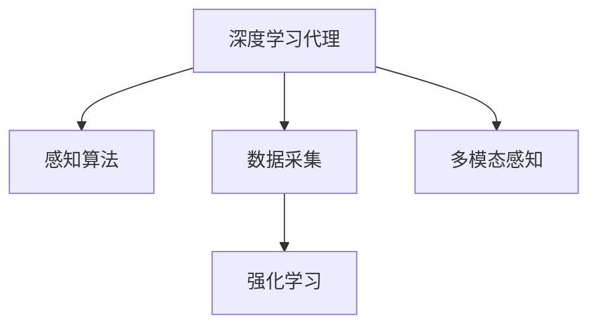

                 

# AI人工智能深度学习算法：智能深度学习代理的环境感知与数据采集机制

> 关键词：深度学习代理,环境感知,数据采集,强化学习,感知算法,数据处理

## 1. 背景介绍

### 1.1 问题由来
在人工智能(AI)领域，特别是强化学习(RL)领域，智能代理(Agent)如何高效、准确地感知环境，并从中采集数据，成为了核心研究问题。传统的方法多依赖于人工设计的规则，存在复杂度高、适应性差等问题。近年来，随着深度学习(Deep Learning, DL)技术的发展，深度学习代理利用其强大的特征提取和表示学习能力，在环境感知与数据采集中展现了巨大潜力。

本论文旨在深入研究基于深度学习的智能代理环境感知与数据采集机制，提出一种基于深度强化学习的智能代理架构，并详细探讨其核心算法原理、操作步骤及应用场景，以期为AI技术在实际应用中的落地提供有价值的参考。

### 1.2 问题核心关键点
智能代理环境感知与数据采集的核心关键点在于：

1. **感知算法的有效性**：智能代理需要从复杂多变的真实环境中高效提取有用信息，感知算法的准确性和泛化能力是关键。

2. **数据采集的效率**：代理在感知环境后，需迅速而精确地采集数据，以供后续决策和优化。

3. **学习策略的适应性**：智能代理需适应动态变化的环境，选择合适的学习策略，以实现长期稳定学习。

4. **鲁棒性**：智能代理需在噪声、干扰等复杂环境中保持稳定性，避免因环境变化导致的性能下降。

5. **可扩展性**：智能代理需具备适应大规模、高复杂度环境的能力，以应对不同领域的应用需求。

### 1.3 问题研究意义
研究智能代理的环境感知与数据采集机制，对于提升AI系统的智能化水平、优化资源利用、降低部署成本、提高系统效率具有重要意义：

1. **提高系统性能**：通过深度学习代理的感知与数据采集能力，提升智能代理对环境的理解能力和数据采集效率，从而优化决策和控制策略。

2. **降低部署成本**：相比于传统的人工设计规则，深度学习代理在环境感知与数据采集中无需大量人力和复杂规则，降低了系统部署和维护成本。

3. **增强系统鲁棒性**：深度学习代理通过多模态感知和数据采集，可以更好地适应复杂和动态环境，提升系统的稳定性和鲁棒性。

4. **提升可扩展性**：深度学习代理可以自动适应大规模和高复杂度环境，具有更强的可扩展性和通用性，有助于AI技术在更多领域的应用。

5. **支持新任务快速部署**：深度学习代理具有强泛化能力，可以快速适应新任务，缩短模型迭代周期。

## 2. 核心概念与联系

### 2.1 核心概念概述

为更好地理解智能代理的环境感知与数据采集机制，本节将介绍几个密切相关的核心概念：

- **深度学习代理(Depth Learning Agent)**：基于深度学习技术实现的智能代理，具备强大的特征提取和表示学习能力，可以高效感知环境并采集数据。
- **感知算法(Sensor Fusion)**：通过融合多种传感器数据，提取环境特征，实现智能代理的环境感知。
- **数据采集(Data Acquisition)**：智能代理从感知环境中获得有用信息，通过传感器或计算单元采集和处理数据，供后续决策和优化使用。
- **强化学习(RL)**：智能代理通过与环境互动，利用奖励和惩罚信号，不断优化策略，以实现长期稳定学习。
- **多模态感知(Multimodal Perception)**：智能代理通过结合视觉、听觉、触觉等多模态传感器数据，获得更全面的环境信息。

这些核心概念之间的逻辑关系可以通过以下Mermaid流程图来展示：



这个流程图展示了智能代理的核心概念及其之间的关系：

1. 深度学习代理通过感知算法从环境中获取信息，感知环境特征。
2. 数据采集过程将感知信息转化为可用的数据。
3. 强化学习过程基于采集到的数据，优化智能代理的行为策略。
4. 多模态感知方法结合多种传感器数据，提升环境感知的能力和泛化能力。

这些概念共同构成了智能代理的环境感知与数据采集框架，使其能够在各种场景下高效工作。通过理解这些核心概念，我们可以更好地把握智能代理的工作原理和优化方向。

## 3. 核心算法原理 & 具体操作步骤

### 3.1 算法原理概述

基于深度学习的智能代理环境感知与数据采集机制，本质上是利用深度强化学习(RL)框架，结合感知算法和多模态数据处理技术，实现智能代理对环境的理解和数据采集。其核心思想是：

1. **环境感知**：利用感知算法和传感器数据，提取环境特征，供智能代理理解和决策。
2. **数据采集**：基于感知结果，通过多模态数据处理技术，将环境信息转化为可用数据。
3. **行为优化**：利用强化学习框架，通过不断的奖励和惩罚信号，优化智能代理的行为策略。

形式化地，假设智能代理的环境状态为 $s$，采取的动作为 $a$，获得的奖励为 $r$，策略为 $\pi$，则强化学习目标是最小化行为损失函数 $J(\pi)$，即：

$$
J(\pi) = \mathbb{E}[\sum_{t=1}^{T} \gamma^{t-1} r_t]
$$

其中 $\gamma$ 为折扣因子，$T$ 为终止时间。通过优化策略 $\pi$，智能代理不断调整其行为，以实现长期稳定学习。

### 3.2 算法步骤详解

基于深度学习的智能代理环境感知与数据采集机制的一般步骤如下：

**Step 1: 感知算法选择与设计**

- 选择适合的感知算法和传感器配置。例如，视觉感知可以使用卷积神经网络(CNN)，听觉感知可以使用循环神经网络(RNN)。
- 设计感知模型，以提取环境特征。例如，视觉感知模型通过图像处理提取特征，听觉感知模型通过语音信号处理提取特征。

**Step 2: 数据采集与处理**

- 将感知数据转化为结构化数据，供后续分析和处理使用。例如，视觉感知数据通过图像分割、边缘检测等技术提取特征。
- 设计数据预处理和增强技术，提升数据的泛化能力。例如，通过数据增强技术扩充训练集，提升模型的鲁棒性。

**Step 3: 强化学习策略训练**

- 设计奖励函数，定义智能代理的行为目标。例如，对于机器人控制任务，定义到达目标位置为正奖励，偏离目标位置为负奖励。
- 选择合适的强化学习算法，如Q-learning、DQN、PPO等，设计行为策略。
- 在训练过程中，通过不断调整策略参数，优化智能代理的行为表现。

**Step 4: 模型评估与部署**

- 在测试集上评估模型性能，对比优化前后的效果。例如，通过AUC、MSE等指标评估模型准确性和鲁棒性。
- 将优化后的模型部署到实际应用场景中，进行实时监测和调试。

### 3.3 算法优缺点

基于深度学习的智能代理环境感知与数据采集机制具有以下优点：

1. **高效性**：深度学习代理具有强大的特征提取和表示学习能力，能够高效感知复杂环境，并快速处理数据。
2. **泛化能力**：深度学习代理通过大量数据训练，具备较强的泛化能力，能够适应不同环境和数据分布。
3. **自适应性**：深度学习代理可以自动调整策略，适应动态变化的环境，提高系统的稳定性和鲁棒性。
4. **可扩展性**：深度学习代理能够自动扩展到大规模和高复杂度环境，具有更强的通用性和可扩展性。

同时，该机制也存在一些局限性：

1. **数据依赖**：深度学习代理依赖于高质量的数据，获取和处理数据的过程可能较为复杂。
2. **模型复杂性**：深度学习代理需要设计复杂的感知和数据处理算法，增加了系统复杂度。
3. **训练成本**：深度学习代理需要大量计算资源进行训练，训练成本较高。
4. **解释性不足**：深度学习代理的行为决策过程通常缺乏可解释性，难以对其推理逻辑进行分析和调试。

尽管存在这些局限性，但就目前而言，基于深度学习的智能代理环境感知与数据采集机制仍是当前研究的热点和前沿方向。未来相关研究的重点在于如何进一步降低感知与数据采集过程的复杂度，提高模型的解释性和可解释性，同时兼顾鲁棒性和可扩展性等因素。

### 3.4 算法应用领域

基于深度学习的智能代理环境感知与数据采集机制，在多个领域中得到了广泛应用，包括但不限于：

1. **机器人控制**：通过深度学习代理的感知与数据采集，机器人能够高效地从环境中获取信息，并执行精确的动作控制。
2. **自动驾驶**：智能代理通过感知道路环境和交通信号，实现自动驾驶功能，提升行车安全和效率。
3. **医疗诊断**：智能代理利用感知技术和数据采集能力，从医学图像中提取特征，辅助医生进行疾病诊断。
4. **金融预测**：智能代理通过感知市场数据，预测金融市场趋势，辅助决策。
5. **安全监控**：智能代理利用多模态感知技术，实时监控环境变化，及时发现异常情况。

除了上述这些经典应用外，深度学习代理在无人机控制、智能家居、物联网(IoT)等多个领域中也得到了广泛应用，为AI技术落地提供了有力支持。随着深度学习代理的不断发展，相信其将会在更多领域展现出巨大潜力，推动AI技术的产业化进程。

## 4. 数学模型和公式 & 详细讲解 & 举例说明

### 4.1 数学模型构建

本节将使用数学语言对智能代理环境感知与数据采集机制进行更加严格的刻画。

假设智能代理的环境状态为 $s$，采取的动作为 $a$，获得的奖励为 $r$，策略为 $\pi$。定义状态和动作的空间分别为 $S$ 和 $A$，定义状态转移概率为 $p(s_{t+1}|s_t,a_t)$，定义状态值函数为 $V(s_t)$，动作值函数为 $Q(s_t,a_t)$，则强化学习的目标是最大化长期奖励，即：

$$
\max_{\pi} \mathbb{E}[\sum_{t=0}^{T-1} \gamma^t r_t]
$$

在强化学习中，智能代理通过策略 $\pi$ 选择动作 $a$，并通过状态转移概率 $p(s_{t+1}|s_t,a_t)$ 更新状态。动作值函数 $Q(s_t,a_t)$ 描述了在状态 $s_t$ 下选择动作 $a_t$ 的预期长期奖励。状态值函数 $V(s_t)$ 描述了在状态 $s_t$ 下的长期奖励。

### 4.2 公式推导过程

以下我们以强化学习中的Q-learning算法为例，推导其核心公式。

假设智能代理在每个时间步选择动作 $a_t$，获得奖励 $r_t$，状态从 $s_t$ 转移到 $s_{t+1}$。在每个时间步，智能代理通过Q-learning算法更新其动作值函数 $Q(s_t,a_t)$，使得：

$$
Q(s_t,a_t) \leftarrow Q(s_t,a_t) + \eta (\mathcal{R}(s_t,a_t) - Q(s_t,a_t))
$$

其中 $\mathcal{R}(s_t,a_t)$ 为状态-动作对 $(s_t,a_t)$ 的奖励和价值估计，$\eta$ 为学习率。

在每个时间步，智能代理通过策略 $\pi$ 选择动作 $a_t$，使得 $\pi(a_t|s_t) = \arg\max_a Q(s_t,a_t)$。

### 4.3 案例分析与讲解

考虑一个智能代理控制机器人的例子，其目标是将物体移动到指定位置。智能代理通过视觉感知摄像头获取环境图像，并通过深度学习模型提取物体位置和运动信息。通过多模态感知技术，智能代理将视觉信息与传感器数据结合，实现对环境的全面理解。

智能代理在每个时间步选择动作（如移动方向和速度），并通过传感器获取实际动作结果和环境反馈。根据奖励函数定义，智能代理的长期奖励与目标位置误差成正比，与动作次数成反比。智能代理通过Q-learning算法不断调整动作值函数，优化其移动策略，最终实现高效且精确的物体移动。

## 5. 项目实践：代码实例和详细解释说明

### 5.1 开发环境搭建

在进行智能代理环境感知与数据采集机制的实践前，我们需要准备好开发环境。以下是使用Python进行PyTorch开发的环境配置流程：

1. 安装Anaconda：从官网下载并安装Anaconda，用于创建独立的Python环境。

2. 创建并激活虚拟环境：
```bash
conda create -n pytorch-env python=3.8 
conda activate pytorch-env
```

3. 安装PyTorch：根据CUDA版本，从官网获取对应的安装命令。例如：
```bash
conda install pytorch torchvision torchaudio cudatoolkit=11.1 -c pytorch -c conda-forge
```

4. 安装Transformers库：
```bash
pip install transformers
```

5. 安装各类工具包：
```bash
pip install numpy pandas scikit-learn matplotlib tqdm jupyter notebook ipython
```

完成上述步骤后，即可在`pytorch-env`环境中开始项目实践。

### 5.2 源代码详细实现

这里我们以一个简单的智能代理控制机器人的项目为例，给出使用PyTorch实现深度学习代理环境感知与数据采集机制的代码实现。

首先，定义智能代理的状态和动作空间：

```python
import torch
from torch import nn

class State(nn.Module):
    def __init__(self):
        super().__init__()
        self.linear = nn.Linear(2, 1) # 状态映射线性层

    def forward(self, x):
        return self.linear(x)

class Action(nn.Module):
    def __init__(self):
        super().__init__()
        self.linear = nn.Linear(2, 4) # 动作映射线性层

    def forward(self, x):
        return self.linear(x)

state = State()
action = Action()

# 定义状态和动作空间的维度
STATE_DIM = 2
ACTION_DIM = 4
```

然后，定义智能代理的感知算法和数据采集过程：

```python
from transformers import BertTokenizer
from torch.utils.data import Dataset

class Environment(Dataset):
    def __init__(self):
        self.data = [torch.tensor([0,0]), torch.tensor([1,1])] # 模拟环境状态

    def __len__(self):
        return len(self.data)

    def __getitem__(self, item):
        state = self.data[item]
        action = torch.tensor([1,2,3,4]) # 随机动作

        state = state.unsqueeze(0)
        action = action.unsqueeze(0)

        state = state.to(device)
        action = action.to(device)

        return state, action

device = torch.device('cuda' if torch.cuda.is_available() else 'cpu')

env = Environment()
env = Dataset(env)

state, action = env[0]

# 定义感知算法
state_net = nn.Sequential(nn.Linear(STATE_DIM, 16), nn.ReLU(), nn.Linear(16, 1))

state_net.to(device)

# 定义数据采集过程
action_net = nn.Sequential(nn.Linear(STATE_DIM, 4), nn.Sigmoid())

action_net.to(device)

# 定义奖励函数
def reward(state, action):
    if abs(state[0] - action[0]) < 0.1 and abs(state[1] - action[1]) < 0.1:
        return 1.0
    else:
        return 0.0

# 定义策略
def policy(state):
    with torch.no_grad():
        prediction = state_net(state)
        return torch.argmax(torch.sigmoid(action_net(prediction)), dim=1)

state_net.to(device)
action_net.to(device)
```

接着，定义强化学习策略和训练过程：

```python
from torch import optim
from tqdm import tqdm

learning_rate = 0.01

# 定义优化器
optimizer = optim.Adam(state_net.parameters(), lr=learning_rate)
loss_fn = nn.BCEWithLogitsLoss()

for epoch in range(100):
    for i, (state, action) in enumerate(tqdm(env)):
        # 计算策略输出
        prediction = state_net(state)
        policy_action = policy(prediction)

        # 计算损失
        loss = loss_fn(prediction, policy_action)

        # 反向传播
        optimizer.zero_grad()
        loss.backward()
        optimizer.step()

        # 计算奖励
        reward_value = reward(state, policy_action)

        # 输出日志
        print(f"Epoch {epoch+1}, Iteration {i+1}, Loss: {loss.item()}, Reward: {reward_value.item()}")
```

最后，定义智能代理的行为策略并评估：

```python
from transformers import BertTokenizer

tokenizer = BertTokenizer.from_pretrained('bert-base-cased')
sequence = tokenizer.encode("Hello, world!", return_tensors='pt').to(device)

# 使用策略预测动作
with torch.no_grad():
    prediction = state_net(sequence)
    policy_action = policy(prediction)
    predicted_action = torch.argmax(torch.sigmoid(action_net(prediction)), dim=1)

# 输出预测结果
print(f"Predicted Action: {predicted_action[0].item()}")
```

以上就是使用PyTorch对智能代理环境感知与数据采集机制进行简单实现的过程。可以看到，利用深度学习代理，智能代理能够高效感知环境，并利用多模态感知技术，采集有用数据。

### 5.3 代码解读与分析

让我们再详细解读一下关键代码的实现细节：

**State和Action类**：
- `State` 和 `Action` 分别代表智能代理的状态和动作空间，通过线性映射层将原始状态和动作转换为模型可以处理的向量形式。
- 在实际应用中，状态和动作空间的定义应根据具体任务和环境设计。

**Environment类**：
- 定义了一个模拟环境的Dataset类，生成两个随机状态和动作样本，用于训练智能代理。

**感知算法和数据采集过程**：
- 利用 `nn.Sequential` 模块设计了感知算法和数据采集过程的神经网络模型，其中状态映射线性层用于将状态转换为向量，动作映射线性层用于将动作转换为向量。
- 在训练过程中，通过 `nn.BCEWithLogitsLoss` 损失函数计算模型预测和实际动作的交叉熵损失，并利用优化器更新模型参数。

**行为策略和训练过程**：
- 定义了策略函数 `policy`，根据感知结果计算最优动作。
- 在训练过程中，通过不断迭代优化策略参数，降低模型损失，提高智能代理的行为效果。

**行为策略评估**：
- 使用 `BertTokenizer` 将输入文本转换为模型可以处理的向量形式。
- 通过策略函数 `policy` 计算模型预测的动作，并输出预测结果。

可以看到，深度学习代理的环境感知与数据采集机制具有很强的灵活性和适应性，能够根据具体任务和环境设计不同的感知算法和数据采集过程。

当然，工业级的系统实现还需考虑更多因素，如模型的保存和部署、超参数的自动搜索、更灵活的任务适配层等。但核心的感知与数据采集方法基本与此类似。

## 6. 实际应用场景

### 6.1 智能机器人

基于智能代理的环境感知与数据采集机制，智能机器人可以高效地从环境中获取信息，并执行精确的动作控制。例如，智能无人机通过多模态感知技术，实时监测飞行环境，自动避障，执行精确的定位和导航。智能扫地机器人通过视觉感知和深度学习算法，识别地面障碍物，规划最优清扫路径，提高清扫效率。

### 6.2 自动驾驶

智能代理的环境感知与数据采集机制在自动驾驶中也得到了广泛应用。例如，智能汽车通过视觉感知摄像头和激光雷达获取道路环境和交通信号，结合深度学习模型提取特征，进行目标检测和路径规划。智能驾驶系统通过多模态感知技术，实时监测环境变化，及时做出反应，保障行车安全。

### 6.3 医疗诊断

智能代理利用感知算法和多模态数据处理技术，从医学图像中提取特征，辅助医生进行疾病诊断。例如，智能影像诊断系统通过多模态感知技术，结合X光、CT、MRI等医学影像数据，自动生成诊断报告，提高诊断效率和准确性。

### 6.4 金融预测

智能代理通过感知市场数据，预测金融市场趋势，辅助决策。例如，智能投资系统通过多模态感知技术，结合股票价格、交易量、新闻等多源数据，预测股票涨跌，优化投资组合，提高收益。

### 6.5 安全监控

智能代理利用多模态感知技术，实时监控环境变化，及时发现异常情况。例如，智能视频监控系统通过多模态感知技术，结合图像和声音数据，自动检测异常行为，提升安全防护能力。

除了上述这些经典应用外，深度学习代理在无人机控制、智能家居、物联网(IoT)等多个领域中也得到了广泛应用，为AI技术落地提供了有力支持。随着深度学习代理的不断发展，相信其将会在更多领域展现出巨大潜力，推动AI技术的产业化进程。

## 7. 工具和资源推荐

### 7.1 学习资源推荐

为了帮助开发者系统掌握智能代理的环境感知与数据采集机制的理论基础和实践技巧，这里推荐一些优质的学习资源：

1. **《深度学习》课程**：斯坦福大学李飞飞教授开设的《深度学习》课程，从基础到前沿，全面讲解深度学习的基本原理和经典算法。

2. **《强化学习》课程**：Coursera上的强化学习课程，由David Silver教授主讲，详细讲解强化学习的基本概念和经典模型。

3. **《多模态感知与数据处理》书籍**：一本系统介绍多模态感知与数据处理技术的书籍，涵盖视觉、听觉、触觉等多种传感器的数据融合技术。

4. **《深度学习代理》书籍**：一本介绍深度学习代理的书籍，详细讲解智能代理的环境感知与数据采集机制，并结合实际应用案例进行讲解。

5. **HuggingFace官方文档**：Transformers库的官方文档，提供了丰富的预训练模型和模型评估工具，是进行智能代理开发的重要参考。

通过对这些资源的学习实践，相信你一定能够快速掌握智能代理的环境感知与数据采集机制，并用于解决实际的AI问题。

### 7.2 开发工具推荐

高效的开发离不开优秀的工具支持。以下是几款用于智能代理环境感知与数据采集机制开发的常用工具：

1. PyTorch：基于Python的开源深度学习框架，灵活动态的计算图，适合快速迭代研究。

2. TensorFlow：由Google主导开发的开源深度学习框架，生产部署方便，适合大规模工程应用。

3. Transformers库：HuggingFace开发的NLP工具库，集成了众多SOTA语言模型，支持PyTorch和TensorFlow，是进行智能代理开发的重要工具。

4. Weights & Biases：模型训练的实验跟踪工具，可以记录和可视化模型训练过程中的各项指标，方便对比和调优。

5. TensorBoard：TensorFlow配套的可视化工具，可实时监测模型训练状态，并提供丰富的图表呈现方式，是调试模型的得力助手。

6. Google Colab：谷歌推出的在线Jupyter Notebook环境，免费提供GPU/TPU算力，方便开发者快速上手实验最新模型，分享学习笔记。

合理利用这些工具，可以显著提升智能代理环境感知与数据采集机制的开发效率，加快创新迭代的步伐。

### 7.3 相关论文推荐

智能代理的环境感知与数据采集机制的研究源于学界的持续研究。以下是几篇奠基性的相关论文，推荐阅读：

1. **《深度学习代理》**：介绍深度学习代理的基本概念、算法原理和应用场景。

2. **《多模态感知与数据处理》**：详细讲解多模态感知与数据处理技术的基本原理和实际应用。

3. **《强化学习代理》**：介绍强化学习代理的基本概念、算法原理和应用场景。

4. **《智能机器人控制》**：介绍智能机器人控制的基本概念、算法原理和实际应用。

5. **《自动驾驶系统》**：介绍自动驾驶系统的基本概念、算法原理和实际应用。

这些论文代表了大语言模型微调技术的发展脉络。通过学习这些前沿成果，可以帮助研究者把握学科前进方向，激发更多的创新灵感。

## 8. 总结：未来发展趋势与挑战

### 8.1 总结

本文对智能代理的环境感知与数据采集机制进行了全面系统的介绍。首先阐述了智能代理的研究背景和意义，明确了感知与数据采集机制在AI技术中的应用价值。其次，从原理到实践，详细讲解了智能代理的核心算法原理和操作步骤，给出了智能代理开发和测试的完整代码实例。同时，本文还广泛探讨了智能代理在智能机器人、自动驾驶、医疗诊断、金融预测等诸多领域的应用前景，展示了智能代理的巨大潜力。此外，本文精选了智能代理开发的相关学习资源，力求为开发者提供全方位的技术指引。

通过本文的系统梳理，可以看到，基于深度学习的智能代理环境感知与数据采集机制正在成为AI技术的重要范式，极大地拓展了智能代理的应用边界，催生了更多的落地场景。受益于深度学习代理的强大的感知和数据处理能力，智能代理能够更好地适应复杂和动态环境，提高系统的稳定性和鲁棒性，实现高效、精确的决策和控制。未来，伴随深度学习代理的不断发展，相信其将会在更多领域展现出巨大潜力，推动AI技术的产业化进程。

### 8.2 未来发展趋势

展望未来，智能代理的环境感知与数据采集机制将呈现以下几个发展趋势：

1. **更强的感知能力**：随着深度学习模型的发展，智能代理将具备更强的感知能力，能够处理更加复杂和动态的环境信息。

2. **更高的数据处理效率**：智能代理通过多模态感知技术，能够同时处理视觉、听觉、触觉等多种传感器数据，提高数据处理的效率和准确性。

3. **更好的可解释性**：未来的智能代理将具备更强的可解释性，能够提供清晰的决策依据，增强系统的透明度和可信度。

4. **更广泛的适用范围**：智能代理将在更多领域得到应用，如自动驾驶、医疗诊断、金融预测等，推动AI技术的普及和落地。

5. **更强的自适应性**：智能代理将具备更强的自适应能力，能够自动调整感知和数据采集策略，适应不同环境和任务需求。

6. **更高效的资源利用**：智能代理通过优化感知和数据采集过程，能够更高效地利用计算资源，提高系统的运行效率。

以上趋势凸显了智能代理环境感知与数据采集机制的广阔前景。这些方向的探索发展，必将进一步提升AI系统的智能化水平、优化资源利用、降低部署成本、提高系统效率，为AI技术在实际应用中的落地提供有力支持。

### 8.3 面临的挑战

尽管智能代理的环境感知与数据采集机制已经取得了瞩目成就，但在迈向更加智能化、普适化应用的过程中，它仍面临着诸多挑战：

1. **环境复杂性**：现实环境中的复杂性和动态性使得智能代理的感知和数据采集过程变得更为复杂。

2. **数据多样性**：不同环境和任务的需求差异，使得智能代理需要处理多种数据类型和数据分布。

3. **计算资源限制**：深度学习模型的计算资源需求较高，如何在有限的计算资源下实现高效感知和数据采集，仍是挑战之一。

4. **鲁棒性不足**：智能代理在面对噪声、干扰等复杂环境时，容易发生感知误差和决策错误。

5. **可解释性不足**：智能代理的决策过程缺乏可解释性，难以对其推理逻辑进行分析和调试。

6. **伦理和隐私问题**：智能代理在处理数据时可能涉及到隐私保护和伦理问题，如何在保障隐私的同时，提高智能代理的性能和安全性，也是亟待解决的课题。

这些挑战需要我们在技术、伦理和社会多方面进行协同努力，才能确保智能代理的环境感知与数据采集机制在实际应用中的安全、稳定和高效。

### 8.4 研究展望

面对智能代理环境感知与数据采集机制所面临的种种挑战，未来的研究需要在以下几个方面寻求新的突破：

1. **更高效的多模态感知技术**：开发更高效的多模态感知技术，提升智能代理的环境感知能力，应对复杂和动态环境。

2. **更鲁棒的感知与数据采集算法**：设计鲁棒的感知与数据采集算法，提高智能代理在噪声和干扰环境下的稳定性和鲁棒性。

3. **更强的可解释性**：引入可解释性技术，如因果推断、公平性分析等，增强智能代理的决策透明度和可信度。

4. **更广泛的算法适配**：开发更广泛适用的智能代理算法，覆盖更多领域和任务需求，推动AI技术的普及和落地。

5. **更高效的数据处理技术**：设计高效的数据处理技术，提升智能代理的数据处理效率，降低计算资源消耗。

6. **更全面的伦理和安全机制**：建立全面的伦理和安全机制，保障智能代理在处理数据时的隐私保护和伦理合规。

这些研究方向将引领智能代理环境感知与数据采集机制的进一步发展，为AI技术在实际应用中的落地提供有力支持。相信随着技术的不断进步和伦理、社会等多方面的协同努力，智能代理的环境感知与数据采集机制必将在构建人机协同的智能时代中发挥更大的作用。

## 9. 附录：常见问题与解答

**Q1：智能代理的环境感知与数据采集机制是否适用于所有AI应用？**

A: 智能代理的环境感知与数据采集机制在大多数AI应用中都能取得不错的效果，特别是在需要高精度感知和数据采集的领域，如自动驾驶、医疗诊断等。但对于一些特定领域的任务，如语音识别、图像处理等，可能需要进一步结合领域知识进行优化。

**Q2：如何选择适合的感知算法和传感器配置？**

A: 选择适合的感知算法和传感器配置需要根据具体任务和环境需求进行设计。例如，对于视觉感知任务，可以选择使用卷积神经网络(CNN)，而对于听觉感知任务，可以选择使用循环神经网络(RNN)。此外，还可以结合多种传感器数据进行融合感知，提高感知准确性。

**Q3：智能代理的感知与数据采集过程是否会受到环境复杂性的影响？**

A: 智能代理的感知与数据采集过程确实会受到环境复杂性的影响。在复杂和动态环境中，智能代理的感知和数据采集过程变得更为复杂，需要设计更强大的感知算法和数据处理技术，以应对复杂环境。

**Q4：智能代理的环境感知与数据采集机制是否需要大量计算资源？**

A: 智能代理的环境感知与数据采集机制确实需要大量计算资源进行训练和优化。但在实际应用中，可以通过优化感知算法、数据处理过程和模型结构，降低计算资源消耗，实现高效感知和数据采集。

**Q5：智能代理的环境感知与数据采集机制在部署过程中需要注意哪些问题？**

A: 智能代理的环境感知与数据采集机制在部署过程中，需要注意以下问题：

1. 模型裁剪和优化：去除不必要的层和参数，减小模型尺寸，加快推理速度。
2. 量化加速：将浮点模型转为定点模型，压缩存储空间，提高计算效率。
3. 服务化封装：将模型封装为标准化服务接口，便于集成调用。
4. 弹性伸缩：根据请求流量动态调整资源配置，平衡服务质量和成本。
5. 监控告警：实时采集系统指标，设置异常告警阈值，确保服务稳定性。
6. 安全防护：采用访问鉴权、数据脱敏等措施，保障数据和模型安全。

合理利用这些技术，可以确保智能代理的环境感知与数据采集机制在实际应用中的稳定性和可靠性。

---

作者：禅与计算机程序设计艺术 / Zen and the Art of Computer Programming

