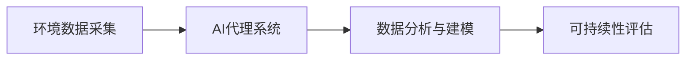
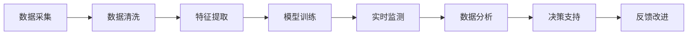
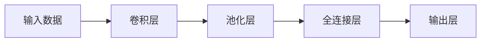
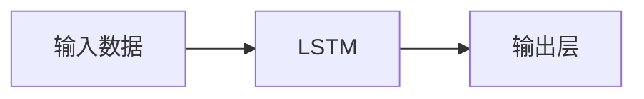

                 

## 1. 背景介绍

### 1.1 问题由来
随着全球气候变化和环境问题的日益加剧，环境监控与可持续性分析（Environmental Monitoring and Sustainability Analysis, EM/SA）成为了全球关注的重点。传统的环境监控和分析往往依赖于人工巡查和定期采样，耗时耗力，且存在遗漏和误差。而新兴的AI技术，尤其是基于深度学习的代理（Agent）系统，在自动化的环境监控与分析中展现了巨大的潜力。

### 1.2 问题核心关键点
环境监控与可持续性分析的核心问题在于，如何利用AI代理系统实时、准确地监测环境状态，并从中提取有价值的可持续性信息。AI代理系统通过学习大量历史环境数据和实时传感数据，能够在无需人工干预的情况下，自主地完成环境监测和数据分析任务。

### 1.3 问题研究意义
AI代理在环境监控与可持续性分析中的应用，对于提高环境监测的自动化水平、减少人力成本、提升数据分析的准确性和实时性具有重要意义。具体而言：

1. **自动化监测**：AI代理能够全天候不间断地监测环境状态，减少人工巡查的需求，降低环境监控成本。
2. **数据实时性**：AI代理系统实时处理和分析数据，快速响应环境变化，提升决策的及时性和准确性。
3. **数据分析精度**：通过深度学习技术，AI代理系统可以从复杂的数据中提取出关键特征，提供更精准的环境评估和预测。
4. **可持续性决策**：AI代理能够综合考虑环境数据和人类社会需求，提供科学的决策建议，支持可持续性发展。

## 2. 核心概念与联系

### 2.1 核心概念概述

环境监控与可持续性分析涉及多个核心概念，主要包括：

- **环境数据采集**：通过传感器、遥感设备等手段，获取环境状态的实时数据。
- **AI代理系统**：基于深度学习算法，能够自主地分析环境数据，提取有价值信息。
- **数据分析与建模**：对采集到的环境数据进行统计分析、时间序列建模等，以预测未来的环境变化趋势。
- **可持续性评估**：结合环境数据和社会经济因素，进行综合评估，提出可行的可持续性方案。

这些概念之间的联系如图1所示，环境数据采集是基础，AI代理系统是核心，数据分析与建模是手段，可持续性评估是目标。



### 2.2 核心概念原理和架构的 Mermaid 流程图

环境监控与可持续性分析的整个流程可以分解为以下几个步骤：



**步骤说明**：
- **数据采集**：通过传感器、遥感设备等手段，获取环境状态数据。
- **数据清洗**：处理缺失、异常数据，保证数据质量。
- **特征提取**：利用深度学习技术，从原始数据中提取关键特征。
- **模型训练**：使用监督学习、无监督学习等方法，训练AI代理模型。
- **实时监测**：部署AI代理模型，实时监测环境状态。
- **数据分析**：对实时监测数据进行统计分析，提取趋势和模式。
- **决策支持**：结合数据分析结果，提供环境决策建议。
- **反馈改进**：根据环境反馈，不断改进模型和监测策略。

## 3. 核心算法原理 & 具体操作步骤
### 3.1 算法原理概述

基于深度学习的AI代理系统，其核心算法原理主要包括以下几个方面：

- **深度学习模型**：使用卷积神经网络（CNN）、循环神经网络（RNN）、长短期记忆网络（LSTM）、Transformer等深度学习模型，对环境数据进行特征提取和分析。
- **监督学习**：通过大量标注数据训练模型，使其能够识别环境变化和异常。
- **无监督学习**：利用无标注的环境数据，学习环境状态的自然分布和规律。
- **强化学习**：通过模拟环境和实际反馈，优化AI代理的行为策略。

### 3.2 算法步骤详解

AI代理系统在环境监控与可持续性分析中的应用，主要包括以下几个步骤：

**Step 1: 数据采集**
- 部署各类传感器和遥感设备，采集环境数据，如气温、湿度、水质、污染物浓度等。
- 数据采集设备需具有高精度、低功耗、长寿命等特性。

**Step 2: 数据清洗与预处理**
- 对采集到的原始数据进行缺失值填充、异常值检测、噪声滤除等处理。
- 利用标准化、归一化等技术，将数据转换为适合模型处理的形式。

**Step 3: 特征提取与建模**
- 使用深度学习模型，如CNN、RNN、LSTM等，对环境数据进行特征提取。
- 利用监督学习或无监督学习算法，建立环境状态预测模型。
- 模型训练时，需设置合适的损失函数和优化器，如均方误差、交叉熵、AdamW等。

**Step 4: 实时监测与分析**
- 将训练好的AI代理模型部署在云端或边缘设备上，实时接收环境数据。
- 模型对输入数据进行前向传播，输出环境状态预测结果。
- 利用数据分析技术，如时间序列分析、聚类分析、关联规则挖掘等，对预测结果进行进一步分析。

**Step 5: 决策支持与反馈改进**
- 结合数据分析结果和环境需求，提供环境决策支持建议。
- 利用强化学习等技术，不断优化AI代理的行为策略，提升环境监控效果。
- 定期收集环境反馈数据，进行模型改进和参数调整。

### 3.3 算法优缺点

基于深度学习的AI代理系统在环境监控与可持续性分析中具有以下优点：

- **实时性**：深度学习模型具有实时处理数据的能力，能够快速响应环境变化。
- **自动化**：AI代理系统可以全天候不间断地监测环境，减少人工干预。
- **数据处理能力强**：深度学习模型可以从海量数据中提取关键特征，提升数据分析精度。
- **可扩展性强**：AI代理系统可以根据需要，动态调整模型结构和参数，适应不同环境需求。

但同时，该系统也存在一些缺点：

- **高计算资源需求**：深度学习模型计算复杂度高，需要大量计算资源和存储空间。
- **模型解释性差**：深度学习模型通常是"黑盒"模型，难以解释其内部工作机制。
- **数据标注成本高**：训练深度学习模型需要大量高质量标注数据，成本较高。
- **对抗攻击脆弱**：深度学习模型对对抗攻击较为敏感，可能受到恶意攻击。

### 3.4 算法应用领域

AI代理系统在环境监控与可持续性分析中的应用非常广泛，涵盖以下几个领域：

- **空气质量监测**：通过传感器监测空气污染物浓度，预测空气质量变化趋势。
- **水质监测**：利用遥感设备和传感器监测水质参数，评估水体健康状况。
- **智能电网**：结合环境数据和电网负荷，优化电力生产和分配。
- **智慧农业**：通过环境监测数据，优化农业生产决策，提升农业效率和可持续性。
- **灾害预警**：结合气象数据和环境数据，提前预警自然灾害，减少灾害损失。
- **城市管理**：利用环境数据，优化城市交通、垃圾处理等管理决策。

## 4. 数学模型和公式 & 详细讲解

### 4.1 数学模型构建

环境监控与可持续性分析的数学模型主要包括以下几个部分：

- **输入数据**：环境监测设备采集到的各类传感器数据。
- **特征提取**：使用深度学习模型，提取环境数据的特征表示。
- **模型训练**：利用监督学习或无监督学习算法，训练环境状态预测模型。
- **预测与评估**：根据训练好的模型，进行环境状态预测和评估。

假设输入数据为 $x$，环境状态预测模型为 $f(x; \theta)$，其中 $\theta$ 为模型参数。模型的损失函数为 $\mathcal{L}(f(x), y)$，其中 $y$ 为真实环境状态。

**监督学习模型**：假设模型为 $f(x; \theta) = \theta^T \cdot g(x)$，其中 $g(x)$ 为特征映射函数。损失函数为：
$$
\mathcal{L}(f(x), y) = \frac{1}{N} \sum_{i=1}^N \ell(f(x_i), y_i)
$$
其中 $\ell$ 为指定损失函数，如均方误差、交叉熵等。

**无监督学习模型**：假设模型为 $f(x; \theta) = \theta^T \cdot g(x)$，其中 $g(x)$ 为特征映射函数。损失函数为：
$$
\mathcal{L}(f(x), y) = \frac{1}{N} \sum_{i=1}^N \|f(x_i) - y_i\|
$$

### 4.2 公式推导过程

以空气质量监测为例，假设输入数据为气温 $T$、湿度 $H$、PM2.5 浓度 $PM_{2.5}$，输出为空气质量指数 $AQI$。使用深度学习模型进行特征提取和预测。

**模型定义**：使用卷积神经网络（CNN）进行特征提取和预测。模型结构如图2所示。



**特征提取**：
- 输入数据 $x = (T, H, PM_{2.5})$。
- 使用卷积层提取局部特征 $g_1(x)$。
- 使用池化层进行特征降维 $g_2(x)$。
- 将降维后的特征输入全连接层 $g_3(x)$。
- 输出为空气质量指数 $AQI = g_4(g_3(g_2(g_1(x))))$。

**损失函数**：假设真实环境状态 $y$ 为 $AQI$ 的真实值，使用均方误差作为损失函数：
$$
\mathcal{L}(AQI, y) = \frac{1}{N} \sum_{i=1}^N (AQI_i - y_i)^2
$$

**优化器**：使用 AdamW 优化器进行模型参数更新：
$$
\theta \leftarrow \theta - \eta \nabla_{\theta}\mathcal{L}(\theta)
$$
其中 $\eta$ 为学习率，$\nabla_{\theta}\mathcal{L}(\theta)$ 为损失函数对模型参数的梯度。

### 4.3 案例分析与讲解

以水质监测为例，假设输入数据为水温 $T$、溶解氧 $DO$、氨氮浓度 $NH_3-N$，输出为水质指数 $WI$。使用长短期记忆网络（LSTM）进行特征提取和预测。

**模型定义**：使用 LSTM 网络进行特征提取和预测。模型结构如图3所示。



**特征提取**：
- 输入数据 $x = (T, DO, NH_3-N)$。
- 使用 LSTM 网络提取序列特征 $g(x)$。
- 输出为水质指数 $WI = g(x)$。

**损失函数**：假设真实环境状态 $y$ 为 $WI$ 的真实值，使用均方误差作为损失函数：
$$
\mathcal{L}(WI, y) = \frac{1}{N} \sum_{i=1}^N (WI_i - y_i)^2
$$

**优化器**：使用 AdamW 优化器进行模型参数更新：
$$
\theta \leftarrow \theta - \eta \nabla_{\theta}\mathcal{L}(\theta)
$$

**模型训练**：在大量历史水质监测数据上进行模型训练，使用 AdamW 优化器进行参数更新。训练过程中，需设置合适的学习率、批大小、迭代轮数等参数。

**实时监测**：将训练好的 LSTM 模型部署在云端或边缘设备上，实时接收水质监测数据，进行水质指数预测。预测结果可用于水质预警和应急响应。

## 5. 项目实践：代码实例和详细解释说明

### 5.1 开发环境搭建

在环境监控与可持续性分析的项目中，首先需要搭建开发环境。以下是Python开发环境搭建的具体步骤：

1. 安装Anaconda：从官网下载并安装Anaconda，用于创建独立的Python环境。

2. 创建并激活虚拟环境：
```bash
conda create -n emsa python=3.8 
conda activate emsa
```

3. 安装必要的Python包：
```bash
pip install torch torchvision transformers scipy pandas numpy scikit-learn matplotlib seaborn jupyter notebook
```

4. 安装深度学习框架：
```bash
pip install tensorflow-gpu==2.7.0
```

5. 安装环境监控相关的库：
```bash
pip install sensorpy pymeteo
```

完成上述步骤后，即可在`emsa`环境中进行环境监控与可持续性分析的开发。

### 5.2 源代码详细实现

以下是使用TensorFlow进行空气质量监测的Python代码实现：

```python
import tensorflow as tf
from tensorflow.keras import layers, models

# 定义卷积神经网络
def build_cnn_model(input_shape):
    model = models.Sequential([
        layers.Conv2D(32, (3, 3), activation='relu', input_shape=input_shape),
        layers.MaxPooling2D((2, 2)),
        layers.Conv2D(64, (3, 3), activation='relu'),
        layers.MaxPooling2D((2, 2)),
        layers.Flatten(),
        layers.Dense(128, activation='relu'),
        layers.Dense(1, activation='linear')
    ])
    return model

# 加载并预处理数据
def load_and_preprocess_data():
    # 加载气温、湿度、PM2.5 数据
    T_data, H_data, PM25_data = load_data('air_quality.csv')
    # 数据标准化
    T_data = (T_data - T_mean) / T_std
    H_data = (H_data - H_mean) / H_std
    PM25_data = (PM25_data - PM25_mean) / PM25_std
    # 将数据转换为 (样本数, 时间步长, 特征数) 的格式
    T_data = T_data.reshape((-1, 1, T_data.shape[1]))
    H_data = H_data.reshape((-1, 1, H_data.shape[1]))
    PM25_data = PM25_data.reshape((-1, 1, PM25_data.shape[1]))
    return T_data, H_data, PM25_data

# 训练模型
def train_model(model, T_data, H_data, PM25_data, epochs=10, batch_size=32):
    # 构建数据集
    dataset = tf.data.Dataset.from_tensor_slices((T_data, H_data, PM25_data)).shuffle(buffer_size=10000).batch(batch_size)
    # 定义损失函数和优化器
    loss_fn = tf.keras.losses.MeanSquaredError()
    optimizer = tf.keras.optimizers.Adam(learning_rate=0.001)
    # 训练模型
    model.compile(optimizer=optimizer, loss=loss_fn, metrics=['mae'])
    model.fit(dataset, epochs=epochs, validation_split=0.2)

# 加载并运行模型
if __name__ == '__main__':
    T_data, H_data, PM25_data = load_and_preprocess_data()
    model = build_cnn_model((1, T_data.shape[1], H_data.shape[1], PM25_data.shape[1]))
    train_model(model, T_data, H_data, PM25_data)
```

### 5.3 代码解读与分析

**数据预处理**：
- 加载气温、湿度、PM2.5 数据，并进行标准化处理。
- 将数据转换为 (样本数, 时间步长, 特征数) 的格式，适合卷积神经网络处理。

**模型构建**：
- 使用卷积神经网络（CNN）进行特征提取和预测。
- 模型由多个卷积层、池化层和全连接层构成。

**模型训练**：
- 使用 Adam 优化器进行模型参数更新。
- 训练过程中，设置合适的学习率、批大小、迭代轮数等参数。

**模型评估**：
- 在验证集上评估模型性能，使用均方误差（MAE）作为评估指标。

## 6. 实际应用场景

### 6.1 智能电网

智能电网是AI代理系统在环境监控与可持续性分析中的一个典型应用场景。通过部署环境监控设备和电网监测设备，结合深度学习算法，可以实现电网的优化运行和智能调度。

**应用场景**：
- 实时监测电网负荷、环境参数（如温度、湿度）。
- 预测电网负荷变化和环境污染趋势。
- 优化电网运行策略，减少能源浪费。

**具体实现**：
- 部署环境监控设备（如传感器）和电网监测设备（如智能电表）。
- 收集环境参数和电网负荷数据。
- 使用深度学习模型（如RNN、LSTM）进行数据分析和预测。
- 结合环境参数和负荷预测结果，优化电网运行策略。

### 6.2 智慧农业

智慧农业是AI代理系统在环境监控与可持续性分析中的另一个重要应用场景。通过实时监测环境参数，结合深度学习算法，可以实现农业生产的智能化和精准化管理。

**应用场景**：
- 实时监测土壤湿度、气温、光照等环境参数。
- 预测作物生长状态和病虫害趋势。
- 优化灌溉、施肥、病虫害防治策略。

**具体实现**：
- 部署土壤湿度、气温、光照等环境监测设备。
- 收集环境参数和作物生长数据。
- 使用深度学习模型（如CNN、RNN）进行数据分析和预测。
- 结合环境参数和作物生长预测结果，优化农业管理策略。

### 6.3 城市管理

城市管理是AI代理系统在环境监控与可持续性分析中的常见应用场景。通过实时监测环境参数，结合深度学习算法，可以实现城市管理的智能化和高效化。

**应用场景**：
- 实时监测气温、湿度、空气质量等环境参数。
- 预测环境污染趋势和灾害预警。
- 优化城市交通、垃圾处理等管理策略。

**具体实现**：
- 部署环境监测设备和城市管理设备（如传感器、智能垃圾桶）。
- 收集环境参数和城市管理数据。
- 使用深度学习模型（如CNN、LSTM）进行数据分析和预测。
- 结合环境参数和预测结果，优化城市管理策略。

## 7. 工具和资源推荐

### 7.1 学习资源推荐

为了帮助开发者系统掌握AI代理系统在环境监控与可持续性分析中的应用，这里推荐一些优质的学习资源：

1. 《深度学习：理论与实现》：这本书深入浅出地介绍了深度学习的基本原理和实现方法，适合初学者入门。

2. 《Python数据科学手册》：涵盖数据预处理、模型训练、模型评估等内容，提供了大量实用代码示例。

3. 《TensorFlow实战：深度学习框架入门》：详细讲解TensorFlow框架的使用方法和应用场景，适合深度学习实践者。

4. 《环境监测与可持续性分析》：由环境科学领域的专家撰写，介绍了环境监测的基本方法和技术，适合环境科学领域的从业者。

5. 《机器学习实战》：通过实际案例，讲解机器学习算法的应用，适合初学者了解机器学习的基本思想。

6. 《智慧城市：技术与应用》：由智慧城市领域的专家撰写，介绍了智慧城市的构建方法和应用，适合城市规划和管理人员。

### 7.2 开发工具推荐

以下是几款用于AI代理系统开发的常用工具：

1. PyTorch：基于Python的开源深度学习框架，灵活动态的计算图，适合快速迭代研究。

2. TensorFlow：由Google主导开发的开源深度学习框架，生产部署方便，适合大规模工程应用。

3. Transformers：HuggingFace开发的NLP工具库，集成了众多SOTA语言模型，适合NLP任务的开发。

4. Weights & Biases：模型训练的实验跟踪工具，可以记录和可视化模型训练过程中的各项指标，方便对比和调优。

5. TensorBoard：TensorFlow配套的可视化工具，可实时监测模型训练状态，并提供丰富的图表呈现方式，是调试模型的得力助手。

6. Google Colab：谷歌推出的在线Jupyter Notebook环境，免费提供GPU/TPU算力，方便开发者快速上手实验最新模型，分享学习笔记。

### 7.3 相关论文推荐

以下是几篇奠基性的相关论文，推荐阅读：

1. Convolutional Neural Networks for Sentence Classification：介绍卷积神经网络在文本分类中的应用，适合了解CNN的基本原理。

2. Recurrent Neural Network Tutorial, Part 1：讲解循环神经网络的基本原理和应用，适合了解RNN的基本思想。

3. Transformer notebooks：展示Transformer模型的实现和应用，适合了解Transformer的基本原理。

4. Attention is All You Need：介绍Transformer模型的基本原理和应用，适合了解Transformer的基本思想。

5. Masked Language Model Pretraining for Self-supervised Learning of Generic Language Representation：介绍BERT模型的基本原理和应用，适合了解BERT的基本思想。

6. Reinforcement Learning for Smart City Management：介绍强化学习在智慧城市管理中的应用，适合了解强化学习的基本原理。

## 8. 总结：未来发展趋势与挑战

### 8.1 研究成果总结

AI代理系统在环境监控与可持续性分析中的应用，已经取得了一定的成果，主要体现在以下几个方面：

1. **实时性提升**：AI代理系统通过深度学习算法，能够实时处理和分析环境数据，提升环境监测的及时性和准确性。
2. **自动化程度提高**：AI代理系统能够全天候不间断地监测环境，减少人工巡查的需求，降低环境监控成本。
3. **数据分析精度提高**：AI代理系统从海量数据中提取关键特征，提升数据分析精度，为环境决策提供科学依据。
4. **智能化决策支持**：AI代理系统结合数据分析结果，提供环境决策支持建议，支持可持续性发展。

### 8.2 未来发展趋势

展望未来，AI代理系统在环境监控与可持续性分析中的发展趋势如下：

1. **多模态融合**：将环境数据与气象数据、遥感数据、物联网数据等融合，提升环境监控的全面性和准确性。

2. **自适应学习**：开发自适应学习算法，使AI代理系统能够根据环境变化动态调整模型参数，提高模型的鲁棒性和适应性。

3. **联邦学习**：利用联邦学习技术，在不泄露本地数据的前提下，实现多设备、多地点的大规模数据协同学习。

4. **边缘计算**：将AI代理系统部署在边缘计算设备上，实现实时数据处理和分析，提升环境监控的效率和精度。

5. **跨领域应用**：将AI代理系统应用于智慧医疗、智慧交通、智慧教育等多个领域，推动各行业的智能化升级。

### 8.3 面临的挑战

尽管AI代理系统在环境监控与可持续性分析中取得了一定的成果，但仍面临以下挑战：

1. **数据质量与标注**：环境数据采集和标注过程存在噪声和误差，影响数据质量和模型性能。
2. **计算资源需求高**：深度学习模型计算复杂度高，需要大量计算资源和存储空间。
3. **模型解释性差**：深度学习模型通常是"黑盒"模型，难以解释其内部工作机制。
4. **对抗攻击脆弱**：深度学习模型对对抗攻击较为敏感，可能受到恶意攻击。
5. **隐私与安全**：环境数据的隐私保护和安全性问题，需要引入加密技术和安全机制。

### 8.4 研究展望

为应对这些挑战，未来的研究需要在以下几个方面进行探索：

1. **数据增强与清洗**：开发数据增强与清洗技术，提高数据质量和模型性能。

2. **高效模型压缩**：研究高效模型压缩技术，降低计算资源需求，提升模型部署效率。

3. **模型解释性增强**：开发模型解释性增强技术，提高模型的可解释性和可信度。

4. **对抗攻击防御**：开发对抗攻击防御技术，提升模型的鲁棒性和安全性。

5. **隐私保护与安全**：引入隐私保护和安全技术，保护环境数据的隐私和安全。

## 9. 附录：常见问题与解答

**Q1：什么是AI代理系统？**

A: AI代理系统是指能够自主地感知环境、理解环境、作出决策并执行任务的智能系统。它通常由感知模块、决策模块和执行模块构成，能够实时处理和分析环境数据，实现环境监控与可持续性分析。

**Q2：AI代理系统在环境监控与可持续性分析中有哪些应用？**

A: AI代理系统在环境监控与可持续性分析中的应用非常广泛，主要包括：

- 空气质量监测：通过传感器监测空气污染物浓度，预测空气质量变化趋势。
- 水质监测：利用遥感设备和传感器监测水质参数，评估水体健康状况。
- 智能电网：结合环境数据和电网负荷，优化电力生产和分配。
- 智慧农业：通过环境监测数据，优化农业生产决策，提升农业效率和可持续性。
- 灾害预警：结合气象数据和环境数据，提前预警自然灾害，减少灾害损失。
- 城市管理：利用环境数据，优化城市交通、垃圾处理等管理决策。

**Q3：AI代理系统在环境监控与可持续性分析中面临哪些挑战？**

A: AI代理系统在环境监控与可持续性分析中面临以下挑战：

1. 数据质量与标注：环境数据采集和标注过程存在噪声和误差，影响数据质量和模型性能。
2. 计算资源需求高：深度学习模型计算复杂度高，需要大量计算资源和存储空间。
3. 模型解释性差：深度学习模型通常是"黑盒"模型，难以解释其内部工作机制。
4. 对抗攻击脆弱：深度学习模型对对抗攻击较为敏感，可能受到恶意攻击。
5. 隐私与安全：环境数据的隐私保护和安全性问题，需要引入加密技术和安全机制。

**Q4：如何应对AI代理系统在环境监控与可持续性分析中面临的挑战？**

A: 应对AI代理系统在环境监控与可持续性分析中面临的挑战，需要在以下几个方面进行探索：

1. 数据增强与清洗：开发数据增强与清洗技术，提高数据质量和模型性能。
2. 高效模型压缩：研究高效模型压缩技术，降低计算资源需求，提升模型部署效率。
3. 模型解释性增强：开发模型解释性增强技术，提高模型的可解释性和可信度。
4. 对抗攻击防御：开发对抗攻击防御技术，提升模型的鲁棒性和安全性。
5. 隐私保护与安全：引入隐私保护和安全技术，保护环境数据的隐私和安全。

**Q5：未来AI代理系统在环境监控与可持续性分析中可能有哪些新的应用方向？**

A: 未来AI代理系统在环境监控与可持续性分析中的新应用方向可能包括：

1. 多模态融合：将环境数据与气象数据、遥感数据、物联网数据等融合，提升环境监控的全面性和准确性。
2. 自适应学习：开发自适应学习算法，使AI代理系统能够根据环境变化动态调整模型参数，提高模型的鲁棒性和适应性。
3. 联邦学习：利用联邦学习技术，在不泄露本地数据的前提下，实现多设备、多地点的大规模数据协同学习。
4. 边缘计算：将AI代理系统部署在边缘计算设备上，实现实时数据处理和分析，提升环境监控的效率和精度。
5. 跨领域应用：将AI代理系统应用于智慧医疗、智慧交通、智慧教育等多个领域，推动各行业的智能化升级。

**Q6：如何确保AI代理系统在环境监控与可持续性分析中的可靠性？**

A: 确保AI代理系统在环境监控与可持续性分析中的可靠性，需要从以下几个方面进行考虑：

1. 数据质量控制：确保采集的数据准确、完整，减少噪声和误差。
2. 模型持续学习：定期更新模型参数，保持模型的最新性和适应性。
3. 模型监控与调优：实时监控模型性能，及时发现和解决问题。
4. 模型测试与验证：通过模拟和测试，验证模型的准确性和鲁棒性。
5. 系统冗余设计：设计多设备、多冗余系统，确保系统的高可靠性和高可用性。

**Q7：如何评估AI代理系统在环境监控与可持续性分析中的性能？**

A: 评估AI代理系统在环境监控与可持续性分析中的性能，可以从以下几个方面进行考虑：

1. 数据准确性：评估模型的数据准确性，确保模型输出的环境状态预测值与真实值一致。
2. 模型精度：评估模型的预测精度，使用MAE、RMSE等指标评估模型预测误差。
3. 鲁棒性：评估模型的鲁棒性，确保模型对环境变化和对抗攻击具有较强的适应性和抵抗能力。
4. 可解释性：评估模型的可解释性，确保模型决策过程透明、可理解。
5. 应用效果：评估模型的应用效果，结合环境需求和预测结果，优化环境管理策略。

---

作者：禅与计算机程序设计艺术 / Zen and the Art of Computer Programming

